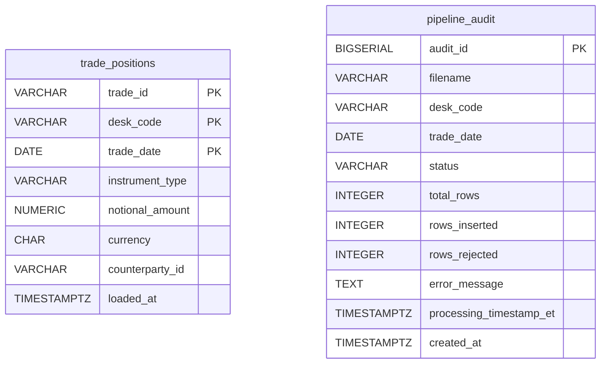
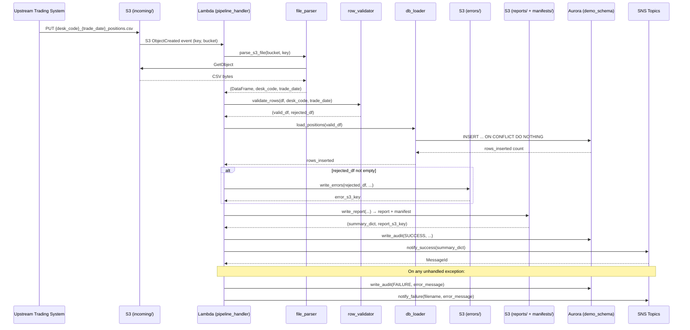

# Technical Design Document

**Project:** Daily Trade Position Ingestion
**Repo:** nartcr/agentic-poc-sandbox
**Change Type:** New Feature
**Document Owner:** Enterprise Data Operations Team
**Date:** June 2026
**Status:** Draft

---

## COMPONENTS

### 1. `pipeline_handler.py` — Lambda Entry Point & Orchestrator

**What it does:**
Serves as the AWS Lambda handler. Receives the S3 event trigger, extracts the bucket name and object key, and orchestrates the full pipeline: file parsing → validation → DB loading → report generation → audit writing → SNS notification. Catches all unhandled exceptions, writes a failure audit record, and publishes a failure SNS notification before re-raising.

**Function signatures:**
```
def handler(event: dict, context: object) -> dict
def _extract_s3_key(event: dict) -> tuple[str, str]  # returns (bucket, key)
def _run_pipeline(bucket: str, key: str) -> dict      # returns summary dict
```

**What it reads:**
- S3 event: `event["Records"][0]["s3"]["bucket"]["name"]`, `event["Records"][0]["s3"]["object"]["key"]`
- Parsed filename to extract `desk_code` and `trade_date` from pattern `{desk_code}_{trade_date}_positions.csv`

**What it writes:**
- Returns `{"statusCode": 200, "body": "OK"}` on success
- Returns `{"statusCode": 500, "body": "<error message>"}` on failure

**Satisfies:** BAC-1, BAC-5, BAC-6

---

### 2. `file_parser.py` — S3 File Reader & CSV Parser

**What it does:**
Downloads the CSV file from S3 using `boto3.client("s3")`. Reads it into a `pandas.DataFrame`. Validates the filename matches the pattern `{desk_code}_{trade_date}_positions.csv` using regex `^([A-Za-z0-9]+)_(\d{4}-\d{2}-\d{2})_positions\.csv$`. Raises `ValueError` with a descriptive message if the filename does not match. Returns the raw DataFrame plus the parsed `desk_code` (str) and `trade_date` (datetime.date) extracted from the filename.

**Function signatures:**
```
def parse_s3_file(bucket: str, key: str) -> tuple[pd.DataFrame, str, datetime.date]
def _validate_filename(filename: str) -> tuple[str, datetime.date]
```

**What it reads:**
- S3 object at `s3://os.environ["S3_BUCKET"]/{key}`
- CSV with expected columns: `trade_id`, `desk_code`, `trade_date`, `instrument_type`, `notional_amount`, `currency`, `counterparty_id`

**What it writes:**
- Returns `(DataFrame, desk_code: str, trade_date: datetime.date)`

**Satisfies:** BAC-1, BAC-6

---

### 3. `row_validator.py` — Per-Row Data Quality Validator

**What it does:**
Accepts a raw `pandas.DataFrame`. For each row, checks all mandatory fields and returns two DataFrames: `valid_df` (rows passing all checks) and `rejected_df` (rows failing at least one check, with an added `rejection_reason` column).

**Validation rules applied in order:**
1. **Mandatory field presence:** `trade_id`, `desk_code`, `trade_date`, `instrument_type`, `notional_amount`, `currency`, `counterparty_id` must be non-null and non-empty string.
2. **`trade_date` format:** Must parse to a valid date (`YYYY-MM-DD`).
3. **`notional_amount` format:** Must be castable to `float`; must not be zero or negative.
4. **`currency` format:** Must be exactly 3 alphabetic characters (matches `^[A-Za-z]{3}$`).
5. **`desk_code` consistency:** Must equal the `desk_code` parsed from the filename; rows with mismatched `desk_code` are rejected with reason `"desk_code mismatch: expected {expected}, got {actual}"`.

The `rejection_reason` string lists all failing rules for the row, separated by `"; "`.

**Function signatures:**
```
def validate_rows(df: pd.DataFrame, expected_desk_code: str, expected_trade_date: datetime.date) -> tuple[pd.DataFrame, pd.DataFrame]
def _check_mandatory_fields(row: pd.Series) -> list[str]
def _check_trade_date(row: pd.Series) -> list[str]
def _check_notional_amount(row: pd.Series) -> list[str]
def _check_currency(row: pd.Series) -> list[str]
def _check_desk_code(row: pd.Series, expected: str) -> list[str]
```

**What it reads:**
- `pd.DataFrame` with columns: `trade_id`, `desk_code`, `trade_date`, `instrument_type`, `notional_amount`, `currency`, `counterparty_id`

**What it writes:**
- `valid_df`: same schema, no `rejection_reason` column
- `rejected_df`: same schema + `rejection_reason: str`

**Satisfies:** BAC-2, BAC-4

---

### 4. `db_loader.py` — Idempotent Database Loader

**What it does:**
Accepts a validated `pd.DataFrame`. Connects to Aurora PostgreSQL using credentials from Secrets Manager (via `secrets_client.py`). Executes a batch `INSERT INTO demo_schema.trade_positions (trade_id, desk_code, trade_date, instrument_type, notional_amount, currency, counterparty_id) VALUES %s ON CONFLICT (trade_id, desk_code, trade_date) DO NOTHING` using `psycopg2.extras.execute_values`. Returns the count of rows actually inserted (i.e., not skipped by the conflict clause) by comparing pre- and post-insert row counts for the given `(desk_code, trade_date)` combination, or by using `mogrify`-based row counting.

**Exact dedup key:** `(trade_id, desk_code, trade_date)` — matches the primary key on `demo_schema.trade_positions`.

**Function signatures:**
```
def load_positions(valid_df: pd.DataFrame) -> int  # returns rows_inserted count
def _get_connection() -> psycopg2.extensions.connection
def _build_insert_tuples(df: pd.DataFrame) -> list[tuple]
```

**What it reads:**
- `valid_df` columns: `trade_id`, `desk_code`, `trade_date`, `instrument_type`, `notional_amount`, `currency`, `counterparty_id`

**What it writes:**
- Rows into `demo_schema.trade_positions` (skips duplicates silently)
- Returns `rows_inserted: int`

**Satisfies:** BAC-1, BAC-3

---

### 5. `secrets_client.py` — Secrets Manager Credential Fetcher

**What it does:**
Retrieves the database credentials from AWS Secrets Manager using `boto3.client("secretsmanager")`. Reads the secret identified by `os.environ["DB_SECRET_ID"]`. Parses the JSON payload and returns a connection parameter dict. Caches the result in a module-level variable so Secrets Manager is only called once per Lambda cold start.

**Function signatures:**
```
def get_db_credentials() -> dict  # returns {"host": str, "port": int, "dbname": str, "username": str, "password": str}
```

**What it reads:**
- `os.environ["DB_SECRET_ID"]` → Secrets Manager secret with JSON keys: `host`, `port`, `dbname`, `username`, `password`

**What it writes:**
- Returns `dict` with connection parameters

**Satisfies:** BAC-8

---

### 6. `report_writer.py` — Summary Report Generator & S3 Writer

**What it does:**
Accepts `valid_df`, `rejected_df`, `desk_code`, `trade_date`, `filename`, and `processing_timestamp` (a `datetime` in ET). Computes the following summary statistics:
- `total_rows`: `len(valid_df) + len(rejected_df)`
- `rows_loaded`: count of successfully inserted rows (passed in as `rows_inserted: int`)
- `rows_rejected`: `len(rejected_df)`
- `processing_timestamp_et`: ISO 8601 string in ET
- `desk_code_counts`: `dict` from `valid_df.groupby("desk_code").size()`
- `notional_min`: `float(valid_df["notional_amount"].min())` — `null` if `valid_df` is empty
- `notional_max`: `float(valid_df["notional_amount"].max())` — `null` if `valid_df` is empty
- `null_rates`: per-column null rate across all rows (both valid and rejected combined), as `{"column_name": float}` where value is fraction `[0.0, 1.0]`

Serializes the summary as JSON and writes it to S3 at:
`reports/{desk_code}_{trade_date}_report_{timestamp_et_yyyymmddTHHMMSS}.json`

Also writes a manifest JSON at the predictable key:
`manifests/{desk_code}_{trade_date}_manifest.json`
with content: `{"report_key": "<full S3 report key>", "error_key": "<full S3 error key or null>", "generated_at_et": "<ISO timestamp>"}`

Returns the summary dict and the S3 report key.

**Function signatures:**
```
def write_report(
    valid_df: pd.DataFrame,
    rejected_df: pd.DataFrame,
    rows_inserted: int,
    desk_code: str,
    trade_date: datetime.date,
    filename: str,
    processing_timestamp: datetime.datetime,
    error_s3_key: str | None
) -> tuple[dict, str]  # returns (summary_dict, report_s3_key)

def _compute_null_rates(df: pd.DataFrame) -> dict[str, float]
def _write_s3_json(bucket: str, key: str, payload: dict) -> None
```

**What it reads:**
- `valid_df`, `rejected_df` DataFrames
- `rows_inserted: int`, `desk_code: str`, `trade_date: datetime.date`, `filename: str`, `processing_timestamp: datetime.datetime`, `error_s3_key: str | None`
- `os.environ["S3_BUCKET"]`

**What it writes:**
- S3: `reports/{desk_code}_{trade_date}_report_{yyyymmddTHHMMSS}.json`
- S3: `manifests/{desk_code}_{trade_date}_manifest.json`
- Returns `(summary_dict: dict, report_s3_key: str)`

**Satisfies:** BAC-4, BAC-7

---

### 7. `error_writer.py` — Rejected Row CSV Writer to S3

**What it does:**
Accepts `rejected_df` (DataFrame with all original columns plus `rejection_reason`), `desk_code`, `trade_date`. If `rejected_df` is empty, writes nothing and returns `None`. Otherwise serializes the DataFrame to CSV (with header row) and uploads to S3 at:
`errors/{desk_code}_{trade_date}_errors_{timestamp_et_yyyymmddTHHMMSS}.csv`

Returns the S3 key of the written error file, or `None` if no rejections.

**Function signatures:**
```
def write_errors(
    rejected_df: pd.DataFrame,
    desk_code: str,
    trade_date: datetime.date,
    processing_timestamp: datetime.datetime
) -> str | None  # returns S3 key or None
```

**What it reads:**
- `rejected_df` columns: `trade_id`, `desk_code`, `trade_date`, `instrument_type`, `notional_amount`, `currency`, `counterparty_id`, `rejection_reason`
- `os.environ["S3_BUCKET"]`

**What it writes:**
- S3: `errors/{desk_code}_{trade_date}_errors_{yyyymmddTHHMMSS}.csv` (CSV, UTF-8, with header)
- Returns the S3 key string or `None`

**Satisfies:** BAC-2

---

### 8. `audit_writer.py` — Pipeline Audit Record Writer

**What it does:**
Accepts the processing outcome and writes a single row to `demo_schema.pipeline_audit`. Uses the same `psycopg2` connection pattern as `db_loader.py` (via `secrets_client.py`). Called once per file — both on success and on failure. On failure, `rows_inserted` and `rows_rejected` default to `0` unless partial counts are available; `error_message` contains the exception string.

**Exact INSERT:**
```sql
INSERT INTO demo_schema.pipeline_audit
  (filename, desk_code, trade_date, status, total_rows, rows_inserted, rows_rejected, error_message, processing_timestamp_et)
VALUES
  (%s, %s, %s, %s, %s, %s, %s, %s, %s)
```

**Function signatures:**
```
def write_audit(
    filename: str,
    desk_code: str | None,
    trade_date: datetime.date | None,
    status: str,            # "SUCCESS" or "FAILURE"
    total_rows: int,
    rows_inserted: int,
    rows_rejected: int,
    error_message: str | None,
    processing_timestamp_et: datetime.datetime
) -> None
```

**What it reads:**
- All parameters passed in
- DB credentials via `secrets_client.get_db_credentials()`

**What it writes:**
- One row into `demo_schema.pipeline_audit`

**Satisfies:** BAC-4, BAC-7 (regulatory audit trail)

---

### 9. `sns_notifier.py` — SNS Success/Failure Publisher

**What it does:**
Publishes JSON messages to SNS. Uses `boto3.client("sns")`. On success, publishes to `os.environ["SNS_SUCCESS_TOPIC_ARN"]`. On failure, publishes to `os.environ["SNS_FAILURE_TOPIC_ARN"]`. Message is a JSON string serialized from the payload dict (see Data Contracts for exact schema).

**Function signatures:**
```
def notify_success(summary: dict) -> None
def notify_failure(filename: str, error_message: str, processing_timestamp_et: datetime.datetime) -> None
```

**What it reads:**
- `os.environ["SNS_SUCCESS_TOPIC_ARN"]`
- `os.environ["SNS_FAILURE_TOPIC_ARN"]`

**What it writes:**
- SNS message to success or failure topic

**Satisfies:** BAC-5

---

### 10. `time_utils.py` — Eastern Time Utilities

**What it does:**
Provides a single source of truth for all timestamp generation. Uses `pytz.timezone("America/Toronto")`. Exposes a function to get the current datetime in ET and a function to convert a UTC datetime to ET.

**Function signatures:**
```
def now_et() -> datetime.datetime          # returns timezone-aware datetime in America/Toronto
def to_et(dt: datetime.datetime) -> datetime.datetime  # converts any tz-aware datetime to ET
def format_et(dt: datetime.datetime) -> str            # returns ISO 8601 string e.g. "2026-06-15T21:34:00-04:00"
def format_et_compact(dt: datetime.datetime) -> str    # returns "20260615T213400" for use in S3 keys
```

**Satisfies:** BAC-7

---

## AWS SERVICES

| Service | Role |
|---|---|
| **AWS Lambda** | Compute runtime. Function `agentic-poc-sandbox-qa` is triggered by S3 event notifications on the `incoming/` prefix. Orchestrates the full pipeline per file. |
| **Amazon S3** | Durable file storage. Bucket `agentic-poc-533266968934` hosts: incoming position files (`incoming/`), error files (`errors/`), summary reports (`reports/`), and manifests (`manifests/`). |
| **Amazon Aurora PostgreSQL** | Relational reporting database. Schema `demo_schema`, database `app`. Hosts `trade_positions` (the deduplicated position store) and `pipeline_audit` (the audit trail). |
| **AWS Secrets Manager** | Secure credential store. Secret `agentic-poc-aurora` holds DB connection parameters. Retrieved at cold-start, cached in memory. No credentials in code. |
| **Amazon SNS** | Event notification bus. Two topics: success (`agentic-poc-success`) and failure (`agentic-poc-failure`). Downstream risk pipeline subscribes to the success topic to auto-trigger next processing step. |

---

## DATA CONTRACTS

### Database Tables

#### `demo_schema.trade_positions`

| Column | Type | Nullable | Default | Notes |
|---|---|---|---|---|
| `trade_id` | `VARCHAR(100)` | NOT NULL | — | Part of PK |
| `desk_code` | `VARCHAR(50)` | NOT NULL | — | Part of PK |
| `trade_date` | `DATE` | NOT NULL | — | Part of PK |
| `instrument_type` | `VARCHAR(100)` | NOT NULL | — | |
| `notional_amount` | `NUMERIC(20,4)` | NOT NULL | — | |
| `currency` | `CHAR(3)` | NOT NULL | — | |
| `counterparty_id` | `VARCHAR(100)` | NOT NULL | — | |
| `loaded_at` | `TIMESTAMPTZ` | NOT NULL | `now()` | Set by DB on insert |

**Primary Key:** `(trade_id, desk_code, trade_date)`
**Unique Constraint:** PK enforces deduplication
**Index:** PK index on `(trade_id, desk_code, trade_date)`



---

#### `demo_schema.pipeline_audit`

| Column | Type | Nullable | Default | Notes |
|---|---|---|---|---|
| `audit_id` | `BIGSERIAL` | NOT NULL | auto | PK, auto-increment |
| `filename` | `VARCHAR(255)` | NOT NULL | — | Full S3 key of processed file |
| `desk_code` | `VARCHAR(50)` | NULL | — | Null if filename parse fails |
| `trade_date` | `DATE` | NULL | — | Null if filename parse fails |
| `status` | `VARCHAR(20)` | NOT NULL | — | `"SUCCESS"` or `"FAILURE"` |
| `total_rows` | `INTEGER` | NOT NULL | `0` | |
| `rows_inserted` | `INTEGER` | NOT NULL | `0` | |
| `rows_rejected` | `INTEGER` | NOT NULL | `0` | |
| `error_message` | `TEXT` | NULL | — | Populated only on failure |
| `processing_timestamp_et` | `TIMESTAMPTZ` | NOT NULL | — | ET timezone-aware |
| `created_at` | `TIMESTAMPTZ` | NOT NULL | `now()` | Set by DB on insert |

**Primary Key:** `(audit_id)`

---

### S3 Paths

| Logical Name | Key Pattern | Format | Description |
|---|---|---|---|
| Incoming position file | `incoming/{desk_code}_{trade_date}_positions.csv` | CSV, UTF-8, with header | Deposited by upstream trading systems |
| Error file | `errors/{desk_code}_{trade_date}_errors_{yyyymmddTHHMMSS}.csv` | CSV, UTF-8, with header | Rejected rows with `rejection_reason` column |
| Summary report | `reports/{desk_code}_{trade_date}_report_{yyyymmddTHHMMSS}.json` | JSON | Processing summary (see schema below) |
| Manifest | `manifests/{desk_code}_{trade_date}_manifest.json` | JSON | Maps logical names to actual S3 keys |

**All paths are within bucket:** `os.environ["S3_BUCKET"]` = `agentic-poc-533266968934`

**Summary Report JSON schema** (`reports/*.json`):
```json
{
  "filename": "string",
  "desk_code": "string",
  "trade_date": "YYYY-MM-DD",
  "processing_timestamp_et": "ISO 8601 string",
  "total_rows": 0,
  "rows_loaded": 0,
  "rows_rejected": 0,
  "desk_code_counts": {"DESK_A": 0},
  "notional_min": 0.0,
  "notional_max": 0.0,
  "null_rates": {
    "trade_id": 0.0,
    "desk_code": 0.0,
    "trade_date": 0.0,
    "instrument_type": 0.0,
    "notional_amount": 0.0,
    "currency": 0.0,
    "counterparty_id": 0.0
  }
}
```

**Manifest JSON schema** (`manifests/{desk_code}_{trade_date}_manifest.json`):
```json
{
  "report_key": "reports/DESK_A_2026-06-15_report_20260615T213400.json",
  "error_key": "errors/DESK_A_2026-06-15_errors_20260615T213400.csv",
  "generated_at_et": "2026-06-15T21:34:00-04:00"
}
```
`error_key` is `null` if there are no rejected rows.

---

### Secrets Manager

**Env var:** `DB_SECRET_ID` = `agentic-poc-aurora`

**Expected JSON keys inside the secret:**
```json
{
  "host": "string",
  "port": 5432,
  "dbname": "app",
  "username": "string",
  "password": "string"
}
```

---

### SNS Topics

**Env vars:**
- `SNS_SUCCESS_TOPIC_ARN` = `arn:aws:sns:us-east-1:533266968934:agentic-poc-success`
- `SNS_FAILURE_TOPIC_ARN` = `arn:aws:sns:us-east-1:533266968934:agentic-poc-failure`

**Success message JSON structure:**
```json
{
  "event_type": "TRADE_POSITIONS_LOADED",
  "filename": "string",
  "desk_code": "string",
  "trade_date": "YYYY-MM-DD",
  "processing_timestamp_et": "ISO 8601 string",
  "total_rows": 0,
  "rows_loaded": 0,
  "rows_rejected": 0,
  "report_s3_key": "string"
}
```

**Failure message JSON structure:**
```json
{
  "event_type": "TRADE_POSITIONS_FAILED",
  "filename": "string",
  "error_message": "string",
  "processing_timestamp_et": "ISO 8601 string"
}
```

---

### Environment Variables Summary

| Variable Name | Value (from infra config) | Used By |
|---|---|---|
| `S3_BUCKET` | `agentic-poc-533266968934` | `file_parser.py`, `error_writer.py`, `report_writer.py` |
| `DB_SECRET_ID` | `agentic-poc-aurora` | `secrets_client.py` |
| `SNS_SUCCESS_TOPIC_ARN` | `arn:aws:sns:us-east-1:533266968934:agentic-poc-success` | `sns_notifier.py` |
| `SNS_FAILURE_TOPIC_ARN` | `arn:aws:sns:us-east-1:533266968934:agentic-poc-failure` | `sns_notifier.py` |

---

## DATA FLOW

### End-to-End Pipeline Flow



---

### Validation Decision Logic

```mermaid
flowchart TD
    A[Raw CSV Row] --> B{All mandatory fields present and non-empty?}
    B -- No --> REJECT1[Add reason: missing field name]
    B -- Yes --> C{trade_date parses as YYYY-MM-DD?}
    C -- No --> REJECT2[Add reason: invalid trade_date format]
    C -- Yes --> D{notional_amount is numeric and > 0?}
    D -- No --> REJECT3[Add reason: invalid notional_amount]
    D -- Yes --> E{currency matches ^[A-Za-z]{3}$?}
    E -- No --> REJECT4[Add reason: invalid currency format]
    E -- Yes --> F{desk_code matches filename desk_code?}
    F -- No --> REJECT5[Add reason: desk_code mismatch]
    F -- Yes --> VALID[Row → valid_df]

    REJECT1 & REJECT2 & REJECT3 & REJECT4 & REJECT5 --> COLLECT[Collect all reasons for row]
    COLLECT --> REJECTED[Row → rejected_df with rejection_reason]
```

> **Note:** All validation rules are evaluated. Multiple failures per row are concatenated with `"; "` as separator in `rejection_reason`.

---

### Deduplication Logic

```
Algorithm: Idempotent Insert

INPUT: valid_df (N rows), each row has (trade_id, desk_code, trade_date, ...)
DATABASE: demo_schema.trade_positions, PRIMARY KEY (trade_id, desk_code, trade_date)

STEP 1: Convert valid_df to list of tuples: [(trade_id, desk_code, trade_date, instrument_type, notional_amount, currency, counterparty_id), ...]
STEP 2: Execute psycopg2 execute_values():
    INSERT INTO demo_schema.trade_positions
        (trade_id, desk_code, trade_date, instrument_type, notional_amount, currency, counterparty_id)
    VALUES %s
    ON CONFLICT (trade_id, desk_code, trade_date) DO NOTHING
STEP 3: rows_inserted = cursor.rowcount  (reflects only newly inserted rows)
STEP 4: COMMIT
RETURN rows_inserted
```

---

### S3 Key Structure

```mermaid
flowchart LR
    subgraph S3 Bucket: agentic-poc-533266968934
        A[incoming/\n{desk_code}_{trade_date}_positions.csv]
        B[errors/\n{desk_code}_{trade_date}_errors_{ts}.csv]
        C[reports/\n{desk_code}_{trade_date}_report_{ts}.json]
        D[manifests/\n{desk_code}_{trade_date}_manifest.json]
    end
    A -->|triggers Lambda| E[Lambda Pipeline]
    E -->|rejected rows| B
    E -->|summary stats| C
    E -->|key mapping| D
```

---

## TECHNICAL ACCEPTANCE CRITERIA

### TAC-1 (from BAC-1): All valid positions loaded before morning risk run

- `db_loader.load_positions(valid_df)` executes `INSERT INTO demo_schema.trade_positions ... ON CONFLICT (trade_id, desk_code, trade_date) DO NOTHING` using `psycopg2.extras.execute_values`.
- Acceptance test: After `load_positions()` returns, a `SELECT COUNT(*) FROM demo_schema.trade_positions WHERE desk_code = %s AND trade_date = %s` must equal the count of distinct `(trade_id, desk_code, trade_date)` tuples in `valid_df`.
- Lambda completes and commits to Aurora within 60 seconds for a 10,000-row file (measured via CloudWatch duration metric).

### TAC-2 (from BAC-2): Invalid records flagged with clear reasons

- `row_validator.validate_rows()` produces `rejected_df` with a `rejection_reason` column.
- `rejection_reason` is a non-empty string enumerating all failed checks separated by `"; "` (e.g., `"missing notional_amount; invalid currency format"`).
- `error_writer.write_errors()` writes this DataFrame to `errors/{desk_code}_{trade_date}_errors_{ts}.csv` with header row including `rejection_reason` column.
- Acceptance test: For a file with known bad rows, assert `rejected_df["rejection_reason"].notna().all()` and assert the error CSV exists in S3 at the expected prefix with the expected columns.

### TAC-3 (from BAC-3): Resubmitting a file does not double-count positions

- `db_loader.load_positions()` uses `ON CONFLICT (trade_id, desk_code, trade_date) DO NOTHING`.
- Acceptance test: Load the same `valid_df` twice. Assert that `SELECT COUNT(*) FROM demo_schema.trade_positions WHERE desk_code = %s AND trade_date = %s` returns the same value after the second load as after the first. Assert `rows_inserted == 0` on the second call.

### TAC-4 (from BAC-4): Summary report accurately reflects received, accepted, rejected counts

- `report_writer.write_report()` computes:
  - `total_rows = len(valid_df) + len(rejected_df)`
  - `rows_loaded = rows_inserted` (integer returned by `db_loader.load_positions()`)
  - `rows_rejected = len(rejected_df)`
- The JSON report written to `reports/` must contain all fields defined in the Summary Report JSON schema in Data Contracts.
- Acceptance test: Given a file with N total rows, R rejected rows, and I inserted rows, assert the report JSON contains `total_rows == N`, `rows_rejected == R`, `rows_loaded == I`.
- `pipeline_audit` record must also reflect identical counts.

### TAC-5 (from BAC-5): Risk pipeline automatically notified — no manual trigger

- `sns_notifier.notify_success(summary)` is called unconditionally by `pipeline_handler` after a successful file run.
- `sns_notifier.notify_failure(...)` is called in the exception handler before re-raise.
- Acceptance test: Mock `boto3.client("sns").publish`. Assert it is called exactly once per pipeline run with the correct `TopicArn` (`SNS_SUCCESS_TOPIC_ARN` on success, `SNS_FAILURE_TOPIC_ARN` on failure) and a valid JSON `Message` body matching the schema in Data Contracts.

### TAC-6 (from BAC-6): Processing completes within the operations window

- Lambda function must complete processing of a 10,000-row file in ≤ 60 seconds (wall clock).
- Acceptance test: Integration test with a synthetic 10,000-row file asserts Lambda duration (measured from handler entry to return) ≤ 60,000 ms. CloudWatch metric `Duration` for the Lambda function must not exceed 60,000 ms for test invocations.
- Lambda timeout must be configured ≥ 120 seconds to handle up to 100,000-row files without timeout kill.

### TAC-7 (from BAC-7): All timestamps in Eastern Time for regulatory audit

- `time_utils.now_et()` uses `pytz.timezone("America/Toronto")` exclusively. UTC is never stored directly.
- `pipeline_audit.processing_timestamp_et` is populated with the ET-aware timestamp from `time_utils.now_et()`.
- `report_writer` uses `time_utils.format_et()` for the `processing_timestamp_et` field in the JSON report.
- S3 key timestamps use `time_utils.format_et_compact()`.
- Acceptance test: Assert `processing_timestamp_et` stored in `pipeline_audit` has `tzinfo` corresponding to `America/Toronto`. Assert report JSON field `processing_timestamp_et` contains offset `-04:00` or `-05:00` (seasonal). Assert S3 report and error keys contain a timestamp string matching `\d{8}T\d{6}`.

### TAC-8 (from BAC-8): No secrets in code or config files

- `secrets_client.get_db_credentials()` is the only location where DB credentials are accessed. It reads from `os.environ["DB_SECRET_ID"]` and calls `boto3.client("secretsmanager").get_secret_value()`.
- No passwords, tokens, or connection strings appear in any `.py` file, environment variable value (beyond the secret ID reference), or committed configuration file.
- Acceptance test: Static analysis (grep) of the entire codebase for the patterns `password\s*=\s*["']`, `host\s*=\s*["']`, and any known credential strings must return zero matches. Code review gate enforces this.

---

## OPEN QUESTIONS

None.

All infrastructure configuration is resolved from the provided infrastructure config YAML. All business logic ambiguities are either fully specified in the BRD or resolved through reasonable assumptions documented below.

---

## ASSUMPTIONS

1. **Lambda trigger:** The Lambda function `agentic-poc-sandbox-qa` is already configured with an S3 event notification trigger on the `incoming/` prefix for `ObjectCreated` events on bucket `agentic-poc-533266968934`. The pipeline code does not need to configure this trigger.

2. **`cursor.rowcount` for inserted count:** `psycopg2`'s `execute_values` sets `cursor.rowcount` to the number of rows affected (inserted), not the number skipped. The `ON CONFLICT DO NOTHING` clause means skipped rows are not counted. This is used directly as `rows_inserted`.

3. **File encoding:** Incoming CSV files are UTF-8 encoded. If the upstream system deposits files in a different encoding, a separate pre-processing step would be required (not in scope here).

4. **One file per Lambda invocation:** Each S3 `ObjectCreated` event corresponds to exactly one file. The pipeline processes one file per invocation. Concurrent Lambda invocations handle concurrent files independently.

5. **`trade_date` field in CSV rows:** Each CSV row contains a `trade_date` field that must match the `trade_date` parsed from the filename. Rows where `trade_date` differs from the filename date are not explicitly rejected on this basis alone — the `desk_code` consistency check is applied but `trade_date` consistency is validated by format only (not cross-checked against the filename date). If business requires strict date matching, this would need clarification. *Assumption: only `desk_code` is cross-checked against the filename; `trade_date` in rows is validated for format only.*

6. **`notional_amount` must be > 0:** Rows with zero or negative `notional_amount` are rejected. If legitimate zero-notional instruments exist (e.g., unfunded commitments), this rule would need relaxation. *Assumption: all valid notional amounts are strictly positive.*

7. **Error file is always written when rejections exist:** Even a single rejected row produces an error CSV in S3. The manifest always references the error key (or `null` if none).

8. **Manifest is overwritten on reprocessing:** Because the manifest key is predictable (`manifests/{desk_code}_{trade_date}_manifest.json`), reprocessing the same file overwrites the previous manifest with the new report and error keys. This is intentional for idempotency.

9. **Lambda memory and timeout:** Assumed Lambda is configured with sufficient memory (≥ 512 MB) and timeout (≥ 120 seconds) to handle up to 100,000-row files. Actual configuration is a deployment concern, not a code concern.

10. **Database connectivity:** The Lambda function runs in a VPC or has network access to the Aurora cluster. VPC configuration is pre-existing infrastructure.

11. **`loaded_at` column:** This column is set by the database default `now()` on insert. The application does not explicitly supply this value.

12. **Partial failure handling:** If the DB insert succeeds but the S3 report write fails, the audit record will reflect `FAILURE` and the SNS failure notification will fire. The positions are already committed to Aurora (no rollback). This is acceptable given the idempotency guarantee — reprocessing will skip already-inserted rows and regenerate the report.

13. **`null_rates` computed across all rows:** Null rates are computed over the union of `valid_df` and `rejected_df` (all rows received) to give the operations team a complete picture of data quality for the file.

14. **SNS message size:** Summary payloads are expected to be well within SNS's 256 KB message size limit given the structure defined. No truncation logic is required.