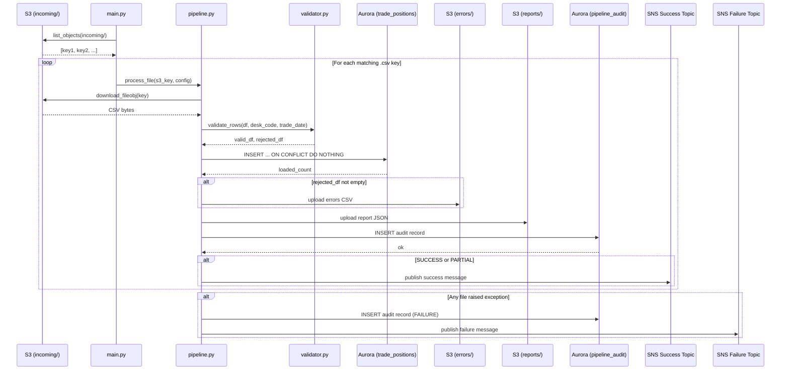
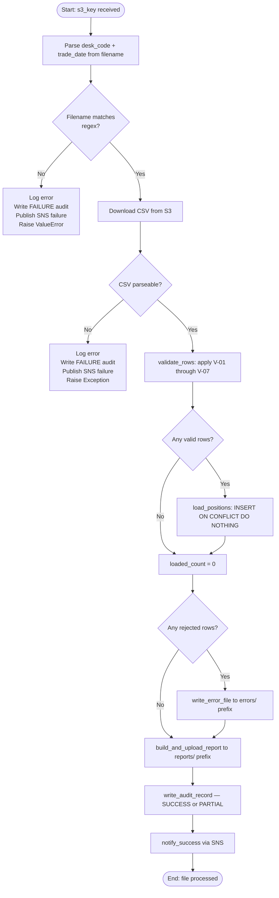
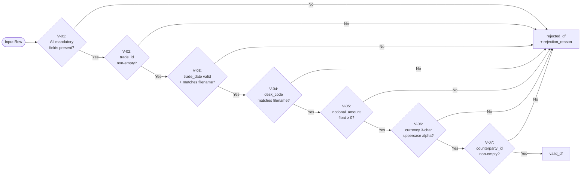

# Technical Design Document

**Project:** Daily Trade Position Ingestion
**Repo:** nartcr/agentic-poc-sandbox
**Change Type:** New Feature
**Document Date:** June 2026
**Status:** Draft

---

## COMPONENTS

### `src/config.py`
**Purpose:** Centralises all environment-variable reads and static constants. Every other module imports from here — no other module calls `os.environ` directly.

**What it reads:**
- `os.environ["DB_SECRET_ID"]` → Secrets Manager secret ID for Aurora credentials
- `os.environ["S3_BUCKET"]` → S3 bucket name
- `os.environ["SNS_SUCCESS_ARN"]` → SNS ARN for success notifications
- `os.environ["SNS_FAILURE_ARN"]` → SNS ARN for failure notifications
- `os.environ["DB_SCHEMA"]` → database schema name (default: `demo_schema`)
- `os.environ["DB_NAME"]` → database name (default: `app`)

**What it writes:** Nothing. Exports a typed `Config` dataclass instance populated at import time.

**Constants exported:**
- `INPUT_PREFIX = "incoming/"`
- `ERROR_PREFIX = "errors/"`
- `REPORT_PREFIX = "reports/"`
- `POSITIONS_TABLE = "demo_schema.trade_positions"`
- `AUDIT_TABLE = "demo_schema.pipeline_audit"`
- `TIMEZONE = pytz.timezone("America/Toronto")`
- `MANDATORY_FIELDS = ["trade_id", "desk_code", "trade_date", "instrument_type", "notional_amount", "currency", "counterparty_id"]`

**Satisfies:** BAC-7, BAC-8

---

### `src/secrets.py`
**Purpose:** Fetches and parses database credentials from AWS Secrets Manager at runtime. Returns a plain dict with connection parameters. Never caches credentials to disk.

**Function signature:**
```
get_db_credentials(secret_id: str) -> dict
```

**What it reads:** AWS Secrets Manager secret at `secret_id`. Expected JSON keys: `host`, `port`, `username`, `password`, `dbname`.

**What it writes:** Nothing persisted. Returns `{"host": str, "port": int, "username": str, "password": str, "dbname": str}`.

**Error behaviour:** Raises `RuntimeError` with a sanitised message (no credential values) if the secret cannot be retrieved or parsed.

**Satisfies:** BAC-8

---

### `src/s3_client.py`
**Purpose:** Thin wrapper around `boto3` S3 operations used by the pipeline. Abstracts list, download, upload, and copy operations. All callers use this module — never raw `boto3` S3 calls in business logic.

**Function signatures:**
```
list_objects(bucket: str, prefix: str) -> list[str]
download_fileobj(bucket: str, key: str) -> io.BytesIO
upload_bytes(bucket: str, key: str, data: bytes, content_type: str) -> None
```

**What it reads:** S3 bucket/key coordinates from callers. Infers bucket from `Config`.

**What it writes:** Nothing to persistent state beyond the S3 calls themselves. Returns raw byte streams for consumed objects.

**Satisfies:** BAC-1, BAC-2, BAC-4

---

### `src/validator.py`
**Purpose:** Accepts a raw `pandas.DataFrame` parsed from a position CSV and applies per-row validation rules. Returns two DataFrames: `valid_df` (rows that passed all checks) and `rejected_df` (rows that failed, with an added `rejection_reason` column).

**Function signature:**
```
validate_rows(df: pd.DataFrame, desk_code_from_filename: str, trade_date_from_filename: str) -> tuple[pd.DataFrame, pd.DataFrame]
```

**Validation rules applied in order (first failing rule wins):**

| Rule ID | Field(s) | Check | `rejection_reason` value |
|---------|----------|-------|--------------------------|
| V-01 | All mandatory fields | Any mandatory field null or empty string | `"MISSING_FIELD:<field_name>"` |
| V-02 | `trade_id` | Non-empty string, no whitespace-only | `"INVALID_TRADE_ID"` |
| V-03 | `trade_date` | Parseable as `YYYY-MM-DD`; matches `trade_date_from_filename` | `"INVALID_TRADE_DATE"` |
| V-04 | `desk_code` | Matches `desk_code_from_filename` | `"DESK_CODE_MISMATCH"` |
| V-05 | `notional_amount` | Parseable as float; not null, not negative | `"INVALID_NOTIONAL_AMOUNT"` |
| V-06 | `currency` | 3-character uppercase alpha string (ISO 4217 format check) | `"INVALID_CURRENCY"` |
| V-07 | `counterparty_id` | Non-empty string | `"MISSING_COUNTERPARTY_ID"` |

**What it reads:** `pd.DataFrame` with columns: `trade_id`, `desk_code`, `trade_date`, `instrument_type`, `notional_amount`, `currency`, `counterparty_id`. Plus `desk_code_from_filename: str` and `trade_date_from_filename: str` derived from the filename at call time.

**What it writes:** Returns `(valid_df: pd.DataFrame, rejected_df: pd.DataFrame)`. `rejected_df` includes all original columns plus `rejection_reason: str`.

**Satisfies:** BAC-2

---

### `src/loader.py`
**Purpose:** Receives a validated `pd.DataFrame`, connects to Aurora PostgreSQL using credentials from `secrets.py`, and performs an idempotent bulk insert into `demo_schema.trade_positions`. Returns the count of rows actually inserted (rows skipped due to conflict are not counted).

**Function signature:**
```
load_positions(valid_df: pd.DataFrame, credentials: dict) -> int
```

**Insert logic:**
```sql
INSERT INTO demo_schema.trade_positions
    (trade_id, desk_code, trade_date, instrument_type,
     notional_amount, currency, counterparty_id, loaded_at)
VALUES %s
ON CONFLICT (trade_id, desk_code, trade_date) DO NOTHING
```
Uses `psycopg2.extras.execute_values` for batch performance. `loaded_at` is set to `datetime.now(tz=pytz.timezone("America/Toronto"))` at the time of the insert call.

**What it reads:** `valid_df` columns: `trade_id`, `desk_code`, `trade_date`, `instrument_type`, `notional_amount`, `currency`, `counterparty_id`. `credentials` dict from `secrets.py`.

**What it writes:** Rows into `demo_schema.trade_positions`. Returns `int` (inserted count, not total attempted).

**Satisfies:** BAC-1, BAC-3

---

### `src/reporter.py`
**Purpose:** Constructs the post-load summary report as a JSON document from processing statistics. Uploads the report to S3 under the `reports/` prefix. Returns the report dict for use in SNS notification payloads.

**Function signature:**
```
build_and_upload_report(
    source_key: str,
    total_rows: int,
    loaded_rows: int,
    rejected_rows: int,
    valid_df: pd.DataFrame,
    rejected_df: pd.DataFrame,
    processing_timestamp: datetime,
    bucket: str
) -> dict
```

**Report JSON structure:**
```json
{
  "source_file": "<S3 key of the input file>",
  "processing_timestamp": "<ISO-8601 in ET, e.g. 2026-06-15T19:05:32-04:00>",
  "total_rows_received": 1000,
  "rows_loaded": 950,
  "rows_rejected": 50,
  "rows_by_desk_code": {"DESK_A": 500, "DESK_B": 450},
  "notional_amount_min": 100.00,
  "notional_amount_max": 9500000.00,
  "null_rates_by_column": {
    "trade_id": 0.00,
    "desk_code": 0.00,
    "trade_date": 0.00,
    "instrument_type": 0.02,
    "notional_amount": 0.00,
    "currency": 0.00,
    "counterparty_id": 0.01
  }
}
```

**S3 upload key pattern:** `reports/{desk_code}_{trade_date}_report.json`
(e.g. `reports/EQDSK_2026-06-15_report.json`)

**What it reads:** Processing-stage statistics and DataFrames passed as arguments; `bucket` from `Config`.

**What it writes:** JSON report to S3 at `reports/{desk_code}_{trade_date}_report.json`. Returns the report `dict`.

**Satisfies:** BAC-4, BAC-7

---

### `src/error_writer.py`
**Purpose:** Serialises the `rejected_df` DataFrame (rows that failed validation) to a CSV file and uploads it to S3 under the `errors/` prefix. Each row in the output CSV includes all original input columns plus the `rejection_reason` column.

**Function signature:**
```
write_error_file(rejected_df: pd.DataFrame, desk_code: str, trade_date: str, bucket: str) -> str
```

**S3 upload key pattern:** `errors/{desk_code}_{trade_date}_errors.csv`
(e.g. `errors/EQDSK_2026-06-15_errors.csv`)

**Output CSV columns (in order):** `trade_id`, `desk_code`, `trade_date`, `instrument_type`, `notional_amount`, `currency`, `counterparty_id`, `rejection_reason`

**What it reads:** `rejected_df` DataFrame; `desk_code: str`, `trade_date: str` (parsed from filename); `bucket` from `Config`.

**What it writes:** CSV to `errors/{desk_code}_{trade_date}_errors.csv`. Returns the S3 key string.

**Satisfies:** BAC-2

---

### `src/notifier.py`
**Purpose:** Publishes SNS messages for both success and failure events. Uses two separate topics. Never raises on publish failure — logs the error and returns.

**Function signatures:**
```
notify_success(report: dict, sns_success_arn: str) -> None
notify_failure(source_key: str, error_message: str, sns_failure_arn: str) -> None
```

**Success message JSON structure:**
```json
{
  "event": "TRADE_POSITIONS_LOADED",
  "source_file": "<S3 key>",
  "processing_timestamp": "<ISO-8601 ET>",
  "total_rows_received": 1000,
  "rows_loaded": 950,
  "rows_rejected": 50,
  "report_s3_key": "reports/<desk_code>_<trade_date>_report.json"
}
```

**Failure message JSON structure:**
```json
{
  "event": "TRADE_POSITIONS_FAILED",
  "source_file": "<S3 key>",
  "processing_timestamp": "<ISO-8601 ET>",
  "error_message": "<sanitised error description>"
}
```

**What it reads:** Report dict (success path) or error string (failure path); ARNs from `Config`.

**What it writes:** SNS publish call. No persistent writes.

**Satisfies:** BAC-5

---

### `src/audit.py`
**Purpose:** Writes one row to `demo_schema.pipeline_audit` after each file is fully processed. Captures the complete processing outcome for regulatory audit trail.

**Function signature:**
```
write_audit_record(
    credentials: dict,
    source_key: str,
    desk_code: str,
    trade_date: str,
    outcome: str,           # "SUCCESS" | "PARTIAL" | "FAILURE"
    total_rows: int,
    loaded_rows: int,
    rejected_rows: int,
    error_detail: str | None,
    processed_at: datetime
) -> None
```

**Insert statement:**
```sql
INSERT INTO demo_schema.pipeline_audit
    (source_key, desk_code, trade_date, outcome,
     total_rows, loaded_rows, rejected_rows,
     error_detail, processed_at, service_name)
VALUES (%s, %s, %s, %s, %s, %s, %s, %s, %s, %s)
```
`service_name` is set to the constant string `"trade-position-ingestion"`.

**What it reads:** All parameters listed in the signature. `credentials` dict from `secrets.py`.

**What it writes:** One row to `demo_schema.pipeline_audit`.

**Satisfies:** BAC-7 (ET timestamps), regulatory audit trail (NFR 3.3)

---

### `src/pipeline.py`
**Purpose:** Orchestrates the end-to-end processing of a single position file. Called by the entry point with a fully-resolved S3 key. Coordinates: download → parse → validate → load → write errors → report → audit → notify.

**Function signature:**
```
process_file(s3_key: str, config: Config) -> None
```

**Filename parsing logic:** The filename component of `s3_key` must match the regex `^([A-Z0-9]+)_(\d{4}-\d{2}-\d{2})_positions\.csv$`. Raises `ValueError` with a descriptive message if the filename does not match.

**Processing steps (in order):**
1. Parse `desk_code` and `trade_date` from filename.
2. Download file bytes from S3.
3. Parse CSV into `pd.DataFrame`. If parse fails, go to failure path.
4. Call `validate_rows(df, desk_code, trade_date)` → `valid_df`, `rejected_df`.
5. Call `load_positions(valid_df, credentials)` → `loaded_count`.
6. If `len(rejected_df) > 0`, call `write_error_file(...)`.
7. Call `build_and_upload_report(...)`.
8. Call `write_audit_record(...)` with `outcome="SUCCESS"` if `loaded_count > 0` or `len(valid_df) == 0`; `outcome="PARTIAL"` if both `loaded_count > 0` and `len(rejected_df) > 0`; `outcome="FAILURE"` only on exception.
9. Call `notify_success(report, ...)`.
10. On any unhandled exception: call `write_audit_record(outcome="FAILURE", ...)`, call `notify_failure(...)`, re-raise.

**What it reads:** S3 key string; `Config` object.

**What it writes:** Orchestrates writes to Aurora, S3 error file, S3 report file, audit table, and SNS — all via the specialist modules above.

**Satisfies:** BAC-1, BAC-2, BAC-3, BAC-4, BAC-5, BAC-6

---

### `src/main.py`
**Purpose:** Entry point. Lists all CSV objects under the `incoming/` S3 prefix that match the filename convention `^([A-Z0-9]+)_(\d{4}-\d{2}-\d{2})_positions\.csv$`. For each matching key, calls `pipeline.process_file(s3_key, config)`. Logs total files found, processed, and any failures. If any file fails, continues processing remaining files and exits with a non-zero return code after all files are attempted.

**Function signature:**
```
main() -> int
```

**What it reads:** S3 `incoming/` prefix via `s3_client.list_objects`. Config from `config.py`.

**What it writes:** Calls `pipeline.process_file` for each discovered file. Returns exit code `0` (all succeeded) or `1` (one or more failures).

**Satisfies:** BAC-1, BAC-5, BAC-6

---

### `tests/test_validator.py`
**Purpose:** Unit tests for all validation rules in `validator.py`. Tests each V-0X rule in isolation with a known DataFrame. Confirms `rejection_reason` values match the exact strings specified in the validator contract.

### `tests/test_loader.py`
**Purpose:** Integration tests for `loader.py` using a test database or mock. Verifies `ON CONFLICT DO NOTHING` behaviour by inserting the same row twice and asserting the returned count is `1` on first insert and `0` on second insert. Confirms `loaded_at` is an ET-timezone-aware datetime.

### `tests/test_pipeline.py`
**Purpose:** End-to-end tests for `pipeline.process_file` using mocked AWS clients. Verifies the orchestration order and that each downstream module is called with the correct arguments. Covers the error path (exception in `load_positions` triggers `notify_failure`).

### `tests/test_reporter.py`
**Purpose:** Unit tests for `reporter.py`. Asserts null rate computation, min/max notional, desk-grouped counts, and that `processing_timestamp` is in ET (offset `-04:00` or `-05:00` depending on DST).

---

## AWS SERVICES

| Service | Role |
|---------|------|
| **Amazon S3** | Input file landing zone (`incoming/`), error file storage (`errors/`), report storage (`reports/`) |
| **Amazon Aurora PostgreSQL** | Target reporting database hosting `demo_schema.trade_positions` and `demo_schema.pipeline_audit` |
| **AWS Secrets Manager** | Runtime credential storage for Aurora connection parameters |
| **Amazon SNS** | Event notification for success and failure events to downstream systems (risk calculation pipeline) |
| **Amazon CloudWatch Logs** | All application `logging` output is directed here via the execution environment's log group |

---

## DATA CONTRACTS

### Database Tables

#### `demo_schema.trade_positions`

```
Table: demo_schema.trade_positions

Column              Data Type               Constraints
------------------  ----------------------  ------------------------------------------
trade_id            VARCHAR(100)            NOT NULL
desk_code           VARCHAR(50)             NOT NULL
trade_date          DATE                    NOT NULL
instrument_type     VARCHAR(100)            NOT NULL
notional_amount     NUMERIC(20, 4)          NOT NULL
currency            CHAR(3)                 NOT NULL
counterparty_id     VARCHAR(100)            NOT NULL
loaded_at           TIMESTAMPTZ             NOT NULL

Primary Key:        (trade_id, desk_code, trade_date)
Unique Constraint:  UNIQUE (trade_id, desk_code, trade_date)   -- enforces ON CONFLICT target
Index:              idx_trade_positions_trade_date ON demo_schema.trade_positions (trade_date)
Index:              idx_trade_positions_desk_code  ON demo_schema.trade_positions (desk_code)
```

#### `demo_schema.pipeline_audit`

```
Table: demo_schema.pipeline_audit

Column              Data Type               Constraints
------------------  ----------------------  ------------------------------------------
audit_id            BIGSERIAL               PRIMARY KEY
source_key          VARCHAR(500)            NOT NULL
desk_code           VARCHAR(50)             NOT NULL
trade_date          DATE                    NOT NULL
outcome             VARCHAR(20)             NOT NULL  -- CHECK IN ('SUCCESS','PARTIAL','FAILURE')
total_rows          INTEGER                 NOT NULL
loaded_rows         INTEGER                 NOT NULL
rejected_rows       INTEGER                 NOT NULL
error_detail        TEXT                    NULL
processed_at        TIMESTAMPTZ             NOT NULL
service_name        VARCHAR(100)            NOT NULL

Index:              idx_pipeline_audit_trade_date ON demo_schema.pipeline_audit (trade_date)
Index:              idx_pipeline_audit_outcome    ON demo_schema.pipeline_audit (outcome)
```

---

### S3 Paths

```
Bucket:   os.environ["S3_BUCKET"]   (e.g. agentic-poc-data-533266968934)

Input files:
  Prefix:  incoming/
  Pattern: incoming/{DESK_CODE}_{YYYY-MM-DD}_positions.csv
  Format:  UTF-8 CSV with header row
  Columns: trade_id, desk_code, trade_date, instrument_type,
           notional_amount, currency, counterparty_id
  Example: incoming/EQDSK_2026-06-15_positions.csv

Error files:
  Prefix:  errors/
  Pattern: errors/{DESK_CODE}_{YYYY-MM-DD}_errors.csv
  Format:  UTF-8 CSV with header row
  Columns: trade_id, desk_code, trade_date, instrument_type,
           notional_amount, currency, counterparty_id, rejection_reason
  Example: errors/EQDSK_2026-06-15_errors.csv

Report files:
  Prefix:  reports/
  Pattern: reports/{DESK_CODE}_{YYYY-MM-DD}_report.json
  Format:  UTF-8 JSON (structure defined in reporter.py section)
  Example: reports/EQDSK_2026-06-15_report.json
```

---

### Secrets Manager

```
Env var:  DB_SECRET_ID = os.environ["DB_SECRET_ID"]

Expected JSON keys inside the secret:
{
  "host":     "<Aurora cluster endpoint>",
  "port":     5432,
  "username": "<db username>",
  "password": "<db password>",
  "dbname":   "app"
}
```

---

### SNS Topics

```
Success topic ARN env var:  SNS_SUCCESS_ARN = os.environ["SNS_SUCCESS_ARN"]
Failure topic ARN env var:  SNS_FAILURE_ARN = os.environ["SNS_FAILURE_ARN"]

Success message (published to SNS_SUCCESS_ARN):
{
  "event":                 "TRADE_POSITIONS_LOADED",
  "source_file":           "incoming/EQDSK_2026-06-15_positions.csv",
  "processing_timestamp":  "2026-06-15T19:05:32-04:00",
  "total_rows_received":   1000,
  "rows_loaded":           950,
  "rows_rejected":         50,
  "report_s3_key":         "reports/EQDSK_2026-06-15_report.json"
}

Failure message (published to SNS_FAILURE_ARN):
{
  "event":                 "TRADE_POSITIONS_FAILED",
  "source_file":           "incoming/EQDSK_2026-06-15_positions.csv",
  "processing_timestamp":  "2026-06-15T19:05:32-04:00",
  "error_message":         "<sanitised description — no credentials, no internal paths>"
}
```

---

### Environment Variables Summary

| Variable | Purpose |
|----------|---------|
| `DB_SECRET_ID` | Secrets Manager secret ID for Aurora credentials |
| `S3_BUCKET` | S3 bucket for all input/error/report objects |
| `SNS_SUCCESS_ARN` | SNS topic ARN for success notifications |
| `SNS_FAILURE_ARN` | SNS topic ARN for failure notifications |
| `DB_SCHEMA` | Database schema name (default: `demo_schema`) |
| `DB_NAME` | Database name (default: `app`) |

---

## DATA FLOW

### End-to-End Sequence Diagram



---

### Processing Logic Flowchart (per file)



---

### Validation Logic (per row)



---

### Idempotency Pseudocode

```
Algorithm: Idempotent Load (loader.py)

INPUT: valid_df (DataFrame of validated rows), credentials (dict)

1.  Connect to Aurora using credentials
2.  For each batch of rows in valid_df (batch_size = 1000):
    a.  Build INSERT INTO demo_schema.trade_positions
            (trade_id, desk_code, trade_date, instrument_type,
             notional_amount, currency, counterparty_id, loaded_at)
        VALUES (row_1), (row_2), ..., (row_n)
        ON CONFLICT (trade_id, desk_code, trade_date) DO NOTHING
    b.  inserted_count += cursor.rowcount
3.  COMMIT transaction
4.  RETURN inserted_count

NOTE: cursor.rowcount reflects only newly inserted rows.
      Conflicting (duplicate) rows are silently skipped.
      Re-running with identical data yields inserted_count = 0.
```

---

## TECHNICAL ACCEPTANCE CRITERIA

**TAC-1** *(from BAC-1: valid positions available before morning risk run)*
`pipeline.process_file` must complete without exception for a well-formed file. The acceptance test inserts a synthetic file into the `incoming/` S3 prefix, invokes `main()`, and then queries `SELECT COUNT(*) FROM demo_schema.trade_positions WHERE trade_date = :trade_date AND desk_code = :desk_code` — the result must equal the number of valid rows in the input file. All rows must be present within 60 seconds of invocation (also satisfies TAC-6).

**TAC-2** *(from BAC-2: invalid records flagged with clear reasons)*
`validator.validate_rows` must return a `rejected_df` containing a `rejection_reason` column. Each row in `rejected_df` must have a non-null, non-empty `rejection_reason` value matching one of the exact strings: `MISSING_FIELD:<field_name>`, `INVALID_TRADE_ID`, `INVALID_TRADE_DATE`, `DESK_CODE_MISMATCH`, `INVALID_NOTIONAL_AMOUNT`, `INVALID_CURRENCY`, `MISSING_COUNTERPARTY_ID`. The acceptance test injects one row per violation type and asserts the exact string. `error_writer.write_error_file` must produce a CSV at `errors/{desk_code}_{trade_date}_errors.csv` containing all rejected rows and their `rejection_reason`.

**TAC-3** *(from BAC-3: resubmission does not double-count)*
The `INSERT INTO demo_schema.trade_positions ... ON CONFLICT (trade_id, desk_code, trade_date) DO NOTHING` clause must be the only insert path. Acceptance test: call `load_positions(valid_df, creds)` twice with the same DataFrame. Assert first call returns `N` (row count of `valid_df`). Assert second call returns `0`. Assert `SELECT COUNT(*) FROM demo_schema.trade_positions WHERE trade_id = :trade_id AND desk_code = :desk_code AND trade_date = :trade_date` equals `1` after both calls.

**TAC-4** *(from BAC-4: summary accurately reflects received / accepted / rejected)*
`reporter.build_and_upload_report` must produce a JSON document where:
- `total_rows_received == len(input_df)` (before validation split)
- `rows_loaded == loaded_count` (return value of `load_positions`)
- `rows_rejected == len(rejected_df)`
- `total_rows_received == rows_loaded + rows_rejected` (must hold exactly, accounting for pre-existing duplicates via: `rows_loaded` = new inserts, and `total_rows_received - rows_rejected` = valid rows attempted)
- `notional_amount_min` and `notional_amount_max` are derived from `valid_df["notional_amount"]`
- `null_rates_by_column` values are each computed as `column.isna().mean()` over the **full input** DataFrame

Acceptance test constructs a known DataFrame, calls `build_and_upload_report`, and asserts every field in the returned dict.

**TAC-5** *(from BAC-5: risk pipeline automatically notified)*
`notifier.notify_success` must call `sns_client.publish` with `TopicArn` equal to `os.environ["SNS_SUCCESS_ARN"]` and a `Message` body that is valid JSON containing the keys `event`, `source_file`, `processing_timestamp`, `total_rows_received`, `rows_loaded`, `rows_rejected`, `report_s3_key`. `notifier.notify_failure` must call `sns_client.publish` with `TopicArn` equal to `os.environ["SNS_FAILURE_ARN"]` and `Message` containing `event`, `source_file`, `processing_timestamp`, `error_message`. Acceptance test mocks `boto3` SNS client and asserts publish is called exactly once per file with correct topic ARN and required JSON keys.

**TAC-6** *(from BAC-6: processing completes within operations window)*
A performance acceptance test loads a synthetic CSV of 10,000 rows into S3, invokes `pipeline.process_file`, and asserts wall-clock elapsed time is under 60 seconds. A separate test with 100,000 rows must complete without raising any exception (no time bound, but must not fail).

**TAC-7** *(from BAC-7: all timestamps in Toronto business hours / ET)*
Every `TIMESTAMPTZ` written to `demo_schema.trade_positions.loaded_at`, `demo_schema.pipeline_audit.processed_at`, and every `processing_timestamp` field in SNS messages and S3 report JSON must be generated using `datetime.now(tz=pytz.timezone("America/Toronto"))`. Acceptance test calls the relevant functions and asserts `tzinfo` is not `None` and `utcoffset()` equals either `-04:00` (EDT) or `-05:00` (EST) depending on DST at test execution time.

**TAC-8** *(from BAC-8: no credentials in code or config)*
Static analysis check (run as part of CI): `grep -rn "password\|secret\|token\|key" src/` must return zero matches for hardcoded string literals (quoted values). `secrets.py` must read credentials exclusively from the return value of `boto3.client("secretsmanager").get_secret_value(SecretId=...)`. Acceptance test mocks Secrets Manager and confirms that `get_db_credentials` never reads from environment variables other than `DB_SECRET_ID` (the secret ID pointer, not the value itself).

---

## OPEN QUESTIONS

None. All business logic is deterministic from the BRD. Infrastructure configuration is resolved via environment variables per the provided config.

---

## ASSUMPTIONS

| # | Assumption | Impact if wrong |
|---|-----------|-----------------|
| A-1 | The pipeline is invoked as a scheduled Python process (e.g. cron, ECS Scheduled Task, or Lambda) during the 6 PM–10 PM ET window. The trigger mechanism is outside the scope of this pipeline's code — `main.py` lists and processes all files found in `incoming/` at invocation time. | If files need to be processed as they arrive (event-driven per-file), an S3 event trigger invoking `pipeline.process_file` directly would replace `main.py`'s listing loop. |
| A-2 | Input CSV files use a comma delimiter and include a header row matching the mandatory field names exactly (case-sensitive). | If delimiter or header names differ, the CSV parsing step must be parameterised. |
| A-3 | Files in the `incoming/` prefix are not moved or deleted after processing. The idempotent load (ON CONFLICT DO NOTHING) handles re-processing safely. | If files must be archived post-processing, an `s3_client.copy` + `delete` step should be added to `pipeline.py` after successful audit write. |
| A-4 | `notional_amount` may be zero but must not be negative. The BRD does not define a floor; zero is considered valid (e.g. unfilled positions). | If zero notional is invalid, V-05 must be updated to `> 0`. |
| A-5 | Outcome logic: `"SUCCESS"` = all rows loaded, zero rejections; `"PARTIAL"` = some rows loaded, some rejected; `"FAILURE"` = unhandled exception during processing. A file where all rows are rejected but no exception is raised is recorded as `"PARTIAL"` with `loaded_rows = 0`. | If a fully-rejected file should be treated as `"FAILURE"`, the outcome logic in `pipeline.py` must be adjusted. |
| A-6 | The Aurora cluster is accessible from the execution environment over its standard PostgreSQL port (5432) using the credentials stored in the Secrets Manager secret `agentic-poc-aurora`. No VPN or SSH tunnel is required at runtime. | If network access requires a bastion or proxy, a connection configuration layer must be added. |
| A-7 | `psycopg2-binary` is the PostgreSQL driver. `pandas` and `pytz` are available in the execution environment. | If the environment mandates a different driver (e.g. `asyncpg`), the `loader.py` implementation must change. |
| A-8 | The `demo_schema.trade_positions` and `demo_schema.pipeline_audit` tables are pre-created in the `app` database. The pipeline does not run DDL. | If tables do not exist, the pipeline will fail on first insert. A separate migration script (outside this pipeline's scope) must create them from the schemas in this TDD. |
| A-9 | Files where `desk_code` in the filename does not match the `desk_code` column values inside the CSV are treated as row-level rejections (V-04), not file-level failures. The file continues processing; only mismatched rows are rejected. | If a filename/content mismatch should abort the entire file, the check must be elevated from `validator.py` to `pipeline.py`. |
| A-10 | The `null_rates_by_column` in the report is computed over the **full input DataFrame** (before the valid/rejected split), so that the operations team can see the raw quality of the incoming data. | If null rates should be computed only over valid rows, the `reporter.py` implementation must be adjusted. |
| A-11 | Report and error files are overwritten on reprocessing (S3 PUT is idempotent by key). Previous reports for the same `{desk_code}_{trade_date}` combination are replaced. | If historical reports must be preserved, the S3 key must include a timestamp or run ID suffix. |