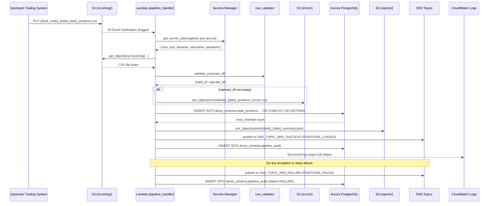
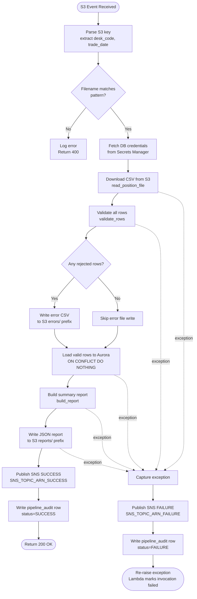
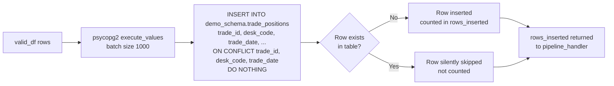

# Technical Design Document
## Daily Trade Position Ingestion — Enterprise Risk Data Platform

**Repo:** nartcr/agentic-poc-sandbox
**Change Type:** New Feature
**Document Date:** June 2026
**Status:** Draft

---

## COMPONENTS

### `pipeline_config.py`
**Purpose:** Centralises all environment-variable reads and runtime configuration. Every other module imports from this file rather than calling `os.environ` directly.

**What it does:**
- Reads and exposes all environment variables required by the pipeline as typed constants.
- Raises `EnvironmentError` at import time if a required variable is missing, preventing silent misconfiguration.

**Reads:** Environment variables (listed in DATA CONTRACTS — Environment Variables section).

**Writes:** Nothing (pure config module).

**Exports:**
```
S3_BUCKET: str
S3_INPUT_PREFIX: str        # "incoming/"
S3_ERROR_PREFIX: str        # "errors/"
S3_REPORT_PREFIX: str       # "reports/"
DB_SECRET_ID: str
SNS_TOPIC_ARN_SUCCESS: str
SNS_TOPIC_ARN_FAILURE: str
DB_SCHEMA: str              # "demo_schema"
```

**Satisfies:** BAC-8 (no secrets or config hardcoded in code).

---

### `secret_loader.py`
**Purpose:** Retrieves database credentials from AWS Secrets Manager at runtime. Called once per pipeline invocation; result passed as a dict to the database layer.

**What it does:**
- Function `get_db_credentials(secret_id: str) -> dict` calls `boto3.client("secretsmanager").get_secret_value(SecretId=secret_id)`, parses the JSON string, and returns a dict with keys: `host`, `port`, `dbname`, `username`, `password`.
- Raises `RuntimeError` if the secret cannot be retrieved or the JSON is malformed.
- Never logs credential values.

**Reads:** `secret_id` (string, from `pipeline_config.DB_SECRET_ID`).

**Writes:** Nothing to storage; returns credential dict to caller.

**Satisfies:** BAC-8 (credentials retrieved at runtime from Secrets Manager, never stored in code).

---

### `file_reader.py`
**Purpose:** Downloads a single CSV file from S3 and returns its raw contents as a pandas DataFrame with original column names preserved.

**What it does:**
- Function `read_position_file(bucket: str, s3_key: str) -> pd.DataFrame` uses `boto3.client("s3").get_object` to stream the object, reads it into a pandas DataFrame using `pd.read_csv` with `dtype=str` (all columns read as strings to preserve raw values for validation).
- Parses the filename to extract `desk_code` and `trade_date` using the pattern `{desk_code}_{trade_date}_positions.csv`. Raises `ValueError` if the filename does not match this pattern.
- Attaches `_source_desk_code` and `_source_trade_date` as metadata columns on the DataFrame (prefixed with underscore to distinguish from validated business columns).
- Logs the S3 key and row count at INFO level.

**Reads:** S3 object at `s3://{bucket}/{s3_key}`. CSV columns expected (all as strings): `trade_id`, `desk_code`, `trade_date`, `instrument_type`, `notional_amount`, `currency`, `counterparty_id`.

**Writes:** Returns `pd.DataFrame` to caller.

**Satisfies:** BAC-1 (file ingestion), BAC-6 (efficient read).

---

### `row_validator.py`
**Purpose:** Applies all data quality rules to the raw DataFrame and splits rows into a validated set and a rejected set with reasons.

**What it does:**
- Function `validate_rows(df: pd.DataFrame) -> tuple[pd.DataFrame, pd.DataFrame]` returns `(valid_df, rejected_df)`.
- Validation rules applied in order per row:
  1. **Mandatory field presence:** All of `trade_id`, `desk_code`, `trade_date`, `instrument_type`, `notional_amount`, `currency`, `counterparty_id` must be non-null and non-empty-string. Rejection reason: `"MISSING_FIELD: {field_name}"`.
  2. **trade_date format:** Must parse as `YYYY-MM-DD`. Rejection reason: `"INVALID_DATE_FORMAT: trade_date"`.
  3. **notional_amount numeric:** Must be castable to `float` and must not be negative. Rejection reason: `"INVALID_NOTIONAL: not numeric"` or `"INVALID_NOTIONAL: negative value"`.
  4. **currency length:** Must be exactly 3 characters (ISO 4217). Rejection reason: `"INVALID_CURRENCY: must be 3 characters"`.
- A row failing multiple rules carries all reasons joined by `"|"`.
- `rejected_df` has all original columns plus a `rejection_reason` column (string).
- `valid_df` has all original columns, with `notional_amount` cast to `float64` and `trade_date` cast to `datetime.date`.

**Reads:** `pd.DataFrame` from `file_reader.read_position_file`.

**Writes:** Returns two DataFrames to caller. Does not touch storage.

**Satisfies:** BAC-2 (invalid records flagged with clear reasons).

---

### `error_writer.py`
**Purpose:** Writes the rejected-rows DataFrame to S3 as a CSV error file for the operations team.

**What it does:**
- Function `write_error_file(rejected_df: pd.DataFrame, bucket: str, desk_code: str, trade_date: str) -> str` serialises `rejected_df` to CSV (including header) and writes it to S3.
- S3 key pattern: `errors/{desk_code}_{trade_date}_positions_errors.csv`.
- If `rejected_df` is empty, no file is written and the function returns `None`.
- Returns the S3 key of the written file (or `None`).
- Uses `boto3.client("s3").put_object` with `ContentType="text/csv"`.

**Reads:** `rejected_df` (DataFrame with columns: all original CSV columns + `rejection_reason`).

**Writes:**
- S3: `s3://{bucket}/errors/{desk_code}_{trade_date}_positions_errors.csv`
- CSV columns: `trade_id`, `desk_code`, `trade_date`, `instrument_type`, `notional_amount`, `currency`, `counterparty_id`, `rejection_reason`

**Satisfies:** BAC-2 (operations team can review and correct rejected rows).

---

### `position_loader.py`
**Purpose:** Loads validated trade position rows into `demo_schema.trade_positions` using an idempotent upsert that skips existing records.

**What it does:**
- Function `load_positions(valid_df: pd.DataFrame, credentials: dict) -> int` opens a `psycopg2` connection using `credentials`, and for each batch of rows executes:
  ```sql
  INSERT INTO demo_schema.trade_positions
    (trade_id, desk_code, trade_date, instrument_type,
     notional_amount, currency, counterparty_id, loaded_at)
  VALUES %s
  ON CONFLICT (trade_id, desk_code, trade_date) DO NOTHING
  ```
  using `psycopg2.extras.execute_values` for bulk performance.
- `loaded_at` is set to `datetime.now(pytz.timezone("America/Toronto"))` at call time (one value for all rows in the batch).
- Returns the count of rows actually inserted (computed as `cursor.rowcount` summed across batches).
- Uses batch size of 1,000 rows. Commits once after all batches succeed; rolls back on any exception.
- Closes the connection in a `finally` block.

**Reads:** `valid_df` with columns: `trade_id`, `desk_code`, `trade_date`, `instrument_type`, `notional_amount`, `currency`, `counterparty_id`.

**Writes:**
- DB table: `demo_schema.trade_positions` (see DATA CONTRACTS for full schema).
- Returns inserted row count (int) to caller.

**Satisfies:** BAC-1 (positions loaded to reporting system), BAC-3 (ON CONFLICT … DO NOTHING prevents duplicates), BAC-6 (bulk insert for performance).

---

### `audit_writer.py`
**Purpose:** Writes one audit record per file processed to `demo_schema.pipeline_audit` to support regulatory examination readiness.

**What it does:**
- Function `write_audit_record(credentials: dict, audit_payload: dict) -> None` inserts one row into `demo_schema.pipeline_audit`.
- `audit_payload` keys (all required): `file_name`, `desk_code`, `trade_date`, `total_rows`, `rows_loaded`, `rows_rejected`, `processing_status` (`"SUCCESS"` or `"FAILURE"`), `error_file_s3_key` (nullable), `report_s3_key` (nullable), `processed_at` (ET timestamp), `service_identity`.
- `service_identity` is read from `os.environ["SERVICE_IDENTITY"]` (e.g. Lambda function name/ARN).
- Uses `INSERT INTO demo_schema.pipeline_audit (...) VALUES (...)` — not upsert; every processing attempt gets its own audit row.
- Commits immediately.

**Reads:** `audit_payload` dict; `credentials` dict from `secret_loader`.

**Writes:** DB table: `demo_schema.pipeline_audit` (one row per call — see DATA CONTRACTS).

**Satisfies:** BAC-7 (ET timestamps in audit), BAC-8 (service identity from env, not hardcoded), NFR 3.3 (complete audit trail).

---

### `report_builder.py`
**Purpose:** Builds the post-load summary report dict and serialises it to JSON in S3.

**What it does:**
- Function `build_report(raw_df: pd.DataFrame, valid_df: pd.DataFrame, rejected_df: pd.DataFrame, rows_inserted: int, desk_code: str, trade_date: str) -> dict` computes:
  - `total_rows_received`: `len(raw_df)`
  - `rows_successfully_loaded`: `rows_inserted` (actual DB inserts, not just valid rows — accounts for dedup)
  - `rows_rejected`: `len(rejected_df)`
  - `rows_skipped_duplicate`: `len(valid_df) - rows_inserted`
  - `processing_timestamp`: `datetime.now(pytz.timezone("America/Toronto")).isoformat()`
  - `desk_code_counts`: `{desk_code: count}` grouped from `valid_df["desk_code"].value_counts().to_dict()`
  - `min_notional`: `float(valid_df["notional_amount"].min())` — `None` if `valid_df` is empty
  - `max_notional`: `float(valid_df["notional_amount"].max())` — `None` if `valid_df` is empty
  - `null_rates`: per-column null rate across `raw_df` as `{column_name: float}` (proportion 0.0–1.0)
- Function `write_report(report: dict, bucket: str, desk_code: str, trade_date: str) -> str` serialises to JSON and writes to S3 key `reports/{desk_code}_{trade_date}_summary.json`. Returns the S3 key.

**Reads:** Three DataFrames and scalar counts from upstream processing steps.

**Writes:**
- S3: `s3://{bucket}/reports/{desk_code}_{trade_date}_summary.json`
- JSON structure: see DATA CONTRACTS — SNS message (same report dict embedded in SNS success payload).

**Satisfies:** BAC-4 (accurate summary), BAC-6 (report produced within window), BAC-7 (ET timestamp in report).

---

### `notification_publisher.py`
**Purpose:** Publishes SNS notifications for both success and failure events.

**What it does:**
- Function `publish_success(topic_arn: str, report: dict) -> None` publishes to the success SNS topic. Message body is a JSON-serialised dict (see DATA CONTRACTS — SNS).
- Function `publish_failure(topic_arn: str, error_details: dict) -> None` publishes to the failure SNS topic. Message body is a JSON-serialised dict with keys: `event_type`, `file_name`, `desk_code`, `trade_date`, `error_message`, `timestamp` (ET ISO 8601).
- Uses `boto3.client("sns").publish(TopicArn=topic_arn, Message=json.dumps(payload), Subject=...)`.
- Logs the SNS MessageId at INFO level.
- Does NOT raise on SNS failure — logs at ERROR level and continues so that a notification failure does not corrupt the audit trail.

**Reads:** Report dict (from `report_builder.build_report`) or error details dict.

**Writes:** SNS message to topic (see DATA CONTRACTS).

**Satisfies:** BAC-5 (automatic downstream notification, no manual trigger).

---

### `pipeline_handler.py`
**Purpose:** AWS Lambda handler and top-level orchestrator. Receives the S3 event trigger, coordinates all pipeline modules in sequence, and ensures the audit record is always written regardless of outcome.

**What it does:**
- Entry point: `def handler(event: dict, context: object) -> dict`
- Parses the S3 event to extract `bucket` and `s3_key` from `event["Records"][0]["s3"]`.
- Validates the S3 key matches `incoming/{desk_code}_{trade_date}_positions.csv` pattern. Rejects with logged error if not.
- Orchestration sequence:
  1. `secret_loader.get_db_credentials(pipeline_config.DB_SECRET_ID)` → `credentials`
  2. `file_reader.read_position_file(bucket, s3_key)` → `raw_df`
  3. `row_validator.validate_rows(raw_df)` → `(valid_df, rejected_df)`
  4. `error_writer.write_error_file(rejected_df, bucket, desk_code, trade_date)` → `error_s3_key`
  5. `position_loader.load_positions(valid_df, credentials)` → `rows_inserted`
  6. `report_builder.build_report(raw_df, valid_df, rejected_df, rows_inserted, desk_code, trade_date)` → `report`
  7. `report_builder.write_report(report, bucket, desk_code, trade_date)` → `report_s3_key`
  8. `notification_publisher.publish_success(pipeline_config.SNS_TOPIC_ARN_SUCCESS, report)`
  9. `audit_writer.write_audit_record(credentials, audit_payload)` with `processing_status="SUCCESS"`
- On **any** exception in steps 2–8: logs exception, calls `notification_publisher.publish_failure(...)`, then calls `audit_writer.write_audit_record(...)` with `processing_status="FAILURE"`, then re-raises.
- Returns `{"statusCode": 200, "body": "OK"}` on success.

**Reads:** S3 event dict from Lambda trigger.

**Writes:** Orchestrates all writes via called modules. Returns response dict.

**Satisfies:** BAC-1 through BAC-8 (top-level orchestrator integrating all components).

---

## AWS SERVICES

| Service | Role |
|---|---|
| **AWS Lambda** | Compute runtime for the ingestion pipeline. The existing function `agentic-poc-sandbox-qa` is triggered by S3 event notifications on the `incoming/` prefix. Executes `pipeline_handler.handler`. |
| **Amazon S3** | Durable object store. Bucket `agentic-poc-data-533266968934` receives input files (`incoming/`), stores error files (`errors/`), and stores JSON summary reports (`reports/`). |
| **Amazon RDS / Aurora PostgreSQL** | Reporting database. Schema `demo_schema` in database `app` hosts `trade_positions` and `pipeline_audit` tables. Credentials stored in Secrets Manager. |
| **AWS Secrets Manager** | Secure credential store. Secret ID `agentic-poc-aurora` holds database connection credentials. Retrieved at runtime — never stored in code. |
| **Amazon SNS** | Pub/sub notification layer. Two topics: one for success events (triggers downstream risk pipeline), one for failure events (triggers operations alerts). |
| **Amazon CloudWatch Logs** | All Lambda log output (via Python `logging` module) is captured in CloudWatch for observability and audit. |

---

## DATA CONTRACTS

### Database Tables

#### `demo_schema.trade_positions`

```
Table: demo_schema.trade_positions

Column             Data Type                  Constraints
─────────────────────────────────────────────────────────────────────
trade_id           VARCHAR(100)               NOT NULL
desk_code          VARCHAR(50)                NOT NULL
trade_date         DATE                       NOT NULL
instrument_type    VARCHAR(100)               NOT NULL
notional_amount    NUMERIC(20, 4)             NOT NULL
currency           CHAR(3)                    NOT NULL
counterparty_id    VARCHAR(100)               NOT NULL
loaded_at          TIMESTAMP WITH TIME ZONE   NOT NULL

Primary Key:       (trade_id, desk_code, trade_date)
Unique Constraint: (trade_id, desk_code, trade_date)  — enforces idempotency
Index:             idx_trade_positions_desk_date ON (desk_code, trade_date)
Index:             idx_trade_positions_loaded_at ON (loaded_at)
```

#### `demo_schema.pipeline_audit`

```
Table: demo_schema.pipeline_audit

Column               Data Type                  Constraints
────────────────────────────────────────────────────────────────────────
audit_id             SERIAL                     PRIMARY KEY
file_name            VARCHAR(255)               NOT NULL
desk_code            VARCHAR(50)                NOT NULL
trade_date           DATE                       NOT NULL
total_rows           INTEGER                    NOT NULL
rows_loaded          INTEGER                    NOT NULL
rows_rejected        INTEGER                    NOT NULL
processing_status    VARCHAR(20)                NOT NULL  -- 'SUCCESS' | 'FAILURE'
error_file_s3_key    VARCHAR(500)               NULL
report_s3_key        VARCHAR(500)               NULL
processed_at         TIMESTAMP WITH TIME ZONE   NOT NULL  -- ET
service_identity     VARCHAR(255)               NOT NULL
created_at           TIMESTAMP WITH TIME ZONE   NOT NULL DEFAULT NOW()

Index: idx_pipeline_audit_desk_date ON (desk_code, trade_date)
Index: idx_pipeline_audit_processed_at ON (processed_at)
```

---

### S3 Paths

```
Bucket (env var): os.environ["S3_BUCKET"]

Input files:
  Key pattern:    incoming/{desk_code}_{trade_date}_positions.csv
  Example:        incoming/EQUITIES_2026-06-15_positions.csv
  Format:         CSV with header row
  Columns:        trade_id, desk_code, trade_date, instrument_type,
                  notional_amount, currency, counterparty_id
  Encoding:       UTF-8
  Delimiter:      comma

Error files:
  Key pattern:    errors/{desk_code}_{trade_date}_positions_errors.csv
  Example:        errors/EQUITIES_2026-06-15_positions_errors.csv
  Format:         CSV with header row
  Columns:        trade_id, desk_code, trade_date, instrument_type,
                  notional_amount, currency, counterparty_id,
                  rejection_reason
  Written by:     error_writer.write_error_file()
  Written when:   len(rejected_df) > 0

Report files:
  Key pattern:    reports/{desk_code}_{trade_date}_summary.json
  Example:        reports/EQUITIES_2026-06-15_summary.json
  Format:         JSON (UTF-8)
  Written by:     report_builder.write_report()
```

---

### Secrets Manager

```
Env var:          DB_SECRET_ID = os.environ["DB_SECRET_ID"]
Secret ID value:  agentic-poc-aurora

Expected JSON keys inside secret:
  {
    "host":     "<aurora-cluster-endpoint>",
    "port":     5432,
    "dbname":   "app",
    "username": "<db-user>",
    "password": "<db-password>"
  }
```

---

### SNS Topics

```
Success topic env var:  os.environ["SNS_TOPIC_ARN_SUCCESS"]
Failure topic env var:  os.environ["SNS_TOPIC_ARN_FAILURE"]
```

**Success message payload (JSON):**
```json
{
  "event_type": "POSITIONS_LOADED",
  "file_name": "EQUITIES_2026-06-15_positions.csv",
  "desk_code": "EQUITIES",
  "trade_date": "2026-06-15",
  "total_rows_received": 9800,
  "rows_successfully_loaded": 9750,
  "rows_rejected": 50,
  "rows_skipped_duplicate": 0,
  "processing_timestamp": "2026-06-15T19:42:11.000000-05:00",
  "report_s3_key": "reports/EQUITIES_2026-06-15_summary.json",
  "desk_code_counts": {"EQUITIES": 9750},
  "min_notional": 1000.0,
  "max_notional": 50000000.0,
  "null_rates": {
    "trade_id": 0.0,
    "desk_code": 0.0,
    "trade_date": 0.0,
    "instrument_type": 0.02,
    "notional_amount": 0.0,
    "currency": 0.0,
    "counterparty_id": 0.01
  }
}
```

**Failure message payload (JSON):**
```json
{
  "event_type": "POSITIONS_FAILED",
  "file_name": "EQUITIES_2026-06-15_positions.csv",
  "desk_code": "EQUITIES",
  "trade_date": "2026-06-15",
  "error_message": "<exception type and message>",
  "timestamp": "2026-06-15T19:44:05.000000-05:00"
}
```

---

### Environment Variables

| Variable Name | Description | Example Value |
|---|---|---|
| `S3_BUCKET` | S3 bucket name | `agentic-poc-data-533266968934` |
| `DB_SECRET_ID` | Secrets Manager secret ID | `agentic-poc-aurora` |
| `SNS_TOPIC_ARN_SUCCESS` | SNS ARN for success notifications | `arn:aws:sns:ca-central-1:...` |
| `SNS_TOPIC_ARN_FAILURE` | SNS ARN for failure notifications | `arn:aws:sns:ca-central-1:...` |
| `SERVICE_IDENTITY` | Identifier written to audit records | Lambda function name or ARN |
| `DB_SCHEMA` | PostgreSQL schema name | `demo_schema` |

---

## DATA FLOW

### End-to-End Pipeline Flow



---

### Lambda Orchestration Logic (Decision Flow)



---

### Validation Logic (Per-Row Algorithm)

```
FOR EACH row IN raw_df:
    reasons = []

    FOR EACH field IN [trade_id, desk_code, trade_date,
                       instrument_type, notional_amount,
                       currency, counterparty_id]:
        IF row[field] IS NULL OR strip(row[field]) == "":
            reasons.append("MISSING_FIELD: {field}")

    IF "MISSING_FIELD: trade_date" NOT IN reasons:
        TRY parse row["trade_date"] as YYYY-MM-DD
        IF parse fails:
            reasons.append("INVALID_DATE_FORMAT: trade_date")

    IF "MISSING_FIELD: notional_amount" NOT IN reasons:
        TRY cast row["notional_amount"] to float
        IF cast fails:
            reasons.append("INVALID_NOTIONAL: not numeric")
        ELSE IF float(row["notional_amount"]) < 0:
            reasons.append("INVALID_NOTIONAL: negative value")

    IF "MISSING_FIELD: currency" NOT IN reasons:
        IF len(strip(row["currency"])) != 3:
            reasons.append("INVALID_CURRENCY: must be 3 characters")

    IF reasons is empty:
        ADD row to valid_df (cast notional_amount to float64, trade_date to date)
    ELSE:
        ADD row + rejection_reason="|".join(reasons) to rejected_df

RETURN (valid_df, rejected_df)
```

---

### Idempotency Mechanism



---

## TECHNICAL ACCEPTANCE CRITERIA

**TAC-1: Valid positions available before morning risk run**
- `position_loader.load_positions()` uses `execute_values` in batches of 1,000 rows with a single commit.
- Acceptance test: Load a file of 10,000 rows; verify all rows are queryable in `demo_schema.trade_positions` within 60 seconds of the Lambda invocation start. Query: `SELECT COUNT(*) FROM demo_schema.trade_positions WHERE desk_code = %s AND trade_date = %s` must equal the number of unique valid `(trade_id, desk_code, trade_date)` tuples in the input file.

**TAC-2: Invalid records flagged with clear reasons**
- `row_validator.validate_rows()` returns a `rejected_df` where every row has a non-empty `rejection_reason` string in format `"REASON_CODE: detail"` (multiple reasons joined by `"|"`).
- `error_writer.write_error_file()` writes this DataFrame to `s3://{S3_BUCKET}/errors/{desk_code}_{trade_date}_positions_errors.csv`.
- Acceptance test: Submit a file containing 3 rows with deliberate defects (null `trade_id`, non-numeric `notional_amount`, invalid `trade_date` format). Verify the error CSV in S3 contains exactly 3 rows, each with a non-empty `rejection_reason` column, and each reason matches the specific defect injected.

**TAC-3: Resubmitting a file does not double-count positions**
- `position_loader.load_positions()` executes `INSERT INTO demo_schema.trade_positions (...) VALUES %s ON CONFLICT (trade_id, desk_code, trade_date) DO NOTHING`.
- Acceptance test: Process the same input file twice. After the first run, record `SELECT COUNT(*) FROM demo_schema.trade_positions WHERE desk_code = %s AND trade_date = %s`. After the second run, the count must be identical. The second run's `rows_inserted` return value must be 0 (or equal only to the count of genuinely new rows if the file was partially changed).

**TAC-4: Summary report accurately reflects received/accepted/rejected counts**
- `report_builder.build_report()` computes `total_rows_received = len(raw_df)`, `rows_successfully_loaded = rows_inserted`, `rows_rejected = len(rejected_df)`. These three values must satisfy: `total_rows_received == rows_successfully_loaded + rows_skipped_duplicate + rows_rejected`.
- Report includes `desk_code_counts` (from `valid_df.groupby("desk_code").size()`), `min_notional`, `max_notional`, and `null_rates` dict for all 7 business columns.
- Acceptance test: Submit a file of 100 rows (80 valid, 20 with defects). Verify the written JSON report at `s3://{S3_BUCKET}/reports/{desk_code}_{trade_date}_summary.json` contains `total_rows_received=100`, `rows_rejected=20`, and `rows_successfully_loaded=80` (assuming no duplicates). Verify `null_rates` keys match exactly the 7 business column names.

**TAC-5: Downstream pipeline automatically notified**
- `notification_publisher.publish_success()` publishes to `os.environ["SNS_TOPIC_ARN_SUCCESS"]` with `event_type="POSITIONS_LOADED"` after every successful file processing.
- `notification_publisher.publish_failure()` publishes to `os.environ["SNS_TOPIC_ARN_FAILURE"]` with `event_type="POSITIONS_FAILED"` on any exception.
- Acceptance test: Process a valid file end-to-end; verify an SNS message was published containing `event_type="POSITIONS_LOADED"` and `desk_code` matching the file. Verify no manual step was required between file deposit and SNS publish.

**TAC-6: Processing completes within 60 seconds for 10,000-row file**
- `psycopg2.extras.execute_values` with batch size 1,000 used for bulk inserts.
- Acceptance test: Upload a synthetic 10,000-row valid CSV. Measure Lambda duration from CloudWatch. Assert duration < 60,000ms. Separately, upload a 100,000-row file and verify Lambda completes without timeout (Lambda timeout must be configured ≥ 600s in the deployment).

**TAC-7: All timestamps in Eastern Time**
- All calls to `datetime.now()` use `pytz.timezone("America/Toronto")` as tzinfo.
- `loaded_at` column in `demo_schema.trade_positions` stores `TIMESTAMP WITH TIME ZONE` value in ET.
- `processed_at` column in `demo_schema.pipeline_audit` stores `TIMESTAMP WITH TIME ZONE` value in ET.
- `processing_timestamp` in the JSON report is an ISO 8601 string with ET offset (e.g. `-05:00` or `-04:00`).
- Acceptance test: Process a file and query `SELECT processed_at AT TIME ZONE 'America/Toronto' FROM demo_schema.pipeline_audit ORDER BY audit_id DESC LIMIT 1`. Verify the offset matches current ET offset. Verify the JSON report's `processing_timestamp` field parses to a timezone-aware datetime in `America/Toronto`.

**TAC-8: No secrets stored in code or config files**
- `secret_loader.get_db_credentials()` is the only function that reads database credentials, and it calls `boto3.client("secretsmanager").get_secret_value(SecretId=secret_id)` where `secret_id` comes from `os.environ["DB_SECRET_ID"]`.
- Acceptance test (static analysis): `grep -rn "password\|host\|username\|secret" src/` must return zero matches for hardcoded string literals (not env var reads). Automated scan of all `.py` files confirms no string matching DB credential patterns. Confirm `DB_SECRET_ID` env var resolves to `agentic-poc-aurora` at runtime without being hardcoded anywhere in source.

---

## OPEN QUESTIONS

**OQ-1: SNS Topic Provisioning**
The infrastructure config YAML does not define any SNS topic ARNs. BAC-5 requires automatic downstream notification via SNS (both success and failure topics). Before coding begins, the architect must confirm:
- The ARN of the SNS success topic to be referenced by `SNS_TOPIC_ARN_SUCCESS`
- The ARN of the SNS failure topic to be referenced by `SNS_TOPIC_ARN_FAILURE`

These ARNs must be provided as Lambda environment variable values before the feature can be deployed and tested end-to-end.

**OQ-2: Handling of files where ALL rows are rejected**
The BRD states validated rows must be loaded and a summary produced, but does not specify whether a file where 100% of rows fail validation should be treated as a `SUCCESS` (pipeline ran to completion, zero rows loaded) or `FAILURE` (no usable data). This affects the `processing_status` value in `pipeline_audit` and which SNS topic receives the notification. Decision required before coding the `pipeline_handler` error-handling logic.

---

## ASSUMPTIONS

1. **Lambda trigger mechanism:** The existing Lambda function `agentic-poc-sandbox-qa` is configured (or will be configured at deployment) with an S3 event notification trigger on bucket `agentic-poc-data-533266968934` for `ObjectCreated` events with prefix `incoming/` and suffix `.csv`. The code does not provision this trigger — it assumes it exists.

2. **Lambda runtime and dependencies:** The Lambda function runs Python 3.11+. Dependencies `psycopg2-binary`, `pandas`, `pytz`, and `boto3` are available in the Lambda execution environment via a layer or deployment package.

3. **Lambda timeout:** The Lambda is configured with a timeout of at least 600 seconds to support 100,000-row files. The 60-second target in BAC-6 applies to 10,000-row files.

4. **Lambda memory:** Sufficient memory (≥ 512 MB) is allocated to handle pandas DataFrames of up to 100,000 rows without OOM.

5. **Aurora PostgreSQL connectivity:** The Lambda function's VPC configuration (subnets and security groups) already allows outbound TCP to the Aurora cluster on port 5432. No VPC provisioning is required from this feature.

6. **Tables must be created before first run:** The DDL for `demo_schema.trade_positions` and `demo_schema.pipeline_audit` must be executed against the Aurora cluster before the Lambda is invoked. This feature includes DDL definitions in the DATA CONTRACTS but does not auto-create tables at runtime.

7. **One file per Lambda invocation:** Each S3 event notification delivers exactly one file. The pipeline processes exactly one file per invocation. Batch S3 events (multiple Records) are not a current requirement; if multiple records appear, only the first is processed and a warning is logged.

8. **CSV files are well-formed at the container level:** Files always have a valid header row and are UTF-8 encoded. Completely malformed files (e.g. binary data, wrong encoding) will cause an unhandled read error, which is caught by the top-level exception handler and results in a FAILURE audit record and SNS failure notification.

9. **Idempotency scope:** "Same file" means same `(trade_id, desk_code, trade_date)` composite key per row — not same S3 filename. A corrected resubmission of a file that changes a previously-rejected row will result in that row being newly inserted (it was never in the DB). A resubmission that includes a row identical in key to an existing DB row will silently skip that row.

10. **The `service_identity` value** written to `demo_schema.pipeline_audit` comes from `os.environ["SERVICE_IDENTITY"]`. It is assumed this is set to the Lambda function name or ARN in the Lambda configuration.

11. **Desk code and trade date in filename are authoritative for routing but not for validation:** The filename-extracted `desk_code` and `trade_date` are used for S3 key construction and audit metadata. Row-level `desk_code` and `trade_date` fields are validated independently in `row_validator`. A mismatch between filename and row-level values is not treated as a validation error (this could be revisited if the business requires cross-field consistency).

12. **No S3 versioning dependency:** The pipeline reads the current version of the object and does not depend on S3 object versioning being enabled.