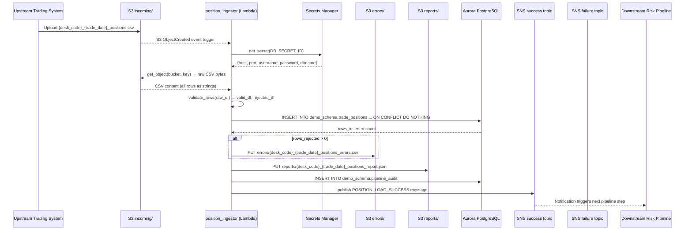
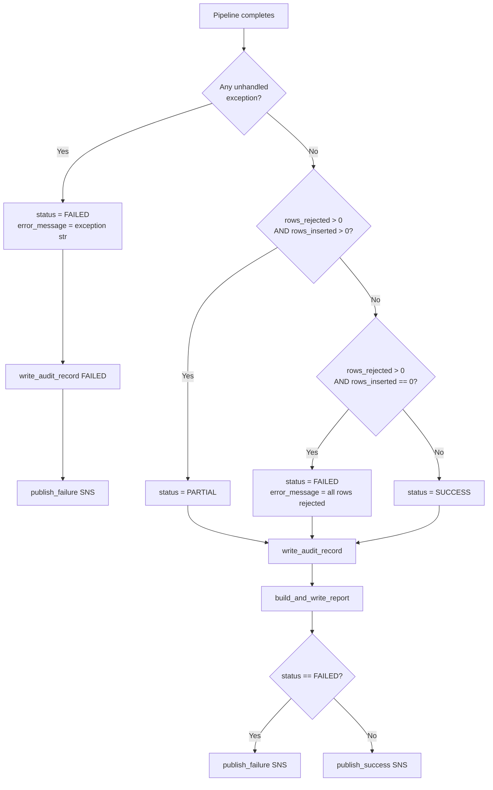

# Technical Design Document (TDD)
## Daily Trade Position Ingestion — Enterprise Risk Data Platform

---

### COMPONENTS

---

#### `position_ingestor.py` — Lambda Entry Point & Orchestrator

**What it does:**
This is the AWS Lambda handler (`lambda_handler(event, context)`). It is triggered by an S3 `ObjectCreated` event on the `incoming/` prefix of the configured bucket. It orchestrates the full pipeline: parse the S3 event to extract the bucket name and object key, derive `desk_code` and `trade_date` from the filename, call each downstream module in sequence, and write the final audit record. If any unrecoverable exception occurs, it catches it, writes a FAILED audit record, publishes a failure SNS notification, and re-raises.

**Exact function signature:**
```
lambda_handler(event: dict, context: object) -> dict
```
Returns `{"statusCode": 200, "body": "OK"}` on success or re-raises on failure.

**Filename parsing logic:**
- Extract `object_key` from `event["Records"][0]["s3"]["object"]["key"]`
- Strip the `incoming/` prefix and `.csv` suffix
- Split on `_` to extract: `desk_code = parts[0]`, `trade_date = parts[1]` (format `YYYY-MM-DD`), validate suffix is `positions`
- If filename does not match pattern `{desk_code}_{trade_date}_positions.csv`, write FAILED audit and publish failure notification

**What it reads:** S3 event payload (bucket name, object key)

**What it writes:** Nothing directly — delegates to submodules; returns HTTP-style status dict

**Satisfies:** BAC-1, BAC-5, BAC-6, BAC-7, BAC-8

---

#### `secrets_client.py` — Secrets Manager Credential Retrieval

**What it does:**
Exposes a single function `get_secret(secret_id: str) -> dict` that calls AWS Secrets Manager (`secretsmanager.get_secret_value`) using `boto3`, parses the JSON string from `SecretString`, and returns the credential dict. Caches the result in a module-level dict keyed by `secret_id` to avoid redundant API calls within a single Lambda invocation.

**Exact function signature:**
```
get_secret(secret_id: str) -> dict
```

**What it reads:** `os.environ["DB_SECRET_ID"]` (passed in by caller); AWS Secrets Manager response

**What it writes:** Nothing (in-memory cache only)

**Satisfies:** BAC-8

---

#### `db_connection.py` — Database Connection Factory

**What it does:**
Exposes `get_connection() -> psycopg2.connection`. Calls `secrets_client.get_secret(os.environ["DB_SECRET_ID"])` to retrieve `{"host", "port", "username", "password", "dbname"}`. Opens and returns a `psycopg2` connection to the Aurora PostgreSQL instance with `dbname=app`. Connection is not pooled — caller is responsible for closing. All SQL executed through this connection targets `demo_schema`.

**Exact function signature:**
```
get_connection() -> psycopg2.connection
```

**What it reads:** Secret JSON keys: `host`, `port`, `username`, `password`, `dbname`

**What it writes:** Nothing

**Satisfies:** BAC-8

---

#### `file_reader.py` — S3 CSV Reader

**What it does:**
Exposes `read_position_file(bucket: str, key: str) -> pd.DataFrame`. Downloads the object from S3 using `boto3.client("s3").get_object(Bucket=bucket, Key=key)`, reads the body as a UTF-8 CSV via `pandas.read_csv()`, and returns a raw DataFrame with all columns as strings (dtype `object`). Does not perform any validation — returns rows exactly as they appear in the file. Logs the row count and column list at INFO level.

**Exact function signature:**
```
read_position_file(bucket: str, key: str) -> pd.DataFrame
```

**What it reads:**
- `bucket`: S3 bucket name
- `key`: full S3 object key under `incoming/` prefix
- CSV columns expected (not enforced here): `trade_id`, `desk_code`, `trade_date`, `instrument_type`, `notional_amount`, `currency`, `counterparty_id`

**What it writes:** Nothing to storage; returns in-memory DataFrame

**Satisfies:** BAC-1, BAC-4

---

#### `row_validator.py` — Row-Level Validation

**What it does:**
Exposes `validate_rows(df: pd.DataFrame) -> tuple[pd.DataFrame, pd.DataFrame]`. Applies the following validation rules in order to each row. Returns `(valid_df, rejected_df)` where `rejected_df` has all original columns plus an additional `rejection_reason: str` column.

**Validation rules (applied in sequence; first failure wins):**
1. **Missing mandatory fields:** Check each of `trade_id`, `desk_code`, `trade_date`, `instrument_type`, `notional_amount`, `currency`, `counterparty_id` for null, empty string, or whitespace-only. Rejection reason: `"Missing mandatory field: {field_name}"`
2. **`trade_date` format:** Must parse as `YYYY-MM-DD`. Rejection reason: `"Invalid trade_date format: {value}"`
3. **`notional_amount` numeric:** Must be parseable as a Python `Decimal` with up to 20 digits and 4 decimal places. Rejection reason: `"Invalid notional_amount: {value}"`
4. **`currency` format:** Must be exactly 3 uppercase alphabetic characters (`[A-Z]{3}`). Rejection reason: `"Invalid currency format: {value}"`

**Exact function signature:**
```
validate_rows(df: pd.DataFrame) -> tuple[pd.DataFrame, pd.DataFrame]
```

**What it reads:** Raw DataFrame from `file_reader.read_position_file`

**What it writes:** Nothing to storage; returns two in-memory DataFrames

**Satisfies:** BAC-2, BAC-4

---

#### `db_loader.py` — Validated Row Database Loader

**What it does:**
Exposes `load_positions(valid_df: pd.DataFrame, conn: psycopg2.connection) -> int`. Iterates the validated DataFrame and executes a batch `INSERT INTO demo_schema.trade_positions (trade_id, desk_code, trade_date, instrument_type, notional_amount, currency, counterparty_id) VALUES %s ON CONFLICT (trade_id, desk_code, trade_date) DO NOTHING` using `psycopg2.extras.execute_values`. After execution, compares `cursor.rowcount` against `len(valid_df)` to compute skipped (duplicate) count. Commits the transaction. Returns the integer count of rows actually inserted (excluding skipped duplicates).

**Exact function signature:**
```
load_positions(valid_df: pd.DataFrame, conn: psycopg2.connection) -> int
```

**What it reads:** `valid_df` columns: `trade_id`, `desk_code`, `trade_date`, `instrument_type`, `notional_amount`, `currency`, `counterparty_id`

**What it writes:**
- `demo_schema.trade_positions` — rows inserted; skipped on conflict

**Satisfies:** BAC-1, BAC-3

---

#### `error_writer.py` — Rejected Row Error File Writer

**What it does:**
Exposes `write_error_file(rejected_df: pd.DataFrame, bucket: str, desk_code: str, trade_date: str) -> str`. Converts `rejected_df` (columns: `trade_id`, `desk_code`, `trade_date`, `instrument_type`, `notional_amount`, `currency`, `counterparty_id`, `rejection_reason`) to CSV (UTF-8, with header). Writes the CSV bytes to S3 at key `errors/{desk_code}_{trade_date}_positions_errors.csv`. Returns the full S3 key written. If `rejected_df` is empty, no file is written and an empty string is returned.

**Exact function signature:**
```
write_error_file(rejected_df: pd.DataFrame, bucket: str, desk_code: str, trade_date: str) -> str
```

**What it reads:** `rejected_df` in-memory DataFrame

**What it writes:**
- S3: `s3://{bucket}/errors/{desk_code}_{trade_date}_positions_errors.csv`
- CSV columns: `trade_id`, `desk_code`, `trade_date`, `instrument_type`, `notional_amount`, `currency`, `counterparty_id`, `rejection_reason`

**Satisfies:** BAC-2

---

#### `report_builder.py` — Processing Summary Report Generator

**What it does:**
Exposes `build_and_write_report(raw_df: pd.DataFrame, valid_df: pd.DataFrame, rejected_df: pd.DataFrame, rows_inserted: int, bucket: str, desk_code: str, trade_date: str) -> dict`. Computes the summary statistics and writes the report to S3.

**Computed fields:**
- `total_rows`: `len(raw_df)`
- `rows_valid`: `len(valid_df)`
- `rows_inserted`: passed-in integer from `db_loader`
- `rows_skipped_duplicate`: `len(valid_df) - rows_inserted`
- `rows_rejected`: `len(rejected_df)`
- `processing_timestamp_et`: current time in `America/Toronto` timezone, formatted as ISO 8601 string
- `desk_code_counts`: `valid_df.groupby("desk_code").size().to_dict()`
- `notional_min`: `valid_df["notional_amount"].astype(float).min()` (or `null` if empty)
- `notional_max`: `valid_df["notional_amount"].astype(float).max()` (or `null` if empty)
- `null_rates`: for each of the 7 mandatory columns in `raw_df`, compute `(null_or_empty_count / total_rows)` as a float; produces dict `{"trade_id": 0.0, "desk_code": 0.0, ...}`

Report is serialized as JSON and written to `reports/{desk_code}_{trade_date}_positions_report.json`.

Returns the summary dict (used by the notification module).

**Exact function signature:**
```
build_and_write_report(
    raw_df: pd.DataFrame,
    valid_df: pd.DataFrame,
    rejected_df: pd.DataFrame,
    rows_inserted: int,
    bucket: str,
    desk_code: str,
    trade_date: str
) -> dict
```

**What it writes:**
- S3: `s3://{bucket}/reports/{desk_code}_{trade_date}_positions_report.json`

**Satisfies:** BAC-4, BAC-7

---

#### `audit_writer.py` — Pipeline Audit Record Writer

**What it does:**
Exposes `write_audit_record(conn: psycopg2.connection, filename: str, desk_code: str | None, trade_date: str | None, status: str, total_rows: int, rows_inserted: int, rows_rejected: int, error_message: str | None) -> None`. Inserts one row into `demo_schema.pipeline_audit`. `processing_timestamp_et` is set to `NOW()` in the application layer using `datetime.now(pytz.timezone("America/Toronto"))` and passed as a parameter. `status` must be one of `"SUCCESS"`, `"FAILED"`, `"PARTIAL"`. Commits the transaction.

**Exact function signature:**
```
write_audit_record(
    conn: psycopg2.connection,
    filename: str,
    desk_code: str | None,
    trade_date: str | None,
    status: str,
    total_rows: int,
    rows_inserted: int,
    rows_rejected: int,
    error_message: str | None
) -> None
```

**What it writes:**
- `demo_schema.pipeline_audit` — one row per file processed

**Satisfies:** BAC-7 (ET timestamps), BAC-4 (audit trail)

---

#### `notification_publisher.py` — SNS Notification Publisher

**What it does:**
Exposes two functions:

1. `publish_success(summary: dict) -> None` — Publishes a JSON-encoded message to `os.environ["SNS_SUCCESS_TOPIC_ARN"]` via `boto3.client("sns").publish(...)`. Message structure defined in DATA CONTRACTS.

2. `publish_failure(filename: str, error_message: str, desk_code: str | None, trade_date: str | None) -> None` — Publishes a JSON-encoded message to `os.environ["SNS_FAILURE_TOPIC_ARN"]`. Message structure defined in DATA CONTRACTS.

Both functions log the SNS `MessageId` at INFO level on success.

**Exact function signatures:**
```
publish_success(summary: dict) -> None
publish_failure(filename: str, error_message: str, desk_code: str | None, trade_date: str | None) -> None
```

**What it reads:** `os.environ["SNS_SUCCESS_TOPIC_ARN"]`, `os.environ["SNS_FAILURE_TOPIC_ARN"]`

**What it writes:** SNS messages to configured topics

**Satisfies:** BAC-5

---

### AWS SERVICES

| Service | Role |
|---|---|
| **AWS Lambda** | Compute host for the ingestion pipeline. Triggered by S3 `ObjectCreated` events on the `incoming/` prefix. Function name: `agentic-poc-sandbox-qa`. |
| **Amazon S3** | Durable storage for input position files (`incoming/`), error files (`errors/`), and summary reports (`reports/`). Bucket: referenced via `os.environ["S3_BUCKET"]`. |
| **Amazon Aurora PostgreSQL** | Reporting database. Hosts `demo_schema.trade_positions` (position records) and `demo_schema.pipeline_audit` (audit trail). Connected via `psycopg2`. |
| **AWS Secrets Manager** | Secure credential store for Aurora connection parameters. No credentials in code. Secret ID referenced via `os.environ["DB_SECRET_ID"]`. |
| **Amazon SNS** | Asynchronous notification channel. Two topics: success (referenced via `os.environ["SNS_SUCCESS_TOPIC_ARN"]`) and failure (referenced via `os.environ["SNS_FAILURE_TOPIC_ARN"]`). Downstream risk calculation pipeline subscribes to success topic. |

---

### DATA CONTRACTS

#### Database Tables

**Table: `demo_schema.trade_positions`**

| Column | Type | Nullable | Constraints |
|---|---|---|---|
| `trade_id` | `VARCHAR(100)` | NOT NULL | Part of PK |
| `desk_code` | `VARCHAR(50)` | NOT NULL | Part of PK |
| `trade_date` | `DATE` | NOT NULL | Part of PK |
| `instrument_type` | `VARCHAR(100)` | NOT NULL | |
| `notional_amount` | `NUMERIC(20,4)` | NOT NULL | |
| `currency` | `CHAR(3)` | NOT NULL | |
| `counterparty_id` | `VARCHAR(100)` | NOT NULL | |
| `loaded_at` | `TIMESTAMPTZ` | NOT NULL | Default: `now()` |

- **Primary Key:** `(trade_id, desk_code, trade_date)`
- **Deduplication:** The PK also serves as the `ON CONFLICT` target for idempotent inserts.

---

**Table: `demo_schema.pipeline_audit`**

| Column | Type | Nullable | Constraints |
|---|---|---|---|
| `audit_id` | `BIGSERIAL` | NOT NULL | PK, auto-increment |
| `filename` | `VARCHAR(255)` | NOT NULL | |
| `desk_code` | `VARCHAR(50)` | NULL | |
| `trade_date` | `DATE` | NULL | |
| `status` | `VARCHAR(20)` | NOT NULL | Values: `'SUCCESS'`, `'FAILED'`, `'PARTIAL'` |
| `total_rows` | `INTEGER` | NOT NULL | Default: `0` |
| `rows_inserted` | `INTEGER` | NOT NULL | Default: `0` |
| `rows_rejected` | `INTEGER` | NOT NULL | Default: `0` |
| `error_message` | `TEXT` | NULL | |
| `processing_timestamp_et` | `TIMESTAMPTZ` | NOT NULL | Set to `datetime.now(pytz.timezone("America/Toronto"))` by application |
| `created_at` | `TIMESTAMPTZ` | NOT NULL | Default: `now()` |

- **Primary Key:** `(audit_id)`

---

#### S3 Paths

| Path Pattern | Format | Description |
|---|---|---|
| `incoming/{desk_code}_{trade_date}_positions.csv` | UTF-8 CSV with header row | Input file from upstream trading systems. Columns: `trade_id`, `desk_code`, `trade_date`, `instrument_type`, `notional_amount`, `currency`, `counterparty_id` |
| `errors/{desk_code}_{trade_date}_positions_errors.csv` | UTF-8 CSV with header row | Rejected rows. Columns: `trade_id`, `desk_code`, `trade_date`, `instrument_type`, `notional_amount`, `currency`, `counterparty_id`, `rejection_reason` |
| `reports/{desk_code}_{trade_date}_positions_report.json` | UTF-8 JSON | Summary report. Schema defined below. |

**Input CSV column order (header must be present):**
```
trade_id, desk_code, trade_date, instrument_type, notional_amount, currency, counterparty_id
```

**Report JSON schema (`reports/{desk_code}_{trade_date}_positions_report.json`):**
```json
{
  "filename": "string",
  "desk_code": "string",
  "trade_date": "YYYY-MM-DD",
  "processing_timestamp_et": "ISO 8601 string (America/Toronto)",
  "total_rows": "integer",
  "rows_valid": "integer",
  "rows_inserted": "integer",
  "rows_skipped_duplicate": "integer",
  "rows_rejected": "integer",
  "desk_code_counts": { "<desk_code>": "integer" },
  "notional_min": "float or null",
  "notional_max": "float or null",
  "null_rates": {
    "trade_id": "float",
    "desk_code": "float",
    "trade_date": "float",
    "instrument_type": "float",
    "notional_amount": "float",
    "currency": "float",
    "counterparty_id": "float"
  }
}
```

---

#### Secrets Manager

**Secret ID:** `os.environ["DB_SECRET_ID"]` → value: `agentic-poc-aurora`

**Expected JSON keys inside the secret:**
```json
{
  "host": "string — Aurora cluster endpoint",
  "port": "integer or string — database port (typically 5432)",
  "username": "string — database user",
  "password": "string — database password",
  "dbname": "string — database name (app)"
}
```

---

#### SNS Messages

**Success Topic — `os.environ["SNS_SUCCESS_TOPIC_ARN"]`** → value: `arn:aws:sns:us-east-1:533266968934:agentic-poc-success`

Message is JSON-encoded string passed to `sns.publish(Message=json.dumps(payload))`:
```json
{
  "event": "POSITION_LOAD_SUCCESS",
  "filename": "string",
  "desk_code": "string",
  "trade_date": "YYYY-MM-DD",
  "processing_timestamp_et": "ISO 8601 string",
  "total_rows": "integer",
  "rows_inserted": "integer",
  "rows_rejected": "integer",
  "rows_skipped_duplicate": "integer",
  "report_s3_key": "string — e.g. reports/{desk_code}_{trade_date}_positions_report.json"
}
```

**Failure Topic — `os.environ["SNS_FAILURE_TOPIC_ARN"]`** → value: `arn:aws:sns:us-east-1:533266968934:agentic-poc-failure`
```json
{
  "event": "POSITION_LOAD_FAILED",
  "filename": "string",
  "desk_code": "string or null",
  "trade_date": "string or null",
  "processing_timestamp_et": "ISO 8601 string",
  "error_message": "string"
}
```

---

#### Environment Variables

| Variable | Value Source | Used By |
|---|---|---|
| `S3_BUCKET` | Deployment config | `file_reader.py`, `error_writer.py`, `report_builder.py` |
| `DB_SECRET_ID` | Deployment config | `secrets_client.py`, `db_connection.py` |
| `SNS_SUCCESS_TOPIC_ARN` | Deployment config | `notification_publisher.py` |
| `SNS_FAILURE_TOPIC_ARN` | Deployment config | `notification_publisher.py` |

---

### DATA FLOW

#### End-to-End Pipeline Flow



---

#### Validation Decision Logic

```mermaid
flowchart TD
    A[Raw DataFrame row] --> B{All 7 mandatory fields\npresent and non-empty?}
    B -- No --> R1["Reject: 'Missing mandatory field: {field_name}'"]
    B -- Yes --> C{trade_date parses\nas YYYY-MM-DD?}
    C -- No --> R2["Reject: 'Invalid trade_date format: {value}'"]
    C -- Yes --> D{notional_amount\nparseable as Decimal?}
    D -- No --> R3["Reject: 'Invalid notional_amount: {value}'"]
    D -- Yes --> E{currency matches\n[A-Z]{3}?}
    E -- No --> R4["Reject: 'Invalid currency format: {value}'"]
    E -- Yes --> V[Accept → valid_df]
    R1 --> REJ[rejected_df with rejection_reason column]
    R2 --> REJ
    R3 --> REJ
    R4 --> REJ
```

---

#### Error Handling & Status Determination



---

#### Idempotent Load Algorithm

```
Algorithm: load_positions(valid_df, conn)

INPUT: valid_df — DataFrame of validated rows
       conn     — active psycopg2 connection

1. Build list of tuples from valid_df rows:
   rows = [(row.trade_id, row.desk_code, row.trade_date,
            row.instrument_type, row.notional_amount,
            row.currency, row.counterparty_id)
           for row in valid_df.itertuples()]

2. Execute batch insert using psycopg2.extras.execute_values:
   INSERT INTO demo_schema.trade_positions
     (trade_id, desk_code, trade_date, instrument_type,
      notional_amount, currency, counterparty_id)
   VALUES %s
   ON CONFLICT (trade_id, desk_code, trade_date) DO NOTHING

3. rows_inserted = cursor.rowcount
   (rowcount reflects only rows actually inserted, not skipped)

4. conn.commit()

5. RETURN rows_inserted
```

---

### TECHNICAL ACCEPTANCE CRITERIA

**TAC-1 — Valid rows available in reporting database before next morning's risk run**
- `db_loader.load_positions` executes `INSERT INTO demo_schema.trade_positions ... ON CONFLICT (trade_id, desk_code, trade_date) DO NOTHING` within the same Lambda invocation that processes the incoming file.
- Acceptance test: after `lambda_handler` returns `{"statusCode": 200}`, a `SELECT COUNT(*) FROM demo_schema.trade_positions WHERE desk_code = '{desk_code}' AND trade_date = '{trade_date}'` returns a count equal to `rows_inserted` from the audit record.
- `loaded_at` column defaults to `now()` (DB-side), confirming rows are committed immediately.

---

**TAC-2 — Rejected rows are flagged with specific rejection reasons**
- `row_validator.validate_rows` appends a `rejection_reason` column to every rejected row with one of these exact string patterns:
  - `"Missing mandatory field: {field_name}"`
  - `"Invalid trade_date format: {value}"`
  - `"Invalid notional_amount: {value}"`
  - `"Invalid currency format: {value}"`
- `error_writer.write_error_file` writes rejected rows to `errors/{desk_code}_{trade_date}_positions_errors.csv` with the `rejection_reason` column included.
- Acceptance test: upload a CSV with 3 deliberately invalid rows (one per rule type); verify the error CSV in S3 contains exactly those 3 rows with non-empty, human-readable `rejection_reason` values matching the patterns above.

---

**TAC-3 — Reprocessing the same file does not create duplicate records**
- `db_loader.load_positions` uses `ON CONFLICT (trade_id, desk_code, trade_date) DO NOTHING`.
- Acceptance test: invoke `lambda_handler` twice with the identical S3 object key. After the first invocation, record `COUNT(*)` from `demo_schema.trade_positions` for the given `desk_code` + `trade_date`. After the second invocation, verify the count is unchanged. Also verify `rows_inserted` in the second audit record equals `0`.

---

**TAC-4 — Summary report accurately reflects received, accepted, and rejected counts**
- `report_builder.build_and_write_report` computes: `total_rows = len(raw_df)`, `rows_inserted` from `db_loader` return value, `rows_rejected = len(rejected_df)`, `rows_skipped_duplicate = len(valid_df) - rows_inserted`.
- The same values are written to `demo_schema.pipeline_audit` via `audit_writer.write_audit_record`.
- The JSON report at `reports/{desk_code}_{trade_date}_positions_report.json` contains `null_rates` for all 7 mandatory columns, `desk_code_counts` dict, `notional_min`, and `notional_max`.
- Acceptance test: process a file with known composition (e.g. 100 rows: 80 valid-new, 10 valid-duplicate from prior run, 10 invalid). Verify report JSON contains `total_rows=100`, `rows_inserted=80`, `rows_skipped_duplicate=10`, `rows_rejected=10`.

---

**TAC-5 — Downstream pipeline notified automatically with no manual trigger**
- `notification_publisher.publish_success` is called by `position_ingestor.lambda_handler` after every successful or partial-success run, publishing to `os.environ["SNS_SUCCESS_TOPIC_ARN"]`.
- `notification_publisher.publish_failure` is called for FAILED status, publishing to `os.environ["SNS_FAILURE_TOPIC_ARN"]`.
- The SNS `publish()` call is made within the same Lambda execution, before `lambda_handler` returns.
- Acceptance test: process a valid file; verify via AWS SNS delivery logs (or a test SQS subscriber) that a message with `"event": "POSITION_LOAD_SUCCESS"` and matching `desk_code` + `trade_date` is received within the Lambda timeout window.

---

**TAC-6 — Processing completes within the operations window**
- For 10,000-row file: `lambda_handler` must complete end-to-end (S3 read + validation + DB insert + report write + audit + SNS) within 60 seconds.
- `psycopg2.extras.execute_values` is used for batch insert (not row-by-row) to meet performance requirement.
- Acceptance test: invoke Lambda with a 10,000-row CSV; verify Lambda duration metric in CloudWatch is ≤ 60,000 ms. Also run with a 100,000-row CSV and verify no timeout or memory error occurs.

---

**TAC-7 — All timestamps reflect America/Toronto (Eastern Time)**
- `audit_writer.write_audit_record` sets `processing_timestamp_et` using `datetime.now(pytz.timezone("America/Toronto"))` — the value is application-generated and passed as a bound parameter to the SQL INSERT.
- `report_builder.build_and_write_report` sets `processing_timestamp_et` in the report JSON using the same `pytz.timezone("America/Toronto")` call.
- `notification_publisher` includes `processing_timestamp_et` in both SNS message payloads, sourced from the summary dict produced by `report_builder`.
- Acceptance test: process a file; verify `processing_timestamp_et` in `demo_schema.pipeline_audit` and in the report JSON both contain a timezone offset of `-05:00` (EST) or `-04:00` (EDT) — never `+00:00`.

---

**TAC-8 — No secrets stored in code or configuration files; passes security audit**
- `secrets_client.get_secret` is the sole credential retrieval mechanism; it reads from `os.environ["DB_SECRET_ID"]` and calls `boto3 secretsmanager.get_secret_value` at runtime.
- No password, token, or connection string appears as a literal in any `.py` file or any config file committed to the repo.
- Acceptance test (static analysis): run `grep -r "password\|secret\|token\|key" *.py` and verify zero hardcoded credential values. Acceptance test (runtime): remove the `DB_SECRET_ID` env var and verify Lambda raises a `KeyError` or `botocore` exception rather than connecting with a fallback credential.

---

### OPEN QUESTIONS

**OQ-1 — Status when all rows are rejected**
The BRD does not specify whether a file where every row fails validation should be treated as `FAILED` (no data loaded, error notification) or `PARTIAL` (processing completed but nothing inserted). The TDD assumes `FAILED` with `error_message = "All rows rejected: N rows"` and routes to the failure SNS topic. **Confirm or correct this behaviour.**

**OQ-2 — Behaviour when a file with the same name is redelivered with different content**
The deduplication key is `(trade_id, desk_code, trade_date)`. If the same filename is re-uploaded to `incoming/` but with corrected rows (new `trade_id` values not previously seen), the new rows will be inserted alongside the original rows in `demo_schema.trade_positions`. There is no mechanism to replace or delete prior rows for the same `desk_code` + `trade_date`. **Confirm this is the intended correction workflow (add-only, no delete/replace), or specify whether a full replacement mode is required.**

**OQ-3 — Partial-success notification routing**
The BRD defines a success notification and a failure notification but does not specify which topic receives a `PARTIAL` status (rows loaded and rows rejected in the same file). The TDD assumes `PARTIAL` publishes to the **success topic** since at least some data was loaded. **Confirm this routing decision.**

---

### ASSUMPTIONS

| # | Assumption |
|---|---|
| A-1 | The Lambda function `agentic-poc-sandbox-qa` already has an S3 trigger configured for `ObjectCreated` events on the `incoming/` prefix of bucket `agentic-poc-533266968934`. No new trigger infrastructure needs to be created. |
| A-2 | The Aurora database and both tables (`demo_schema.trade_positions`, `demo_schema.pipeline_audit`) already exist with the schemas defined in the infrastructure config. The code does not run DDL. |
| A-3 | The Lambda execution role already has IAM permissions for: `s3:GetObject` on `incoming/*`, `s3:PutObject` on `errors/*` and `reports/*`, `secretsmanager:GetSecretValue` on the `agentic-poc-aurora` secret, `sns:Publish` on both SNS topics, and network access to the Aurora cluster. |
| A-4 | Input CSV files always include a header row with column names exactly matching: `trade_id`, `desk_code`, `trade_date`, `instrument_type`, `notional_amount`, `currency`, `counterparty_id`. If a file has no header or different column names, the pipeline treats it as a FAILED file with `error_message = "Invalid or missing CSV header"`. |
| A-5 | Files follow the naming convention `{desk_code}_{trade_date}_positions.csv` strictly. `desk_code` does not contain underscores. A filename that does not match this pattern causes the pipeline to write a FAILED audit record and publish to the failure SNS topic. |
| A-6 | `psycopg2` (and `pandas`) are available in the Lambda deployment package or Lambda layer. |
| A-7 | A single Lambda invocation processes exactly one file. There is no batching of multiple files in one invocation. |
| A-8 | `loaded_at` in `demo_schema.trade_positions` is populated by the database `DEFAULT now()` — the application does not set this column explicitly. |
| A-9 | The `status` column in `demo_schema.pipeline_audit` has three valid values: `'SUCCESS'` (all valid rows inserted, zero rejections), `'PARTIAL'` (some rows inserted, some rejected), `'FAILED'` (unhandled exception or all rows rejected). |
| A-10 | S3 bucket `agentic-poc-533266968934` is referenced via `os.environ["S3_BUCKET"]` at runtime. The value `agentic-poc-533266968934` is set as a Lambda environment variable at deployment time. |
| A-11 | SNS topic ARNs are set as Lambda environment variables `SNS_SUCCESS_TOPIC_ARN` and `SNS_FAILURE_TOPIC_ARN` at deployment time with the values from the infrastructure config. |
| A-12 | All data in transit uses TLS enforced by the AWS SDK defaults and Aurora's SSL requirement. No additional application-layer encryption is implemented. |
| A-13 | `desk_code_counts` in the report groups by `desk_code` from the **valid** rows only (not raw or rejected rows). |