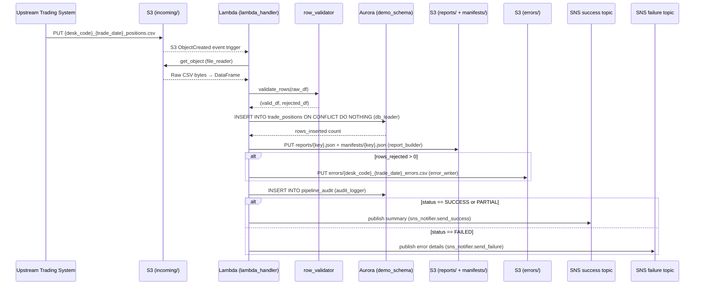
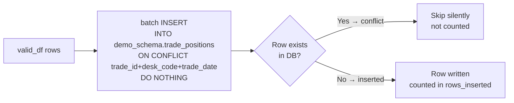
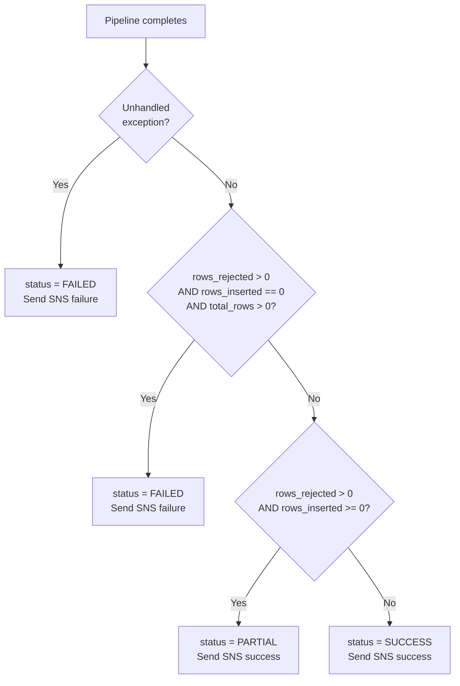

# Technical Design Document
## Daily Trade Position Ingestion — Enterprise Risk Data Platform

---

### COMPONENTS

---

#### `lambda_handler.py`
**Entry point for the AWS Lambda function. Orchestrates the full pipeline for a single S3-triggered file.**

- **What it does:**
  - Receives an S3 event trigger (object created) with bucket name and object key.
  - Extracts `desk_code` and `trade_date` from the filename using the pattern `{desk_code}_{trade_date}_positions.csv`.
  - Calls `file_reader.read_csv_from_s3(bucket, key)` to load raw rows.
  - Calls `row_validator.validate_rows(raw_df)` to split rows into `valid_df` and `rejected_df`.
  - Calls `db_loader.load_positions(valid_df)` to insert validated rows; receives `rows_inserted` count.
  - Calls `report_builder.build_and_save_report(valid_df, rejected_df, filename, desk_code, trade_date, rows_inserted)` to write the summary JSON report and manifest.
  - Calls `error_writer.write_error_file(rejected_df, bucket, desk_code, trade_date)` if any rows were rejected.
  - Calls `audit_logger.write_audit_record(filename, desk_code, trade_date, status, total_rows, rows_inserted, rows_rejected, error_message)`.
  - Calls `sns_notifier.send_success(summary_dict)` or `sns_notifier.send_failure(error_details_dict)` depending on outcome.
  - On any unhandled exception, writes audit record with `status='FAILED'` and sends failure SNS notification.

- **Reads:** S3 event payload — `Records[*].s3.bucket.name`, `Records[*].s3.object.key`
- **Writes:** Nothing directly; delegates to sub-modules.
- **Satisfies:** BAC-1, BAC-2, BAC-3, BAC-4, BAC-5, BAC-6, BAC-7

---

#### `file_reader.py`
**Downloads and parses a CSV position file from S3 into a raw pandas DataFrame.**

- **What it does:**
  - Function: `read_csv_from_s3(bucket: str, key: str) -> pd.DataFrame`
  - Uses `boto3.client("s3")` to call `get_object(Bucket=bucket, Key=key)`.
  - Reads the response body with `pd.read_csv()`, treating all columns as `str` (dtype=str) to preserve raw values for validation.
  - Returns a DataFrame with columns as found in the file header. Does not raise on empty files — returns empty DataFrame.
  - Logs a warning if the file is empty.

- **Reads:** S3 object at `s3://agentic-poc-533266968934/{key}` (CSV, comma-delimited, with header row).
- **Writes:** Nothing. Returns `pd.DataFrame`.
- **Satisfies:** BAC-1, BAC-6

---

#### `row_validator.py`
**Validates each row in the raw DataFrame against mandatory field rules. Splits into valid and rejected sets.**

- **What it does:**
  - Function: `validate_rows(raw_df: pd.DataFrame) -> tuple[pd.DataFrame, pd.DataFrame]`
  - Checks all seven mandatory fields are present as columns: `trade_id`, `desk_code`, `trade_date`, `instrument_type`, `notional_amount`, `currency`, `counterparty_id`.
  - For each row, applies the following rules in order; the first failing rule is recorded as the rejection reason:
    1. **MISSING_FIELD**: Any mandatory column is null, empty string, or whitespace-only.
    2. **INVALID_TRADE_DATE**: `trade_date` cannot be parsed as `YYYY-MM-DD`.
    3. **INVALID_NOTIONAL**: `notional_amount` cannot be parsed as a finite decimal number.
    4. **INVALID_CURRENCY**: `currency` is not exactly 3 alphabetic characters.
  - Valid rows are returned as a cleaned DataFrame with types coerced: `trade_date` → `datetime.date`, `notional_amount` → `Decimal`.
  - Rejected rows are returned as the original raw rows plus a `rejection_reason` column containing the rejection message string.
  - Function: `get_mandatory_columns() -> list[str]` — returns `["trade_id", "desk_code", "trade_date", "instrument_type", "notional_amount", "currency", "counterparty_id"]`.

- **Reads:** `pd.DataFrame` from `file_reader.read_csv_from_s3`.
- **Writes:** Returns `(valid_df: pd.DataFrame, rejected_df: pd.DataFrame)`.
- **Satisfies:** BAC-2, BAC-4

---

#### `db_loader.py`
**Inserts validated trade position rows into `demo_schema.trade_positions` using idempotent upsert logic.**

- **What it does:**
  - Function: `load_positions(valid_df: pd.DataFrame) -> int`
  - Calls `secret_manager.get_db_credentials()` to retrieve DB connection parameters.
  - Opens a `psycopg2` connection to the Aurora PostgreSQL database.
  - Executes batch `INSERT INTO demo_schema.trade_positions (trade_id, desk_code, trade_date, instrument_type, notional_amount, currency, counterparty_id) VALUES %s ON CONFLICT (trade_id, desk_code, trade_date) DO NOTHING` using `psycopg2.extras.execute_values`.
  - Returns the count of rows actually inserted (uses `cursor.rowcount` aggregated across the batch; rows skipped due to conflict are NOT counted).
  - Commits the transaction after successful batch insert; rolls back on any exception.
  - Logs the number of rows submitted vs. inserted.

- **Reads:** `valid_df` columns: `trade_id`, `desk_code`, `trade_date`, `instrument_type`, `notional_amount`, `currency`, `counterparty_id`.
- **Writes:** `demo_schema.trade_positions` (see DATA CONTRACTS).
- **Satisfies:** BAC-1, BAC-3, BAC-6

---

#### `secret_manager.py`
**Retrieves database credentials from AWS Secrets Manager at runtime. No credentials stored in code.**

- **What it does:**
  - Function: `get_db_credentials() -> dict`
  - Calls `boto3.client("secretsmanager").get_secret_value(SecretId=os.environ["DB_SECRET_ID"])`.
  - Parses the secret JSON string and returns a dict with keys: `host`, `port`, `dbname`, `username`, `password`.
  - Caches the result in a module-level variable after first retrieval (Lambda execution context re-use optimization). Cache is invalidated on cold start only.
  - Raises `RuntimeError` if any required key is missing from the secret payload.

- **Reads:** AWS Secrets Manager secret at `os.environ["DB_SECRET_ID"]` (value: `agentic-poc-aurora`).
- **Writes:** Nothing. Returns `dict`.
- **Satisfies:** BAC-8

---

#### `report_builder.py`
**Builds the post-load summary report JSON, writes it to S3 under the reports prefix, and writes a manifest JSON at a predictable key.**

- **What it does:**
  - Function: `build_and_save_report(valid_df: pd.DataFrame, rejected_df: pd.DataFrame, filename: str, desk_code: str, trade_date: str, rows_inserted: int) -> dict`
  - Computes:
    - `total_rows`: `len(valid_df) + len(rejected_df)`
    - `rows_loaded`: `rows_inserted`
    - `rows_rejected`: `len(rejected_df)`
    - `processing_timestamp_et`: current time in `America/Toronto` formatted as ISO 8601.
    - `rows_by_desk_code`: `valid_df.groupby("desk_code").size().to_dict()`
    - `min_notional`: `float(valid_df["notional_amount"].min())` (None if empty)
    - `max_notional`: `float(valid_df["notional_amount"].max())` (None if empty)
    - `null_rates`: for each mandatory column, `(count of nulls / total_rows)` as a float rounded to 4 decimal places, computed across both `valid_df` and `rejected_df` combined (before split). If `total_rows == 0`, all null rates are 0.0.
  - Assembles `summary_dict` with all above fields plus `filename` and `desk_code` and `trade_date`.
  - Writes `summary_dict` as pretty-printed JSON to S3:
    - **Report key**: `reports/{desk_code}_{trade_date}_{processing_timestamp_et_compact}.json`
      where `processing_timestamp_et_compact` is formatted as `YYYYMMDDTHHMMSS`.
    - **Manifest key**: `manifests/{desk_code}_{trade_date}_manifest.json`
      Manifest JSON structure: `{"desk_code": str, "trade_date": str, "report_key": str, "manifest_updated_at": str (ISO 8601 ET)}`
  - Returns `summary_dict`.

- **Reads:** `valid_df`, `rejected_df`, scalar inputs.
- **Writes:**
  - `s3://agentic-poc-533266968934/reports/{desk_code}_{trade_date}_{YYYYMMDDTHHMMSS}.json`
  - `s3://agentic-poc-533266968934/manifests/{desk_code}_{trade_date}_manifest.json`
- **Satisfies:** BAC-4, BAC-7

---

#### `error_writer.py`
**Writes rejected rows (with rejection reasons) to an error CSV in S3 under the errors prefix.**

- **What it does:**
  - Function: `write_error_file(rejected_df: pd.DataFrame, bucket: str, desk_code: str, trade_date: str) -> str`
  - If `rejected_df` is empty, logs a debug message and returns `None`.
  - Serializes `rejected_df` (all original columns + `rejection_reason` column) to CSV (UTF-8, with header).
  - Writes to S3 key: `errors/{desk_code}_{trade_date}_errors.csv`
  - Returns the full S3 key written.

- **Reads:** `rejected_df` columns: all original source columns + `rejection_reason`.
- **Writes:** `s3://agentic-poc-533266968934/errors/{desk_code}_{trade_date}_errors.csv`
- **Satisfies:** BAC-2

---

#### `audit_logger.py`
**Inserts a single record into `demo_schema.pipeline_audit` to capture the processing outcome for compliance and audit purposes.**

- **What it does:**
  - Function: `write_audit_record(filename: str, desk_code: str, trade_date: str, status: str, total_rows: int, rows_inserted: int, rows_rejected: int, error_message: str | None) -> None`
  - Calls `secret_manager.get_db_credentials()` to retrieve DB connection.
  - Executes:
    ```sql
    INSERT INTO demo_schema.pipeline_audit
      (filename, desk_code, trade_date, status, total_rows, rows_inserted, rows_rejected, error_message, processing_timestamp_et)
    VALUES (%s, %s, %s, %s, %s, %s, %s, %s, %s)
    ```
  - `processing_timestamp_et` = current time in `America/Toronto` as a timezone-aware `datetime` object.
  - `status` must be one of: `'SUCCESS'`, `'PARTIAL'`, `'FAILED'`.
    - `'SUCCESS'`: rows_rejected == 0 and rows_inserted > 0
    - `'PARTIAL'`: rows_rejected > 0 and rows_inserted > 0
    - `'FAILED'`: unhandled exception or rows_inserted == 0 with rows > 0
  - Always commits the audit record even if the main pipeline failed.

- **Reads:** Function parameters.
- **Writes:** `demo_schema.pipeline_audit` (one row per file processed).
- **Satisfies:** BAC-7, BAC-8 (audit trail)

---

#### `sns_notifier.py`
**Publishes SNS notifications to success or failure topics after pipeline completion.**

- **What it does:**
  - Function: `send_success(summary_dict: dict) -> None`
    - Publishes to `os.environ["SNS_SUCCESS_TOPIC_ARN"]`.
    - Message: serialized `summary_dict` as JSON (see SNS message schema in DATA CONTRACTS).
    - Subject: `"Trade Position Load Success: {desk_code} {trade_date}"`
  - Function: `send_failure(error_details: dict) -> None`
    - Publishes to `os.environ["SNS_FAILURE_TOPIC_ARN"]`.
    - Message: serialized `error_details` as JSON.
    - Subject: `"Trade Position Load FAILED: {desk_code} {trade_date}"`
    - `error_details` keys: `filename`, `desk_code`, `trade_date`, `error_message`, `processing_timestamp_et`.
  - Uses `boto3.client("sns").publish(TopicArn=..., Message=..., Subject=...)`.

- **Reads:** `summary_dict` or `error_details` dict; env vars `SNS_SUCCESS_TOPIC_ARN`, `SNS_FAILURE_TOPIC_ARN`.
- **Writes:** SNS message to the appropriate topic.
- **Satisfies:** BAC-5

---

### AWS SERVICES

| Service | Role |
|---|---|
| **AWS Lambda** | Compute platform. Function `agentic-poc-sandbox-qa` is triggered by S3 event on object creation under `incoming/` prefix. Executes the full pipeline per file. |
| **Amazon S3** | File storage. Bucket `agentic-poc-533266968934` holds: input files (`incoming/`), error files (`errors/`), summary reports (`reports/`), and manifests (`manifests/`). |
| **Amazon Aurora PostgreSQL** | Reporting database. Schema `demo_schema` contains `trade_positions` (loaded records) and `pipeline_audit` (processing audit trail). |
| **AWS Secrets Manager** | Secure credential store. Secret `agentic-poc-aurora` holds DB connection credentials. Retrieved at runtime; never stored in code. |
| **Amazon SNS** | Notification broker. Two topics: success (`agentic-poc-success`) and failure (`agentic-poc-failure`). Downstream risk pipeline subscribes to receive automated triggers. |

---

### DATA CONTRACTS

#### Database: `demo_schema.trade_positions`

| Column | Type | Nullable | Constraints |
|---|---|---|---|
| `trade_id` | `VARCHAR(100)` | NOT NULL | PK component |
| `desk_code` | `VARCHAR(50)` | NOT NULL | PK component |
| `trade_date` | `DATE` | NOT NULL | PK component |
| `instrument_type` | `VARCHAR(100)` | NOT NULL | — |
| `notional_amount` | `NUMERIC(20,4)` | NOT NULL | — |
| `currency` | `CHAR(3)` | NOT NULL | — |
| `counterparty_id` | `VARCHAR(100)` | NOT NULL | — |
| `loaded_at` | `TIMESTAMPTZ` | NOT NULL | DEFAULT `now()` |

- **Primary Key:** `(trade_id, desk_code, trade_date)`
- **Unique constraint** (same as PK, used for `ON CONFLICT`): `(trade_id, desk_code, trade_date)`

---

#### Database: `demo_schema.pipeline_audit`

| Column | Type | Nullable | Constraints |
|---|---|---|---|
| `audit_id` | `BIGSERIAL` | NOT NULL | PK |
| `filename` | `VARCHAR(255)` | NOT NULL | — |
| `desk_code` | `VARCHAR(50)` | NULL | — |
| `trade_date` | `DATE` | NULL | — |
| `status` | `VARCHAR(20)` | NOT NULL | One of: `SUCCESS`, `PARTIAL`, `FAILED` |
| `total_rows` | `INTEGER` | NOT NULL | DEFAULT 0 |
| `rows_inserted` | `INTEGER` | NOT NULL | DEFAULT 0 |
| `rows_rejected` | `INTEGER` | NOT NULL | DEFAULT 0 |
| `error_message` | `TEXT` | NULL | — |
| `processing_timestamp_et` | `TIMESTAMPTZ` | NOT NULL | ET timezone-aware |
| `created_at` | `TIMESTAMPTZ` | NOT NULL | DEFAULT `now()` |

- **Primary Key:** `(audit_id)`

---

#### S3 Paths

| Purpose | Key Pattern | Format | Content |
|---|---|---|---|
| Input file | `incoming/{desk_code}_{trade_date}_positions.csv` | CSV (comma-delimited, UTF-8, with header) | Mandatory columns: `trade_id`, `desk_code`, `trade_date`, `instrument_type`, `notional_amount`, `currency`, `counterparty_id` |
| Error file | `errors/{desk_code}_{trade_date}_errors.csv` | CSV (comma-delimited, UTF-8, with header) | All source columns + `rejection_reason: str` |
| Report file | `reports/{desk_code}_{trade_date}_{YYYYMMDDTHHMMSS}.json` | JSON (pretty-printed) | Summary report object (see SNS success schema for fields) |
| Manifest file | `manifests/{desk_code}_{trade_date}_manifest.json` | JSON | `{"desk_code": str, "trade_date": str, "report_key": str, "manifest_updated_at": str}` |

---

#### Secrets Manager

| Env Var | Secret ID | JSON Keys in Secret |
|---|---|---|
| `DB_SECRET_ID` | `agentic-poc-aurora` | `host`, `port`, `dbname`, `username`, `password` |

---

#### SNS Topics

| Env Var | ARN | When Published |
|---|---|---|
| `SNS_SUCCESS_TOPIC_ARN` | `arn:aws:sns:us-east-1:533266968934:agentic-poc-success` | After successful load (status `SUCCESS` or `PARTIAL`) |
| `SNS_FAILURE_TOPIC_ARN` | `arn:aws:sns:us-east-1:533266968934:agentic-poc-failure` | On unhandled exception or complete load failure |

**SNS Success Message Schema (JSON):**
```json
{
  "filename": "string — source filename",
  "desk_code": "string",
  "trade_date": "string — YYYY-MM-DD",
  "total_rows": "integer",
  "rows_loaded": "integer",
  "rows_rejected": "integer",
  "processing_timestamp_et": "string — ISO 8601 with timezone",
  "rows_by_desk_code": {"desk_code_value": "integer count"},
  "min_notional": "float or null",
  "max_notional": "float or null",
  "null_rates": {"column_name": "float 0.0–1.0"},
  "report_s3_key": "string — full S3 key of the report JSON"
}
```

**SNS Failure Message Schema (JSON):**
```json
{
  "filename": "string",
  "desk_code": "string or null",
  "trade_date": "string or null",
  "error_message": "string — exception message or validation failure summary",
  "processing_timestamp_et": "string — ISO 8601 with timezone"
}
```

---

#### Environment Variables Summary

| Variable | Value (from infrastructure config) |
|---|---|
| `DB_SECRET_ID` | `agentic-poc-aurora` |
| `S3_BUCKET` | `agentic-poc-533266968934` |
| `SNS_SUCCESS_TOPIC_ARN` | `arn:aws:sns:us-east-1:533266968934:agentic-poc-success` |
| `SNS_FAILURE_TOPIC_ARN` | `arn:aws:sns:us-east-1:533266968934:agentic-poc-failure` |
| `DB_NAME` | `app` |
| `DB_SCHEMA` | `demo_schema` |

---

### DATA FLOW

#### End-to-End Pipeline Flow



---

#### Validation Decision Logic

```mermaid
flowchart TD
    A[Raw Row] --> B{All 7 mandatory\ncolumns present\nin file header?}
    B -- No --> C[Reject: MISSING_FIELD\n'Column {col} not present']
    B -- Yes --> D{Any mandatory field\nnull/empty/whitespace?}
    D -- Yes --> E[Reject: MISSING_FIELD\n'{field} is missing or blank']
    D -- No --> F{trade_date parseable\nas YYYY-MM-DD?}
    F -- No --> G[Reject: INVALID_TRADE_DATE\n'trade_date {val} is not YYYY-MM-DD']
    F -- Yes --> H{notional_amount\nparseable as decimal?}
    H -- No --> I[Reject: INVALID_NOTIONAL\n'notional_amount {val} is not numeric']
    H -- Yes --> J{currency is exactly\n3 alpha characters?}
    J -- No --> K[Reject: INVALID_CURRENCY\n'currency {val} must be 3 alpha chars']
    J -- Yes --> L[Valid Row → valid_df]
    C --> M[rejected_df]
    E --> M
    G --> M
    I --> M
    K --> M
```

---

#### Idempotent Load Logic



---

#### Processing Status Determination



---

### TECHNICAL ACCEPTANCE CRITERIA

**TAC-1 (from BAC-1): All valid rows available in DB before morning risk run.**
- `db_loader.load_positions()` executes `INSERT INTO demo_schema.trade_positions ... ON CONFLICT (trade_id, desk_code, trade_date) DO NOTHING` within the Lambda invocation.
- Acceptance test: after invoking with a 10-row valid file, `SELECT COUNT(*) FROM demo_schema.trade_positions WHERE desk_code = X AND trade_date = Y` returns 10.
- Processing must complete end-to-end within 60 seconds for a 10,000-row file (measured by `processing_timestamp_et` minus S3 event time).

**TAC-2 (from BAC-2): Invalid records are flagged with specific rejection reasons.**
- `row_validator.validate_rows()` assigns a `rejection_reason` string to each rejected row, using one of the defined reason codes: `MISSING_FIELD`, `INVALID_TRADE_DATE`, `INVALID_NOTIONAL`, `INVALID_CURRENCY`.
- `error_writer.write_error_file()` writes `errors/{desk_code}_{trade_date}_errors.csv` containing all rejected rows plus the `rejection_reason` column.
- Acceptance test: submit a file with one row missing `notional_amount` and one row with `trade_date = "not-a-date"`. Verify error CSV contains exactly 2 rows, with `rejection_reason` values `MISSING_FIELD` and `INVALID_TRADE_DATE` respectively.

**TAC-3 (from BAC-3): Resubmitting a file does not double-count positions.**
- `db_loader.load_positions()` uses `ON CONFLICT (trade_id, desk_code, trade_date) DO NOTHING`.
- Acceptance test: process identical file twice. After first run, `COUNT(*)` = N. After second run, `COUNT(*)` = N unchanged. `rows_inserted` on second run = 0. No error raised on second run.

**TAC-4 (from BAC-4): Summary report accurately reflects received, accepted, and rejected counts.**
- `report_builder.build_and_save_report()` computes `total_rows = len(valid_df) + len(rejected_df)`, `rows_loaded = rows_inserted` (from DB, not just validated), `rows_rejected = len(rejected_df)`.
- Report JSON is written to `reports/{desk_code}_{trade_date}_{YYYYMMDDTHHMMSS}.json`; manifest at `manifests/{desk_code}_{trade_date}_manifest.json` points to it.
- Acceptance test: submit a 100-row file with 10 intentionally invalid rows. Verify report JSON contains `total_rows=100`, `rows_rejected=10`, `rows_loaded=90`. Verify manifest key is predictable and `report_key` in manifest resolves to a valid S3 object.

**TAC-5 (from BAC-5): Risk pipeline is automatically notified with no manual trigger.**
- `sns_notifier.send_success()` publishes to `os.environ["SNS_SUCCESS_TOPIC_ARN"]` upon `SUCCESS` or `PARTIAL` status.
- `sns_notifier.send_failure()` publishes to `os.environ["SNS_FAILURE_TOPIC_ARN"]` on `FAILED` status.
- Acceptance test: process a valid file; verify SNS `publish()` was called with `TopicArn = SNS_SUCCESS_TOPIC_ARN` and message JSON contains correct `rows_loaded`, `desk_code`, `trade_date`. No manual step intervenes between S3 deposit and SNS publish.

**TAC-6 (from BAC-6): Processing completes within the operations window.**
- Lambda function must complete end-to-end processing of a 10,000-row file within 60 seconds.
- Acceptance test: time Lambda execution for a 10,000-row test file; assert elapsed time < 60s. Load test with 100,000-row file must not raise `MemoryError` or Lambda timeout (function timeout must be configured ≥ 5 minutes).

**TAC-7 (from BAC-7): All timestamps reflect Eastern Time (America/Toronto).**
- `audit_logger.write_audit_record()` sets `processing_timestamp_et` using `datetime.now(pytz.timezone("America/Toronto"))`.
- `report_builder.build_and_save_report()` sets `processing_timestamp_et` using the same timezone.
- Acceptance test: invoke pipeline and query `demo_schema.pipeline_audit`; assert `processing_timestamp_et` has timezone offset of `-04:00` or `-05:00` (depending on DST) — never `+00:00`. Verify report JSON `processing_timestamp_et` field matches DB value within 5 seconds.

**TAC-8 (from BAC-8): No credentials stored in code or config files.**
- `secret_manager.get_db_credentials()` is the only location where credentials are accessed; it calls `boto3.client("secretsmanager").get_secret_value(SecretId=os.environ["DB_SECRET_ID"])`.
- Acceptance test: grep entire codebase for patterns matching passwords, connection strings with embedded credentials, or hardcoded secret values — assert zero matches. Verify `DB_SECRET_ID` env var resolves at runtime and function raises `RuntimeError` (not `KeyError`) if any required secret key is absent.

---

### OPEN QUESTIONS

None. All infrastructure is defined in the infrastructure config YAML. All business logic rules are specified in the BRD with sufficient precision to implement without further clarification.

---

### ASSUMPTIONS

1. **Lambda trigger:** The Lambda function `agentic-poc-sandbox-qa` is triggered via an S3 ObjectCreated event notification on the bucket `agentic-poc-533266968934` filtered to the prefix `incoming/` and suffix `.csv`. This trigger is assumed to already be configured on the existing Lambda function.

2. **Filename parsing:** The filename strictly follows `{desk_code}_{trade_date}_positions.csv`. The `desk_code` is the first `_`-delimited segment, and `trade_date` is the second segment (format `YYYY-MM-DD`). If the filename does not match this pattern, the Lambda will publish a failure SNS notification with a `FAILED` audit record and `status='FAILED'` citing unparseable filename.

3. **File encoding:** Input CSV files are UTF-8 encoded with a header row. Files using other encodings will fail at the `file_reader` stage and result in a `FAILED` pipeline run.

4. **One file = one desk per invocation:** Each file contains positions for exactly one trading desk. The `desk_code` column in valid rows must match the `desk_code` parsed from the filename. If there is a mismatch, the row is rejected with reason `DESK_CODE_MISMATCH`. *(If this cross-file/row validation is not required, this check can be removed — reviewer should confirm.)*

5. **psycopg2 availability:** `psycopg2-binary` (or a Lambda layer containing it) is available in the Lambda deployment package.

6. **pandas and pytz availability:** Both `pandas` and `pytz` are available in the Lambda runtime (via Lambda layer or deployment package).

7. **Aurora connectivity:** The Lambda function runs in a VPC (or has network access) that allows it to reach the Aurora PostgreSQL cluster. This connectivity is assumed to be pre-configured.

8. **Idempotency scope:** Idempotency is at the individual row level via the composite primary key `(trade_id, desk_code, trade_date)`. If a re-submitted file contains corrected versions of previously-rejected rows (same key, different values), the corrected values will NOT overwrite existing rows — the conflict policy is `DO NOTHING`. If upsert (overwrite on conflict) is ever required, this is a design change requiring BRD amendment.

9. **Error file overwrite:** If a file is reprocessed, the error CSV at `errors/{desk_code}_{trade_date}_errors.csv` is overwritten with the latest run's rejected rows. The manifest at `manifests/{desk_code}_{trade_date}_manifest.json` is also overwritten to point to the latest report. This is intentional for idempotent reprocessing.

10. **`rows_inserted` counting with `ON CONFLICT DO NOTHING`:** PostgreSQL's `cursor.rowcount` after `execute_values` with `ON CONFLICT DO NOTHING` returns the count of rows actually inserted (conflicts excluded) in psycopg2. The implementation relies on this behavior. If the DB driver behaves differently, a pre/post `SELECT COUNT(*)` approach will be substituted.

11. **`pipeline_audit` is append-only:** Every file invocation appends a new audit row. Multiple runs of the same file will produce multiple audit rows (allowing full reprocessing history). No deduplication is applied to the audit table.

12. **Lambda timeout configuration:** The Lambda function is assumed to have a timeout of at least 5 minutes to handle 100,000-row files within the non-functional performance requirement.