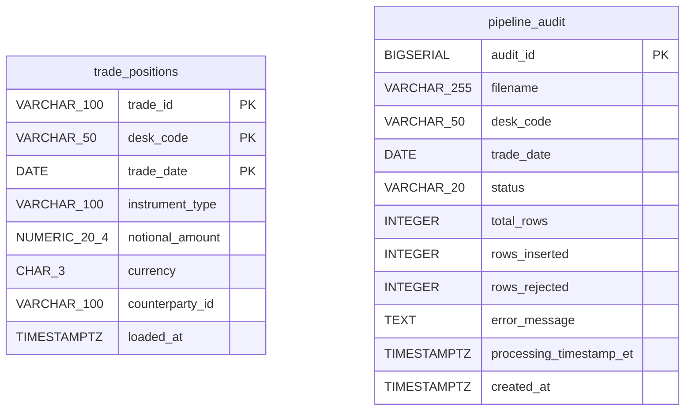
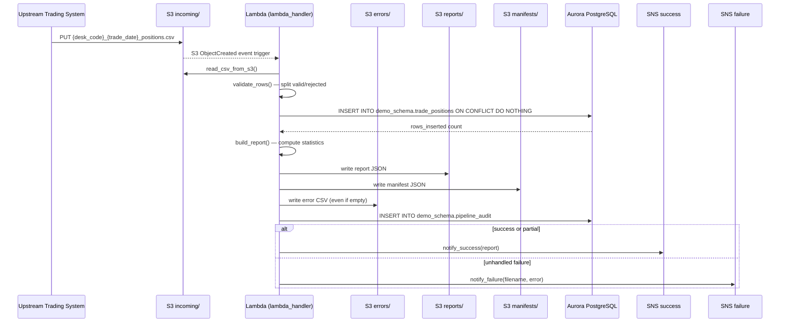
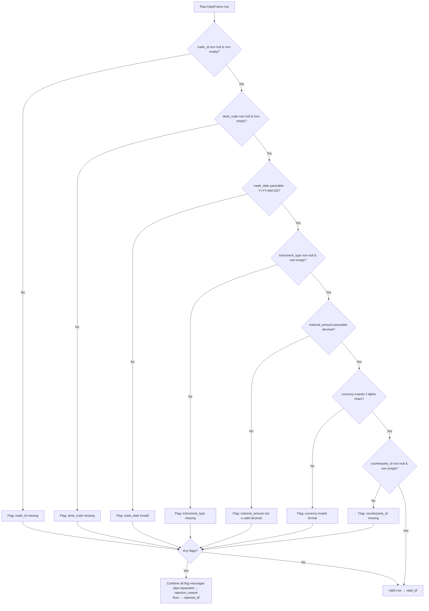
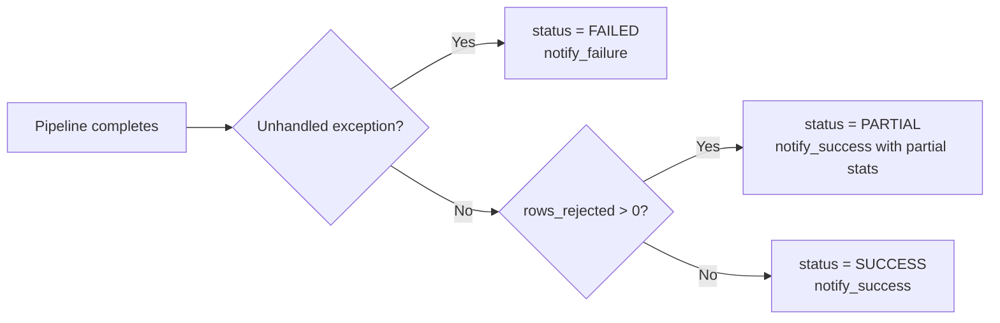

# Technical Design Document
Daily Trade Position Ingestion — Enterprise Risk Data Platform

---

### COMPONENTS

---

#### `lambda_handler.py`
**Entry point for AWS Lambda execution.**

- **What it does:** Orchestrates the full pipeline for a single file. Triggered by an S3 `ObjectCreated` event on the `incoming/` prefix. Extracts the S3 key from the event payload, derives `desk_code` and `trade_date` from the filename using the pattern `{desk_code}_{trade_date}_positions.csv`. Calls `file_reader.read_csv_from_s3()`, passes the result to `row_validator.validate_rows()`, passes validated rows to `position_loader.load_positions()`, passes all results to `report_builder.build_report()`, writes the report via `report_writer.write_report()`, writes the error file via `error_writer.write_error_file()`, writes an audit record via `audit_writer.write_audit_record()`, and dispatches notifications via `sns_notifier.notify_success()` or `sns_notifier.notify_failure()`. Wraps the entire pipeline in a try/except; any unhandled exception triggers `sns_notifier.notify_failure()` and writes a failed audit record.
- **Reads:** S3 event JSON — `event["Records"][0]["s3"]["bucket"]["name"]`, `event["Records"][0]["s3"]["object"]["key"]`
- **Writes:** Nothing directly; delegates to sub-modules.
- **Satisfies:** BAC-1, BAC-2, BAC-3, BAC-4, BAC-5, BAC-6, BAC-7, BAC-8

**Function signature:**
```
def handler(event: dict, context: object) -> dict
```

---

#### `file_reader.py`
**Reads a CSV position file from S3 into a raw DataFrame.**

- **What it does:** Accepts a bucket name and S3 key. Retrieves the object using `boto3` S3 client. Reads the CSV content into a `pandas.DataFrame` preserving all columns as strings (dtype=str) to prevent silent type coercion before validation. Returns the raw DataFrame and the row count. Raises a descriptive exception if the object cannot be read or the CSV cannot be parsed.
- **Reads:** S3 object at `s3://os.environ["S3_BUCKET"]/{key}`. CSV columns expected: `trade_id`, `desk_code`, `trade_date`, `instrument_type`, `notional_amount`, `currency`, `counterparty_id` (plus any extra columns, which are ignored).
- **Writes:** Nothing to storage. Returns `(pd.DataFrame, int)` — raw DataFrame and total row count.
- **Satisfies:** BAC-1, BAC-6

**Function signature:**
```
def read_csv_from_s3(bucket: str, key: str) -> tuple[pd.DataFrame, int]
```

---

#### `row_validator.py`
**Validates each row against mandatory field and format rules.**

- **What it does:** Accepts a raw DataFrame. For each row, checks:
  1. `trade_id` — non-null, non-empty string.
  2. `desk_code` — non-null, non-empty string.
  3. `trade_date` — non-null, parseable as `YYYY-MM-DD` date.
  4. `instrument_type` — non-null, non-empty string.
  5. `notional_amount` — non-null, parseable as a decimal number (can be cast to `NUMERIC`).
  6. `currency` — non-null, exactly 3 alphabetic characters.
  7. `counterparty_id` — non-null, non-empty string.
  
  Rows passing all checks are placed in the `valid_df` DataFrame with columns cast to their target types (`trade_date` as `datetime.date`, `notional_amount` as `Decimal`). Rows failing any check are placed in `rejected_df` with an additional column `rejection_reason` containing a pipe-separated list of all failing field names and their specific error (e.g. `"currency: must be exactly 3 alphabetic characters | notional_amount: not a valid decimal"`). Returns both DataFrames.
- **Reads:** Raw `pd.DataFrame` from `file_reader`.
- **Writes:** Nothing to storage. Returns `(valid_df: pd.DataFrame, rejected_df: pd.DataFrame)`.
- **Satisfies:** BAC-2, BAC-4

**Function signature:**
```
def validate_rows(raw_df: pd.DataFrame) -> tuple[pd.DataFrame, pd.DataFrame]
```

---

#### `position_loader.py`
**Loads validated rows into `demo_schema.trade_positions` with idempotent deduplication.**

- **What it does:** Accepts a validated DataFrame. Retrieves DB credentials via `secret_manager.get_db_credentials()`. Connects to Aurora PostgreSQL using `psycopg2`. For each batch of rows, executes:
  ```sql
  INSERT INTO demo_schema.trade_positions
    (trade_id, desk_code, trade_date, instrument_type, notional_amount, currency, counterparty_id)
  VALUES %s
  ON CONFLICT (trade_id, desk_code, trade_date) DO NOTHING
  ```
  Uses `psycopg2.extras.execute_values()` for batch insert (batch size: 1000 rows). Returns the count of rows actually inserted (not skipped). Uses `cursor.rowcount` per batch to accumulate total inserted count. Commits once per batch. Closes connection after all batches.
- **Reads:** Validated `pd.DataFrame` with columns: `trade_id`, `desk_code`, `trade_date`, `instrument_type`, `notional_amount`, `currency`, `counterparty_id`.
- **Writes:** Rows into `demo_schema.trade_positions`. Returns `int` — count of rows inserted.
- **Satisfies:** BAC-1, BAC-3, BAC-6

**Function signature:**
```
def load_positions(valid_df: pd.DataFrame) -> int
```

---

#### `report_builder.py`
**Computes the post-load summary statistics.**

- **What it does:** Accepts `total_rows: int`, `valid_df: pd.DataFrame`, `rejected_df: pd.DataFrame`, `rows_inserted: int`, `desk_code: str`, `trade_date: str`. Computes:
  - `total_rows`: total rows received from file.
  - `rows_loaded`: `rows_inserted`.
  - `rows_rejected`: `len(rejected_df)`.
  - `rows_skipped_duplicate`: `len(valid_df) - rows_inserted`.
  - `processing_timestamp_et`: current time in `America/Toronto` timezone, ISO 8601 format string.
  - `desk_code`: from parameter.
  - `trade_date`: from parameter.
  - `notional_stats`: `{"min": float, "max": float}` — min/max of `notional_amount` from `valid_df` (null if `valid_df` is empty).
  - `null_rates`: dict of `{column_name: float}` — fraction of null/empty values per mandatory column across all rows in the raw combined DataFrame (valid + rejected).
  - `rejection_reasons`: list of `{"row_index": int, "rejection_reason": str}` from `rejected_df`.
  
  Returns a `dict` representing the full summary report.
- **Reads:** `total_rows: int`, `valid_df: pd.DataFrame`, `rejected_df: pd.DataFrame`, `rows_inserted: int`, `desk_code: str`, `trade_date: str`
- **Writes:** Nothing to storage. Returns `dict`.
- **Satisfies:** BAC-4, BAC-7

**Function signature:**
```
def build_report(
    total_rows: int,
    valid_df: pd.DataFrame,
    rejected_df: pd.DataFrame,
    rows_inserted: int,
    desk_code: str,
    trade_date: str
) -> dict
```

---

#### `report_writer.py`
**Writes the JSON summary report and manifest to S3.**

- **What it does:** Accepts the report `dict`, `desk_code: str`, `trade_date: str`, and `processing_timestamp_et: str` (ISO string, used in the S3 key). Serializes the report dict to JSON. Writes to S3 at:
  ```
  s3://{S3_BUCKET}/reports/{desk_code}_{trade_date}_report_{timestamp}.json
  ```
  where `{timestamp}` is the `processing_timestamp_et` value formatted as `YYYYMMDDTHHMMSS` (ET). Then writes a manifest file at the predictable key:
  ```
  s3://{S3_BUCKET}/manifests/{desk_code}_{trade_date}_manifest.json
  ```
  The manifest JSON contains:
  ```json
  {
    "desk_code": "<desk_code>",
    "trade_date": "<trade_date>",
    "report_key": "reports/{desk_code}_{trade_date}_report_{timestamp}.json",
    "error_key": "errors/{desk_code}_{trade_date}_errors_{timestamp}.csv",
    "generated_at_et": "<processing_timestamp_et>"
  }
  ```
  Returns the actual S3 report key written.
- **Reads:** Report `dict`, `desk_code: str`, `trade_date: str`, `processing_timestamp_et: str`.
- **Writes:** 
  - `s3://{S3_BUCKET}/reports/{desk_code}_{trade_date}_report_{timestamp}.json` — JSON
  - `s3://{S3_BUCKET}/manifests/{desk_code}_{trade_date}_manifest.json` — JSON
- **Satisfies:** BAC-4, BAC-7

**Function signature:**
```
def write_report(report: dict, desk_code: str, trade_date: str, processing_timestamp_et: str) -> str
```

---

#### `error_writer.py`
**Writes the rejected rows error file to S3.**

- **What it does:** Accepts `rejected_df: pd.DataFrame`, `desk_code: str`, `trade_date: str`, `processing_timestamp_et: str`. If `rejected_df` is empty, still writes a zero-row CSV (header only). Writes to S3 at:
  ```
  s3://{S3_BUCKET}/errors/{desk_code}_{trade_date}_errors_{timestamp}.csv
  ```
  The CSV includes all original row fields plus the `rejection_reason` column. Returns the S3 key written.
- **Reads:** `rejected_df: pd.DataFrame` (columns: all original input columns + `rejection_reason`), `desk_code: str`, `trade_date: str`, `processing_timestamp_et: str`.
- **Writes:** `s3://{S3_BUCKET}/errors/{desk_code}_{trade_date}_errors_{timestamp}.csv` — CSV with header.
- **Satisfies:** BAC-2

**Function signature:**
```
def write_error_file(rejected_df: pd.DataFrame, desk_code: str, trade_date: str, processing_timestamp_et: str) -> str
```

---

#### `audit_writer.py`
**Writes a pipeline audit record to `demo_schema.pipeline_audit`.**

- **What it does:** Accepts all audit fields. Retrieves DB credentials via `secret_manager.get_db_credentials()`. Executes:
  ```sql
  INSERT INTO demo_schema.pipeline_audit
    (filename, desk_code, trade_date, status, total_rows, rows_inserted, rows_rejected, error_message, processing_timestamp_et)
  VALUES (%s, %s, %s, %s, %s, %s, %s, %s, %s)
  ```
  `status` is one of `'SUCCESS'`, `'PARTIAL'` (some rows rejected but load completed), or `'FAILED'` (unhandled exception). `processing_timestamp_et` is a timezone-aware datetime in `America/Toronto`. `error_message` is `None` on success, the exception string on failure.
- **Reads:** `filename: str`, `desk_code: str | None`, `trade_date: str | None`, `status: str`, `total_rows: int`, `rows_inserted: int`, `rows_rejected: int`, `error_message: str | None`, `processing_timestamp_et: datetime`.
- **Writes:** One row into `demo_schema.pipeline_audit`.
- **Satisfies:** BAC-7, BAC-8 (supports regulatory audit trail)

**Function signature:**
```
def write_audit_record(
    filename: str,
    desk_code: str | None,
    trade_date: str | None,
    status: str,
    total_rows: int,
    rows_inserted: int,
    rows_rejected: int,
    error_message: str | None,
    processing_timestamp_et: datetime
) -> None
```

---

#### `sns_notifier.py`
**Publishes success and failure notifications to SNS topics.**

- **What it does:** Two functions. `notify_success()` publishes to `os.environ["SNS_SUCCESS_TOPIC_ARN"]`. `notify_failure()` publishes to `os.environ["SNS_FAILURE_TOPIC_ARN"]`. Both serialize a structured JSON message (see Data Contracts → SNS) and call `boto3` SNS client `publish()`.
- **Reads:** Report `dict` or error details `dict`. Env vars `SNS_SUCCESS_TOPIC_ARN`, `SNS_FAILURE_TOPIC_ARN`.
- **Writes:** SNS message to the respective topic.
- **Satisfies:** BAC-5

**Function signatures:**
```
def notify_success(report: dict) -> None
def notify_failure(filename: str, error_message: str, desk_code: str | None, trade_date: str | None) -> None
```

---

#### `secret_manager.py`
**Retrieves database credentials from AWS Secrets Manager at runtime.**

- **What it does:** Reads the secret identified by `os.environ["DB_SECRET_ID"]` using `boto3` Secrets Manager client. Parses the secret JSON string. Returns a dict with keys `host`, `port`, `dbname`, `username`, `password`. Caches the result within the Lambda execution context (module-level variable) to avoid redundant API calls across batches within a single invocation. Does not cache across cold starts.
- **Reads:** `os.environ["DB_SECRET_ID"]` → Secrets Manager secret JSON.
- **Writes:** Nothing. Returns `dict` with keys: `host`, `port`, `dbname`, `username`, `password`.
- **Satisfies:** BAC-8

**Function signature:**
```
def get_db_credentials() -> dict
```

---

### AWS SERVICES

| Service | Role |
|---|---|
| **AWS Lambda** | Compute — executes the ingestion pipeline. Function name: `agentic-poc-sandbox-qa`. Triggered by S3 event on `incoming/` prefix. |
| **Amazon S3** | Storage — receives input files (`incoming/`), stores error files (`errors/`), stores summary reports (`reports/`), stores manifest files (`manifests/`). Bucket: `agentic-poc-533266968934` (via env var `S3_BUCKET`). |
| **Amazon Aurora PostgreSQL** | Reporting database — stores validated trade positions (`demo_schema.trade_positions`) and pipeline audit records (`demo_schema.pipeline_audit`). |
| **AWS Secrets Manager** | Credential store — holds Aurora DB credentials at secret ID `agentic-poc-aurora` (via env var `DB_SECRET_ID`). |
| **Amazon SNS** | Notification — success topic (`agentic-poc-success`) notifies downstream risk pipeline; failure topic (`agentic-poc-failure`) alerts operations team. |

---

### DATA CONTRACTS

---

#### Database Table: `demo_schema.trade_positions`

| Column | Type | Nullable | Notes |
|---|---|---|---|
| `trade_id` | `VARCHAR(100)` | NOT NULL | Part of composite PK |
| `desk_code` | `VARCHAR(50)` | NOT NULL | Part of composite PK |
| `trade_date` | `DATE` | NOT NULL | Part of composite PK |
| `instrument_type` | `VARCHAR(100)` | NOT NULL | |
| `notional_amount` | `NUMERIC(20,4)` | NOT NULL | |
| `currency` | `CHAR(3)` | NOT NULL | |
| `counterparty_id` | `VARCHAR(100)` | NOT NULL | |
| `loaded_at` | `TIMESTAMPTZ` | NOT NULL | Default: `now()` |

- **Primary Key:** `(trade_id, desk_code, trade_date)`
- **Unique Constraint / Deduplication Key:** `(trade_id, desk_code, trade_date)` — used in `ON CONFLICT DO NOTHING`



---

#### Database Table: `demo_schema.pipeline_audit`

| Column | Type | Nullable | Notes |
|---|---|---|---|
| `audit_id` | `BIGSERIAL` | NOT NULL | PK, auto-increment |
| `filename` | `VARCHAR(255)` | NOT NULL | Original S3 object key |
| `desk_code` | `VARCHAR(50)` | NULL | Null if filename parse fails |
| `trade_date` | `DATE` | NULL | Null if filename parse fails |
| `status` | `VARCHAR(20)` | NOT NULL | `'SUCCESS'`, `'PARTIAL'`, or `'FAILED'` |
| `total_rows` | `INTEGER` | NOT NULL | Default: 0 |
| `rows_inserted` | `INTEGER` | NOT NULL | Default: 0 |
| `rows_rejected` | `INTEGER` | NOT NULL | Default: 0 |
| `error_message` | `TEXT` | NULL | Populated on `FAILED` |
| `processing_timestamp_et` | `TIMESTAMPTZ` | NOT NULL | ET-aware timestamp |
| `created_at` | `TIMESTAMPTZ` | NOT NULL | Default: `now()` |

- **Primary Key:** `(audit_id)`

---

#### S3 Paths

| Path Pattern | Format | Description |
|---|---|---|
| `incoming/{desk_code}_{trade_date}_positions.csv` | CSV | Input files deposited by upstream trading systems |
| `errors/{desk_code}_{trade_date}_errors_{YYYYMMDDTHHMMSS}.csv` | CSV | Rejected rows with `rejection_reason` column |
| `reports/{desk_code}_{trade_date}_report_{YYYYMMDDTHHMMSS}.json` | JSON | Post-load summary report |
| `manifests/{desk_code}_{trade_date}_manifest.json` | JSON | Predictable pointer to latest report and error file keys |

All paths are under bucket `os.environ["S3_BUCKET"]`.

**Input CSV columns (all string on read):**
`trade_id`, `desk_code`, `trade_date`, `instrument_type`, `notional_amount`, `currency`, `counterparty_id`

**Error CSV columns:**
`trade_id`, `desk_code`, `trade_date`, `instrument_type`, `notional_amount`, `currency`, `counterparty_id`, `rejection_reason`

**Report JSON structure:**
```json
{
  "desk_code": "string",
  "trade_date": "YYYY-MM-DD",
  "total_rows": 0,
  "rows_loaded": 0,
  "rows_rejected": 0,
  "rows_skipped_duplicate": 0,
  "processing_timestamp_et": "ISO-8601 string in America/Toronto",
  "notional_stats": {
    "min": 0.0,
    "max": 0.0
  },
  "null_rates": {
    "trade_id": 0.0,
    "desk_code": 0.0,
    "trade_date": 0.0,
    "instrument_type": 0.0,
    "notional_amount": 0.0,
    "currency": 0.0,
    "counterparty_id": 0.0
  },
  "rejection_reasons": [
    {
      "row_index": 0,
      "rejection_reason": "string"
    }
  ]
}
```

**Manifest JSON structure:**
```json
{
  "desk_code": "string",
  "trade_date": "YYYY-MM-DD",
  "report_key": "reports/{desk_code}_{trade_date}_report_{timestamp}.json",
  "error_key": "errors/{desk_code}_{trade_date}_errors_{timestamp}.csv",
  "generated_at_et": "ISO-8601 string in America/Toronto"
}
```

---

#### Secrets Manager

| Env Var | Secret ID Value | JSON Keys in Secret |
|---|---|---|
| `DB_SECRET_ID` | `agentic-poc-aurora` | `host`, `port`, `dbname`, `username`, `password` |

---

#### SNS Topics

| Env Var | ARN Value | When Published |
|---|---|---|
| `SNS_SUCCESS_TOPIC_ARN` | `arn:aws:sns:us-east-1:533266968934:agentic-poc-success` | After successful file processing |
| `SNS_FAILURE_TOPIC_ARN` | `arn:aws:sns:us-east-1:533266968934:agentic-poc-failure` | On any unhandled exception |

**Success SNS message JSON:**
```json
{
  "event": "TRADE_POSITION_LOAD_SUCCESS",
  "desk_code": "string",
  "trade_date": "YYYY-MM-DD",
  "filename": "string",
  "total_rows": 0,
  "rows_loaded": 0,
  "rows_rejected": 0,
  "rows_skipped_duplicate": 0,
  "report_key": "string",
  "manifest_key": "string",
  "processing_timestamp_et": "ISO-8601 string"
}
```

**Failure SNS message JSON:**
```json
{
  "event": "TRADE_POSITION_LOAD_FAILURE",
  "desk_code": "string or null",
  "trade_date": "string or null",
  "filename": "string",
  "error_message": "string",
  "processing_timestamp_et": "ISO-8601 string"
}
```

---

### DATA FLOW

#### End-to-End Pipeline Flow



---

#### Validation Decision Logic



---

#### Idempotent Load Logic

```
ALGORITHM: load_positions(valid_df)

1. Retrieve DB credentials from secret_manager.get_db_credentials()
2. Open psycopg2 connection using host, port, dbname, username, password
3. total_inserted = 0
4. FOR each batch of 1000 rows from valid_df:
   a. Build list of tuples: (trade_id, desk_code, trade_date, instrument_type, notional_amount, currency, counterparty_id)
   b. Execute:
        INSERT INTO demo_schema.trade_positions
          (trade_id, desk_code, trade_date, instrument_type, notional_amount, currency, counterparty_id)
        VALUES %s
        ON CONFLICT (trade_id, desk_code, trade_date) DO NOTHING
   c. total_inserted += cursor.rowcount
   d. connection.commit()
5. Close connection
6. RETURN total_inserted
```

---

#### Status Determination Logic



---

### TECHNICAL ACCEPTANCE CRITERIA

**TAC-1 (from BAC-1): All valid positions loaded before next morning's risk run.**
- `position_loader.load_positions()` executes `INSERT INTO demo_schema.trade_positions ... ON CONFLICT (trade_id, desk_code, trade_date) DO NOTHING` using `psycopg2.extras.execute_values()` in batches of 1000 rows.
- Acceptance test: after pipeline completes with a 10,000-row file, `SELECT COUNT(*) FROM demo_schema.trade_positions WHERE desk_code = :desk_code AND trade_date = :trade_date` equals the count of valid rows in the input file. Query uses explicit `ORDER BY` when ordering matters.
- Performance assertion: end-to-end Lambda duration for a 10,000-row file is under 60 seconds (verified via Lambda `Duration` CloudWatch metric).

**TAC-2 (from BAC-2): Invalid records flagged with specific rejection reasons.**
- `row_validator.validate_rows()` returns a `rejected_df` DataFrame containing all original row columns plus a `rejection_reason` column. The `rejection_reason` value is a pipe-separated string listing each failing field and its specific failure message (e.g. `"currency: must be exactly 3 alphabetic characters"`).
- `error_writer.write_error_file()` writes `rejected_df` as a CSV to `s3://{S3_BUCKET}/errors/{desk_code}_{trade_date}_errors_{timestamp}.csv`, including the `rejection_reason` column.
- Acceptance test: submit a file with 5 rows each containing a different validation error; confirm error CSV contains exactly 5 rows with non-empty, field-specific `rejection_reason` values.

**TAC-3 (from BAC-3): Resubmitting a file does not create duplicate positions.**
- `position_loader.load_positions()` uses `ON CONFLICT (trade_id, desk_code, trade_date) DO NOTHING`. The composite primary key `(trade_id, desk_code, trade_date)` on `demo_schema.trade_positions` enforces uniqueness at the database level.
- Acceptance test: process the same valid file twice; assert `SELECT COUNT(*) FROM demo_schema.trade_positions WHERE desk_code = :desk AND trade_date = :date` returns the same value after both runs. The `rows_inserted` count on the second run equals 0 (or the count of net-new rows if file was corrected).

**TAC-4 (from BAC-4): Summary report accurately reflects received, accepted, and rejected counts.**
- `report_builder.build_report()` computes: `total_rows` (from `file_reader` row count), `rows_loaded` (from `position_loader` returned count), `rows_rejected` (from `len(rejected_df)`), `rows_skipped_duplicate` (`len(valid_df) - rows_inserted`), `notional_stats.min/max` (from `valid_df["notional_amount"]`), `null_rates` per column, and `rejection_reasons` list.
- `report_writer.write_report()` serializes this dict to JSON at `s3://{S3_BUCKET}/reports/{desk_code}_{trade_date}_report_{timestamp}.json` and writes a manifest at `s3://{S3_BUCKET}/manifests/{desk_code}_{trade_date}_manifest.json`.
- Acceptance test: for a file with 100 total rows (80 valid, 20 invalid), the report JSON must contain `total_rows=100`, `rows_loaded=80`, `rows_rejected=20`. Verify `total_rows == rows_loaded + rows_rejected + rows_skipped_duplicate`.

**TAC-5 (from BAC-5): Downstream pipeline notified automatically with no manual trigger.**
- `sns_notifier.notify_success()` publishes a JSON message to `os.environ["SNS_SUCCESS_TOPIC_ARN"]` containing `event`, `desk_code`, `trade_date`, `filename`, `total_rows`, `rows_loaded`, `rows_rejected`, `rows_skipped_duplicate`, `report_key`, `manifest_key`, `processing_timestamp_et`.
- `sns_notifier.notify_failure()` publishes to `os.environ["SNS_FAILURE_TOPIC_ARN"]` on any unhandled exception.
- Acceptance test: process a valid file and confirm an SNS message with `event = "TRADE_POSITION_LOAD_SUCCESS"` is published to the success topic; intercept via SQS subscription or mock `boto3` SNS client in unit tests.

**TAC-6 (from BAC-6): Processing completes within the operations window.**
- Performance test: Lambda processes a 10,000-row file in under 60 seconds measured from S3 trigger to SNS publish. A 100,000-row file must complete without Lambda timeout (function timeout configured for at least 5 minutes).
- Batch insert size of 1000 rows per `execute_values()` call ensures throughput.

**TAC-7 (from BAC-7): All timestamps reflect Toronto business hours.**
- `report_builder.build_report()` uses `datetime.now(pytz.timezone("America/Toronto"))` for `processing_timestamp_et`.
- `audit_writer.write_audit_record()` passes a `pytz.timezone("America/Toronto")`-aware `datetime` to the `processing_timestamp_et` column in `demo_schema.pipeline_audit`.
- `sns_notifier` includes `processing_timestamp_et` as an ISO 8601 string derived from `America/Toronto` timezone.
- Acceptance test: after processing, `SELECT processing_timestamp_et AT TIME ZONE 'America/Toronto' FROM demo_schema.pipeline_audit ORDER BY audit_id DESC LIMIT 1` returns a timestamp in ET offset (`-04:00` or `-05:00`); the report JSON `processing_timestamp_et` field ends with `-04:00` or `-05:00`.

**TAC-8 (from BAC-8): No credentials in code or config files.**
- `secret_manager.get_db_credentials()` is the only location that accesses database credentials. It calls `boto3` Secrets Manager `get_secret_value(SecretId=os.environ["DB_SECRET_ID"])` at runtime.
- No passwords, connection strings, or tokens appear as literals anywhere in the codebase.
- Acceptance test: static scan (grep) of the entire repo for known credential patterns (passwords, connection strings) returns zero matches. `DB_SECRET_ID` env var holds only the secret name, not the secret value.

---

### OPEN QUESTIONS

None. All infrastructure configuration is resolved via environment variables as documented. All business logic ambiguities are resolvable from the BRD without additional human input.

---

### ASSUMPTIONS

1. **Lambda trigger:** The Lambda function `agentic-poc-sandbox-qa` is configured with an S3 event notification trigger on bucket `agentic-poc-533266968934` for `ObjectCreated` events on prefix `incoming/` with suffix `.csv`. This is pre-existing infrastructure.

2. **One file per invocation:** Each S3 event delivers exactly one record (one file). If AWS batches multiple S3 events, only the first record `event["Records"][0]` is processed per invocation. Files are processed independently.

3. **Filename format is strictly enforced:** Files not matching `{desk_code}_{trade_date}_positions.csv` (where `trade_date` is `YYYY-MM-DD`) will cause a `FAILED` audit record and failure notification. The pipeline does not attempt to process malformed filenames.

4. **Aurora PostgreSQL is VPC-accessible from Lambda:** The Lambda function is deployed in the same VPC (or with VPC peering/endpoint) as the Aurora cluster. No additional network configuration is required.

5. **`demo_schema.trade_positions` and `demo_schema.pipeline_audit` tables already exist** in the Aurora database as defined in the infrastructure config YAML. The pipeline does not run DDL.

6. **Status `'PARTIAL'`** is used when at least one row is rejected but the load completes without an unhandled exception. Both `'SUCCESS'` (zero rejections) and `'PARTIAL'` (some rejections) result in `notify_success()` being called, since the risk pipeline should still be triggered when valid data is available.

7. **`null_rates` in the report** are computed over all rows (valid + rejected combined) using the original string values before type casting, treating empty strings and Python `None`/`NaN` as null.

8. **Batch size of 1000 rows** for `execute_values()` inserts is chosen to balance throughput and memory. This is a code-level constant, not a config parameter.

9. **Lambda memory and timeout** are assumed to be pre-configured to handle 100,000-row files (e.g. 512 MB memory, 5-minute timeout). This is deployment configuration, not application code.

10. **The `loaded_at` column** in `demo_schema.trade_positions` uses the database default `now()` and is not set explicitly in the INSERT statement — the application does not supply this value.

11. **`processing_timestamp_et`** stored in `demo_schema.pipeline_audit` is a `TIMESTAMPTZ` value. The application supplies a timezone-aware Python `datetime` object in `America/Toronto` timezone. PostgreSQL stores it as UTC internally but the application always constructs and displays it in ET.

12. **Re-processing with corrections:** If a corrected file for the same `desk_code` + `trade_date` is submitted, rows with matching `(trade_id, desk_code, trade_date)` are skipped (`DO NOTHING`), and only net-new `trade_id` values are inserted. Corrected rows with the same `trade_id` are NOT updated — updates are out of scope per the BRD's deduplication requirement.