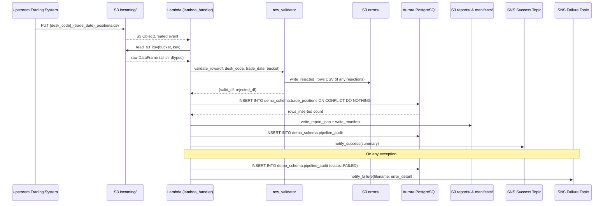
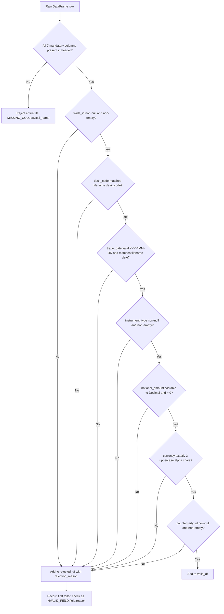
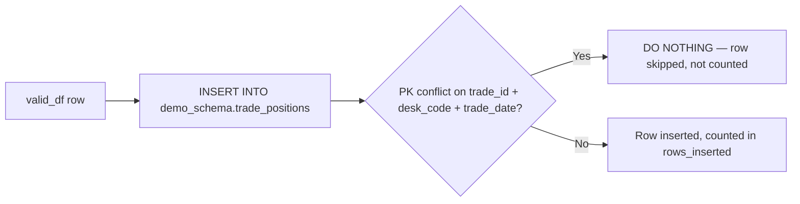
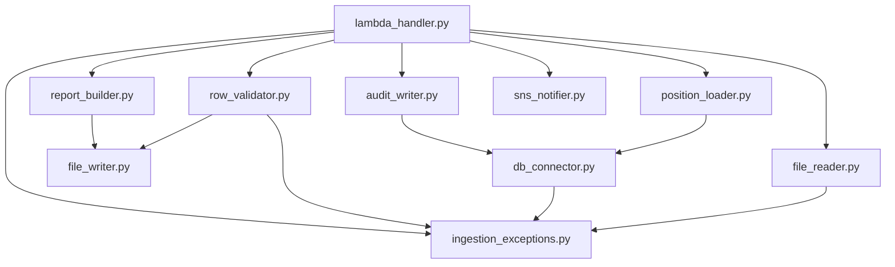

# Technical Design Document
## Daily Trade Position Ingestion — Enterprise Risk Data Platform

---

### COMPONENTS

#### 1. `lambda_handler.py`
**Entry point for the AWS Lambda function. Orchestrates the full pipeline for a single S3 file event.**

- **What it does:**
  - Receives an S3 event notification (object created in `incoming/` prefix)
  - Extracts the S3 bucket name and object key from the event payload
  - Parses `desk_code` and `trade_date` from the filename using the pattern `{desk_code}_{trade_date}_positions.csv`
  - Calls `file_reader.read_s3_csv(bucket, key)` → raw DataFrame
  - Calls `row_validator.validate_rows(df, desk_code, trade_date)` → `(valid_df, rejected_df)`
  - Calls `position_loader.load_positions(valid_df)` → `rows_inserted: int`
  - Calls `report_builder.build_and_store_report(bucket, key, desk_code, trade_date, total_rows, rows_inserted, rejected_df)` → `report_s3_key: str`
  - Calls `audit_writer.write_audit_record(filename, desk_code, trade_date, status, total_rows, rows_inserted, rows_rejected, error_message=None)`
  - Calls `sns_notifier.notify_success(desk_code, trade_date, summary_dict)` or `sns_notifier.notify_failure(filename, error_detail)` depending on outcome
  - On any unhandled exception, writes audit record with `status='FAILED'` and calls `sns_notifier.notify_failure(...)`

- **Reads:** S3 event JSON — `Records[*].s3.bucket.name`, `Records[*].s3.object.key`
- **Writes:** Delegates all writes to subordinate modules; returns HTTP 200 on success
- **Function signatures:**
  - `def handler(event: dict, context: object) -> dict`
  - `def _parse_filename(key: str) -> tuple[str, str]` — raises `ValueError` if filename does not match pattern
- **Satisfies:** BAC-1, BAC-2, BAC-3, BAC-4, BAC-5, BAC-6, BAC-7, BAC-8

---

#### 2. `file_reader.py`
**Reads the raw CSV trade position file from S3 into a pandas DataFrame.**

- **What it does:**
  - Connects to S3 using the boto3 client (no credentials in code — IAM role)
  - Downloads the object at `s3://{bucket}/{key}` into memory (no `/tmp/` path)
  - Reads the CSV using `pandas.read_csv` with `dtype=str` (all fields read as strings to allow downstream validation to catch type errors)
  - Returns a DataFrame with columns preserved as-is from the file header
  - If the object does not exist or cannot be read, raises `FileReadError`

- **Reads:** S3 object — CSV file with header row; expected columns: `trade_id`, `desk_code`, `trade_date`, `instrument_type`, `notional_amount`, `currency`, `counterparty_id`
- **Writes:** Nothing to persistent storage
- **Function signatures:**
  - `def read_s3_csv(bucket: str, key: str) -> pd.DataFrame`
- **Satisfies:** BAC-1, BAC-6

---

#### 3. `row_validator.py`
**Validates each row in the raw DataFrame against the mandatory field rules and data type rules.**

- **What it does:**
  - Checks that all seven mandatory columns are present in the DataFrame header; if any are missing entirely, rejects the entire file with reason `MISSING_COLUMN:{column_name}`
  - For each row, applies the following checks in order:
    1. `trade_id`: non-null, non-empty string
    2. `desk_code`: non-null, non-empty string; must match the `desk_code` parsed from filename
    3. `trade_date`: non-null; must parse as a valid date in `YYYY-MM-DD` format; must match the `trade_date` parsed from filename
    4. `instrument_type`: non-null, non-empty string
    5. `notional_amount`: non-null; must be castable to `Decimal`; must be > 0
    6. `currency`: non-null; must be exactly 3 uppercase alphabetic characters
    7. `counterparty_id`: non-null, non-empty string
  - A row failing any check is moved to the rejected set; the rejection reason is the first failed check in the form `INVALID_FIELD:{field_name}:{reason}` (e.g., `INVALID_FIELD:currency:must_be_3_char_alpha`)
  - Returns `(valid_df, rejected_df)` where `rejected_df` has all original columns plus `rejection_reason: str`
  - Writes the rejected rows CSV to S3 at `errors/{desk_code}_{trade_date}_rejected.csv` via `file_writer.write_rejected_rows(...)`

- **Reads:** Raw DataFrame (all `str` dtypes); `desk_code: str`; `trade_date: str`
- **Writes:** Calls `file_writer.write_rejected_rows(bucket, desk_code, trade_date, rejected_df)` — see `file_writer.py`
- **Function signatures:**
  - `def validate_rows(df: pd.DataFrame, desk_code: str, trade_date: str, bucket: str) -> tuple[pd.DataFrame, pd.DataFrame]`
  - `def _validate_single_row(row: pd.Series, desk_code: str, trade_date: str) -> str | None` — returns rejection reason string or `None` if valid
- **Satisfies:** BAC-2, BAC-4

---

#### 4. `file_writer.py`
**Writes output files (rejected rows CSV, summary report JSON, manifest JSON) to S3.**

- **What it does:**
  - `write_rejected_rows`: serializes `rejected_df` to CSV (including `rejection_reason` column) and writes to `s3://{bucket}/errors/{desk_code}_{trade_date}_rejected.csv` — overwrites on re-processing (idempotent key)
  - `write_report_json`: serializes the summary report dict to JSON and writes to `s3://{bucket}/reports/{desk_code}_{trade_date}_summary.json` — overwrites on re-processing (idempotent key)
  - `write_manifest`: writes a manifest JSON to `s3://{bucket}/manifests/{desk_code}_{trade_date}_manifest.json` mapping logical names to actual S3 keys (see Data Contracts)
  - All writes use `boto3.client("s3").put_object(...)` with `ContentType` set appropriately
  - No local filesystem writes

- **Reads:** In-memory DataFrames and dicts passed as arguments; bucket name from `os.environ["S3_BUCKET"]`
- **Writes:**
  - `s3://{bucket}/errors/{desk_code}_{trade_date}_rejected.csv`
  - `s3://{bucket}/reports/{desk_code}_{trade_date}_summary.json`
  - `s3://{bucket}/manifests/{desk_code}_{trade_date}_manifest.json`
- **Function signatures:**
  - `def write_rejected_rows(bucket: str, desk_code: str, trade_date: str, rejected_df: pd.DataFrame) -> str` — returns S3 key
  - `def write_report_json(bucket: str, desk_code: str, trade_date: str, report: dict) -> str` — returns S3 key
  - `def write_manifest(bucket: str, desk_code: str, trade_date: str, keys: dict) -> str` — returns S3 key
- **Satisfies:** BAC-2, BAC-4, BAC-7

---

#### 5. `position_loader.py`
**Loads validated trade position rows into `demo_schema.trade_positions` using idempotent INSERT.**

- **What it does:**
  - Receives the validated DataFrame (with columns: `trade_id`, `desk_code`, `trade_date`, `instrument_type`, `notional_amount`, `currency`, `counterparty_id`)
  - Casts `trade_date` to `datetime.date`, `notional_amount` to `Decimal`
  - Obtains a database connection via `db_connector.get_connection()`
  - Executes a batch `INSERT INTO demo_schema.trade_positions (trade_id, desk_code, trade_date, instrument_type, notional_amount, currency, counterparty_id) VALUES %s ON CONFLICT (trade_id, desk_code, trade_date) DO NOTHING`
  - Uses `psycopg2.extras.execute_values` for batch insert (performance: handles 100k rows)
  - Returns the count of rows actually inserted (not skipped): uses `cursor.rowcount` after `execute_values` or computes pre/post count delta
  - If `valid_df` is empty, returns 0 without executing SQL
  - Does not set `loaded_at` — relies on column default `now()`

- **Reads:** `valid_df: pd.DataFrame` with columns as above; DB credentials via `db_connector`
- **Writes:** Rows to `demo_schema.trade_positions`
- **Function signatures:**
  - `def load_positions(valid_df: pd.DataFrame) -> int` — returns `rows_inserted`
- **Satisfies:** BAC-1, BAC-3, BAC-6

---

#### 6. `report_builder.py`
**Computes the post-load summary statistics and delegates writing to `file_writer`.**

- **What it does:**
  - Receives: `bucket`, `filename` (original S3 key), `desk_code`, `trade_date`, `total_rows`, `rows_inserted`, `rejected_df`
  - Computes the following statistics from `valid_df` and `rejected_df`:
    - `total_rows_received`: int
    - `rows_successfully_loaded`: int (= `rows_inserted`)
    - `rows_rejected`: int (= `len(rejected_df)`)
    - `processing_timestamp_et`: ISO-8601 string in `America/Toronto` timezone
    - `desk_code_counts`: `{desk_code: row_count}` — grouped from `valid_df["desk_code"].value_counts()`
    - `notional_min`: `float(valid_df["notional_amount"].astype(float).min())` — `null` if no valid rows
    - `notional_max`: `float(valid_df["notional_amount"].astype(float).max())` — `null` if no valid rows
    - `null_rates`: `{column_name: rate}` for all 7 mandatory columns computed over the **full** raw DataFrame (including rejected rows), where `rate = null_count / total_rows`
  - Assembles dict `report` with all above keys
  - Calls `file_writer.write_report_json(bucket, desk_code, trade_date, report)` → `report_key`
  - Calls `file_writer.write_manifest(bucket, desk_code, trade_date, {"report": report_key, "errors": error_key})` → `manifest_key`
  - Returns `(report: dict, report_key: str)`

- **Reads:** In-memory DataFrames and scalars; `bucket` from caller
- **Writes:** Delegates to `file_writer`
- **Function signatures:**
  - `def build_and_store_report(bucket: str, filename: str, desk_code: str, trade_date: str, total_rows: int, rows_inserted: int, valid_df: pd.DataFrame, rejected_df: pd.DataFrame) -> tuple[dict, str]`
  - `def _compute_null_rates(df: pd.DataFrame) -> dict[str, float]`
  - `def _get_et_timestamp() -> str` — returns current time as ISO-8601 in `America/Toronto`
- **Satisfies:** BAC-4, BAC-7

---

#### 7. `audit_writer.py`
**Inserts a record into `demo_schema.pipeline_audit` for every file processed.**

- **What it does:**
  - Receives all audit fields as arguments
  - Converts `processing_timestamp_et` (a Python `datetime` in ET) to a timezone-aware `datetime` with `pytz.timezone("America/Toronto")`
  - Executes `INSERT INTO demo_schema.pipeline_audit (filename, desk_code, trade_date, status, total_rows, rows_inserted, rows_rejected, error_message, processing_timestamp_et) VALUES (%s, %s, %s, %s, %s, %s, %s, %s, %s)` — no `ON CONFLICT` clause (each processing run produces a new audit row, supporting full audit history)
  - Does not deduplicate audit rows — every invocation produces a new row for traceability
  - Obtains DB connection via `db_connector.get_connection()`

- **Reads:** Parameters passed by caller; DB credentials via `db_connector`
- **Writes:** One row to `demo_schema.pipeline_audit`
- **Function signatures:**
  - `def write_audit_record(filename: str, desk_code: str | None, trade_date: str | None, status: str, total_rows: int, rows_inserted: int, rows_rejected: int, error_message: str | None) -> None`
- **Satisfies:** BAC-4, BAC-7, BAC-8 (audit trail for regulatory examination)

---

#### 8. `sns_notifier.py`
**Publishes success and failure notifications to SNS topics.**

- **What it does:**
  - `notify_success`: publishes a JSON message to `os.environ["SNS_SUCCESS_TOPIC_ARN"]` with the summary statistics; this triggers the downstream risk calculation pipeline
  - `notify_failure`: publishes a JSON message to `os.environ["SNS_FAILURE_TOPIC_ARN"]` with error details
  - Uses `boto3.client("sns").publish(TopicArn=..., Message=json.dumps(payload), Subject=...)`
  - No credentials in code — IAM role assumed by Lambda

- **Reads:** Summary dict or error detail string passed by caller; ARNs from env vars
- **Writes:** SNS message to the appropriate topic
- **Function signatures:**
  - `def notify_success(desk_code: str, trade_date: str, summary: dict) -> None`
  - `def notify_failure(filename: str, error_detail: str) -> None`
- **Satisfies:** BAC-5

---

#### 9. `db_connector.py`
**Manages database connections using credentials retrieved from AWS Secrets Manager.**

- **What it does:**
  - Reads the secret ID from `os.environ["DB_SECRET_ID"]` (value: `agentic-poc-aurora`)
  - Calls `boto3.client("secretsmanager").get_secret_value(SecretId=secret_id)` at runtime (never cached to disk)
  - Parses the JSON secret string to extract: `username`, `password`, `host`, `port`
  - Uses the fixed database name from `os.environ["DB_NAME"]` (value: `app`) — not from the secret
  - Returns a `psycopg2.connect(...)` connection object
  - Connection is not pooled (Lambda stateless execution model); caller is responsible for closing
  - Raises `DBConnectionError` on any connection failure

- **Reads:** AWS Secrets Manager secret (JSON); env vars `DB_SECRET_ID`, `DB_NAME`
- **Writes:** Nothing
- **Function signatures:**
  - `def get_connection() -> psycopg2.extensions.connection`
  - `def _fetch_secret(secret_id: str) -> dict`
- **Satisfies:** BAC-8

---

#### 10. `ingestion_exceptions.py`
**Custom exception classes used across all modules for structured error handling.**

- **What it does:**
  - Defines the exception hierarchy used pipeline-wide:
    - `TradeIngestionError(Exception)` — base class
    - `FileReadError(TradeIngestionError)` — S3 read failure
    - `FilenameParseError(TradeIngestionError)` — filename does not match pattern
    - `DBConnectionError(TradeIngestionError)` — database connection failure
    - `ValidationError(TradeIngestionError)` — entire-file validation failure (e.g., missing column)
  - No logic — only class definitions

- **Reads:** Nothing
- **Writes:** Nothing
- **Function signatures:** Class definitions only
- **Satisfies:** BAC-2 (clear error reasons), BAC-5 (enables clean failure notification)

---

### AWS SERVICES

| Service | Role |
|---|---|
| **AWS Lambda** | Compute platform. The function `agentic-poc-sandbox-qa` is triggered by S3 event notifications on `incoming/` prefix object creation events. Executes the full pipeline per file. |
| **Amazon S3** | Primary storage. Bucket `agentic-poc-533266968934` holds: incoming files (`incoming/`), error files (`errors/`), summary reports (`reports/`), manifests (`manifests/`). |
| **Amazon RDS Aurora (PostgreSQL)** | Reporting database. Hosts `demo_schema.trade_positions` and `demo_schema.pipeline_audit` in database `app`. |
| **AWS Secrets Manager** | Credential store. Secret `agentic-poc-aurora` holds database connection credentials. Retrieved at Lambda runtime — never stored in code. |
| **Amazon SNS** | Notification bus. Two topics: `agentic-poc-success` (success events) and `agentic-poc-failure` (failure events). The downstream risk calculation pipeline subscribes to the success topic. |

---

### DATA CONTRACTS

#### Database Tables

##### `demo_schema.trade_positions`

| Column | Type | Nullable | Constraints |
|---|---|---|---|
| `trade_id` | `VARCHAR(100)` | NOT NULL | PK component |
| `desk_code` | `VARCHAR(50)` | NOT NULL | PK component |
| `trade_date` | `DATE` | NOT NULL | PK component |
| `instrument_type` | `VARCHAR(100)` | NOT NULL | |
| `notional_amount` | `NUMERIC(20,4)` | NOT NULL | |
| `currency` | `CHAR(3)` | NOT NULL | |
| `counterparty_id` | `VARCHAR(100)` | NOT NULL | |
| `loaded_at` | `TIMESTAMPTZ` | NOT NULL | DEFAULT `now()` |

- **Primary Key:** `(trade_id, desk_code, trade_date)`
- **Deduplication:** The primary key enforces idempotency. `ON CONFLICT (trade_id, desk_code, trade_date) DO NOTHING`

---

##### `demo_schema.pipeline_audit`

| Column | Type | Nullable | Constraints |
|---|---|---|---|
| `audit_id` | `BIGSERIAL` | NOT NULL | PK |
| `filename` | `VARCHAR(255)` | NOT NULL | |
| `desk_code` | `VARCHAR(50)` | NULL | |
| `trade_date` | `DATE` | NULL | |
| `status` | `VARCHAR(20)` | NOT NULL | Values: `SUCCESS`, `FAILED`, `PARTIAL` |
| `total_rows` | `INTEGER` | NOT NULL | DEFAULT `0` |
| `rows_inserted` | `INTEGER` | NOT NULL | DEFAULT `0` |
| `rows_rejected` | `INTEGER` | NOT NULL | DEFAULT `0` |
| `error_message` | `TEXT` | NULL | |
| `processing_timestamp_et` | `TIMESTAMPTZ` | NOT NULL | ET timezone |
| `created_at` | `TIMESTAMPTZ` | NOT NULL | DEFAULT `now()` |

- **Primary Key:** `(audit_id)`

---

#### S3 Paths

| Logical Name | S3 Key Pattern | Format | Description |
|---|---|---|---|
| Input file | `incoming/{desk_code}_{trade_date}_positions.csv` | CSV with header | Raw trade positions from upstream; `trade_date` in `YYYY-MM-DD` |
| Error file | `errors/{desk_code}_{trade_date}_rejected.csv` | CSV with header | Rejected rows with `rejection_reason` column appended |
| Summary report | `reports/{desk_code}_{trade_date}_summary.json` | JSON | Post-load statistics (see schema below) |
| Manifest | `manifests/{desk_code}_{trade_date}_manifest.json` | JSON | Maps logical output names to actual S3 keys |

All keys use static `desk_code` + `trade_date` components (no runtime timestamps in keys) — making keys predictable and overwrites idempotent on reprocessing.

---

**Summary Report JSON Schema** (`reports/{desk_code}_{trade_date}_summary.json`):
```json
{
  "filename": "incoming/EQTY_2026-06-01_positions.csv",
  "desk_code": "EQTY",
  "trade_date": "2026-06-01",
  "total_rows_received": 1000,
  "rows_successfully_loaded": 950,
  "rows_rejected": 50,
  "processing_timestamp_et": "2026-06-01T19:45:00-04:00",
  "desk_code_counts": {"EQTY": 950},
  "notional_min": 10000.00,
  "notional_max": 5000000.00,
  "null_rates": {
    "trade_id": 0.0,
    "desk_code": 0.0,
    "trade_date": 0.0,
    "instrument_type": 0.02,
    "notional_amount": 0.0,
    "currency": 0.0,
    "counterparty_id": 0.01
  }
}
```

---

**Manifest JSON Schema** (`manifests/{desk_code}_{trade_date}_manifest.json`):
```json
{
  "desk_code": "EQTY",
  "trade_date": "2026-06-01",
  "generated_at_et": "2026-06-01T19:45:00-04:00",
  "files": {
    "report": "reports/EQTY_2026-06-01_summary.json",
    "errors": "errors/EQTY_2026-06-01_rejected.csv"
  }
}
```

---

#### Secrets Manager

**Env var:** `DB_SECRET_ID = os.environ["DB_SECRET_ID"]`
**Secret ID value:** `agentic-poc-aurora`

Expected JSON keys inside the secret:
```json
{
  "username": "<db_username>",
  "password": "<db_password>",
  "host": "<aurora_cluster_endpoint>",
  "port": 5432
}
```

**Env var:** `DB_NAME = os.environ["DB_NAME"]`  — value: `app`

---

#### SNS Message Formats

**Success Topic:** `os.environ["SNS_SUCCESS_TOPIC_ARN"]` → `arn:aws:sns:us-east-1:533266968934:agentic-poc-success`

```json
{
  "event": "TRADE_POSITIONS_LOADED",
  "desk_code": "EQTY",
  "trade_date": "2026-06-01",
  "total_rows_received": 1000,
  "rows_successfully_loaded": 950,
  "rows_rejected": 50,
  "processing_timestamp_et": "2026-06-01T19:45:00-04:00",
  "report_s3_key": "reports/EQTY_2026-06-01_summary.json",
  "manifest_s3_key": "manifests/EQTY_2026-06-01_manifest.json"
}
```

**Failure Topic:** `os.environ["SNS_FAILURE_TOPIC_ARN"]` → `arn:aws:sns:us-east-1:533266968934:agentic-poc-failure`

```json
{
  "event": "TRADE_POSITIONS_FAILED",
  "filename": "incoming/EQTY_2026-06-01_positions.csv",
  "error_detail": "<error message string>",
  "processing_timestamp_et": "2026-06-01T19:45:00-04:00"
}
```

---

#### Environment Variables Summary

| Variable | Value | Used by |
|---|---|---|
| `S3_BUCKET` | `agentic-poc-533266968934` | `file_reader.py`, `file_writer.py`, `row_validator.py` |
| `DB_SECRET_ID` | `agentic-poc-aurora` | `db_connector.py` |
| `DB_NAME` | `app` | `db_connector.py` |
| `SNS_SUCCESS_TOPIC_ARN` | `arn:aws:sns:us-east-1:533266968934:agentic-poc-success` | `sns_notifier.py` |
| `SNS_FAILURE_TOPIC_ARN` | `arn:aws:sns:us-east-1:533266968934:agentic-poc-failure` | `sns_notifier.py` |

---

### DATA FLOW

#### End-to-End Pipeline Flow



---

#### Per-Row Validation Logic



---

#### Idempotent Load Decision



---

#### Module Dependency Diagram



---

### TECHNICAL ACCEPTANCE CRITERIA

**TAC-1: All valid positions loaded before next morning's risk run**
- `position_loader.load_positions(valid_df)` executes `INSERT INTO demo_schema.trade_positions ... ON CONFLICT (trade_id, desk_code, trade_date) DO NOTHING` within the same Lambda invocation as file arrival
- Acceptance test: after processing a 10,000-row file, `SELECT COUNT(*) FROM demo_schema.trade_positions WHERE desk_code = :desk_code AND trade_date = :trade_date` equals `total_rows - rows_rejected` (minus any pre-existing duplicates)
- Performance assertion: processing of 10,000 rows completes in < 60 seconds measured from Lambda start to SNS publish; 100,000-row file completes without timeout error

**TAC-2: Invalid records flagged with clear, specific reasons**
- `row_validator._validate_single_row` returns a rejection reason string in the format `INVALID_FIELD:{field_name}:{reason}` (e.g., `INVALID_FIELD:currency:must_be_3_char_alpha`) for the **first** failing check per row
- `file_writer.write_rejected_rows` writes a CSV to `s3://{S3_BUCKET}/errors/{desk_code}_{trade_date}_rejected.csv` with all original columns plus a `rejection_reason` column
- Acceptance test: a file with 5 deliberately malformed rows (one per field type) produces a rejected CSV with exactly 5 rows, each containing a non-empty `rejection_reason` matching the injected defect

**TAC-3: Reprocessing does not double-count positions**
- `position_loader.load_positions` uses `psycopg2.extras.execute_values` with the SQL fragment `ON CONFLICT (trade_id, desk_code, trade_date) DO NOTHING`
- Acceptance test: run pipeline twice on the identical input file; after first run, `COUNT(*)` = N; after second run, `COUNT(*)` still = N; `pipeline_audit` contains two rows for the same file (one per invocation), both with `status = 'SUCCESS'`, with `rows_inserted = N` on first run and `rows_inserted = 0` on second run

**TAC-4: Summary report accurately reflects receive/accept/reject counts**
- `report_builder.build_and_store_report` computes `total_rows_received = len(raw_df)`, `rows_successfully_loaded = rows_inserted` (return value of `position_loader.load_positions`), `rows_rejected = len(rejected_df)`
- Invariant enforced: `rows_successfully_loaded + rows_rejected <= total_rows_received` (inequality accounts for skipped duplicates on reprocessing)
- Report written to `s3://{S3_BUCKET}/reports/{desk_code}_{trade_date}_summary.json`; manifest written to `s3://{S3_BUCKET}/manifests/{desk_code}_{trade_date}_manifest.json`
- `pipeline_audit` row `total_rows`, `rows_inserted`, `rows_rejected` must match the report values exactly
- Acceptance test: parse the JSON report after processing; assert each count field matches independently-computed values from the input file

**TAC-5: Downstream pipeline notified automatically — no manual trigger**
- `sns_notifier.notify_success` called by `lambda_handler.handler` unconditionally upon successful completion (even if `rows_inserted = 0`)
- `sns_notifier.notify_failure` called inside the `except` block in `lambda_handler.handler` for any unhandled exception
- SNS message for success contains `"event": "TRADE_POSITIONS_LOADED"` with `desk_code`, `trade_date`, `rows_successfully_loaded`, and `report_s3_key`
- Acceptance test: process a valid file; assert exactly one SNS message published to `SNS_SUCCESS_TOPIC_ARN` with correct `desk_code` and `trade_date`; assert no message published to `SNS_FAILURE_TOPIC_ARN`

**TAC-6: Processing completes within the operations window**
- Lambda function must complete end-to-end (S3 read → validate → DB insert → report write → audit write → SNS publish) for a 10,000-row file in < 60 seconds
- Batch insert uses `psycopg2.extras.execute_values` with a page size of 1,000 rows to avoid memory overflow on 100,000-row files
- Acceptance test: measure wall-clock time from Lambda `START` log line to `END` log line for a 10,000-row test file; assert < 60 seconds

**TAC-7: All timestamps in Eastern Time (America/Toronto)**
- `report_builder._get_et_timestamp()` uses `datetime.now(pytz.timezone("America/Toronto"))` and returns ISO-8601 with UTC offset (e.g., `-04:00` or `-05:00` depending on DST)
- `audit_writer.write_audit_record` stores `processing_timestamp_et` as a timezone-aware `datetime` in ET — confirmed by `SELECT processing_timestamp_et AT TIME ZONE 'America/Toronto' FROM demo_schema.pipeline_audit`
- The string `"UTC"` must NOT appear in any timestamp value in report JSON files or audit records
- Acceptance test: parse `processing_timestamp_et` from the summary JSON and audit table; assert the UTC offset is `-04:00` (EDT) or `-05:00` (EST) and is never `+00:00`

**TAC-8: No secrets in code or configuration files**
- `db_connector.get_connection()` retrieves credentials exclusively via `boto3.client("secretsmanager").get_secret_value(SecretId=os.environ["DB_SECRET_ID"])` — the secret ID value itself comes from the environment variable, not hardcoded
- Static code analysis (grep for password strings, AWS account IDs, hardcoded hostnames) must return zero matches across all `.py` files in the repo
- Acceptance test: run `grep -rn "password\s*=" src/` and assert zero results; run `grep -rn "533266968934" src/` and assert zero results (account ID must not appear in source)

---

### OPEN QUESTIONS

None. All business logic is sufficiently specified in the BRD and infrastructure config. Infrastructure configuration is resolved via the provided YAML and environment variables.

---

### ASSUMPTIONS

1. **Lambda trigger:** The Lambda function `agentic-poc-sandbox-qa` is already configured with an S3 event notification trigger on bucket `agentic-poc-533266968934` for `s3:ObjectCreated:*` events on prefix `incoming/`. This is existing infrastructure — the code does not provision it.

2. **One file = one Lambda invocation:** Each S3 ObjectCreated event triggers exactly one Lambda invocation. The `Records` array in the event will contain exactly one record (standard S3 → Lambda single-object event configuration).

3. **Database schema pre-exists:** Tables `demo_schema.trade_positions` and `demo_schema.pipeline_audit` already exist in database `app` with the schemas defined in the infrastructure config YAML. The application code does not run DDL.

4. **Aurora connectivity:** The Lambda function's VPC configuration and security groups already allow it to connect to the Aurora cluster endpoint. Network plumbing is not part of this delivery.

5. **File encoding:** Input CSV files are UTF-8 encoded. Files with other encodings will produce a `FileReadError`.

6. **File size fits in Lambda memory:** The Lambda function has sufficient memory configured (assumed ≥ 1 GB) to hold a 100,000-row DataFrame in memory alongside pandas and psycopg2 operations.

7. **Status values in `pipeline_audit.status`:** Three values are used: `SUCCESS` (all rows processed, zero or more rejected — pipeline completed without exception), `PARTIAL` (not used in this iteration — reserved), and `FAILED` (unhandled exception prevented completion). The BRD does not define a partial-success status; this assumption should be confirmed.

8. **`rows_inserted` on reprocessing:** On a second run of the same file, `position_loader.load_positions` returns `0` (all rows conflict and are skipped). The audit record and summary report reflect this honestly. The SNS success notification is still sent.

9. **Error file always written:** Even when `len(rejected_df) == 0`, `file_writer.write_rejected_rows` writes an empty CSV (header row only) to `errors/`. This simplifies downstream checks. If the business prefers no file written when there are no rejections, this should be confirmed.

10. **No schema validation on the Lambda function's IAM role:** The Coding Agent assumes the Lambda execution role already has `s3:GetObject` and `s3:PutObject` on the bucket, `secretsmanager:GetSecretValue` on the secret, `sns:Publish` on both topics, and VPC access for Aurora. These are not provisioned by this code.

11. **`desk_code` in valid rows must match filename:** If a valid row's `desk_code` column value differs from the `desk_code` in the filename, it is rejected. This is enforced in `row_validator._validate_single_row`.

12. **`notional_amount` must be strictly positive:** The BRD says "notional amount" — a zero or negative notional is treated as malformed and the row is rejected with `INVALID_FIELD:notional_amount:must_be_positive`.