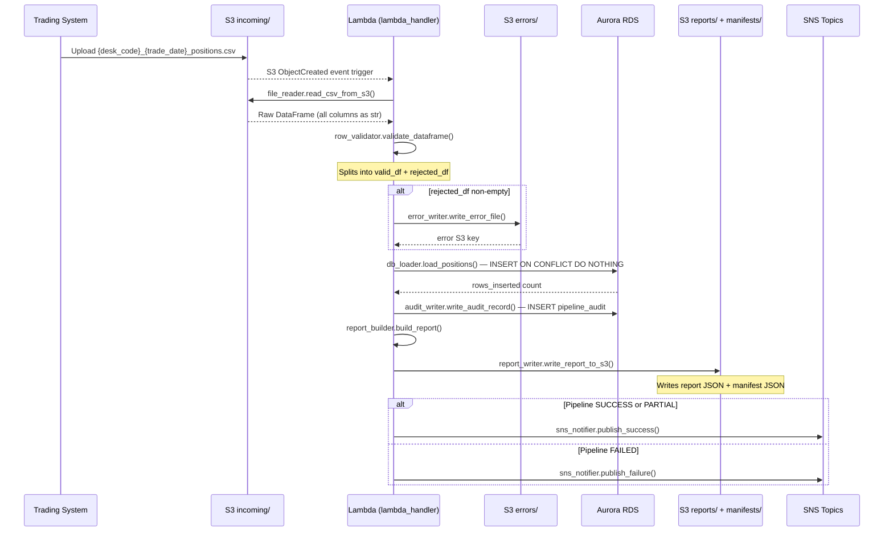
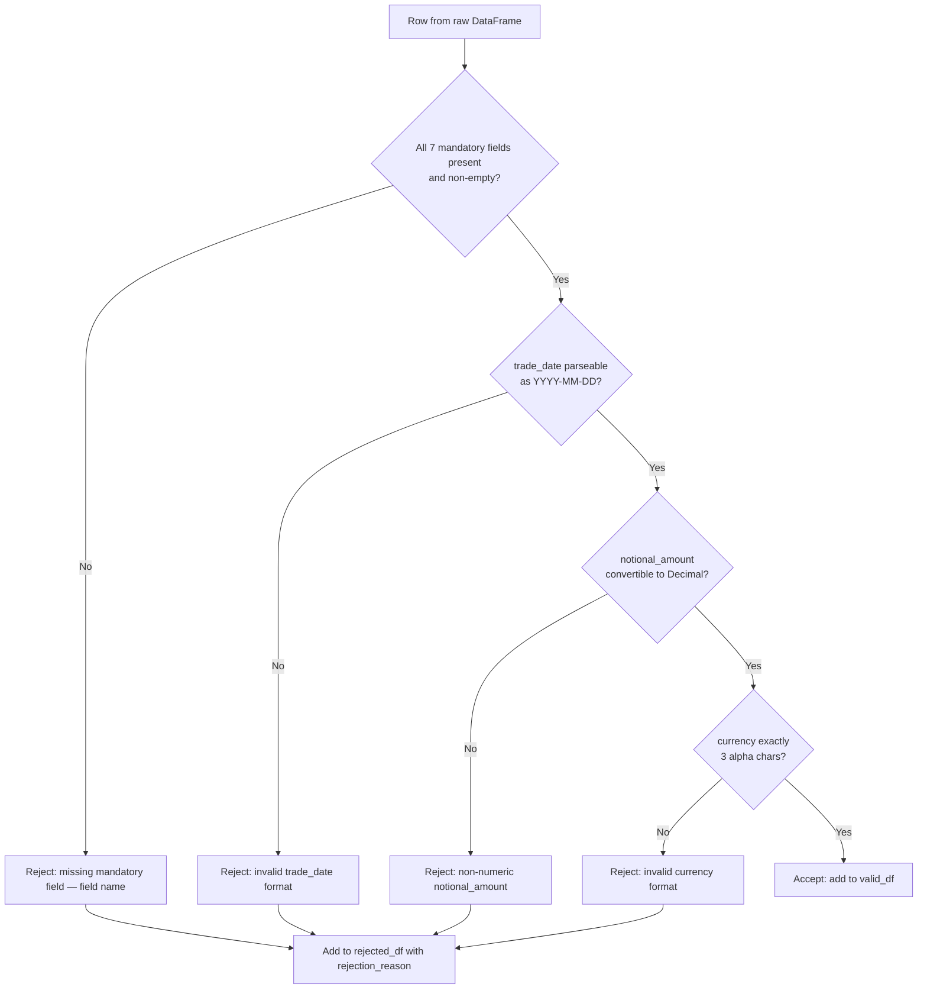
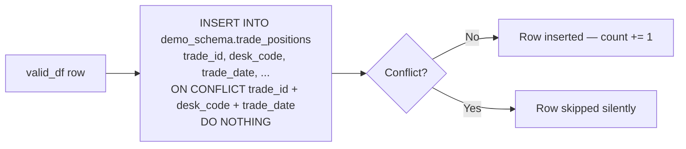
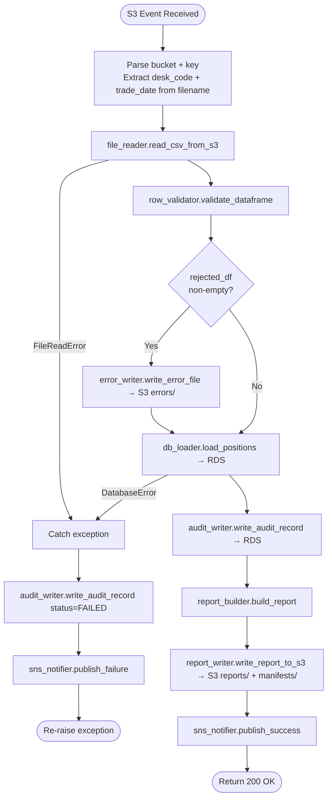

# Technical Design Document
## Daily Trade Position Ingestion — Enterprise Risk Data Platform

---

### COMPONENTS

---

#### `lambda_handler.py`
**Entry point for AWS Lambda invocation triggered by S3 `ObjectCreated` events on the `incoming/` prefix.**

- **What it does:**
  - Receives the Lambda event payload containing the S3 bucket name and object key.
  - Extracts `desk_code` and `trade_date` from the filename using the pattern `{desk_code}_{trade_date}_positions.csv`.
  - Orchestrates the full pipeline by calling, in order: `file_reader.read_csv_from_s3()`, `row_validator.validate_dataframe()`, `db_loader.load_positions()`, `report_builder.build_report()`, `report_writer.write_report_to_s3()`, `sns_notifier.publish_success()` or `sns_notifier.publish_failure()`, and `audit_writer.write_audit_record()`.
  - On any unhandled exception, catches the error, calls `sns_notifier.publish_failure()` and `audit_writer.write_audit_record()` with `status='FAILED'`, then re-raises.
  - Logs all major steps via the `logging` module at INFO level; errors at ERROR level.

- **Reads:** S3 event payload — `event["Records"][0]["s3"]["bucket"]["name"]`, `event["Records"][0]["s3"]["object"]["key"]`
- **Writes:** Orchestrates writes to RDS (`demo_schema.trade_positions`, `demo_schema.pipeline_audit`) and S3 (`reports/`, `errors/`, `manifests/`).
- **Satisfies:** BAC-1, BAC-2, BAC-3, BAC-4, BAC-5, BAC-6, BAC-7, BAC-8

**Signature:**
```
def handler(event: dict, context: object) -> dict
```
Returns `{"statusCode": 200, "body": "OK"}` on success; raises exception on failure.

---

#### `file_reader.py`
**Reads a CSV trade position file from S3 and returns a raw DataFrame.**

- **What it does:**
  - Accepts an S3 bucket name and object key.
  - Uses `boto3.client("s3")` to stream the object and reads it into a `pandas.DataFrame` using `pandas.read_csv()` with `dtype=str` (all columns read as strings to avoid silent type coercion before validation).
  - Returns the raw DataFrame with all original columns preserved.
  - Raises a `FileReadError` (custom exception) if the S3 object cannot be retrieved or the CSV cannot be parsed.

- **Reads:** S3 object at `s3://os.environ["S3_BUCKET"]/incoming/{desk_code}_{trade_date}_positions.csv`
  - Expected columns (as strings): `trade_id`, `desk_code`, `trade_date`, `instrument_type`, `notional_amount`, `currency`, `counterparty_id`
- **Writes:** Nothing (pure read).
- **Satisfies:** BAC-1, BAC-6

**Signatures:**
```
def read_csv_from_s3(bucket: str, key: str) -> pd.DataFrame
```

---

#### `row_validator.py`
**Validates each row of the raw DataFrame against field-level rules and splits rows into valid and rejected sets.**

- **What it does:**
  - Accepts the raw DataFrame from `file_reader`.
  - Applies the following validation rules to each row:
    - **Presence check:** `trade_id`, `desk_code`, `trade_date`, `instrument_type`, `notional_amount`, `currency`, `counterparty_id` must not be null, empty string, or whitespace-only.
    - **Format — `trade_date`:** Must parse as a valid date with `datetime.strptime(value, "%Y-%m-%d")`. Invalid formats are rejected.
    - **Format — `notional_amount`:** Must be convertible to `Decimal` without error. Non-numeric values are rejected.
    - **Format — `currency`:** Must be exactly 3 alphabetic characters (`[A-Za-z]{3}`).
    - **Format — `trade_id`:** Must be non-empty string after stripping whitespace.
  - Rows failing one or more checks are added to the rejected set; the first failing rule's description is recorded as `rejection_reason`.
  - Returns a tuple: `(valid_df: pd.DataFrame, rejected_df: pd.DataFrame)`.
  - `rejected_df` has all original columns plus a `rejection_reason: str` column.

- **Reads:** Raw DataFrame from `file_reader` (all columns as `str`).
- **Writes:** Nothing directly; returns two DataFrames.
- **Satisfies:** BAC-2, BAC-4

**Signatures:**
```
def validate_dataframe(df: pd.DataFrame) -> tuple[pd.DataFrame, pd.DataFrame]
```

---

#### `error_writer.py`
**Writes the rejected-rows DataFrame to S3 as a CSV error file.**

- **What it does:**
  - Accepts the `rejected_df` DataFrame, the source filename, and the S3 bucket name.
  - Constructs the output S3 key as: `errors/{original_filename_without_extension}_errors_{yyyymmddHHMMSS_ET}.csv`
    - Timestamp is current time in `America/Toronto` formatted as `%Y%m%d%H%M%S`.
  - Serialises the DataFrame (all original columns + `rejection_reason`) to CSV using `pandas.DataFrame.to_csv(index=False)` and uploads via `boto3.client("s3").put_object()`.
  - Returns the S3 key of the written error file.
  - If `rejected_df` is empty, returns `None` without writing anything.

- **Reads:** `rejected_df` with columns: `trade_id`, `desk_code`, `trade_date`, `instrument_type`, `notional_amount`, `currency`, `counterparty_id`, `rejection_reason`
- **Writes:** S3 CSV at `s3://os.environ["S3_BUCKET"]/errors/{desk_code}_{trade_date}_positions_errors_{yyyymmddHHMMSS}.csv`
- **Satisfies:** BAC-2

**Signatures:**
```
def write_error_file(rejected_df: pd.DataFrame, source_filename: str, bucket: str) -> str | None
```

---

#### `db_loader.py`
**Loads validated trade position rows into `demo_schema.trade_positions` with ON CONFLICT DO NOTHING deduplication.**

- **What it does:**
  - Accepts the `valid_df` DataFrame and a database connection (obtained via `db_secrets.get_connection()`).
  - Casts columns to their target types: `trade_date` → `datetime.date`, `notional_amount` → `Decimal`, `currency` → uppercase 3-char string.
  - Sets `loaded_at` to current time in `America/Toronto` timezone (as a timezone-aware `datetime`).
  - Executes a parameterised `INSERT INTO demo_schema.trade_positions (trade_id, desk_code, trade_date, instrument_type, notional_amount, currency, counterparty_id, loaded_at) VALUES (%s, %s, %s, %s, %s, %s, %s, %s) ON CONFLICT (trade_id, desk_code, trade_date) DO NOTHING` for each row using `psycopg2` `executemany()`.
  - Returns the count of rows actually inserted (i.e., total rows minus rows skipped by the conflict clause). This is computed as the cursor `rowcount` summed across batches, or by querying count before and after.
  - Does **not** commit; the caller (lambda_handler) manages the connection/transaction lifecycle.

- **Reads:** `valid_df` with columns: `trade_id`, `desk_code`, `trade_date`, `instrument_type`, `notional_amount`, `currency`, `counterparty_id`
- **Writes:** Rows into `demo_schema.trade_positions`.
- **Satisfies:** BAC-1, BAC-3

**Signatures:**
```
def load_positions(valid_df: pd.DataFrame, conn) -> int
```

---

#### `db_secrets.py`
**Retrieves database credentials from AWS Secrets Manager and returns a live `psycopg2` connection.**

- **What it does:**
  - Reads `os.environ["DB_SECRET_ID"]` (value: `agentic-poc-aurora`) to identify the Secrets Manager secret.
  - Calls `boto3.client("secretsmanager").get_secret_value(SecretId=secret_id)` and parses the `SecretString` as JSON.
  - Expects the secret JSON to contain: `host`, `port`, `dbname`, `username`, `password`.
  - Constructs and returns a `psycopg2.connect(host=..., port=..., dbname="app", user=..., password=..., sslmode="require")` connection.
  - Raises `CredentialError` (custom exception) if the secret cannot be fetched or is missing required keys.

- **Reads:** AWS Secrets Manager secret identified by `os.environ["DB_SECRET_ID"]`.
- **Writes:** Nothing.
- **Satisfies:** BAC-8

**Signatures:**
```
def get_connection() -> psycopg2.extensions.connection
```

---

#### `report_builder.py`
**Computes the post-load processing summary report as a Python dict.**

- **What it does:**
  - Accepts `valid_df`, `rejected_df`, `rows_inserted: int`, `source_filename: str`, `desk_code: str`, `trade_date: str`.
  - Computes and returns a `dict` with:
    - `filename: str` — source filename
    - `desk_code: str`
    - `trade_date: str`
    - `total_rows: int` — `len(valid_df) + len(rejected_df)`
    - `rows_received: int` — same as `total_rows`
    - `rows_inserted: int` — from `db_loader` return value
    - `rows_rejected: int` — `len(rejected_df)`
    - `processing_timestamp_et: str` — current time in `America/Toronto` formatted as ISO 8601 (`%Y-%m-%dT%H:%M:%S%z`)
    - `row_counts_by_desk: dict` — `{desk_code: count}` grouped by `desk_code` column in `valid_df`; uses `valid_df.groupby("desk_code").size().to_dict()`
    - `min_notional_amount: float | None` — `valid_df["notional_amount"].astype(float).min()` if valid_df non-empty, else `None`
    - `max_notional_amount: float | None` — `valid_df["notional_amount"].astype(float).max()` if valid_df non-empty, else `None`
    - `null_rates: dict` — per-column null rate as `{col: null_count / total_rows}` across the **combined** (valid + rejected) original rows for the 7 mandatory columns; null rate = 0 if `total_rows == 0`

- **Reads:** `valid_df`, `rejected_df`, scalar inputs.
- **Writes:** Nothing (returns dict).
- **Satisfies:** BAC-4, BAC-7

**Signatures:**
```
def build_report(
    valid_df: pd.DataFrame,
    rejected_df: pd.DataFrame,
    rows_inserted: int,
    source_filename: str,
    desk_code: str,
    trade_date: str
) -> dict
```

---

#### `report_writer.py`
**Serialises the summary report dict to JSON and writes it to S3, then writes a manifest entry.**

- **What it does:**
  - Accepts the report dict, the source filename base (e.g. `EQDESK_2026-06-01_positions`), and the S3 bucket name.
  - Constructs the report S3 key as: `reports/{source_filename_without_extension}_report_{yyyymmddHHMMSS_ET}.json`
    - Timestamp is current time in `America/Toronto` formatted as `%Y%m%d%H%M%S`.
  - Serialises the report dict to JSON with `json.dumps(..., default=str)` and uploads via `boto3.client("s3").put_object()` with `ContentType="application/json"`.
  - Writes (or overwrites) a manifest file at `manifests/{desk_code}_{trade_date}_manifest.json` containing:
    ```json
    {
      "source_filename": "<original .csv filename>",
      "report_key": "reports/<full key>",
      "error_key": "errors/<full key> or null",
      "generated_at_et": "<ISO 8601 ET timestamp>"
    }
    ```
  - Returns the report S3 key as a string.

- **Reads:** Report dict, source filename, error S3 key (may be `None`).
- **Writes:**
  - S3 JSON at `s3://os.environ["S3_BUCKET"]/reports/{desk_code}_{trade_date}_positions_report_{yyyymmddHHMMSS}.json`
  - S3 JSON manifest at `s3://os.environ["S3_BUCKET"]/manifests/{desk_code}_{trade_date}_manifest.json`
- **Satisfies:** BAC-4, BAC-7

**Signatures:**
```
def write_report_to_s3(
    report: dict,
    source_filename: str,
    error_key: str | None,
    bucket: str
) -> str
```

---

#### `sns_notifier.py`
**Publishes success or failure notifications to the appropriate SNS topic.**

- **What it does:**
  - `publish_success`: Reads `os.environ["SNS_SUCCESS_TOPIC_ARN"]`, publishes a JSON message (see DATA CONTRACTS) via `boto3.client("sns").publish()` with `Subject="Trade Position Load SUCCESS"`.
  - `publish_failure`: Reads `os.environ["SNS_FAILURE_TOPIC_ARN"]`, publishes a JSON message (see DATA CONTRACTS) with `Subject="Trade Position Load FAILURE"`.
  - Both functions serialise the message dict to a JSON string before publishing.
  - Logs the SNS message ID at INFO level on success.

- **Reads:** `os.environ["SNS_SUCCESS_TOPIC_ARN"]`, `os.environ["SNS_FAILURE_TOPIC_ARN"]`
- **Writes:** SNS publish calls.
- **Satisfies:** BAC-5

**Signatures:**
```
def publish_success(report: dict, report_s3_key: str) -> None
def publish_failure(filename: str, error_message: str, desk_code: str | None, trade_date: str | None) -> None
```

---

#### `audit_writer.py`
**Inserts a row into `demo_schema.pipeline_audit` to record the outcome of each file processing attempt.**

- **What it does:**
  - Accepts audit fields and a database connection.
  - Executes:
    ```sql
    INSERT INTO demo_schema.pipeline_audit
      (filename, desk_code, trade_date, status, total_rows, rows_inserted, rows_rejected, error_message, processing_timestamp_et)
    VALUES (%s, %s, %s, %s, %s, %s, %s, %s, %s)
    ```
  - `processing_timestamp_et` is set to current time in `America/Toronto` (timezone-aware `datetime`).
  - `status` is one of: `'SUCCESS'`, `'PARTIAL'` (rows loaded + rows rejected), `'FAILED'` (unhandled exception).
  - Commits the transaction immediately (separate from the main data load commit) so audit records persist even if the load is rolled back.
  - Does NOT raise on failure — logs the error at ERROR level and continues, to avoid masking the primary error.

- **Reads:** Scalar audit fields.
- **Writes:** One row to `demo_schema.pipeline_audit`.
- **Satisfies:** BAC-4, BAC-7 (audit trail with ET timestamps)

**Signatures:**
```
def write_audit_record(
    conn,
    filename: str,
    desk_code: str | None,
    trade_date: str | None,
    status: str,
    total_rows: int,
    rows_inserted: int,
    rows_rejected: int,
    error_message: str | None,
    processing_timestamp_et: datetime
) -> None
```

---

#### `pipeline_exceptions.py`
**Defines all custom exception classes used across the pipeline.**

- **What it does:** Defines `FileReadError(Exception)`, `CredentialError(Exception)`, `ValidationError(Exception)`, `DatabaseError(Exception)`. Used for structured error handling in `lambda_handler`.
- **Reads:** Nothing.
- **Writes:** Nothing.
- **Satisfies:** BAC-2 (structured error reporting)

---

### AWS SERVICES

| Service | Role |
|---|---|
| **AWS S3** | Stores incoming trade position CSV files (`incoming/`), error files (`errors/`), summary reports (`reports/`), and manifest files (`manifests/`). Also acts as the event trigger source for Lambda. |
| **AWS Lambda** | Compute platform. The function `agentic-poc-sandbox-qa` is invoked by S3 `ObjectCreated` events on the `incoming/` prefix. Executes the full pipeline within a single invocation. |
| **Amazon RDS (Aurora PostgreSQL)** | Target reporting database. Hosts `demo_schema.trade_positions` (position records) and `demo_schema.pipeline_audit` (audit trail). |
| **AWS Secrets Manager** | Stores database credentials under secret ID `agentic-poc-aurora`. Retrieved at runtime by `db_secrets.get_connection()`. |
| **Amazon SNS** | Two topics: `agentic-poc-success` (notifies downstream risk pipeline on success) and `agentic-poc-failure` (notifies on pipeline failure). |

---

### DATA CONTRACTS

---

#### Database: `demo_schema.trade_positions`

| Column | Type | Nullable | Constraints |
|---|---|---|---|
| `trade_id` | `VARCHAR(100)` | NOT NULL | Part of PK |
| `desk_code` | `VARCHAR(50)` | NOT NULL | Part of PK |
| `trade_date` | `DATE` | NOT NULL | Part of PK |
| `instrument_type` | `VARCHAR(100)` | NOT NULL | |
| `notional_amount` | `NUMERIC(20,4)` | NOT NULL | |
| `currency` | `CHAR(3)` | NOT NULL | |
| `counterparty_id` | `VARCHAR(100)` | NOT NULL | |
| `loaded_at` | `TIMESTAMPTZ` | NOT NULL | DEFAULT `now()` |

- **Primary Key:** `(trade_id, desk_code, trade_date)`
- **Deduplication:** `ON CONFLICT (trade_id, desk_code, trade_date) DO NOTHING`

---

#### Database: `demo_schema.pipeline_audit`

| Column | Type | Nullable | Constraints |
|---|---|---|---|
| `audit_id` | `BIGSERIAL` | NOT NULL | PK |
| `filename` | `VARCHAR(255)` | NOT NULL | |
| `desk_code` | `VARCHAR(50)` | NULL | |
| `trade_date` | `DATE` | NULL | |
| `status` | `VARCHAR(20)` | NOT NULL | Values: `'SUCCESS'`, `'PARTIAL'`, `'FAILED'` |
| `total_rows` | `INTEGER` | NOT NULL | DEFAULT 0 |
| `rows_inserted` | `INTEGER` | NOT NULL | DEFAULT 0 |
| `rows_rejected` | `INTEGER` | NOT NULL | DEFAULT 0 |
| `error_message` | `TEXT` | NULL | |
| `processing_timestamp_et` | `TIMESTAMPTZ` | NOT NULL | Stored in ET |
| `created_at` | `TIMESTAMPTZ` | NOT NULL | DEFAULT `now()` |

- **Primary Key:** `(audit_id)`

---

#### S3 Paths

| Purpose | Key Pattern | Format |
|---|---|---|
| Incoming files | `incoming/{desk_code}_{trade_date}_positions.csv` | CSV, header row, comma-delimited |
| Error files | `errors/{desk_code}_{trade_date}_positions_errors_{yyyymmddHHMMSS}.csv` | CSV, header row + `rejection_reason` column |
| Report files | `reports/{desk_code}_{trade_date}_positions_report_{yyyymmddHHMMSS}.json` | JSON object |
| Manifest files | `manifests/{desk_code}_{trade_date}_manifest.json` | JSON object (overwritten on each run) |

**Incoming CSV expected columns (in any order):**
`trade_id`, `desk_code`, `trade_date`, `instrument_type`, `notional_amount`, `currency`, `counterparty_id`

**Error CSV columns:**
`trade_id`, `desk_code`, `trade_date`, `instrument_type`, `notional_amount`, `currency`, `counterparty_id`, `rejection_reason`

---

#### S3 Report JSON Schema

```json
{
  "filename": "EQDESK_2026-06-01_positions.csv",
  "desk_code": "EQDESK",
  "trade_date": "2026-06-01",
  "total_rows": 1000,
  "rows_received": 1000,
  "rows_inserted": 980,
  "rows_rejected": 20,
  "processing_timestamp_et": "2026-06-01T19:45:00-0400",
  "row_counts_by_desk": {"EQDESK": 980},
  "min_notional_amount": 1000.0,
  "max_notional_amount": 5000000.0,
  "null_rates": {
    "trade_id": 0.0,
    "desk_code": 0.0,
    "trade_date": 0.0,
    "instrument_type": 0.02,
    "notional_amount": 0.0,
    "currency": 0.0,
    "counterparty_id": 0.0
  }
}
```

---

#### S3 Manifest JSON Schema

```json
{
  "source_filename": "EQDESK_2026-06-01_positions.csv",
  "report_key": "reports/EQDESK_2026-06-01_positions_report_20260601194500.json",
  "error_key": "errors/EQDESK_2026-06-01_positions_errors_20260601194500.csv",
  "generated_at_et": "2026-06-01T19:45:00-0400"
}
```
`error_key` is `null` if no rows were rejected.

---

#### Secrets Manager

**Env var:** `os.environ["DB_SECRET_ID"]` = `agentic-poc-aurora`

Expected JSON structure inside the secret:
```json
{
  "host": "<aurora-cluster-endpoint>",
  "port": 5432,
  "dbname": "app",
  "username": "<db-username>",
  "password": "<db-password>"
}
```

---

#### SNS Topics

**Success topic env var:** `os.environ["SNS_SUCCESS_TOPIC_ARN"]`
**Failure topic env var:** `os.environ["SNS_FAILURE_TOPIC_ARN"]`

**Success message JSON:**
```json
{
  "event": "TRADE_POSITION_LOAD_SUCCESS",
  "filename": "EQDESK_2026-06-01_positions.csv",
  "desk_code": "EQDESK",
  "trade_date": "2026-06-01",
  "total_rows": 1000,
  "rows_inserted": 980,
  "rows_rejected": 20,
  "report_s3_key": "reports/EQDESK_2026-06-01_positions_report_20260601194500.json",
  "processing_timestamp_et": "2026-06-01T19:45:00-0400"
}
```

**Failure message JSON:**
```json
{
  "event": "TRADE_POSITION_LOAD_FAILURE",
  "filename": "EQDESK_2026-06-01_positions.csv",
  "desk_code": "EQDESK",
  "trade_date": "2026-06-01",
  "error_message": "<exception message>",
  "processing_timestamp_et": "2026-06-01T19:45:00-0400"
}
```

---

#### Environment Variables Summary

| Env Var | Value (from infra config) | Used By |
|---|---|---|
| `S3_BUCKET` | `agentic-poc-533266968934` | `file_reader`, `error_writer`, `report_writer` |
| `DB_SECRET_ID` | `agentic-poc-aurora` | `db_secrets` |
| `SNS_SUCCESS_TOPIC_ARN` | `arn:aws:sns:us-east-1:533266968934:agentic-poc-success` | `sns_notifier` |
| `SNS_FAILURE_TOPIC_ARN` | `arn:aws:sns:us-east-1:533266968934:agentic-poc-failure` | `sns_notifier` |

---

### DATA FLOW

#### End-to-End Pipeline Flow



---

#### Validation Decision Logic



---

#### Deduplication Logic



---

#### Lambda Orchestration Flow with Error Handling



---

### TECHNICAL ACCEPTANCE CRITERIA

**TAC-1 — Valid positions available before morning risk run (BAC-1)**
`db_loader.load_positions()` must execute `INSERT INTO demo_schema.trade_positions (...) ON CONFLICT (trade_id, desk_code, trade_date) DO NOTHING` and commit the transaction within the same Lambda invocation. Acceptance test: after Lambda invocation completes with `statusCode=200`, a `SELECT COUNT(*) FROM demo_schema.trade_positions WHERE desk_code = ? AND trade_date = ?` must return a count equal to `rows_inserted` in the report.

**TAC-2 — Invalid records flagged with clear reasons (BAC-2)**
`row_validator.validate_dataframe()` must populate the `rejection_reason` column for every rejected row with one of the following exact strings: `"missing mandatory field: {field_name}"`, `"invalid trade_date format: expected YYYY-MM-DD"`, `"non-numeric notional_amount: {value}"`, `"invalid currency format: must be 3 alpha characters"`. `error_writer.write_error_file()` must write a CSV to `errors/` containing those rows with the `rejection_reason` column. Acceptance test: after processing a file with 5 intentionally malformed rows, the error CSV at `errors/` contains exactly 5 rows, each with a non-empty `rejection_reason`.

**TAC-3 — Resubmission does not double-count (BAC-3)**
`db_loader.load_positions()` uses `ON CONFLICT (trade_id, desk_code, trade_date) DO NOTHING`. Acceptance test: process the same CSV file twice; after the second invocation, `SELECT COUNT(*) FROM demo_schema.trade_positions WHERE desk_code = ? AND trade_date = ?` returns the same count as after the first invocation. The second invocation's `rows_inserted` value in the report must be `0`.

**TAC-4 — Summary report accurately reflects processing outcome (BAC-4)**
`report_builder.build_report()` must compute `total_rows = len(valid_df) + len(rejected_df)` and `rows_inserted` from the return value of `db_loader.load_positions()`. The report JSON written to `reports/` must contain all required fields: `total_rows`, `rows_received`, `rows_inserted`, `rows_rejected`, `processing_timestamp_et`, `row_counts_by_desk`, `min_notional_amount`, `max_notional_amount`, `null_rates`. Acceptance test: process a file with 100 valid rows and 10 invalid rows; the report JSON must contain `total_rows=110`, `rows_rejected=10`, `rows_inserted <= 100`, and `null_rates` as a dict with keys for all 7 mandatory columns.

**TAC-5 — Downstream pipeline automatically notified (BAC-5)**
On successful completion, `sns_notifier.publish_success()` must call `boto3.client("sns").publish(TopicArn=os.environ["SNS_SUCCESS_TOPIC_ARN"], ...)`. On failure, `sns_notifier.publish_failure()` must call `boto3.client("sns").publish(TopicArn=os.environ["SNS_FAILURE_TOPIC_ARN"], ...)`. Acceptance test: mock the SNS client in unit tests and assert `publish()` is called exactly once with the correct `TopicArn` and a JSON-parseable `Message` containing the `event` field set to `"TRADE_POSITION_LOAD_SUCCESS"` or `"TRADE_POSITION_LOAD_FAILURE"`.

**TAC-6 — Processing completes within operations window (BAC-6)**
Lambda invocation for a 10,000-row file must complete within 60 seconds (measured via Lambda duration metric). `db_loader.load_positions()` must use `executemany()` for batch inserts rather than single-row inserts. Acceptance test: run the pipeline against a 10,000-row synthetic CSV; the Lambda `Duration` metric in CloudWatch must be < 60,000ms. For 100,000-row files, the Lambda must not raise a timeout or memory error (Lambda timeout configured ≥ 300 seconds for this function).

**TAC-7 — All timestamps in Eastern Time (BAC-7)**
Every timestamp written by the system must use `pytz.timezone("America/Toronto")`. Specifically: `report_builder.build_report()` must set `processing_timestamp_et` using `datetime.now(pytz.timezone("America/Toronto"))`, `db_loader.load_positions()` must set `loaded_at` using the same timezone, and `audit_writer.write_audit_record()` must set `processing_timestamp_et` identically. Acceptance test: after processing, verify `pipeline_audit.processing_timestamp_et` and the report JSON `processing_timestamp_et` contain an offset of `-04:00` or `-05:00` (depending on DST), not `+00:00`.

**TAC-8 — No credentials in code or config (BAC-8)**
`db_secrets.get_connection()` must retrieve all credentials exclusively from `boto3.client("secretsmanager").get_secret_value(SecretId=os.environ["DB_SECRET_ID"])`. No passwords, tokens, or connection strings may appear in any `.py` file, environment variable literal, or committed config file. Acceptance test: static scan of the codebase (grep for password patterns and known credential keywords) returns zero matches; `db_secrets.py` contains no string literals resembling a password or connection string.

---

### OPEN QUESTIONS

None.

---

### ASSUMPTIONS

1. **Lambda trigger:** The Lambda function `agentic-poc-sandbox-qa` is configured with an S3 event notification trigger on the `agentic-poc-533266968934` bucket, prefix `incoming/`, for `s3:ObjectCreated:*` events. This trigger configuration already exists or will be provisioned by the infrastructure team before deployment.

2. **Database schema pre-created:** The tables `demo_schema.trade_positions` and `demo_schema.pipeline_audit` do not exist in the database yet and will need to be created via a migration script (DDL) before the Lambda is invoked. The Coding Agent should produce the DDL as part of the deliverable.

3. **Lambda VPC access to Aurora:** The Lambda function is deployed in a VPC with network connectivity to the Aurora PostgreSQL cluster. Security groups allow the Lambda to connect on port 5432.

4. **Lambda timeout:** The Lambda timeout is set to at least 300 seconds to support 100,000-row files (BAC-6). The memory allocation is at least 512 MB.

5. **Pandas + psycopg2 in Lambda layer:** The Lambda deployment package includes `pandas`, `psycopg2-binary`, and `pytz` as dependencies (either in a Lambda layer or bundled in the deployment package).

6. **Single file per invocation:** Each S3 event triggers one Lambda invocation for one file. There is no batching of multiple files per invocation.

7. **Input CSV encoding:** Input files are UTF-8 encoded. Files with other encodings will fail at the `file_reader` step and be captured as `FAILED` in the audit trail.

8. **Trade date in filename matches trade date in file:** The `trade_date` embedded in the filename (used for audit/report labelling) is assumed to match the `trade_date` values in the file rows. Discrepancies are not validated — rows are validated on their own field values, not cross-checked against the filename.

9. **`status` field logic:** If `rows_rejected > 0` AND `rows_inserted > 0`, `status = 'PARTIAL'`. If `rows_rejected > 0` AND `rows_inserted == 0`, `status = 'FAILED'`. If `rows_rejected == 0` AND `rows_inserted >= 0` (including full-duplicate re-run where `rows_inserted == 0`), `status = 'SUCCESS'`.

10. **Error file written only if rejections exist:** `error_writer.write_error_file()` is a no-op (returns `None`) when `rejected_df` is empty. The manifest `error_key` field is `null` in this case.

11. **Aurora PostgreSQL version:** The Aurora cluster uses PostgreSQL-compatible syntax supporting `ON CONFLICT ... DO NOTHING` (PostgreSQL 9.5+).

12. **`loaded_at` column:** The `loaded_at` column is populated by the application layer (`db_loader.py`) rather than relying solely on the database-side `DEFAULT now()`, to ensure the value reflects Eastern Time context. The DB default acts as a fallback only.