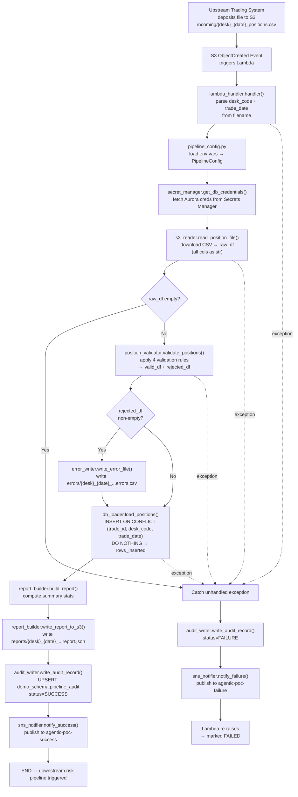
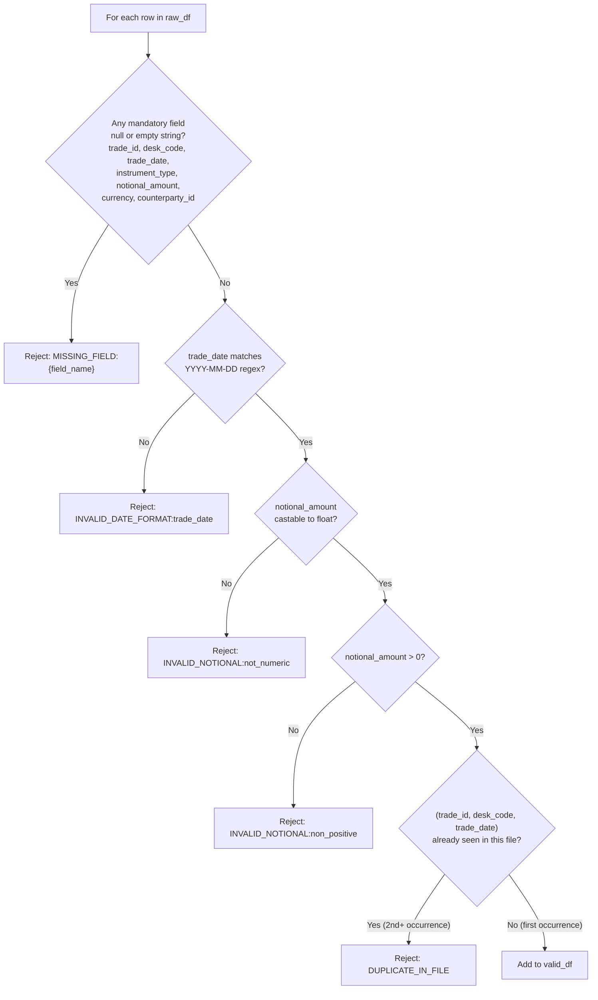
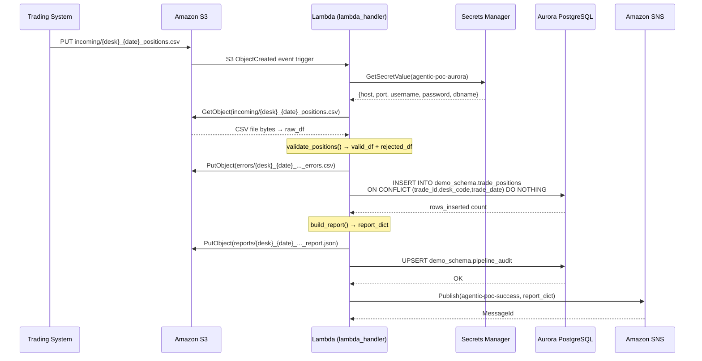

# Technical Design Document
## Daily Trade Position Ingestion — Enterprise Risk Data Platform

**Repo:** nartcr/agentic-poc-sandbox
**Change Type:** New Feature
**Date:** June 2026
**Status:** Draft

---

## COMPONENTS

### 1. `pipeline_config.py`
**What it does:** Centralises all environment-variable reads and runtime constants. Provides a single `PipelineConfig` dataclass that every other module imports. Raises `EnvironmentError` at startup if any required variable is missing, preventing silent misconfiguration.

**What it reads:**
- `os.environ["S3_BUCKET"]` → S3 bucket name
- `os.environ["S3_INPUT_PREFIX"]` → default `"incoming/"`
- `os.environ["S3_ERROR_PREFIX"]` → default `"errors/"`
- `os.environ["S3_REPORT_PREFIX"]` → default `"reports/"`
- `os.environ["DB_SECRET_ID"]` → Secrets Manager secret ID for Aurora credentials
- `os.environ["SNS_SUCCESS_ARN"]` → ARN for success topic
- `os.environ["SNS_FAILURE_ARN"]` → ARN for failure topic
- `os.environ["DB_SCHEMA"]` → default `"demo_schema"`
- `os.environ["DB_NAME"]` → default `"app"`

**What it writes:** Nothing to disk/network. Returns a populated `PipelineConfig` dataclass instance.

**Satisfies:** BAC-8 (no secrets in code)

---

### 2. `secret_manager.py`
**What it does:** Retrieves the Aurora database credential JSON from AWS Secrets Manager at runtime using the secret ID from `PipelineConfig.db_secret_id`. Parses the JSON and returns a `DBCredentials` named tuple with fields: `host`, `port`, `username`, `password`, `dbname`. Caches the result in-process for the lifetime of the Lambda invocation (no re-fetching within a single run).

**What it reads:**
- `PipelineConfig.db_secret_id` (maps to `os.environ["DB_SECRET_ID"]`)
- AWS Secrets Manager JSON payload keys: `"host"`, `"port"`, `"username"`, `"password"`, `"dbname"`

**What it writes:** Nothing. Returns `DBCredentials(host, port, username, password, dbname)`.

**Function signature:**
```
def get_db_credentials(secret_id: str) -> DBCredentials
```

**Satisfies:** BAC-8 (credentials retrieved at runtime, never stored in code)

---

### 3. `s3_reader.py`
**What it does:** Downloads a single CSV file from S3 given a bucket and key. Reads the file into a `pandas.DataFrame` preserving all columns as strings (dtype=str) to allow downstream validation to detect type errors. Logs the file key, row count, and column list at INFO level. Raises `FileNotFoundError` if the key does not exist; raises `ValueError` if the file is empty (zero data rows after header).

**What it reads:**
- S3 object at `s3://{bucket}/{key}` where key matches pattern `incoming/{desk_code}_{trade_date}_positions.csv`
- CSV fields (all ingested as strings): `trade_id`, `desk_code`, `trade_date`, `instrument_type`, `notional_amount`, `currency`, `counterparty_id` (plus any additional columns, which are carried through but not validated)

**What it writes:** Nothing to S3. Returns `(raw_df: pd.DataFrame, s3_key: str)`.

**Function signature:**
```
def read_position_file(bucket: str, key: str) -> tuple[pd.DataFrame, str]
```

**Satisfies:** BAC-1, BAC-6 (fast file ingestion)

---

### 4. `position_validator.py`
**What it does:** Applies row-level validation rules to the raw DataFrame. Splits rows into `valid_df` and `rejected_df`. Each rejected row gains two additional columns: `rejection_reason` (string describing the first failing rule encountered) and `source_row_number` (1-based integer, not counting the header). Validation rules applied in order:

1. **Mandatory field presence:** `trade_id`, `desk_code`, `trade_date`, `instrument_type`, `notional_amount`, `currency`, `counterparty_id` must be non-null and non-empty-string. Rejection reason: `"MISSING_FIELD:{field_name}"`.
2. **trade_date format:** Must match `YYYY-MM-DD`. Rejection reason: `"INVALID_DATE_FORMAT:trade_date"`.
3. **notional_amount numeric:** Must be castable to `float` and must be `> 0`. Rejection reason: `"INVALID_NOTIONAL:not_numeric"` or `"INVALID_NOTIONAL:non_positive"`.
4. **trade_id uniqueness within file:** Within the combination of (`trade_id`, `desk_code`, `trade_date`), duplicates within the same file are rejected (all copies after the first). Rejection reason: `"DUPLICATE_IN_FILE"`.

**What it reads:** `raw_df: pd.DataFrame` from `s3_reader.py`

**What it writes:** Nothing to disk. Returns `(valid_df: pd.DataFrame, rejected_df: pd.DataFrame)`.

**Function signatures:**
```
def validate_positions(raw_df: pd.DataFrame) -> tuple[pd.DataFrame, pd.DataFrame]
def _check_mandatory_fields(df: pd.DataFrame) -> pd.Series  # returns bool mask of valid rows
def _check_date_format(df: pd.DataFrame) -> pd.Series
def _check_notional(df: pd.DataFrame) -> pd.Series
def _check_intrafile_duplicates(df: pd.DataFrame) -> pd.Series
```

**Satisfies:** BAC-2 (rejected rows with clear reasons)

---

### 5. `error_writer.py`
**What it does:** Writes the rejected rows DataFrame to S3 as a UTF-8 CSV file. The S3 key follows the pattern: `errors/{desk_code}_{trade_date}_positions_errors_{processed_at_et}.csv` where `processed_at_et` is formatted as `YYYYMMDDTHHMMSS` in ET. The file includes all original columns plus `rejection_reason` and `source_row_number`. If `rejected_df` is empty (zero rows), no file is written and the function logs at INFO level `"No rejected rows — error file skipped"`. Returns the S3 key written (or `None` if skipped).

**What it reads:** `rejected_df: pd.DataFrame`, `bucket: str`, `desk_code: str`, `trade_date: str`, `processed_at_et: datetime`

**What it writes:**
- S3 key: `errors/{desk_code}_{trade_date}_positions_errors_{YYYYMMDDTHHMMSS}.csv`
- CSV columns: all original input columns + `rejection_reason` (str) + `source_row_number` (int)

**Function signature:**
```
def write_error_file(
    rejected_df: pd.DataFrame,
    bucket: str,
    desk_code: str,
    trade_date: str,
    processed_at_et: datetime,
) -> str | None
```

**Satisfies:** BAC-2

---

### 6. `db_loader.py`
**What it does:** Connects to Aurora PostgreSQL using credentials from `secret_manager.get_db_credentials()`. Executes a bulk `INSERT INTO demo_schema.trade_positions (...) VALUES ... ON CONFLICT (trade_id, desk_code, trade_date) DO NOTHING`. Processes rows in batches of 1,000 to stay within parameter limits. Tracks and returns the count of rows actually inserted (not skipped). Uses `psycopg2` with `autocommit=False`; commits after all batches succeed, rolls back on any exception. Logs each batch at DEBUG level.

**What it reads:**
- `valid_df: pd.DataFrame` with columns: `trade_id`, `desk_code`, `trade_date`, `instrument_type`, `notional_amount` (cast to `Decimal`), `currency`, `counterparty_id`
- `credentials: DBCredentials` from `secret_manager`

**What it writes:**
- Rows inserted into `demo_schema.trade_positions`
- Returns `rows_inserted: int` (count of rows where `ON CONFLICT DO NOTHING` did NOT trigger, i.e., new rows only)

**Function signature:**
```
def load_positions(
    valid_df: pd.DataFrame,
    credentials: DBCredentials,
    batch_size: int = 1000,
) -> int
```

**Satisfies:** BAC-1 (positions available), BAC-3 (idempotent dedup via `ON CONFLICT DO NOTHING`)

---

### 7. `report_builder.py`
**What it does:** Computes the post-load summary report as a Python dict and serialises it to JSON. Calculates:
- `total_rows_received` (int): `len(raw_df)`
- `rows_loaded` (int): value returned by `db_loader.load_positions`
- `rows_rejected` (int): `len(rejected_df)`
- `rows_skipped_duplicate` (int): `len(valid_df) - rows_loaded` (rows in valid_df that were already in DB)
- `processed_at_et` (str): ISO-8601 timestamp in ET
- `desk_code` (str)
- `trade_date` (str)
- `source_file_key` (str): original S3 key
- `notional_min` (float | None): min of `notional_amount` in `valid_df`; `None` if no valid rows
- `notional_max` (float | None): max of `notional_amount` in `valid_df`; `None` if no valid rows
- `null_rates` (dict): per-column null rate across `raw_df` as `{column_name: float}` (fraction 0.0–1.0)
- `row_count_by_desk` (dict): `{desk_code: int}` counts from `valid_df` (will be single-entry dict since one file = one desk, but computed generically)

Writes the JSON report to S3 at `reports/{desk_code}_{trade_date}_positions_report_{YYYYMMDDTHHMMSS}.csv` ... actually as `.json`.

**What it reads:** `raw_df`, `valid_df`, `rejected_df`, `rows_loaded`, `processed_at_et`, `desk_code`, `trade_date`, `source_file_key`

**What it writes:**
- S3 key: `reports/{desk_code}_{trade_date}_positions_report_{YYYYMMDDTHHMMSS}.json`
- JSON structure (see DATA CONTRACTS → S3 report schema)
- Returns `report_dict: dict`

**Function signatures:**
```
def build_report(
    raw_df: pd.DataFrame,
    valid_df: pd.DataFrame,
    rejected_df: pd.DataFrame,
    rows_loaded: int,
    processed_at_et: datetime,
    desk_code: str,
    trade_date: str,
    source_file_key: str,
) -> dict

def write_report_to_s3(
    report_dict: dict,
    bucket: str,
    processed_at_et: datetime,
) -> str
```

**Satisfies:** BAC-4 (accurate summary), BAC-7 (ET timestamps)

---

### 8. `audit_writer.py`
**What it does:** Inserts one row into `demo_schema.pipeline_audit` after every file processing attempt (success or failure). This is the complete audit trail required for regulatory compliance. Uses the same Aurora credentials as `db_loader`. Executed unconditionally — even if loading fails, an audit row is written capturing the failure outcome. Uses `INSERT ... ON CONFLICT (file_key) DO UPDATE SET ...` so re-runs overwrite the previous audit row for the same file.

**What it reads:**
- `credentials: DBCredentials`
- All fields for the audit row (see DATA CONTRACTS → `pipeline_audit` table)

**What it writes:**
- One row in `demo_schema.pipeline_audit`

**Function signature:**
```
def write_audit_record(
    credentials: DBCredentials,
    file_key: str,
    desk_code: str,
    trade_date: str,
    status: str,           # "SUCCESS" | "FAILURE" | "PARTIAL"
    total_rows: int,
    rows_loaded: int,
    rows_rejected: int,
    error_message: str | None,
    processed_at_et: datetime,
    report_s3_key: str | None,
    error_s3_key: str | None,
) -> None
```

**Satisfies:** BAC-7 (ET timestamps in audit), regulatory audit trail (NFR 3.3)

---

### 9. `sns_notifier.py`
**What it does:** Publishes SNS messages for success and failure outcomes. On success, publishes to `SNS_SUCCESS_ARN`. On failure, publishes to `SNS_FAILURE_ARN`. Message body is a JSON string matching the SNS message contract (see DATA CONTRACTS). Uses `boto3.client("sns")`. Logs the published message ID at INFO level.

**What it reads:**
- `config: PipelineConfig`
- `report_dict: dict` (for success)
- `error_details: dict` (for failure)

**What it writes:**
- SNS message to appropriate topic

**Function signatures:**
```
def notify_success(config: PipelineConfig, report_dict: dict) -> None
def notify_failure(config: PipelineConfig, error_details: dict) -> None
```

**Satisfies:** BAC-5 (automatic downstream notification)

---

### 10. `lambda_handler.py`
**What it does:** AWS Lambda entry point. Triggered by S3 `ObjectCreated` event on the `incoming/` prefix. Extracts `bucket` and `key` from the S3 event payload. Parses `desk_code` and `trade_date` from the filename using the pattern `{desk_code}_{trade_date}_positions.csv`. Orchestrates the full pipeline in sequence:
1. Load config (`pipeline_config.PipelineConfig`)
2. Get credentials (`secret_manager.get_db_credentials`)
3. Read file (`s3_reader.read_position_file`)
4. Validate (`position_validator.validate_positions`)
5. Write errors if any (`error_writer.write_error_file`)
6. Load valid rows (`db_loader.load_positions`)
7. Build & write report (`report_builder.build_report`, `report_builder.write_report_to_s3`)
8. Write audit record (`audit_writer.write_audit_record`)
9. Send notification (`sns_notifier.notify_success` or `sns_notifier.notify_failure`)

On any unhandled exception: catches, writes audit record with `status="FAILURE"`, calls `sns_notifier.notify_failure`, then re-raises to let Lambda mark the invocation as failed (allowing dead-letter / retry). Uses `pytz.timezone("America/Toronto")` for all `processed_at_et` timestamps.

**What it reads:** Lambda S3 event JSON — `event["Records"][0]["s3"]["bucket"]["name"]`, `event["Records"][0]["s3"]["object"]["key"]`

**What it writes:** Orchestrates all downstream writes; returns nothing (Lambda response unused).

**Function signature:**
```
def handler(event: dict, context: object) -> None
```

**Satisfies:** BAC-1, BAC-2, BAC-3, BAC-4, BAC-5, BAC-6, BAC-7, BAC-8 (end-to-end orchestration)

---

## AWS SERVICES

| Service | Role |
|---|---|
| **AWS Lambda** | Compute host for the ingestion pipeline. Function `agentic-poc-sandbox-qa` is triggered by S3 events on the `incoming/` prefix. |
| **Amazon S3** | Input file storage (`incoming/` prefix), error file output (`errors/` prefix), JSON report output (`reports/` prefix). Bucket: referenced via `os.environ["S3_BUCKET"]`. |
| **Amazon Aurora PostgreSQL** | Reporting database. Hosts `demo_schema.trade_positions` and `demo_schema.pipeline_audit`. Credentials retrieved at runtime from Secrets Manager. |
| **AWS Secrets Manager** | Stores Aurora connection credentials (host, port, username, password, dbname). Secret ID: `agentic-poc-aurora`, referenced via `os.environ["DB_SECRET_ID"]`. |
| **Amazon SNS** | Success topic (`agentic-poc-success`) and failure topic (`agentic-poc-failure`). Notifies downstream risk calculation pipeline. ARNs referenced via `os.environ["SNS_SUCCESS_ARN"]` and `os.environ["SNS_FAILURE_ARN"]`. |

---

## DATA CONTRACTS

### Database Tables

#### `demo_schema.trade_positions`

```
Table: demo_schema.trade_positions
Purpose: Stores validated daily trade position records.
```

| Column | Data Type | Constraints | Notes |
|---|---|---|---|
| `id` | `BIGSERIAL` | PRIMARY KEY | Surrogate key, auto-increment |
| `trade_id` | `VARCHAR(100)` | NOT NULL | Source system trade identifier |
| `desk_code` | `VARCHAR(50)` | NOT NULL | Trading desk code parsed from filename and row |
| `trade_date` | `DATE` | NOT NULL | Trading date from file row |
| `instrument_type` | `VARCHAR(100)` | NOT NULL | Instrument classification |
| `notional_amount` | `NUMERIC(20,4)` | NOT NULL, CHECK > 0 | Trade notional in native currency |
| `currency` | `CHAR(3)` | NOT NULL | ISO 4217 currency code |
| `counterparty_id` | `VARCHAR(100)` | NOT NULL | Counterparty identifier |
| `source_file_key` | `VARCHAR(500)` | NOT NULL | S3 key of source file |
| `loaded_at_et` | `TIMESTAMPTZ` | NOT NULL | Timestamp when row was inserted, ET |
| `created_at` | `TIMESTAMPTZ` | NOT NULL, DEFAULT NOW() | DB-level insert timestamp |

**Unique Constraint:** `UNIQUE (trade_id, desk_code, trade_date)` — deduplication key for `ON CONFLICT DO NOTHING`.

**Index:** `CREATE INDEX idx_trade_positions_trade_date ON demo_schema.trade_positions (trade_date);`
**Index:** `CREATE INDEX idx_trade_positions_desk_code ON demo_schema.trade_positions (desk_code);`

---

#### `demo_schema.pipeline_audit`

```
Table: demo_schema.pipeline_audit
Purpose: Regulatory audit trail — one row per processed file, upserted on re-run.
```

| Column | Data Type | Constraints | Notes |
|---|---|---|---|
| `id` | `BIGSERIAL` | PRIMARY KEY | Surrogate key |
| `file_key` | `VARCHAR(500)` | NOT NULL, UNIQUE | S3 key of processed file — upsert key |
| `desk_code` | `VARCHAR(50)` | NOT NULL | Desk code parsed from filename |
| `trade_date` | `DATE` | NOT NULL | Trade date parsed from filename |
| `status` | `VARCHAR(20)` | NOT NULL | `"SUCCESS"`, `"FAILURE"`, or `"PARTIAL"` |
| `total_rows` | `INTEGER` | NOT NULL | Total rows in source file |
| `rows_loaded` | `INTEGER` | NOT NULL | Rows inserted into trade_positions |
| `rows_rejected` | `INTEGER` | NOT NULL | Rows that failed validation |
| `error_message` | `TEXT` | NULLABLE | Exception message on FAILURE |
| `processed_at_et` | `TIMESTAMPTZ` | NOT NULL | Processing timestamp in ET |
| `report_s3_key` | `VARCHAR(500)` | NULLABLE | S3 key of the written report JSON |
| `error_s3_key` | `VARCHAR(500)` | NULLABLE | S3 key of the written error CSV |
| `created_at` | `TIMESTAMPTZ` | NOT NULL, DEFAULT NOW() | DB-level insert timestamp |
| `updated_at` | `TIMESTAMPTZ` | NOT NULL, DEFAULT NOW() | Updated on upsert |

**Unique Constraint:** `UNIQUE (file_key)` — supports `INSERT ... ON CONFLICT (file_key) DO UPDATE SET ...`.

---

### S3 Paths

#### Input Files
```
Bucket:  os.environ["S3_BUCKET"]  (value: agentic-poc-533266968934)
Prefix:  incoming/
Pattern: incoming/{desk_code}_{trade_date}_positions.csv
Example: incoming/EQTY_2026-06-15_positions.csv

Format:  CSV with header row
Encoding: UTF-8
Delimiter: comma
Fields:  trade_id, desk_code, trade_date, instrument_type, notional_amount, currency, counterparty_id
```

#### Error Files
```
Bucket:  os.environ["S3_BUCKET"]
Prefix:  errors/
Pattern: errors/{desk_code}_{trade_date}_positions_errors_{YYYYMMDDTHHMMSS}.csv
Example: errors/EQTY_2026-06-15_positions_errors_20260615T191523.csv

Format:  CSV with header row
Encoding: UTF-8
Columns: trade_id, desk_code, trade_date, instrument_type, notional_amount,
         currency, counterparty_id, rejection_reason, source_row_number
```

#### Report Files
```
Bucket:  os.environ["S3_BUCKET"]
Prefix:  reports/
Pattern: reports/{desk_code}_{trade_date}_positions_report_{YYYYMMDDTHHMMSS}.json
Example: reports/EQTY_2026-06-15_positions_report_20260615T191530.json

Format:  JSON
Schema:
{
  "desk_code":             string,
  "trade_date":            string (YYYY-MM-DD),
  "source_file_key":       string,
  "processed_at_et":       string (ISO-8601, ET),
  "total_rows_received":   integer,
  "rows_loaded":           integer,
  "rows_rejected":         integer,
  "rows_skipped_duplicate": integer,
  "notional_min":          float | null,
  "notional_max":          float | null,
  "row_count_by_desk":     { string: integer },
  "null_rates":            { string: float }
}
```

---

### Secrets Manager

```
Secret ID:   agentic-poc-aurora
Env var:     os.environ["DB_SECRET_ID"]

Expected JSON keys:
{
  "host":     string,   // Aurora cluster endpoint
  "port":     integer,  // default 5432
  "username": string,
  "password": string,
  "dbname":   string    // default "app"
}
```

---

### SNS Topics

**Success Topic**
```
ARN Env Var:  os.environ["SNS_SUCCESS_ARN"]
Value:        arn:aws:sns:us-east-1:533266968934:agentic-poc-success

Message JSON:
{
  "event_type":            "TRADE_POSITIONS_LOADED",
  "desk_code":             string,
  "trade_date":            string (YYYY-MM-DD),
  "source_file_key":       string,
  "processed_at_et":       string (ISO-8601, ET),
  "total_rows_received":   integer,
  "rows_loaded":           integer,
  "rows_rejected":         integer,
  "rows_skipped_duplicate": integer,
  "report_s3_key":         string
}
```

**Failure Topic**
```
ARN Env Var:  os.environ["SNS_FAILURE_ARN"]
Value:        arn:aws:sns:us-east-1:533266968934:agentic-poc-failure

Message JSON:
{
  "event_type":      "TRADE_POSITIONS_FAILED",
  "source_file_key": string,
  "desk_code":       string | null,
  "trade_date":      string | null,
  "processed_at_et": string (ISO-8601, ET),
  "error_message":   string,
  "error_s3_key":    string | null
}
```

---

### Environment Variables Summary

| Variable | Description | Example value (from infra config) |
|---|---|---|
| `S3_BUCKET` | Input/output S3 bucket | `agentic-poc-533266968934` |
| `S3_INPUT_PREFIX` | Prefix for incoming files | `incoming/` |
| `S3_ERROR_PREFIX` | Prefix for error files | `errors/` |
| `S3_REPORT_PREFIX` | Prefix for report files | `reports/` |
| `DB_SECRET_ID` | Secrets Manager secret ID | `agentic-poc-aurora` |
| `DB_SCHEMA` | Aurora schema name | `demo_schema` |
| `DB_NAME` | Aurora database name | `app` |
| `SNS_SUCCESS_ARN` | SNS success topic ARN | `arn:aws:sns:us-east-1:533266968934:agentic-poc-success` |
| `SNS_FAILURE_ARN` | SNS failure topic ARN | `arn:aws:sns:us-east-1:533266968934:agentic-poc-failure` |

---

## DATA FLOW

### End-to-End Pipeline Flow



---

### Validation Decision Logic



---

### Service Interaction Sequence



---

### Deduplication Algorithm

```
Algorithm: INSERT with ON CONFLICT DO NOTHING

Input:  valid_df — pandas DataFrame, N rows, all passing validation
        Unique constraint: (trade_id, desk_code, trade_date) on demo_schema.trade_positions

Step 1: Split valid_df into batches of 1,000 rows
Step 2: For each batch:
          Build psycopg2 executemany INSERT statement:
            INSERT INTO demo_schema.trade_positions
              (trade_id, desk_code, trade_date, instrument_type,
               notional_amount, currency, counterparty_id,
               source_file_key, loaded_at_et)
            VALUES (%s, %s, %s, %s, %s, %s, %s, %s, %s)
            ON CONFLICT (trade_id, desk_code, trade_date)
            DO NOTHING
          Execute batch
          rows_inserted += cursor.rowcount  ← counts only non-conflicting rows
Step 3: Commit transaction after all batches
Step 4: Return total rows_inserted

On exception: ROLLBACK entire transaction, re-raise
```

---

## TECHNICAL ACCEPTANCE CRITERIA

**TAC-1 (from BAC-1): All valid positions loaded before morning risk run**
- `db_loader.load_positions()` inserts all rows from `valid_df` into `demo_schema.trade_positions` via `INSERT ... ON CONFLICT DO NOTHING`.
- Acceptance test: after pipeline run on a test file with 5 valid rows, `SELECT COUNT(*) FROM demo_schema.trade_positions WHERE desk_code = :desk AND trade_date = :date` returns 5.
- Performance gate: `lambda_handler.handler()` must complete end-to-end within 60 seconds for a 10,000-row input file (timed in integration test).

**TAC-2 (from BAC-2): Invalid records flagged with clear reasons**
- `position_validator.validate_positions()` returns a `rejected_df` where every row has a non-null `rejection_reason` column containing one of: `MISSING_FIELD:{field_name}`, `INVALID_DATE_FORMAT:trade_date`, `INVALID_NOTIONAL:not_numeric`, `INVALID_NOTIONAL:non_positive`, `DUPLICATE_IN_FILE`.
- `error_writer.write_error_file()` writes this to S3 at `errors/{desk_code}_{trade_date}_positions_errors_{YYYYMMDDTHHMMSS}.csv`.
- Acceptance test: submit a file with one row missing `currency`, one row with `notional_amount="abc"`, one row with `trade_date="15-06-2026"`. Assert `rejected_df` has 3 rows; `rejection_reason` values are exactly `"MISSING_FIELD:currency"`, `"INVALID_NOTIONAL:not_numeric"`, `"INVALID_DATE_FORMAT:trade_date"` respectively. Assert error CSV exists in S3 with correct columns.

**TAC-3 (from BAC-3): Resubmitting does not double-count positions**
- `INSERT INTO demo_schema.trade_positions ... ON CONFLICT (trade_id, desk_code, trade_date) DO NOTHING` is the exact SQL used.
- `audit_writer.write_audit_record()` uses `INSERT ... ON CONFLICT (file_key) DO UPDATE SET ...` so the audit row is overwritten, not duplicated.
- Acceptance test: run `lambda_handler.handler()` twice with the same input file. Assert `SELECT COUNT(*) FROM demo_schema.trade_positions WHERE desk_code = :desk AND trade_date = :date` is identical after both runs. Assert `SELECT COUNT(*) FROM demo_schema.pipeline_audit WHERE file_key = :key` returns 1 (upsert, not insert).

**TAC-4 (from BAC-4): Summary accurately reflects received/accepted/rejected**
- `report_builder.build_report()` must satisfy: `total_rows_received == rows_loaded + rows_rejected + rows_skipped_duplicate`.
- Report JSON must contain `total_rows_received`, `rows_loaded`, `rows_rejected`, `rows_skipped_duplicate`, `notional_min`, `notional_max`, `null_rates` (one entry per input column), `row_count_by_desk`.
- Acceptance test: submit a 10-row file where 3 rows fail validation and 2 rows are already in DB. Assert report shows `total_rows_received=10`, `rows_rejected=3`, `rows_loaded=5`, `rows_skipped_duplicate=2`.

**TAC-5 (from BAC-5): Risk pipeline automatically notified**
- `sns_notifier.notify_success()` is called unconditionally at the end of a successful pipeline run. `notify_failure()` is called in the `except` block for any unhandled exception.
- SNS message `event_type` field is `"TRADE_POSITIONS_LOADED"` (success) or `"TRADE_POSITIONS_FAILED"` (failure).
- Acceptance test: mock SNS client; assert `publish()` is called exactly once per pipeline run, with `TopicArn` matching `os.environ["SNS_SUCCESS_ARN"]` and message body parseable as JSON with `"event_type": "TRADE_POSITIONS_LOADED"` and correct `rows_loaded` value.

**TAC-6 (from BAC-6): Processing completes within operations window**
- End-to-end processing of a 10,000-row file must complete within 60 seconds.
- End-to-end processing of a 100,000-row file must complete without raising an exception.
- Acceptance test: integration test with a 10,000-row synthetic file measures wall-clock time of `lambda_handler.handler()` call and asserts `elapsed < 60`.

**TAC-7 (from BAC-7): All timestamps in ET**
- Every call to `datetime.now()` in the codebase uses `pytz.timezone("America/Toronto")`: `datetime.now(tz=pytz.timezone("America/Toronto"))`.
- `processed_at_et` in the report JSON and in `demo_schema.pipeline_audit.processed_at_et` must have timezone offset matching ET (UTC-5 or UTC-4 depending on DST).
- `loaded_at_et` column in `demo_schema.trade_positions` is set to the same ET-aware datetime.
- Acceptance test: parse `processed_at_et` from the written report JSON; assert `datetime.fromisoformat(processed_at_et).tzinfo` is non-null and offset is either `-05:00` or `-04:00`.

**TAC-8 (from BAC-8): No secrets in code**
- `grep -r "password\|secret\|token\|credentials" --include="*.py"` across the repo must return zero hardcoded string literals that contain credential values.
- All credentials fetched exclusively via `secret_manager.get_db_credentials(os.environ["DB_SECRET_ID"])`.
- Acceptance test: static analysis check — assert no `.py` file contains a string literal matching the pattern `r"(password|passwd|secret|token)\s*=\s*['\"][^'"]{4,}"`. CI gate blocks merge if this check fails.

---

## OPEN QUESTIONS

1. **Partial success status definition:** If a file contains both valid rows (loaded successfully) and rejected rows (failed validation), the pipeline currently classifies the audit status as `"PARTIAL"`. Should the downstream SNS notification for this case go to the **success topic** (positions were loaded, error file was produced) or the **failure topic** (some data was rejected)? The current design sends to the success topic with `rows_rejected > 0` visible in the payload. Confirm whether this is acceptable or whether a separate SNS routing rule is needed.

2. **Multiple records in a single S3 event:** The Lambda handler currently processes `event["Records"][0]` — only the first S3 record. S3 event notifications can, in theory, batch multiple `Records`. Should the handler loop over all records and process each file, or is single-file-per-invocation the guaranteed operational model (i.e., S3 notification is always configured with batch size = 1)?

3. **Error file retention / downstream resubmission flow:** The BRD states that operations will "correct and resubmit" rejected rows. Does the corrected resubmission arrive as a new complete file (same filename pattern, different timestamp), or as a partial file containing only the previously-rejected rows? This affects whether `ON CONFLICT DO NOTHING` correctly handles the re-submission without requiring any additional logic.

---

## ASSUMPTIONS

1. **Lambda trigger:** The Lambda function `agentic-poc-sandbox-qa` is already configured (or will be configured at deployment time) with an S3 event notification trigger on the `agentic-poc-533266968934` bucket, prefix `incoming/`, suffix `.csv`, event type `ObjectCreated:*`. No changes to Lambda trigger configuration are part of this feature delivery.

2. **Database tables pre-exist or are created by migration:** The tables `demo_schema.trade_positions` and `demo_schema.pipeline_audit` do not exist today and must be created by a DDL migration script before the Lambda is deployed. The Coding Agent will produce the DDL in a `db_migrations.py` module (or a separate `.sql` file), but execution is a deployment-time step outside the Lambda itself.

3. **Aurora is reachable from Lambda:** The Lambda function has VPC configuration (subnets, security groups) that allows TCP connection to the Aurora cluster on port 5432. This is an infrastructure concern assumed to be pre-configured.

4. **`psycopg2` available in Lambda:** The Lambda deployment package includes `psycopg2-binary` (or a Lambda layer providing it). The Coding Agent will include it in `requirements.txt`.

5. **File naming strictly follows convention:** Files deposited in `incoming/` always follow `{desk_code}_{trade_date}_positions.csv` where `desk_code` contains no underscores itself (or the date segment `YYYY-MM-DD` is used as the split anchor). The filename parser in `lambda_handler` splits on the pattern `_YYYY-MM-DD_` to extract `desk_code` and `trade_date`.

6. **One desk per file:** Each input file represents exactly one trading desk's positions. The `desk_code` in all rows should match the `desk_code` in the filename. Rows whose `desk_code` column differs from the filename `desk_code` are still validated and loaded (not rejected for this mismatch), but the mismatch is captured in the `row_count_by_desk` report field.

7. **CSV always has a header row:** Input CSV files always include a header row. `pandas.read_csv()` will use the first row as column names.

8. **Trade date format in filename is `YYYY-MM-DD`:** The `trade_date` segment in the filename uses ISO-8601 date format (`2026-06-15`), matching the expected format in the data rows.

9. **Partial success routes to success topic:** Files where some rows are rejected but others are loaded successfully send notifications to the success SNS topic (not failure), because positions were successfully made available. The `rows_rejected` field in the message makes the partial outcome visible. This is subject to confirmation via Open Question 1.

10. **`rows_inserted` counting via `cursor.rowcount`:** `psycopg2` returns `-1` for `rowcount` on `executemany`. Therefore, `db_loader` will use individual `execute()` calls within a loop (or use `execute_values` with a follow-up `SELECT COUNT(*)` comparison) to obtain an accurate inserted count. The preferred approach is to use `psycopg2.extras.execute_values` and compute `rows_inserted = len(valid_df) - rows_already_existing`, where `rows_already_existing` is derived from a pre-insert `SELECT COUNT(*)` within the same transaction.

11. **No file archival:** The BRD does not require moving or deleting input files from `incoming/` after processing. Files remain in place. The audit record in `pipeline_audit` with the `file_key` provides the processing history. If archival is required, it is out of scope for this delivery.

12. **Currency code is not validated against ISO 4217:** The `currency` field is validated only for presence (non-null, non-empty). Full ISO 4217 code validation is not required by the BRD and is not implemented.

13. **ET timezone for all timestamps uses `pytz.timezone("America/Toronto")`:** This correctly handles both EST (UTC-5) and EDT (UTC-4) depending on the date, satisfying the regulatory requirement for Toronto business hours.