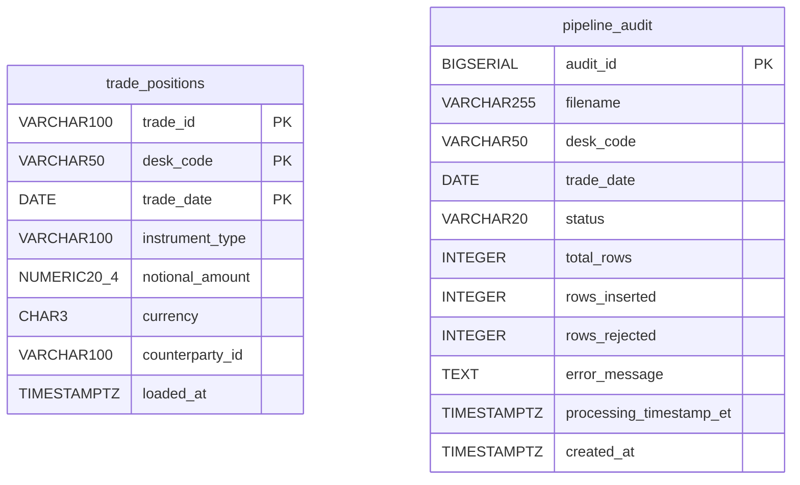
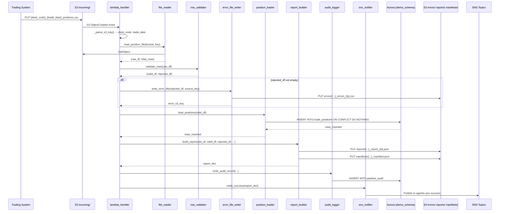
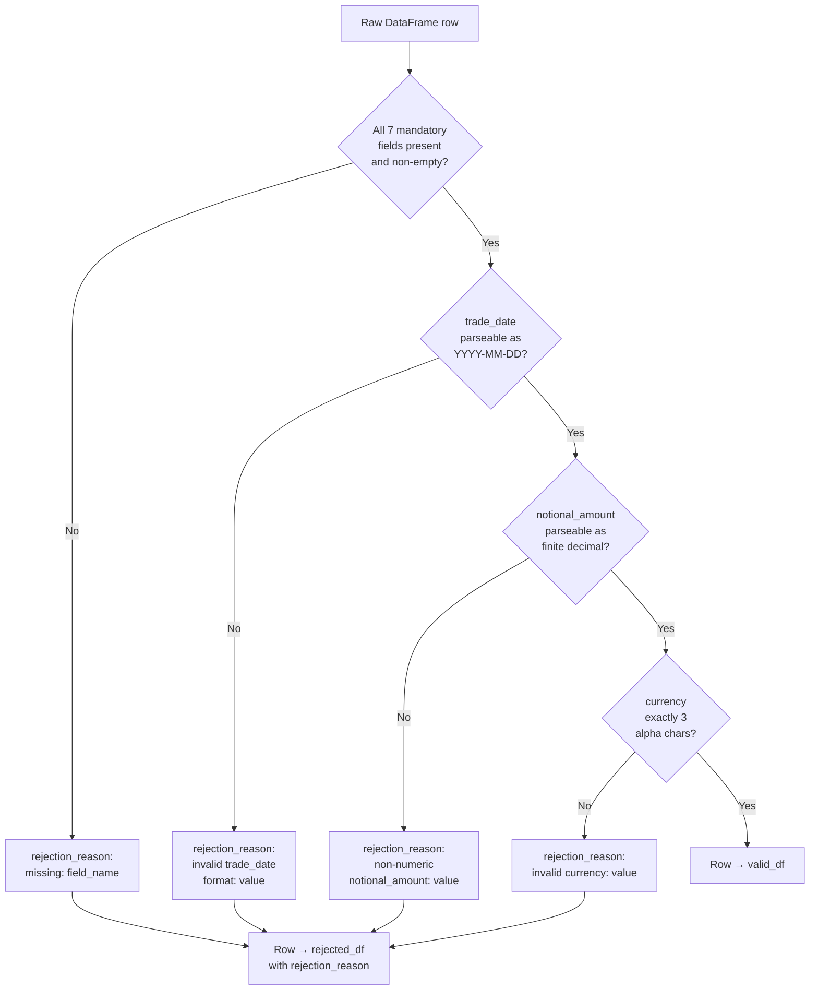
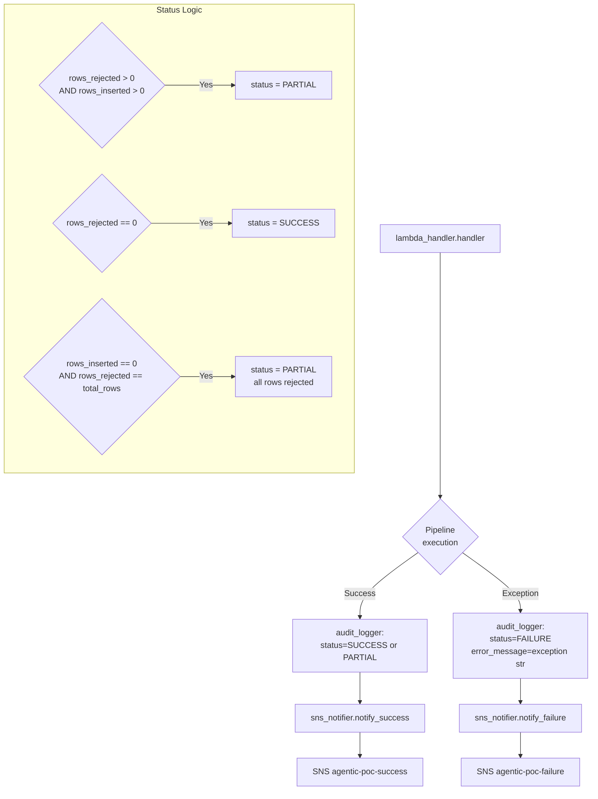

# Technical Design Document
## Daily Trade Position Ingestion — Enterprise Risk Data Platform

---

### COMPONENTS

#### `lambda_handler.py`
**Entry point invoked by S3 event trigger (ObjectCreated) on the `incoming/` prefix.**

- **What it does:** Receives the S3 event payload, extracts the bucket name and object key, validates the key matches the pattern `incoming/{desk_code}_{trade_date}_positions.csv`, then orchestrates the full pipeline by calling `file_reader.read_position_file()` → `row_validator.validate_rows()` → `position_loader.load_positions()` → `report_builder.build_report()` → `sns_notifier.notify_success()` or `sns_notifier.notify_failure()`. Writes the final audit record via `audit_logger.write_audit_record()`. Catches unhandled exceptions and calls `sns_notifier.notify_failure()` with the exception detail.

- **Function signatures:**
  - `def handler(event: dict, context: object) -> dict`
  - `def _parse_s3_key(key: str) -> tuple[str, str]` — returns `(desk_code, trade_date_str)` or raises `ValueError` if key does not match pattern

- **Reads:** S3 event dict with `Records[*].s3.bucket.name` and `Records[*].s3.object.key`
- **Writes:** Returns `{"statusCode": 200, "body": "OK"}` on success; `{"statusCode": 500, "body": "<error>"}` on failure
- **Satisfies:** BAC-1, BAC-5, BAC-6, BAC-7, BAC-8

---

#### `file_reader.py`
**Reads a CSV file from S3 and returns a raw DataFrame.**

- **What it does:** Accepts a bucket name and S3 object key. Uses `boto3.client("s3")` to stream the object body. Reads the CSV using `pandas.read_csv()` with `dtype=str` (all columns as strings to prevent type coercion before validation). Returns the raw DataFrame and the row count.

- **Function signatures:**
  - `def read_position_file(bucket: str, key: str) -> tuple[pd.DataFrame, int]`
    - Returns `(df, total_row_count)` where `total_row_count` is `len(df)` before any filtering.

- **Reads:** S3 object at `s3://{bucket}/{key}`, CSV format, expected columns: `trade_id`, `desk_code`, `trade_date`, `instrument_type`, `notional_amount`, `currency`, `counterparty_id`
- **Writes:** Nothing to storage; returns in-memory DataFrame
- **Satisfies:** BAC-1, BAC-6

---

#### `row_validator.py`
**Validates each row of the raw DataFrame against field-level rules. Returns valid and rejected DataFrames.**

- **What it does:**
  1. Checks each of the 7 mandatory fields (`trade_id`, `desk_code`, `trade_date`, `instrument_type`, `notional_amount`, `currency`, `counterparty_id`) for null/empty string values.
  2. Validates `trade_date` is parseable as `YYYY-MM-DD`.
  3. Validates `notional_amount` is parseable as a finite decimal (non-null, non-empty, numeric).
  4. Validates `currency` is exactly 3 characters (alpha).
  5. Rows failing any check are assigned a `rejection_reason` string (e.g. `"missing: trade_id"`, `"invalid trade_date format: 2026-13-01"`, `"non-numeric notional_amount: abc"`).
  6. Returns two DataFrames: `valid_df` (all rules passed) and `rejected_df` (at least one rule failed, with `rejection_reason` column appended).

- **Function signatures:**
  - `def validate_rows(df: pd.DataFrame) -> tuple[pd.DataFrame, pd.DataFrame]`
    — returns `(valid_df, rejected_df)`
  - `def _check_mandatory_fields(row: pd.Series) -> str | None`
  - `def _check_field_formats(row: pd.Series) -> str | None`

- **Reads:** Raw DataFrame from `file_reader.read_position_file()`
- **Writes:** Nothing to storage; returns in-memory DataFrames
- **Satisfies:** BAC-2, BAC-4

---

#### `position_loader.py`
**Loads validated rows into `demo_schema.trade_positions` using idempotent INSERT ON CONFLICT DO NOTHING.**

- **What it does:**
  1. Calls `secret_manager.get_db_credentials()` to retrieve connection parameters.
  2. Opens a `psycopg2` connection to the Aurora PostgreSQL database.
  3. Casts `trade_date` to `datetime.date`, `notional_amount` to `Decimal`, `currency` to uppercase string (3 chars).
  4. For each batch of rows (batch size: 1000), executes:
     ```sql
     INSERT INTO demo_schema.trade_positions
       (trade_id, desk_code, trade_date, instrument_type, notional_amount, currency, counterparty_id)
     VALUES %s
     ON CONFLICT (trade_id, desk_code, trade_date) DO NOTHING
     ```
     using `psycopg2.extras.execute_values()`.
  5. Counts actual rows inserted by comparing `cursor.rowcount` after each batch; sums across batches to return total `rows_inserted`.
  6. `loaded_at` is populated by the database column default (`now()`).

- **Function signatures:**
  - `def load_positions(valid_df: pd.DataFrame) -> int`
    — returns `rows_inserted` count

- **Reads:** Validated DataFrame with columns: `trade_id`, `desk_code`, `trade_date`, `instrument_type`, `notional_amount`, `currency`, `counterparty_id`
- **Writes:** Rows into `demo_schema.trade_positions`; returns integer count
- **Satisfies:** BAC-1, BAC-3

---

#### `error_file_writer.py`
**Writes the rejected-rows DataFrame to S3 as a CSV error file.**

- **What it does:**
  1. Accepts the rejected DataFrame (with `rejection_reason` column) and the original S3 key.
  2. Derives the error file key: `errors/{desk_code}_{trade_date}_positions_errors_{timestamp_et}.csv` where `timestamp_et` is formatted as `YYYYMMDDTHHMMSS` in `America/Toronto`.
  3. Serialises the rejected DataFrame to CSV bytes (UTF-8, with header).
  4. Uploads to `s3://{S3_BUCKET}/errors/{desk_code}_{trade_date}_positions_errors_{timestamp_et}.csv` via `boto3.client("s3").put_object()`.
  5. Returns the full S3 key of the written error file.

- **Function signatures:**
  - `def write_error_file(rejected_df: pd.DataFrame, source_key: str) -> str`
    — returns the S3 error file key

- **Reads:** `rejected_df` DataFrame; `source_key` string; `os.environ["S3_BUCKET"]`
- **Writes:** S3 object at `errors/{desk_code}_{trade_date}_positions_errors_{timestamp_et}.csv`
- **Satisfies:** BAC-2

---

#### `report_builder.py`
**Builds the post-load summary report and writes it to S3. Also writes a manifest JSON at a predictable key.**

- **What it does:**
  1. Accepts the raw DataFrame, valid DataFrame, rejected DataFrame, `desk_code`, `trade_date`, and `rows_inserted`.
  2. Computes:
     - `total_rows`: `len(raw_df)`
     - `rows_loaded`: `rows_inserted` (actual DB inserts, not len of valid_df)
     - `rows_rejected`: `len(rejected_df)`
     - `processing_timestamp_et`: current time in `America/Toronto` as ISO-8601 string
     - `counts_by_desk`: `valid_df.groupby("desk_code").size().to_dict()`
     - `min_notional`: `valid_df["notional_amount"].astype(float).min()` (float, 4dp)
     - `max_notional`: `valid_df["notional_amount"].astype(float).max()` (float, 4dp)
     - `null_rates`: for each of the 7 mandatory columns, `round(df[col].isnull().mean(), 4)` computed on the raw DataFrame
  3. Assembles a JSON report dict with the above fields.
  4. Writes the report JSON to: `reports/{desk_code}_{trade_date}_report_{timestamp_et}.json`
  5. Writes a manifest JSON to the predictable key: `manifests/{desk_code}_{trade_date}_manifest.json` containing `{"report_key": "<full report s3 key>", "error_key": "<full error s3 key or null>", "generated_at_et": "<timestamp>"}`.
  6. Returns the report dict (used by `sns_notifier`).

- **Function signatures:**
  - `def build_report(raw_df: pd.DataFrame, valid_df: pd.DataFrame, rejected_df: pd.DataFrame, desk_code: str, trade_date: str, rows_inserted: int, error_s3_key: str | None) -> dict`
    — returns report dict

- **Reads:** In-memory DataFrames; `os.environ["S3_BUCKET"]`
- **Writes:**
  - `s3://{S3_BUCKET}/reports/{desk_code}_{trade_date}_report_{timestamp_et}.json`
  - `s3://{S3_BUCKET}/manifests/{desk_code}_{trade_date}_manifest.json`
- **Satisfies:** BAC-4, BAC-7

---

#### `sns_notifier.py`
**Publishes success or failure notifications to SNS topics.**

- **What it does:**
  - `notify_success()`: Publishes the report dict as a JSON-serialised SNS message to the topic ARN at `os.environ["SNS_SUCCESS_TOPIC_ARN"]`.
  - `notify_failure()`: Publishes a failure message JSON to `os.environ["SNS_FAILURE_TOPIC_ARN"]`.
  - Both functions use `boto3.client("sns").publish()`.

- **Function signatures:**
  - `def notify_success(report: dict) -> None`
  - `def notify_failure(filename: str, error_detail: str, desk_code: str | None, trade_date: str | None) -> None`

- **Reads:** `os.environ["SNS_SUCCESS_TOPIC_ARN"]`, `os.environ["SNS_FAILURE_TOPIC_ARN"]`; report dict or error details
- **Writes:** SNS messages (see Data Contracts for message schemas)
- **Satisfies:** BAC-5

---

#### `audit_logger.py`
**Writes one record per processed file to `demo_schema.pipeline_audit`.**

- **What it does:**
  1. Calls `secret_manager.get_db_credentials()`.
  2. Executes:
     ```sql
     INSERT INTO demo_schema.pipeline_audit
       (filename, desk_code, trade_date, status, total_rows, rows_inserted, rows_rejected, error_message, processing_timestamp_et)
     VALUES (%s, %s, %s, %s, %s, %s, %s, %s, %s)
     ```
  3. `status` is one of: `"SUCCESS"`, `"PARTIAL"` (some rows rejected), `"FAILURE"` (pipeline exception).
  4. `processing_timestamp_et` is the current time in `America/Toronto` as a timezone-aware `datetime`.
  5. `error_message` is `NULL` for `SUCCESS`/`PARTIAL`; contains the exception string for `FAILURE`.

- **Function signatures:**
  - `def write_audit_record(filename: str, desk_code: str | None, trade_date: str | None, status: str, total_rows: int, rows_inserted: int, rows_rejected: int, error_message: str | None) -> None`

- **Reads:** Parameters as above; DB credentials from `secret_manager`
- **Writes:** One row to `demo_schema.pipeline_audit`
- **Satisfies:** BAC-7, BAC-8 (audit trail for regulatory compliance)

---

#### `secret_manager.py`
**Retrieves and caches database credentials from AWS Secrets Manager at runtime.**

- **What it does:**
  1. Reads `os.environ["DB_SECRET_ID"]` (value: `agentic-poc-aurora`).
  2. Calls `boto3.client("secretsmanager").get_secret_value(SecretId=secret_id)`.
  3. Parses the returned JSON string.
  4. Caches the result in a module-level variable to avoid repeated API calls within the same Lambda invocation.
  5. Returns a dict with keys: `host`, `port`, `dbname`, `username`, `password`.

- **Function signatures:**
  - `def get_db_credentials() -> dict`
    — returns `{"host": str, "port": int, "dbname": str, "username": str, "password": str}`

- **Reads:** `os.environ["DB_SECRET_ID"]`; AWS Secrets Manager secret JSON
- **Writes:** Nothing
- **Satisfies:** BAC-8

---

### AWS SERVICES

| Service | Role |
|---|---|
| **AWS Lambda** | Compute — executes `lambda_handler.handler()` triggered by S3 ObjectCreated events on `incoming/` prefix |
| **Amazon S3** | Storage — receives incoming CSV files (`incoming/`), stores error CSVs (`errors/`), stores summary reports (`reports/`), stores manifests (`manifests/`) |
| **Amazon Aurora PostgreSQL** | Relational database — stores validated trade positions (`demo_schema.trade_positions`) and pipeline audit records (`demo_schema.pipeline_audit`) |
| **AWS Secrets Manager** | Credential store — holds Aurora connection credentials; retrieved at runtime via `agentic-poc-aurora` secret |
| **Amazon SNS** | Notification bus — `agentic-poc-success` topic for downstream pipeline triggers; `agentic-poc-failure` topic for operational alerts |

---

### DATA CONTRACTS

#### Database Table: `demo_schema.trade_positions`

| Column | Type | Nullable | Notes |
|---|---|---|---|
| `trade_id` | `VARCHAR(100)` | NOT NULL | Part of composite PK |
| `desk_code` | `VARCHAR(50)` | NOT NULL | Part of composite PK |
| `trade_date` | `DATE` | NOT NULL | Part of composite PK |
| `instrument_type` | `VARCHAR(100)` | NOT NULL | |
| `notional_amount` | `NUMERIC(20,4)` | NOT NULL | |
| `currency` | `CHAR(3)` | NOT NULL | |
| `counterparty_id` | `VARCHAR(100)` | NOT NULL | |
| `loaded_at` | `TIMESTAMPTZ` | NOT NULL | Default: `now()` |

**Primary Key:** `(trade_id, desk_code, trade_date)`
**Unique Constraint:** The PK serves as the deduplication key; `ON CONFLICT (trade_id, desk_code, trade_date) DO NOTHING`



---

#### Database Table: `demo_schema.pipeline_audit`

| Column | Type | Nullable | Notes |
|---|---|---|---|
| `audit_id` | `BIGSERIAL` | NOT NULL | Auto-increment PK |
| `filename` | `VARCHAR(255)` | NOT NULL | Source S3 key |
| `desk_code` | `VARCHAR(50)` | NULL | Null if key parse fails |
| `trade_date` | `DATE` | NULL | Null if key parse fails |
| `status` | `VARCHAR(20)` | NOT NULL | `"SUCCESS"`, `"PARTIAL"`, `"FAILURE"` |
| `total_rows` | `INTEGER` | NOT NULL | Default: 0 |
| `rows_inserted` | `INTEGER` | NOT NULL | Default: 0 |
| `rows_rejected` | `INTEGER` | NOT NULL | Default: 0 |
| `error_message` | `TEXT` | NULL | Exception detail on `FAILURE` |
| `processing_timestamp_et` | `TIMESTAMPTZ` | NOT NULL | Current ET time at record write |
| `created_at` | `TIMESTAMPTZ` | NOT NULL | Default: `now()` |

**Primary Key:** `(audit_id)`

---

#### S3 Paths

| Path Pattern | Format | Description |
|---|---|---|
| `incoming/{desk_code}_{trade_date}_positions.csv` | CSV, UTF-8, with header | Input file deposited by upstream trading system |
| `errors/{desk_code}_{trade_date}_positions_errors_{YYYYMMDDTHHMMSS}.csv` | CSV, UTF-8, with header | Rejected rows with `rejection_reason` column appended |
| `reports/{desk_code}_{trade_date}_report_{YYYYMMDDTHHMMSS}.json` | JSON | Post-load summary report |
| `manifests/{desk_code}_{trade_date}_manifest.json` | JSON | Predictable-key pointer to timestamped report and error files |

All paths are under `os.environ["S3_BUCKET"]` = `agentic-poc-533266968934`.

**Manifest JSON structure** (`manifests/{desk_code}_{trade_date}_manifest.json`):
```json
{
  "desk_code": "DESK01",
  "trade_date": "2026-06-15",
  "report_key": "reports/DESK01_2026-06-15_report_20260615T191532.json",
  "error_key": "errors/DESK01_2026-06-15_positions_errors_20260615T191532.csv",
  "generated_at_et": "2026-06-15T19:15:32-04:00"
}
```
`error_key` is `null` if no rows were rejected.

**Input CSV expected columns (order-independent, header required):**
`trade_id`, `desk_code`, `trade_date`, `instrument_type`, `notional_amount`, `currency`, `counterparty_id`

**Error CSV columns:**
`trade_id`, `desk_code`, `trade_date`, `instrument_type`, `notional_amount`, `currency`, `counterparty_id`, `rejection_reason`

**Report JSON structure** (`reports/{desk_code}_{trade_date}_report_{timestamp_et}.json`):
```json
{
  "desk_code": "DESK01",
  "trade_date": "2026-06-15",
  "processing_timestamp_et": "2026-06-15T19:15:32-04:00",
  "total_rows": 5000,
  "rows_loaded": 4985,
  "rows_rejected": 15,
  "counts_by_desk": {"DESK01": 4985},
  "min_notional": 1000.0000,
  "max_notional": 50000000.0000,
  "null_rates": {
    "trade_id": 0.0000,
    "desk_code": 0.0000,
    "trade_date": 0.0030,
    "instrument_type": 0.0000,
    "notional_amount": 0.0010,
    "currency": 0.0000,
    "counterparty_id": 0.0000
  }
}
```

---

#### Secrets Manager

| Env Var | Value | Secret JSON Keys |
|---|---|---|
| `DB_SECRET_ID` | `agentic-poc-aurora` | `host`, `port`, `dbname`, `username`, `password` |

---

#### SNS Topics

| Env Var | ARN | Message Format |
|---|---|---|
| `SNS_SUCCESS_TOPIC_ARN` | `arn:aws:sns:us-east-1:533266968934:agentic-poc-success` | See success message schema below |
| `SNS_FAILURE_TOPIC_ARN` | `arn:aws:sns:us-east-1:533266968934:agentic-poc-failure` | See failure message schema below |

**Success message JSON** (published as `Message` string in SNS `publish()` call):
```json
{
  "event": "TRADE_POSITIONS_LOADED",
  "desk_code": "DESK01",
  "trade_date": "2026-06-15",
  "filename": "incoming/DESK01_2026-06-15_positions.csv",
  "total_rows": 5000,
  "rows_loaded": 4985,
  "rows_rejected": 15,
  "processing_timestamp_et": "2026-06-15T19:15:32-04:00",
  "report_s3_key": "reports/DESK01_2026-06-15_report_20260615T191532.json",
  "manifest_s3_key": "manifests/DESK01_2026-06-15_manifest.json"
}
```

**Failure message JSON**:
```json
{
  "event": "TRADE_POSITIONS_FAILED",
  "filename": "incoming/DESK01_2026-06-15_positions.csv",
  "desk_code": "DESK01",
  "trade_date": "2026-06-15",
  "error_detail": "<exception string>",
  "processing_timestamp_et": "2026-06-15T19:15:32-04:00"
}
```

---

### DATA FLOW

#### End-to-End Pipeline Flow



---

#### Validation Decision Logic



---

#### Error Handling Flow



---

#### Idempotent Load Algorithm

```
ALGORITHM: load_positions(valid_df)
INPUT: valid_df — DataFrame of validated rows

1. Retrieve DB credentials via secret_manager.get_db_credentials()
2. Open psycopg2 connection
3. Split valid_df into batches of 1000 rows
4. total_inserted = 0
5. FOR each batch:
   a. Build list of tuples: (trade_id, desk_code, trade_date, instrument_type, notional_amount, currency, counterparty_id)
   b. Execute:
        INSERT INTO demo_schema.trade_positions
          (trade_id, desk_code, trade_date, instrument_type, notional_amount, currency, counterparty_id)
        VALUES %s
        ON CONFLICT (trade_id, desk_code, trade_date) DO NOTHING
   c. total_inserted += cursor.rowcount
6. COMMIT
7. RETURN total_inserted
```

---

### TECHNICAL ACCEPTANCE CRITERIA

**TAC-1: All valid positions loaded before morning risk run**
- `position_loader.load_positions()` executes a batched `INSERT INTO demo_schema.trade_positions ... ON CONFLICT (trade_id, desk_code, trade_date) DO NOTHING` within the same Lambda invocation that receives the S3 event.
- Acceptance test: after invoking `handler()` with a 1,000-row test file, `SELECT COUNT(*) FROM demo_schema.trade_positions WHERE desk_code = :desk AND trade_date = :date` returns exactly the number of valid rows in the test file.
- Lambda timeout must be set ≥ 60 seconds; 100,000-row file must complete within the timeout.

**TAC-2: Invalid records flagged with specific rejection reasons**
- `row_validator.validate_rows()` appends a `rejection_reason` string to every rejected row.
- `error_file_writer.write_error_file()` writes a CSV at `s3://{S3_BUCKET}/errors/{desk_code}_{trade_date}_positions_errors_{ts}.csv` containing all rejected rows plus the `rejection_reason` column.
- Acceptance test: inject a file with one row missing `trade_id` and one row with `notional_amount = "abc"`. Assert error CSV contains exactly 2 rows; `rejection_reason` values are `"missing: trade_id"` and `"non-numeric notional_amount: abc"` respectively.

**TAC-3: Reprocessing the same file does not create duplicate records**
- `position_loader.load_positions()` uses `ON CONFLICT (trade_id, desk_code, trade_date) DO NOTHING`.
- Acceptance test: call `handler()` twice with the identical input file. After the second invocation, `SELECT COUNT(*) FROM demo_schema.trade_positions WHERE desk_code = :desk AND trade_date = :date` returns the same count as after the first invocation. The second call's `rows_inserted` = 0.

**TAC-4: Summary report accurately reflects totals**
- `report_builder.build_report()` computes `total_rows = len(raw_df)`, `rows_loaded = rows_inserted` (from cursor rowcount, not len(valid_df)), `rows_rejected = len(rejected_df)`.
- The identity `total_rows == rows_loaded + rows_rejected + (rows_skipped_as_duplicate)` holds; specifically `len(valid_df) == rows_loaded + rows_skipped`.
- Acceptance test: inject a file of 100 rows where 10 are invalid and 5 are already in the DB. Assert report JSON shows `total_rows=100`, `rows_rejected=10`, `rows_loaded=85`.
- Report JSON is retrievable at the key recorded in `manifests/{desk_code}_{trade_date}_manifest.json`.

**TAC-5: SNS notification published automatically on completion**
- `sns_notifier.notify_success()` is called unconditionally at the end of every successful `handler()` invocation.
- `sns_notifier.notify_failure()` is called in the `except` block of `handler()`.
- Message body is a JSON string with `event`, `desk_code`, `trade_date`, `filename`, `total_rows`, `rows_loaded`, `rows_rejected`, `processing_timestamp_et`, `report_s3_key`, `manifest_s3_key` for success; `event`, `filename`, `desk_code`, `trade_date`, `error_detail`, `processing_timestamp_et` for failure.
- Acceptance test: mock `boto3.client("sns").publish()` and assert it is called exactly once per `handler()` invocation with `TopicArn = os.environ["SNS_SUCCESS_TOPIC_ARN"]` and a parseable JSON `Message`.

**TAC-6: Processing completes within performance window**
- Acceptance test: invoke `handler()` with a synthetic 10,000-row valid file; assert wall-clock duration < 60 seconds.
- Acceptance test: invoke with a 100,000-row file; assert no `LambdaTimeout` exception and Lambda completes successfully.
- Batching in `position_loader` (1,000 rows per `execute_values` call) ensures DB round-trips are bounded.

**TAC-7: All timestamps in Eastern Time**
- Every timestamp produced by the system (`processing_timestamp_et` in audit table, report JSON, SNS messages, error/report S3 key suffixes) is obtained via `datetime.now(pytz.timezone("America/Toronto"))`.
- Acceptance test: after invoking `handler()`, assert `processing_timestamp_et` in the `demo_schema.pipeline_audit` record has timezone offset `-04:00` or `-05:00` (Eastern Time, DST-aware). Assert no timestamp fields contain `+00:00` (UTC).

**TAC-8: No credentials in code or config**
- `secret_manager.get_db_credentials()` is the sole source of DB credentials; credentials are read from `os.environ["DB_SECRET_ID"]` pointing to `agentic-poc-aurora` in Secrets Manager.
- Static analysis (e.g. `grep` for hardcoded passwords/hosts in all `.py` files) returns zero matches.
- Acceptance test: assert `secret_manager.py` contains no string literals matching password or hostname patterns; all credential usage passes through `get_db_credentials()`.

---

### OPEN QUESTIONS

None.

---

### ASSUMPTIONS

1. **Lambda trigger:** The Lambda function `agentic-poc-sandbox-qa` is configured with an S3 ObjectCreated event notification on bucket `agentic-poc-533266968934` with prefix filter `incoming/` and suffix filter `.csv`. This is pre-existing infrastructure; the code does not provision it.

2. **Database connectivity:** The Lambda function runs in a VPC (or has network access) that allows TCP connections to the Aurora PostgreSQL cluster. The security group and subnet routing are pre-configured.

3. **Secret JSON structure:** The Secrets Manager secret `agentic-poc-aurora` contains a JSON object with exactly these keys: `host`, `port`, `dbname`, `username`, `password`. The `dbname` value is `app` as specified in the infrastructure config.

4. **Schema pre-existence:** The tables `demo_schema.trade_positions` and `demo_schema.pipeline_audit` already exist in the Aurora database with the exact schemas specified in the infrastructure YAML. The Lambda does not run DDL migrations.

5. **File encoding:** All incoming CSV files are UTF-8 encoded with a header row. Files without a header row or with non-UTF-8 encoding will cause `file_reader` to raise an exception, which will be caught by the error handler and reported as a `FAILURE` audit record.

6. **One desk per file:** Per BRD §2.1, each file represents one trading desk. The `desk_code` in the filename is treated as the authoritative desk identifier for the file; rows with a different `desk_code` column value are still individually validated and loaded (the DB constraint is row-level, not file-level). No cross-desk validation is enforced at the file level.

7. **Status logic:** `"SUCCESS"` = all rows valid and inserted; `"PARTIAL"` = at least one row rejected but at least one row inserted (or all rejected — the file was processed but not fully clean); `"FAILURE"` = unhandled exception prevented pipeline completion.

8. **Duplicate-skipped rows are not counted as rejected:** Rows skipped by `ON CONFLICT DO NOTHING` (pre-existing records) are neither `rows_rejected` nor `rows_loaded` — they are implicitly `rows_valid - rows_inserted`. The report JSON does not surface a separate `rows_skipped_duplicate` field unless explicitly requested (not in BRD). `rows_loaded` reflects actual DB inserts only.

9. **S3 event delivers exactly one record per invocation:** The code reads `event["Records"][0]` for the S3 bucket/key. If AWS delivers a batch of records (rare but possible), only the first record is processed. This matches typical single-file-per-event S3 trigger configuration.

10. **`loaded_at` column:** Populated by the Aurora database `now()` default — the application does not pass a value for this column. It will reflect the DB server time (expected to be UTC-stored, timezone-aware, consistent with PostgreSQL `TIMESTAMPTZ` behaviour).

11. **IAM permissions:** The Lambda execution role has `s3:GetObject` on `incoming/*`, `s3:PutObject` on `errors/*`, `reports/*`, `manifests/*`, `secretsmanager:GetSecretValue` on `agentic-poc-aurora`, `sns:Publish` on both SNS topic ARNs, and `rds-data` or direct VPC access to Aurora. These are pre-configured.

12. **`psycopg2` availability:** `psycopg2-binary` (or a Lambda layer containing `psycopg2`) is available in the Lambda runtime. The code imports `psycopg2` directly.