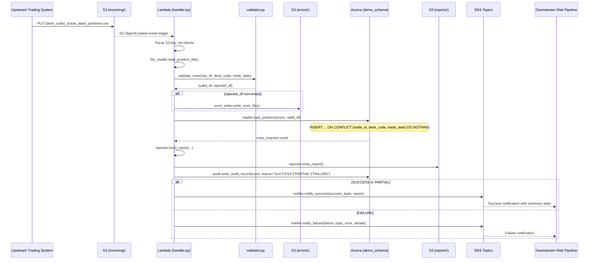
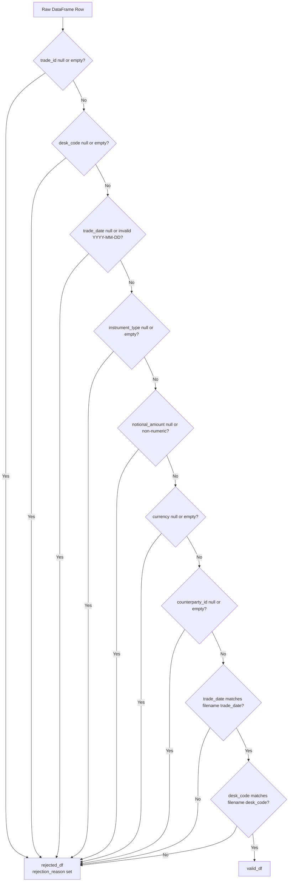
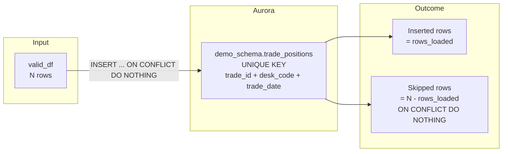
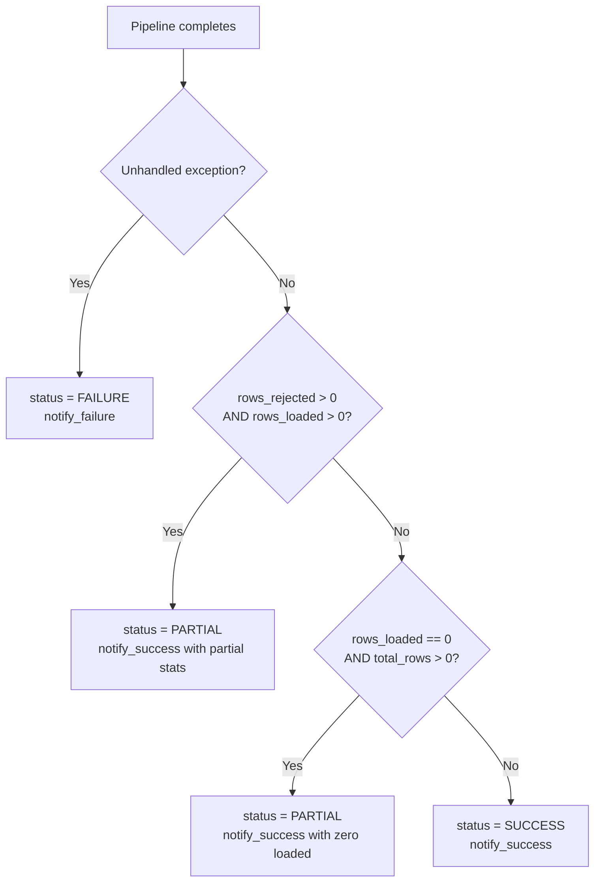

# Technical Design Document
## Daily Trade Position Ingestion — Enterprise Risk Data Platform

**Repo:** `nartcr/agentic-poc-sandbox`
**Change Type:** New Feature
**Date:** June 2026
**Status:** Draft

---

## COMPONENTS

### `src/config.py`
**What it does:** Centralizes all environment variable reads and exposes typed configuration constants for the rest of the application. Raises `EnvironmentError` with a descriptive message if any required variable is absent at import time.

**What it reads:**
- `os.environ["S3_BUCKET"]` → S3 bucket name
- `os.environ["S3_INPUT_PREFIX"]` → S3 prefix for incoming files (default: `incoming/`)
- `os.environ["S3_ERROR_PREFIX"]` → S3 prefix for error files (default: `errors/`)
- `os.environ["S3_REPORT_PREFIX"]` → S3 prefix for report files (default: `reports/`)
- `os.environ["DB_SECRET_ID"]` → Secrets Manager secret ID for Aurora credentials
- `os.environ["SNS_SUCCESS_ARN"]` → SNS topic ARN for success notifications
- `os.environ["SNS_FAILURE_ARN"]` → SNS topic ARN for failure notifications
- `os.environ["AWS_REGION"]` → AWS region string

**What it writes:** Nothing. Exposes module-level constants consumed by all other modules.

**Satisfies:** BAC-8 (no hardcoded credentials or config values)

---

### `src/secrets.py`
**What it does:** Retrieves Aurora database credentials from AWS Secrets Manager at runtime. Provides function `get_db_credentials() -> dict` that calls `secretsmanager:GetSecretValue` using `os.environ["DB_SECRET_ID"]`, parses the JSON secret string, and returns a dict with keys `host`, `port`, `dbname`, `username`, `password`. Credentials are never cached to a file or logged.

**Function signature:**
```
def get_db_credentials() -> dict:
    # Returns: {"host": str, "port": int, "dbname": str, "username": str, "password": str}
```

**What it reads:** AWS Secrets Manager secret identified by `os.environ["DB_SECRET_ID"]`

**What it writes:** Nothing.

**Satisfies:** BAC-8 (runtime-only credential retrieval, no secrets in code)

---

### `src/file_reader.py`
**What it does:** Discovers and reads a trade position CSV file from S3. Provides two functions:

```
def list_pending_files(s3_client, bucket: str, prefix: str) -> list[str]:
    # Returns list of S3 object keys matching pattern: {prefix}{desk_code}_{trade_date}_positions.csv
    # Filters only keys ending in '_positions.csv'

def read_position_file(s3_client, bucket: str, key: str) -> tuple[pd.DataFrame, str, str]:
    # Reads CSV from S3, parses into DataFrame.
    # Extracts desk_code and trade_date from the filename (basename split on '_').
    # Returns (raw_df, desk_code, trade_date)
    # trade_date parsed as YYYY-MM-DD string validated with datetime.strptime
    # Raises ValueError if filename does not match expected pattern.
```

**What it reads:**
- S3 objects at `s3://os.environ["S3_BUCKET"]/incoming/{desk_code}_{trade_date}_positions.csv`
- CSV columns expected (raw, may have extras): `trade_id`, `desk_code`, `trade_date`, `instrument_type`, `notional_amount`, `currency`, `counterparty_id`

**What it writes:** Nothing to storage. Returns in-memory DataFrame.

**Satisfies:** BAC-1 (file reception), BAC-6 (automated, no manual step)

---

### `src/validator.py`
**What it does:** Validates each row of the raw DataFrame against mandatory field rules. Produces a clean DataFrame of valid rows and a rejected DataFrame with an appended `rejection_reason` column.

**Function signature:**
```
def validate_rows(df: pd.DataFrame, desk_code: str, trade_date: str) -> tuple[pd.DataFrame, pd.DataFrame]:
    # Returns (valid_df, rejected_df)
    # rejected_df has all original columns plus: rejection_reason (str)
```

**Validation rules applied in order (first failing rule sets `rejection_reason`):**

| Rule | rejection_reason value |
|---|---|
| `trade_id` is null or empty string | `"trade_id: missing or empty"` |
| `desk_code` is null or empty string | `"desk_code: missing or empty"` |
| `trade_date` is null or not parseable as YYYY-MM-DD | `"trade_date: missing or invalid format"` |
| `instrument_type` is null or empty string | `"instrument_type: missing or empty"` |
| `notional_amount` is null or not castable to float | `"notional_amount: missing or non-numeric"` |
| `currency` is null or empty string | `"currency: missing or empty"` |
| `counterparty_id` is null or empty string | `"counterparty_id: missing or empty"` |
| `trade_date` in file row does not match `trade_date` from filename | `"trade_date: does not match filename trade_date {trade_date}"` |
| `desk_code` in file row does not match `desk_code` from filename | `"desk_code: does not match filename desk_code {desk_code}"` |

**What it reads:** Raw `pd.DataFrame` from `file_reader.py`, `desk_code` and `trade_date` strings.

**What it writes:** Nothing to storage. Returns two in-memory DataFrames.

**Satisfies:** BAC-2 (clear rejection reasons per row)

---

### `src/error_writer.py`
**What it does:** Writes the rejected rows DataFrame as a CSV to S3 under the errors prefix.

**Function signature:**
```
def write_error_file(s3_client, bucket: str, error_prefix: str, desk_code: str, trade_date: str, rejected_df: pd.DataFrame) -> str:
    # Writes rejected_df (all original columns + rejection_reason) to S3.
    # S3 key: {error_prefix}{desk_code}_{trade_date}_errors.csv
    # Returns the S3 key written.
    # If rejected_df is empty, does NOT write a file and returns empty string "".
```

**What it reads:** `rejected_df` DataFrame with columns: `trade_id`, `desk_code`, `trade_date`, `instrument_type`, `notional_amount`, `currency`, `counterparty_id`, `rejection_reason`

**What it writes:**
- S3 object at `s3://os.environ["S3_BUCKET"]/errors/{desk_code}_{trade_date}_errors.csv`
- CSV format, all columns including `rejection_reason` as last column

**Satisfies:** BAC-2 (operations team can review and correct rejected rows)

---

### `src/loader.py`
**What it does:** Inserts validated rows into `demo_schema.trade_positions` using upsert logic that skips existing records based on the deduplication key `(trade_id, desk_code, trade_date)`.

**Function signature:**
```
def load_positions(conn, valid_df: pd.DataFrame) -> int:
    # Accepts a psycopg2 connection and validated DataFrame.
    # Executes batch INSERT INTO demo_schema.trade_positions
    #   (trade_id, desk_code, trade_date, instrument_type, notional_amount, currency, counterparty_id, loaded_at)
    #   VALUES (%s, %s, %s, %s, %s, %s, %s, %s)
    #   ON CONFLICT (trade_id, desk_code, trade_date) DO NOTHING
    # loaded_at set to current timestamp in America/Toronto timezone.
    # Commits the transaction.
    # Returns count of rows actually inserted (via cursor.rowcount summed across batches).
```

**What it reads:** `valid_df` with columns `trade_id`, `desk_code`, `trade_date`, `instrument_type`, `notional_amount`, `currency`, `counterparty_id`

**What it writes:**
- Rows to `demo_schema.trade_positions` (see Data Contracts for full schema)

**Satisfies:** BAC-1 (positions loaded to DB), BAC-3 (ON CONFLICT DO NOTHING prevents duplicates)

---

### `src/reporter.py`
**What it does:** Computes summary statistics from the raw, valid, and rejected DataFrames, and writes a JSON report to S3.

**Function signature:**
```
def build_report(
    raw_df: pd.DataFrame,
    valid_df: pd.DataFrame,
    rejected_df: pd.DataFrame,
    rows_inserted: int,
    desk_code: str,
    trade_date: str,
    source_s3_key: str,
    processing_start: datetime,   # timezone-aware, America/Toronto
) -> dict:
    # Returns report dict (see report schema in Data Contracts).

def write_report(s3_client, bucket: str, report_prefix: str, desk_code: str, trade_date: str, report: dict) -> str:
    # Serializes report dict to JSON and writes to S3.
    # S3 key: {report_prefix}{desk_code}_{trade_date}_summary.json
    # Returns the S3 key written.
```

**Report contents:**
- `source_file`: source S3 key
- `desk_code`: str
- `trade_date`: str
- `processing_timestamp_et`: ISO 8601 string, America/Toronto timezone
- `total_rows_received`: int
- `rows_loaded`: int (rows actually inserted by loader)
- `rows_rejected`: int
- `rows_skipped_duplicate`: int (= valid rows − rows_loaded)
- `desk_code_counts`: `{desk_code: count}` grouped from raw_df
- `notional_min`: float (from valid_df; null if no valid rows)
- `notional_max`: float (from valid_df; null if no valid rows)
- `null_rates`: `{column_name: rate}` for each of the 7 mandatory columns, computed from raw_df (null count / total rows)

**What it writes:**
- S3 object at `s3://os.environ["S3_BUCKET"]/reports/{desk_code}_{trade_date}_summary.json`

**Satisfies:** BAC-4 (accurate processing summary), BAC-7 (ET timestamps)

---

### `src/notifier.py`
**What it does:** Publishes SNS notifications for success and failure events.

**Function signatures:**
```
def notify_success(sns_client, topic_arn: str, report: dict) -> None:
    # Publishes JSON message to SNS success topic.
    # Message body: see SNS message schema in Data Contracts.
    # Subject: f"Trade Position Ingestion SUCCESS: {report['desk_code']} {report['trade_date']}"

def notify_failure(sns_client, topic_arn: str, desk_code: str, trade_date: str, error_message: str, source_key: str) -> None:
    # Publishes JSON message to SNS failure topic.
    # Subject: f"Trade Position Ingestion FAILURE: {desk_code} {trade_date}"
```

**What it reads:** Report dict (success) or error string (failure).

**What it writes:** SNS message to `os.environ["SNS_SUCCESS_ARN"]` or `os.environ["SNS_FAILURE_ARN"]`.

**Satisfies:** BAC-5 (automatic notification, no manual trigger)

---

### `src/audit.py`
**What it does:** Writes one row to `demo_schema.pipeline_audit` for every file processed, capturing the complete processing outcome. Called at the end of each file's processing cycle regardless of outcome.

**Function signature:**
```
def write_audit_record(
    conn,
    source_key: str,
    desk_code: str,
    trade_date: str,
    status: str,              # "SUCCESS" | "PARTIAL" | "FAILURE"
    total_rows: int,
    rows_loaded: int,
    rows_rejected: int,
    rows_skipped: int,
    error_message: str | None,
    processing_start: datetime,   # timezone-aware, America/Toronto
    processing_end: datetime,     # timezone-aware, America/Toronto
) -> None:
    # Executes INSERT INTO demo_schema.pipeline_audit (...) with all fields.
    # Commits immediately. Does not raise on failure — logs the error instead.
```

**What it reads:** Outcome values from all prior processing steps.

**What it writes:**
- Row to `demo_schema.pipeline_audit` (see Data Contracts for full schema)

**Satisfies:** BAC-7 (ET timestamps in audit trail), BAC-8 (audit trail for regulatory examination)

---

### `src/db.py`
**What it does:** Manages database connections. Provides a context manager that acquires credentials from `secrets.py`, opens a `psycopg2` connection to Aurora PostgreSQL, and ensures the connection is closed on exit.

**Function signature:**
```
def get_connection():
    # Context manager. Usage: with db.get_connection() as conn:
    # Calls secrets.get_db_credentials() on each invocation.
    # Connects to Aurora via psycopg2 using host, port, dbname, username, password.
    # dbname is always "app" (from infrastructure config).
    # Yields the connection. Closes on __exit__ regardless of exception.
```

**What it reads:** Credentials from `secrets.get_db_credentials()`

**What it writes:** Nothing.

**Satisfies:** BAC-8 (no hardcoded credentials)

---

### `src/pipeline.py`
**What it does:** Orchestrates a single end-to-end file processing run. This is the main entry point called by the Lambda handler for each file. Coordinates all other modules in the correct order and ensures audit and notification are always called even if intermediate steps fail.

**Function signature:**
```
def process_file(s3_key: str, s3_client, sns_client, db_conn) -> dict:
    # Orchestrates: file_reader → validator → error_writer → loader → reporter → audit → notifier
    # Returns the report dict on success.
    # On any unhandled exception: calls audit.write_audit_record with status="FAILURE",
    #   calls notifier.notify_failure, then re-raises.
    # processing_start captured at function entry in America/Toronto timezone.
```

**What it reads:** An S3 object key for a file in the `incoming/` prefix.

**What it writes:** (via delegated calls) DB rows, S3 error file, S3 report file, SNS notification, audit row.

**Satisfies:** BAC-1, BAC-2, BAC-3, BAC-4, BAC-5, BAC-6, BAC-7

---

### `src/handler.py`
**What it does:** AWS Lambda entry point. Handles S3 event triggers — one invocation per S3 `ObjectCreated` event. Extracts the S3 key from the event, initializes AWS clients (S3, SNS) and DB connection, delegates to `pipeline.process_file()`, and returns a structured response.

**Function signature:**
```
def lambda_handler(event: dict, context) -> dict:
    # Parses event["Records"][0]["s3"]["bucket"]["name"] and event["Records"][0]["s3"]["object"]["key"]
    # Validates key ends with "_positions.csv" — skips and logs if not.
    # Initializes boto3 clients for s3 and sns.
    # Calls pipeline.process_file(s3_key, s3_client, sns_client, conn)
    # Returns {"statusCode": 200, "body": json.dumps(report)} on success.
    # Returns {"statusCode": 500, "body": json.dumps({"error": str(e)})} on failure.
```

**What it reads:** Lambda event dict (S3 trigger format), Lambda context object.

**What it writes:** Nothing directly. Delegates to `pipeline.process_file()`.

**Satisfies:** BAC-5 (Lambda triggered by S3 event — no manual step), BAC-6 (automated pipeline)

---

### `scripts/create_tables.sql`
**What it does:** DDL script to create `demo_schema.trade_positions` and `demo_schema.pipeline_audit`. Idempotent via `CREATE TABLE IF NOT EXISTS`. Must be run once during deployment against the Aurora instance.

**What it reads:** N/A

**What it writes:** Table definitions in `demo_schema`

**Satisfies:** Prerequisite for all BACs.

---

### `tests/test_validator.py`, `tests/test_loader.py`, `tests/test_reporter.py`, `tests/test_pipeline.py`
**What they do:** Unit and integration tests covering each component. See Technical Acceptance Criteria for assertions.

---

## AWS SERVICES

| Service | Role |
|---|---|
| **Amazon S3** | Stores incoming position CSV files (`incoming/` prefix), error files (`errors/` prefix), and JSON summary reports (`reports/` prefix). Also serves as the Lambda trigger source via S3 Event Notifications. |
| **AWS Lambda** | Compute host for the ingestion pipeline. Function `agentic-poc-sandbox-qa` is invoked per S3 `ObjectCreated` event on the `incoming/` prefix. |
| **Amazon Aurora PostgreSQL** | Reporting database. Hosts `demo_schema.trade_positions` (position data) and `demo_schema.pipeline_audit` (processing audit trail). Schema: `demo_schema`. Database name: `app`. |
| **AWS Secrets Manager** | Stores Aurora connection credentials (host, port, dbname, username, password) under secret ID `agentic-poc-aurora`. Retrieved at runtime by `secrets.py`. |
| **Amazon SNS** | Delivers success and failure notifications to downstream systems. Two topics: one for success events, one for failure events. |

---

## DATA CONTRACTS

### Database Tables

#### `demo_schema.trade_positions`

```sql
CREATE TABLE IF NOT EXISTS demo_schema.trade_positions (
    id                BIGSERIAL        PRIMARY KEY,
    trade_id          VARCHAR(255)     NOT NULL,
    desk_code         VARCHAR(100)     NOT NULL,
    trade_date        DATE             NOT NULL,
    instrument_type   VARCHAR(100)     NOT NULL,
    notional_amount   NUMERIC(20, 4)   NOT NULL,
    currency          VARCHAR(10)      NOT NULL,
    counterparty_id   VARCHAR(255)     NOT NULL,
    loaded_at         TIMESTAMPTZ      NOT NULL,
    CONSTRAINT uq_trade_positions_dedup UNIQUE (trade_id, desk_code, trade_date)
);

CREATE INDEX IF NOT EXISTS idx_trade_positions_trade_date
    ON demo_schema.trade_positions (trade_date);

CREATE INDEX IF NOT EXISTS idx_trade_positions_desk_code
    ON demo_schema.trade_positions (desk_code);
```

#### `demo_schema.pipeline_audit`

```sql
CREATE TABLE IF NOT EXISTS demo_schema.pipeline_audit (
    id                  BIGSERIAL       PRIMARY KEY,
    source_key          VARCHAR(1024)   NOT NULL,
    desk_code           VARCHAR(100)    NOT NULL,
    trade_date          DATE            NOT NULL,
    status              VARCHAR(20)     NOT NULL,   -- 'SUCCESS', 'PARTIAL', 'FAILURE'
    total_rows          INTEGER         NOT NULL DEFAULT 0,
    rows_loaded         INTEGER         NOT NULL DEFAULT 0,
    rows_rejected       INTEGER         NOT NULL DEFAULT 0,
    rows_skipped        INTEGER         NOT NULL DEFAULT 0,
    error_message       TEXT,
    processing_start_et TIMESTAMPTZ     NOT NULL,
    processing_end_et   TIMESTAMPTZ     NOT NULL,
    service_identity    VARCHAR(255)    NOT NULL    -- Lambda function name from context.function_name
);

CREATE INDEX IF NOT EXISTS idx_pipeline_audit_trade_date
    ON demo_schema.pipeline_audit (trade_date);

CREATE INDEX IF NOT EXISTS idx_pipeline_audit_status
    ON demo_schema.pipeline_audit (status);
```

---

### S3 Paths

| Path Pattern | Format | Description |
|---|---|---|
| `s3://agentic-poc-data-533266968934/incoming/{desk_code}_{trade_date}_positions.csv` | CSV (header row required) | Input: daily position files deposited by upstream trading systems |
| `s3://agentic-poc-data-533266968934/errors/{desk_code}_{trade_date}_errors.csv` | CSV | Output: rejected rows with `rejection_reason` column appended |
| `s3://agentic-poc-data-533266968934/reports/{desk_code}_{trade_date}_summary.json` | JSON | Output: processing summary report |

**Input CSV columns (in any order):**
`trade_id`, `desk_code`, `trade_date`, `instrument_type`, `notional_amount`, `currency`, `counterparty_id`

**Error CSV columns:**
`trade_id`, `desk_code`, `trade_date`, `instrument_type`, `notional_amount`, `currency`, `counterparty_id`, `rejection_reason`

**`trade_date` format in filenames:** `YYYYMMDD` (e.g., `EQDESK_20260610_positions.csv`)
**`trade_date` format in file rows:** `YYYY-MM-DD`

---

### Secrets Manager

**Secret ID:** `agentic-poc-aurora` (via `os.environ["DB_SECRET_ID"]`)

**Expected JSON structure inside the secret:**
```json
{
  "host":     "string — Aurora cluster endpoint",
  "port":     5432,
  "dbname":   "app",
  "username": "string — database username",
  "password": "string — database password"
}
```

---

### SNS Messages

**Success Topic ARN:** `os.environ["SNS_SUCCESS_ARN"]`

**Success message body (JSON):**
```json
{
  "event":                    "TRADE_POSITION_INGESTION_SUCCESS",
  "source_file":              "incoming/EQDESK_20260610_positions.csv",
  "desk_code":                "EQDESK",
  "trade_date":               "2026-06-10",
  "processing_timestamp_et":  "2026-06-10T19:45:32.000-04:00",
  "total_rows_received":      5000,
  "rows_loaded":              4987,
  "rows_rejected":            13,
  "rows_skipped_duplicate":   0,
  "notional_min":             10000.00,
  "notional_max":             50000000.00
}
```

**Failure Topic ARN:** `os.environ["SNS_FAILURE_ARN"]`

**Failure message body (JSON):**
```json
{
  "event":        "TRADE_POSITION_INGESTION_FAILURE",
  "source_file":  "incoming/EQDESK_20260610_positions.csv",
  "desk_code":    "EQDESK",
  "trade_date":   "2026-06-10",
  "error_message": "string — exception message or description"
}
```

---

### Environment Variables Reference

| Variable | Value Source | Used By |
|---|---|---|
| `S3_BUCKET` | Deployment config | `config.py`, all S3 operations |
| `S3_INPUT_PREFIX` | Deployment config (default: `incoming/`) | `file_reader.py` |
| `S3_ERROR_PREFIX` | Deployment config (default: `errors/`) | `error_writer.py` |
| `S3_REPORT_PREFIX` | Deployment config (default: `reports/`) | `reporter.py` |
| `DB_SECRET_ID` | Deployment config | `secrets.py` |
| `SNS_SUCCESS_ARN` | Deployment config | `notifier.py` |
| `SNS_FAILURE_ARN` | Deployment config | `notifier.py` |
| `AWS_REGION` | Lambda environment | All boto3 clients |

---

## DATA FLOW

### End-to-End Pipeline Flow



---

### Validation Decision Logic



---

### Deduplication and Load Logic



---

### Status Determination



---

### Algorithm: Summary Report Construction

```
FUNCTION build_report(raw_df, valid_df, rejected_df, rows_inserted, desk_code, trade_date, source_key, processing_start):

    total_rows_received  = len(raw_df)
    rows_rejected        = len(rejected_df)
    rows_loaded          = rows_inserted
    rows_skipped_dup     = len(valid_df) - rows_inserted

    desk_code_counts     = raw_df.groupby("desk_code").size().to_dict()

    IF len(valid_df) > 0:
        notional_min     = float(valid_df["notional_amount"].min())
        notional_max     = float(valid_df["notional_amount"].max())
    ELSE:
        notional_min     = None
        notional_max     = None

    null_rates = {}
    FOR col IN [trade_id, desk_code, trade_date, instrument_type,
                notional_amount, currency, counterparty_id]:
        null_rates[col]  = raw_df[col].isnull().sum() / total_rows_received
                           IF total_rows_received > 0 ELSE 0.0

    processing_timestamp_et = processing_start.isoformat()

    RETURN assembled report dict
```

---

## TECHNICAL ACCEPTANCE CRITERIA

### TAC-1: Valid positions available before morning risk run
**Maps to:** BAC-1

- `loader.load_positions()` executes `INSERT INTO demo_schema.trade_positions (trade_id, desk_code, trade_date, instrument_type, notional_amount, currency, counterparty_id, loaded_at) VALUES (...) ON CONFLICT (trade_id, desk_code, trade_date) DO NOTHING`.
- Acceptance test: given a CSV file with 100 valid rows, after `pipeline.process_file()` completes, a `SELECT COUNT(*) FROM demo_schema.trade_positions WHERE desk_code = %s AND trade_date = %s` returns 100.
- `loaded_at` is populated for every inserted row, confirming the row is queryable immediately post-commit.

---

### TAC-2: Rejected rows are flagged with clear reasons
**Maps to:** BAC-2

- `validator.validate_rows()` returns a `rejected_df` with a non-null `rejection_reason` column on every row.
- Rejection reasons follow the exact format strings defined in the validator (e.g., `"notional_amount: missing or non-numeric"`).
- `error_writer.write_error_file()` writes a CSV to `s3://{S3_BUCKET}/errors/{desk_code}_{trade_date}_errors.csv` containing all rejected rows with the `rejection_reason` column as the last column.
- Acceptance test: a CSV with 5 rows each missing a different mandatory field produces an error file with exactly 5 rows, one per violation type, each with a distinct non-null `rejection_reason`.

---

### TAC-3: Reprocessing does not create duplicates
**Maps to:** BAC-3

- `loader.load_positions()` uses `ON CONFLICT (trade_id, desk_code, trade_date) DO NOTHING`.
- The `UNIQUE` constraint `uq_trade_positions_dedup` on `demo_schema.trade_positions(trade_id, desk_code, trade_date)` is enforced at the database level.
- Acceptance test: call `pipeline.process_file()` twice with the identical S3 file. Assert `SELECT COUNT(*) FROM demo_schema.trade_positions WHERE desk_code = %s AND trade_date = %s` returns the same count after both runs. Assert `report["rows_skipped_duplicate"]` equals the full valid row count on the second run.

---

### TAC-4: Summary report accurately reflects what was received, accepted, and rejected
**Maps to:** BAC-4

- `reporter.build_report()` computes `total_rows_received = len(raw_df)`, `rows_loaded` from the return value of `loader.load_positions()`, `rows_rejected = len(rejected_df)`, and `rows_skipped_duplicate = len(valid_df) - rows_loaded`.
- Invariant enforced: `total_rows_received == rows_loaded + rows_rejected + rows_skipped_duplicate`.
- Report written to `s3://{S3_BUCKET}/reports/{desk_code}_{trade_date}_summary.json`.
- Acceptance test: a file with 100 rows (80 valid, 20 invalid, 10 of the 80 valid already in DB) produces a report with `total_rows_received=100`, `rows_loaded=70`, `rows_rejected=20`, `rows_skipped_duplicate=10`. These four fields must sum correctly.
- `null_rates` dict must contain exactly the 7 mandatory column names as keys, each with a value between 0.0 and 1.0.
- `desk_code_counts` must contain at least the desk_code matching the filename.

---

### TAC-5: Downstream pipeline is automatically notified with no manual trigger
**Maps to:** BAC-5

- Lambda is triggered by an S3 `ObjectCreated` event on the `incoming/` prefix — no human action required.
- On successful completion, `notifier.notify_success()` publishes to `os.environ["SNS_SUCCESS_ARN"]` with `event = "TRADE_POSITION_INGESTION_SUCCESS"` and all summary fields populated.
- On pipeline failure, `notifier.notify_failure()` publishes to `os.environ["SNS_FAILURE_ARN"]` with `event = "TRADE_POSITION_INGESTION_FAILURE"` and `error_message` set.
- Acceptance test: mock SNS client verifies `publish()` is called exactly once per file with the correct topic ARN and a valid JSON body containing the required fields.

---

### TAC-6: Processing completes within the operations window
**Maps to:** BAC-6

- Performance test: a CSV file with 10,000 rows must complete the full `pipeline.process_file()` call (read → validate → load → report → audit → notify) in under 60 seconds as measured by wall-clock time.
- `loader.load_positions()` must use `executemany` or `execute_values` batch insertion (not row-by-row) to meet the 60-second requirement.
- Acceptance test: instrument `pipeline.process_file()` with `time.perf_counter()`. Assert elapsed time < 60.0 seconds for a 10,000-row file.

---

### TAC-7: All timestamps reflect Toronto business hours
**Maps to:** BAC-7

- All timestamps written to `demo_schema.trade_positions.loaded_at`, `demo_schema.pipeline_audit.processing_start_et`, `demo_schema.pipeline_audit.processing_end_et`, and `report["processing_timestamp_et"]` must use `pytz.timezone("America/Toronto")`.
- Acceptance test: after processing, `SELECT loaded_at AT TIME ZONE 'America/Toronto' FROM demo_schema.trade_positions LIMIT 1` returns a timestamp that matches the America/Toronto wall clock at time of test execution (within a 5-second tolerance). Assert `report["processing_timestamp_et"]` is a valid ISO 8601 string containing a `-04:00` or `-05:00` UTC offset (depending on DST).
- No UTC-naive `datetime.utcnow()` calls permitted anywhere in the codebase.

---

### TAC-8: No secrets stored in code or configuration files
**Maps to:** BAC-8

- `secrets.get_db_credentials()` retrieves credentials exclusively from `secretsmanager:GetSecretValue` using the secret ID from `os.environ["DB_SECRET_ID"]` at runtime.
- Acceptance test (static): `grep` over all `.py` files in the repo finds zero occurrences of password literals, connection string literals, or embedded AWS credentials.
- Acceptance test (dynamic): setting `os.environ["DB_SECRET_ID"]` to an invalid value causes `secrets.get_db_credentials()` to raise a `ClientError` — confirming no fallback hardcoded credentials exist.
- All infrastructure identifiers (bucket, topic ARNs, secret ID) read from environment variables; no literal AWS resource names in source code.

---

## OPEN QUESTIONS

**OQ-1: Status logic for "all rows rejected" case**
If a file contains rows but all rows fail validation (zero valid rows, zero loaded), the pipeline does not fail with an exception — it completes normally with `rows_loaded=0`. Should this be treated as `status="PARTIAL"` (some data issue, notify success topic with zero rows loaded) or `status="FAILURE"` (notify failure topic)? The distinction affects whether the downstream risk pipeline is triggered. A human decision is required because triggering the downstream pipeline with zero new positions may be incorrect.

**OQ-2: Re-processing behaviour for already-reported files**
If the same `{desk_code}_{trade_date}_positions.csv` file is deposited a second time (e.g., a corrected resubmission), the system will overwrite the `reports/{desk_code}_{trade_date}_summary.json` and `errors/{desk_code}_{trade_date}_errors.csv` files in S3 (same key = overwrite). Is this the intended behaviour, or should re-processed files produce versioned/timestamped report keys (e.g., `reports/{desk_code}_{trade_date}_{run_timestamp}_summary.json`)? The BRD states idempotent loading is required but does not specify report versioning.

---

## ASSUMPTIONS

1. **Lambda trigger mechanism:** The existing Lambda function `agentic-poc-sandbox-qa` is configured (or will be configured at deployment time) with an S3 Event Notification trigger on the `agentic-poc-data-533266968934` bucket for `s3:ObjectCreated:*` events filtered to the `incoming/` prefix. This wiring is a deployment-time operation, not a code change.

2. **Two SNS topics exist:** Two SNS topics exist for this pipeline — one for success events and one for failure events — with ARNs provided via `os.environ["SNS_SUCCESS_ARN"]` and `os.environ["SNS_FAILURE_ARN"]`. These are assumed to exist in the account.

3. **`trade_date` format in filenames is `YYYYMMDD`:** The BRD states the naming convention is `{desk_code}_{trade_date}_positions.csv`. It does not specify the date format. This TDD assumes `YYYYMMDD` (e.g., `EQDESK_20260610_positions.csv`) for filename parsing, with `YYYY-MM-DD` inside the file rows.

4. **One file = one desk code:** Each file corresponds to exactly one trading desk. The `desk_code` is authoritative from the filename. Rows with a mismatched `desk_code` column value are rejected (not silently corrected).

5. **`PARTIAL` status for mixed outcomes:** A file that produces both loaded and rejected rows is treated as `PARTIAL` (not `FAILURE`). The success topic is notified. The failure topic is NOT notified for partial outcomes — only for unhandled exceptions. (Subject to OQ-1 resolution.)

6. **Aurora is PostgreSQL-compatible:** The Aurora instance behind `agentic-poc-aurora` is PostgreSQL-compatible. `psycopg2` is the database driver. `ON CONFLICT ... DO NOTHING` syntax is valid.

7. **Lambda has IAM permissions** to: `s3:GetObject` and `s3:ListBucket` on `agentic-poc-data-533266968934/incoming/*`, `s3:PutObject` on `errors/*` and `reports/*`, `secretsmanager:GetSecretValue` on `agentic-poc-aurora`, `sns:Publish` on both SNS topics, and VPC/security group access to reach the Aurora cluster.

8. **`service_identity` in audit table:** The Lambda `context.function_name` value is used as `service_identity` in `demo_schema.pipeline_audit`. This is the Lambda function name `agentic-poc-sandbox-qa`.

9. **No file archival requirement:** The BRD does not mention archiving or deleting processed files from `incoming/`. Processed files remain in `incoming/` after processing. No move or delete operation is performed.

10. **Batch insert strategy:** `loader.load_positions()` uses `psycopg2.extras.execute_values()` for batch inserts to satisfy the 60-second / 10,000-row performance requirement.

11. **Python runtime:** Lambda uses Python 3.11+. Dependencies include `pandas`, `psycopg2-binary`, `pytz`, and `boto3` (provided by Lambda runtime or Lambda layer).

12. **`demo_schema` exists in the Aurora `app` database:** The schema `demo_schema` is already present. `create_tables.sql` uses `CREATE TABLE IF NOT EXISTS` and does not attempt `CREATE SCHEMA`.

13. **Report overwrites on reprocessing:** Reprocessing the same file overwrites the S3 report and error file at the same key (no versioning), unless OQ-2 is resolved otherwise.