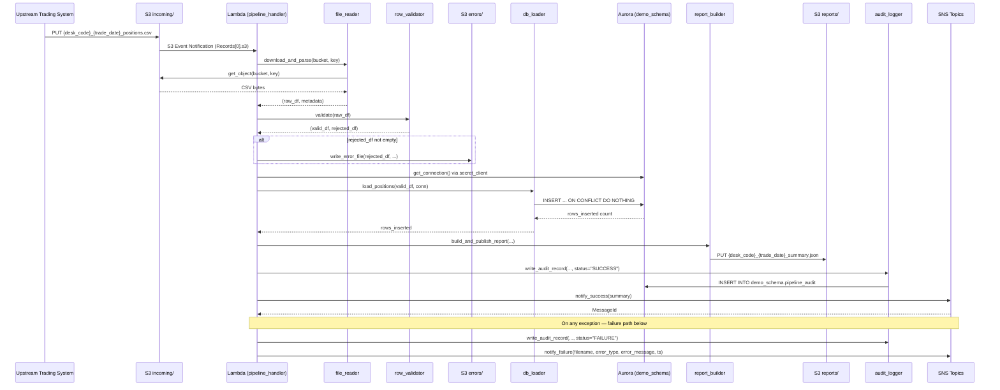
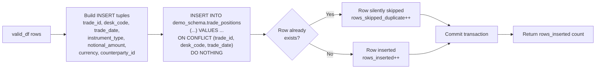
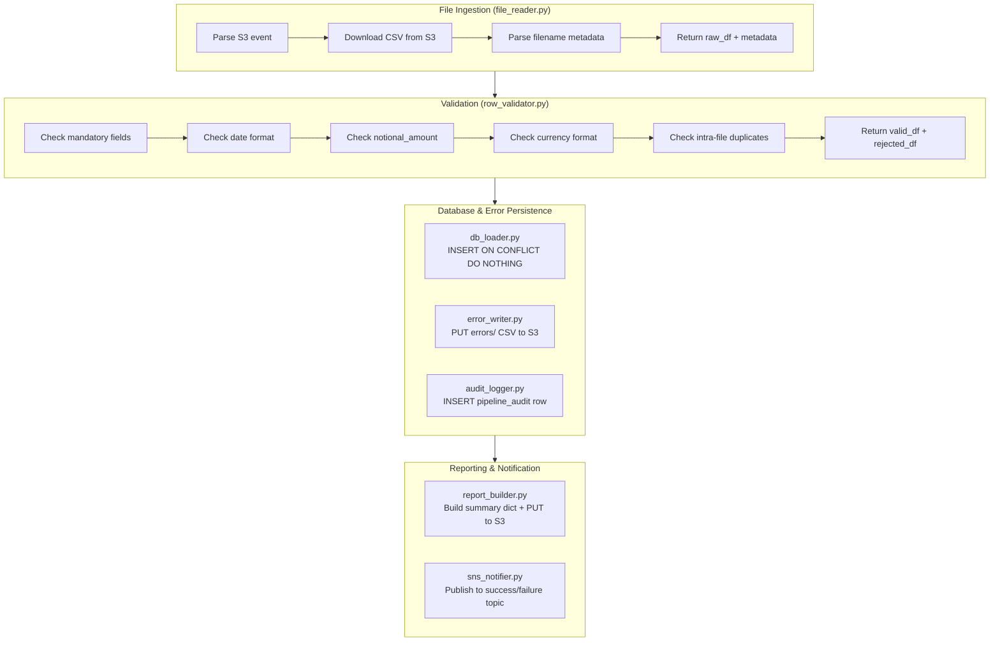

# Technical Design Document
## Daily Trade Position Ingestion — Enterprise Risk Data Platform

**Repo:** nartcr/agentic-poc-sandbox
**Change Type:** New Feature
**Date:** June 2026
**Status:** Draft

---

## COMPONENTS

### `pipeline_handler.py` — Lambda Entry Point & Orchestrator

**What it does:**
The main Lambda handler function. Receives an S3 event notification (or can be invoked with a synthetic event for manual re-runs), extracts the S3 bucket and key from the event payload, and orchestrates the full pipeline: file download → validation → database load → report generation → SNS notification. Captures unhandled exceptions and routes them to the failure SNS topic. Writes one row to `demo_schema.pipeline_audit` at the end of every invocation regardless of outcome.

**Function signatures:**
```
def handler(event: dict, context: object) -> dict
def _parse_s3_event(event: dict) -> tuple[str, str]   # returns (bucket, key)
def _run_pipeline(bucket: str, key: str) -> dict       # returns summary dict
```

**Reads:**
- S3 event payload: `event["Records"][0]["s3"]["bucket"]["name"]`, `event["Records"][0]["s3"]["object"]["key"]`
- Environment variables: `S3_BUCKET`, `DB_SECRET_ID`, `SNS_SUCCESS_ARN`, `SNS_FAILURE_ARN`, `S3_ERROR_PREFIX`, `S3_REPORT_PREFIX`

**Writes:**
- One audit row to `demo_schema.pipeline_audit` (via `audit_logger.py`)
- Delegates all other writes to downstream modules

**Satisfies:** BAC-1, BAC-5, BAC-6, BAC-7, BAC-8

---

### `file_reader.py` — S3 File Download & CSV Parser

**What it does:**
Downloads the CSV file from S3 into memory using `boto3.client("s3").get_object()`. Parses the CSV using `pandas.read_csv()` with `dtype=str` (all columns read as strings to avoid silent type coercion). Extracts `desk_code` and `trade_date` from the filename using the pattern `{desk_code}_{trade_date}_positions.csv` via regex `^([A-Z0-9]+)_(\d{4}-\d{2}-\d{2})_positions\.csv$`. Returns a raw DataFrame plus parsed filename metadata.

**Function signatures:**
```
def download_and_parse(bucket: str, key: str) -> tuple[pd.DataFrame, dict]
    # dict keys: {"desk_code": str, "trade_date": str, "filename": str}
def _extract_filename_metadata(key: str) -> dict
```

**Reads:**
- S3 object at `s3://{bucket}/{key}` — CSV with header row
- Expected columns (at minimum): `trade_id`, `desk_code`, `trade_date`, `instrument_type`, `notional_amount`, `currency`, `counterparty_id`

**Writes:**
- Returns `pd.DataFrame` (all columns as `str` dtype) and metadata dict

**Satisfies:** BAC-1, BAC-2, BAC-6

---

### `row_validator.py` — Field-Level Validation Engine

**What it does:**
Receives the raw DataFrame from `file_reader.py`. Applies per-column validation rules in sequence. Returns two DataFrames: `valid_df` (rows passing all checks) and `rejected_df` (rows failing at least one check, with an appended `rejection_reason` column). Rows may accumulate multiple rejection reasons concatenated with ` | `.

**Validation rules applied (in order):**
1. **Mandatory field presence:** `trade_id`, `desk_code`, `trade_date`, `instrument_type`, `notional_amount`, `currency`, `counterparty_id` must be non-null and non-empty-string after `.strip()`.
2. **trade_date format:** Must match `YYYY-MM-DD` via `datetime.strptime(val, "%Y-%m-%d")`.
3. **notional_amount numeric:** Must be castable to `float` and must be > 0.
4. **currency format:** Must be a 3-character uppercase alphabetic string matching `^[A-Z]{3}$`.
5. **trade_id uniqueness within file:** Duplicate `(trade_id, desk_code, trade_date)` tuples within the file are rejected with reason `"duplicate_within_file"`.

**Function signatures:**
```
def validate(df: pd.DataFrame) -> tuple[pd.DataFrame, pd.DataFrame]
    # returns (valid_df, rejected_df)
def _check_mandatory_fields(df: pd.DataFrame) -> pd.Series   # returns boolean mask of valid rows
def _check_trade_date_format(df: pd.DataFrame) -> pd.Series
def _check_notional_amount(df: pd.DataFrame) -> pd.Series
def _check_currency_format(df: pd.DataFrame) -> pd.Series
def _check_intrafile_duplicates(df: pd.DataFrame) -> pd.Series
```

**Reads:**
- `pd.DataFrame` with columns: `trade_id`, `desk_code`, `trade_date`, `instrument_type`, `notional_amount`, `currency`, `counterparty_id` (all `str` dtype)

**Writes:**
- `valid_df`: same schema as input, no `rejection_reason` column
- `rejected_df`: same schema as input plus `rejection_reason: str` column

**Satisfies:** BAC-2, BAC-4

---

### `db_loader.py` — Idempotent Database Writer

**What it does:**
Receives the `valid_df` DataFrame. Connects to Aurora PostgreSQL using credentials retrieved from Secrets Manager via `secret_client.py`. Executes a batch `INSERT INTO demo_schema.trade_positions (...) VALUES ... ON CONFLICT (trade_id, desk_code, trade_date) DO NOTHING`. Returns the count of rows actually inserted (i.e., rows not skipped by the conflict clause) by comparing row count before and after, or using `cursor.rowcount` with `executemany`.

Uses `psycopg2` with `execute_values` for bulk insert performance. Commits in a single transaction. On any database exception, rolls back and re-raises.

**Function signatures:**
```
def load_positions(valid_df: pd.DataFrame, conn) -> int
    # returns count of newly inserted rows
def _build_insert_tuples(df: pd.DataFrame) -> list[tuple]
```

**Reads:**
- `valid_df` columns: `trade_id`, `desk_code`, `trade_date`, `instrument_type`, `notional_amount`, `currency`, `counterparty_id`
- Active `psycopg2` connection passed in from caller

**Writes:**
- Rows into `demo_schema.trade_positions` — see Data Contracts for full schema

**Satisfies:** BAC-1, BAC-3, BAC-6

---

### `error_writer.py` — Rejection File Publisher

**What it does:**
Receives the `rejected_df` DataFrame. If `rejected_df` is empty, writes nothing and returns `None`. Otherwise, serializes `rejected_df` to CSV (including `rejection_reason` column) and uploads to S3 at key `errors/{desk_code}_{trade_date}_rejected.csv`. Uses `boto3.client("s3").put_object()` with `ContentType="text/csv"`.

**Function signatures:**
```
def write_error_file(
    rejected_df: pd.DataFrame,
    desk_code: str,
    trade_date: str,
    bucket: str,
    error_prefix: str
) -> str | None
    # returns S3 key of error file, or None if no rejections
```

**Reads:**
- `rejected_df` columns: all input columns + `rejection_reason`
- `bucket`: from `os.environ["S3_BUCKET"]`
- `error_prefix`: from `os.environ["S3_ERROR_PREFIX"]` (value: `errors/`)

**Writes:**
- S3 object at `s3://{bucket}/errors/{desk_code}_{trade_date}_rejected.csv`
- CSV format, UTF-8 encoded, with header row

**Satisfies:** BAC-2

---

### `report_builder.py` — Processing Summary Report Generator

**What it does:**
Receives the raw DataFrame (all rows), `valid_df`, `rejected_df`, inserted row count, `desk_code`, `trade_date`, and processing timestamp. Computes the following statistics and assembles them into a summary dict:
- `total_rows_received`: `len(raw_df)`
- `rows_valid`: `len(valid_df)`
- `rows_inserted`: integer returned by `db_loader.load_positions()`
- `rows_skipped_duplicate`: `len(valid_df) - rows_inserted`
- `rows_rejected`: `len(rejected_df)`
- `processing_timestamp_et`: ISO-8601 string in `America/Toronto` timezone
- `desk_code`: string
- `trade_date`: string
- `rows_by_desk_code`: dict of `{desk_code: count}` from `valid_df`
- `notional_min`: `float(valid_df["notional_amount"].astype(float).min())` or `None`
- `notional_max`: `float(valid_df["notional_amount"].astype(float).max())` or `None`
- `null_rates`: dict of `{column_name: rate}` for all 7 mandatory columns in `raw_df`, rate = `null_count / total_rows_received`

Serializes summary to JSON and uploads to S3 at `reports/{desk_code}_{trade_date}_summary.json`.

**Function signatures:**
```
def build_and_publish_report(
    raw_df: pd.DataFrame,
    valid_df: pd.DataFrame,
    rejected_df: pd.DataFrame,
    rows_inserted: int,
    desk_code: str,
    trade_date: str,
    processing_timestamp_et: datetime,
    bucket: str,
    report_prefix: str
) -> dict
    # returns the summary dict
def _compute_null_rates(df: pd.DataFrame) -> dict[str, float]
```

**Reads:**
- DataFrames and scalar inputs as described above

**Writes:**
- S3 object at `s3://{bucket}/reports/{desk_code}_{trade_date}_summary.json`
- JSON format, UTF-8, pretty-printed with `indent=2`

**Satisfies:** BAC-4, BAC-7

---

### `sns_notifier.py` — Success and Failure Notification Publisher

**What it does:**
Publishes SNS messages to either the success or failure topic. On success, publishes the summary dict as a JSON-encoded SNS message to `SNS_SUCCESS_ARN`. On failure, publishes an error payload to `SNS_FAILURE_ARN`. Uses `boto3.client("sns").publish()`.

**Function signatures:**
```
def notify_success(summary: dict) -> None
def notify_failure(
    filename: str,
    error_type: str,
    error_message: str,
    processing_timestamp_et: str
) -> None
```

**Success message payload** — see Data Contracts.
**Failure message payload** — see Data Contracts.

**Reads:**
- `SNS_SUCCESS_ARN`: from `os.environ["SNS_SUCCESS_ARN"]`
- `SNS_FAILURE_ARN`: from `os.environ["SNS_FAILURE_ARN"]`

**Writes:**
- SNS message to success or failure topic

**Satisfies:** BAC-5

---

### `secret_client.py` — Secrets Manager Credential Loader

**What it does:**
Retrieves the database credentials JSON from AWS Secrets Manager at runtime using `boto3.client("secretsmanager").get_secret_value()`. Parses the JSON string and returns a dict. Caches the result in a module-level variable so repeated calls within the same Lambda invocation do not make redundant API calls.

**Function signatures:**
```
def get_db_credentials(secret_id: str) -> dict
    # returns {"username": str, "password": str, "host": str, "port": int, "dbname": str}
```

**Reads:**
- `DB_SECRET_ID`: from `os.environ["DB_SECRET_ID"]`
- Secrets Manager secret JSON with keys: `username`, `password`, `host`, `port`, `dbname`

**Writes:**
- Nothing (read-only side-effectless except module-level cache)

**Satisfies:** BAC-8

---

### `db_connection.py` — Database Connection Factory

**What it does:**
Creates and returns a `psycopg2` connection using credentials from `secret_client.get_db_credentials()`. Sets `connect_timeout=10`. Called once per Lambda invocation in `pipeline_handler.py` and passed down to `db_loader.py` and `audit_logger.py`. Does not maintain a persistent connection pool (Lambda execution model).

**Function signatures:**
```
def get_connection(secret_id: str) -> psycopg2.extensions.connection
def close_connection(conn: psycopg2.extensions.connection) -> None
```

**Reads:**
- Credentials dict from `secret_client.get_db_credentials()`

**Writes:**
- Nothing — returns open connection

**Satisfies:** BAC-8

---

### `audit_logger.py` — Pipeline Audit Trail Writer

**What it does:**
Writes one row to `demo_schema.pipeline_audit` at the end of every Lambda invocation. Called in `pipeline_handler.py` inside a `finally` block to ensure it always executes. Records the outcome (success/failure), file processed, row counts, and processing timestamps.

**Function signatures:**
```
def write_audit_record(
    conn,
    filename: str,
    desk_code: str | None,
    trade_date: str | None,
    status: str,               # "SUCCESS" or "FAILURE"
    total_rows: int,
    rows_inserted: int,
    rows_rejected: int,
    error_message: str | None,
    processing_timestamp_et: datetime
) -> None
```

**Reads:**
- Active `psycopg2` connection
- All scalar inputs from orchestrator context

**Writes:**
- One row into `demo_schema.pipeline_audit` — see Data Contracts for full schema

**Satisfies:** BAC-7, BAC-8 (audit trail for regulatory examination)

---

### `time_utils.py` — Eastern Time Helpers

**What it does:**
Provides a single utility function to get the current timestamp in `America/Toronto` timezone. Used by `pipeline_handler.py`, `report_builder.py`, and `audit_logger.py` to ensure all timestamps are ET-compliant.

**Function signatures:**
```
def now_et() -> datetime
    # returns datetime.now(pytz.timezone("America/Toronto"))
def to_et_isoformat(dt: datetime) -> str
    # returns dt.astimezone(pytz.timezone("America/Toronto")).isoformat()
```

**Reads:** Nothing
**Writes:** Nothing (pure utility)

**Satisfies:** BAC-7

---

## AWS SERVICES

| Service | Role |
|---|---|
| **AWS Lambda** | Compute platform. The `handler` function in `pipeline_handler.py` is the Lambda entry point. Triggered by S3 event notifications on the `incoming/` prefix. Function name: `agentic-poc-sandbox-qa` (as specified in infrastructure config). |
| **Amazon S3** | (a) Input: receives trade position CSV files under `incoming/` prefix. (b) Errors: rejection files written to `errors/` prefix. (c) Reports: JSON summary files written to `reports/` prefix. Bucket: referenced via `os.environ["S3_BUCKET"]`. |
| **Amazon Aurora PostgreSQL** | Reporting database. Stores validated trade positions in `demo_schema.trade_positions` and audit records in `demo_schema.pipeline_audit`. Schema: `demo_schema`. Database: `app`. |
| **AWS Secrets Manager** | Stores Aurora database credentials (username, password, host, port, dbname). Secret ID referenced via `os.environ["DB_SECRET_ID"]`. |
| **Amazon SNS** | Two topics: (a) Success topic — notifies downstream risk calculation pipeline on successful file processing. (b) Failure topic — notifies operations team on processing failure. ARNs referenced via `os.environ["SNS_SUCCESS_ARN"]` and `os.environ["SNS_FAILURE_ARN"]`. |

---

## DATA CONTRACTS

### Database Tables

#### `demo_schema.trade_positions`

```
Table: demo_schema.trade_positions

Column               | Type              | Constraints
---------------------|-------------------|--------------------------------------------
trade_id             | VARCHAR(100)      | NOT NULL
desk_code            | VARCHAR(50)       | NOT NULL
trade_date           | DATE              | NOT NULL
instrument_type      | VARCHAR(100)      | NOT NULL
notional_amount      | NUMERIC(20, 4)    | NOT NULL CHECK (notional_amount > 0)
currency             | CHAR(3)           | NOT NULL
counterparty_id      | VARCHAR(100)      | NOT NULL
loaded_at            | TIMESTAMPTZ       | NOT NULL DEFAULT now()

Primary Key:         (trade_id, desk_code, trade_date)
Unique Constraint:   UNIQUE (trade_id, desk_code, trade_date)  ← used for ON CONFLICT
Index:               idx_trade_positions_desk_date ON (desk_code, trade_date)
```

#### `demo_schema.pipeline_audit`

```
Table: demo_schema.pipeline_audit

Column                  | Type           | Constraints
------------------------|----------------|------------------------------------------
audit_id                | BIGSERIAL      | PRIMARY KEY
filename                | VARCHAR(255)   | NOT NULL
desk_code               | VARCHAR(50)    | NULL (may be NULL if filename parse fails)
trade_date              | DATE           | NULL (may be NULL if filename parse fails)
status                  | VARCHAR(20)    | NOT NULL CHECK (status IN ('SUCCESS','FAILURE'))
total_rows              | INTEGER        | NOT NULL DEFAULT 0
rows_inserted           | INTEGER        | NOT NULL DEFAULT 0
rows_rejected           | INTEGER        | NOT NULL DEFAULT 0
error_message           | TEXT           | NULL
processing_timestamp_et | TIMESTAMPTZ    | NOT NULL
created_at              | TIMESTAMPTZ    | NOT NULL DEFAULT now()

Index: idx_pipeline_audit_filename ON (filename)
Index: idx_pipeline_audit_timestamp ON (processing_timestamp_et)
```

---

### S3 Paths

| Purpose | Key Pattern | Format | Content |
|---|---|---|---|
| Input files | `incoming/{desk_code}_{trade_date}_positions.csv` | CSV, UTF-8, header row | 7 mandatory columns: `trade_id`, `desk_code`, `trade_date`, `instrument_type`, `notional_amount`, `currency`, `counterparty_id` |
| Error/rejection files | `errors/{desk_code}_{trade_date}_rejected.csv` | CSV, UTF-8, header row | All input columns + `rejection_reason` |
| Summary reports | `reports/{desk_code}_{trade_date}_summary.json` | JSON, UTF-8, pretty-printed | Summary dict (see report_builder.py fields above) |

**Bucket:** `os.environ["S3_BUCKET"]`

---

### Environment Variables

| Variable Name | Value (from infra config) | Usage |
|---|---|---|
| `S3_BUCKET` | `agentic-poc-533266968934` | S3 bucket for all I/O |
| `S3_INPUT_PREFIX` | `incoming/` | Input file prefix |
| `S3_ERROR_PREFIX` | `errors/` | Rejection file prefix |
| `S3_REPORT_PREFIX` | `reports/` | Summary report prefix |
| `DB_SECRET_ID` | `agentic-poc-aurora` | Secrets Manager secret ID |
| `SNS_SUCCESS_ARN` | `arn:aws:sns:us-east-1:533266968934:agentic-poc-success` | Success notification topic |
| `SNS_FAILURE_ARN` | `arn:aws:sns:us-east-1:533266968934:agentic-poc-failure` | Failure notification topic |

---

### Secrets Manager Secret

**Secret ID env var:** `DB_SECRET_ID` → `agentic-poc-aurora`

**Expected JSON keys in secret value:**
```json
{
  "username": "<db_username>",
  "password": "<db_password>",
  "host":     "<aurora_cluster_endpoint>",
  "port":     5432,
  "dbname":   "app"
}
```

---

### SNS Message Formats

**Success Topic** (`SNS_SUCCESS_ARN`):
```json
{
  "event_type": "TRADE_POSITION_LOAD_SUCCESS",
  "filename": "{desk_code}_{trade_date}_positions.csv",
  "desk_code": "EQUITYDESK1",
  "trade_date": "2026-06-15",
  "total_rows_received": 5000,
  "rows_valid": 4985,
  "rows_inserted": 4900,
  "rows_skipped_duplicate": 85,
  "rows_rejected": 15,
  "processing_timestamp_et": "2026-06-15T19:05:32.123456-04:00",
  "report_s3_key": "reports/EQUITYDESK1_2026-06-15_summary.json",
  "notional_min": 1000.00,
  "notional_max": 5000000.00
}
```

**Failure Topic** (`SNS_FAILURE_ARN`):
```json
{
  "event_type": "TRADE_POSITION_LOAD_FAILURE",
  "filename": "{desk_code}_{trade_date}_positions.csv",
  "error_type": "ValidationError | ParseError | DatabaseError | UnexpectedError",
  "error_message": "<human-readable error detail>",
  "processing_timestamp_et": "2026-06-15T19:05:32.123456-04:00"
}
```

---

## DATA FLOW

### End-to-End Pipeline Flow



---

### Validation Decision Logic

```mermaid
flowchart TD
    A[Raw DataFrame row] --> B{All 7 mandatory fields\npresent and non-empty?}
    B -- No --> R1[rejection_reason: missing_mandatory_field: fieldname]
    B -- Yes --> C{trade_date matches\nYYYY-MM-DD?}
    C -- No --> R2[rejection_reason: invalid_trade_date_format]
    C -- Yes --> D{notional_amount\ncastable to float\nAND > 0?}
    D -- No --> R3[rejection_reason: invalid_notional_amount]
    D -- Yes --> E{currency matches\n^[A-Z]{3}$?}
    E -- No --> R4[rejection_reason: invalid_currency_format]
    E -- Yes --> F{Duplicate\ntrade_id+desk_code+trade_date\nwithin this file?}
    F -- Yes --> R5[rejection_reason: duplicate_within_file]
    F -- No --> G[Row added to valid_df]
    R1 & R2 & R3 & R4 & R5 --> H[Row added to rejected_df\nwith rejection_reason]
```

---

### Idempotent Load Logic



---

### Swimlane: Module Responsibilities



---

## TECHNICAL ACCEPTANCE CRITERIA

**TAC-1 (from BAC-1): All valid positions loaded before next morning's risk run.**
- `db_loader.load_positions()` uses a single `execute_values` batch INSERT committed in one transaction. Acceptance test: after processing a 10,000-row file, `SELECT COUNT(*) FROM demo_schema.trade_positions WHERE desk_code = :desk AND trade_date = :date` returns the expected valid row count. Completion must occur within 60 seconds (measured from Lambda invocation start to SNS success publish).

**TAC-2 (from BAC-2): Invalid records are flagged with specific rejection reasons.**
- `row_validator.validate()` must append a `rejection_reason` string to every rejected row. The `rejection_reason` column must contain one or more of: `missing_mandatory_field:<field_name>`, `invalid_trade_date_format`, `invalid_notional_amount`, `invalid_currency_format`, `duplicate_within_file`, concatenated with ` | ` if multiple rules fire. `error_writer.write_error_file()` must produce a CSV at `errors/{desk_code}_{trade_date}_rejected.csv` containing all rejected rows with this column. Acceptance test: inject a row with a null `trade_id` and a row with `currency="US"` — verify both appear in the error CSV with correct `rejection_reason` values.

**TAC-3 (from BAC-3): Resubmitting a corrected file does not double-count positions.**
- `db_loader.load_positions()` executes `INSERT INTO demo_schema.trade_positions (...) ON CONFLICT (trade_id, desk_code, trade_date) DO NOTHING`. Acceptance test: process the same file twice; after the second run `SELECT COUNT(*) FROM demo_schema.trade_positions WHERE desk_code = :desk AND trade_date = :date` returns the same count as after the first run. `rows_inserted` on the second run must equal 0 (all rows skipped by conflict clause).

**TAC-4 (from BAC-4): Summary report accurately reflects received, accepted, and rejected counts.**
- `report_builder.build_and_publish_report()` must compute `total_rows_received`, `rows_valid`, `rows_inserted`, `rows_skipped_duplicate`, `rows_rejected`, `rows_by_desk_code`, `notional_min`, `notional_max`, and `null_rates` for all 7 mandatory columns. The constraint `total_rows_received == rows_valid + rows_rejected` must hold. The JSON report must be published to `s3://{S3_BUCKET}/reports/{desk_code}_{trade_date}_summary.json`. Acceptance test: verify arithmetic identity and verify S3 object exists and is valid JSON after processing.

**TAC-5 (from BAC-5): Risk pipeline is automatically notified — no manual trigger.**
- `sns_notifier.notify_success()` must be called by `pipeline_handler.handler()` as the final step of every successful pipeline run. The SNS message must include `event_type = "TRADE_POSITION_LOAD_SUCCESS"` and the full summary statistics. Acceptance test: mock SNS client, process a valid file, assert `sns.publish()` was called exactly once with the success ARN and a JSON body containing `event_type = "TRADE_POSITION_LOAD_SUCCESS"` and matching row counts.

**TAC-6 (from BAC-6): Processing completes within 60 seconds for a 10,000-row file.**
- End-to-end Lambda duration from handler entry to SNS publish must be ≤ 60 seconds for a 10,000-row file. `db_loader.load_positions()` must use `psycopg2.extras.execute_values()` (bulk insert, not row-by-row). Acceptance test: benchmark with a 10,000-row synthetic file and assert elapsed wall time < 60 seconds.

**TAC-7 (from BAC-7): All timestamps reflect Eastern Time (America/Toronto).**
- `time_utils.now_et()` must return `datetime.now(pytz.timezone("America/Toronto"))`. Every timestamp written to `demo_schema.pipeline_audit.processing_timestamp_et`, every `processing_timestamp_et` field in the SNS messages, and every `processing_timestamp_et` field in the JSON summary report must originate from `time_utils.now_et()`. Acceptance test: verify the `processing_timestamp_et` value in the audit table and JSON report has a UTC offset matching ET (either `-05:00` or `-04:00` depending on DST). Verify the field is never a naive datetime and never has `+00:00` offset.

**TAC-8 (from BAC-8): No credentials in code or config files.**
- `secret_client.get_db_credentials()` must call `boto3.client("secretsmanager").get_secret_value(SecretId=os.environ["DB_SECRET_ID"])`. No passwords, tokens, or connection strings may appear as literals in any `.py` file or any config file. Acceptance test: `grep` all `.py` files in the repo for the pattern `password\s*=\s*["']` — must return zero matches. `DB_SECRET_ID` must only be read from `os.environ`, never hardcoded.

---

## OPEN QUESTIONS

None. All business logic requirements are sufficiently specified in the BRD, and all infrastructure configuration has been resolved from the provided infrastructure config.

---

## ASSUMPTIONS

1. **Lambda trigger:** The Lambda function `agentic-poc-sandbox-qa` is triggered by S3 event notifications on the `agentic-poc-533266968934` bucket for the `incoming/` prefix with event type `s3:ObjectCreated:*`. This S3→Lambda trigger is assumed to already be configured on the existing infrastructure. The code only needs to handle the event payload format.

2. **One file per invocation:** Each Lambda invocation processes exactly one CSV file (one S3 event record). If multiple files arrive simultaneously, S3 will trigger separate Lambda invocations for each.

3. **Aurora PostgreSQL engine:** The Aurora database uses PostgreSQL-compatible engine. `psycopg2` is used as the driver. `ON CONFLICT ... DO NOTHING` syntax is PostgreSQL-specific and is assumed to be valid for this cluster.

4. **Tables do not pre-exist:** `demo_schema.trade_positions` and `demo_schema.pipeline_audit` do not yet exist and must be created as part of this feature. The Coding Agent must produce DDL SQL for both tables matching the schemas in the Data Contracts section.

5. **Lambda runtime:** Python 3.11 runtime. Dependencies (`psycopg2-binary`, `pandas`, `pytz`, `boto3`) are available in the Lambda deployment package or a Lambda Layer.

6. **CSV encoding and delimiter:** Input files are UTF-8 encoded, comma-delimited CSV with a single header row. No multi-character quoting or unusual escaping is assumed.

7. **File naming convention is strictly enforced:** Files not matching the pattern `^([A-Z0-9]+)_(\d{4}-\d{2}-\d{2})_positions\.csv$` in the `incoming/` prefix will cause the Lambda to raise a `ParseError` and publish to the failure SNS topic. No partial processing occurs.

8. **Rejection reasons are non-blocking for other rows:** A row failing validation is added to `rejected_df` but does not stop processing of the remaining rows. All valid rows are still loaded.

9. **Multiple validation failures per row:** If a row fails more than one validation rule, all failing reasons are concatenated in `rejection_reason` with ` | ` separator. The row appears once in the error file.

10. **Error file is always overwritten on reprocess:** If `errors/{desk_code}_{trade_date}_rejected.csv` already exists in S3, it is overwritten by the new run. S3 `put_object` behavior handles this naturally.

11. **Summary report is always overwritten on reprocess:** Same as above for `reports/{desk_code}_{trade_date}_summary.json`.

12. **Audit table grows unboundedly per design:** `demo_schema.pipeline_audit` retains all historical audit rows. No purge or archival policy is in scope for this feature.

13. **`desk_code` in filename matches `desk_code` column in file:** The system uses the filename-parsed `desk_code` as a cross-check reference but does not reject rows where the file's `desk_code` column differs from the filename. Validation only checks that the `desk_code` column is non-null/non-empty per the mandatory field rule.

14. **No field length validation beyond what is specified:** The BRD does not specify maximum lengths for string fields (`trade_id`, `counterparty_id`, etc.). The database column lengths (VARCHAR(100), VARCHAR(50)) are assumptions; the Coding Agent should truncate or the DDL should be generous enough to avoid runtime truncation errors.

15. **`loaded_at` column is database-server time (DEFAULT now()):** This may differ slightly from the Lambda processing timestamp in ET. The canonical processing timestamp for regulatory purposes is `processing_timestamp_et` in `pipeline_audit`, which is set explicitly using `time_utils.now_et()`.