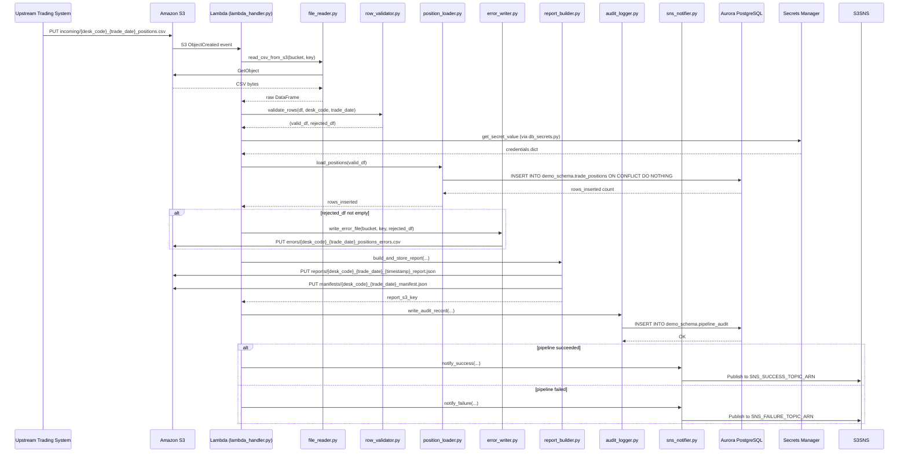
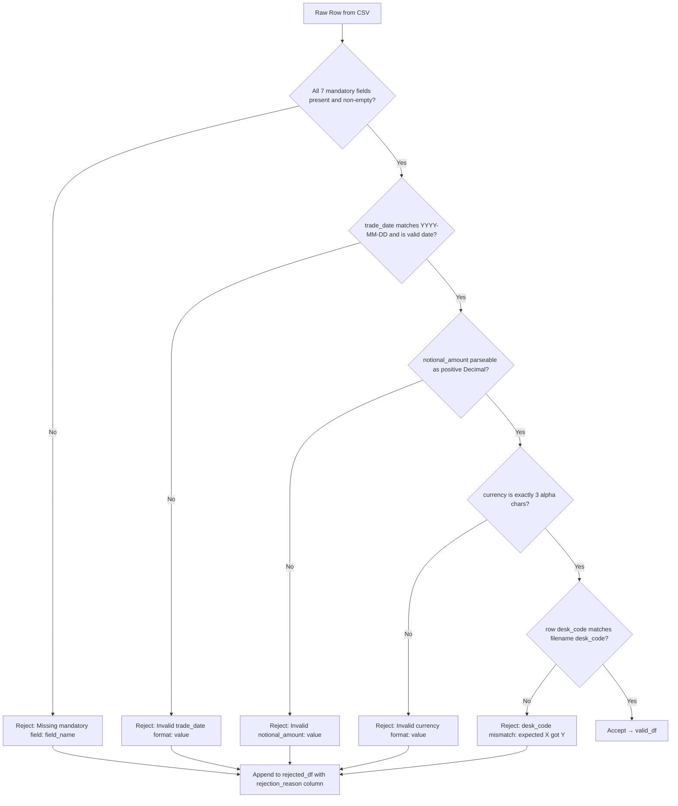
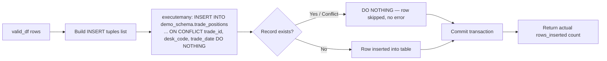
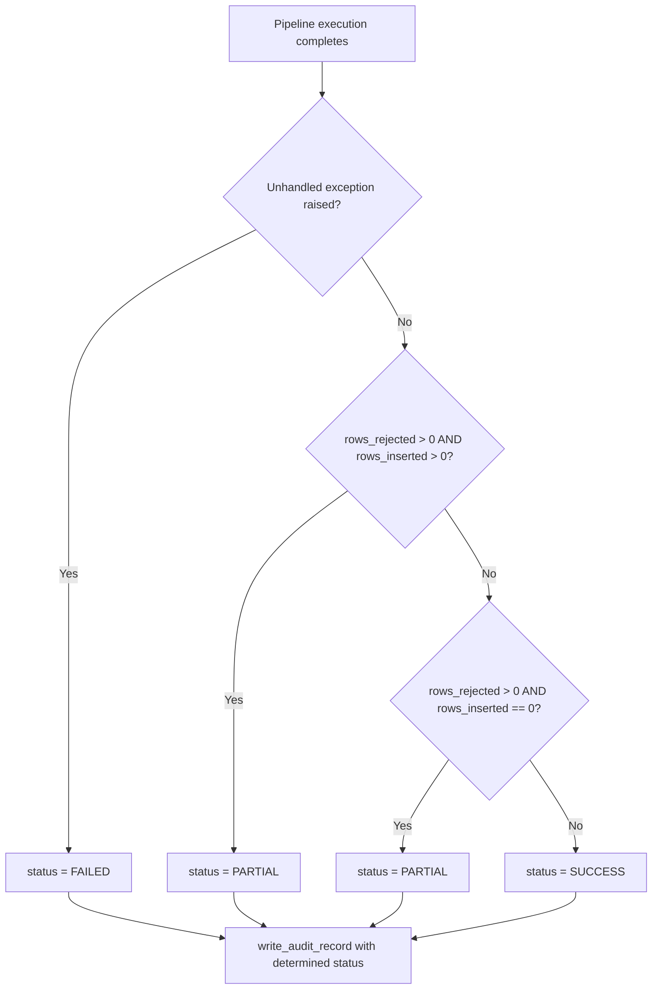

# Technical Design Document
## Daily Trade Position Ingestion — Enterprise Risk Data Platform

---

### COMPONENTS

---

#### `lambda_handler.py`
**Entry point for the AWS Lambda function. Orchestrates the full pipeline for a single file trigger.**

- **What it does:**
  - Receives an S3 event notification (JSON) from AWS Lambda runtime containing the bucket name and object key of the newly deposited file.
  - Extracts `bucket` and `key` from the S3 event record.
  - Parses `desk_code` and `trade_date` from the filename using the pattern `{desk_code}_{trade_date}_positions.csv`.
  - Calls `file_reader.read_csv_from_s3(bucket, key)` → raw DataFrame.
  - Calls `row_validator.validate_rows(df, desk_code, trade_date)` → `(valid_df, rejected_df)`.
  - Calls `position_loader.load_positions(valid_df)` → `rows_inserted: int`.
  - Calls `report_builder.build_and_store_report(bucket, key, desk_code, trade_date, raw_df, valid_df, rejected_df, rows_inserted)` → `report_s3_key: str`.
  - If `len(rejected_df) > 0`, calls `error_writer.write_error_file(bucket, key, rejected_df)` → `error_s3_key: str`.
  - Calls `audit_logger.write_audit_record(filename, desk_code, trade_date, status, total_rows, rows_inserted, rows_rejected, error_message)`.
  - Calls `sns_notifier.notify_success(...)` or `sns_notifier.notify_failure(...)` depending on pipeline outcome.
  - Catches all unhandled exceptions, writes a FAILED audit record, publishes a failure notification, and re-raises so Lambda marks the invocation as failed.
- **Reads:** S3 event dict (`Records[0].s3.bucket.name`, `Records[0].s3.object.key`).
- **Writes:** Nothing directly — delegates to sub-modules.
- **Satisfies:** BAC-1, BAC-2, BAC-3, BAC-4, BAC-5, BAC-6, BAC-7, BAC-8.

---

#### `file_reader.py`
**Reads a raw CSV file from S3 into a pandas DataFrame without type coercion.**

- **What it does:**
  - Function: `read_csv_from_s3(bucket: str, key: str) -> pd.DataFrame`
  - Uses `boto3.client("s3")` to call `get_object(Bucket=bucket, Key=key)`.
  - Reads the response body as bytes, decodes as UTF-8, and parses into a pandas DataFrame with `pd.read_csv(io.StringIO(...), dtype=str, keep_default_na=False)`.
  - All columns are read as raw strings — no type inference — to allow the validator to apply business rules.
  - Returns the raw DataFrame. Raises `ValueError` if the file is empty or cannot be parsed.
- **Reads:** S3 object at `s3://os.environ["S3_BUCKET"]/{key}`.
- **Writes:** Nothing.
- **Satisfies:** BAC-1, BAC-6.

---

#### `row_validator.py`
**Validates each row in the raw DataFrame against mandatory-field and type rules. Returns valid and rejected DataFrames.**

- **What it does:**
  - Function: `validate_rows(df: pd.DataFrame, desk_code: str, trade_date: str) -> tuple[pd.DataFrame, pd.DataFrame]`
  - Iterates over every row and applies the following checks in order, recording the first failing reason per row:
    1. **Missing mandatory fields:** `trade_id`, `desk_code`, `instrument_type`, `notional_amount`, `currency`, `counterparty_id`, `trade_date` — any field that is an empty string or not present in the row is rejected with reason `"Missing mandatory field: {field_name}"`.
    2. **trade_date format:** Must match `YYYY-MM-DD` and be a valid date. Rejected with `"Invalid trade_date format: {value}"`.
    3. **notional_amount numeric:** Must be parseable as a positive decimal (Python `Decimal`). Rejected with `"Invalid notional_amount: {value}"`.
    4. **currency format:** Must be exactly 3 alphabetic characters (ISO 4217). Rejected with `"Invalid currency format: {value}"`.
    5. **desk_code consistency:** The `desk_code` field in each row must match the `desk_code` parsed from the filename. Rejected with `"desk_code mismatch: expected {desk_code}, got {row_desk_code}"`.
  - Rows passing all checks are accumulated into `valid_df`.
  - Rows failing any check are accumulated into `rejected_df`, which includes all original columns plus an additional column `rejection_reason: str`.
  - Returns `(valid_df, rejected_df)`.
- **Reads:** Raw DataFrame from `file_reader.py`; `desk_code: str`; `trade_date: str`.
- **Writes:** Nothing to any external system.
- **Satisfies:** BAC-2.

---

#### `position_loader.py`
**Loads validated trade position rows into `demo_schema.trade_positions` with idempotent upsert logic.**

- **What it does:**
  - Function: `load_positions(valid_df: pd.DataFrame) -> int`
  - Retrieves database credentials by calling `db_secrets.get_db_credentials()`.
  - Opens a `psycopg2` connection to the Aurora PostgreSQL database.
  - For each row in `valid_df`, executes:
    ```sql
    INSERT INTO demo_schema.trade_positions
      (trade_id, desk_code, trade_date, instrument_type, notional_amount, currency, counterparty_id, loaded_at)
    VALUES (%s, %s, %s, %s, %s, %s, %s, now())
    ON CONFLICT (trade_id, desk_code, trade_date) DO NOTHING
    ```
  - Uses `executemany` with a list of tuples for performance. Commits the transaction once after all rows are inserted.
  - Returns `cursor.rowcount` (total rows actually inserted, not skipped). When using `executemany` with `DO NOTHING`, counts insertions by tracking `rowcount` per batch.
  - On any database exception, rolls back and re-raises.
- **Reads:** `valid_df` with columns: `trade_id`, `desk_code`, `trade_date`, `instrument_type`, `notional_amount`, `currency`, `counterparty_id`.
- **Writes:** Rows to `demo_schema.trade_positions`.
- **Satisfies:** BAC-1, BAC-3, BAC-6.

---

#### `report_builder.py`
**Builds the post-load summary report and writes it to S3 as a JSON file. Also writes a manifest file.**

- **What it does:**
  - Function: `build_and_store_report(bucket: str, source_key: str, desk_code: str, trade_date: str, raw_df: pd.DataFrame, valid_df: pd.DataFrame, rejected_df: pd.DataFrame, rows_inserted: int) -> str`
  - Computes the following metrics:
    - `total_rows`: `len(raw_df)`
    - `rows_loaded`: `rows_inserted`
    - `rows_rejected`: `len(rejected_df)`
    - `processing_timestamp_et`: current time in `America/Toronto` as ISO 8601 string.
    - `counts_by_desk_code`: `valid_df.groupby("desk_code").size().to_dict()`
    - `min_notional_amount`: `valid_df["notional_amount"].astype(float).min()` (or `None` if empty)
    - `max_notional_amount`: `valid_df["notional_amount"].astype(float).max()` (or `None` if empty)
    - `null_rates_per_column`: for each column in `raw_df`, `(count of empty-string or NaN values) / len(raw_df)` rounded to 4 decimal places. Returns `{}` if `raw_df` is empty.
  - Assembles these into a dict and serializes to JSON.
  - Report S3 key: `reports/{desk_code}_{trade_date}_{processing_timestamp_et_yyyymmddTHHMMSS}.json`
  - Writes the JSON to S3 using `boto3.client("s3").put_object(...)`.
  - Writes a manifest file to `manifests/{desk_code}_{trade_date}_manifest.json` containing:
    ```json
    {
      "desk_code": "<desk_code>",
      "trade_date": "<trade_date>",
      "report_s3_key": "<full report key>",
      "generated_at_et": "<ISO 8601 ET timestamp>"
    }
    ```
  - Returns the report S3 key string.
- **Reads:** DataFrames and scalars from orchestrator.
- **Writes:**
  - `s3://os.environ["S3_BUCKET"]/reports/{desk_code}_{trade_date}_{timestamp}.json`
  - `s3://os.environ["S3_BUCKET"]/manifests/{desk_code}_{trade_date}_manifest.json`
- **Satisfies:** BAC-4, BAC-7.

---

#### `error_writer.py`
**Writes rejected rows with rejection reasons to an error CSV file in S3.**

- **What it does:**
  - Function: `write_error_file(bucket: str, source_key: str, rejected_df: pd.DataFrame) -> str`
  - Serializes `rejected_df` (all original columns + `rejection_reason`) to CSV using `pandas.DataFrame.to_csv(index=False)`.
  - Derives the error key from the source key: replaces `incoming/` prefix with `errors/` and appends `_errors` before the `.csv` extension. Example: `incoming/EQTY_2026-06-01_positions.csv` → `errors/EQTY_2026-06-01_positions_errors.csv`.
  - Writes the CSV bytes to S3 via `boto3.client("s3").put_object(...)`.
  - Returns the error S3 key.
- **Reads:** `rejected_df` DataFrame with columns matching the source file plus `rejection_reason`.
- **Writes:** `s3://os.environ["S3_BUCKET"]/errors/{desk_code}_{trade_date}_positions_errors.csv`
- **Satisfies:** BAC-2.

---

#### `audit_logger.py`
**Writes a record to `demo_schema.pipeline_audit` capturing full processing outcome for regulatory traceability.**

- **What it does:**
  - Function: `write_audit_record(filename: str, desk_code: str | None, trade_date: str | None, status: str, total_rows: int, rows_inserted: int, rows_rejected: int, error_message: str | None) -> None`
  - Retrieves database credentials by calling `db_secrets.get_db_credentials()`.
  - Opens a `psycopg2` connection and executes:
    ```sql
    INSERT INTO demo_schema.pipeline_audit
      (filename, desk_code, trade_date, status, total_rows, rows_inserted,
       rows_rejected, error_message, processing_timestamp_et, created_at)
    VALUES (%s, %s, %s, %s, %s, %s, %s, %s, %s, now())
    ```
  - `processing_timestamp_et` is set to `datetime.now(pytz.timezone("America/Toronto"))`.
  - `status` must be one of: `"SUCCESS"`, `"PARTIAL"`, `"FAILED"`. `"PARTIAL"` is used when some rows were rejected but loading still completed. `"FAILED"` is used when an unhandled exception prevented loading.
  - Commits immediately. Does not share a connection with `position_loader.py`.
- **Reads:** Scalar arguments only.
- **Writes:** One row to `demo_schema.pipeline_audit`.
- **Satisfies:** BAC-7, BAC-8 (audit trail for regulatory examination).

---

#### `sns_notifier.py`
**Publishes success or failure notifications to SNS topics.**

- **What it does:**
  - Function: `notify_success(desk_code: str, trade_date: str, total_rows: int, rows_inserted: int, rows_rejected: int, report_s3_key: str, processing_timestamp_et: str) -> None`
    - Publishes to the SNS topic ARN at `os.environ["SNS_SUCCESS_TOPIC_ARN"]`.
    - Message is a JSON string (see Data Contracts § SNS).
  - Function: `notify_failure(filename: str, error_message: str, processing_timestamp_et: str) -> None`
    - Publishes to the SNS topic ARN at `os.environ["SNS_FAILURE_TOPIC_ARN"]`.
    - Message is a JSON string (see Data Contracts § SNS).
  - Both functions use `boto3.client("sns").publish(TopicArn=..., Message=..., Subject=...)`.
  - Subject for success: `"Trade Position Load Success: {desk_code} {trade_date}"`.
  - Subject for failure: `"Trade Position Load FAILED: {filename}"`.
- **Reads:** Scalar arguments.
- **Writes:** SNS messages.
- **Satisfies:** BAC-5.

---

#### `db_secrets.py`
**Retrieves and caches database credentials from AWS Secrets Manager at runtime.**

- **What it does:**
  - Function: `get_db_credentials() -> dict`
  - Reads `os.environ["DB_SECRET_ID"]` (value: `agentic-poc-aurora`) to get the secret name.
  - Calls `boto3.client("secretsmanager").get_secret_value(SecretId=secret_id)`.
  - Parses the `SecretString` JSON and returns a dict with keys: `host`, `port`, `dbname`, `username`, `password`.
  - Caches the result in a module-level variable after the first call — does not re-fetch on subsequent calls within the same Lambda execution context.
  - Raises `RuntimeError` with a safe message (no secret values exposed) if retrieval fails.
- **Reads:** `os.environ["DB_SECRET_ID"]`.
- **Writes:** Nothing.
- **Satisfies:** BAC-8.

---

### AWS SERVICES

| Service | Role |
|---|---|
| **AWS Lambda** | Compute runtime. The function `agentic-poc-sandbox-qa` is triggered by S3 `ObjectCreated` events on the `incoming/` prefix of the S3 bucket. Executes the full pipeline per file. |
| **Amazon S3** | Durable file storage. Stores incoming position files (`incoming/`), error files (`errors/`), summary reports (`reports/`), and manifest files (`manifests/`). Bucket: `agentic-poc-533266968934`. |
| **Amazon Aurora PostgreSQL** | Reporting database. Hosts `demo_schema.trade_positions` (position records) and `demo_schema.pipeline_audit` (audit trail). Secret ID: `agentic-poc-aurora`. |
| **AWS Secrets Manager** | Runtime credential store. Provides database connection credentials. Secret ID: `agentic-poc-aurora`. No credentials stored in code. |
| **Amazon SNS** | Downstream notification. Two topics: success (`agentic-poc-success`) and failure (`agentic-poc-failure`). Notifies the risk calculation pipeline and operations team. |

---

### DATA CONTRACTS

#### Database Tables

##### `demo_schema.trade_positions`

| Column | Type | Nullable | Constraints |
|---|---|---|---|
| `trade_id` | `VARCHAR(100)` | NOT NULL | Part of PK |
| `desk_code` | `VARCHAR(50)` | NOT NULL | Part of PK |
| `trade_date` | `DATE` | NOT NULL | Part of PK |
| `instrument_type` | `VARCHAR(100)` | NOT NULL | |
| `notional_amount` | `NUMERIC(20,4)` | NOT NULL | |
| `currency` | `CHAR(3)` | NOT NULL | |
| `counterparty_id` | `VARCHAR(100)` | NOT NULL | |
| `loaded_at` | `TIMESTAMPTZ` | NOT NULL | Default: `now()` |

- **Primary Key:** `(trade_id, desk_code, trade_date)`
- **Deduplication:** The primary key is the conflict target for `ON CONFLICT (trade_id, desk_code, trade_date) DO NOTHING`.

##### `demo_schema.pipeline_audit`

| Column | Type | Nullable | Constraints |
|---|---|---|---|
| `audit_id` | `BIGSERIAL` | NOT NULL | PK, auto-increment |
| `filename` | `VARCHAR(255)` | NOT NULL | |
| `desk_code` | `VARCHAR(50)` | NULL | |
| `trade_date` | `DATE` | NULL | |
| `status` | `VARCHAR(20)` | NOT NULL | One of: `SUCCESS`, `PARTIAL`, `FAILED` |
| `total_rows` | `INTEGER` | NOT NULL | Default: `0` |
| `rows_inserted` | `INTEGER` | NOT NULL | Default: `0` |
| `rows_rejected` | `INTEGER` | NOT NULL | Default: `0` |
| `error_message` | `TEXT` | NULL | |
| `processing_timestamp_et` | `TIMESTAMPTZ` | NOT NULL | Set to current ET time at write time |
| `created_at` | `TIMESTAMPTZ` | NOT NULL | Default: `now()` |

- **Primary Key:** `(audit_id)`

---

#### S3 Paths

| Path Pattern | Format | Description |
|---|---|---|
| `incoming/{desk_code}_{trade_date}_positions.csv` | CSV, UTF-8 | Input file deposited by upstream trading systems. Header row required. |
| `errors/{desk_code}_{trade_date}_positions_errors.csv` | CSV, UTF-8 | Rejected rows with `rejection_reason` appended as last column. |
| `reports/{desk_code}_{trade_date}_{yyyymmddTHHMMSS}_report.json` | JSON | Summary report for downstream systems. |
| `manifests/{desk_code}_{trade_date}_manifest.json` | JSON | Predictable-key pointer to the timestamped report file. |

**Input CSV columns (header row):**
`trade_id`, `desk_code`, `trade_date`, `instrument_type`, `notional_amount`, `currency`, `counterparty_id`

**Error CSV columns:**
`trade_id`, `desk_code`, `trade_date`, `instrument_type`, `notional_amount`, `currency`, `counterparty_id`, `rejection_reason`

**Report JSON structure:**
```json
{
  "filename": "EQTY_2026-06-01_positions.csv",
  "desk_code": "EQTY",
  "trade_date": "2026-06-01",
  "total_rows": 1000,
  "rows_loaded": 980,
  "rows_rejected": 20,
  "processing_timestamp_et": "2026-06-01T19:45:33-04:00",
  "counts_by_desk_code": {"EQTY": 980},
  "min_notional_amount": 1000.0,
  "max_notional_amount": 9500000.0,
  "null_rates_per_column": {
    "trade_id": 0.0,
    "desk_code": 0.0,
    "trade_date": 0.0,
    "instrument_type": 0.02,
    "notional_amount": 0.0,
    "currency": 0.0,
    "counterparty_id": 0.0
  }
}
```

**Manifest JSON structure:**
```json
{
  "desk_code": "EQTY",
  "trade_date": "2026-06-01",
  "report_s3_key": "reports/EQTY_2026-06-01_20260601T194533_report.json",
  "generated_at_et": "2026-06-01T19:45:33-04:00"
}
```

---

#### Secrets Manager

**Environment variable:** `os.environ["DB_SECRET_ID"]` = `agentic-poc-aurora`

**Expected JSON keys inside the secret:**
```json
{
  "host": "<aurora-cluster-endpoint>",
  "port": 5432,
  "dbname": "app",
  "username": "<db-user>",
  "password": "<db-password>"
}
```

---

#### SNS Topics

**Success Topic:**
- **Env var:** `os.environ["SNS_SUCCESS_TOPIC_ARN"]` = `arn:aws:sns:us-east-1:533266968934:agentic-poc-success`
- **Message format (JSON string):**
```json
{
  "event": "TRADE_POSITION_LOAD_SUCCESS",
  "desk_code": "EQTY",
  "trade_date": "2026-06-01",
  "total_rows": 1000,
  "rows_inserted": 980,
  "rows_rejected": 20,
  "report_s3_key": "reports/EQTY_2026-06-01_20260601T194533_report.json",
  "manifest_s3_key": "manifests/EQTY_2026-06-01_manifest.json",
  "processing_timestamp_et": "2026-06-01T19:45:33-04:00"
}
```

**Failure Topic:**
- **Env var:** `os.environ["SNS_FAILURE_TOPIC_ARN"]` = `arn:aws:sns:us-east-1:533266968934:agentic-poc-failure`
- **Message format (JSON string):**
```json
{
  "event": "TRADE_POSITION_LOAD_FAILED",
  "filename": "EQTY_2026-06-01_positions.csv",
  "error_message": "<exception description — no stack trace, no credentials>",
  "processing_timestamp_et": "2026-06-01T19:45:33-04:00"
}
```

---

#### Environment Variables Summary

| Variable | Value Source | Used By |
|---|---|---|
| `S3_BUCKET` | Deployment config | `file_reader.py`, `error_writer.py`, `report_builder.py` |
| `DB_SECRET_ID` | Deployment config (`agentic-poc-aurora`) | `db_secrets.py` |
| `SNS_SUCCESS_TOPIC_ARN` | Deployment config | `sns_notifier.py` |
| `SNS_FAILURE_TOPIC_ARN` | Deployment config | `sns_notifier.py` |

---

### DATA FLOW

#### End-to-End Pipeline Flow



---

#### Validation Decision Logic



---

#### Idempotent Load Logic



---

#### Status Determination Logic



---

### TECHNICAL ACCEPTANCE CRITERIA

**TAC-1 — Valid positions available before morning risk run (BAC-1)**
- `position_loader.load_positions()` executes `INSERT INTO demo_schema.trade_positions (...) ON CONFLICT (...) DO NOTHING` and commits within the same Lambda invocation.
- Acceptance test: after `load_positions(valid_df)` returns, a `SELECT COUNT(*) FROM demo_schema.trade_positions WHERE desk_code = %s AND trade_date = %s` must return a count equal to `rows_inserted`.
- Lambda timeout must be set ≥ 60 seconds to satisfy the 10,000-row requirement (see TAC-6).

**TAC-2 — Rejected rows have specific reasons (BAC-2)**
- `row_validator.validate_rows()` appends a `rejection_reason` string column to every rejected row. The reason is one of: `"Missing mandatory field: {field_name}"`, `"Invalid trade_date format: {value}"`, `"Invalid notional_amount: {value}"`, `"Invalid currency format: {value}"`, `"desk_code mismatch: expected {x}, got {y}"`.
- `error_writer.write_error_file()` writes the full `rejected_df` (all original columns + `rejection_reason`) to `s3://S3_BUCKET/errors/{desk_code}_{trade_date}_positions_errors.csv`.
- Acceptance test: submit a file with one row missing `trade_id` and one row with `notional_amount = "abc"`. Assert the error CSV contains exactly 2 rows with the correct `rejection_reason` values.

**TAC-3 — Reprocessing does not duplicate records (BAC-3)**
- `position_loader.load_positions()` uses `ON CONFLICT (trade_id, desk_code, trade_date) DO NOTHING`.
- Acceptance test: load the same `valid_df` twice in sequence. After the first call, record `count_1 = SELECT COUNT(*) FROM demo_schema.trade_positions`. After the second call, `count_2` must equal `count_1`. The second call must return `rows_inserted = 0`.

**TAC-4 — Summary report accurately reflects processing outcome (BAC-4)**
- `report_builder.build_and_store_report()` computes `total_rows = len(raw_df)`, `rows_loaded = rows_inserted`, `rows_rejected = len(rejected_df)`. The invariant `total_rows == rows_loaded + rows_rejected + (rows_in_file_already_in_db)` must hold. The report JSON is written to `reports/` and the manifest is written to `manifests/`.
- Acceptance test: process a file with 100 rows (90 valid, 10 invalid). Assert the report JSON contains `total_rows=100`, `rows_loaded=90`, `rows_rejected=10`.
- `null_rates_per_column` must equal `(empty-string count + NaN count) / total_rows` for each column, rounded to 4 decimal places.
- `counts_by_desk_code` must match the groupby result of `valid_df["desk_code"].value_counts()`.

**TAC-5 — Downstream pipeline notified without manual trigger (BAC-5)**
- `sns_notifier.notify_success()` is called unconditionally at the end of a successful pipeline run (status = `SUCCESS` or `PARTIAL`).
- `sns_notifier.notify_failure()` is called when an unhandled exception is caught in `lambda_handler.py`.
- Acceptance test (success): mock `boto3.client("sns").publish`, run pipeline with valid file, assert `publish` was called once with `TopicArn = os.environ["SNS_SUCCESS_TOPIC_ARN"]` and message body parses as valid JSON containing `"event": "TRADE_POSITION_LOAD_SUCCESS"`.
- Acceptance test (failure): force an exception in `position_loader`, assert `publish` was called once with `TopicArn = os.environ["SNS_FAILURE_TOPIC_ARN"]` and message body contains `"event": "TRADE_POSITION_LOAD_FAILED"`.

**TAC-6 — Processing completes within operations window (BAC-6)**
- Acceptance test: generate a synthetic CSV with 10,000 rows meeting all validation rules. Invoke the pipeline. Total wall-clock time from `lambda_handler.lambda_handler(event, context)` call to return must be ≤ 60 seconds.
- `position_loader.py` uses `executemany` (not row-by-row execute) to meet the performance requirement.

**TAC-7 — All timestamps in Eastern Time (BAC-7)**
- `audit_logger.write_audit_record()` sets `processing_timestamp_et` using `datetime.now(pytz.timezone("America/Toronto"))`.
- `report_builder.build_and_store_report()` sets `processing_timestamp_et` using `datetime.now(pytz.timezone("America/Toronto"))`.
- `sns_notifier` includes `processing_timestamp_et` in all messages, also set to ET.
- Acceptance test: assert that all `processing_timestamp_et` values in the report JSON, the audit table row, and SNS message bodies have timezone offset `-04:00` (EDT) or `-05:00` (EST), never `+00:00`.

**TAC-8 — No credentials in code or config (BAC-8)**
- `db_secrets.get_db_credentials()` is the sole function that reads credentials. It calls `secretsmanager.get_secret_value(SecretId=os.environ["DB_SECRET_ID"])`. No password, username, host, or port appears as a string literal anywhere in the codebase.
- Acceptance test (static analysis): `grep -r "password\|secret\|token\|credential" *.py` must return zero lines containing string literals (i.e., no quoted credential values). CI pipeline enforces this check.
- Acceptance test (runtime): `db_secrets.get_db_credentials()` with a mocked Secrets Manager must return a dict with all five keys (`host`, `port`, `dbname`, `username`, `password`) populated from the mocked secret JSON.

---

### OPEN QUESTIONS

None. All infrastructure is defined in the infrastructure config YAML. All business logic rules are specified in the BRD with sufficient precision to implement without further clarification.

---

### ASSUMPTIONS

1. **Lambda trigger:** The Lambda function `agentic-poc-sandbox-qa` is already configured with an S3 `ObjectCreated` event notification on the `incoming/` prefix of bucket `agentic-poc-533266968934`. This is existing infrastructure — the code does not configure the trigger.

2. **Database schema pre-exists:** Tables `demo_schema.trade_positions` and `demo_schema.pipeline_audit` are already created in the Aurora database with the schemas defined in the infrastructure config. The application does not run DDL.

3. **Network connectivity:** The Lambda function has VPC configuration (or VPC endpoint) allowing it to reach the Aurora cluster and Secrets Manager. This is pre-configured infrastructure.

4. **Input file encoding:** Upstream files are always UTF-8 encoded. No BOM handling is required unless a future file fails to parse.

5. **CSV header row:** Every incoming file contains a header row with the exact column names: `trade_id`, `desk_code`, `trade_date`, `instrument_type`, `notional_amount`, `currency`, `counterparty_id`. Files without a header are treated as malformed and result in a `FAILED` audit record.

6. **notional_amount must be positive:** The BRD requires it to be "numeric" but does not explicitly state sign. This design assumes `notional_amount > 0` based on the context of trade positions. Zero or negative values are rejected.

7. **One file per Lambda invocation:** The S3 event contains exactly one record (one file). Batch S3 events with multiple records are not expected. If multiple records arrive, only `Records[0]` is processed (logged as a warning).

8. **Status = PARTIAL when any rows are rejected:** If a file has both valid and rejected rows, the audit record status is `PARTIAL`, not `SUCCESS`. A `SUCCESS` status means zero rejected rows and at least one row loaded (or all rows were already present — deduped).

9. **SUCCESS with all-deduped file:** If all rows in a resubmitted file are deduplicated (`rows_inserted = 0`, `rows_rejected = 0`), the status is `SUCCESS` (not `FAILED`) because the file was processed correctly — the data is already in the database.

10. **psycopg2 Lambda layer:** The `psycopg2-binary` (or `psycopg2` with Lambda layer) package is available in the Lambda execution environment. This is a deployment concern, not a code concern.

11. **pytz available:** The `pytz` package is available in the Lambda execution environment.

12. **Manifest overwrites on reprocessing:** If the same `{desk_code}_{trade_date}` is reprocessed, the manifest file at `manifests/{desk_code}_{trade_date}_manifest.json` is overwritten to point to the latest report. Previous report files (with their timestamps in the key) remain in S3 but the manifest always reflects the most recent run.

13. **Error file overwrites on reprocessing:** The error file at `errors/{desk_code}_{trade_date}_positions_errors.csv` is overwritten on each run. It reflects the errors from the most recent processing of that desk/date combination.

14. **Lambda timeout:** The Lambda timeout is set to at least 120 seconds (2× the 60-second business requirement) to provide margin for cold starts and network latency. This is a deployment concern.