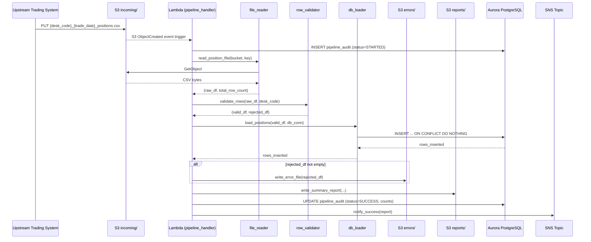
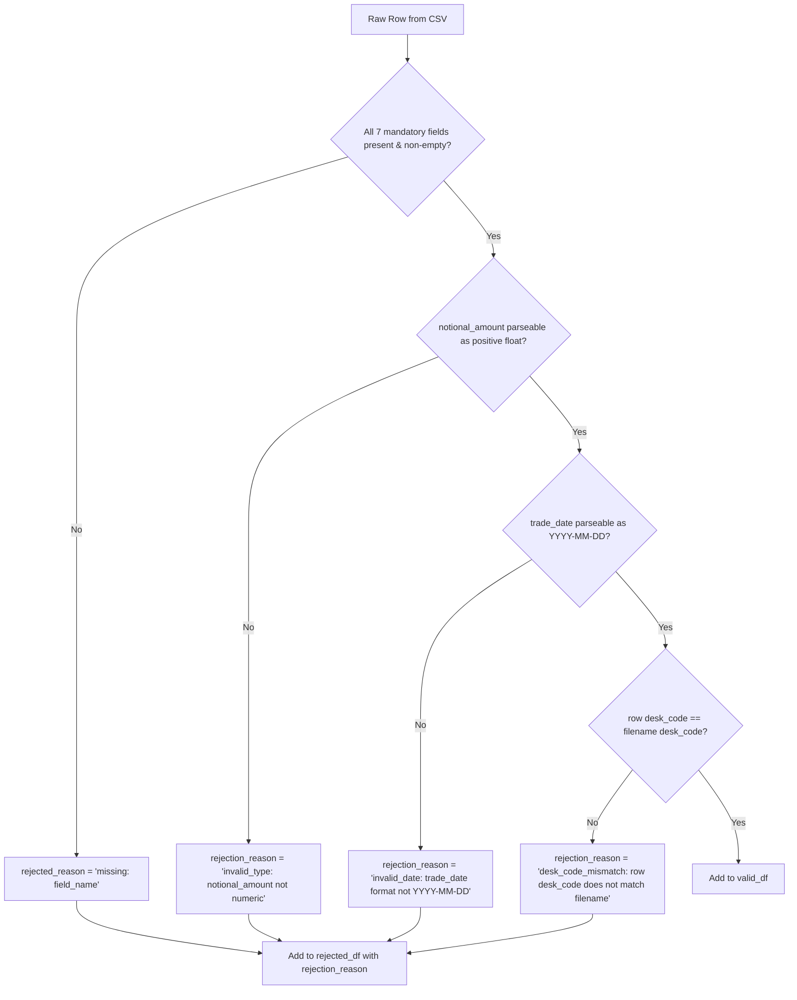
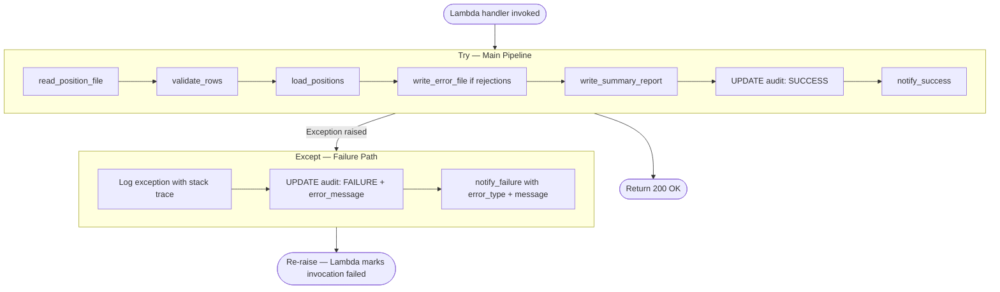

# Technical Design Document

## Daily Trade Position Ingestion — Enterprise Risk Data Platform

**Repo:** nartcr/agentic-poc-sandbox
**Change Type:** New Feature
**Date:** June 2026
**Status:** Draft

---

## COMPONENTS

### `pipeline_handler.py` — Lambda Entry Point & Orchestrator

**What it does:**
Top-level Lambda handler function. Receives an S3 event trigger (object created under `incoming/` prefix), extracts the S3 key and bucket name, validates the filename matches the pattern `{desk_code}_{trade_date}_positions.csv`, then orchestrates the full pipeline by calling each downstream module in sequence: file reader → validator → DB loader → report writer → notifier. Captures all unhandled exceptions and routes them to the failure notification path. Writes one row to `demo_schema.pipeline_audit` at the start and updates it on completion. Returns a structured dict with `statusCode` and `body`.

**Entry point signature:**
```
def handler(event: dict, context: object) -> dict
```

**Reads:**
- S3 event payload: `event["Records"][0]["s3"]["bucket"]["name"]`, `event["Records"][0]["s3"]["object"]["key"]`
- Filename parsed fields: `desk_code` (str), `trade_date` (str, format `YYYY-MM-DD`)

**Writes:**
- Calls `db_audit_writer.start_audit_record()` → inserts into `demo_schema.pipeline_audit`
- Calls `db_audit_writer.complete_audit_record()` → updates `demo_schema.pipeline_audit`

**Satisfies:** BAC-1, BAC-5, BAC-6, BAC-7, BAC-8

---

### `file_reader.py` — S3 CSV File Reader

**What it does:**
Downloads the CSV file from S3 using `boto3.client("s3")`, reads it into a `pandas.DataFrame`, preserves all original column names, and returns the raw DataFrame plus the total row count. Raises a typed `FileReadError` if the file is missing, empty, or cannot be parsed as CSV.

**Signature:**
```
def read_position_file(bucket: str, key: str) -> tuple[pd.DataFrame, int]:
```

**Reads:**
- S3 object at `os.environ["S3_BUCKET"]` / key (key is under `incoming/` prefix)
- CSV with expected columns: `trade_id`, `desk_code`, `trade_date`, `instrument_type`, `notional_amount`, `currency`, `counterparty_id` (plus any extra columns, which are carried through but not validated)

**Writes:**
- Returns `(raw_df: pd.DataFrame, total_row_count: int)` — no side effects

**Satisfies:** BAC-1, BAC-4

---

### `row_validator.py` — Per-Row Data Validation

**What it does:**
Accepts the raw DataFrame. Applies the following validation rules to each row:

1. **Presence check:** All seven mandatory fields (`trade_id`, `desk_code`, `trade_date`, `instrument_type`, `notional_amount`, `currency`, `counterparty_id`) must be non-null and non-empty string.
2. **Type check:** `notional_amount` must be parseable as a positive float.
3. **Date check:** `trade_date` must be parseable as a date in `YYYY-MM-DD` format.
4. **Consistency check:** `desk_code` in each row must match the `desk_code` parsed from the filename.

Rows that pass all checks are collected into `valid_df`. Rows that fail are collected into `rejected_df` with an additional column `rejection_reason` (string describing the first failing rule: e.g., `"missing: notional_amount"`, `"invalid_type: notional_amount not numeric"`, `"invalid_date: trade_date format not YYYY-MM-DD"`, `"desk_code_mismatch: row desk_code does not match filename"`).

**Signature:**
```
def validate_rows(
    raw_df: pd.DataFrame,
    filename_desk_code: str
) -> tuple[pd.DataFrame, pd.DataFrame]:
    # returns (valid_df, rejected_df)
```

**Reads:** `raw_df` columns: `trade_id`, `desk_code`, `trade_date`, `instrument_type`, `notional_amount`, `currency`, `counterparty_id`

**Writes:**
- `valid_df`: same schema as input (all original columns), rows that passed validation
- `rejected_df`: same schema as input + column `rejection_reason: str`

**Satisfies:** BAC-2, BAC-4

---

### `db_loader.py` — Idempotent Database Writer

**What it does:**
Accepts `valid_df` and the resolved DB connection (from `secret_manager_client.get_db_credentials()`). Executes a bulk `INSERT INTO demo_schema.trade_positions (...) VALUES ... ON CONFLICT (trade_id, desk_code, trade_date) DO NOTHING`. Uses `psycopg2` with `execute_values` for batch insert performance. Returns `rows_inserted: int` (actual rows inserted, not attempted — derived from `cursor.rowcount` or comparison of pre/post counts).

**Signature:**
```
def load_positions(
    valid_df: pd.DataFrame,
    db_conn: psycopg2.extensions.connection
) -> int:
```

**Reads:**
- `valid_df` columns: `trade_id`, `desk_code`, `trade_date`, `instrument_type`, `notional_amount`, `currency`, `counterparty_id`
- DB connection with credentials from Secrets Manager

**Writes:**
- `INSERT INTO demo_schema.trade_positions (trade_id, desk_code, trade_date, instrument_type, notional_amount, currency, counterparty_id, loaded_at) VALUES (...) ON CONFLICT (trade_id, desk_code, trade_date) DO NOTHING`
- `loaded_at` is set to `datetime.now(pytz.timezone("America/Toronto"))`

**Satisfies:** BAC-1, BAC-3

---

### `error_file_writer.py` — Rejected Row Error File Writer

**What it does:**
Accepts `rejected_df` (the DataFrame from `row_validator.py` including the `rejection_reason` column), the original filename (to derive the error filename), and writes the rejected rows as a CSV to S3 under the `errors/` prefix. The output filename pattern is `errors/{desk_code}_{trade_date}_positions_errors.csv`. If `rejected_df` is empty, no file is written (no side effects). Returns the S3 key written (or `None` if nothing written).

**Signature:**
```
def write_error_file(
    rejected_df: pd.DataFrame,
    desk_code: str,
    trade_date: str,
    bucket: str
) -> str | None:
```

**Reads:** `rejected_df` — all original input columns plus `rejection_reason`

**Writes:**
- S3: `s3://{bucket}/errors/{desk_code}_{trade_date}_positions_errors.csv`
- CSV columns: all original input columns + `rejection_reason`

**Satisfies:** BAC-2

---

### `report_writer.py` — Post-Load Summary Report Producer

**What it does:**
Computes the summary statistics from the processing results and writes a JSON report to S3 under the `reports/` prefix. The report filename pattern is `reports/{desk_code}_{trade_date}_positions_report.json`.

**Computed fields:**
- `total_rows_received: int`
- `rows_successfully_loaded: int`
- `rows_rejected: int`
- `processing_timestamp: str` — ISO-8601 in Eastern Time (`America/Toronto`)
- `desk_code: str`
- `trade_date: str`
- `source_file_key: str`
- `rows_by_desk_code: dict[str, int]` — count of valid rows grouped by `desk_code` value
- `min_notional_amount: float`
- `max_notional_amount: float`
- `null_rates: dict[str, float]` — per mandatory column: `null_count / total_rows_received`, keys are the 7 mandatory field names

**Signature:**
```
def write_summary_report(
    total_rows: int,
    rows_loaded: int,
    rejected_df: pd.DataFrame,
    valid_df: pd.DataFrame,
    desk_code: str,
    trade_date: str,
    source_file_key: str,
    bucket: str
) -> dict:
    # returns the report dict (also written to S3)
```

**Reads:** `valid_df`, `rejected_df`, scalar counts, `desk_code`, `trade_date`, `source_file_key`

**Writes:**
- S3: `s3://{bucket}/reports/{desk_code}_{trade_date}_positions_report.json`
- Returns the report `dict` for downstream use by notifier

**Satisfies:** BAC-4, BAC-7

---

### `sns_notifier.py` — SNS Notification Publisher

**What it does:**
Publishes one SNS message per processed file. On success, publishes to the topic ARN from `os.environ["SNS_TOPIC_ARN"]` with message type `"SUCCESS"` and the full summary report dict as payload. On pipeline failure, publishes message type `"FAILURE"` with an `error_details` dict containing `error_type`, `error_message`, `source_file_key`, and `processing_timestamp` (ET).

**Signatures:**
```
def notify_success(report: dict) -> None:
def notify_failure(
    error_type: str,
    error_message: str,
    source_file_key: str
) -> None:
```

**Reads:** Report dict (from `report_writer.py`) or error details

**Writes:**
- SNS message to `os.environ["SNS_TOPIC_ARN"]`
- Message JSON structure defined in DATA CONTRACTS

**Satisfies:** BAC-5

---

### `secret_manager_client.py` — Secrets Manager Credential Fetcher

**What it does:**
Fetches the DB credentials JSON from AWS Secrets Manager at runtime using `boto3.client("secretsmanager")`. Parses the JSON and returns a `psycopg2` connection object. Uses the secret ID from `os.environ["DB_SECRET_ID"]`. Raises `CredentialFetchError` on any boto3 or JSON parse failure. The connection is opened once per Lambda invocation and passed down to `db_loader.py` and `db_audit_writer.py`.

**Signature:**
```
def get_db_connection() -> psycopg2.extensions.connection:
```

**Reads:**
- `os.environ["DB_SECRET_ID"]` — Secrets Manager secret ID
- Secret JSON keys: `username`, `password`, `host`, `port`, `dbname`

**Writes:** Returns an open `psycopg2` connection — no side effects

**Satisfies:** BAC-8

---

### `db_audit_writer.py` — Pipeline Audit Trail Writer

**What it does:**
Writes and updates rows in `demo_schema.pipeline_audit`. Called twice per file: once at pipeline start (INSERT with `status = "STARTED"`) and once at pipeline end (UPDATE with final `status`, row counts, and `completed_at` timestamp).

**Signatures:**
```
def start_audit_record(
    db_conn: psycopg2.extensions.connection,
    source_file_key: str,
    desk_code: str,
    trade_date: str,
    service_identity: str
) -> int:
    # returns audit_id (serial PK) for subsequent update

def complete_audit_record(
    db_conn: psycopg2.extensions.connection,
    audit_id: int,
    status: str,           # "SUCCESS" | "FAILURE"
    total_rows: int,
    rows_loaded: int,
    rows_rejected: int,
    error_message: str | None
) -> None:
```

**Reads:** DB connection, processing result scalars

**Writes:**
- INSERT / UPDATE `demo_schema.pipeline_audit`

**Satisfies:** BAC-7 (ET timestamps), BAC-8 (audit trail for regulatory readiness)

---

## AWS SERVICES

| Service | Role |
|---|---|
| **AWS Lambda** | Compute runtime for the ingestion pipeline. Function `agentic-poc-sandbox-qa` is triggered by S3 `ObjectCreated` events on the `incoming/` prefix. |
| **Amazon S3** | Durable storage for (1) incoming position CSV files (`incoming/` prefix), (2) rejected-row error files (`errors/` prefix), (3) summary JSON reports (`reports/` prefix). Bucket: `agentic-poc-data-533266968934`. |
| **Amazon RDS / Aurora (PostgreSQL)** | Reporting database. Hosts `demo_schema.trade_positions` and `demo_schema.pipeline_audit`. Credentials managed by Secrets Manager. |
| **AWS Secrets Manager** | Stores DB credentials. Secret ID: `agentic-poc-aurora`. Retrieved at runtime; no credentials in code. |
| **Amazon SNS** | Publishes success and failure notifications to downstream subscribers (risk calculation pipeline). One topic, ARN referenced via `os.environ["SNS_TOPIC_ARN"]`. |
| **Amazon CloudWatch Logs** | All `logging` module output from the Lambda function streams here automatically. Used for operational monitoring and audit. |

---

## DATA CONTRACTS

### Database Tables

#### `demo_schema.trade_positions`

| Column | Data Type | Constraints |
|---|---|---|
| `id` | `BIGSERIAL` | PRIMARY KEY |
| `trade_id` | `VARCHAR(100)` | NOT NULL |
| `desk_code` | `VARCHAR(50)` | NOT NULL |
| `trade_date` | `DATE` | NOT NULL |
| `instrument_type` | `VARCHAR(100)` | NOT NULL |
| `notional_amount` | `NUMERIC(20, 4)` | NOT NULL |
| `currency` | `VARCHAR(10)` | NOT NULL |
| `counterparty_id` | `VARCHAR(100)` | NOT NULL |
| `loaded_at` | `TIMESTAMPTZ` | NOT NULL, set at insert time (ET) |
| `source_file_key` | `VARCHAR(500)` | NOT NULL — S3 key of the originating file |

**Unique constraint (deduplication key):** `UNIQUE (trade_id, desk_code, trade_date)`

**Indexes:**
- `idx_trade_positions_desk_date` on `(desk_code, trade_date)`
- `idx_trade_positions_trade_date` on `(trade_date)`

---

#### `demo_schema.pipeline_audit`

| Column | Data Type | Constraints |
|---|---|---|
| `id` | `BIGSERIAL` | PRIMARY KEY |
| `source_file_key` | `VARCHAR(500)` | NOT NULL |
| `desk_code` | `VARCHAR(50)` | NOT NULL |
| `trade_date` | `DATE` | NOT NULL |
| `status` | `VARCHAR(20)` | NOT NULL — `'STARTED'`, `'SUCCESS'`, `'FAILURE'` |
| `total_rows` | `INTEGER` | NULLABLE — populated on completion |
| `rows_loaded` | `INTEGER` | NULLABLE — populated on completion |
| `rows_rejected` | `INTEGER` | NULLABLE — populated on completion |
| `error_message` | `TEXT` | NULLABLE — populated on failure |
| `service_identity` | `VARCHAR(200)` | NOT NULL — Lambda function name + request ID |
| `started_at` | `TIMESTAMPTZ` | NOT NULL — ET timestamp at pipeline start |
| `completed_at` | `TIMESTAMPTZ` | NULLABLE — ET timestamp at pipeline end |

**Index:** `idx_pipeline_audit_file_key` on `(source_file_key)`

---

### S3 Paths

| Purpose | Key Pattern | Format | Content |
|---|---|---|---|
| Input files | `incoming/{desk_code}_{trade_date}_positions.csv` | CSV, header row required | Columns: `trade_id`, `desk_code`, `trade_date`, `instrument_type`, `notional_amount`, `currency`, `counterparty_id` |
| Error files | `errors/{desk_code}_{trade_date}_positions_errors.csv` | CSV, header row | All input columns + `rejection_reason` |
| Summary reports | `reports/{desk_code}_{trade_date}_positions_report.json` | JSON | Report schema defined in SNS section below |

**Environment variable:** `S3_BUCKET = os.environ["S3_BUCKET"]` → value: `agentic-poc-data-533266968934`

---

### Secrets Manager

**Environment variable:** `DB_SECRET_ID = os.environ["DB_SECRET_ID"]` → value: `agentic-poc-aurora`

Expected JSON keys inside the secret:

```json
{
  "username": "<db username>",
  "password": "<db password>",
  "host":     "<aurora cluster endpoint>",
  "port":     5432,
  "dbname":   "app"
}
```

---

### SNS Message Formats

**Environment variable:** `SNS_TOPIC_ARN = os.environ["SNS_TOPIC_ARN"]`

**Success message:**
```json
{
  "message_type": "SUCCESS",
  "source_file_key": "incoming/DESK1_2026-06-01_positions.csv",
  "desk_code": "DESK1",
  "trade_date": "2026-06-01",
  "processing_timestamp": "2026-06-01T19:45:00-04:00",
  "total_rows_received": 5000,
  "rows_successfully_loaded": 4980,
  "rows_rejected": 20,
  "rows_by_desk_code": {"DESK1": 4980},
  "min_notional_amount": 10000.00,
  "max_notional_amount": 50000000.00,
  "null_rates": {
    "trade_id": 0.0,
    "desk_code": 0.0,
    "trade_date": 0.0,
    "instrument_type": 0.0,
    "notional_amount": 0.004,
    "currency": 0.0,
    "counterparty_id": 0.0
  },
  "report_s3_key": "reports/DESK1_2026-06-01_positions_report.json"
}
```

**Failure message:**
```json
{
  "message_type": "FAILURE",
  "source_file_key": "incoming/DESK1_2026-06-01_positions.csv",
  "processing_timestamp": "2026-06-01T19:46:00-04:00",
  "error_type": "FileReadError",
  "error_message": "CSV parse failed: expected 7 columns, found 3 on row 42"
}
```

---

## DATA FLOW

### End-to-End Pipeline Flow



---

### Validation Decision Logic



---

### Idempotent Load Logic (Pseudocode)

```
ALGORITHM: load_positions(valid_df, db_conn)

1. Serialize valid_df rows into list of tuples:
   (trade_id, desk_code, trade_date, instrument_type,
    notional_amount, currency, counterparty_id, loaded_at, source_file_key)
   where loaded_at = datetime.now(pytz.timezone("America/Toronto"))

2. Execute using psycopg2.extras.execute_values:
   INSERT INTO demo_schema.trade_positions
     (trade_id, desk_code, trade_date, instrument_type,
      notional_amount, currency, counterparty_id, loaded_at, source_file_key)
   VALUES %s
   ON CONFLICT (trade_id, desk_code, trade_date) DO NOTHING

3. rows_inserted = cursor.rowcount  (rows actually written, skips counted as 0)

4. db_conn.commit()

5. RETURN rows_inserted
```

---

### Error Handling Flow



---

## TECHNICAL ACCEPTANCE CRITERIA

**TAC-1 (from BAC-1): All valid positions are loaded before next morning's risk run.**
- `db_loader.load_positions()` executes `INSERT INTO demo_schema.trade_positions ... ON CONFLICT (trade_id, desk_code, trade_date) DO NOTHING` within the Lambda invocation.
- Acceptance test: after `load_positions()` completes, `SELECT COUNT(*) FROM demo_schema.trade_positions WHERE desk_code = :desk_code AND trade_date = :trade_date` equals `rows_inserted` plus any pre-existing rows for that key combination.
- Performance gate: a 10,000-row file must complete the full pipeline (read → validate → insert → report → notify) in under 60 seconds; test verifiable by timing Lambda execution duration in CloudWatch.

---

**TAC-2 (from BAC-2): Invalid records flagged with clear reasons.**
- `row_validator.validate_rows()` assigns one of the following exact string prefixes to `rejection_reason`: `"missing: "`, `"invalid_type: "`, `"invalid_date: "`, `"desk_code_mismatch: "`.
- `error_file_writer.write_error_file()` writes a CSV to `s3://{S3_BUCKET}/errors/{desk_code}_{trade_date}_positions_errors.csv` containing the rejected rows and their `rejection_reason` column.
- Acceptance test: inject a row with null `notional_amount` — verify the error file exists in S3, contains that row, and `rejection_reason` starts with `"missing: notional_amount"`.

---

**TAC-3 (from BAC-3): Resubmitting a file does not double-count positions.**
- `db_loader.load_positions()` uses `ON CONFLICT (trade_id, desk_code, trade_date) DO NOTHING`.
- The unique constraint `UNIQUE (trade_id, desk_code, trade_date)` on `demo_schema.trade_positions` enforces this at the database level.
- Acceptance test: run `load_positions()` with the same `valid_df` twice; assert `SELECT COUNT(*) FROM demo_schema.trade_positions WHERE trade_date = :date AND desk_code = :desk` is identical after both calls.

---

**TAC-4 (from BAC-4): Summary report accurately reflects received, accepted, and rejected counts.**
- `report_writer.write_summary_report()` computes: `total_rows_received = len(raw_df)`, `rows_successfully_loaded = rows_inserted` (int returned by `db_loader`), `rows_rejected = len(rejected_df)`.
- Invariant enforced: `total_rows_received == rows_successfully_loaded + rows_rejected + rows_skipped_as_duplicate` where `rows_skipped_as_duplicate = len(valid_df) - rows_inserted`.
- Report JSON written to `s3://{S3_BUCKET}/reports/{desk_code}_{trade_date}_positions_report.json`.
- Acceptance test: provide a 100-row file with 10 invalid rows and 5 pre-existing duplicate keys; assert report shows `total_rows_received=100`, `rows_rejected=10`, `rows_successfully_loaded=85`.

---

**TAC-5 (from BAC-5): Risk pipeline automatically notified — no manual trigger.**
- `sns_notifier.notify_success(report)` publishes to `os.environ["SNS_TOPIC_ARN"]` after every successful file completion.
- `sns_notifier.notify_failure(...)` publishes on any unhandled exception.
- Acceptance test: mock SNS client; verify `publish()` is called exactly once per `handler()` invocation (success path calls `notify_success`, failure path calls `notify_failure`); assert message JSON contains `message_type` key.

---

**TAC-6 (from BAC-6): Processing completes within the operations window.**
- Lambda function timeout must be set ≥ 120 seconds (headroom above 60-second SLA). This is deployment configuration.
- Acceptance test: benchmark `handler()` end-to-end with a 10,000-row synthetic CSV; assert wall-clock time < 60 seconds. Log `processing_duration_seconds` in the summary report for operational monitoring.

---

**TAC-7 (from BAC-7): All timestamps in Eastern Time for regulatory audit.**
- Every timestamp written anywhere — `loaded_at` in `demo_schema.trade_positions`, `started_at`/`completed_at` in `demo_schema.pipeline_audit`, `processing_timestamp` in the report JSON and SNS message — must be generated via `datetime.now(pytz.timezone("America/Toronto"))`.
- Acceptance test: assert `processing_timestamp` in the JSON report has UTC offset `-04:00` (EDT) or `-05:00` (EST) — never `+00:00`. Assert `loaded_at` column values retrieved from the DB contain a timezone-aware offset matching ET.

---

**TAC-8 (from BAC-8): No secrets in code or config files.**
- `secret_manager_client.get_db_connection()` is the only place credentials are referenced; it calls `boto3.client("secretsmanager").get_secret_value(SecretId=os.environ["DB_SECRET_ID"])`.
- Static analysis check: `grep` across the entire codebase for any of `password`, `pwd`, `secret`, `token`, `key` as string literals must return zero matches (excluding env var name strings and comments).
- Acceptance test: confirm `os.environ["DB_SECRET_ID"]` is the sole reference path; no JSON, YAML, `.env`, or Python file contains a credential value.

---

## OPEN QUESTIONS

**OQ-1: Overwrite behavior for re-processed reports and error files.**
When a file is resubmitted (e.g., a corrected version of the same `{desk_code}_{trade_date}_positions.csv`), the report and error file at `reports/{desk_code}_{trade_date}_positions_report.json` and `errors/{desk_code}_{trade_date}_positions_errors.csv` will be overwritten by the new run. Is this the expected behavior, or should prior reports be versioned/timestamped (e.g., `reports/{desk_code}_{trade_date}_positions_report_{timestamp}.json`)? **This is a business decision that affects the audit trail for reprocessed files.**

**OQ-2: Partial failure handling.**
If the pipeline partially succeeds — e.g., rows are inserted into the DB but the report write to S3 fails — should the Lambda re-raise (causing Lambda to retry the entire invocation, which would result in duplicate-safe re-insertion but a new audit record)? Or should the audit record mark partial success and the pipeline continue without retry? **This is a business decision about acceptable failure granularity.**

**OQ-3: Maximum rejection threshold.**
Should the pipeline abort loading entirely if the rejection rate exceeds a threshold (e.g., >50% of rows rejected)? Or should it always load whatever passes validation regardless of rejection rate? **This is a business rule that cannot be assumed.**

---

## ASSUMPTIONS

| # | Assumption | Impact if Wrong |
|---|---|---|
| A-1 | The Lambda function `agentic-poc-sandbox-qa` is already configured with an S3 trigger on `ObjectCreated` events for the `incoming/` prefix of bucket `agentic-poc-data-533266968934`. No trigger infrastructure is created by this code. | Pipeline will not execute automatically; requires deployment config change. |
| A-2 | The Aurora PostgreSQL instance is accessible from the Lambda function's VPC/network configuration. No VPC or security group configuration is created by this code. | DB connections will fail; requires infrastructure config change. |
| A-3 | An SNS topic exists and its ARN is available at runtime via `os.environ["SNS_TOPIC_ARN"]`. | `notify_success` and `notify_failure` will raise at runtime. |
| A-4 | The tables `demo_schema.trade_positions` and `demo_schema.pipeline_audit` do not yet exist in the database and must be created by a migration script (DDL). The Coding Agent will produce a `db_migration.sql` file with the CREATE TABLE statements. | Tables missing; all DB writes will fail. |
| A-5 | The `desk_code` in each row of a file must exactly match the `desk_code` parsed from the filename. A mismatch at row level is treated as a validation failure (rejected row), not a file-level abort. | Rows from a mismatched desk could be silently loaded under the wrong desk if assumption is wrong. |
| A-6 | A file name is in strict format `{desk_code}_{trade_date}_positions.csv` where `trade_date` is `YYYY-MM-DD`. Files not matching this pattern cause an immediate pipeline failure (not a row-level rejection). | Unexpected filenames would need to define separate handling behavior. |
| A-7 | `notional_amount` must be strictly positive (> 0). Zero or negative values are treated as `invalid_type` rejections. | Zero-notional placeholder trades (if they exist in real data) would be incorrectly rejected. |
| A-8 | The `psycopg2-binary` package and `pandas` are available in the Lambda deployment package (Lambda layer or bundled dependencies). | Import errors at cold start. |
| A-9 | Only one file per desk per trade date will be processed per day in the normal flow. Reprocessing is an exception case handled by the idempotent insert logic. | No functional impact — the design handles multiple runs safely regardless. |
| A-10 | `cursor.rowcount` after `execute_values` with `ON CONFLICT DO NOTHING` accurately reflects the number of rows actually inserted (not skipped). This is standard psycopg2 behavior. | `rows_inserted` count in the report may be inaccurate; would need a pre/post COUNT query instead. |
| A-11 | The Lambda execution role has `s3:GetObject` on `incoming/*`, `s3:PutObject` on `errors/*` and `reports/*`, `secretsmanager:GetSecretValue` on `agentic-poc-aurora`, and `sns:Publish` on the SNS topic ARN. These are IAM permissions that must exist at deployment time. | Various AWS API calls will return `AccessDenied`. |
| A-12 | Processing timestamp for regulatory purposes is the wall-clock time at the start of pipeline execution (when `start_audit_record` is called), not the Lambda invocation time from the event payload. | Audit timestamps may differ by milliseconds from the S3 event time; no functional impact. |