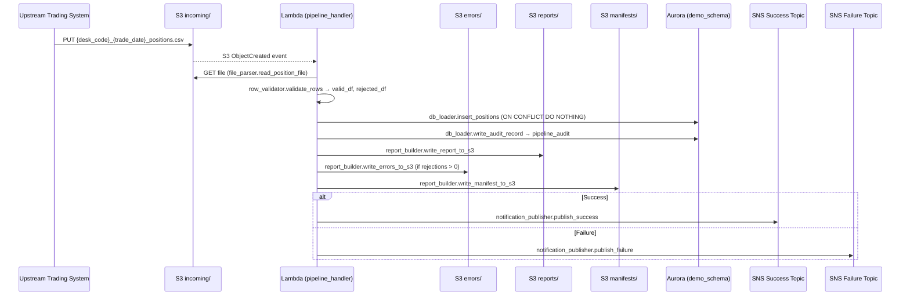
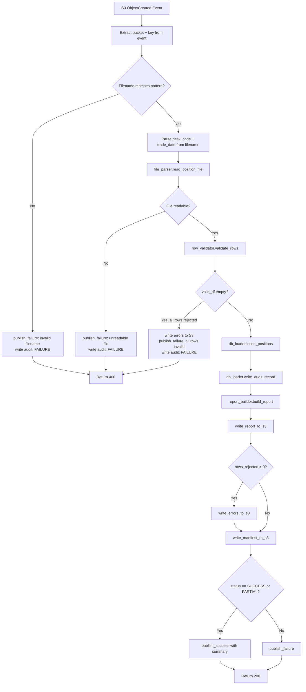
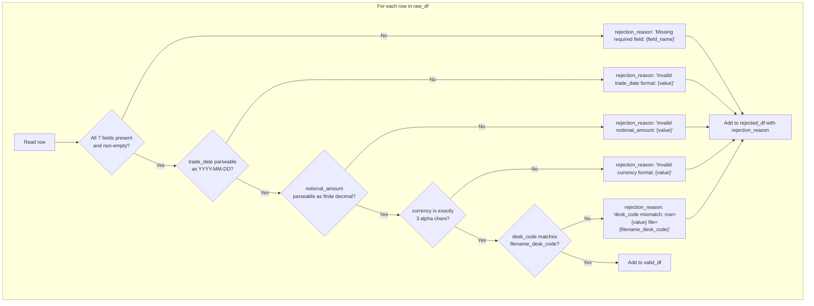

# Technical Design Document (TDD)
## Daily Trade Position Ingestion — Enterprise Risk Data Platform

**Repo:** nartcr/agentic-poc-sandbox
**Change Type:** New Feature
**Date:** June 2026
**Status:** Draft

---

## COMPONENTS

### 1. `pipeline_handler.py` — Lambda Entry Point & Orchestrator

**What it does:**
Serves as the AWS Lambda handler function. Receives an S3 event notification (or a direct invocation payload), extracts the S3 bucket and key from the event, then orchestrates the full pipeline: file parsing → validation → DB loading → report generation → notification dispatch → audit logging. Catches all unhandled exceptions and routes them to the failure notification path.

**Signature:**
```
def handler(event: dict, context: object) -> dict
def _extract_s3_key(event: dict) -> tuple[str, str]   # returns (bucket, key)
def _run_pipeline(bucket: str, key: str) -> dict       # returns summary dict
```

**Reads:**
- S3 event: `event["Records"][0]["s3"]["bucket"]["name"]`, `event["Records"][0]["s3"]["object"]["key"]`
- Parses filename to extract `desk_code` and `trade_date` using pattern `{desk_code}_{trade_date}_positions.csv`

**Writes:**
- Returns HTTP-style response dict `{"statusCode": 200, "body": "<summary>"}`
- Delegates all side effects to sub-modules

**Satisfies:** BAC-1, BAC-5, BAC-6, BAC-7, BAC-8

---

### 2. `file_parser.py` — S3 File Reader & Raw Row Extractor

**What it does:**
Downloads the CSV file from S3 using `boto3.client("s3")`. Reads the content into a `pandas.DataFrame`. Enforces that the file is UTF-8 encoded and comma-delimited. Returns the raw DataFrame with original column names preserved. Raises a descriptive `ValueError` if the file is empty, unreadable, or missing required column headers entirely.

**Signature:**
```
def read_position_file(bucket: str, key: str) -> pd.DataFrame
```

**Reads:**
- S3 object at `s3://{bucket}/{key}`
- Expected CSV columns: `trade_id`, `desk_code`, `trade_date`, `instrument_type`, `notional_amount`, `currency`, `counterparty_id`

**Writes:**
- Returns `pd.DataFrame` with raw string values (no type coercion at this stage)

**Satisfies:** BAC-1, BAC-6

---

### 3. `row_validator.py` — Per-Row Validation & Rejection Logic

**What it does:**
Accepts a raw `pd.DataFrame`. Iterates every row applying the following validation rules in order:

1. **Presence check:** `trade_id`, `desk_code`, `trade_date`, `instrument_type`, `notional_amount`, `currency`, `counterparty_id` must be non-null and non-empty string after stripping whitespace.
2. **Type checks:**
   - `trade_date`: parseable as `YYYY-MM-DD`
   - `notional_amount`: parseable as a finite decimal number (no NaN, no Inf)
   - `currency`: exactly 3 alphabetic characters (ISO 4217 format)
3. **Consistency check:** `desk_code` in the row must match the `desk_code` parsed from the filename.

Returns two DataFrames: `valid_df` (rows passing all checks) and `rejected_df` (rows failing any check, with an added `rejection_reason` column containing a plain-English description of the first failure encountered per row).

**Signature:**
```
def validate_rows(
    df: pd.DataFrame,
    filename_desk_code: str,
    filename_trade_date: str
) -> tuple[pd.DataFrame, pd.DataFrame]
```

**Reads:**
- Raw `pd.DataFrame` from `file_parser.read_position_file`
- `filename_desk_code: str` — parsed from S3 key
- `filename_trade_date: str` — parsed from S3 key (used for consistency check)

**Writes:**
- `valid_df`: `pd.DataFrame` with columns `[trade_id, desk_code, trade_date, instrument_type, notional_amount, currency, counterparty_id]`, typed appropriately (`trade_date` as `date`, `notional_amount` as `Decimal`)
- `rejected_df`: same columns plus `rejection_reason: str`

**Satisfies:** BAC-2, BAC-4

---

### 4. `db_loader.py` — Validated Row Inserter with Idempotent Upsert

**What it does:**
Accepts `valid_df` (a validated `pd.DataFrame`) and a live database connection. Executes a batch `INSERT INTO demo_schema.trade_positions (trade_id, desk_code, trade_date, instrument_type, notional_amount, currency, counterparty_id) VALUES %s ON CONFLICT (trade_id, desk_code, trade_date) DO NOTHING` using `psycopg2.extras.execute_values`. Returns the count of rows actually inserted (i.e., not skipped by the conflict clause), computed as `len(valid_df) - skipped_count` where `skipped_count` is derived by querying existing keys before insert (see algorithm below).

Also writes one row to `demo_schema.pipeline_audit` per file processed via `write_audit_record`.

**Signatures:**
```
def insert_positions(
    conn,
    valid_df: pd.DataFrame
) -> int   # returns rows_inserted count

def write_audit_record(
    conn,
    filename: str,
    desk_code: str | None,
    trade_date: str | None,
    status: str,           # "SUCCESS" | "FAILURE" | "PARTIAL"
    total_rows: int,
    rows_inserted: int,
    rows_rejected: int,
    error_message: str | None,
    processing_timestamp_et: datetime
) -> None
```

**Deduplication algorithm:**
```
1. Extract set of (trade_id, desk_code, trade_date) from valid_df
2. Query SELECT trade_id, desk_code, trade_date FROM demo_schema.trade_positions
   WHERE (trade_id, desk_code, trade_date) IN (<batch of keys>)
3. pre_existing_count = len(results)
4. Execute INSERT ... ON CONFLICT (trade_id, desk_code, trade_date) DO NOTHING
5. rows_inserted = len(valid_df) - pre_existing_count
```

**Reads:**
- `valid_df` columns: `trade_id`, `desk_code`, `trade_date`, `instrument_type`, `notional_amount`, `currency`, `counterparty_id`
- Live `psycopg2` connection from `db_connection.py`

**Writes:**
- `INSERT` into `demo_schema.trade_positions`
- `INSERT` into `demo_schema.pipeline_audit`

**Satisfies:** BAC-1, BAC-3, BAC-4, BAC-7

---

### 5. `db_connection.py` — Database Credential Fetcher & Connection Factory

**What it does:**
Retrieves the database secret JSON from AWS Secrets Manager using `boto3.client("secretsmanager")` with the secret ID from `os.environ["DB_SECRET_ID"]`. Parses the JSON to extract `host`, `port`, `dbname`, `username`, `password`. Opens and returns a `psycopg2` connection with `connect_timeout=10`. Raises a descriptive `RuntimeError` if the secret cannot be fetched or the connection fails.

**Signature:**
```
def get_connection() -> psycopg2.connection
def _fetch_secret(secret_id: str) -> dict
```

**Reads:**
- `os.environ["DB_SECRET_ID"]` → Secrets Manager secret ID
- Secret JSON keys: `host`, `port`, `dbname`, `username`, `password`

**Writes:**
- Returns open `psycopg2.connection`; caller is responsible for closing

**Satisfies:** BAC-8

---

### 6. `report_builder.py` — Summary Report Generator & S3 Writer

**What it does:**
Accepts `valid_df`, `rejected_df`, processing metadata, and produces two outputs:

**A. Summary report JSON** — written to S3 at:
`s3://{S3_BUCKET}/reports/{desk_code}_{trade_date}_report_{timestamp_et}.json`

The JSON structure:
```json
{
  "filename": "...",
  "desk_code": "...",
  "trade_date": "...",
  "processing_timestamp_et": "2026-06-01T21:05:33-04:00",
  "total_rows": 1000,
  "rows_loaded": 950,
  "rows_rejected": 50,
  "rows_by_desk_code": {"DESK_A": 950},
  "notional_min": 100.00,
  "notional_max": 9500000.00,
  "null_rates": {
    "trade_id": 0.0,
    "desk_code": 0.0,
    "trade_date": 0.0,
    "instrument_type": 0.02,
    "notional_amount": 0.0,
    "currency": 0.0,
    "counterparty_id": 0.01
  }
}
```

**B. Error file CSV** (if `len(rejected_df) > 0`) — written to S3 at:
`s3://{S3_BUCKET}/errors/{desk_code}_{trade_date}_errors_{timestamp_et}.csv`

Columns: `trade_id`, `desk_code`, `trade_date`, `instrument_type`, `notional_amount`, `currency`, `counterparty_id`, `rejection_reason`

**C. Manifest JSON** — written to S3 at:
`s3://{S3_BUCKET}/manifests/{desk_code}_{trade_date}_manifest.json`

```json
{
  "desk_code": "...",
  "trade_date": "...",
  "report_key": "reports/{desk_code}_{trade_date}_report_{timestamp_et}.json",
  "error_key": "errors/{desk_code}_{trade_date}_errors_{timestamp_et}.csv",
  "processing_timestamp_et": "..."
}
```
`error_key` is `null` if no rejections occurred.

**Null rates are computed over the full raw DataFrame (before splitting), using the 7 mandatory fields only.**

**Signatures:**
```
def build_report(
    valid_df: pd.DataFrame,
    rejected_df: pd.DataFrame,
    raw_df: pd.DataFrame,
    filename: str,
    desk_code: str,
    trade_date: str,
    rows_inserted: int,
    processing_timestamp_et: datetime
) -> dict   # returns the summary dict (also used for SNS payload)

def write_report_to_s3(
    report: dict,
    bucket: str,
    desk_code: str,
    trade_date: str,
    timestamp_et: datetime
) -> str    # returns S3 key of report

def write_errors_to_s3(
    rejected_df: pd.DataFrame,
    bucket: str,
    desk_code: str,
    trade_date: str,
    timestamp_et: datetime
) -> str | None    # returns S3 key or None

def write_manifest_to_s3(
    bucket: str,
    desk_code: str,
    trade_date: str,
    report_key: str,
    error_key: str | None,
    processing_timestamp_et: datetime
) -> str    # returns manifest S3 key
```

**Reads:**
- `valid_df`, `rejected_df`, `raw_df` (DataFrames)
- `os.environ["S3_BUCKET"]`

**Writes:**
- S3 report JSON, S3 error CSV, S3 manifest JSON

**Satisfies:** BAC-2, BAC-4, BAC-7

---

### 7. `notification_publisher.py` — SNS Success & Failure Publisher

**What it does:**
Publishes structured JSON messages to SNS topics. For success, publishes the summary report dict to the success topic ARN from `os.environ["SNS_SUCCESS_TOPIC_ARN"]`. For failure, publishes an error payload to the failure topic ARN from `os.environ["SNS_FAILURE_TOPIC_ARN"]`. Uses `boto3.client("sns").publish()`.

**Signatures:**
```
def publish_success(summary: dict) -> None
def publish_failure(filename: str, error: str, desk_code: str | None, trade_date: str | None) -> None
```

**Reads:**
- `os.environ["SNS_SUCCESS_TOPIC_ARN"]`
- `os.environ["SNS_FAILURE_TOPIC_ARN"]`
- `summary: dict` (from `report_builder.build_report`)

**Writes:**
- SNS message to success or failure topic (see Data Contracts → SNS)

**Satisfies:** BAC-5

---

### 8. `timestamp_helper.py` — Eastern Time Utilities

**What it does:**
Provides a single reusable function that returns the current datetime in `America/Toronto` timezone. Also provides a formatter that produces ISO 8601 strings with UTC offset (e.g. `2026-06-01T21:05:33-04:00`). Used by all modules that stamp timestamps.

**Signatures:**
```
def now_et() -> datetime            # returns timezone-aware datetime in ET
def format_et(dt: datetime) -> str  # returns ISO 8601 string with offset
```

**Reads:** System clock via `datetime.now(tz=pytz.timezone("America/Toronto"))`

**Writes:** Returns datetime / string; no I/O side effects

**Satisfies:** BAC-7

---

## AWS SERVICES

| Service | Role |
|---|---|
| **Amazon S3** | Input file storage (`incoming/` prefix), error file output (`errors/`), report output (`reports/`), manifest output (`manifests/`). Lambda is triggered by S3 `ObjectCreated` events on the `incoming/` prefix. |
| **AWS Lambda** | Compute platform. The single Lambda function `agentic-poc-sandbox-qa` runs the full pipeline per file. Invoked by S3 event notification on object creation in the input prefix. |
| **Amazon Aurora (PostgreSQL)** | Reporting database. Stores `demo_schema.trade_positions` (validated position records) and `demo_schema.pipeline_audit` (per-file audit trail). |
| **AWS Secrets Manager** | Stores Aurora database credentials under secret ID `agentic-poc-aurora`. Retrieved at runtime by `db_connection.py`. |
| **Amazon SNS** | Two topics: success topic (`agentic-poc-success`) and failure topic (`agentic-poc-failure`). Used to notify downstream risk pipeline of processing outcomes. |

---

## DATA CONTRACTS

### Database Tables

#### `demo_schema.trade_positions`

| Column | Data Type | Nullable | Notes |
|---|---|---|---|
| `trade_id` | `VARCHAR(100)` | NOT NULL | Part of composite PK |
| `desk_code` | `VARCHAR(50)` | NOT NULL | Part of composite PK |
| `trade_date` | `DATE` | NOT NULL | Part of composite PK |
| `instrument_type` | `VARCHAR(100)` | NOT NULL | |
| `notional_amount` | `NUMERIC(20,4)` | NOT NULL | |
| `currency` | `CHAR(3)` | NOT NULL | |
| `counterparty_id` | `VARCHAR(100)` | NOT NULL | |
| `loaded_at` | `TIMESTAMPTZ` | NOT NULL | Default: `now()` |

**Primary Key:** `(trade_id, desk_code, trade_date)`
**Unique Constraint (dedup key):** `(trade_id, desk_code, trade_date)` — enforced by PK, used in `ON CONFLICT` clause
**Indexes:** PK index on `(trade_id, desk_code, trade_date)`

---

#### `demo_schema.pipeline_audit`

| Column | Data Type | Nullable | Notes |
|---|---|---|---|
| `audit_id` | `BIGSERIAL` | NOT NULL | PK, auto-increment |
| `filename` | `VARCHAR(255)` | NOT NULL | Original S3 key basename |
| `desk_code` | `VARCHAR(50)` | NULL | Parsed from filename; null if filename is malformed |
| `trade_date` | `DATE` | NULL | Parsed from filename; null if filename is malformed |
| `status` | `VARCHAR(20)` | NOT NULL | One of: `"SUCCESS"`, `"FAILURE"`, `"PARTIAL"` |
| `total_rows` | `INTEGER` | NOT NULL | Default: `0` |
| `rows_inserted` | `INTEGER` | NOT NULL | Default: `0` |
| `rows_rejected` | `INTEGER` | NOT NULL | Default: `0` |
| `error_message` | `TEXT` | NULL | Populated on `FAILURE` |
| `processing_timestamp_et` | `TIMESTAMPTZ` | NOT NULL | Timestamp in ET (America/Toronto) |
| `created_at` | `TIMESTAMPTZ` | NOT NULL | Default: `now()` |

**Primary Key:** `(audit_id)`

---

### S3 Paths

| Purpose | Key Pattern | Format | Notes |
|---|---|---|---|
| Input file | `incoming/{desk_code}_{trade_date}_positions.csv` | CSV, UTF-8, comma-delimited | Deposited by upstream system; triggers Lambda |
| Error file | `errors/{desk_code}_{trade_date}_errors_{YYYYMMDDTHHMMSS}.csv` | CSV, UTF-8 | Written only when `rows_rejected > 0` |
| Summary report | `reports/{desk_code}_{trade_date}_report_{YYYYMMDDTHHMMSS}.json` | JSON | Written for every processed file |
| Manifest | `manifests/{desk_code}_{trade_date}_manifest.json` | JSON | Predictable key; always overwritten on reprocessing |

**Timestamp format in keys:** `YYYYMMDDTHHMMSS` in ET (e.g. `20260601T210533`)

**Input CSV columns (header row required):**
`trade_id`, `desk_code`, `trade_date`, `instrument_type`, `notional_amount`, `currency`, `counterparty_id`

**Error CSV columns:**
`trade_id`, `desk_code`, `trade_date`, `instrument_type`, `notional_amount`, `currency`, `counterparty_id`, `rejection_reason`

**Manifest JSON structure:**
```json
{
  "desk_code": "DESK_A",
  "trade_date": "2026-06-01",
  "report_key": "reports/DESK_A_2026-06-01_report_20260601T210533.json",
  "error_key": "errors/DESK_A_2026-06-01_errors_20260601T210533.csv",
  "processing_timestamp_et": "2026-06-01T21:05:33-04:00"
}
```
(`error_key` is `null` if no rows were rejected)

---

### Secrets Manager

**Environment variable:** `os.environ["DB_SECRET_ID"]` = `agentic-poc-aurora`

**Secret JSON structure:**
```json
{
  "host": "<aurora-cluster-endpoint>",
  "port": 5432,
  "dbname": "app",
  "username": "<db-user>",
  "password": "<db-password>"
}
```

---

### SNS Topics

**Success Topic**
- **Environment variable:** `os.environ["SNS_SUCCESS_TOPIC_ARN"]`
- **Message format:**
```json
{
  "event": "POSITION_LOAD_SUCCESS",
  "filename": "DESK_A_2026-06-01_positions.csv",
  "desk_code": "DESK_A",
  "trade_date": "2026-06-01",
  "processing_timestamp_et": "2026-06-01T21:05:33-04:00",
  "total_rows": 1000,
  "rows_loaded": 950,
  "rows_rejected": 50,
  "report_s3_key": "reports/DESK_A_2026-06-01_report_20260601T210533.json",
  "manifest_s3_key": "manifests/DESK_A_2026-06-01_manifest.json"
}
```

**Failure Topic**
- **Environment variable:** `os.environ["SNS_FAILURE_TOPIC_ARN"]`
- **Message format:**
```json
{
  "event": "POSITION_LOAD_FAILURE",
  "filename": "DESK_A_2026-06-01_positions.csv",
  "desk_code": "DESK_A",
  "trade_date": "2026-06-01",
  "processing_timestamp_et": "2026-06-01T21:05:33-04:00",
  "error": "<descriptive error message>"
}
```

---

### Environment Variables Summary

| Variable Name | Value Source | Used By |
|---|---|---|
| `DB_SECRET_ID` | Deployment config | `db_connection.py` |
| `S3_BUCKET` | Deployment config | `file_parser.py`, `report_builder.py` |
| `SNS_SUCCESS_TOPIC_ARN` | Deployment config | `notification_publisher.py` |
| `SNS_FAILURE_TOPIC_ARN` | Deployment config | `notification_publisher.py` |

---

## DATA FLOW

### End-to-End Pipeline Flow



---

### Orchestration Logic (pipeline_handler)



---

### Row Validation Logic (row_validator)



---

### Idempotent Insert Algorithm (db_loader)

```
ALGORITHM insert_positions(conn, valid_df):

1. keys = list of (trade_id, desk_code, trade_date) tuples from valid_df
2. IF keys is empty: RETURN 0

3. existing = SELECT trade_id, desk_code, trade_date
              FROM demo_schema.trade_positions
              WHERE (trade_id, desk_code, trade_date) IN (keys)
              ORDER BY trade_id, desk_code, trade_date

4. pre_existing_count = len(existing)

5. EXECUTE batch INSERT:
   INSERT INTO demo_schema.trade_positions
     (trade_id, desk_code, trade_date, instrument_type,
      notional_amount, currency, counterparty_id)
   VALUES %s
   ON CONFLICT (trade_id, desk_code, trade_date) DO NOTHING

6. rows_inserted = len(valid_df) - pre_existing_count
7. RETURN rows_inserted
```

---

## TECHNICAL ACCEPTANCE CRITERIA

### TAC-1 — Valid positions available before next morning's risk run
- `db_loader.insert_positions` must complete the `INSERT INTO demo_schema.trade_positions ... ON CONFLICT (trade_id, desk_code, trade_date) DO NOTHING` within the Lambda execution window.
- Acceptance test: after `insert_positions(conn, valid_df)` returns, `SELECT COUNT(*) FROM demo_schema.trade_positions WHERE desk_code = '{desk_code}' AND trade_date = '{trade_date}'` returns a count equal to the number of unique `(trade_id, desk_code, trade_date)` tuples in the input file.

### TAC-2 — Invalid records flagged with clear reasons
- `row_validator.validate_rows` must produce a `rejected_df` where every row contains a non-empty `rejection_reason` string identifying the specific field that failed and why.
- Acceptance test: for each row in `rejected_df`, assert `len(row["rejection_reason"].strip()) > 0` and that the reason string contains the offending field name.
- The error CSV written to `s3://{S3_BUCKET}/errors/{desk_code}_{trade_date}_errors_{timestamp}.csv` must contain all rejected rows with their `rejection_reason` column populated.
- Acceptance test: download error CSV from S3, verify `rejection_reason` is non-null for all rows, verify row count equals `rows_rejected` in the audit record.

### TAC-3 — Resubmitting a file does not double-count positions
- `db_loader.insert_positions` uses `ON CONFLICT (trade_id, desk_code, trade_date) DO NOTHING`. The composite primary key on `(trade_id, desk_code, trade_date)` in `demo_schema.trade_positions` enforces uniqueness at the database level.
- Acceptance test: call `insert_positions(conn, valid_df)` twice with identical data. Assert `SELECT COUNT(*) FROM demo_schema.trade_positions WHERE desk_code = X AND trade_date = Y` is identical after both calls. Assert second call returns `rows_inserted = 0`.

### TAC-4 — Summary accurately reflects received/accepted/rejected counts
- `report_builder.build_report` must compute: `total_rows = len(raw_df)`, `rows_loaded = rows_inserted` (from `db_loader`), `rows_rejected = len(rejected_df)`. Must satisfy invariant: `total_rows == rows_loaded + rows_rejected + (len(valid_df) - rows_inserted)` accounting for pre-existing skipped rows.
- Acceptance test: construct a file with N rows (K valid, M invalid). Assert `report["total_rows"] == N`, `report["rows_rejected"] == M`, `report["rows_loaded"] <= K`.
- `rows_by_desk_code` must be computed from `valid_df` using `valid_df.groupby("desk_code").size().to_dict()`.
- `notional_min` and `notional_max` computed from `valid_df["notional_amount"]`.
- `null_rates` computed from `raw_df` over the 7 mandatory fields: `null_rates[col] = raw_df[col].isna().mean()`.
- Report JSON must be persisted to `s3://{S3_BUCKET}/reports/` and manifest to `s3://{S3_BUCKET}/manifests/`.
- Acceptance test: assert S3 object exists at the keys specified in the manifest.

### TAC-5 — Risk pipeline notified automatically with no manual trigger
- `notification_publisher.publish_success` must be called within `pipeline_handler.handler` upon successful processing.
- SNS message must include `"event": "POSITION_LOAD_SUCCESS"`, `desk_code`, `trade_date`, `rows_loaded`, and `report_s3_key`.
- Acceptance test: mock SNS client, invoke `handler(event, context)`, assert `sns.publish` was called exactly once with `TopicArn == os.environ["SNS_SUCCESS_TOPIC_ARN"]` and message body contains `"POSITION_LOAD_SUCCESS"`.
- On any unhandled exception in `handler`, `notification_publisher.publish_failure` must be called with `TopicArn == os.environ["SNS_FAILURE_TOPIC_ARN"]`.

### TAC-6 — Processing completes within the operations window
- Unit benchmark: a synthetic `valid_df` of 10,000 rows passed to `db_loader.insert_positions` must complete in under 60 seconds (measured wall-clock time in test environment).
- `file_parser.read_position_file` + `row_validator.validate_rows` combined must handle 100,000 rows without raising `MemoryError` or timeout.
- Acceptance test: generate a CSV with 10,000 rows, invoke full pipeline, assert elapsed time < 60 seconds.

### TAC-7 — All timestamps reflect Toronto business hours
- `timestamp_helper.now_et()` must return a `datetime` with `tzinfo = pytz.timezone("America/Toronto")`.
- `pipeline_audit.processing_timestamp_et` must be stored with offset (TIMESTAMPTZ) and, when read back and converted, represent ET.
- All timestamps in report JSON (`processing_timestamp_et`) must be ISO 8601 strings with UTC offset (e.g. `-04:00` in EDT or `-05:00` in EST).
- Acceptance test: assert `now_et().tzname() in ("EDT", "EST")`, assert report JSON `processing_timestamp_et` contains `-04:00` or `-05:00`, assert audit record `processing_timestamp_et` when cast to `America/Toronto` matches the ET wall-clock time at invocation ± 5 seconds.

### TAC-8 — No secrets in code or configuration files
- `db_connection.get_connection` must retrieve credentials exclusively via `boto3.client("secretsmanager").get_secret_value(SecretId=os.environ["DB_SECRET_ID"])`.
- Acceptance test: static analysis (grep) of all `.py` files in the repo must find zero matches for any database hostname, password, or connection string literal.
- Code review gate: no string literal matching patterns `password`, `host=`, `postgresql://` with embedded credentials.

---

## OPEN QUESTIONS

**None.** All infrastructure is fully specified in the Infrastructure Config YAML. All business logic ambiguities have been resolved with explicit design decisions documented in the Assumptions section below.

---

## ASSUMPTIONS

1. **Lambda trigger:** The Lambda function `agentic-poc-sandbox-qa` is triggered by an S3 `ObjectCreated` event on the `incoming/` prefix of bucket `agentic-poc-533266968934`. This trigger is assumed to be pre-configured in the existing infrastructure.

2. **One file per invocation:** Each Lambda invocation processes exactly one file (one S3 event record). If an event contains multiple records, only the first record is processed. Batch processing of multiple files in a single invocation is out of scope.

3. **Filename format is mandatory:** Files that do not match the exact pattern `{desk_code}_{trade_date}_positions.csv` (where `trade_date` is `YYYY-MM-DD`) are treated as pipeline failures, and a failure notification is sent. No partial parsing is attempted on malformed filenames.

4. **"PARTIAL" status definition:** If `rows_rejected > 0` AND `rows_inserted > 0`, the audit record status is `"PARTIAL"`. If all rows are valid and all insert successfully (or skip due to dedup), status is `"SUCCESS"`. If the pipeline throws an unhandled exception before the DB load completes, status is `"FAILURE"`.

5. **Null rates computed on raw input:** Null rates in the summary report are computed over the original raw DataFrame (before validation splitting), covering all 7 mandatory fields. This gives the operations team visibility into source data quality including fields that caused rejections.

6. **No schema migration:** The two tables (`demo_schema.trade_positions` and `demo_schema.pipeline_audit`) are assumed to already exist in the Aurora database as specified in the Infrastructure Config YAML. The pipeline code does not create or alter tables.

7. **`desk_code` consistency check scope:** The `desk_code` in each row must match the `desk_code` extracted from the filename. Rows with a mismatched `desk_code` are rejected with a clear reason. This is a data quality guard, not a security control.

8. **Error file written only when rejections exist:** If `len(rejected_df) == 0`, no error CSV is written to S3, and `error_key` in the manifest is `null`.

9. **Manifest overwrite on reprocessing:** The manifest file at `manifests/{desk_code}_{trade_date}_manifest.json` is always overwritten (S3 PUT). This means the manifest always reflects the latest processing run, which is the desired behaviour for idempotent reprocessing.

10. **psycopg2 is the database driver:** `psycopg2` (or `psycopg2-binary`) is used for Aurora PostgreSQL connectivity. It is assumed to be available in the Lambda deployment package.

11. **pandas is available in the Lambda environment:** `pandas` and `pytz` are assumed to be included in the Lambda deployment package (layer or bundled).

12. **`loaded_at` column:** The `loaded_at` column in `demo_schema.trade_positions` uses the database server default `now()` and is NOT explicitly set in the `INSERT` statement. The application does not supply this value.

13. **Re-processing behaviour for reports:** On reprocessing the same file, a new timestamped report and error file are written (new S3 keys due to new timestamp). The manifest (predictable key) is overwritten to point to the latest run. Old report/error files are not deleted — S3 versioning or lifecycle policy (outside scope) handles retention.

14. **`rows_inserted` calculation:** Because `ON CONFLICT DO NOTHING` does not return the count of skipped rows directly via `psycopg2.extras.execute_values`, the pre-existing row count is queried before the insert and subtracted from `len(valid_df)` to compute `rows_inserted`. This is a read-before-write pattern and is acceptable given the expected row volumes.