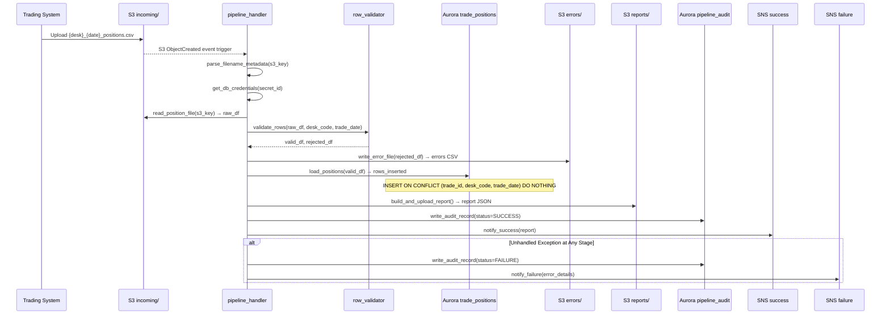
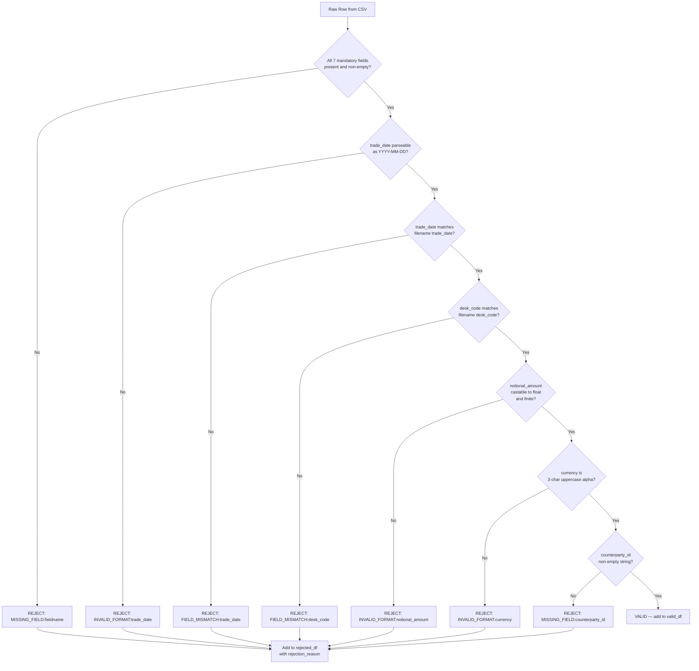
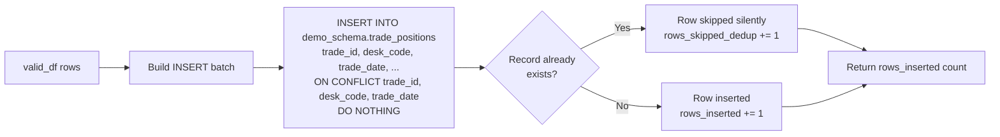
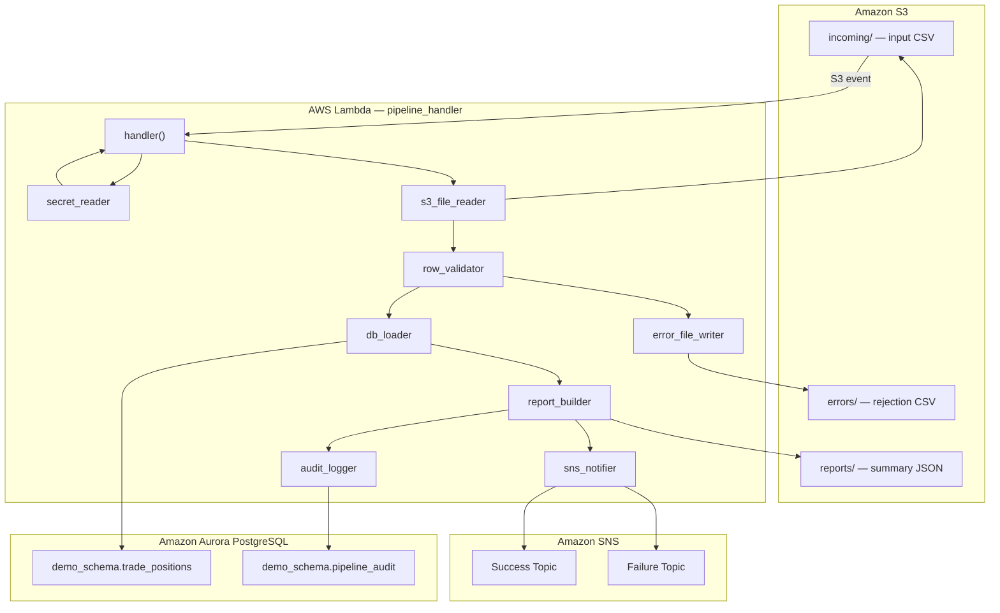

# Technical Design Document

## Daily Trade Position Ingestion — Enterprise Risk Data Platform

**Repo:** nartcr/agentic-poc-sandbox
**Change Type:** New Feature
**Date:** June 2026
**Status:** Draft

---

## COMPONENTS

### `pipeline_config.py`
**Purpose:** Centralizes all environment variable reads and runtime configuration. Every other module imports from this file — no module reads `os.environ` directly except this one.

**What it does:**
- Reads and exposes all environment variables required by the pipeline
- Provides a single `PipelineConfig` dataclass instance with typed fields
- Raises `EnvironmentError` at startup if any required variable is missing

**What it reads:**
- `os.environ["S3_BUCKET"]` → S3 bucket name
- `os.environ["S3_INPUT_PREFIX"]` → e.g. `incoming/`
- `os.environ["S3_ERROR_PREFIX"]` → e.g. `errors/`
- `os.environ["S3_REPORT_PREFIX"]` → e.g. `reports/`
- `os.environ["DB_SECRET_ID"]` → Secrets Manager secret ID
- `os.environ["SNS_SUCCESS_ARN"]` → SNS success topic ARN
- `os.environ["SNS_FAILURE_ARN"]` → SNS failure topic ARN
- `os.environ["PIPELINE_SERVICE_NAME"]` → identity string for audit trail (e.g. `"trade-position-ingestion-v1"`)

**What it writes:** Nothing. Exposes a `PipelineConfig` dataclass.

**Function signatures:**
```
def load_config() -> PipelineConfig
```

**BAC satisfied:** BAC-7 (ET timezone enforced centrally), BAC-8 (no hardcoded credentials)

---

### `secret_reader.py`
**Purpose:** Retrieves database credentials from AWS Secrets Manager at runtime. Returns a typed dict. Never caches the secret to disk.

**What it does:**
- Calls `boto3.client("secretsmanager").get_secret_value(SecretId=config.db_secret_id)`
- Parses the JSON string and returns a dict with keys: `host`, `port`, `username`, `password`, `dbname`
- Raises `RuntimeError` if the secret cannot be retrieved or is missing expected keys

**What it reads:**
- Secrets Manager secret identified by `os.environ["DB_SECRET_ID"]`
- Expected JSON keys in secret: `host`, `port`, `username`, `password`, `dbname`

**What it writes:** Nothing persisted. Returns a dict in memory only.

**Function signatures:**
```
def get_db_credentials(secret_id: str) -> dict[str, str]
```

**BAC satisfied:** BAC-8 (credentials never in code or config files)

---

### `s3_file_reader.py`
**Purpose:** Reads a trade position CSV file from S3 and returns its raw content as a pandas DataFrame. Also provides a function to list unprocessed files in the input prefix.

**What it does:**
- `list_input_files()`: calls `s3.list_objects_v2(Bucket, Prefix=S3_INPUT_PREFIX)`, returns list of S3 object keys matching the pattern `{desk_code}_{trade_date}_positions.csv`
- `read_position_file(s3_key: str)`: downloads the object, reads it as a CSV with pandas, returns a raw DataFrame (no type coercion). Preserves all original column names exactly as found in the file.
- `parse_filename_metadata(s3_key: str)`: extracts `desk_code` and `trade_date` from the filename using the pattern `^([A-Z0-9]+)_(\\d{4}-\\d{2}-\\d{2})_positions\\.csv$`. Returns `(desk_code: str, trade_date: date)`. Raises `ValueError` if the filename does not match.

**What it reads:**
- S3 bucket: `os.environ["S3_BUCKET"]`
- S3 prefix: `os.environ["S3_INPUT_PREFIX"]` → `incoming/`
- CSV fields expected (not enforced here): `trade_id`, `desk_code`, `trade_date`, `instrument_type`, `notional_amount`, `currency`, `counterparty_id`

**What it writes:** Nothing.

**Function signatures:**
```
def list_input_files(s3_client, config: PipelineConfig) -> list[str]
def read_position_file(s3_client, bucket: str, s3_key: str) -> pd.DataFrame
def parse_filename_metadata(s3_key: str) -> tuple[str, date]
```

**BAC satisfied:** BAC-1 (enables automated file pickup), BAC-6 (no manual step)

---

### `row_validator.py`
**Purpose:** Applies all data quality rules to the raw DataFrame. Splits input into validated (clean) and rejected (error) DataFrames.

**What it does:**
- Validates every row against the following rules, applied in order:
  1. **Missing mandatory fields:** `trade_id`, `desk_code`, `trade_date`, `instrument_type`, `notional_amount`, `currency`, `counterparty_id` must all be non-null and non-empty string
  2. **trade_id format:** must be a non-empty string, no leading/trailing whitespace after strip
  3. **trade_date format:** must be parseable as `YYYY-MM-DD`; value must match the `trade_date` extracted from the filename
  4. **desk_code consistency:** value in the row must match the `desk_code` extracted from the filename
  5. **notional_amount:** must be castable to `float` and be a finite number (not NaN, not inf)
  6. **currency:** must be a 3-character uppercase alphabetic string (ISO 4217 format check)
  7. **counterparty_id:** must be a non-empty string
- A row fails at the first rule it violates; the `rejection_reason` column captures the specific rule name and field (e.g. `"MISSING_FIELD:notional_amount"`, `"INVALID_FORMAT:trade_date"`, `"FIELD_MISMATCH:desk_code"`, `"INVALID_FORMAT:notional_amount"`, `"INVALID_FORMAT:currency"`)
- Returns two DataFrames: `valid_df` (all rules passed) and `rejected_df` (columns = original columns + `rejection_reason`)

**What it reads:**
- Raw `pd.DataFrame` from `s3_file_reader.read_position_file()`
- `desk_code: str` and `trade_date: date` from `parse_filename_metadata()`

**What it writes:**
- `valid_df: pd.DataFrame` — same columns as input, rows that passed all checks
- `rejected_df: pd.DataFrame` — same columns as input plus `rejection_reason: str`

**Function signatures:**
```
def validate_rows(
    raw_df: pd.DataFrame,
    filename_desk_code: str,
    filename_trade_date: date
) -> tuple[pd.DataFrame, pd.DataFrame]
```

**BAC satisfied:** BAC-2 (clear rejection reasons per row), BAC-4 (accurate counts), BAC-1 (only valid rows proceed)

---

### `db_loader.py`
**Purpose:** Inserts validated trade position rows into `demo_schema.trade_positions` using an idempotent upsert (ON CONFLICT DO NOTHING). Returns the count of rows actually inserted.

**What it does:**
- Receives `valid_df: pd.DataFrame` and a live `psycopg2` connection
- Constructs parameterized `INSERT INTO demo_schema.trade_positions (...) VALUES %s ON CONFLICT (trade_id, desk_code, trade_date) DO NOTHING`
- Uses `psycopg2.extras.execute_values()` for bulk insert performance
- Returns `int` — count of rows inserted (not skipped). Calculated as `cursor.rowcount` after the execute.
- Wraps the insert in a single transaction; rolls back on any exception and re-raises

**What it reads:**
- `valid_df` columns: `trade_id`, `desk_code`, `trade_date`, `instrument_type`, `notional_amount`, `currency`, `counterparty_id`
- Live `psycopg2.connection` (obtained externally via `secret_reader` + `psycopg2.connect()`)

**What it writes:**
- Rows into `demo_schema.trade_positions` (see Data Contracts for full schema)

**Function signatures:**
```
def load_positions(
    conn,
    valid_df: pd.DataFrame
) -> int
```

**BAC satisfied:** BAC-1 (positions loaded), BAC-3 (ON CONFLICT DO NOTHING prevents duplicates), BAC-6 (bulk insert for performance)

---

### `error_file_writer.py`
**Purpose:** Writes the rejected rows DataFrame as a CSV error file to S3 under the `errors/` prefix.

**What it does:**
- Serializes `rejected_df` (original columns + `rejection_reason`) to CSV (UTF-8, with header)
- Uploads to S3 key: `{S3_ERROR_PREFIX}{desk_code}_{trade_date}_errors.csv`
  - e.g. `errors/DESKX_2026-06-15_errors.csv`
- If `rejected_df` is empty, still writes a file with header only (zero data rows) so downstream ops team has a confirmation artifact
- Returns the S3 key written

**What it reads:**
- `rejected_df: pd.DataFrame`
- `desk_code: str`, `trade_date: date`
- `os.environ["S3_BUCKET"]`, `os.environ["S3_ERROR_PREFIX"]`

**What it writes:**
- S3 object: `errors/{desk_code}_{trade_date}_errors.csv`
- CSV columns: `trade_id`, `desk_code`, `trade_date`, `instrument_type`, `notional_amount`, `currency`, `counterparty_id`, `rejection_reason`

**Function signatures:**
```
def write_error_file(
    s3_client,
    config: PipelineConfig,
    rejected_df: pd.DataFrame,
    desk_code: str,
    trade_date: date
) -> str
```

**BAC satisfied:** BAC-2 (ops team can review and correct errors), BAC-4 (complete record of rejected rows)

---

### `report_builder.py`
**Purpose:** Computes the processing summary statistics and writes the JSON report to S3 under the `reports/` prefix.

**What it does:**
- Accepts `raw_df`, `valid_df`, `rejected_df`, `desk_code`, `trade_date`, `rows_inserted: int`, and `processing_timestamp: datetime` (ET-localized)
- Computes:
  - `total_rows_received`: `len(raw_df)`
  - `rows_loaded`: `rows_inserted` (actual DB insertions, not just valid rows — accounts for pre-existing dedup skips)
  - `rows_skipped_dedup`: `len(valid_df) - rows_inserted`
  - `rows_rejected`: `len(rejected_df)`
  - `processing_timestamp`: ISO 8601 string in ET (e.g. `"2026-06-15T20:34:12-04:00"`)
  - `desk_code`: from filename
  - `trade_date`: ISO date string
  - `record_counts_by_desk`: `dict` — `{desk_code: count}` from `valid_df.groupby("desk_code").size()`
  - `min_notional_amount`: `float(valid_df["notional_amount"].min())` — `null` if no valid rows
  - `max_notional_amount`: `float(valid_df["notional_amount"].max())` — `null` if no valid rows
  - `null_rates`: `dict` — for each column in raw_df, `{col: null_count / total_rows_received}` rounded to 4 decimal places
  - `rejection_reasons_summary`: `dict` — `{reason: count}` from `rejected_df["rejection_reason"].value_counts()`
- Serializes to JSON and uploads to S3 key: `{S3_REPORT_PREFIX}{desk_code}_{trade_date}_report.json`
  - e.g. `reports/DESKX_2026-06-15_report.json`
- Returns the full report dict (used by `sns_notifier.py`)

**What it reads:**
- `raw_df`, `valid_df`, `rejected_df`: DataFrames
- `rows_inserted: int`
- `processing_timestamp: datetime` (ET-aware)
- `desk_code: str`, `trade_date: date`

**What it writes:**
- S3 object: `reports/{desk_code}_{trade_date}_report.json`

**Function signatures:**
```
def build_and_upload_report(
    s3_client,
    config: PipelineConfig,
    raw_df: pd.DataFrame,
    valid_df: pd.DataFrame,
    rejected_df: pd.DataFrame,
    rows_inserted: int,
    processing_timestamp: datetime,
    desk_code: str,
    trade_date: date
) -> dict
```

**BAC satisfied:** BAC-4 (complete and accurate summary), BAC-7 (ET timestamps in report)

---

### `audit_logger.py`
**Purpose:** Writes one audit record per file processed into `demo_schema.pipeline_audit`. Called both on success and on failure.

**What it does:**
- Inserts a single row into `demo_schema.pipeline_audit` for every file processed
- On re-run of the same file, uses `INSERT ... ON CONFLICT (s3_key) DO UPDATE SET ...` to update the existing audit row with the latest outcome (supports idempotent reprocessing)
- Fields populated on success: `s3_key`, `desk_code`, `trade_date`, `status="SUCCESS"`, `total_rows`, `rows_loaded`, `rows_rejected`, `rows_skipped_dedup`, `processing_timestamp_et`, `service_name`
- Fields populated on failure: same, with `status="FAILURE"`, `error_message` populated, row counts as available (may be 0)

**What it reads:**
- Live `psycopg2.connection`
- All summary fields from the report dict or directly from pipeline state

**What it writes:**
- Row in `demo_schema.pipeline_audit` (see Data Contracts)

**Function signatures:**
```
def write_audit_record(
    conn,
    s3_key: str,
    desk_code: str,
    trade_date: date,
    status: str,
    total_rows: int,
    rows_loaded: int,
    rows_rejected: int,
    rows_skipped_dedup: int,
    processing_timestamp_et: datetime,
    service_name: str,
    error_message: str | None = None
) -> None
```

**BAC satisfied:** BAC-7 (ET timestamps), BAC-8 (audit supports regulatory examination readiness, NFR 3.3)

---

### `sns_notifier.py`
**Purpose:** Publishes SNS notifications on pipeline success or failure. Two separate functions targeting two separate topics.

**What it does:**
- `notify_success()`: publishes to `os.environ["SNS_SUCCESS_ARN"]` with the full report dict as the message body (JSON-serialized)
- `notify_failure()`: publishes to `os.environ["SNS_FAILURE_ARN"]` with error details as the message body (JSON-serialized)
- Both functions set `Subject` to `"TradePositionIngestion:{desk_code}:{trade_date}:{STATUS}"`
- Both functions return the SNS `MessageId` string

**What it reads:**
- `report: dict` (from `report_builder.build_and_upload_report()`)
- `error_details: dict` (on failure path)
- `os.environ["SNS_SUCCESS_ARN"]`, `os.environ["SNS_FAILURE_ARN"]`

**What it writes:**
- SNS message to success or failure topic (see Data Contracts for message format)

**Function signatures:**
```
def notify_success(
    sns_client,
    config: PipelineConfig,
    report: dict
) -> str

def notify_failure(
    sns_client,
    config: PipelineConfig,
    desk_code: str,
    trade_date: str,
    s3_key: str,
    error_message: str,
    partial_report: dict | None = None
) -> str
```

**BAC satisfied:** BAC-5 (automatic downstream notification with no manual trigger)

---

### `pipeline_handler.py`
**Purpose:** Lambda entry point. Orchestrates the full pipeline for a single S3 event trigger. Calls all other modules in sequence, handles top-level error catching, and guarantees the audit record and failure notification are written even if the pipeline aborts mid-run.

**What it does:**
- `handler(event, context)`: AWS Lambda handler. Receives an S3 event notification (object created in `incoming/` prefix).
- Extracts the S3 key from `event["Records"][0]["s3"]["object"]["key"]`
- Calls `parse_filename_metadata()` to extract `desk_code` and `trade_date`
- Instantiates boto3 clients (S3, SNS, Secrets Manager) and loads config
- Retrieves DB credentials via `secret_reader.get_db_credentials()`
- Opens a `psycopg2` connection
- Records `processing_timestamp` as `datetime.now(pytz.timezone("America/Toronto"))`
- Calls `s3_file_reader.read_position_file()` → raw_df
- Calls `row_validator.validate_rows()` → valid_df, rejected_df
- Calls `error_file_writer.write_error_file()` → error_s3_key
- Calls `db_loader.load_positions()` → rows_inserted
- Calls `report_builder.build_and_upload_report()` → report dict
- Calls `audit_logger.write_audit_record()` with status="SUCCESS"
- Calls `sns_notifier.notify_success()`
- On any unhandled exception at any stage: calls `audit_logger.write_audit_record()` with status="FAILURE" and `sns_notifier.notify_failure()`, then re-raises the exception so Lambda marks the invocation as failed
- Returns HTTP 200 JSON body on success

**What it reads:**
- S3 event from Lambda trigger
- All config from `pipeline_config.PipelineConfig`

**What it writes:**
- Coordinates all writes (DB, S3 error file, S3 report, SNS, audit)

**Function signatures:**
```
def handler(event: dict, context) -> dict
```

**BAC satisfied:** BAC-1, BAC-2, BAC-3, BAC-4, BAC-5, BAC-6, BAC-7, BAC-8 (orchestration of all)

---

## AWS SERVICES

| Service | Role |
|---|---|
| **AWS Lambda** | Compute runtime. The `pipeline_handler.handler` function is triggered by S3 event notifications when a new file lands in `incoming/`. Function name: `agentic-poc-sandbox-qa` |
| **Amazon S3** | File storage. Bucket `agentic-poc-533266968934` stores input position files (`incoming/`), error files (`errors/`), and processing reports (`reports/`) |
| **AWS Secrets Manager** | Secure credential store. Secret `agentic-poc-aurora` holds database host, port, username, password, and dbname. Retrieved at runtime by `secret_reader.py` |
| **Amazon Aurora (PostgreSQL)** | Reporting database. Schema `demo_schema`, database `app`. Tables `trade_positions` and `pipeline_audit` |
| **Amazon SNS** | Downstream notification. Two topics: success (`agentic-poc-success`) and failure (`agentic-poc-failure`). Risk calculation pipeline subscribes to success topic |

---

## DATA CONTRACTS

### Database Tables

#### `demo_schema.trade_positions`

| Column | Type | Constraints | Notes |
|---|---|---|---|
| `id` | `BIGSERIAL` | PRIMARY KEY | Auto-generated surrogate key |
| `trade_id` | `VARCHAR(100)` | NOT NULL | From CSV field `trade_id` |
| `desk_code` | `VARCHAR(50)` | NOT NULL | From CSV field `desk_code` |
| `trade_date` | `DATE` | NOT NULL | From CSV field `trade_date` |
| `instrument_type` | `VARCHAR(100)` | NOT NULL | From CSV field `instrument_type` |
| `notional_amount` | `NUMERIC(20, 6)` | NOT NULL | From CSV field `notional_amount` |
| `currency` | `CHAR(3)` | NOT NULL | ISO 4217, 3-char uppercase |
| `counterparty_id` | `VARCHAR(100)` | NOT NULL | From CSV field `counterparty_id` |
| `loaded_at` | `TIMESTAMPTZ` | NOT NULL, DEFAULT NOW() | DB-side insert timestamp |

**Primary Key:** `id`
**Unique Constraint:** `UNIQUE (trade_id, desk_code, trade_date)` — this is the deduplication key for `ON CONFLICT`
**Indexes:**
- `idx_trade_positions_desk_date` ON `(desk_code, trade_date)`
- `idx_trade_positions_trade_id` ON `(trade_id)`

---

#### `demo_schema.pipeline_audit`

| Column | Type | Constraints | Notes |
|---|---|---|---|
| `id` | `BIGSERIAL` | PRIMARY KEY | Auto-generated surrogate key |
| `s3_key` | `VARCHAR(500)` | NOT NULL | Full S3 object key of the processed file |
| `desk_code` | `VARCHAR(50)` | NOT NULL | From filename |
| `trade_date` | `DATE` | NOT NULL | From filename |
| `status` | `VARCHAR(20)` | NOT NULL | `"SUCCESS"` or `"FAILURE"` |
| `total_rows` | `INTEGER` | NOT NULL, DEFAULT 0 | Total rows in the file |
| `rows_loaded` | `INTEGER` | NOT NULL, DEFAULT 0 | Rows actually inserted into DB |
| `rows_rejected` | `INTEGER` | NOT NULL, DEFAULT 0 | Rows failed validation |
| `rows_skipped_dedup` | `INTEGER` | NOT NULL, DEFAULT 0 | Valid rows skipped due to existing dedup key |
| `processing_timestamp_et` | `TIMESTAMPTZ` | NOT NULL | ET-localized timestamp of pipeline start |
| `service_name` | `VARCHAR(200)` | NOT NULL | Value of `PIPELINE_SERVICE_NAME` env var |
| `error_message` | `TEXT` | NULLABLE | Populated on `FAILURE` only |
| `created_at` | `TIMESTAMPTZ` | NOT NULL, DEFAULT NOW() | Record creation timestamp |
| `updated_at` | `TIMESTAMPTZ` | NOT NULL, DEFAULT NOW() | Last upsert timestamp |

**Primary Key:** `id`
**Unique Constraint:** `UNIQUE (s3_key)` — enables idempotent upsert on reprocessing
**Indexes:**
- `idx_pipeline_audit_trade_date` ON `(trade_date)`
- `idx_pipeline_audit_status` ON `(status)`

---

### S3 Paths

| Path Pattern | Direction | Format | Content |
|---|---|---|---|
| `incoming/{desk_code}_{trade_date}_positions.csv` | Input (read) | CSV, UTF-8, with header row | Trade position records. Columns: `trade_id`, `desk_code`, `trade_date`, `instrument_type`, `notional_amount`, `currency`, `counterparty_id` |
| `errors/{desk_code}_{trade_date}_errors.csv` | Output (write) | CSV, UTF-8, with header row | Rejected rows. Columns: `trade_id`, `desk_code`, `trade_date`, `instrument_type`, `notional_amount`, `currency`, `counterparty_id`, `rejection_reason` |
| `reports/{desk_code}_{trade_date}_report.json` | Output (write) | JSON, UTF-8 | Processing summary (see SNS message format below — identical structure) |

**Example keys:**
- `incoming/DESKX_2026-06-15_positions.csv`
- `errors/DESKX_2026-06-15_errors.csv`
- `reports/DESKX_2026-06-15_report.json`

---

### Secrets Manager

**Env var:** `os.environ["DB_SECRET_ID"]` = `agentic-poc-aurora`

Expected JSON structure in the secret:
```json
{
  "host": "<aurora-cluster-endpoint>",
  "port": "5432",
  "username": "<db-username>",
  "password": "<db-password>",
  "dbname": "app"
}
```

---

### SNS Message Formats

**Success Topic**
**Env var:** `os.environ["SNS_SUCCESS_ARN"]`
**Subject:** `"TradePositionIngestion:{desk_code}:{trade_date}:SUCCESS"`

```json
{
  "status": "SUCCESS",
  "s3_key": "incoming/DESKX_2026-06-15_positions.csv",
  "desk_code": "DESKX",
  "trade_date": "2026-06-15",
  "processing_timestamp": "2026-06-15T20:34:12-04:00",
  "total_rows_received": 9500,
  "rows_loaded": 9450,
  "rows_rejected": 50,
  "rows_skipped_dedup": 0,
  "record_counts_by_desk": {"DESKX": 9450},
  "min_notional_amount": 1000.00,
  "max_notional_amount": 5000000.00,
  "null_rates": {
    "trade_id": 0.0,
    "desk_code": 0.0,
    "trade_date": 0.0,
    "instrument_type": 0.0,
    "notional_amount": 0.0052,
    "currency": 0.0,
    "counterparty_id": 0.0
  },
  "rejection_reasons_summary": {
    "MISSING_FIELD:notional_amount": 50
  },
  "report_s3_key": "reports/DESKX_2026-06-15_report.json",
  "error_file_s3_key": "errors/DESKX_2026-06-15_errors.csv"
}
```

**Failure Topic**
**Env var:** `os.environ["SNS_FAILURE_ARN"]`
**Subject:** `"TradePositionIngestion:{desk_code}:{trade_date}:FAILURE"`

```json
{
  "status": "FAILURE",
  "s3_key": "incoming/DESKX_2026-06-15_positions.csv",
  "desk_code": "DESKX",
  "trade_date": "2026-06-15",
  "processing_timestamp": "2026-06-15T20:34:12-04:00",
  "error_message": "psycopg2.OperationalError: connection refused",
  "partial_report": null
}
```

---

### Environment Variables Summary

| Variable Name | Used By | Description |
|---|---|---|
| `S3_BUCKET` | `pipeline_config`, `s3_file_reader`, `error_file_writer`, `report_builder` | S3 bucket name |
| `S3_INPUT_PREFIX` | `pipeline_config`, `s3_file_reader` | e.g. `incoming/` |
| `S3_ERROR_PREFIX` | `pipeline_config`, `error_file_writer` | e.g. `errors/` |
| `S3_REPORT_PREFIX` | `pipeline_config`, `report_builder` | e.g. `reports/` |
| `DB_SECRET_ID` | `pipeline_config`, `secret_reader` | e.g. `agentic-poc-aurora` |
| `SNS_SUCCESS_ARN` | `pipeline_config`, `sns_notifier` | Full ARN of success topic |
| `SNS_FAILURE_ARN` | `pipeline_config`, `sns_notifier` | Full ARN of failure topic |
| `PIPELINE_SERVICE_NAME` | `pipeline_config`, `audit_logger` | Identity string for audit trail |

---

## DATA FLOW

### End-to-End Pipeline Flow



---

### Validation Decision Logic



---

### Idempotent Load Logic



---

### Swimlane: Actors and Responsibilities



---

## TECHNICAL ACCEPTANCE CRITERIA

**TAC-1 (from BAC-1): All valid positions loaded before morning risk run**
- `db_loader.load_positions()` executes `INSERT INTO demo_schema.trade_positions (trade_id, desk_code, trade_date, instrument_type, notional_amount, currency, counterparty_id) VALUES %s ON CONFLICT (trade_id, desk_code, trade_date) DO NOTHING` for every row in `valid_df`
- Acceptance test: given an input CSV with N valid rows and an empty `trade_positions` table, after `handler()` completes, `SELECT COUNT(*) FROM demo_schema.trade_positions WHERE desk_code = :desk AND trade_date = :date` returns N
- The Lambda is triggered by S3 ObjectCreated events — no manual invocation required

**TAC-2 (from BAC-2): Invalid records flagged with specific reasons**
- `row_validator.validate_rows()` returns `rejected_df` containing the original 7 columns plus a `rejection_reason` column
- `rejection_reason` values follow the format `"RULE_NAME:field_name"` (e.g. `"MISSING_FIELD:trade_date"`, `"INVALID_FORMAT:currency"`, `"FIELD_MISMATCH:desk_code"`)
- `error_file_writer.write_error_file()` uploads `errors/{desk_code}_{trade_date}_errors.csv` to S3 with these columns
- Acceptance test: submit a file with one row missing `notional_amount`; verify the error CSV contains that row with `rejection_reason = "MISSING_FIELD:notional_amount"`

**TAC-3 (from BAC-3): Resubmission does not double-count positions**
- `db_loader.load_positions()` uses `ON CONFLICT (trade_id, desk_code, trade_date) DO NOTHING`
- `demo_schema.trade_positions` has a `UNIQUE (trade_id, desk_code, trade_date)` constraint enforced at the database level
- `audit_logger.write_audit_record()` uses `ON CONFLICT (s3_key) DO UPDATE SET ...` so the audit record is also idempotent
- Acceptance test: call `handler()` twice with the same S3 key and same file content; verify `SELECT COUNT(*) FROM demo_schema.trade_positions WHERE desk_code = :desk AND trade_date = :date` returns the same value after both invocations; verify `rows_skipped_dedup` in the second audit record equals the number of rows loaded in the first run

**TAC-4 (from BAC-4): Summary accurately reflects received, accepted, rejected counts**
- `report_builder.build_and_upload_report()` computes:
  - `total_rows_received = len(raw_df)` (pre-validation count)
  - `rows_loaded = rows_inserted` (actual DB insert count from `cursor.rowcount`)
  - `rows_rejected = len(rejected_df)` (post-validation reject count)
  - `rows_skipped_dedup = len(valid_df) - rows_inserted`
- Invariant enforced: `total_rows_received == rows_loaded + rows_rejected + rows_skipped_dedup` — a failed assertion here raises `ValueError` before the report is uploaded
- Report uploaded to `reports/{desk_code}_{trade_date}_report.json`
- Acceptance test: submit a file with 100 rows (80 valid, 20 invalid); verify report JSON contains `total_rows_received=100`, `rows_rejected=20`, `rows_loaded=80`

**TAC-5 (from BAC-5): Risk pipeline automatically notified**
- `sns_notifier.notify_success()` publishes to `os.environ["SNS_SUCCESS_ARN"]` with the full report dict as the JSON message body
- `sns_notifier.notify_failure()` publishes to `os.environ["SNS_FAILURE_ARN"]` on any unhandled exception
- Both are called unconditionally by `pipeline_handler.handler()` at pipeline end — no manual trigger path exists
- Acceptance test: mock the SNS client and verify `publish()` is called exactly once on the success topic after a successful `handler()` invocation; verify the message body deserializes to a dict containing `"status": "SUCCESS"` and `"rows_loaded": N`

**TAC-6 (from BAC-6): Processing completes within operations window**
- The Lambda function must complete end-to-end (read → validate → load → report → notify) within 60 seconds for a 10,000-row file
- `db_loader.load_positions()` uses `psycopg2.extras.execute_values()` for bulk insert (not row-by-row)
- Acceptance test: time the full `handler()` invocation with a synthetic 10,000-row DataFrame; assert elapsed wall time < 60 seconds

**TAC-7 (from BAC-7): All timestamps in Eastern Time**
- `processing_timestamp` is captured as `datetime.now(pytz.timezone("America/Toronto"))` in `pipeline_handler.handler()` before any processing begins
- The timestamp is passed as an argument through `report_builder` and `audit_logger` — never re-computed
- The report JSON `processing_timestamp` field is serialized as ISO 8601 with ET offset (e.g. `"2026-06-15T20:34:12-04:00"`)
- `demo_schema.pipeline_audit.processing_timestamp_et` stores the ET-aware `TIMESTAMPTZ` value
- Acceptance test: invoke `handler()` and verify: (a) `report["processing_timestamp"]` ends with `-04:00` or `-05:00` (depending on DST), (b) `SELECT processing_timestamp_et AT TIME ZONE 'America/Toronto' ...` from the audit table returns the same date-hour as Eastern Time

**TAC-8 (from BAC-8): No credentials in code or config**
- `secret_reader.get_db_credentials()` is the only function that retrieves credentials; it reads from Secrets Manager using `boto3.client("secretsmanager").get_secret_value()`
- `pipeline_config.load_config()` reads only non-sensitive config from environment variables — no passwords
- Static analysis check: no string literal matching password/token/key patterns exists anywhere in the codebase (enforceable via `git grep` or `detect-secrets` scan)
- Acceptance test: verify `secret_reader.py` contains no string literals for `host`, `password`, or `username` values; verify `pipeline_config.py` does not contain any credential fields

---

## OPEN QUESTIONS

**OQ-1: File overwrite vs. append behavior**
If an upstream system deposits a corrected version of the same file (same filename, same S3 key), S3 will overwrite the object and trigger a new ObjectCreated event. The pipeline will re-run and the dedup logic will skip already-loaded rows. **Business question:** Should a corrected resubmission (same filename) also be capable of *updating* existing position records (e.g. if `notional_amount` was wrong), or is the current behavior — skip existing `(trade_id, desk_code, trade_date)` keys silently — the correct behavior? The BRD only addresses preventing duplicates; it does not address corrections to existing valid records. If updates are required, the ON CONFLICT clause must change to `DO UPDATE SET ...` with specific field update logic.

**OQ-2: Partial file failure handling**
If the Lambda times out or is killed mid-load (e.g. after inserting 5,000 of 10,000 rows), the dedup logic will correctly skip already-inserted rows on retry. However, the audit record and SNS notification from the first (failed) run may not have been written. **Business question:** Is it acceptable for the audit log to show a FAILURE record for the first attempt followed by a SUCCESS record on retry (two audit rows for the same file due to the `s3_key` upsert), or does the business require a single consolidated record?

---

## ASSUMPTIONS

| # | Assumption | Impact if Wrong |
|---|---|---|
| A-1 | The Lambda function `agentic-poc-sandbox-qa` is configured with an S3 trigger on the `agentic-poc-533266968934` bucket for `incoming/` prefix ObjectCreated events. The trigger is pre-existing infrastructure. | If not configured, files will not trigger the Lambda automatically |
| A-2 | The Aurora cluster is accessible from the Lambda's VPC/network configuration. `psycopg2` (or `psycopg2-binary`) is available in the Lambda deployment package. | DB connection will fail at runtime |
| A-3 | The Secrets Manager secret `agentic-poc-aurora` contains exactly the JSON keys: `host`, `port`, `username`, `password`, `dbname`. No other credential format is used. | `secret_reader.py` will raise `KeyError` if fields differ |
| A-4 | The database tables `demo_schema.trade_positions` and `demo_schema.pipeline_audit` do not yet exist and must be created via a migration script (or DDL run before the Lambda is invoked). The Coding Agent will produce the DDL. | Tables must exist before first Lambda invocation |
| A-5 | Input CSV files always have a header row. The header column names exactly match: `trade_id`, `desk_code`, `trade_date`, `instrument_type`, `notional_amount`, `currency`, `counterparty_id`. | Validation logic will fail or produce incorrect results if header differs |
| A-6 | Files larger than 100,000 rows do not need to be processed in streaming/chunked mode — a 100,000-row CSV loaded into a pandas DataFrame fits within the Lambda's available memory (assumed ≥ 1GB RAM). | Memory errors on large files |
| A-7 | The Lambda is invoked once per file. If two desks deposit files simultaneously, two separate Lambda invocations handle them independently with no shared state. | No concurrency issue assumed; each invocation is isolated |
| A-8 | The `trade_date` in the filename is always in `YYYY-MM-DD` format. Filenames not matching `^([A-Z0-9]+)_(\\d{4}-\\d{2}-\\d{2})_positions\\.csv$` will cause the Lambda to raise a `ValueError` early, triggering the failure notification path. | Files with non-standard names will always fail — business must ensure upstream naming compliance |
| A-9 | Only the `PIPELINE_SERVICE_NAME` environment variable is needed for audit service identity. No IAM role ARN capture is required for the audit trail. | Audit trail may be insufficient for regulatory examination if more identity context is required |
| A-10 | The `currency` field validation (3-character uppercase alpha) is sufficient — no full ISO 4217 lookup table is required. | Invalid-but-3-char currency codes (e.g. `ZZZ`) would pass validation |
| A-11 | Both SNS topics (`agentic-poc-success`, `agentic-poc-failure`) already exist and are accessible from the Lambda's execution role. | SNS publish calls will fail with authorization errors |
| A-12 | A single Lambda invocation processes exactly one file (one S3 event record). The code reads `event["Records"][0]` only. Batch size for the S3 trigger is 1. | If batch size > 1, only the first file in the batch would be processed |