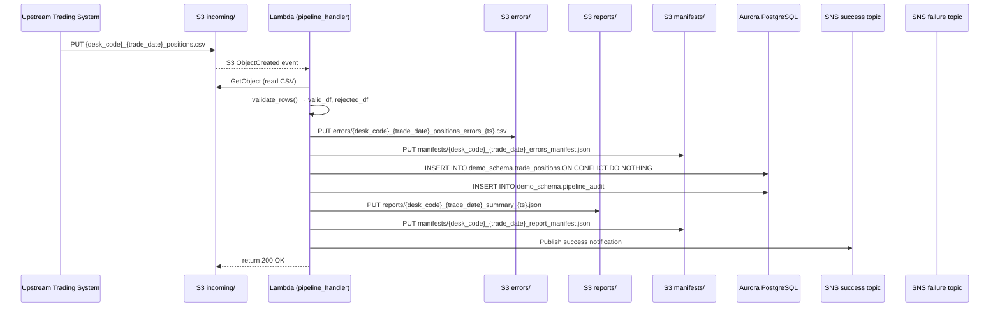
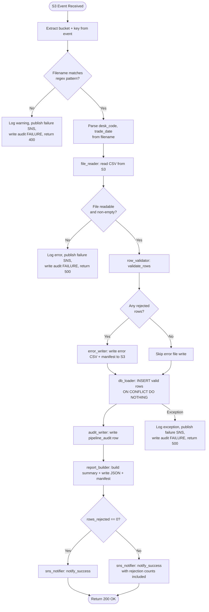

# Technical Design Document (TDD)
## Daily Trade Position Ingestion — Enterprise Risk Data Platform

**Project:** agentic-poc-sandbox
**Repo:** nartcr/agentic-poc-sandbox
**Team:** Sample Trade Operations
**Date:** June 2026
**Status:** Draft

---

## COMPONENTS

### 1. `pipeline_handler.py` — Lambda Entry Point and Orchestrator

**What it does:**
Serves as the AWS Lambda handler function. Receives the S3 event trigger when a new file is deposited under the `incoming/` prefix. Extracts the S3 bucket and key from the event, validates the filename matches the expected naming convention `{desk_code}_{trade_date}_positions.csv`, then orchestrates the full pipeline: file reading → validation → DB loading → report generation → audit writing → SNS notification. Catches all unhandled exceptions at the top level and dispatches a failure SNS notification with the error details before re-raising.

**Exact handler signature:**
```
def handler(event: dict, context: object) -> dict
```

**What it reads:**
- S3 event payload: `event["Records"][0]["s3"]["bucket"]["name"]` and `event["Records"][0]["s3"]["object"]["key"]`
- Filename parsed into `desk_code` and `trade_date` (YYYY-MM-DD) using regex: `^([A-Za-z0-9]+)_(\d{4}-\d{2}-\d{2})_positions\.csv$`

**What it writes:**
- Returns `{"statusCode": 200, "body": "OK"}` on success
- Returns `{"statusCode": 500, "body": "<error message>"}` on failure

**Satisfies:** BAC-1, BAC-5, BAC-6

---

### 2. `file_reader.py` — S3 CSV File Reader

**What it does:**
Downloads the CSV file from S3 and returns a raw pandas DataFrame with all columns as strings (dtype=str). Preserves original column names exactly as they appear in the file header. Logs the number of raw rows read. Raises a descriptive exception if the file cannot be read or is empty.

**Exact function signature:**
```
def read_position_file(bucket: str, key: str) -> pd.DataFrame
```

**What it reads:**
- S3 object at `s3://os.environ["S3_BUCKET"]/{key}`
- CSV format, comma-delimited, with header row
- Expected columns (may have extras, which are ignored): `trade_id`, `desk_code`, `trade_date`, `instrument_type`, `notional_amount`, `currency`, `counterparty_id`

**What it writes:**
- Returns `pd.DataFrame` with all columns as `str` dtype; no type coercion at this stage
- Raises `ValueError` if the file has zero data rows after header

**Satisfies:** BAC-1, BAC-6

---

### 3. `row_validator.py` — Row-Level Validation

**What it does:**
Accepts the raw DataFrame from `file_reader.py` and applies validation rules row-by-row. Splits rows into two DataFrames: `valid_df` and `rejected_df`. Each rejected row has an additional column `rejection_reason` (string) describing the first failing rule. Validation rules applied in order:

1. **Missing mandatory fields:** Any of `trade_id`, `desk_code`, `trade_date`, `instrument_type`, `notional_amount`, `currency`, `counterparty_id` is null, empty string, or whitespace-only → rejection reason: `"Missing mandatory field: {field_name}"`
2. **trade_date format:** Must parse as a valid date in `YYYY-MM-DD` format → rejection reason: `"Invalid trade_date format: {value}"`
3. **notional_amount numeric:** Must parse as a valid decimal number → rejection reason: `"Non-numeric notional_amount: {value}"`
4. **currency length:** Must be exactly 3 characters (after stripping whitespace) → rejection reason: `"Invalid currency length: {value}"`
5. **trade_id uniqueness within file:** Duplicate `(trade_id, desk_code, trade_date)` combinations within the same file — only the first occurrence is retained as valid, subsequent duplicates are rejected → rejection reason: `"Duplicate trade_id within file: {trade_id}"`

**Exact function signature:**
```
def validate_rows(df: pd.DataFrame) -> tuple[pd.DataFrame, pd.DataFrame]
# Returns (valid_df, rejected_df)
# rejected_df has all original columns plus: rejection_reason (str)
```

**What it reads:**
- `pd.DataFrame` with string-typed columns: `trade_id`, `desk_code`, `trade_date`, `instrument_type`, `notional_amount`, `currency`, `counterparty_id` (plus any extra columns)

**What it writes:**
- `valid_df`: `pd.DataFrame` with same schema as input, without `rejection_reason`
- `rejected_df`: `pd.DataFrame` with same schema as input plus `rejection_reason: str`

**Satisfies:** BAC-2, BAC-4

---

### 4. `error_writer.py` — Rejected Row Error File Writer

**What it does:**
Accepts the `rejected_df` DataFrame and writes it as a CSV to S3 under the `errors/` prefix. The output key follows the pattern: `errors/{desk_code}_{trade_date}_positions_errors_{timestamp_et}.csv`. The timestamp is formatted as `YYYYMMDD_HHMMSS` in ET (America/Toronto). If `rejected_df` is empty, no file is written and the function returns `None`. Returns the full S3 key of the written error file on success.

Also writes a manifest file at: `manifests/{desk_code}_{trade_date}_errors_manifest.json`
Manifest schema:
```json
{
  "source_file": "{desk_code}_{trade_date}_positions.csv",
  "error_file_key": "errors/{desk_code}_{trade_date}_positions_errors_{timestamp_et}.csv",
  "generated_at_et": "YYYY-MM-DDTHH:MM:SS-05:00",
  "row_count": 42
}
```

**Exact function signature:**
```
def write_error_file(
    rejected_df: pd.DataFrame,
    desk_code: str,
    trade_date: str,
    bucket: str
) -> str | None
```

**What it reads:**
- `rejected_df`: columns include all original file columns plus `rejection_reason`

**What it writes:**
- S3 key: `errors/{desk_code}_{trade_date}_positions_errors_{YYYYMMDD_HHMMSS}.csv`
- CSV format, comma-delimited, with header
- S3 key: `manifests/{desk_code}_{trade_date}_errors_manifest.json`

**Satisfies:** BAC-2, BAC-7

---

### 5. `db_loader.py` — Validated Row Database Loader

**What it does:**
Accepts the `valid_df` DataFrame, connects to Aurora PostgreSQL using credentials from Secrets Manager, and inserts all valid rows into `demo_schema.trade_positions` using `INSERT ... ON CONFLICT (trade_id, desk_code, trade_date) DO NOTHING`. Returns the count of rows actually inserted (as reported by `cursor.rowcount` summed across batches). Processes in batches of 1,000 rows using `executemany`. Type-coerces columns before insert: `trade_date` → `datetime.date`, `notional_amount` → `Decimal`. Sets `loaded_at` to `NOW()` at the database level (relies on column default).

**Exact function signature:**
```
def load_positions(valid_df: pd.DataFrame) -> int
# Returns count of rows inserted (skipped duplicates not counted)
```

**What it reads:**
- `valid_df` columns: `trade_id (str)`, `desk_code (str)`, `trade_date (str → date)`, `instrument_type (str)`, `notional_amount (str → Decimal)`, `currency (str)`, `counterparty_id (str)`
- Secrets from Secrets Manager via `os.environ["DB_SECRET_ID"]` (value: `agentic-poc-aurora`)

**What it writes:**
- Rows to `demo_schema.trade_positions`:
  - `trade_id VARCHAR(100)`
  - `desk_code VARCHAR(50)`
  - `trade_date DATE`
  - `instrument_type VARCHAR(100)`
  - `notional_amount NUMERIC(20,4)`
  - `currency CHAR(3)`
  - `counterparty_id VARCHAR(100)`
  - `loaded_at TIMESTAMPTZ` — set by DB default `now()`

**SQL pattern:**
```sql
INSERT INTO demo_schema.trade_positions
    (trade_id, desk_code, trade_date, instrument_type, notional_amount, currency, counterparty_id)
VALUES %s
ON CONFLICT (trade_id, desk_code, trade_date) DO NOTHING
```

**Satisfies:** BAC-1, BAC-3, BAC-6

---

### 6. `report_builder.py` — Post-Load Summary Report Builder

**What it does:**
Accepts the raw DataFrame (all rows), `valid_df`, `rejected_df`, and processing metadata. Computes the full summary report as a Python dict, serializes it to JSON, writes it to S3 under `reports/`, and also writes a manifest at `manifests/{desk_code}_{trade_date}_report_manifest.json`.

**Exact function signature:**
```
def build_and_write_report(
    raw_df: pd.DataFrame,
    valid_df: pd.DataFrame,
    rejected_df: pd.DataFrame,
    desk_code: str,
    trade_date: str,
    rows_inserted: int,
    processing_timestamp_et: datetime,
    bucket: str
) -> dict
# Returns the report dict (also written to S3 as JSON)
```

**Report JSON structure:**
```json
{
  "source_file": "{desk_code}_{trade_date}_positions.csv",
  "desk_code": "...",
  "trade_date": "YYYY-MM-DD",
  "processing_timestamp_et": "YYYY-MM-DDTHH:MM:SS-05:00",
  "total_rows_received": 1000,
  "rows_successfully_loaded": 950,
  "rows_rejected": 50,
  "rows_skipped_duplicate": 5,
  "record_counts_by_desk_code": {"DESK_A": 950},
  "notional_amount_min": "1000.0000",
  "notional_amount_max": "9999999.0000",
  "null_rates_by_column": {
    "trade_id": 0.0,
    "desk_code": 0.0,
    "trade_date": 0.0,
    "instrument_type": 0.02,
    "notional_amount": 0.0,
    "currency": 0.0,
    "counterparty_id": 0.01
  }
}
```

Note: `rows_skipped_duplicate` = `len(valid_df) - rows_inserted` (rows that passed validation but were already in DB).

**What it writes:**
- S3 key: `reports/{desk_code}_{trade_date}_summary_{YYYYMMDD_HHMMSS}.json`
- S3 key: `manifests/{desk_code}_{trade_date}_report_manifest.json`

Manifest schema:
```json
{
  "source_file": "{desk_code}_{trade_date}_positions.csv",
  "report_key": "reports/{desk_code}_{trade_date}_summary_{YYYYMMDD_HHMMSS}.json",
  "generated_at_et": "YYYY-MM-DDTHH:MM:SS-05:00"
}
```

**Satisfies:** BAC-4, BAC-7

---

### 7. `audit_writer.py` — Pipeline Audit Trail Writer

**What it does:**
Inserts one row into `demo_schema.pipeline_audit` after each file processing attempt (whether successful or failed). Uses the Aurora connection (same credentials as `db_loader.py`). The `processing_timestamp_et` column stores the ET timestamp as a `TIMESTAMPTZ` value.

**Exact function signature:**
```
def write_audit_record(
    filename: str,
    desk_code: str | None,
    trade_date: str | None,
    status: str,           # "SUCCESS" | "PARTIAL" | "FAILURE"
    total_rows: int,
    rows_inserted: int,
    rows_rejected: int,
    error_message: str | None,
    processing_timestamp_et: datetime
) -> None
```

**SQL:**
```sql
INSERT INTO demo_schema.pipeline_audit
    (filename, desk_code, trade_date, status, total_rows,
     rows_inserted, rows_rejected, error_message, processing_timestamp_et)
VALUES (%s, %s, %s, %s, %s, %s, %s, %s, %s)
```

**What it writes:**
- One row to `demo_schema.pipeline_audit`

**Satisfies:** BAC-4, BAC-7, BAC-8 (via BRD §3.3 audit trail)

---

### 8. `sns_notifier.py` — SNS Notification Publisher

**What it does:**
Publishes SNS messages to either the success or failure topic. Two public functions:

```
def notify_success(report: dict) -> None
def notify_failure(filename: str, error: str, desk_code: str | None, trade_date: str | None) -> None
```

`notify_success` publishes to `os.environ["SNS_SUCCESS_ARN"]` (value: `arn:aws:sns:us-east-1:533266968934:agentic-poc-success`).
`notify_failure` publishes to `os.environ["SNS_FAILURE_ARN"]` (value: `arn:aws:sns:us-east-1:533266968934:agentic-poc-failure`).

Success message JSON:
```json
{
  "event": "POSITION_LOAD_SUCCESS",
  "source_file": "...",
  "desk_code": "...",
  "trade_date": "YYYY-MM-DD",
  "processing_timestamp_et": "YYYY-MM-DDTHH:MM:SS-05:00",
  "total_rows_received": 1000,
  "rows_successfully_loaded": 950,
  "rows_rejected": 50
}
```

Failure message JSON:
```json
{
  "event": "POSITION_LOAD_FAILURE",
  "source_file": "...",
  "desk_code": "...",
  "trade_date": "...",
  "error": "...",
  "processing_timestamp_et": "YYYY-MM-DDTHH:MM:SS-05:00"
}
```

**Satisfies:** BAC-5

---

### 9. `secrets_client.py` — Secrets Manager Credential Fetcher

**What it does:**
Retrieves and parses the database credentials JSON from AWS Secrets Manager. Caches the result in a module-level variable so subsequent calls within the same Lambda invocation do not make additional API calls. Raises a `RuntimeError` with a safe message if retrieval fails (does not expose secret values in logs).

**Exact function signature:**
```
def get_db_credentials(secret_id: str) -> dict
# Returns dict with keys: host, port, dbname, username, password
```

**What it reads:**
- Secrets Manager secret identified by `os.environ["DB_SECRET_ID"]` (value: `agentic-poc-aurora`)
- Expected JSON keys: `host`, `port`, `dbname`, `username`, `password`

**What it writes:**
- Nothing persisted; returns the parsed credential dict to callers

**Satisfies:** BAC-8

---

### 10. `db_connection.py` — Database Connection Factory

**What it does:**
Provides a context manager that opens and closes a `psycopg2` connection to Aurora PostgreSQL. Uses credentials returned by `secrets_client.get_db_credentials()`. The context manager commits on clean exit and rolls back on exception.

**Exact function signature:**
```
def get_connection(secret_id: str) -> ContextManager[psycopg2.extensions.connection]
```

Usage pattern:
```python
with get_connection(os.environ["DB_SECRET_ID"]) as conn:
    # use conn
```

**Satisfies:** BAC-1, BAC-3, BAC-8

---

## AWS SERVICES

| Service | Role |
|---|---|
| **AWS S3** | Stores incoming position CSV files (under `incoming/`), error files (under `errors/`), summary reports (under `reports/`), and manifest files (under `manifests/`). Acts as the event source that triggers Lambda. |
| **AWS Lambda** | Executes the full ingestion pipeline per file. Triggered by S3 `ObjectCreated` events on the `incoming/` prefix. Function name: `agentic-poc-sandbox-qa`. |
| **AWS Secrets Manager** | Stores Aurora database credentials under secret ID `agentic-poc-aurora`. Retrieved at Lambda runtime by `secrets_client.py`. |
| **Amazon Aurora PostgreSQL** | Reporting database. Houses `demo_schema.trade_positions` (position records) and `demo_schema.pipeline_audit` (processing audit trail). Accessed via `psycopg2`. |
| **Amazon SNS** | Publishes success and failure notifications to downstream systems. Two topics: `agentic-poc-success` and `agentic-poc-failure`. |
| **AWS IAM** | Lambda execution role grants least-privilege access: S3 read/write on `agentic-poc-533266968934`, Secrets Manager `GetSecretValue` on `agentic-poc-aurora`, SNS `Publish` on both topics, Aurora VPC network access. |

---

## DATA CONTRACTS

### Database Tables

#### `demo_schema.trade_positions`

| Column | Type | Nullable | Constraint / Default |
|---|---|---|---|
| `trade_id` | `VARCHAR(100)` | NOT NULL | Part of primary key |
| `desk_code` | `VARCHAR(50)` | NOT NULL | Part of primary key |
| `trade_date` | `DATE` | NOT NULL | Part of primary key |
| `instrument_type` | `VARCHAR(100)` | NOT NULL | |
| `notional_amount` | `NUMERIC(20,4)` | NOT NULL | |
| `currency` | `CHAR(3)` | NOT NULL | |
| `counterparty_id` | `VARCHAR(100)` | NOT NULL | |
| `loaded_at` | `TIMESTAMPTZ` | NOT NULL | `DEFAULT now()` |

- **Primary Key:** `(trade_id, desk_code, trade_date)`
- **Unique Constraint:** same as primary key — used by `ON CONFLICT DO NOTHING` for idempotent inserts
- **Index:** Primary key index on `(trade_id, desk_code, trade_date)` (auto-created by PK)

---

#### `demo_schema.pipeline_audit`

| Column | Type | Nullable | Constraint / Default |
|---|---|---|---|
| `audit_id` | `BIGSERIAL` | NOT NULL | Primary key, auto-increment |
| `filename` | `VARCHAR(255)` | NOT NULL | |
| `desk_code` | `VARCHAR(50)` | NULL | |
| `trade_date` | `DATE` | NULL | |
| `status` | `VARCHAR(20)` | NOT NULL | One of: `SUCCESS`, `PARTIAL`, `FAILURE` |
| `total_rows` | `INTEGER` | NOT NULL | `DEFAULT 0` |
| `rows_inserted` | `INTEGER` | NOT NULL | `DEFAULT 0` |
| `rows_rejected` | `INTEGER` | NOT NULL | `DEFAULT 0` |
| `error_message` | `TEXT` | NULL | |
| `processing_timestamp_et` | `TIMESTAMPTZ` | NOT NULL | |
| `created_at` | `TIMESTAMPTZ` | NOT NULL | `DEFAULT now()` |

- **Primary Key:** `(audit_id)`

---

### S3 Paths

| Path Pattern | Format | Description |
|---|---|---|
| `incoming/{desk_code}_{trade_date}_positions.csv` | CSV, comma-delimited, with header | Input files deposited by upstream trading systems |
| `errors/{desk_code}_{trade_date}_positions_errors_{YYYYMMDD_HHMMSS}.csv` | CSV, comma-delimited, with header | Rejected rows with `rejection_reason` column appended |
| `reports/{desk_code}_{trade_date}_summary_{YYYYMMDD_HHMMSS}.json` | JSON | Post-load summary report |
| `manifests/{desk_code}_{trade_date}_errors_manifest.json` | JSON | Maps logical error file to actual timestamped S3 key |
| `manifests/{desk_code}_{trade_date}_report_manifest.json` | JSON | Maps logical report file to actual timestamped S3 key |

All S3 operations use `os.environ["S3_BUCKET"]` (value: `agentic-poc-533266968934`).

**Input CSV Column Order (expected header row):**
```
trade_id,desk_code,trade_date,instrument_type,notional_amount,currency,counterparty_id
```
Additional columns beyond these 7 are tolerated but ignored.

**Error CSV Schema (all string columns):**
```
trade_id, desk_code, trade_date, instrument_type, notional_amount, currency, counterparty_id, [any extra columns from source], rejection_reason
```

---

### Secrets Manager

**Env var:** `DB_SECRET_ID` = `agentic-poc-aurora`

**Expected JSON keys in secret:**
```json
{
  "host": "...",
  "port": 5432,
  "dbname": "app",
  "username": "...",
  "password": "..."
}
```

---

### SNS Topics

**Success Topic:**
- Env var: `SNS_SUCCESS_ARN`
- Value: `arn:aws:sns:us-east-1:533266968934:agentic-poc-success`
- Message format:
```json
{
  "event": "POSITION_LOAD_SUCCESS",
  "source_file": "{desk_code}_{trade_date}_positions.csv",
  "desk_code": "string",
  "trade_date": "YYYY-MM-DD",
  "processing_timestamp_et": "YYYY-MM-DDTHH:MM:SS±HH:MM",
  "total_rows_received": "integer",
  "rows_successfully_loaded": "integer",
  "rows_rejected": "integer"
}
```

**Failure Topic:**
- Env var: `SNS_FAILURE_ARN`
- Value: `arn:aws:sns:us-east-1:533266968934:agentic-poc-failure`
- Message format:
```json
{
  "event": "POSITION_LOAD_FAILURE",
  "source_file": "string",
  "desk_code": "string or null",
  "trade_date": "string or null",
  "error": "string",
  "processing_timestamp_et": "YYYY-MM-DDTHH:MM:SS±HH:MM"
}
```

---

### Environment Variables (Lambda configuration)

| Variable | Value | Used by |
|---|---|---|
| `S3_BUCKET` | `agentic-poc-533266968934` | `file_reader.py`, `error_writer.py`, `report_builder.py` |
| `DB_SECRET_ID` | `agentic-poc-aurora` | `secrets_client.py`, `db_loader.py`, `audit_writer.py` |
| `SNS_SUCCESS_ARN` | `arn:aws:sns:us-east-1:533266968934:agentic-poc-success` | `sns_notifier.py` |
| `SNS_FAILURE_ARN` | `arn:aws:sns:us-east-1:533266968934:agentic-poc-failure` | `sns_notifier.py` |

---

## DATA FLOW

### End-to-End Pipeline Flow



---

### Decision Flow Within Lambda Handler



---

### Validation Algorithm

```
Algorithm: validate_rows(df)

Input:  raw DataFrame with all-string columns
Output: (valid_df, rejected_df)

MANDATORY_FIELDS = [trade_id, desk_code, trade_date, instrument_type,
                    notional_amount, currency, counterparty_id]

Initialize:
  valid_rows = []
  rejected_rows = []
  seen_keys = set()

For each row in df:
  rejection_reason = None

  // Rule 1: Missing mandatory fields
  For each field in MANDATORY_FIELDS:
    if row[field] is null OR strip(row[field]) == "":
      rejection_reason = "Missing mandatory field: {field}"
      break

  // Rule 2: trade_date format (only if Rule 1 passed)
  if rejection_reason is None:
    if not parseable as YYYY-MM-DD date:
      rejection_reason = "Invalid trade_date format: {value}"

  // Rule 3: notional_amount numeric (only if Rule 2 passed)
  if rejection_reason is None:
    if not parseable as Decimal:
      rejection_reason = "Non-numeric notional_amount: {value}"

  // Rule 4: currency length (only if Rule 3 passed)
  if rejection_reason is None:
    if len(strip(currency)) != 3:
      rejection_reason = "Invalid currency length: {value}"

  // Rule 5: intra-file duplicate check (only if Rule 4 passed)
  if rejection_reason is None:
    key = (trade_id, desk_code, trade_date)
    if key in seen_keys:
      rejection_reason = "Duplicate trade_id within file: {trade_id}"
    else:
      seen_keys.add(key)

  if rejection_reason is None:
    valid_rows.append(row)
  else:
    rejected_rows.append(row + {rejection_reason: rejection_reason})

Return (DataFrame(valid_rows), DataFrame(rejected_rows))
```

---

### Null Rate Computation (for report)

```
Algorithm: compute_null_rates(raw_df, columns)

For each column in columns:
  null_count = count of rows where value is null OR strip(value) == ""
  null_rate[column] = null_count / len(raw_df)   // 0.0 to 1.0, 4 decimal places

Return null_rate dict
```

---

## TECHNICAL ACCEPTANCE CRITERIA

**TAC-1 — All valid positions loaded before morning risk run**
- `db_loader.load_positions()` uses `executemany` in batches of 1,000 rows and returns the total inserted count.
- Acceptance test: ingest a 10,000-row file and assert that `SELECT COUNT(*) FROM demo_schema.trade_positions WHERE desk_code = :desk_code AND trade_date = :trade_date` equals the number of valid (non-duplicate) rows in the file, and that total wall-clock time is < 60 seconds.
- `pipeline_audit.status` must be `"SUCCESS"` or `"PARTIAL"` (never `"FAILURE"`) for the row to be counted as processed.

**TAC-2 — Invalid records flagged with clear rejection reasons**
- `row_validator.validate_rows()` appends a `rejection_reason` column to every rejected row.
- `error_writer.write_error_file()` writes the rejected rows (with `rejection_reason`) to `errors/{desk_code}_{trade_date}_positions_errors_{ts}.csv`.
- Acceptance test: inject a file containing rows with known violations (null field, bad date, non-numeric amount, wrong currency length, intra-file duplicate); assert the error CSV contains one row per violation with the correct `rejection_reason` string matching the patterns defined in `row_validator.py`.

**TAC-3 — Resubmission does not double-count positions**
- `db_loader.load_positions()` executes:
  ```sql
  INSERT INTO demo_schema.trade_positions (trade_id, desk_code, trade_date, ...)
  VALUES %s
  ON CONFLICT (trade_id, desk_code, trade_date) DO NOTHING
  ```
- Acceptance test: process the same CSV file twice; assert `SELECT COUNT(*) FROM demo_schema.trade_positions WHERE desk_code = :desk AND trade_date = :date` is identical after both runs. Assert `rows_inserted` for the second run's `pipeline_audit` row is 0.

**TAC-4 — Summary report accurately reflects received/accepted/rejected counts**
- `report_builder.build_and_write_report()` computes:
  - `total_rows_received = len(raw_df)`
  - `rows_successfully_loaded = rows_inserted` (from `db_loader`)
  - `rows_rejected = len(rejected_df)`
  - `rows_skipped_duplicate = len(valid_df) - rows_inserted`
  - `record_counts_by_desk_code`: from `valid_df.groupby("desk_code").size().to_dict()`
  - `notional_amount_min` and `notional_amount_max`: from `valid_df["notional_amount"].astype(Decimal)` min/max
  - `null_rates_by_column`: per the null rate algorithm above
- Acceptance test: process a file with known composition (e.g. 100 rows: 80 valid, 20 rejected, 5 valid rows already in DB); assert the report JSON fields match the expected values exactly.
- `pipeline_audit` row `total_rows` must equal `report["total_rows_received"]`; `rows_inserted` must equal `report["rows_successfully_loaded"]`; `rows_rejected` must equal `report["rows_rejected"]`.

**TAC-5 — Downstream pipeline notified automatically without manual trigger**
- `sns_notifier.notify_success()` is called from `pipeline_handler.handler()` on every successful file completion (even if some rows were rejected).
- `sns_notifier.notify_failure()` is called on any unhandled exception before re-raising.
- Acceptance test: mock SNS client; assert `publish()` is called exactly once per file with the correct `TopicArn` (success vs. failure) and that the message body deserializes to a dict with `event` equal to `"POSITION_LOAD_SUCCESS"` or `"POSITION_LOAD_FAILURE"`.

**TAC-6 — Processing completes within 60 seconds for 10,000-row files**
- `db_loader.load_positions()` uses `psycopg2.extras.execute_values` with `page_size=1000`.
- Acceptance test: benchmark ingestion of a synthetic 10,000-row CSV; assert end-to-end wall-clock time < 60 seconds. Assert no `MemoryError` on a synthetic 100,000-row file.

**TAC-7 — All timestamps in Eastern Time (America/Toronto)**
- `pipeline_handler.py` captures `processing_timestamp_et = datetime.now(pytz.timezone("America/Toronto"))` as the first action.
- This timestamp is passed to `audit_writer.write_audit_record()`, `report_builder.build_and_write_report()`, and `sns_notifier.notify_success()`/`notify_failure()`.
- All ISO 8601 timestamp strings in reports and SNS messages use `.isoformat()` on the ET-aware datetime.
- `pipeline_audit.processing_timestamp_et` stores this ET-aware value as `TIMESTAMPTZ`.
- Acceptance test: assert that `processing_timestamp_et` values in the audit table and report JSON have UTC offset `-05:00` (EST) or `-04:00` (EDT) — never `+00:00`.

**TAC-8 — No credentials in code or config files**
- `secrets_client.get_db_credentials()` reads `os.environ["DB_SECRET_ID"]` and calls `boto3.client("secretsmanager").get_secret_value(SecretId=secret_id)`.
- No `host`, `port`, `username`, `password`, or connection string literals appear anywhere in source code.
- Acceptance test (static analysis): `grep -r "password\s*=" src/` and `grep -r "host\s*=" src/` must return zero matches in non-comment, non-docstring lines (verified by a regex-based linting test).

---

## OPEN QUESTIONS

**OQ-1 — Status classification for partial loads**
The BRD defines success and failure notifications but does not specify how to classify a file where some rows are valid (and inserted) and some rows are rejected. Should such a run be recorded as `"SUCCESS"`, `"PARTIAL"`, or `"FAILURE"` in `pipeline_audit.status`? And should a partial load trigger the success SNS topic, the failure topic, or both?

This affects `audit_writer.py` status logic and `sns_notifier.py` routing in `pipeline_handler.py`.

**OQ-2 — Behaviour when the incoming file contains zero valid rows**
If every row in the file is rejected (100% rejection rate), should the pipeline:
(a) Write the audit record as `"FAILURE"` and publish to the failure SNS topic, or
(b) Write the audit record as `"PARTIAL"` and publish to the success SNS topic with `rows_successfully_loaded = 0`?

This requires a business decision since it affects whether the downstream risk pipeline is triggered or not.

---

## ASSUMPTIONS

1. **Lambda trigger is S3 ObjectCreated on `incoming/` prefix.** The Lambda function `agentic-poc-sandbox-qa` is already configured with an S3 trigger on bucket `agentic-poc-533266968934` for `ObjectCreated` events matching prefix `incoming/`. No new infrastructure is being created.

2. **Database tables already exist.** `demo_schema.trade_positions` and `demo_schema.pipeline_audit` are already provisioned in the Aurora database `app`. The pipeline code does not run DDL (no `CREATE TABLE`).

3. **Partial loads (some valid + some rejected) publish to the success SNS topic.** Since valid records are available for the risk run, the downstream pipeline should be triggered. The rejection details are visible in the error file and the report. This will be revised if OQ-1 is answered differently.

4. **Zero-valid-rows files publish to the failure SNS topic and record status as `"FAILURE"`.** A file with 100% rejection rate means no positions are available, which is functionally equivalent to a failure from the downstream pipeline's perspective. This will be revised if OQ-2 is answered differently.

5. **`psycopg2` is available as a Lambda dependency.** The Lambda deployment package includes `psycopg2-binary` (or a Lambda layer provides it).

6. **Aurora is accessible from Lambda via VPC.** Lambda is deployed in the same VPC (or a peered VPC) as the Aurora cluster. Security groups permit inbound PostgreSQL traffic from the Lambda security group. This is an existing infrastructure concern.

7. **The `incoming/` prefix is exclusive to position files.** No other file types are deposited under `incoming/`. If non-position files are inadvertently placed there, the filename regex check in `pipeline_handler.py` will reject them with a logged warning and failure notification, but will not crash.

8. **Manifest files are overwritten on reprocessing.** If the same `{desk_code}_{trade_date}` file is reprocessed (idempotent resubmission), the manifest files at `manifests/{desk_code}_{trade_date}_errors_manifest.json` and `manifests/{desk_code}_{trade_date}_report_manifest.json` are overwritten to point to the latest run's timestamped output files.

9. **`trade_date` in the filename is always `YYYY-MM-DD` format.** Files not matching this exact date format in the filename are rejected at the handler level before any processing.

10. **Null rate is computed over the raw input DataFrame** (all rows including rejected ones), not just valid rows, to give the operations team an accurate view of data quality as received.

11. **The `loaded_at` column in `demo_schema.trade_positions` is populated by the database `DEFAULT now()`** and is not set explicitly by the application insert statement.

12. **Concurrent executions are not expected for the same `(desk_code, trade_date)` key.** Each trading desk delivers exactly one file per day. If two files for the same desk/date arrive simultaneously, the `ON CONFLICT DO NOTHING` constraint prevents duplicates, but the audit trail may show two runs. No advisory locking is implemented.

13. **SNS message attribute `MessageGroupId` is not required.** The SNS topics are standard (not FIFO), so no message ordering or deduplication at the SNS level is needed.