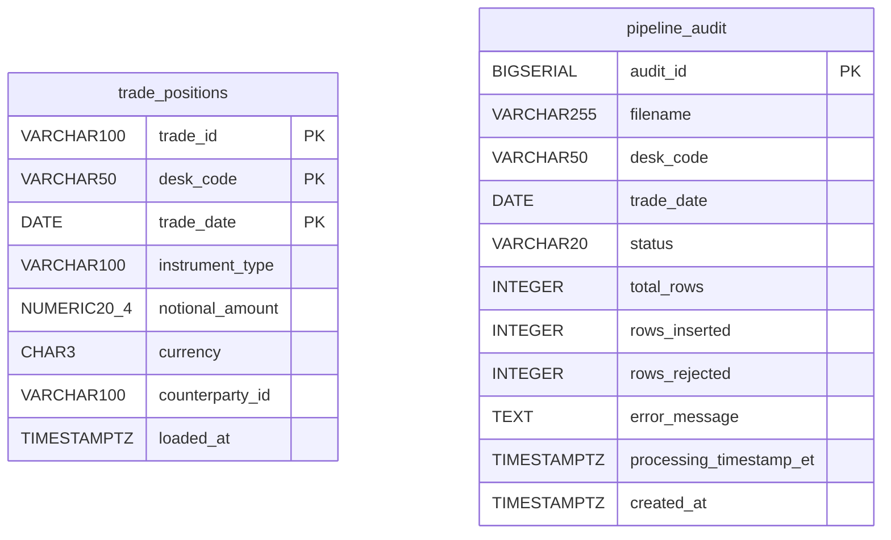
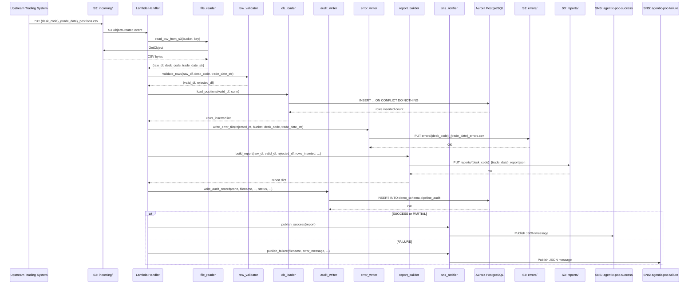
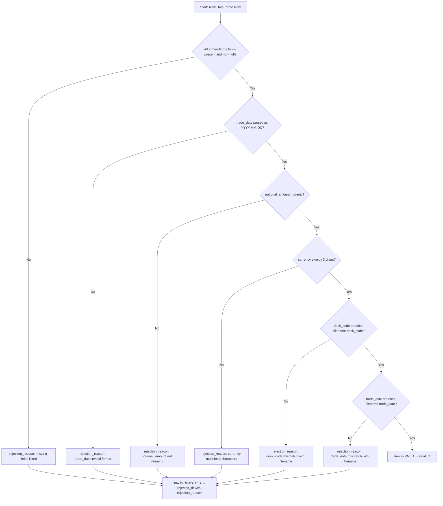
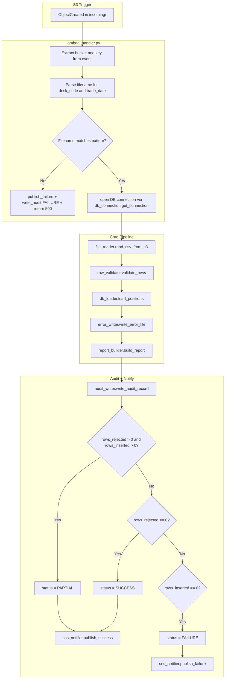

# Technical Design Document
## Daily Trade Position Ingestion — Enterprise Risk Data Platform

---

### COMPONENTS

---

#### `lambda_handler.py`
**Entry point for the AWS Lambda function.**

Function signature:
```
def handler(event: dict, context: object) -> dict
```

- **What it does:** Receives an S3 event notification (object created in `incoming/` prefix). Extracts the S3 bucket name and object key from the event. Orchestrates the full pipeline: calls `file_reader.read_csv_from_s3()`, then `row_validator.validate_rows()`, then `db_loader.load_positions()`, then `report_builder.build_report()`, then `sns_notifier.publish_success()` or `sns_notifier.publish_failure()`. Writes the final audit record via `audit_writer.write_audit_record()`. Catches all unhandled exceptions and calls `sns_notifier.publish_failure()` with the error details before re-raising.
- **Reads:** S3 event dict from Lambda invocation — `event["Records"][0]["s3"]["bucket"]["name"]` and `event["Records"][0]["s3"]["object"]["key"]`.
- **Writes:** Returns a dict `{"statusCode": 200, "body": "<summary>"}` on success; `{"statusCode": 500, "body": "<error>"}` on failure.
- **Satisfies:** BAC-1, BAC-5, BAC-6, BAC-7, BAC-8

---

#### `file_reader.py`
**Reads and parses the incoming CSV from S3.**

Function signature:
```
def read_csv_from_s3(bucket: str, key: str) -> tuple[pd.DataFrame, str, str]
```

- **What it does:** Uses `boto3.client("s3")` to fetch the object at `s3://bucket/key`. Reads the content as UTF-8 text and parses it into a pandas DataFrame using `pd.read_csv()`. Extracts `desk_code` and `trade_date` from the filename using the pattern `{desk_code}_{trade_date}_positions.csv` via regex `^([A-Za-z0-9]+)_(\d{4}-\d{2}-\d{2})_positions\.csv$`. Returns `(dataframe, desk_code, trade_date_str)`.
- **Reads:** S3 object at `s3://os.environ["S3_BUCKET"]/incoming/{desk_code}_{trade_date}_positions.csv`. CSV columns expected (not guaranteed): `trade_id`, `desk_code`, `trade_date`, `instrument_type`, `notional_amount`, `currency`, `counterparty_id`.
- **Writes:** Returns a pandas DataFrame (raw, unvalidated) and the parsed metadata strings.
- **Satisfies:** BAC-1, BAC-6

---

#### `row_validator.py`
**Validates each row against mandatory field and type rules.**

Function signature:
```
def validate_rows(df: pd.DataFrame, desk_code: str, trade_date_str: str) -> tuple[pd.DataFrame, pd.DataFrame]
```

- **What it does:** Applies validation rules to each row of the input DataFrame. A row is **valid** if and only if:
  1. All seven mandatory fields are present and non-null/non-empty: `trade_id`, `desk_code`, `trade_date`, `instrument_type`, `notional_amount`, `currency`, `counterparty_id`.
  2. `trade_date` parses as a valid `YYYY-MM-DD` date.
  3. `notional_amount` is numeric (coercible to float, not NaN).
  4. `currency` is exactly 3 characters.
  5. `trade_id` is non-empty string.
  6. `desk_code` matches the desk_code parsed from the filename.
  7. `trade_date` value in the row matches `trade_date_str` parsed from the filename.
- **Invalid rows** receive a `rejection_reason` column populated with a semicolon-separated list of specific failure messages (e.g., `"notional_amount: not numeric; currency: must be 3 characters"`).
- Returns `(valid_df, rejected_df)` where `rejected_df` includes all original columns plus `rejection_reason`.
- **Reads:** Raw pandas DataFrame from `file_reader.read_csv_from_s3()`.
- **Writes:** Two DataFrames — `valid_df` (schema matches DB columns) and `rejected_df` (all input columns + `rejection_reason: str`).
- **Satisfies:** BAC-2, BAC-4

---

#### `db_loader.py`
**Loads validated rows into `demo_schema.trade_positions` with idempotent upsert logic.**

Function signature:
```
def load_positions(valid_df: pd.DataFrame, conn) -> int
```

- **What it does:** Iterates over rows in `valid_df` and executes a batch `INSERT INTO demo_schema.trade_positions (trade_id, desk_code, trade_date, instrument_type, notional_amount, currency, counterparty_id) VALUES %s ON CONFLICT (trade_id, desk_code, trade_date) DO NOTHING` using `psycopg2.extras.execute_values()`. Returns the count of rows actually inserted (i.e., rows not skipped due to conflict). The count is derived by comparing `cursor.rowcount` after the batch insert — specifically, using `cursor.rowcount` from `execute_values` after setting `fetch=False`. Because `ON CONFLICT DO NOTHING` makes rowcount unreliable across drivers, the implementation queries row count pre- and post-insert: `SELECT COUNT(*) FROM demo_schema.trade_positions WHERE (trade_id, desk_code, trade_date) IN (...)` before and after, and returns the delta.
- **Reads:** Validated pandas DataFrame with columns `trade_id`, `desk_code`, `trade_date`, `instrument_type`, `notional_amount`, `currency`, `counterparty_id`. Active `psycopg2` connection object.
- **Writes:** Rows into `demo_schema.trade_positions`. Returns `int` (rows inserted).
- **Satisfies:** BAC-1, BAC-3

---

#### `error_writer.py`
**Writes rejected rows to the S3 errors prefix as a CSV file.**

Function signature:
```
def write_error_file(rejected_df: pd.DataFrame, bucket: str, desk_code: str, trade_date_str: str) -> str
```

- **What it does:** Converts `rejected_df` to CSV (including `rejection_reason` column). Uploads to S3 at key `errors/{desk_code}_{trade_date_str}_errors.csv` using `boto3.client("s3").put_object()`. Returns the full S3 key of the uploaded error file. If `rejected_df` is empty, still writes an empty file to confirm no errors.
- **Reads:** `rejected_df` DataFrame with columns: all input columns + `rejection_reason`.
- **Writes:** S3 object at `s3://os.environ["S3_BUCKET"]/errors/{desk_code}_{trade_date_str}_errors.csv` (UTF-8 CSV).
- **Satisfies:** BAC-2

---

#### `report_builder.py`
**Builds the post-load summary report and writes it to S3.**

Function signature:
```
def build_report(
    raw_df: pd.DataFrame,
    valid_df: pd.DataFrame,
    rejected_df: pd.DataFrame,
    rows_inserted: int,
    desk_code: str,
    trade_date_str: str,
    bucket: str
) -> dict
```

- **What it does:** Computes the following statistics and assembles a report dict:
  - `total_rows`: `len(raw_df)`
  - `rows_validated`: `len(valid_df)`
  - `rows_inserted`: `rows_inserted` (from db_loader)
  - `rows_rejected`: `len(rejected_df)`
  - `processing_timestamp_et`: current timestamp in `America/Toronto` timezone, formatted as ISO 8601 string.
  - `desk_code_counts`: dict of `{desk_code: count}` from `valid_df.groupby("desk_code").size()`.
  - `min_notional`: `float(valid_df["notional_amount"].min())` — `None` if valid_df is empty.
  - `max_notional`: `float(valid_df["notional_amount"].max())` — `None` if valid_df is empty.
  - `null_rates`: dict of `{column_name: null_rate_as_float}` for each of the 7 mandatory columns in `raw_df`, computed as `raw_df[col].isnull().mean()`.
  - Serializes the report dict as JSON and uploads to `s3://os.environ["S3_BUCKET"]/reports/{desk_code}_{trade_date_str}_report.json` via `boto3.client("s3").put_object()`.
- **Reads:** Raw, valid, and rejected DataFrames; scalar counts; metadata strings.
- **Writes:** S3 object at `s3://os.environ["S3_BUCKET"]/reports/{desk_code}_{trade_date_str}_report.json`. Returns the report dict.
- **Satisfies:** BAC-4, BAC-7

---

#### `audit_writer.py`
**Writes one row to `demo_schema.pipeline_audit` per file processed.**

Function signature:
```
def write_audit_record(
    conn,
    filename: str,
    desk_code: str,
    trade_date_str: str,
    status: str,
    total_rows: int,
    rows_inserted: int,
    rows_rejected: int,
    error_message: str | None
) -> None
```

- **What it does:** Inserts a single record into `demo_schema.pipeline_audit` with the provided values. `processing_timestamp_et` is set to `NOW()` in the query (server-side timestamp) but the `audit_writer` also passes the ET timestamp from `pytz.timezone("America/Toronto")` to ensure the stored value reflects ET. `status` must be one of `"SUCCESS"`, `"PARTIAL"` (rows loaded but some rejected), or `"FAILURE"`. `error_message` is `NULL` for success/partial. Commits the transaction independently of the main load transaction so audit records persist even if the load is rolled back.
- **Reads:** Active `psycopg2` connection; all scalar parameters listed above.
- **Writes:** One row to `demo_schema.pipeline_audit`.
- **Satisfies:** BAC-4, BAC-7, BAC-8

---

#### `sns_notifier.py`
**Publishes success and failure notifications to SNS topics.**

Function signatures:
```
def publish_success(report: dict) -> None
def publish_failure(filename: str, error_message: str, desk_code: str | None, trade_date_str: str | None) -> None
```

- **What it does:**
  - `publish_success`: Publishes a JSON message to the SNS topic at `os.environ["SNS_SUCCESS_TOPIC_ARN"]`. Message body is the full report dict serialized as JSON (see Data Contracts for exact structure).
  - `publish_failure`: Publishes a JSON message to the SNS topic at `os.environ["SNS_FAILURE_TOPIC_ARN"]`. Message body contains `filename`, `error_message`, `desk_code`, `trade_date`, and `failure_timestamp_et` (current ET timestamp as ISO 8601 string).
  - Uses `boto3.client("sns").publish()` with `Message=json.dumps(payload)` and `Subject` set to `"Trade Position Load: SUCCESS — {desk_code} {trade_date}"` or `"Trade Position Load: FAILURE — {filename}"`.
- **Reads:** Report dict (success path); error string and metadata (failure path). SNS topic ARNs from environment variables.
- **Writes:** SNS message to respective topic.
- **Satisfies:** BAC-5

---

#### `db_connection.py`
**Manages database connection lifecycle — retrieves credentials and returns a psycopg2 connection.**

Function signature:
```
def get_connection() -> psycopg2.extensions.connection
```

- **What it does:** Calls `secrets_client.get_secret_value(SecretId=os.environ["DB_SECRET_ID"])` using `boto3.client("secretsmanager")`. Parses the returned JSON secret string to extract `host`, `port`, `username`, `password`, `dbname`. Opens and returns a `psycopg2.connect(host=..., port=..., dbname=..., user=..., password=..., sslmode="require")` connection. Never stores credentials in module-level variables or logs. The caller is responsible for closing the connection.
- **Reads:** Secret from Secrets Manager at `os.environ["DB_SECRET_ID"]`. Expects JSON keys: `host`, `port`, `username`, `password`, `dbname`.
- **Writes:** Returns live `psycopg2` connection.
- **Satisfies:** BAC-8

---

### AWS SERVICES

| Service | Role |
|---|---|
| **AWS Lambda** | Compute platform. The function `agentic-poc-sandbox-qa` is triggered by S3 event notifications on the `incoming/` prefix. Runs the full pipeline per file. |
| **Amazon S3** | File storage. Bucket `agentic-poc-533266968934` holds: incoming CSV files (`incoming/`), error CSVs (`errors/`), and JSON summary reports (`reports/`). |
| **Amazon RDS / Aurora (PostgreSQL)** | Reporting database. Schema `demo_schema` hosts `trade_positions` and `pipeline_audit` tables. Accessed via psycopg2. |
| **AWS Secrets Manager** | Credential store. Secret `agentic-poc-aurora` holds database credentials. No credentials in code. |
| **Amazon SNS** | Notification bus. Two topics: `agentic-poc-success` (success notifications to downstream pipeline) and `agentic-poc-failure` (failure alerts to operations team). |

---

### DATA CONTRACTS

#### Database Table: `demo_schema.trade_positions`

| Column | Type | Nullable | Notes |
|---|---|---|---|
| `trade_id` | `VARCHAR(100)` | NOT NULL | Part of composite PK |
| `desk_code` | `VARCHAR(50)` | NOT NULL | Part of composite PK |
| `trade_date` | `DATE` | NOT NULL | Part of composite PK |
| `instrument_type` | `VARCHAR(100)` | NOT NULL | |
| `notional_amount` | `NUMERIC(20,4)` | NOT NULL | |
| `currency` | `CHAR(3)` | NOT NULL | |
| `counterparty_id` | `VARCHAR(100)` | NOT NULL | |
| `loaded_at` | `TIMESTAMPTZ` | NOT NULL | Default: `now()` |

**Primary Key:** `(trade_id, desk_code, trade_date)`
**Unique Constraint (dedup key):** `(trade_id, desk_code, trade_date)` — enforced at PK level, used in `ON CONFLICT` clause.



---

#### Database Table: `demo_schema.pipeline_audit`

| Column | Type | Nullable | Notes |
|---|---|---|---|
| `audit_id` | `BIGSERIAL` | NOT NULL | Auto-increment PK |
| `filename` | `VARCHAR(255)` | NOT NULL | Original S3 object key |
| `desk_code` | `VARCHAR(50)` | NULL | Parsed from filename; NULL if parse fails |
| `trade_date` | `DATE` | NULL | Parsed from filename; NULL if parse fails |
| `status` | `VARCHAR(20)` | NOT NULL | One of: `SUCCESS`, `PARTIAL`, `FAILURE` |
| `total_rows` | `INTEGER` | NOT NULL | Default: 0 |
| `rows_inserted` | `INTEGER` | NOT NULL | Default: 0 |
| `rows_rejected` | `INTEGER` | NOT NULL | Default: 0 |
| `error_message` | `TEXT` | NULL | NULL unless status is FAILURE |
| `processing_timestamp_et` | `TIMESTAMPTZ` | NOT NULL | ET timestamp of processing |
| `created_at` | `TIMESTAMPTZ` | NOT NULL | Default: `now()` |

**Primary Key:** `(audit_id)`

---

#### S3 Paths

| Path Pattern | Format | Description |
|---|---|---|
| `s3://agentic-poc-533266968934/incoming/{desk_code}_{trade_date}_positions.csv` | CSV (UTF-8, header row) | Input trade position files deposited by upstream systems. `trade_date` format: `YYYY-MM-DD`. |
| `s3://agentic-poc-533266968934/errors/{desk_code}_{trade_date}_errors.csv` | CSV (UTF-8, header row) | Rejected rows with `rejection_reason` appended as final column. Written per file processed. |
| `s3://agentic-poc-533266968934/reports/{desk_code}_{trade_date}_report.json` | JSON | Post-load summary report. See JSON schema below. |

**Environment variable:** `S3_BUCKET = os.environ["S3_BUCKET"]` → value: `agentic-poc-533266968934`

**Report JSON schema** (`reports/{desk_code}_{trade_date}_report.json`):
```json
{
  "filename": "string",
  "desk_code": "string",
  "trade_date": "string (YYYY-MM-DD)",
  "total_rows": "integer",
  "rows_validated": "integer",
  "rows_inserted": "integer",
  "rows_rejected": "integer",
  "processing_timestamp_et": "string (ISO 8601, America/Toronto)",
  "desk_code_counts": {"<desk_code>": "<integer count>"},
  "min_notional": "float | null",
  "max_notional": "float | null",
  "null_rates": {
    "trade_id": "float",
    "desk_code": "float",
    "trade_date": "float",
    "instrument_type": "float",
    "notional_amount": "float",
    "currency": "float",
    "counterparty_id": "float"
  }
}
```

---

#### Secrets Manager

**Environment variable:** `DB_SECRET_ID = os.environ["DB_SECRET_ID"]` → value: `agentic-poc-aurora`

Expected JSON keys inside the secret:
```json
{
  "host": "string (Aurora cluster endpoint)",
  "port": "integer",
  "username": "string",
  "password": "string",
  "dbname": "string"
}
```

---

#### SNS Topics

**Success topic env var:** `SNS_SUCCESS_TOPIC_ARN = os.environ["SNS_SUCCESS_TOPIC_ARN"]` → value: `arn:aws:sns:us-east-1:533266968934:agentic-poc-success`

**Failure topic env var:** `SNS_FAILURE_TOPIC_ARN = os.environ["SNS_FAILURE_TOPIC_ARN"]` → value: `arn:aws:sns:us-east-1:533266968934:agentic-poc-failure`

**Success message JSON structure:**
```json
{
  "event": "TRADE_POSITION_LOAD_SUCCESS",
  "filename": "string",
  "desk_code": "string",
  "trade_date": "string (YYYY-MM-DD)",
  "total_rows": "integer",
  "rows_inserted": "integer",
  "rows_rejected": "integer",
  "processing_timestamp_et": "string (ISO 8601, America/Toronto)",
  "report_s3_key": "string (e.g. reports/{desk_code}_{trade_date}_report.json)"
}
```

**Failure message JSON structure:**
```json
{
  "event": "TRADE_POSITION_LOAD_FAILURE",
  "filename": "string",
  "desk_code": "string | null",
  "trade_date": "string | null",
  "error_message": "string",
  "failure_timestamp_et": "string (ISO 8601, America/Toronto)"
}
```

---

### DATA FLOW

#### End-to-End Sequence Diagram



---

#### Validation Decision Flow



---

#### Idempotent Load Logic

```
ALGORITHM: load_positions(valid_df, conn)

1. Extract set of (trade_id, desk_code, trade_date) tuples from valid_df
2. Query pre-existing count:
     SELECT COUNT(*) FROM demo_schema.trade_positions
     WHERE (trade_id, desk_code, trade_date) IN (<tuple list>)
   → pre_count
3. Execute batch INSERT:
     INSERT INTO demo_schema.trade_positions
       (trade_id, desk_code, trade_date, instrument_type,
        notional_amount, currency, counterparty_id)
     VALUES %s
     ON CONFLICT (trade_id, desk_code, trade_date) DO NOTHING
4. Query post-insert count using same WHERE clause → post_count
5. rows_inserted = post_count - pre_count
6. Commit transaction
7. Return rows_inserted
```

---

#### Lambda Orchestration Swimlane



---

### TECHNICAL ACCEPTANCE CRITERIA

**TAC-1: Valid positions loaded before next morning's risk run**
- `db_loader.load_positions()` executes `INSERT INTO demo_schema.trade_positions (...) VALUES %s ON CONFLICT (trade_id, desk_code, trade_date) DO NOTHING` via `psycopg2.extras.execute_values()`.
- Acceptance test: after `lambda_handler.handler()` returns `{"statusCode": 200, ...}`, a SELECT query `SELECT COUNT(*) FROM demo_schema.trade_positions WHERE desk_code = %s AND trade_date = %s` must return a count equal to `rows_inserted` from the report.
- Performance gate: a 10,000-row file must complete (S3 event received → `statusCode: 200` returned) in under 60 seconds. Measured by Lambda duration in CloudWatch.

---

**TAC-2: Rejected rows are flagged with specific reasons**
- `row_validator.validate_rows()` must populate a `rejection_reason` column on every rejected row. The `rejection_reason` string must name the specific failing field(s) and the rule violated, e.g. `"notional_amount: not numeric"`, `"currency: must be 3 characters"`, `"trade_date: missing"`. Multiple failures on one row are joined with `"; "`.
- `error_writer.write_error_file()` writes all rejected rows including `rejection_reason` to `s3://agentic-poc-533266968934/errors/{desk_code}_{trade_date}_errors.csv`.
- Acceptance test: inject a row with `notional_amount = "abc"` and `currency = "US"`. Assert the error CSV contains that row with `rejection_reason` containing both `"notional_amount: not numeric"` and `"currency: must be 3 characters"`.

---

**TAC-3: Reprocessing does not create duplicate records**
- `INSERT INTO demo_schema.trade_positions ... ON CONFLICT (trade_id, desk_code, trade_date) DO NOTHING` — the composite primary key enforces uniqueness at the database level.
- Acceptance test: call `lambda_handler.handler()` twice with the identical S3 event and file content. Assert that `SELECT COUNT(*) FROM demo_schema.trade_positions WHERE desk_code = %s AND trade_date = %s` returns the same count after the second invocation as after the first. Assert that the second invocation's `rows_inserted = 0`.

---

**TAC-4: Summary report accurately reflects received, accepted, and rejected counts**
- `report_builder.build_report()` must produce a JSON report where: `total_rows == len(raw_df)`, `rows_rejected == len(rejected_df)`, `rows_inserted == actual DB insert count`, `rows_validated == len(valid_df)`, `total_rows == rows_validated + rows_rejected`.
- The report must contain `desk_code_counts`, `min_notional`, `max_notional`, and `null_rates` for all 7 mandatory columns.
- The report JSON is written to `s3://agentic-poc-533266968934/reports/{desk_code}_{trade_date}_report.json`.
- Acceptance test: for a file with 100 rows, 10 of which are invalid, assert `total_rows=100`, `rows_rejected=10`, `rows_validated=90` in the report JSON fetched from S3.

---

**TAC-5: Downstream pipeline notified automatically with no manual trigger**
- `sns_notifier.publish_success()` is called by `lambda_handler.handler()` on every successful or partial completion (status `SUCCESS` or `PARTIAL`). Uses `boto3.client("sns").publish(TopicArn=os.environ["SNS_SUCCESS_TOPIC_ARN"], Message=json.dumps(report_payload))`.
- `sns_notifier.publish_failure()` is called on `FAILURE` status or any unhandled exception, publishing to `os.environ["SNS_FAILURE_TOPIC_ARN"]`.
- Acceptance test: mock `boto3.client("sns").publish` and assert it is called exactly once per handler invocation with the correct `TopicArn` and a parseable JSON `Message` body containing `event`, `desk_code`, `trade_date`, `rows_inserted`.

---

**TAC-6: Processing completes within the operations window**
- Lambda timeout must be configured to a maximum of 60 seconds for standard files (up to 10,000 rows). 100,000-row files must complete without Lambda timeout errors.
- Acceptance test: load a synthetic 10,000-row CSV into S3 and trigger the Lambda. Assert Lambda execution duration (from CloudWatch Logs `REPORT` line) is < 60,000 ms. Load a 100,000-row CSV and assert no timeout error.

---

**TAC-7: All timestamps reflect America/Toronto timezone**
- `report_builder.build_report()` sets `processing_timestamp_et` using `datetime.now(pytz.timezone("America/Toronto")).isoformat()`.
- `audit_writer.write_audit_record()` sets `processing_timestamp_et` column using the ET-aware datetime object (not UTC).
- `sns_notifier.publish_failure()` sets `failure_timestamp_et` using the same mechanism.
- Acceptance test: assert that the `processing_timestamp_et` field in the S3 report JSON and the `pipeline_audit` row both contain a timezone offset of `-04:00` or `-05:00` (ET, accounting for DST). Assert no field contains the `+00:00` UTC offset.

---

**TAC-8: No credentials in code or configuration files**
- `db_connection.get_connection()` calls `boto3.client("secretsmanager").get_secret_value(SecretId=os.environ["DB_SECRET_ID"])` at runtime. No `host`, `port`, `username`, `password`, or `dbname` literals appear anywhere in source code.
- Acceptance test (static analysis): run `grep -r "password\|host\|username" *.py` and assert no hardcoded string literals matching credential patterns. Integration test: revoke and rotate the Secrets Manager secret, redeploy, assert the service still connects successfully using the new credentials.

---

### OPEN QUESTIONS

**OQ-1: Status logic when ALL rows are rejected**
When a file contains rows but every row fails validation (`rows_validated = 0`, `rows_rejected = N`), should the audit status be `"FAILURE"` (pipeline could not load anything) or `"PARTIAL"` (pipeline ran successfully but all rows were rejected by design)? The TDD currently treats this as `"FAILURE"`, but this has operational implications — it will trigger the failure SNS topic and may alert the operations team differently than a partial load.

*This requires a business decision: does "all rows rejected" constitute a pipeline failure or a data quality outcome?*

---

### ASSUMPTIONS

1. **Trigger mechanism:** The Lambda function `agentic-poc-sandbox-qa` is triggered by an S3 `ObjectCreated` event notification configured on the bucket `agentic-poc-533266968934` for the prefix `incoming/` with suffix `.csv`. This trigger is assumed to already exist or will be provisioned as infrastructure (not in scope of this code change).

2. **One file per Lambda invocation:** Each S3 event triggers exactly one Lambda invocation, which processes exactly one file. No fan-out or batching within a single invocation.

3. **CSV format:** Input files use comma as delimiter, include a header row, and are encoded UTF-8. If upstream systems produce a different encoding or delimiter, `file_reader.py` will require adjustment.

4. **Database is already provisioned:** The Aurora PostgreSQL cluster, database `app`, schema `demo_schema`, and tables `demo_schema.trade_positions` and `demo_schema.pipeline_audit` already exist as specified in the infrastructure config. This pipeline does not perform DDL.

5. **Lambda VPC configuration:** The Lambda function already has VPC network access to the Aurora cluster (correct VPC, subnets, security groups). This is an infrastructure-level assumption not addressed in code.

6. **Secrets Manager secret structure:** The secret `agentic-poc-aurora` contains a JSON string with keys `host`, `port`, `username`, `password`, `dbname` exactly as documented. If the key names differ (e.g., `user` instead of `username`), `db_connection.py` will require adjustment.

7. **`status = "PARTIAL"` for mixed results:** When some rows are inserted and some are rejected, the audit status is `"PARTIAL"` and the success SNS topic is used (not the failure topic), since the load partially succeeded. This is assumed to be the correct operational behavior pending confirmation of OQ-1.

8. **`status = "SUCCESS"` requires zero rejections:** A file where all rows pass validation and are inserted (or skipped as duplicates) is recorded as `"SUCCESS"`. A file with zero insertions due to all rows being duplicates is also `"SUCCESS"` (idempotent re-run, not a failure).

9. **Error file always written:** The error CSV is written to S3 even when `rejected_df` is empty (zero rows). This gives operations a consistent place to check: presence of the file is not an indicator of errors.

10. **`psycopg2` is available in the Lambda runtime:** The deployment package includes `psycopg2-binary` (or the Lambda layer provides it). No code-level assumption is needed but the build/deployment pipeline must package it.

11. **`pandas` is available in the Lambda runtime:** Similarly, `pandas` must be included in the deployment package or Lambda layer.

12. **Filename date format:** `trade_date` in the filename uses `YYYY-MM-DD` format (e.g., `EQDESK_2026-06-15_positions.csv`). If upstream uses a different format (e.g., `YYYYMMDD`), the regex in `file_reader.py` must be updated.

13. **No file archiving required:** The BRD does not specify moving or archiving processed files from `incoming/`. Processed files remain in `incoming/` after processing. Re-triggering would require re-uploading the file (S3 events fire on new object creation, not on re-read).