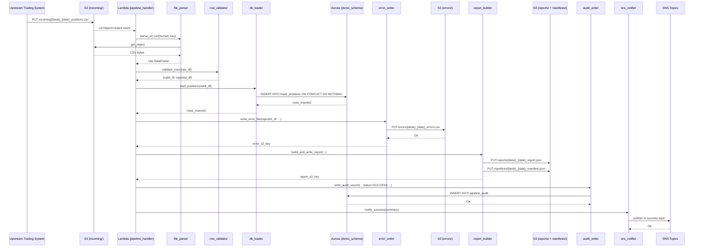
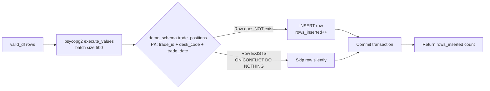

# Technical Design Document (TDD)

## Daily Trade Position Ingestion Pipeline

**Project:** agentic-poc-sandbox
**Repo:** nartcr/agentic-poc-sandbox
**Team:** Sample Trade Operations
**Date:** June 2026
**Status:** Draft

---

## COMPONENTS

### `pipeline_handler.py`
**Role:** Lambda entry point. Receives the S3 event trigger, extracts the bucket and key from the event payload, orchestrates the full pipeline by calling each stage in sequence, and returns a structured result dict.

**What it does:**
- Parses the S3 event: extracts `bucket_name` and `object_key` from `event["Records"][0]["s3"]`.
- Validates that the key matches the expected naming convention `incoming/{desk_code}_{trade_date}_positions.csv` using a regex; raises `ValueError` if it does not match.
- Calls `file_parser.parse_s3_csv(bucket_name, object_key)` → returns raw DataFrame.
- Calls `row_validator.validate_rows(df)` → returns `(valid_df, rejected_df)`.
- Calls `db_loader.load_positions(valid_df)` → returns `rows_inserted: int`.
- Calls `error_writer.write_error_file(rejected_df, desk_code, trade_date)` → returns S3 error key.
- Calls `report_builder.build_and_write_report(valid_df, rejected_df, desk_code, trade_date, rows_inserted)` → returns S3 report key.
- Calls `audit_writer.write_audit_record(filename, desk_code, trade_date, status, total_rows, rows_inserted, rows_rejected, error_message=None)`.
- Calls `sns_notifier.notify_success(summary_dict)` or `sns_notifier.notify_failure(error_dict)` depending on outcome.
- On any unhandled exception: calls `audit_writer.write_audit_record(...)` with `status="FAILED"` and the exception message, then calls `sns_notifier.notify_failure(...)`.

**Reads:** S3 event JSON from Lambda invocation.
**Writes:** Delegates all writes to sub-modules. Returns `{"status": "SUCCESS"|"FAILED", "rows_inserted": int, "rows_rejected": int}`.
**Satisfies:** BAC-1, BAC-5, BAC-6

---

### `file_parser.py`
**Role:** Downloads the CSV file from S3 and returns a raw pandas DataFrame with all columns as strings (no type coercion at this stage).

**Signature:**
```
parse_s3_csv(bucket_name: str, object_key: str) -> pd.DataFrame
```

**What it does:**
- Uses `boto3.client("s3")` (credentials from IAM role, no hardcoded secrets) to call `get_object(Bucket=bucket_name, Key=object_key)`.
- Reads the response body using `pd.read_csv(..., dtype=str, keep_default_na=False)`.
- Strips leading/trailing whitespace from all column headers and string values.
- Returns the raw DataFrame. Does not raise on empty file — an empty DataFrame is valid input to the validator.

**Reads:** S3 object at `incoming/{desk_code}_{trade_date}_positions.csv`. CSV with headers. Expected columns (not enforced here): `trade_id`, `desk_code`, `trade_date`, `instrument_type`, `notional_amount`, `currency`, `counterparty_id`.
**Writes:** Nothing to disk or S3.
**Satisfies:** BAC-1, BAC-6

---

### `row_validator.py`
**Role:** Applies field-level validation rules to every row and partitions rows into valid and rejected sets.

**Signature:**
```
validate_rows(df: pd.DataFrame) -> tuple[pd.DataFrame, pd.DataFrame]
```

**What it does:**

For each row, applies the following checks in order (first failure wins for the rejection reason):

| Check | Rule |
|---|---|
| Missing mandatory field | Any of `trade_id`, `desk_code`, `trade_date`, `instrument_type`, `notional_amount`, `currency`, `counterparty_id` is empty string or absent |
| `trade_date` format | Must match `YYYY-MM-DD`; parsed via `datetime.strptime(val, "%Y-%m-%d")` |
| `notional_amount` format | Must be parseable as `Decimal`; must be ≥ 0 |
| `currency` format | Must be exactly 3 uppercase alphabetic characters (regex `^[A-Z]{3}$`) |
| `trade_id` length | Must be ≤ 100 characters |
| `desk_code` length | Must be ≤ 50 characters |
| `counterparty_id` length | Must be ≤ 100 characters |
| `instrument_type` length | Must be ≤ 100 characters |

- Appends a `rejection_reason` column to rejected rows describing the first failing check (e.g., `"Missing mandatory field: notional_amount"`, `"Invalid trade_date format: 2026-13-01"`, `"Invalid notional_amount: not numeric"`).
- Valid rows have the `notional_amount` column cast to `Decimal` (for safe numeric handling) and `trade_date` cast to `datetime.date`.
- Returns `(valid_df, rejected_df)`. `rejected_df` includes all original columns plus `rejection_reason`.

**Reads:** Raw DataFrame from `file_parser.parse_s3_csv`.
**Writes:** Nothing to disk or S3.
**Satisfies:** BAC-2, BAC-4

---

### `db_loader.py`
**Role:** Loads validated trade position rows into `demo_schema.trade_positions` using an idempotent INSERT.

**Signature:**
```
load_positions(valid_df: pd.DataFrame) -> int
```

**What it does:**
- If `valid_df` is empty, returns 0 immediately.
- Retrieves DB credentials by calling `secrets_client.get_secret(os.environ["DB_SECRET_ID"])` → returns dict with keys `host`, `port`, `username`, `password`, `dbname`.
- Opens a `psycopg2` connection with `connect_timeout=10`.
- Executes in a single transaction:
  ```sql
  INSERT INTO demo_schema.trade_positions
    (trade_id, desk_code, trade_date, instrument_type, notional_amount, currency, counterparty_id)
  VALUES %s
  ON CONFLICT (trade_id, desk_code, trade_date) DO NOTHING
  ```
  using `psycopg2.extras.execute_values` for batched insert (batch size 500).
- Uses `cursor.rowcount` / `statusmessage` to calculate exact rows inserted (total attempted minus skipped by conflict).
- Commits the transaction. Rolls back and re-raises on any exception.
- Returns `rows_inserted: int`.

**Reads:** Validated DataFrame with columns `trade_id`, `desk_code`, `trade_date`, `instrument_type`, `notional_amount`, `currency`, `counterparty_id`.
**Writes:** Rows to `demo_schema.trade_positions`.
**Satisfies:** BAC-1, BAC-3, BAC-8

---

### `error_writer.py`
**Role:** Writes the rejected-rows CSV to S3 under the `errors/` prefix.

**Signature:**
```
write_error_file(rejected_df: pd.DataFrame, desk_code: str, trade_date: str) -> str
```

**What it does:**
- If `rejected_df` is empty, writes an empty CSV (with headers only) so a zero-rejection file is still traceable.
- Serializes `rejected_df` (all original columns + `rejection_reason`) to CSV (UTF-8, no BOM).
- Writes to S3 key: `errors/{desk_code}_{trade_date}_errors.csv` in bucket `os.environ["S3_BUCKET"]`.
- Returns the full S3 key written.

**Reads:** `rejected_df` with columns `trade_id`, `desk_code`, `trade_date`, `instrument_type`, `notional_amount`, `currency`, `counterparty_id`, `rejection_reason`.
**Writes:** `s3://{S3_BUCKET}/errors/{desk_code}_{trade_date}_errors.csv`
**Satisfies:** BAC-2

---

### `report_builder.py`
**Role:** Builds the post-load summary report JSON and writes it to S3 under the `reports/` prefix. Also writes a manifest entry under `manifests/`.

**Signature:**
```
build_and_write_report(
    valid_df: pd.DataFrame,
    rejected_df: pd.DataFrame,
    desk_code: str,
    trade_date: str,
    rows_inserted: int,
    processing_timestamp_et: datetime
) -> str
```

**What it does:**
- Constructs the report dict with the following fields:
  - `desk_code: str`
  - `trade_date: str` (YYYY-MM-DD)
  - `processing_timestamp_et: str` (ISO-8601, America/Toronto)
  - `total_rows: int` — `len(valid_df) + len(rejected_df)`
  - `rows_loaded: int` — `rows_inserted`
  - `rows_rejected: int` — `len(rejected_df)`
  - `rows_skipped_duplicate: int` — `len(valid_df) - rows_inserted`
  - `desk_code_counts: dict` — group by `desk_code`, count of valid rows per desk (from `valid_df`)
  - `notional_min: float` — `min(valid_df["notional_amount"])` if non-empty, else `null`
  - `notional_max: float` — `max(valid_df["notional_amount"])` if non-empty, else `null`
  - `null_rates: dict` — per-column null rate computed over ALL rows (valid + rejected, original columns only), expressed as a float 0.0–1.0
- Serializes to JSON (UTF-8, `indent=2`).
- Report S3 key: `reports/{desk_code}_{trade_date}_report.json`
- Writes report JSON to S3.
- Writes manifest JSON to S3 key: `manifests/{desk_code}_{trade_date}_manifest.json`
  - Manifest schema:
    ```json
    {
      "desk_code": "<desk_code>",
      "trade_date": "<YYYY-MM-DD>",
      "report_key": "reports/{desk_code}_{trade_date}_report.json",
      "error_key": "errors/{desk_code}_{trade_date}_errors.csv",
      "generated_at_et": "<ISO-8601 ET timestamp>"
    }
    ```
- Returns the report S3 key.

**Reads:** `valid_df`, `rejected_df`, scalar metadata.
**Writes:** `s3://{S3_BUCKET}/reports/{desk_code}_{trade_date}_report.json`, `s3://{S3_BUCKET}/manifests/{desk_code}_{trade_date}_manifest.json`
**Satisfies:** BAC-4, BAC-7

---

### `audit_writer.py`
**Role:** Inserts or updates an audit record in `demo_schema.pipeline_audit` for every file processed.

**Signature:**
```
write_audit_record(
    filename: str,
    desk_code: str | None,
    trade_date: str | None,
    status: str,
    total_rows: int,
    rows_inserted: int,
    rows_rejected: int,
    error_message: str | None,
    processing_timestamp_et: datetime
) -> None
```

**What it does:**
- Retrieves DB credentials via `secrets_client.get_secret(os.environ["DB_SECRET_ID"])`.
- Executes:
  ```sql
  INSERT INTO demo_schema.pipeline_audit
    (filename, desk_code, trade_date, status, total_rows, rows_inserted,
     rows_rejected, error_message, processing_timestamp_et)
  VALUES (%s, %s, %s, %s, %s, %s, %s, %s, %s)
  ```
- `status` values: `"SUCCESS"` or `"FAILED"`.
- `processing_timestamp_et` is always a timezone-aware datetime in `America/Toronto`.
- Does not deduplicate audit rows — every invocation writes a new `BIGSERIAL` row. This is intentional (audit log, not a state table).
- Commits immediately.

**Reads:** Scalar arguments only.
**Writes:** One row to `demo_schema.pipeline_audit`.
**Satisfies:** BAC-7, BAC-8 (indirectly — audit trail for regulatory readiness)

---

### `sns_notifier.py`
**Role:** Publishes SNS notifications on success and failure.

**Signatures:**
```
notify_success(summary: dict) -> None
notify_failure(error_detail: dict) -> None
```

**What it does:**
- `notify_success`: publishes to `os.environ["SNS_SUCCESS_TOPIC_ARN"]` with message body:
  ```json
  {
    "event": "TRADE_POSITIONS_LOADED",
    "desk_code": "<str>",
    "trade_date": "<YYYY-MM-DD>",
    "rows_loaded": <int>,
    "rows_rejected": <int>,
    "rows_skipped_duplicate": <int>,
    "report_s3_key": "<str>",
    "processing_timestamp_et": "<ISO-8601>"
  }
  ```
- `notify_failure`: publishes to `os.environ["SNS_FAILURE_TOPIC_ARN"]` with message body:
  ```json
  {
    "event": "TRADE_POSITIONS_FAILED",
    "filename": "<str>",
    "error": "<exception message>",
    "processing_timestamp_et": "<ISO-8601>"
  }
  ```
- Uses `boto3.client("sns").publish(TopicArn=..., Message=json.dumps(...), Subject=...)`.
- Subject for success: `"Trade Positions Loaded: {desk_code} {trade_date}"`.
- Subject for failure: `"Trade Position Ingestion FAILED: {filename}"`.

**Reads:** Summary/error dicts built by `pipeline_handler.py`.
**Writes:** SNS message to success or failure topic.
**Satisfies:** BAC-5

---

### `secrets_client.py`
**Role:** Retrieves and caches secrets from AWS Secrets Manager at runtime.

**Signature:**
```
get_secret(secret_id: str) -> dict
```

**What it does:**
- On first call for a given `secret_id`, calls `boto3.client("secretsmanager").get_secret_value(SecretId=secret_id)`.
- Parses `SecretString` as JSON and caches the result in a module-level dict keyed by `secret_id` (in-process cache for Lambda warm reuse).
- On subsequent calls with the same `secret_id`, returns the cached value.
- Raises `RuntimeError` if the secret cannot be retrieved or parsed.
- Never logs secret values.

**Reads:** AWS Secrets Manager secret identified by `secret_id`.
**Writes:** Nothing.
**Satisfies:** BAC-8

---

## AWS SERVICES

| Service | Role |
|---|---|
| **Amazon S3** | Source of incoming trade position CSV files (`incoming/` prefix); destination for error files (`errors/`), summary reports (`reports/`), and manifests (`manifests/`). Triggers Lambda via S3 event notification on `s3:ObjectCreated:*` for the `incoming/` prefix. |
| **AWS Lambda** | Compute runtime for the ingestion pipeline. Function `agentic-poc-sandbox-qa` is triggered by S3 events. Runs the full pipeline: parse → validate → load → report → notify. |
| **Amazon Aurora (PostgreSQL-compatible)** | Reporting database. Hosts `demo_schema.trade_positions` (validated positions) and `demo_schema.pipeline_audit` (audit trail). Accessed via `psycopg2`. |
| **AWS Secrets Manager** | Stores Aurora DB credentials under secret ID `agentic-poc-aurora`. Retrieved at runtime via `secrets_client.get_secret`. No credentials in code. |
| **Amazon SNS** | Two topics: success topic (`agentic-poc-success`) for downstream risk pipeline trigger; failure topic (`agentic-poc-failure`) for operational alerting. |

---

## DATA CONTRACTS

### Database Tables

#### `demo_schema.trade_positions`

| Column | Type | Nullable | Notes |
|---|---|---|---|
| `trade_id` | `VARCHAR(100)` | NOT NULL | Part of composite PK |
| `desk_code` | `VARCHAR(50)` | NOT NULL | Part of composite PK |
| `trade_date` | `DATE` | NOT NULL | Part of composite PK |
| `instrument_type` | `VARCHAR(100)` | NOT NULL | |
| `notional_amount` | `NUMERIC(20,4)` | NOT NULL | |
| `currency` | `CHAR(3)` | NOT NULL | ISO 4217 |
| `counterparty_id` | `VARCHAR(100)` | NOT NULL | |
| `loaded_at` | `TIMESTAMPTZ` | NOT NULL | Default: `now()` — set by DB |

**Primary Key:** `(trade_id, desk_code, trade_date)`
**Unique Constraint:** Enforced by primary key (deduplication key for idempotent inserts).
**Index:** Implicit on PK. Recommended additional index on `(desk_code, trade_date)` for reporting queries.

---

#### `demo_schema.pipeline_audit`

| Column | Type | Nullable | Notes |
|---|---|---|---|
| `audit_id` | `BIGSERIAL` | NOT NULL | Auto-generated PK |
| `filename` | `VARCHAR(255)` | NOT NULL | Original S3 object key |
| `desk_code` | `VARCHAR(50)` | NULL | NULL if filename parse fails |
| `trade_date` | `DATE` | NULL | NULL if filename parse fails |
| `status` | `VARCHAR(20)` | NOT NULL | `"SUCCESS"` or `"FAILED"` |
| `total_rows` | `INTEGER` | NOT NULL | Default 0 |
| `rows_inserted` | `INTEGER` | NOT NULL | Default 0 |
| `rows_rejected` | `INTEGER` | NOT NULL | Default 0 |
| `error_message` | `TEXT` | NULL | Populated on FAILED |
| `processing_timestamp_et` | `TIMESTAMPTZ` | NOT NULL | Timezone-aware, ET |
| `created_at` | `TIMESTAMPTZ` | NOT NULL | Default: `now()` — set by DB |

**Primary Key:** `audit_id`

---

### S3 Paths

| Path Pattern | Format | Description |
|---|---|---|
| `s3://{S3_BUCKET}/incoming/{desk_code}_{trade_date}_positions.csv` | CSV, UTF-8, with header row | Input file deposited by upstream trading systems |
| `s3://{S3_BUCKET}/errors/{desk_code}_{trade_date}_errors.csv` | CSV, UTF-8, with header row | Rejected rows with `rejection_reason` column appended |
| `s3://{S3_BUCKET}/reports/{desk_code}_{trade_date}_report.json` | JSON, UTF-8 | Post-load summary report |
| `s3://{S3_BUCKET}/manifests/{desk_code}_{trade_date}_manifest.json` | JSON, UTF-8 | Manifest linking logical file names to S3 keys |

**Input CSV expected columns:** `trade_id`, `desk_code`, `trade_date`, `instrument_type`, `notional_amount`, `currency`, `counterparty_id`

**Error CSV columns:** `trade_id`, `desk_code`, `trade_date`, `instrument_type`, `notional_amount`, `currency`, `counterparty_id`, `rejection_reason`

**Report JSON schema:**
```json
{
  "desk_code": "string",
  "trade_date": "YYYY-MM-DD",
  "processing_timestamp_et": "ISO-8601 with TZ offset",
  "total_rows": "integer",
  "rows_loaded": "integer",
  "rows_rejected": "integer",
  "rows_skipped_duplicate": "integer",
  "desk_code_counts": {"<desk_code>": "integer"},
  "notional_min": "float or null",
  "notional_max": "float or null",
  "null_rates": {"<column_name>": "float 0.0–1.0"}
}
```

**Manifest JSON schema:**
```json
{
  "desk_code": "string",
  "trade_date": "YYYY-MM-DD",
  "report_key": "reports/{desk_code}_{trade_date}_report.json",
  "error_key": "errors/{desk_code}_{trade_date}_errors.csv",
  "generated_at_et": "ISO-8601 with TZ offset"
}
```

---

### Secrets Manager

**Environment Variable:** `DB_SECRET_ID = os.environ["DB_SECRET_ID"]`
**Secret ID value (from infrastructure config):** `agentic-poc-aurora`

**Expected JSON keys in secret:**
```json
{
  "host": "string — Aurora cluster endpoint",
  "port": "integer — default 5432",
  "username": "string",
  "password": "string",
  "dbname": "string — value: app"
}
```

---

### SNS Topics

**Success Topic:**
- **Env var:** `SNS_SUCCESS_TOPIC_ARN = os.environ["SNS_SUCCESS_TOPIC_ARN"]`
- **ARN (from infrastructure config):** `arn:aws:sns:us-east-1:533266968934:agentic-poc-success`
- **Message format:**
  ```json
  {
    "event": "TRADE_POSITIONS_LOADED",
    "desk_code": "string",
    "trade_date": "YYYY-MM-DD",
    "rows_loaded": "integer",
    "rows_rejected": "integer",
    "rows_skipped_duplicate": "integer",
    "report_s3_key": "string",
    "processing_timestamp_et": "ISO-8601 with TZ offset"
  }
  ```

**Failure Topic:**
- **Env var:** `SNS_FAILURE_TOPIC_ARN = os.environ["SNS_FAILURE_TOPIC_ARN"]`
- **ARN (from infrastructure config):** `arn:aws:sns:us-east-1:533266968934:agentic-poc-failure`
- **Message format:**
  ```json
  {
    "event": "TRADE_POSITIONS_FAILED",
    "filename": "string",
    "error": "string — exception message",
    "processing_timestamp_et": "ISO-8601 with TZ offset"
  }
  ```

---

### Environment Variables (full list)

| Variable Name | Value Source | Purpose |
|---|---|---|
| `DB_SECRET_ID` | Deployment config | Secrets Manager secret ID for Aurora credentials |
| `S3_BUCKET` | Deployment config | S3 bucket name for all file I/O |
| `SNS_SUCCESS_TOPIC_ARN` | Deployment config | SNS ARN for success notifications |
| `SNS_FAILURE_TOPIC_ARN` | Deployment config | SNS ARN for failure notifications |

---

## DATA FLOW

### End-to-End Sequence Diagram



---

### Processing Logic Flowchart

```mermaid
flowchart TD
    A([S3 ObjectCreated Event]) --> B[Extract bucket + key from event]
    B --> C{Key matches\nincoming/{desk}_{date}_positions.csv?}
    C -- No --> Z1[Log warning, return — ignore non-matching keys]
    C -- Yes --> D[parse_s3_csv: download CSV as string DataFrame]
    D --> E[validate_rows: apply field rules row-by-row]
    E --> F{Any valid rows?}
    F -- Yes --> G[load_positions: INSERT ON CONFLICT DO NOTHING]
    F -- No --> H[rows_inserted = 0]
    G --> H
    H --> I[write_error_file: write rejected_df to errors/]
    I --> J[build_and_write_report: write report + manifest to S3]
    J --> K[write_audit_record: INSERT pipeline_audit status=SUCCESS]
    K --> L[notify_success: publish to SNS success topic]
    L --> M([Done — SUCCESS])

    D -- Exception --> ERR
    E -- Exception --> ERR
    G -- Exception --> ERR
    ERR[Catch unhandled exception] --> N[write_audit_record: status=FAILED, error_message=exc]
    N --> O[notify_failure: publish to SNS failure topic]
    O --> P([Done — FAILED])
```

---

### Row Validation Algorithm

```
Algorithm: validate_rows(df)

MANDATORY_FIELDS = [trade_id, desk_code, trade_date, instrument_type,
                    notional_amount, currency, counterparty_id]

valid_rows = []
rejected_rows = []

FOR each row in df:
    rejection_reason = None

    # Check 1: missing mandatory fields
    FOR field IN MANDATORY_FIELDS:
        IF row[field] is absent OR row[field].strip() == "":
            rejection_reason = f"Missing mandatory field: {field}"
            BREAK

    IF rejection_reason is None:
        # Check 2: trade_date format
        TRY datetime.strptime(row[trade_date], "%Y-%m-%d")
        EXCEPT ValueError:
            rejection_reason = f"Invalid trade_date format: {row[trade_date]}"

    IF rejection_reason is None:
        # Check 3: notional_amount numeric and >= 0
        TRY val = Decimal(row[notional_amount])
        IF val < 0:
            rejection_reason = f"Invalid notional_amount: negative value {val}"
        EXCEPT InvalidOperation:
            rejection_reason = f"Invalid notional_amount: not numeric"

    IF rejection_reason is None:
        # Check 4: currency is 3 uppercase alpha chars
        IF NOT re.match("^[A-Z]{3}$", row[currency]):
            rejection_reason = f"Invalid currency: {row[currency]}"

    IF rejection_reason is None:
        # Check 5: field length constraints
        FIELD_LIMITS = {trade_id: 100, desk_code: 50, counterparty_id: 100, instrument_type: 100}
        FOR field, max_len IN FIELD_LIMITS:
            IF len(row[field]) > max_len:
                rejection_reason = f"Field too long: {field} exceeds {max_len} chars"
                BREAK

    IF rejection_reason is None:
        ADD row to valid_rows (with trade_date cast to date, notional_amount cast to Decimal)
    ELSE:
        ADD row + rejection_reason to rejected_rows

RETURN (DataFrame(valid_rows), DataFrame(rejected_rows))
```

---

### Idempotent Load (Deduplication) Diagram



---

## TECHNICAL ACCEPTANCE CRITERIA

**TAC-1: Valid trade positions are available in the DB before the next morning's risk run.**
- `db_loader.load_positions(valid_df)` executes `INSERT INTO demo_schema.trade_positions (...) VALUES %s ON CONFLICT (trade_id, desk_code, trade_date) DO NOTHING` within the Lambda invocation triggered by the S3 ObjectCreated event.
- Acceptance test: after `pipeline_handler` completes for a valid input file, a `SELECT COUNT(*) FROM demo_schema.trade_positions WHERE desk_code = %s AND trade_date = %s` returns a count equal to the number of valid rows in the input file.
- Lambda timeout must be set to ≥ 60 seconds to satisfy the 60-second SLA for 10,000 rows.

**TAC-2: Rejected rows are written with specific rejection reasons.**
- `row_validator.validate_rows(df)` appends a `rejection_reason` string to each rejected row. The string explicitly names the failing field and the rule (e.g., `"Missing mandatory field: currency"`, `"Invalid trade_date format: 20260132"`).
- `error_writer.write_error_file(rejected_df, ...)` writes `s3://{S3_BUCKET}/errors/{desk_code}_{trade_date}_errors.csv` containing all original columns plus `rejection_reason`.
- Acceptance test: for a test file with one row missing `notional_amount` and one row with a non-numeric `notional_amount`, the error CSV contains exactly 2 rows, with `rejection_reason` values `"Missing mandatory field: notional_amount"` and `"Invalid notional_amount: not numeric"` respectively.

**TAC-3: Reprocessing the same file does not create duplicate records.**
- `db_loader.load_positions` uses `INSERT INTO demo_schema.trade_positions (...) VALUES %s ON CONFLICT (trade_id, desk_code, trade_date) DO NOTHING`.
- Acceptance test: process the same input file twice. After the first run, record `COUNT(*) = N` from `demo_schema.trade_positions WHERE desk_code = %s AND trade_date = %s`. After the second run, assert `COUNT(*) = N` (unchanged). Assert second run `rows_inserted = 0`.

**TAC-4: Summary report accurately reflects received, accepted, and rejected counts.**
- `report_builder.build_and_write_report` sets:
  - `total_rows = len(valid_df) + len(rejected_df)` (must equal the exact row count of the input CSV excluding the header).
  - `rows_loaded = rows_inserted` (value returned by `db_loader.load_positions`).
  - `rows_rejected = len(rejected_df)`.
  - `rows_skipped_duplicate = len(valid_df) - rows_inserted`.
- Acceptance test: for an input file with 100 rows (80 valid, 20 invalid, 10 of the 80 already in DB), assert report JSON contains `total_rows=100`, `rows_loaded=70`, `rows_rejected=20`, `rows_skipped_duplicate=10`.

**TAC-5: Downstream pipeline receives an SNS notification without manual intervention.**
- `sns_notifier.notify_success(summary)` is called unconditionally at the end of a successful `pipeline_handler` execution.
- Message published to `os.environ["SNS_SUCCESS_TOPIC_ARN"]` with `event = "TRADE_POSITIONS_LOADED"` and all required fields.
- Acceptance test: mock `boto3.client("sns").publish`; assert it is called exactly once with `TopicArn = SNS_SUCCESS_TOPIC_ARN` and a JSON body deserializable to the success message schema after a successful pipeline run.

**TAC-6: Processing completes within 60 seconds for a 10,000-row file.**
- `pipeline_handler` orchestrates all stages sequentially. `db_loader` uses `psycopg2.extras.execute_values` with batch size 500 (not row-by-row inserts).
- Acceptance test: time the full pipeline execution with a synthetic 10,000-row CSV in a performance test environment; assert wall-clock time ≤ 60 seconds.
- Lambda function timeout must be configured ≥ 60 seconds (deployment concern, not code concern).

**TAC-7: All timestamps in reports and audit records are in Eastern Time (America/Toronto).**
- Every `processing_timestamp_et` value is generated as `datetime.now(pytz.timezone("America/Toronto"))` in `pipeline_handler`.
- This value is passed through to `audit_writer.write_audit_record`, `report_builder.build_and_write_report`, and `sns_notifier.notify_success/notify_failure`.
- Report JSON `processing_timestamp_et` field is serialized as ISO-8601 with the ET UTC offset (e.g., `-04:00` in EDT or `-05:00` in EST).
- Acceptance test: assert that `processing_timestamp_et` in the report JSON has a UTC offset of either `-04:00` or `-05:00` (never `+00:00`). Assert the same for the `pipeline_audit` row.

**TAC-8: No credentials in code or config files; all secrets retrieved from Secrets Manager at runtime.**
- `secrets_client.get_secret(os.environ["DB_SECRET_ID"])` is the only mechanism for obtaining DB credentials. No credentials appear as literals or default values anywhere in the codebase.
- Acceptance test (static analysis): grep the entire codebase for `password`, `passwd`, `secret`, `token`, `key` as literal string assignments; assert zero matches outside of `secrets_client.py` and env var reads. CI step enforces this.

---

## OPEN QUESTIONS

**OQ-1: Partial success notification behavior.**
Should `notify_success` be published when ALL rows are rejected (i.e., `valid_df` is empty, `rows_inserted = 0`, but no unhandled exception occurred)? Or should an all-rejection outcome trigger `notify_failure` instead?

*Business impact:* The downstream risk pipeline subscribes to the success topic to trigger the next step. If all rows are rejected, there are no new positions to process — triggering the risk pipeline could cause it to run on stale data.

**OQ-2: File overwrite / re-delivery behavior.**
If an upstream system delivers a corrected version of `{desk_code}_{trade_date}_positions.csv` (same filename, different content), the pipeline will attempt to load rows not yet in the DB and skip existing rows via `ON CONFLICT DO NOTHING`. However, rows that were in the original file but removed in the corrected file will NOT be deleted. Is this acceptable, or must the pipeline support a delete-and-reload mode for corrections?

*Business impact:* If the original file contained erroneous rows that were valid (passed validation) and were already inserted, they will remain in `demo_schema.trade_positions` even after the corrected file is processed.

---

## ASSUMPTIONS

1. **Trigger mechanism:** The Lambda function `agentic-poc-sandbox-qa` is triggered by an S3 ObjectCreated event notification on the bucket `agentic-poc-533266968934` filtered to prefix `incoming/`. This is assumed to be already configured on the existing Lambda function.

2. **Lambda IAM permissions:** The Lambda execution role already has permissions for: `s3:GetObject` and `s3:PutObject` on `agentic-poc-533266968934`, `secretsmanager:GetSecretValue` on `agentic-poc-aurora`, `sns:Publish` on both SNS topic ARNs, and network access to Aurora (VPC configuration assumed correct).

3. **Aurora accessibility:** The Aurora cluster is accessible from the Lambda execution environment (same VPC, or VPC peering, or public endpoint with security group rules). Connection details (host, port) are provided inside the Secrets Manager secret.

4. **Input file encoding:** Input CSVs are UTF-8 encoded. Non-UTF-8 files will raise a decode error, which is caught by the top-level exception handler and triggers `notify_failure`.

5. **One file per Lambda invocation:** Each S3 event contains exactly one record (one file). Batch size of 1 is assumed. If the event contains multiple records, only the first is processed. (This is standard S3 Lambda trigger behavior but should be confirmed.)

6. **`desk_code` in file matches `desk_code` in rows:** The `desk_code` embedded in the filename is not cross-validated against the `desk_code` column in the rows. Row-level `desk_code` is used for DB loading; filename `desk_code` is used for S3 output path naming. If they diverge, both are recorded without error.

7. **No schema migration responsibility:** The pipeline code does not create or alter database tables. Tables `demo_schema.trade_positions` and `demo_schema.pipeline_audit` are assumed to already exist with the schemas defined in this TDD (created by a separate migration process).

8. **Report overwrites are acceptable:** If the same file is reprocessed (BAC-3), `report_builder` will overwrite the existing report and manifest S3 objects for that `{desk_code}_{trade_date}`. This is acceptable because the report content reflects the latest processing run.

9. **`null_rates` computation:** Null rate is computed over the full input DataFrame (valid + rejected rows, before split), considering both empty strings and actual `NaN` values as null for this purpose, since all columns are initially read as strings.

10. **Python runtime:** Lambda uses Python 3.11. Dependencies `psycopg2-binary`, `pandas`, `pytz`, and `boto3` are available in the deployment package or Lambda layer.

11. **`loaded_at` and `created_at`:** These columns use `DEFAULT now()` in the database and are never set by application code. The INSERT statements deliberately omit these columns.

12. **Error file always written:** The error file is written even when `rows_rejected = 0` (header-only CSV). This ensures the `errors/` path is always populated for the given `{desk_code}_{trade_date}` key, making downstream checks predictable.