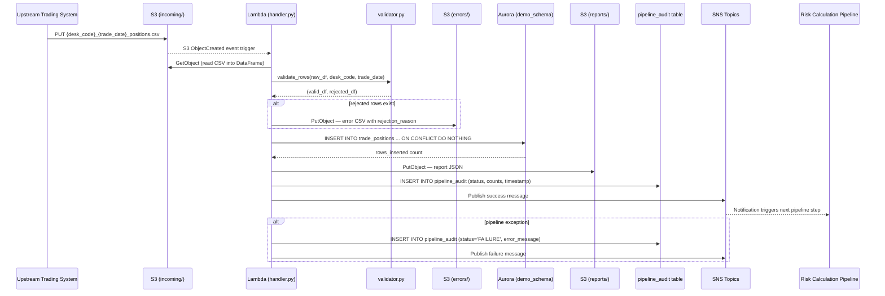
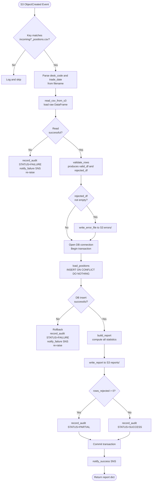
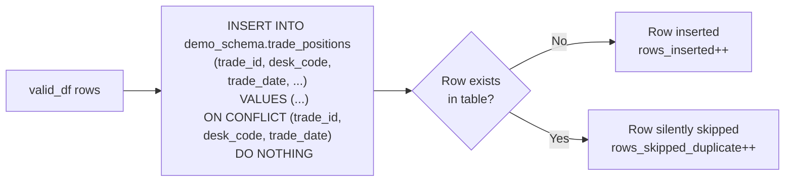

# Technical Design Document

## Daily Trade Position Ingestion Pipeline
**Project:** agentic-poc-sandbox
**Repo:** nartcr/agentic-poc-sandbox
**Date:** June 2026
**Status:** Draft

---

## COMPONENTS

### `config.py`
**Purpose:** Centralizes all environment variable reads and runtime constants. No secrets are stored here — only env var names and non-sensitive defaults.

**Reads:**
- `os.environ["S3_BUCKET"]` → S3 bucket name
- `os.environ["S3_INPUT_PREFIX"]` → default: `incoming/`
- `os.environ["S3_ERROR_PREFIX"]` → default: `errors/`
- `os.environ["S3_REPORT_PREFIX"]` → default: `reports/`
- `os.environ["DB_SECRET_ID"]` → Secrets Manager secret ID for Aurora
- `os.environ["DB_NAME"]` → default: `app`
- `os.environ["DB_SCHEMA"]` → default: `demo_schema`
- `os.environ["SNS_SUCCESS_TOPIC_ARN"]` → ARN for success notifications
- `os.environ["SNS_FAILURE_TOPIC_ARN"]` → ARN for failure notifications

**Writes:** Nothing. Exposes a `Config` dataclass with the above fields populated at import time.

**Satisfies:** BAC-8 (no secrets in code or config files)

---

### `secrets.py`
**Purpose:** Retrieves database credentials from AWS Secrets Manager at runtime. Returns a typed `DBCredentials` dataclass.

**Function signature:**
```
def get_db_credentials(secret_id: str) -> DBCredentials
```
Where `DBCredentials` has fields: `host: str`, `port: int`, `username: str`, `password: str`, `dbname: str`.

**Reads:** AWS Secrets Manager secret at `secret_id`. Expected JSON keys inside the secret:
```json
{ "host": "...", "port": 5432, "username": "...", "password": "...", "dbname": "app" }
```

**Writes:** Nothing persistent. Returns `DBCredentials` in memory only.

**Error behavior:** Raises `RuntimeError` with a sanitized message (no credential values) if the secret cannot be retrieved.

**Satisfies:** BAC-8

---

### `s3_reader.py`
**Purpose:** Lists and downloads trade position CSV files from the S3 input prefix. Provides a function to list all unprocessed files and a function to read one file into a raw DataFrame.

**Function signatures:**
```
def list_incoming_files(bucket: str, prefix: str) -> list[str]
    # Returns list of S3 object keys matching pattern: {prefix}{desk_code}_{trade_date}_positions.csv

def read_csv_from_s3(bucket: str, key: str) -> tuple[pd.DataFrame, str, str]
    # Returns (raw_dataframe, desk_code, trade_date) parsed from filename
    # Parses desk_code and trade_date from key using regex: .*/([^/]+)_(\d{8})_positions\.csv$
    # Raises ValueError if filename does not match the expected pattern
```

**Reads:** S3 objects under `s3://os.environ["S3_BUCKET"]/incoming/`. CSV files with columns as defined in the input file schema (see DATA CONTRACTS).

**Writes:** Nothing to S3. Returns DataFrame in memory.

**Satisfies:** BAC-1, BAC-6

---

### `validator.py`
**Purpose:** Validates each row of a raw DataFrame against mandatory field rules. Returns two DataFrames: `valid_df` and `rejected_df`. `rejected_df` includes all original columns plus a `rejection_reason` column.

**Function signature:**
```
def validate_rows(df: pd.DataFrame, desk_code: str, trade_date: str) -> tuple[pd.DataFrame, pd.DataFrame]
    # Returns (valid_df, rejected_df)
```

**Validation rules applied in order (first failing rule wins for each row):**
1. `trade_id` — must be non-null and non-empty string
2. `desk_code` — must be non-null; must match `desk_code` parsed from filename
3. `trade_date` — must be non-null; must be parseable as `YYYYMMDD` date; must match `trade_date` parsed from filename
4. `instrument_type` — must be non-null and non-empty string
5. `notional_amount` — must be non-null; must be castable to `float`; must be > 0
6. `currency` — must be non-null; must be exactly 3 uppercase alpha characters (ISO 4217 format)
7. `counterparty_id` — must be non-null and non-empty string

**`rejection_reason` values** (exact strings):
- `"MISSING_TRADE_ID"`, `"MISSING_DESK_CODE"`, `"DESK_CODE_MISMATCH"`, `"MISSING_TRADE_DATE"`, `"INVALID_TRADE_DATE_FORMAT"`, `"TRADE_DATE_MISMATCH"`, `"MISSING_INSTRUMENT_TYPE"`, `"MISSING_NOTIONAL_AMOUNT"`, `"INVALID_NOTIONAL_AMOUNT"`, `"MISSING_CURRENCY"`, `"INVALID_CURRENCY_FORMAT"`, `"MISSING_COUNTERPARTY_ID"`

**Writes:** Returns two DataFrames in memory. Does not write to storage.

**Satisfies:** BAC-2

---

### `error_writer.py`
**Purpose:** Writes the rejected rows DataFrame (including `rejection_reason` column) to S3 as a CSV error file.

**Function signature:**
```
def write_error_file(
    rejected_df: pd.DataFrame,
    bucket: str,
    error_prefix: str,
    desk_code: str,
    trade_date: str,
    processing_timestamp: datetime
) -> str
    # Returns the S3 key of the written error file
```

**S3 key pattern:**
```
{error_prefix}{desk_code}_{trade_date}_errors_{processing_timestamp:%Y%m%dT%H%M%S}.csv
```
Example: `errors/EQDSK_20260615_errors_20260615T195532.csv`

**CSV columns written:** all original input columns plus `rejection_reason` (last column).

**Writes:** S3 object at the computed key. If `rejected_df` is empty, no file is written and the function returns `None`.

**Satisfies:** BAC-2

---

### `loader.py`
**Purpose:** Inserts validated rows into `demo_schema.trade_positions` using `INSERT ... ON CONFLICT (trade_id, desk_code, trade_date) DO NOTHING`. Returns the count of rows actually inserted (not skipped).

**Function signature:**
```
def load_positions(
    valid_df: pd.DataFrame,
    conn  # psycopg2 connection
) -> int
    # Returns count of rows inserted (skipped duplicates not counted)
```

**Mechanism:** Constructs a batch `INSERT INTO demo_schema.trade_positions (trade_id, desk_code, trade_date, instrument_type, notional_amount, currency, counterparty_id, loaded_at) VALUES %s ON CONFLICT (trade_id, desk_code, trade_date) DO NOTHING` using `psycopg2.extras.execute_values`. `loaded_at` is set to `datetime.now(pytz.timezone("America/Toronto"))` at the time of the call.

**Counts rows inserted** by comparing `conn.rowcount` across the batch or by issuing a `SELECT COUNT(*)` on the dedup key set before and after (design choice: use row-count delta via `mogrify` with `execute_values` returning rowcount).

**Error behavior:** Raises the `psycopg2` exception on any DB error; the caller (pipeline orchestrator) handles rollback.

**Satisfies:** BAC-1, BAC-3

---

### `reporter.py`
**Purpose:** Computes the post-load summary statistics from the raw, valid, and rejected DataFrames and writes the summary report as a JSON file to S3.

**Function signature:**
```
def build_report(
    raw_df: pd.DataFrame,
    valid_df: pd.DataFrame,
    rejected_df: pd.DataFrame,
    rows_inserted: int,
    desk_code: str,
    trade_date: str,
    processing_timestamp: datetime,
    source_s3_key: str
) -> dict
    # Returns the report dict (also written to S3)

def write_report(
    report: dict,
    bucket: str,
    report_prefix: str,
    desk_code: str,
    trade_date: str,
    processing_timestamp: datetime
) -> str
    # Writes report JSON to S3, returns S3 key
```

**Report JSON schema** (see DATA CONTRACTS).

**Computed fields:**
- `total_rows_received`: `len(raw_df)`
- `rows_valid`: `len(valid_df)`
- `rows_rejected`: `len(rejected_df)`
- `rows_inserted`: from `loader.load_positions` return value
- `rows_skipped_duplicate`: `len(valid_df) - rows_inserted`
- `processing_timestamp_et`: ISO 8601 string in ET
- `desk_code_counts`: `raw_df.groupby("desk_code").size().to_dict()`
- `notional_min`: `valid_df["notional_amount"].min()` (null if no valid rows)
- `notional_max`: `valid_df["notional_amount"].max()` (null if no valid rows)
- `null_rates`: per-column null rate across `raw_df` (float 0.0–1.0, each column in mandatory field list)

**Satisfies:** BAC-4, BAC-7

---

### `notifier.py`
**Purpose:** Publishes SNS messages for success and failure events.

**Function signatures:**
```
def notify_success(
    topic_arn: str,
    report: dict
) -> None

def notify_failure(
    topic_arn: str,
    desk_code: str,
    trade_date: str,
    error_message: str,
    processing_timestamp: datetime
) -> None
```

**Success message format:** See DATA CONTRACTS — SNS section.
**Failure message format:** See DATA CONTRACTS — SNS section.

**Error behavior:** Logs SNS publish failures at ERROR level but does not re-raise (notification failure must not mask the primary processing result).

**Satisfies:** BAC-5

---

### `audit.py`
**Purpose:** Inserts one row into `demo_schema.pipeline_audit` at the end of every file processing attempt (success or failure). Provides a complete audit trail for regulatory examination.

**Function signature:**
```
def record_audit(
    conn,  # psycopg2 connection
    desk_code: str,
    trade_date: str,
    source_s3_key: str,
    status: str,          # "SUCCESS" | "FAILURE" | "PARTIAL"
    total_rows: int,
    rows_inserted: int,
    rows_rejected: int,
    error_message: str | None,
    processing_timestamp: datetime
) -> None
```

**Inserts into:** `demo_schema.pipeline_audit` (full schema in DATA CONTRACTS).

**`status` values:** `"SUCCESS"` (all valid rows loaded, none rejected), `"PARTIAL"` (some rows loaded, some rejected), `"FAILURE"` (pipeline error before load completed).

**Satisfies:** BAC-7, BAC-8 (audit trail for security audit)

---

### `pipeline.py`
**Purpose:** Orchestrates the full end-to-end pipeline for a single file. Called by the Lambda handler. Coordinates all other modules. Handles exceptions, triggers rollback on DB error, ensures audit record is always written.

**Function signature:**
```
def process_file(
    s3_key: str,
    config: Config
) -> dict
    # Returns the summary report dict on success
    # On failure, writes audit record with status="FAILURE", publishes failure SNS, re-raises
```

**Execution order:**
1. Parse `desk_code` and `trade_date` from `s3_key`
2. Call `s3_reader.read_csv_from_s3()`
3. Call `validator.validate_rows()`
4. Call `error_writer.write_error_file()` if `len(rejected_df) > 0`
5. Open DB connection via `secrets.get_db_credentials()`
6. Begin transaction
7. Call `loader.load_positions()`
8. Call `reporter.build_report()` and `reporter.write_report()`
9. Call `audit.record_audit()` with `status` determined by rejected count
10. Commit transaction
11. Call `notifier.notify_success()`
12. Return report dict

**On any exception:**
- Rollback open transaction (if any)
- Call `audit.record_audit()` with `status="FAILURE"` and `error_message=str(exception)` (sanitized — no credentials)
- Call `notifier.notify_failure()`
- Re-raise exception

**Satisfies:** BAC-1, BAC-2, BAC-3, BAC-4, BAC-5, BAC-6, BAC-7

---

### `handler.py`
**Purpose:** AWS Lambda entry point. Receives the S3 event trigger (ObjectCreated), extracts the S3 key, filters to keys matching `incoming/*_positions.csv`, and calls `pipeline.process_file()` for each qualifying object. Logs completion or failure.

**Function signature:**
```
def lambda_handler(event: dict, context) -> dict
    # Returns {"statusCode": 200, "processed": [list of s3_keys]} on success
    # Returns {"statusCode": 500, "error": "..."} on unhandled failure
```

**Event source:** S3 ObjectCreated event. Reads `event["Records"][i]["s3"]["bucket"]["name"]` and `event["Records"][i]["s3"]["object"]["key"]`.

**Key filtering:** Only processes keys matching regex `^incoming/[^/]+_\d{8}_positions\.csv$`. Logs and skips any key that does not match.

**Satisfies:** BAC-1, BAC-5, BAC-6

---

### `db.py`
**Purpose:** Manages psycopg2 connection lifecycle. Provides a context manager that opens a connection using credentials from `secrets.py`, yields it, and closes it on exit (committing or rolling back as directed by the caller).

**Function signature:**
```
def get_connection(credentials: DBCredentials):
    # Context manager — yields a psycopg2 connection with autocommit=False
```

**Satisfies:** BAC-8 (credentials never in code)

---

### `sql/create_tables.sql`
**Purpose:** DDL script to create (if not exists) `demo_schema.trade_positions` and `demo_schema.pipeline_audit` with all columns, constraints, and indexes as specified in DATA CONTRACTS. Run once during deployment; not called by application code at runtime.

**Satisfies:** BAC-1, BAC-3, BAC-7

---

## AWS SERVICES

| Service | Role |
|---|---|
| **AWS Lambda** | Compute runtime for the ingestion pipeline. Function `agentic-poc-sandbox-qa` is triggered by S3 ObjectCreated events on the input prefix. |
| **Amazon S3** | Durable file storage. Bucket `agentic-poc-data-533266968934` holds incoming position files (`incoming/`), error files (`errors/`), and summary reports (`reports/`). |
| **Amazon Aurora (PostgreSQL-compatible)** | Reporting database. Hosts `demo_schema.trade_positions` and `demo_schema.pipeline_audit`. |
| **AWS Secrets Manager** | Stores database credentials under secret ID `agentic-poc-aurora`. Retrieved at runtime by `secrets.py`. |
| **Amazon SNS** | Publishes success and failure notifications to downstream subscribers (risk calculation pipeline). Two topics: one for success, one for failure. |
| **Amazon CloudWatch Logs** | Receives all `logging` module output from the Lambda function for observability and audit. |

---

## DATA CONTRACTS

### Database Tables

#### `demo_schema.trade_positions`

```
Table: demo_schema.trade_positions

Column              Data Type                       Constraints
-----------         ----------------------------    ---------------------------------
id                  BIGSERIAL                       PRIMARY KEY
trade_id            VARCHAR(100)                    NOT NULL
desk_code           VARCHAR(50)                     NOT NULL
trade_date          DATE                            NOT NULL
instrument_type     VARCHAR(100)                    NOT NULL
notional_amount     NUMERIC(28, 8)                  NOT NULL
currency            CHAR(3)                         NOT NULL
counterparty_id     VARCHAR(100)                    NOT NULL
loaded_at           TIMESTAMPTZ                     NOT NULL

UNIQUE CONSTRAINT:  uq_trade_positions_dedup  ON (trade_id, desk_code, trade_date)
INDEX:              idx_trade_positions_desk_date  ON (desk_code, trade_date)
```

#### `demo_schema.pipeline_audit`

```
Table: demo_schema.pipeline_audit

Column                  Data Type           Constraints
---------------------   ---------------     ---------------------------------
id                      BIGSERIAL           PRIMARY KEY
desk_code               VARCHAR(50)         NOT NULL
trade_date              DATE                NOT NULL
source_s3_key           TEXT                NOT NULL
status                  VARCHAR(20)         NOT NULL   -- 'SUCCESS', 'PARTIAL', 'FAILURE'
total_rows              INTEGER             NOT NULL
rows_inserted           INTEGER             NOT NULL
rows_rejected           INTEGER             NOT NULL
error_message           TEXT                NULL
processing_timestamp    TIMESTAMPTZ         NOT NULL
service_identity        VARCHAR(200)        NOT NULL   -- Lambda function name + request ID

INDEX: idx_pipeline_audit_desk_date  ON (desk_code, trade_date)
INDEX: idx_pipeline_audit_status     ON (status)
```

`service_identity` is populated from Lambda context: `f"{context.function_name}/{context.aws_request_id}"`. In `pipeline.py` this value is passed in from `handler.py`.

---

### S3 Paths

```
Bucket: os.environ["S3_BUCKET"]   (value: agentic-poc-data-533266968934)

Input files:
  Key pattern:  incoming/{desk_code}_{trade_date}_positions.csv
  Example:      incoming/EQDSK_20260615_positions.csv
  Format:       UTF-8 CSV, comma-delimited, header row required
  Expected columns (in any order):
    trade_id, desk_code, trade_date, instrument_type,
    notional_amount, currency, counterparty_id
  trade_date in file rows: YYYYMMDD string

Error files:
  Key pattern:  errors/{desk_code}_{trade_date}_errors_{YYYYMMDDTHHmmss}.csv
  Example:      errors/EQDSK_20260615_errors_20260615T195532.csv
  Format:       UTF-8 CSV, comma-delimited, header row
  Columns:      trade_id, desk_code, trade_date, instrument_type,
                notional_amount, currency, counterparty_id, rejection_reason

Report files:
  Key pattern:  reports/{desk_code}_{trade_date}_report_{YYYYMMDDTHHmmss}.json
  Example:      reports/EQDSK_20260615_report_20260615T195532.json
  Format:       UTF-8 JSON (see Report JSON schema below)
```

---

### Report JSON Schema

```json
{
  "desk_code": "EQDSK",
  "trade_date": "20260615",
  "source_s3_key": "incoming/EQDSK_20260615_positions.csv",
  "processing_timestamp_et": "2026-06-15T19:55:32.000000-04:00",
  "total_rows_received": 1250,
  "rows_valid": 1240,
  "rows_rejected": 10,
  "rows_inserted": 1235,
  "rows_skipped_duplicate": 5,
  "desk_code_counts": {
    "EQDSK": 1250
  },
  "notional_min": 10000.00,
  "notional_max": 5000000.00,
  "null_rates": {
    "trade_id": 0.0,
    "desk_code": 0.0,
    "trade_date": 0.002,
    "instrument_type": 0.0,
    "notional_amount": 0.004,
    "currency": 0.002,
    "counterparty_id": 0.0
  },
  "error_file_s3_key": "errors/EQDSK_20260615_errors_20260615T195532.csv"
}
```
`error_file_s3_key` is `null` if there were no rejected rows.

---

### Secrets Manager

```
Env var:  os.environ["DB_SECRET_ID"]   (value: agentic-poc-aurora)

Expected JSON keys in secret:
{
  "host":     "<aurora-cluster-endpoint>",
  "port":     5432,
  "username": "<db-user>",
  "password": "<db-password>",
  "dbname":   "app"
}
```

---

### SNS Topics

```
Success topic ARN:  os.environ["SNS_SUCCESS_TOPIC_ARN"]
Failure topic ARN:  os.environ["SNS_FAILURE_TOPIC_ARN"]

Success message (JSON string in SNS Message field):
{
  "event_type": "POSITIONS_LOADED",
  "desk_code": "EQDSK",
  "trade_date": "20260615",
  "rows_inserted": 1235,
  "rows_rejected": 10,
  "rows_skipped_duplicate": 5,
  "report_s3_key": "reports/EQDSK_20260615_report_20260615T195532.json",
  "processing_timestamp_et": "2026-06-15T19:55:32.000000-04:00"
}

Failure message (JSON string in SNS Message field):
{
  "event_type": "POSITIONS_LOAD_FAILED",
  "desk_code": "EQDSK",
  "trade_date": "20260615",
  "error_message": "<sanitized error description>",
  "processing_timestamp_et": "2026-06-15T19:55:32.000000-04:00"
}

SNS Subject:
  Success: "POSITIONS_LOADED: {desk_code} {trade_date}"
  Failure: "POSITIONS_LOAD_FAILED: {desk_code} {trade_date}"
```

---

## DATA FLOW

### End-to-End Sequence Diagram



---

### Pipeline Orchestration Flowchart



---

### Validation Logic (Algorithm)

```
PSEUDOCODE: validate_rows(df, desk_code, trade_date)

valid_rows = []
rejected_rows = []

FOR each row in df:
    reason = None

    IF row.trade_id IS NULL OR strip(row.trade_id) == "":
        reason = "MISSING_TRADE_ID"
    ELSE IF row.desk_code IS NULL:
        reason = "MISSING_DESK_CODE"
    ELSE IF strip(row.desk_code) != desk_code:
        reason = "DESK_CODE_MISMATCH"
    ELSE IF row.trade_date IS NULL:
        reason = "MISSING_TRADE_DATE"
    ELSE IF row.trade_date cannot be parsed as YYYYMMDD:
        reason = "INVALID_TRADE_DATE_FORMAT"
    ELSE IF strip(str(row.trade_date)) != trade_date:
        reason = "TRADE_DATE_MISMATCH"
    ELSE IF row.instrument_type IS NULL OR strip(row.instrument_type) == "":
        reason = "MISSING_INSTRUMENT_TYPE"
    ELSE IF row.notional_amount IS NULL:
        reason = "MISSING_NOTIONAL_AMOUNT"
    ELSE IF row.notional_amount cannot be cast to float OR float(row.notional_amount) <= 0:
        reason = "INVALID_NOTIONAL_AMOUNT"
    ELSE IF row.currency IS NULL:
        reason = "MISSING_CURRENCY"
    ELSE IF NOT matches regex ^[A-Z]{3}$:
        reason = "INVALID_CURRENCY_FORMAT"
    ELSE IF row.counterparty_id IS NULL OR strip(row.counterparty_id) == "":
        reason = "MISSING_COUNTERPARTY_ID"

    IF reason IS NOT NULL:
        row["rejection_reason"] = reason
        rejected_rows.append(row)
    ELSE:
        valid_rows.append(row)

RETURN (DataFrame(valid_rows), DataFrame(rejected_rows))
```

---

### Deduplication Logic



---

## TECHNICAL ACCEPTANCE CRITERIA

**TAC-1: Valid positions loaded before morning risk run**
`pipeline.process_file()` must complete without raising an exception for any file with at least one valid row. Acceptance test: seed a CSV with 100 valid rows into `incoming/`, invoke `lambda_handler`, query `SELECT COUNT(*) FROM demo_schema.trade_positions WHERE desk_code = :dc AND trade_date = :dt` — result must equal 100. Processing must complete within 60 seconds for a 10,000-row file (timed in integration test).

**TAC-2: Invalid records flagged with specific rejection reasons**
`validator.validate_rows()` must assign exactly one of the 12 defined `rejection_reason` string values to each rejected row. `error_writer.write_error_file()` must produce a CSV at `errors/{desk_code}_{trade_date}_errors_{timestamp}.csv` containing all rejected rows with a `rejection_reason` column. Acceptance test: inject a file with one row missing `notional_amount` and one row with `currency = "US"` — error CSV must contain exactly 2 rows with `rejection_reason` values `"MISSING_NOTIONAL_AMOUNT"` and `"INVALID_CURRENCY_FORMAT"` respectively.

**TAC-3: Reprocessing does not create duplicates**
`loader.load_positions()` uses `INSERT INTO demo_schema.trade_positions ... ON CONFLICT (trade_id, desk_code, trade_date) DO NOTHING`. The unique constraint `uq_trade_positions_dedup` on `(trade_id, desk_code, trade_date)` is defined in the DDL. Acceptance test: call `process_file()` twice with the identical input file — `SELECT COUNT(*) FROM demo_schema.trade_positions WHERE desk_code = :dc AND trade_date = :dt` returns the same value after both calls. `rows_skipped_duplicate` in the second run's report equals the number of rows in the file.

**TAC-4: Summary report accurately reflects received, accepted, and rejected counts**
`reporter.build_report()` must compute `total_rows_received = len(raw_df)`, `rows_valid = len(valid_df)`, `rows_rejected = len(rejected_df)`, `rows_inserted` from loader return value. The invariant `rows_valid == rows_inserted + rows_skipped_duplicate` must hold. Acceptance test: process a file with 50 valid rows and 5 invalid rows — report JSON at `reports/` must contain `total_rows_received: 55`, `rows_valid: 50`, `rows_rejected: 5`. Assert `rows_inserted + rows_skipped_duplicate == rows_valid`.

**TAC-5: Downstream pipeline notified automatically with no manual trigger**
`notifier.notify_success()` must publish to `os.environ["SNS_SUCCESS_TOPIC_ARN"]` after every successful `process_file()` call. SNS message must be a valid JSON string with field `event_type = "POSITIONS_LOADED"`, `desk_code`, `trade_date`, `rows_inserted`, and `report_s3_key`. Acceptance test: mock SNS client, invoke `process_file()`, assert `sns_client.publish` was called exactly once with the correct topic ARN and a parseable JSON message containing all required fields.

**TAC-6: Processing completes within the operations window**
`process_file()` execution time for a 10,000-row file must be ≤ 60 seconds, measured from file read start to SNS publish. Acceptance test: generate a synthetic 10,000-row CSV, invoke `process_file()`, assert `end_time - start_time <= 60`. For 100,000 rows the function must complete without `MemoryError` or timeout exception.

**TAC-7: All timestamps in Eastern Time**
Every timestamp written by the system — `loaded_at` in `demo_schema.trade_positions`, `processing_timestamp` in `demo_schema.pipeline_audit`, `processing_timestamp_et` in the report JSON, all SNS message timestamps — must use `pytz.timezone("America/Toronto")` and be formatted as ISO 8601 with UTC offset. Acceptance test: inspect `loaded_at` values in `trade_positions` after a load — assert all have offset `-04:00` or `-05:00` (not `+00:00`). Assert `processing_timestamp_et` in report JSON ends with `-04:00` or `-05:00`.

**TAC-8: No credentials in code or config files**
`secrets.py` must call `boto3.client("secretsmanager").get_secret_value(SecretId=secret_id)` and parse JSON. Static analysis (grep) of all `.py` files must find zero occurrences of credential values. The secret ID `agentic-poc-aurora` must only appear as a runtime env var value, not hardcoded in source. Acceptance test: run `grep -rn "password\s*=" src/` — result must be empty. Mock Secrets Manager in unit tests; never use real credentials in test fixtures.

---

## OPEN QUESTIONS

**OQ-1: SNS topic provisioning**
The infrastructure config does not define SNS topic ARNs for success or failure notifications. The BRD (BAC-5) requires that downstream systems be notified via SNS. The infrastructure config is the source of truth for existing infrastructure, and no SNS topics are listed. **Decision required:** Does the SNS infrastructure exist? If so, provide the ARNs (to be stored in `SNS_SUCCESS_TOPIC_ARN` and `SNS_FAILURE_TOPIC_ARN` env vars). If it does not exist, the architect must provision it before this feature can be deployed.

---

## ASSUMPTIONS

| # | Assumption | Impact if Wrong |
|---|---|---|
| A-1 | The Lambda function `agentic-poc-sandbox-qa` is already configured with an S3 ObjectCreated trigger on `incoming/*_positions.csv` keys. | `handler.py` will never be invoked automatically; manual trigger or separate trigger config needed. |
| A-2 | The Aurora cluster is accessible from the Lambda function's VPC/network configuration. | DB connections will fail at runtime. |
| A-3 | The `demo_schema.trade_positions` and `demo_schema.pipeline_audit` tables do not yet exist and must be created by `sql/create_tables.sql` before the Lambda is deployed. | DDL may conflict with existing schema if tables already exist. |
| A-4 | `trade_date` values inside the CSV rows are formatted as `YYYYMMDD` strings (e.g., `20260615`), consistent with the filename convention. | Date parsing in `validator.py` will fail or produce wrong values. |
| A-5 | The upstream systems guarantee that each file delivered to `incoming/` corresponds to exactly one desk per trading day. Multiple desks are represented by separate files. | Logic that derives `desk_code` from the filename and validates it against row values may reject valid files. |
| A-6 | `notional_amount` must be strictly positive (> 0). Zero and negative notional amounts are invalid. | Rows with zero notional may be incorrectly rejected if the business treats them as valid (e.g., offsetting positions). |
| A-7 | The Lambda function has IAM permissions to: read from and write to the S3 bucket, read from Secrets Manager (`agentic-poc-aurora`), publish to both SNS topics, and write to Aurora. | Runtime permission errors will occur. |
| A-8 | Python runtime for Lambda is Python 3.11. Dependencies (`psycopg2-binary`, `pandas`, `pytz`, `boto3`) are bundled in a Lambda layer or deployment package. | Import errors at Lambda cold start. |
| A-9 | Files in `incoming/` are not deleted or moved after processing. Idempotency is handled entirely by the DB deduplication key, not by moving/archiving processed files. | If files accumulate indefinitely, S3 LIST operations will slow; S3 lifecycle policies should be considered by the operations team separately. |
| A-10 | The `service_identity` field in `pipeline_audit` is derived from the Lambda function name and request ID, passed from `handler.py` into `pipeline.process_file()`. | Audit trail will lack the processing service identity required for regulatory readiness. |
| A-11 | Currency validation uses the regex `^[A-Z]{3}$` (exactly 3 uppercase letters) as a structural check, not a lookup against the full ISO 4217 currency list. | Non-standard but structurally valid codes (e.g., `"ZZZ"`) would pass validation. |
| A-12 | The error file timestamp suffix in the key pattern uses ET (`America/Toronto`) to ensure consistency with BAC-7. | Timestamp suffix could differ from the `processing_timestamp_et` field in the report if a different timezone were used. |