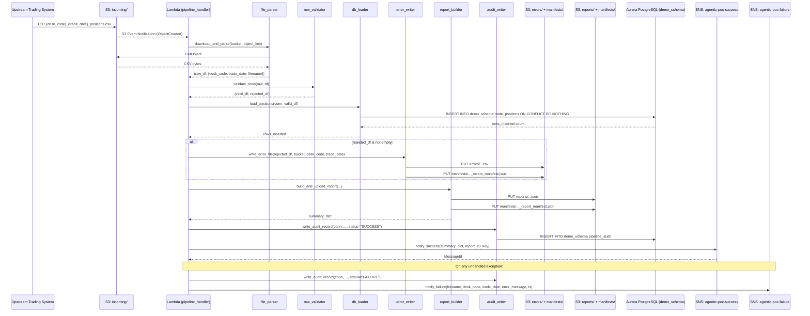
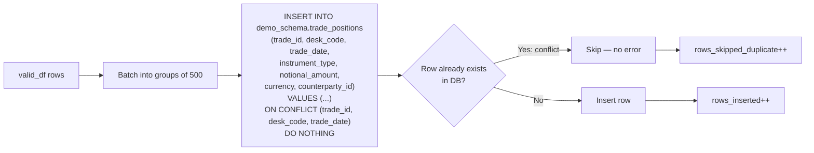
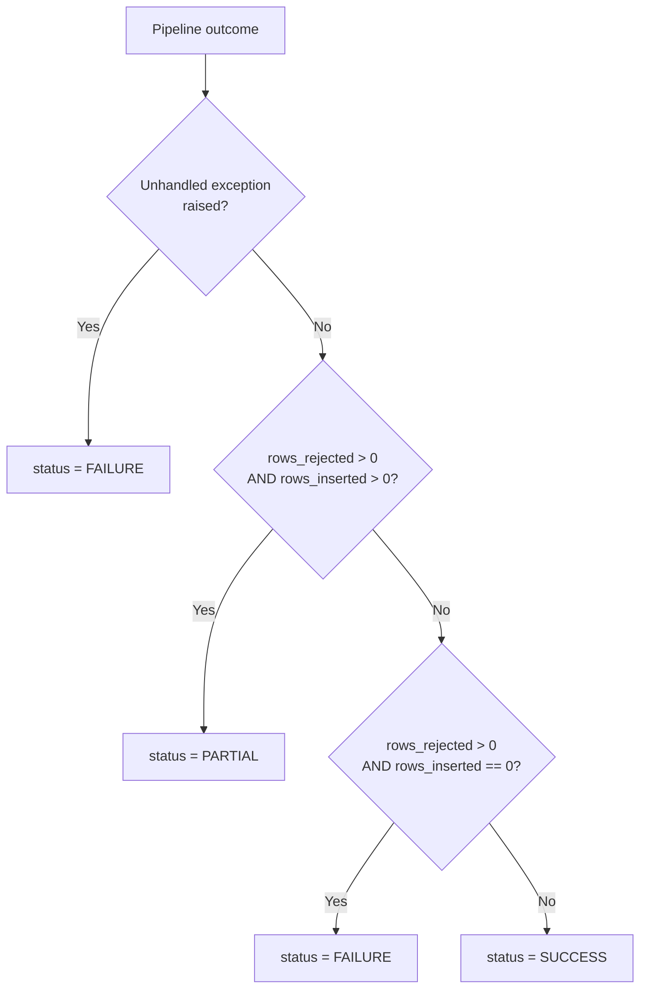

# Technical Design Document

## Daily Trade Position Ingestion Pipeline

**Project:** agentic-poc-sandbox
**Team:** Sample Trade Operations
**Date:** June 2026
**Status:** Draft

---

## COMPONENTS

### `pipeline_handler.py` — Lambda Entry Point and Orchestrator

**What it does:**
Serves as the AWS Lambda handler. Receives an S3 event notification (triggered when a file lands in `incoming/`), extracts the bucket name and object key from the event, and orchestrates the full pipeline in order: parse filename → validate → load → report → notify. Captures any unhandled exceptions and sends a failure notification via SNS. Writes one row to `demo_schema.pipeline_audit` at the end of each invocation regardless of outcome.

**Reads:**
- S3 event payload: `Records[*].s3.bucket.name`, `Records[*].s3.object.key`
- Environment variables: `S3_BUCKET`, `DB_SECRET_ID`, `SNS_SUCCESS_ARN`, `SNS_FAILURE_ARN`

**Writes:**
- Delegates to sub-modules; aggregates final counts and status for audit.

**Function signature:**
```
def lambda_handler(event: dict, context: object) -> dict:
    # Returns {"statusCode": 200|500, "body": str}
```

**Satisfies:** BAC-1, BAC-5, BAC-6, BAC-7, BAC-8

---

### `file_parser.py` — S3 File Retrieval and Filename Parsing

**What it does:**
Downloads the CSV file from S3 into memory (never to `/tmp/`). Parses the filename according to the convention `{desk_code}_{trade_date}_positions.csv` using a regex. Returns the raw DataFrame and the parsed metadata. Raises `ValueError` with a descriptive message if the filename does not match the convention.

**Reads:**
- S3 object at `s3://os.environ["S3_BUCKET"]/{object_key}`
- Filename pattern: `^(?P<desk_code>[A-Z0-9]+)_(?P<trade_date>\d{4}-\d{2}-\d{2})_positions\.csv$`

**Writes:**
- Returns `(pd.DataFrame, dict)` where dict contains `{"desk_code": str, "trade_date": str, "filename": str}`

**Function signatures:**
```
def download_and_parse(bucket: str, object_key: str) -> tuple[pd.DataFrame, dict]:

def parse_filename(filename: str) -> dict:
    # Returns {"desk_code": str, "trade_date": str, "filename": str}
    # Raises ValueError if pattern does not match
```

**Satisfies:** BAC-1, BAC-6

---

### `row_validator.py` — Per-Row Data Validation

**What it does:**
Accepts the raw DataFrame. Validates each row against all mandatory field rules. Returns two DataFrames: `valid_df` (rows that passed all checks) and `rejected_df` (rows that failed at least one check, with an additional `rejection_reason` column describing the first failing rule).

**Validation rules applied in order:**
1. **Missing mandatory fields:** `trade_id`, `desk_code`, `trade_date`, `instrument_type`, `notional_amount`, `currency`, `counterparty_id` must all be non-null and non-empty-string. Reason: `"Missing mandatory field: {field_name}"`
2. **trade_date format:** Must parse as `YYYY-MM-DD` date. Reason: `"Invalid trade_date format: {value}"`
3. **notional_amount type:** Must be castable to `NUMERIC` (decimal). Reason: `"Non-numeric notional_amount: {value}"`
4. **currency format:** Must be exactly 3 uppercase alpha characters matching `[A-Z]{3}`. Reason: `"Invalid currency format: {value}"`
5. **trade_id uniqueness per desk_code + trade_date:** Duplicate composite keys within the file are rejected. Reason: `"Duplicate trade_id within file for desk_code/trade_date"`

**Reads:**
- `pd.DataFrame` with columns: `trade_id`, `desk_code`, `trade_date`, `instrument_type`, `notional_amount`, `currency`, `counterparty_id`

**Writes:**
- Returns `(valid_df: pd.DataFrame, rejected_df: pd.DataFrame)`
- `rejected_df` has all original columns plus `rejection_reason: str`

**Function signature:**
```
def validate_rows(df: pd.DataFrame) -> tuple[pd.DataFrame, pd.DataFrame]:
    # Returns (valid_df, rejected_df)
```

**Satisfies:** BAC-2

---

### `db_loader.py` — Idempotent Database Insertion

**What it does:**
Receives the validated DataFrame. Retrieves database credentials from AWS Secrets Manager using the secret ID from `os.environ["DB_SECRET_ID"]`. Opens a `psycopg2` connection to the Aurora PostgreSQL database. Executes a batch `INSERT INTO demo_schema.trade_positions (trade_id, desk_code, trade_date, instrument_type, notional_amount, currency, counterparty_id) VALUES ... ON CONFLICT (trade_id, desk_code, trade_date) DO NOTHING`. Returns the count of rows actually inserted (not skipped). Uses `executemany` with a batch size of 500 rows.

**Reads:**
- `valid_df: pd.DataFrame` with columns matching `demo_schema.trade_positions` (excluding `loaded_at` which has a DB default)
- Secrets Manager secret at `os.environ["DB_SECRET_ID"]`: JSON keys `host`, `port`, `dbname`, `username`, `password`

**Writes:**
- Rows into `demo_schema.trade_positions`
- Returns `rows_inserted: int` (count of rows not skipped by ON CONFLICT)

**Function signatures:**
```
def get_db_connection(secret_id: str) -> psycopg2.connection:
    # Fetches secret, returns open connection

def load_positions(conn: psycopg2.connection, valid_df: pd.DataFrame) -> int:
    # Executes INSERT ... ON CONFLICT DO NOTHING
    # Returns count of inserted rows

def count_inserted(cursor, row_count_before_insert: int) -> int:
    # Uses cursor.rowcount after executemany to sum actual inserts
```

**Satisfies:** BAC-1, BAC-3, BAC-8

---

### `error_writer.py` — Rejected Row Error File Writer

**What it does:**
Accepts the `rejected_df` DataFrame. Serializes it to CSV (including the `rejection_reason` column). Uploads the CSV to S3 at the key: `errors/{desk_code}_{trade_date}_positions_errors_{timestamp_et}.csv` where `timestamp_et` is formatted as `%Y%m%dT%H%M%S` in `America/Toronto`. Also writes a manifest JSON to `manifests/{desk_code}_{trade_date}_errors_manifest.json` with the exact S3 key of the error file, allowing consumers to locate the latest error file without guessing the timestamp.

**Reads:**
- `rejected_df: pd.DataFrame` (all original columns + `rejection_reason`)
- `desk_code: str`, `trade_date: str`
- `os.environ["S3_BUCKET"]`

**Writes:**
- S3 object: `errors/{desk_code}_{trade_date}_positions_errors_{timestamp_et}.csv`
- S3 manifest: `manifests/{desk_code}_{trade_date}_errors_manifest.json`
  ```json
  {
    "desk_code": "...",
    "trade_date": "YYYY-MM-DD",
    "error_file_key": "errors/{desk_code}_{trade_date}_positions_errors_{timestamp_et}.csv",
    "generated_at_et": "YYYY-MM-DDTHH:MM:SS-05:00"
  }
  ```

**Function signature:**
```
def write_error_file(
    rejected_df: pd.DataFrame,
    bucket: str,
    desk_code: str,
    trade_date: str
) -> str:
    # Returns S3 key of the written error file
```

**Satisfies:** BAC-2

---

### `report_builder.py` — Post-Load Summary Report Generator

**What it does:**
Computes the full processing summary from the raw DataFrame, valid DataFrame, rejected DataFrame, and insertion count. Builds a JSON summary report. Uploads it to S3 at `reports/{desk_code}_{trade_date}_summary_{timestamp_et}.json`. Writes a manifest JSON at the predictable key `manifests/{desk_code}_{trade_date}_report_manifest.json` mapping logical name to actual S3 key.

**Report JSON structure** (exact field names):
```json
{
  "filename": "...",
  "desk_code": "...",
  "trade_date": "YYYY-MM-DD",
  "processing_timestamp_et": "YYYY-MM-DDTHH:MM:SSZ",
  "total_rows_received": 0,
  "rows_successfully_loaded": 0,
  "rows_rejected": 0,
  "rows_skipped_duplicate": 0,
  "counts_by_desk_code": {"DESK_A": 0},
  "min_notional_amount": 0.0,
  "max_notional_amount": 0.0,
  "null_rates_by_column": {
    "trade_id": 0.0,
    "desk_code": 0.0,
    "trade_date": 0.0,
    "instrument_type": 0.0,
    "notional_amount": 0.0,
    "currency": 0.0,
    "counterparty_id": 0.0
  }
}
```
- `rows_skipped_duplicate` = `len(valid_df) - rows_inserted`
- `null_rates_by_column` computed on the **original** raw DataFrame (before validation split)
- `counts_by_desk_code` computed on `valid_df` grouped by `desk_code`
- `min_notional_amount` / `max_notional_amount` computed on `valid_df` only (cast to float)

**Reads:**
- `raw_df: pd.DataFrame`, `valid_df: pd.DataFrame`, `rejected_df: pd.DataFrame`
- `rows_inserted: int`
- `desk_code: str`, `trade_date: str`, `filename: str`
- `os.environ["S3_BUCKET"]`

**Writes:**
- S3 report: `reports/{desk_code}_{trade_date}_summary_{timestamp_et}.json`
- S3 manifest: `manifests/{desk_code}_{trade_date}_report_manifest.json`
  ```json
  {
    "desk_code": "...",
    "trade_date": "YYYY-MM-DD",
    "report_file_key": "reports/{desk_code}_{trade_date}_summary_{timestamp_et}.json",
    "generated_at_et": "YYYY-MM-DDTHH:MM:SS-05:00"
  }
  ```
- Returns `summary_dict: dict` (same structure as the JSON)

**Function signature:**
```
def build_and_upload_report(
    raw_df: pd.DataFrame,
    valid_df: pd.DataFrame,
    rejected_df: pd.DataFrame,
    rows_inserted: int,
    desk_code: str,
    trade_date: str,
    filename: str,
    bucket: str
) -> dict:
    # Returns summary_dict
```

**Satisfies:** BAC-4, BAC-7

---

### `audit_writer.py` — Pipeline Audit Trail Writer

**What it does:**
Writes a single row to `demo_schema.pipeline_audit` after every pipeline invocation (success or failure). Called once at the end of `pipeline_handler.py`. On failure paths, `rows_inserted` and `rows_rejected` default to 0; `error_message` captures the exception string (truncated to 2000 characters). `processing_timestamp_et` is the wall-clock time at the start of the invocation, stored as `TIMESTAMPTZ` in ET.

**Reads:**
- `conn: psycopg2.connection`
- `filename: str`, `desk_code: str | None`, `trade_date: str | None`
- `status: str` — one of `"SUCCESS"`, `"FAILURE"`, `"PARTIAL"`
- `total_rows: int`, `rows_inserted: int`, `rows_rejected: int`
- `error_message: str | None`
- `processing_timestamp_et: datetime` (timezone-aware, `America/Toronto`)

**Writes:**
- One row into `demo_schema.pipeline_audit` with all columns populated.

**Function signature:**
```
def write_audit_record(
    conn: psycopg2.connection,
    filename: str,
    desk_code: str | None,
    trade_date: str | None,
    status: str,
    total_rows: int,
    rows_inserted: int,
    rows_rejected: int,
    error_message: str | None,
    processing_timestamp_et: datetime
) -> None:
```

**Satisfies:** BAC-7, BAC-8 (audit trail for regulatory readiness)

---

### `sns_notifier.py` — SNS Success and Failure Notifications

**What it does:**
Publishes structured JSON messages to SNS. Two public functions: `notify_success` and `notify_failure`. Uses `boto3.client("sns")`. Reads topic ARNs from environment variables. Never raises — logs errors at WARNING level so a notification failure does not block audit writing.

**Reads:**
- `os.environ["SNS_SUCCESS_ARN"]` for success notifications
- `os.environ["SNS_FAILURE_ARN"]` for failure notifications

**Success message payload:**
```json
{
  "event": "POSITIONS_LOADED",
  "filename": "...",
  "desk_code": "...",
  "trade_date": "YYYY-MM-DD",
  "total_rows_received": 0,
  "rows_successfully_loaded": 0,
  "rows_rejected": 0,
  "rows_skipped_duplicate": 0,
  "report_s3_key": "reports/...",
  "processing_timestamp_et": "YYYY-MM-DDTHH:MM:SS-05:00"
}
```

**Failure message payload:**
```json
{
  "event": "POSITIONS_FAILED",
  "filename": "...",
  "desk_code": "...",
  "trade_date": "YYYY-MM-DD",
  "error_message": "...",
  "processing_timestamp_et": "YYYY-MM-DDTHH:MM:SS-05:00"
}
```

**Function signatures:**
```
def notify_success(summary: dict, report_s3_key: str) -> None:

def notify_failure(
    filename: str,
    desk_code: str | None,
    trade_date: str | None,
    error_message: str,
    timestamp_et: datetime
) -> None:
```

**Satisfies:** BAC-5

---

### `secret_helper.py` — Secrets Manager Client Wrapper

**What it does:**
Provides a single function to retrieve and JSON-parse a secret from AWS Secrets Manager. Caches the result in a module-level dict to avoid redundant API calls within the same Lambda execution context. Secret ID is passed as a parameter (read from `os.environ["DB_SECRET_ID"]` by the caller — never hardcoded).

**Reads:**
- AWS Secrets Manager secret by `secret_id` parameter

**Writes:**
- Returns `dict` of parsed JSON secret values

**Function signature:**
```
def get_secret(secret_id: str) -> dict:
    # Returns parsed JSON dict
    # Raises RuntimeError if secret cannot be retrieved
```

**Expected secret JSON keys:** `host`, `port`, `dbname`, `username`, `password`

**Satisfies:** BAC-8

---

## AWS SERVICES

| Service | Role |
|---|---|
| **AWS Lambda** | Compute platform. Function `agentic-poc-sandbox-qa` is triggered by S3 event notifications when files land in `incoming/`. Executes the full pipeline per file. |
| **Amazon S3** | File storage. Bucket `agentic-poc-533266968934` holds incoming trade position files (`incoming/`), error files (`errors/`), summary reports (`reports/`), and manifest files (`manifests/`). |
| **Amazon Aurora PostgreSQL** | Reporting database. Schema `demo_schema` in database `app`. Stores `trade_positions` (validated records) and `pipeline_audit` (processing audit trail). |
| **AWS Secrets Manager** | Credential store. Secret `agentic-poc-aurora` holds Aurora connection credentials. No credentials in code or config. |
| **Amazon SNS** | Notification bus. Two topics: `agentic-poc-success` (successful loads) and `agentic-poc-failure` (failures). Downstream risk pipeline subscribes to success topic. |
| **Amazon CloudWatch Logs** | Log aggregation. Lambda writes all structured log output (via Python `logging` module) to CloudWatch for operational monitoring and audit. |

---

## DATA CONTRACTS

### Database Tables

#### `demo_schema.trade_positions`

| Column | Type | Nullable | Constraints |
|---|---|---|---|
| `trade_id` | `VARCHAR(100)` | NOT NULL | Part of PK |
| `desk_code` | `VARCHAR(50)` | NOT NULL | Part of PK |
| `trade_date` | `DATE` | NOT NULL | Part of PK |
| `instrument_type` | `VARCHAR(100)` | NOT NULL | |
| `notional_amount` | `NUMERIC(20,4)` | NOT NULL | |
| `currency` | `CHAR(3)` | NOT NULL | |
| `counterparty_id` | `VARCHAR(100)` | NOT NULL | |
| `loaded_at` | `TIMESTAMPTZ` | NOT NULL | DEFAULT `now()` |

**Primary Key:** `(trade_id, desk_code, trade_date)`
**Deduplication:** `ON CONFLICT (trade_id, desk_code, trade_date) DO NOTHING`

---

#### `demo_schema.pipeline_audit`

| Column | Type | Nullable | Constraints |
|---|---|---|---|
| `audit_id` | `BIGSERIAL` | NOT NULL | PK |
| `filename` | `VARCHAR(255)` | NOT NULL | |
| `desk_code` | `VARCHAR(50)` | NULL | |
| `trade_date` | `DATE` | NULL | |
| `status` | `VARCHAR(20)` | NOT NULL | Values: `SUCCESS`, `FAILURE`, `PARTIAL` |
| `total_rows` | `INTEGER` | NOT NULL | DEFAULT `0` |
| `rows_inserted` | `INTEGER` | NOT NULL | DEFAULT `0` |
| `rows_rejected` | `INTEGER` | NOT NULL | DEFAULT `0` |
| `error_message` | `TEXT` | NULL | |
| `processing_timestamp_et` | `TIMESTAMPTZ` | NOT NULL | Stored as ET-aware timestamp |
| `created_at` | `TIMESTAMPTZ` | NOT NULL | DEFAULT `now()` |

**Primary Key:** `(audit_id)`

---

### S3 Paths

| Path Pattern | Format | Description |
|---|---|---|
| `incoming/{desk_code}_{trade_date}_positions.csv` | CSV with header row | Input trade position files deposited by upstream systems |
| `errors/{desk_code}_{trade_date}_positions_errors_{YYYYMMDDTHHmmSS}.csv` | CSV with header row | Rejected rows with `rejection_reason` column appended |
| `reports/{desk_code}_{trade_date}_summary_{YYYYMMDDTHHmmSS}.json` | JSON | Per-file processing summary report |
| `manifests/{desk_code}_{trade_date}_errors_manifest.json` | JSON | Points to the latest error file S3 key for this desk/date |
| `manifests/{desk_code}_{trade_date}_report_manifest.json` | JSON | Points to the latest report file S3 key for this desk/date |

**Bucket:** `os.environ["S3_BUCKET"]` = `agentic-poc-533266968934`

**Input CSV expected columns (header names, exact):**
`trade_id`, `desk_code`, `trade_date`, `instrument_type`, `notional_amount`, `currency`, `counterparty_id`

**Error CSV columns:**
`trade_id`, `desk_code`, `trade_date`, `instrument_type`, `notional_amount`, `currency`, `counterparty_id`, `rejection_reason`

---

### S3 Manifest Files

**Error manifest** — `manifests/{desk_code}_{trade_date}_errors_manifest.json`:
```json
{
  "desk_code": "DESKX",
  "trade_date": "2026-06-15",
  "error_file_key": "errors/DESKX_2026-06-15_positions_errors_20260615T193045.csv",
  "generated_at_et": "2026-06-15T19:30:45-05:00"
}
```

**Report manifest** — `manifests/{desk_code}_{trade_date}_report_manifest.json`:
```json
{
  "desk_code": "DESKX",
  "trade_date": "2026-06-15",
  "report_file_key": "reports/DESKX_2026-06-15_summary_20260615T193045.json",
  "generated_at_et": "2026-06-15T19:30:45-05:00"
}
```

---

### Secrets Manager

| Env Var | Secret ID | JSON Keys |
|---|---|---|
| `DB_SECRET_ID` | `agentic-poc-aurora` | `host`, `port`, `dbname`, `username`, `password` |

---

### SNS Topics

| Env Var | ARN | Message Type |
|---|---|---|
| `SNS_SUCCESS_ARN` | `arn:aws:sns:us-east-1:533266968934:agentic-poc-success` | `POSITIONS_LOADED` JSON payload |
| `SNS_FAILURE_ARN` | `arn:aws:sns:us-east-1:533266968934:agentic-poc-failure` | `POSITIONS_FAILED` JSON payload |

---

### Environment Variables Summary

| Variable | Value Source | Used By |
|---|---|---|
| `S3_BUCKET` | Deployment config | `file_parser.py`, `error_writer.py`, `report_builder.py` |
| `DB_SECRET_ID` | Deployment config | `db_loader.py`, `secret_helper.py` |
| `SNS_SUCCESS_ARN` | Deployment config | `sns_notifier.py` |
| `SNS_FAILURE_ARN` | Deployment config | `sns_notifier.py` |

---

## DATA FLOW

### End-to-End Pipeline Flow



---

### Decision Logic: Row Validation

```mermaid
flowchart TD
    A[Input Row] --> B{All 7 mandatory fields\npresent and non-empty?}
    B -- No --> R1[Reject: Missing mandatory field: field_name]
    B -- Yes --> C{trade_date parseable\nas YYYY-MM-DD?}
    C -- No --> R2[Reject: Invalid trade_date format]
    C -- Yes --> D{notional_amount\ncastable to NUMERIC?}
    D -- No --> R3[Reject: Non-numeric notional_amount]
    D -- Yes --> E{currency matches\n[A-Z]{3}?}
    E -- No --> R4[Reject: Invalid currency format]
    E -- Yes --> F{trade_id + desk_code + trade_date\nduplicate within file?}
    F -- Yes --> R5[Reject: Duplicate trade_id within file]
    F -- No --> G[Add to valid_df]

    R1 --> H[Add to rejected_df with rejection_reason]
    R2 --> H
    R3 --> H
    R4 --> H
    R5 --> H
```

---

### Idempotent Load Logic



---

### Status Determination for Audit



---

## TECHNICAL ACCEPTANCE CRITERIA

**TAC-1: All valid positions loaded before morning risk run**
All rows passing `row_validator.validate_rows()` are persisted in `demo_schema.trade_positions` within the same Lambda invocation. The `pipeline_handler.lambda_handler` must return `{"statusCode": 200}` and the `pipeline_audit` row must have `status IN ('SUCCESS', 'PARTIAL')` for any valid rows to be considered available. Acceptance test: load a 1,000-row file with 950 valid rows; query `demo_schema.trade_positions` and assert `COUNT(*) = 950` filtered by `desk_code` and `trade_date`.

**TAC-2: Invalid records flagged with clear reasons**
`row_validator.validate_rows()` must append a `rejection_reason` column to `rejected_df`. Each reason must be a non-empty string matching one of the five defined templates (e.g., `"Missing mandatory field: trade_id"`, `"Invalid currency format: AB"`). `error_writer.write_error_file()` must upload a CSV to `errors/{desk_code}_{trade_date}_positions_errors_{timestamp_et}.csv` containing all rejected rows plus the `rejection_reason` column. Acceptance test: submit a file with one row missing `counterparty_id`; assert error CSV exists in S3 with `rejection_reason = "Missing mandatory field: counterparty_id"`.

**TAC-3: Resubmitting a file does not double-count positions**
`db_loader.load_positions()` uses `INSERT INTO demo_schema.trade_positions ... ON CONFLICT (trade_id, desk_code, trade_date) DO NOTHING`. Acceptance test: invoke `lambda_handler` twice with the identical S3 file; after the first run assert `COUNT(*) = N`; after the second run assert `COUNT(*) = N` (unchanged). The `rows_inserted` value returned on the second run must be `0`.

**TAC-4: Summary report accurately reflects received, accepted, and rejected counts**
`report_builder.build_and_upload_report()` must produce JSON where `total_rows_received = len(raw_df)`, `rows_successfully_loaded = rows_inserted` (actual DB inserts, not just valid rows), `rows_rejected = len(rejected_df)`, and `rows_skipped_duplicate = len(valid_df) - rows_inserted`. The `null_rates_by_column` values must equal `(count of nulls in column / total_rows_received)` computed on `raw_df`. `counts_by_desk_code` must be grouped on `valid_df`. Acceptance test: ingest a known file; assert each field in the report JSON equals the independently computed expected value.

**TAC-5: Risk pipeline automatically notified — no manual trigger**
`sns_notifier.notify_success()` must publish to `os.environ["SNS_SUCCESS_ARN"]` within the same Lambda invocation as the load. The SNS message `Subject` must be `"POSITIONS_LOADED"` and the `Message` body must be a valid JSON string containing all fields defined in the success payload schema. Acceptance test: assert `boto3.client("sns").publish()` was called with the correct `TopicArn` and a parseable JSON message containing `"event": "POSITIONS_LOADED"`.

**TAC-6: Processing completes within operations window**
Lambda timeout is set to accommodate 100,000-row files within 60 seconds (performance non-functional requirement). Acceptance test: run the pipeline with a 10,000-row file and assert end-to-end wall-clock time < 60 seconds. Batch insert uses `executemany` in batches of 500 rows to achieve this. CloudWatch duration metric must not exceed 60,000ms for a 10,000-row file in integration testing.

**TAC-7: All timestamps in Eastern Time**
Every timestamp written by the system — `processing_timestamp_et` in `pipeline_audit`, `generated_at_et` in manifest files, `processing_timestamp_et` in the report JSON, and SNS message timestamps — must be produced using `pytz.timezone("America/Toronto")`. Acceptance test: assert all timestamp strings in S3 manifests, report JSON, and DB audit rows are offset-aware and match `America/Toronto` offset at time of execution (i.e., `-04:00` or `-05:00` depending on DST). UTC-only timestamps are a test failure.

**TAC-8: No credentials in code or configuration**
`secret_helper.get_secret()` must retrieve the secret from AWS Secrets Manager using `boto3.client("secretsmanager").get_secret_value(SecretId=secret_id)` where `secret_id = os.environ["DB_SECRET_ID"]`. No connection string, password, username, or host value may appear as a literal in any `.py` file. Acceptance test: static analysis scan (e.g., `grep` for known credential patterns) over all `.py` files returns zero matches. DB connection in `db_loader.get_db_connection()` uses only values returned from `secret_helper.get_secret()`.

---

## OPEN QUESTIONS

**OQ-1: Audit status when ALL rows in a file are rejected**
When `len(valid_df) == 0` and `len(rejected_df) == total_rows`, should the pipeline record status as `"FAILURE"` (no data loaded, operation failed to deliver value) or `"PARTIAL"` (file was processed successfully but every row was invalid)? This affects the SNS topic used for notification and downstream pipeline behaviour. The status decision tree in the Data Flow section currently maps this to `"FAILURE"` — confirm or override.

**OQ-2: Behavior when filename does not match naming convention**
If a file lands in `incoming/` with a filename that does not match `{desk_code}_{trade_date}_positions.csv`, `file_parser.parse_filename()` raises `ValueError`. Should this be treated as a hard `FAILURE` (SNS failure notification sent, audit row written with `status=FAILURE`), or should the file be silently ignored (no audit row, no notification)? Current design treats it as `FAILURE`.

---

## ASSUMPTIONS

**A-1: Lambda trigger configuration**
Assumed the Lambda function `agentic-poc-sandbox-qa` is already configured with an S3 event notification trigger on the bucket `agentic-poc-533266968934` for `s3:ObjectCreated:*` events filtered to the `incoming/` prefix. The pipeline code does not configure this trigger.

**A-2: Lambda invoked once per file**
Assumed one Lambda invocation per S3 object created event. If the S3 event delivers multiple records in a single invocation (batch), `pipeline_handler.lambda_handler` will process the first record only and log a warning for additional records. This is a conservative safety measure.

**A-3: Input CSV always has a header row**
Assumed upstream systems always include a header row matching the exact column names: `trade_id`, `desk_code`, `trade_date`, `instrument_type`, `notional_amount`, `currency`, `counterparty_id`. Files without a header will fail validation at parse time.

**A-4: Aurora PostgreSQL is already provisioned and the schema exists**
Assumed `demo_schema`, `demo_schema.trade_positions`, and `demo_schema.pipeline_audit` tables already exist in the `app` database and match the YAML-defined schemas exactly. This pipeline does not perform schema migrations.

**A-5: PARTIAL status definition**
Assumed `status = "PARTIAL"` is used when both valid rows were inserted AND rejected rows exist. Success notification (not failure) is sent for `PARTIAL` status, since downstream systems need to know positions are available. The summary report and notification payload include `rows_rejected` so the operations team can see the partial outcome.

**A-6: Error file and report always written**
Assumed error file is written only when `len(rejected_df) > 0`. Report is always written on every invocation that completes the validation step, even if all rows are rejected or all rows are skipped as duplicates.

**A-7: Currency field validation**
Assumed `currency` must match `[A-Z]{3}` exactly (3 uppercase letters). Mixed case or non-alpha values are rejected. The DB column is `CHAR(3)` which allows any character — the validation rule is stricter than the DB type.

**A-8: `desk_code` and `trade_date` in the filename are authoritative**
Assumed the `desk_code` and `trade_date` in the filename are used for S3 key construction (error files, reports, manifests). Row-level `desk_code` and `trade_date` values are validated independently. Mismatches between filename metadata and row data are not treated as validation errors (rows stand on their own values).

**A-9: Secrets Manager secret format**
Assumed the secret `agentic-poc-aurora` is a JSON string with keys `host`, `port`, `dbname`, `username`, `password`. If the secret uses different key names (e.g., `user` instead of `username`), `db_loader.get_db_connection()` will fail with a `KeyError`.

**A-10: No file archival or deletion**
Assumed processed files in `incoming/` are not moved or deleted after processing. The pipeline is idempotent so reprocessing the same file is safe. File lifecycle management (e.g., S3 lifecycle rules) is handled outside this pipeline.