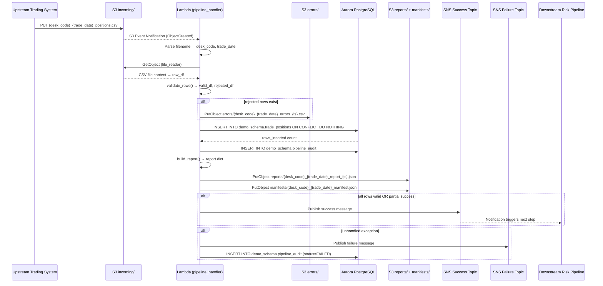
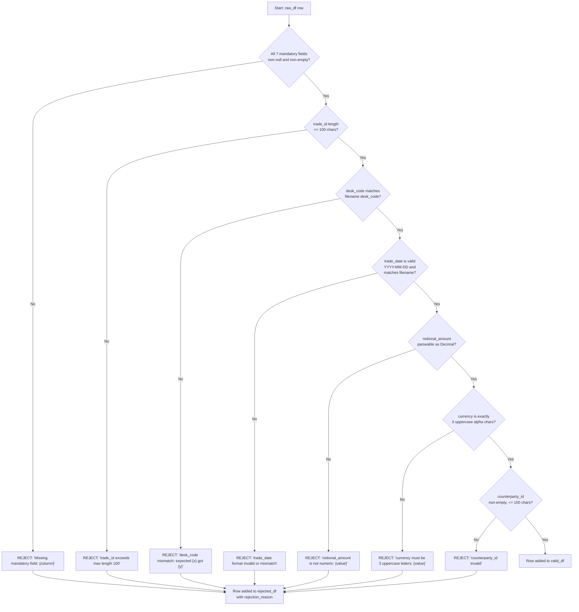
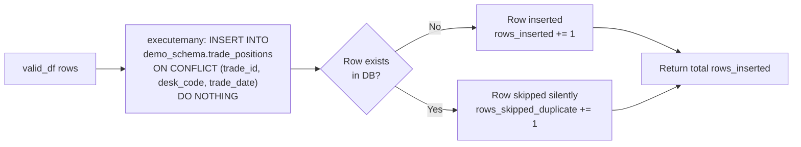
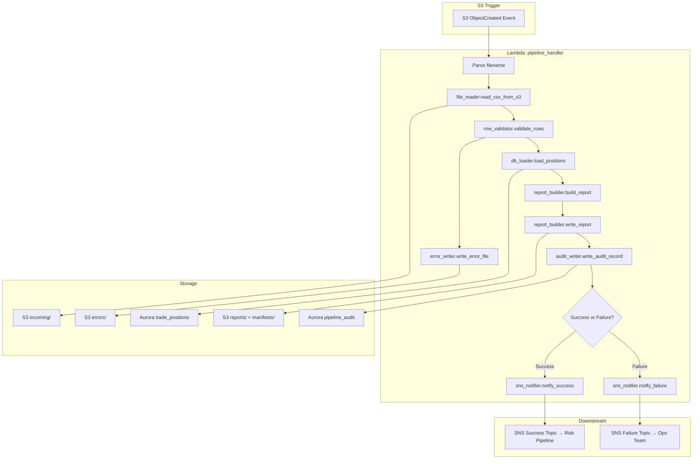

# Technical Design Document

## Daily Trade Position Ingestion Pipeline

**Project:** agentic-poc-sandbox
**Team:** Sample Trade Operations
**Change Type:** New Feature
**Date:** June 2026
**Status:** Draft

---

### COMPONENTS

---

#### `pipeline_handler.py` — Lambda Entry Point and Orchestrator

**What it does:**
Serves as the AWS Lambda handler function (`lambda_handler(event, context)`). Receives the S3 event notification, extracts the S3 bucket and object key from `event["Records"][0]["s3"]`, then orchestrates the full pipeline by calling: `file_reader.read_csv_from_s3()` → `row_validator.validate_rows()` → `db_loader.load_positions()` → `report_builder.build_report()` → `audit_writer.write_audit_record()` → `sns_notifier.notify_success()` or `sns_notifier.notify_failure()`. On any unhandled exception, catches the error, calls `audit_writer.write_audit_record()` with `status="FAILED"`, calls `sns_notifier.notify_failure()`, and re-raises. Parses `desk_code` and `trade_date` from the S3 object key using the filename convention `{desk_code}_{trade_date}_positions.csv`.

**Reads:** S3 event payload: `event["Records"][0]["s3"]["bucket"]["name"]`, `event["Records"][0]["s3"]["object"]["key"]`

**Writes:** Nothing directly — delegates to sub-modules.

**Satisfies:** BAC-1, BAC-5, BAC-6

---

#### `file_reader.py` — S3 CSV Reader

**What it does:**
Exposes `read_csv_from_s3(bucket: str, key: str) -> pd.DataFrame`. Uses `boto3.client("s3")` to call `get_object(Bucket=bucket, Key=key)`. Reads the response body and parses it into a pandas DataFrame using `pd.read_csv()` with `dtype=str` (all columns as strings to preserve original values for validation). Returns the raw DataFrame. Raises `FileReadError` (a custom exception defined in `pipeline_exceptions.py`) if the S3 object cannot be retrieved or if the CSV cannot be parsed.

**Reads:** S3 object at `s3://agentic-poc-533266968934/{key}` where key matches `incoming/{desk_code}_{trade_date}_positions.csv`

**Writes:** Nothing — returns in-memory DataFrame

**Satisfies:** BAC-1, BAC-6

---

#### `row_validator.py` — Row-Level Validation

**What it does:**
Exposes `validate_rows(df: pd.DataFrame, desk_code: str, trade_date: str) -> tuple[pd.DataFrame, pd.DataFrame]`. Iterates each row applying the following checks in order:

1. **Mandatory field presence:** All seven mandatory fields (`trade_id`, `desk_code`, `trade_date`, `instrument_type`, `notional_amount`, `currency`, `counterparty_id`) must be non-null and non-empty string.
2. **trade_id format:** Must be non-empty string, max length 100 characters.
3. **desk_code consistency:** Must match the `desk_code` parsed from the filename.
4. **trade_date format:** Must be a valid date in `YYYY-MM-DD` format and match the `trade_date` parsed from the filename.
5. **notional_amount numeric:** Must be parseable as `NUMERIC(20,4)` — i.e., convertible to `Decimal` without error.
6. **currency format:** Must be exactly 3 uppercase alphabetic characters.
7. **counterparty_id:** Must be non-empty, max length 100 characters.

Returns a tuple: `(valid_df, rejected_df)`. `rejected_df` contains all original columns plus an additional `rejection_reason: str` column with a human-readable message identifying the first failing check per row (e.g., `"Missing mandatory field: notional_amount"`, `"notional_amount is not numeric: 'abc'"`, `"currency must be 3 uppercase letters: 'US'"`, `"trade_date format invalid: '2026/06/01'"`).

**Reads:** Raw DataFrame from `file_reader.py`; `desk_code: str`; `trade_date: str`

**Writes:** Two DataFrames (in memory); rejected rows DataFrame written to S3 via `error_writer.py`

**Satisfies:** BAC-2, BAC-4

---

#### `error_writer.py` — Rejected Row Error File Writer

**What it does:**
Exposes `write_error_file(rejected_df: pd.DataFrame, bucket: str, desk_code: str, trade_date: str, processing_ts: datetime) -> str`. Serializes `rejected_df` (including the `rejection_reason` column) to CSV and uploads to S3 at key `errors/{desk_code}_{trade_date}_errors_{ts_str}.csv` where `ts_str` is `processing_ts.strftime("%Y%m%dT%H%M%S")` in ET. Returns the full S3 key written. If `rejected_df` is empty, does not write any file and returns `None`.

**Reads:** `rejected_df: pd.DataFrame` (columns: all original input columns + `rejection_reason`)

**Writes:** S3 object at `s3://agentic-poc-533266968934/errors/{desk_code}_{trade_date}_errors_{ts_str}.csv`

CSV structure:
```
trade_id, desk_code, trade_date, instrument_type, notional_amount, currency, counterparty_id, rejection_reason
```

**Satisfies:** BAC-2

---

#### `db_loader.py` — Idempotent Database Loader

**What it does:**
Exposes `load_positions(valid_df: pd.DataFrame) -> int`. Retrieves DB credentials by calling `secrets_client.get_secret(os.environ["DB_SECRET_ID"])`. Establishes a `psycopg2` connection to the Aurora PostgreSQL database (`dbname=app`, schema=`demo_schema`). For each row in `valid_df`, executes:

```sql
INSERT INTO demo_schema.trade_positions
    (trade_id, desk_code, trade_date, instrument_type, notional_amount, currency, counterparty_id)
VALUES
    (%s, %s, %s, %s, %s, %s, %s)
ON CONFLICT (trade_id, desk_code, trade_date) DO NOTHING;
```

Uses `executemany()` for batching. After execution, queries `cursor.rowcount` to count actual inserted rows (rows skipped by `ON CONFLICT DO NOTHING` are not counted). Returns the total count of rows actually inserted. `loaded_at` is populated by the database default (`now()`). Raises `DatabaseLoadError` on connection or execution failure.

**Reads:** `valid_df: pd.DataFrame` (columns: `trade_id`, `desk_code`, `trade_date`, `instrument_type`, `notional_amount`, `currency`, `counterparty_id`)

**Writes:** Rows into `demo_schema.trade_positions`

**Satisfies:** BAC-1, BAC-3, BAC-6

---

#### `report_builder.py` — Post-Load Summary Report Builder

**What it does:**
Exposes `build_report(raw_df: pd.DataFrame, valid_df: pd.DataFrame, rejected_df: pd.DataFrame, rows_inserted: int, desk_code: str, trade_date: str, processing_ts: datetime) -> dict`. Computes the following summary statistics and returns them as a Python dict:

- `total_rows`: `len(raw_df)`
- `rows_loaded`: `rows_inserted` (actual DB inserts, not just validated rows)
- `rows_rejected`: `len(rejected_df)`
- `rows_skipped_duplicate`: `len(valid_df) - rows_inserted`
- `processing_timestamp_et`: `processing_ts.isoformat()` (ET)
- `desk_code`: `desk_code`
- `trade_date`: `trade_date`
- `counts_by_desk_code`: `dict` of `{desk_code: count}` from `valid_df.groupby("desk_code").size()` (will typically be a single entry)
- `notional_min`: `float(valid_df["notional_amount"].astype(float).min())` if `valid_df` non-empty, else `None`
- `notional_max`: `float(valid_df["notional_amount"].astype(float).max())` if `valid_df` non-empty, else `None`
- `null_rates`: `dict` of `{column_name: null_rate_float}` for each of the 7 mandatory columns, computed as `raw_df[col].isna().mean()` over the raw DataFrame
- `error_file_key`: S3 key of the error file if written, else `None`

Also exposes `write_report(report: dict, bucket: str, desk_code: str, trade_date: str, processing_ts: datetime) -> str`. Serializes `report` to JSON and uploads to S3 at key `reports/{desk_code}_{trade_date}_report_{ts_str}.json`. Returns the S3 key. Also writes a manifest file at `manifests/{desk_code}_{trade_date}_manifest.json` containing:
```json
{
  "desk_code": "<desk_code>",
  "trade_date": "<trade_date>",
  "report_key": "reports/{desk_code}_{trade_date}_report_{ts_str}.json",
  "error_key": "<error_file_key or null>",
  "processing_timestamp_et": "<iso8601>"
}
```

**Reads:** `raw_df`, `valid_df`, `rejected_df` DataFrames; scalar counts; `processing_ts: datetime`

**Writes:**
- S3 JSON report at `s3://agentic-poc-533266968934/reports/{desk_code}_{trade_date}_report_{ts_str}.json`
- S3 manifest at `s3://agentic-poc-533266968934/manifests/{desk_code}_{trade_date}_manifest.json`

**Satisfies:** BAC-4, BAC-7

---

#### `audit_writer.py` — Pipeline Audit Trail Writer

**What it does:**
Exposes `write_audit_record(filename: str, desk_code: Optional[str], trade_date: Optional[date], status: str, total_rows: int, rows_inserted: int, rows_rejected: int, error_message: Optional[str], processing_ts: datetime) -> None`. Retrieves DB credentials from Secrets Manager via `secrets_client.get_secret(os.environ["DB_SECRET_ID"])`. Inserts one row into `demo_schema.pipeline_audit`:

```sql
INSERT INTO demo_schema.pipeline_audit
    (filename, desk_code, trade_date, status, total_rows, rows_inserted,
     rows_rejected, error_message, processing_timestamp_et)
VALUES
    (%s, %s, %s, %s, %s, %s, %s, %s, %s);
```

`status` must be one of: `"SUCCESS"`, `"PARTIAL"`, `"FAILED"`. `processing_timestamp_et` is the ET-localized `datetime` object passed as `processing_ts`. `audit_id` is auto-generated by `BIGSERIAL`. `created_at` is populated by the DB default `now()`.

**Reads:** Scalar arguments as listed above

**Writes:** One row into `demo_schema.pipeline_audit`

**Satisfies:** BAC-4, BAC-7, BAC-8 (audit trail for regulatory readiness)

---

#### `sns_notifier.py` — SNS Success and Failure Notifier

**What it does:**
Exposes two functions:

1. `notify_success(report: dict) -> None` — Publishes to the SNS topic ARN at `os.environ["SNS_SUCCESS_TOPIC_ARN"]`. Message is a JSON string (see DATA CONTRACTS for schema). Subject: `"Trade Position Ingestion Success: {desk_code} {trade_date}"`.

2. `notify_failure(filename: str, error_message: str, desk_code: Optional[str], trade_date: Optional[str], processing_ts: datetime) -> None` — Publishes to the SNS topic ARN at `os.environ["SNS_FAILURE_TOPIC_ARN"]`. Message is a JSON string (see DATA CONTRACTS for schema). Subject: `"Trade Position Ingestion FAILED: {filename}"`.

Both functions use `boto3.client("sns")` with `publish(TopicArn=..., Message=..., Subject=...)`.

**Reads:** Report dict or error details

**Writes:** SNS message to success or failure topic

**Satisfies:** BAC-5

---

#### `secrets_client.py` — Secrets Manager Reader

**What it does:**
Exposes `get_secret(secret_id: str) -> dict`. Calls `boto3.client("secretsmanager").get_secret_value(SecretId=secret_id)`. Parses `SecretString` as JSON and returns the resulting dict. Raises `SecretsRetrievalError` on any `ClientError`. Result is cached in a module-level dict keyed by `secret_id` so that repeated calls within the same Lambda invocation do not make redundant API calls.

**Reads:** `secret_id: str` (value from `os.environ["DB_SECRET_ID"]`)

**Writes:** Nothing (returns in-memory dict)

**Satisfies:** BAC-8

---

#### `pipeline_exceptions.py` — Custom Exception Definitions

**What it does:**
Defines the following custom exception classes (all inherit from `Exception`):
- `FileReadError` — raised when S3 read or CSV parse fails
- `ValidationError` — raised when the entire DataFrame cannot be processed (not for row-level rejections, which are handled normally)
- `DatabaseLoadError` — raised when `psycopg2` connection or execution fails
- `SecretsRetrievalError` — raised when Secrets Manager call fails
- `FilenameParseError` — raised when the S3 key does not match `{desk_code}_{trade_date}_positions.csv` under the `incoming/` prefix

**Reads:** N/A

**Writes:** N/A

**Satisfies:** All BACs (enables consistent error handling)

---

### AWS SERVICES

| Service | Role |
|---|---|
| **AWS Lambda** | Compute platform. `agentic-poc-sandbox-qa` function executes the pipeline handler triggered by S3 event notifications on the `incoming/` prefix. |
| **Amazon S3** | Storage for input position CSV files (`incoming/` prefix), rejected-row error files (`errors/` prefix), summary reports (`reports/` prefix), and manifest files (`manifests/` prefix). Bucket: `agentic-poc-533266968934`. |
| **Amazon Aurora PostgreSQL** | Reporting database (`dbname=app`, schema `demo_schema`). Stores validated trade positions in `demo_schema.trade_positions` and processing audit records in `demo_schema.pipeline_audit`. |
| **AWS Secrets Manager** | Stores database credentials under secret ID `agentic-poc-aurora`. Retrieved at runtime via `secrets_client.py`. |
| **Amazon SNS** | Two topics: success topic (`agentic-poc-success`) notifies downstream risk pipeline on successful file completion; failure topic (`agentic-poc-failure`) notifies operations team on processing failure. |
| **AWS IAM** | Lambda execution role grants minimum permissions: `s3:GetObject` on `incoming/`, `s3:PutObject` on `errors/`, `reports/`, `manifests/`, `secretsmanager:GetSecretValue` on `agentic-poc-aurora`, `sns:Publish` on both topics, Aurora connectivity via VPC. |

---

### DATA CONTRACTS

---

#### Database Tables

##### `demo_schema.trade_positions`

| Column | Data Type | Nullable | Default | Notes |
|---|---|---|---|---|
| `trade_id` | `VARCHAR(100)` | NOT NULL | — | Part of composite PK |
| `desk_code` | `VARCHAR(50)` | NOT NULL | — | Part of composite PK |
| `trade_date` | `DATE` | NOT NULL | — | Part of composite PK |
| `instrument_type` | `VARCHAR(100)` | NOT NULL | — | |
| `notional_amount` | `NUMERIC(20,4)` | NOT NULL | — | |
| `currency` | `CHAR(3)` | NOT NULL | — | ISO 4217, 3 uppercase letters |
| `counterparty_id` | `VARCHAR(100)` | NOT NULL | — | |
| `loaded_at` | `TIMESTAMPTZ` | NOT NULL | `now()` | Set by DB on insert |

**Primary Key:** `(trade_id, desk_code, trade_date)`
**Unique Constraint:** Enforced by primary key — used for `ON CONFLICT DO NOTHING` idempotency.
**Index:** Primary key index (implicit). Consider additional index on `(desk_code, trade_date)` for reporting queries.

---

##### `demo_schema.pipeline_audit`

| Column | Data Type | Nullable | Default | Notes |
|---|---|---|---|---|
| `audit_id` | `BIGSERIAL` | NOT NULL | auto-increment | Primary key |
| `filename` | `VARCHAR(255)` | NOT NULL | — | S3 object key of processed file |
| `desk_code` | `VARCHAR(50)` | NULL | — | Null if filename parsing fails |
| `trade_date` | `DATE` | NULL | — | Null if filename parsing fails |
| `status` | `VARCHAR(20)` | NOT NULL | — | One of: `SUCCESS`, `PARTIAL`, `FAILED` |
| `total_rows` | `INTEGER` | NOT NULL | `0` | |
| `rows_inserted` | `INTEGER` | NOT NULL | `0` | |
| `rows_rejected` | `INTEGER` | NOT NULL | `0` | |
| `error_message` | `TEXT` | NULL | — | Populated on `FAILED` or `PARTIAL` |
| `processing_timestamp_et` | `TIMESTAMPTZ` | NOT NULL | — | ET-localized timestamp |
| `created_at` | `TIMESTAMPTZ` | NOT NULL | `now()` | Set by DB on insert |

**Primary Key:** `(audit_id)`

---

#### S3 Paths

| Path Pattern | Format | Description |
|---|---|---|
| `incoming/{desk_code}_{trade_date}_positions.csv` | CSV, UTF-8, comma-delimited, header row | Input file deposited by upstream trading systems |
| `errors/{desk_code}_{trade_date}_errors_{YYYYMMDDTHHMMSS}.csv` | CSV, UTF-8, comma-delimited, header row | Rejected rows with `rejection_reason` column appended |
| `reports/{desk_code}_{trade_date}_report_{YYYYMMDDTHHMMSS}.json` | JSON | Post-load summary report |
| `manifests/{desk_code}_{trade_date}_manifest.json` | JSON | Predictable-key manifest pointing to timestamped report/error files |

**Input CSV expected columns (header must match exactly):**
```
trade_id, desk_code, trade_date, instrument_type, notional_amount, currency, counterparty_id
```
Additional columns in the input file are ignored.

**Error CSV columns:**
```
trade_id, desk_code, trade_date, instrument_type, notional_amount, currency, counterparty_id, rejection_reason
```

**Report JSON structure:**
```json
{
  "total_rows": <int>,
  "rows_loaded": <int>,
  "rows_rejected": <int>,
  "rows_skipped_duplicate": <int>,
  "processing_timestamp_et": "<ISO 8601 string, ET>",
  "desk_code": "<string>",
  "trade_date": "<YYYY-MM-DD>",
  "counts_by_desk_code": {"<desk_code>": <int>},
  "notional_min": <float or null>,
  "notional_max": <float or null>,
  "null_rates": {
    "trade_id": <float>,
    "desk_code": <float>,
    "trade_date": <float>,
    "instrument_type": <float>,
    "notional_amount": <float>,
    "currency": <float>,
    "counterparty_id": <float>
  },
  "error_file_key": "<string or null>"
}
```

**Manifest JSON structure:**
```json
{
  "desk_code": "<string>",
  "trade_date": "<YYYY-MM-DD>",
  "report_key": "reports/{desk_code}_{trade_date}_report_{ts_str}.json",
  "error_key": "<string or null>",
  "processing_timestamp_et": "<ISO 8601 string, ET>"
}
```

---

#### Secrets Manager

**Environment variable:** `DB_SECRET_ID` = `"agentic-poc-aurora"`

**Expected JSON keys inside the secret:**
```json
{
  "host": "<Aurora cluster endpoint>",
  "port": <integer, typically 5432>,
  "dbname": "app",
  "username": "<db user>",
  "password": "<db password>"
}
```

---

#### SNS Topics

**Environment variables:**
- `SNS_SUCCESS_TOPIC_ARN` = `"arn:aws:sns:us-east-1:533266968934:agentic-poc-success"`
- `SNS_FAILURE_TOPIC_ARN` = `"arn:aws:sns:us-east-1:533266968934:agentic-poc-failure"`

**Success message JSON structure:**
```json
{
  "event": "TRADE_POSITION_INGESTION_SUCCESS",
  "desk_code": "<string>",
  "trade_date": "<YYYY-MM-DD>",
  "filename": "<S3 key>",
  "total_rows": <int>,
  "rows_loaded": <int>,
  "rows_rejected": <int>,
  "rows_skipped_duplicate": <int>,
  "processing_timestamp_et": "<ISO 8601 string, ET>",
  "report_key": "<S3 key of report JSON>",
  "manifest_key": "<S3 key of manifest JSON>"
}
```

**Failure message JSON structure:**
```json
{
  "event": "TRADE_POSITION_INGESTION_FAILED",
  "filename": "<S3 key>",
  "desk_code": "<string or null>",
  "trade_date": "<YYYY-MM-DD or null>",
  "error_message": "<string>",
  "processing_timestamp_et": "<ISO 8601 string, ET>"
}
```

---

#### Environment Variables Summary

| Variable | Value |
|---|---|
| `DB_SECRET_ID` | `agentic-poc-aurora` |
| `S3_BUCKET` | `agentic-poc-533266968934` |
| `SNS_SUCCESS_TOPIC_ARN` | `arn:aws:sns:us-east-1:533266968934:agentic-poc-success` |
| `SNS_FAILURE_TOPIC_ARN` | `arn:aws:sns:us-east-1:533266968934:agentic-poc-failure` |

---

### DATA FLOW

#### End-to-End Pipeline Flow



---

#### Validation Logic Detail



---

#### Idempotency and Deduplication Flow



---

#### Orchestration Swimlane



---

### TECHNICAL ACCEPTANCE CRITERIA

**TAC-1: Valid positions available before morning risk run**
`db_loader.load_positions()` executes `INSERT INTO demo_schema.trade_positions ... ON CONFLICT (trade_id, desk_code, trade_date) DO NOTHING` via `executemany()`. Acceptance test: after pipeline execution, `SELECT COUNT(*) FROM demo_schema.trade_positions WHERE desk_code = %s AND trade_date = %s` must equal the count of valid rows in the input file minus any pre-existing duplicates. Pipeline must complete end-to-end within 60 seconds for a 10,000-row file (timed integration test).

**TAC-2: Invalid records flagged with clear reasons**
`row_validator.validate_rows()` appends a `rejection_reason` string to each rejected row. The `rejection_reason` message must identify the specific failing field and value (e.g., `"notional_amount is not numeric: 'abc'"`, `"Missing mandatory field: currency"`). `error_writer.write_error_file()` writes these rows to `errors/{desk_code}_{trade_date}_errors_{ts}.csv`. Acceptance test: given an input file with 3 deliberately malformed rows (one missing field, one bad date, one non-numeric notional), the error CSV must contain exactly 3 rows, each with a distinct non-empty `rejection_reason` identifying the correct field.

**TAC-3: Resubmission does not double-count positions**
`db_loader.load_positions()` uses `INSERT ... ON CONFLICT (trade_id, desk_code, trade_date) DO NOTHING`. Acceptance test: process the same file twice. Assert that `SELECT COUNT(*) FROM demo_schema.trade_positions WHERE desk_code = %s AND trade_date = %s` returns the same value after both runs. Assert `rows_inserted` from the second run equals `0` (or equals only the count of genuinely new rows if the file was modified).

**TAC-4: Summary report accurately reflects received/accepted/rejected counts**
`report_builder.build_report()` sets `total_rows = len(raw_df)`, `rows_loaded = rows_inserted` (actual DB inserts), `rows_rejected = len(rejected_df)`, `rows_skipped_duplicate = len(valid_df) - rows_inserted`. Acceptance test: given an input file of 100 rows where 10 are invalid and 5 are pre-existing duplicates, the report JSON must contain `total_rows=100`, `rows_rejected=10`, `rows_loaded=85`, `rows_skipped_duplicate=5`. Also: `audit_writer.write_audit_record()` inserts one row per file into `demo_schema.pipeline_audit` with matching counts.

**TAC-5: Downstream pipeline automatically notified**
`sns_notifier.notify_success()` publishes to `os.environ["SNS_SUCCESS_TOPIC_ARN"]` with `event="TRADE_POSITION_INGESTION_SUCCESS"` and full report statistics. `sns_notifier.notify_failure()` publishes to `os.environ["SNS_FAILURE_TOPIC_ARN"]` with `event="TRADE_POSITION_INGESTION_FAILED"`. Acceptance test: mock `boto3.client("sns").publish` and assert it is called exactly once with the correct `TopicArn` and a JSON-parseable `Message` containing the expected `event` field and non-null `desk_code`, `trade_date`.

**TAC-6: Processing completes within operations window**
End-to-end Lambda execution (from S3 event receipt to SNS publish) must complete within 60 seconds for a 10,000-row input file. Acceptance test: integration test with a 10,000-row synthetic file; assert `time.time()` delta from handler entry to return is ≤ 60 seconds. The Lambda function timeout must be set to at least 120 seconds to accommodate the 100,000-row upper bound without timeout failure.

**TAC-7: All timestamps in Eastern Time**
Every `datetime` written to `demo_schema.pipeline_audit.processing_timestamp_et` and every `processing_timestamp_et` field in report JSON and SNS messages must be timezone-aware and localized to `pytz.timezone("America/Toronto")`. Acceptance test: read `processing_timestamp_et` from `demo_schema.pipeline_audit` after a run; assert that `datetime.utcoffset()` is either `-04:00` (EDT) or `-05:00` (EST). Assert that report JSON `processing_timestamp_et` parses to a timezone-aware datetime with America/Toronto offset.

**TAC-8: No credentials in code or config**
`secrets_client.get_secret()` calls `boto3.client("secretsmanager").get_secret_value(SecretId=os.environ["DB_SECRET_ID"])` at runtime. `db_loader.load_positions()` and `audit_writer.write_audit_record()` obtain all connection parameters exclusively from the returned secret dict. Acceptance test: static analysis (grep/AST scan) of all `.py` files asserts zero occurrences of literal password strings, connection strings, or AWS credentials. No `psycopg2.connect()` call in any module may contain a hardcoded `password=` keyword argument with a string literal.

---

### OPEN QUESTIONS

**OQ-1: Partial success status definition**
The BRD states "validated rows are loaded" and "rejected rows produce an error file," but does not define whether a file with some rejected rows (but at least one valid insertion) should be considered a `SUCCESS` or `PARTIAL` status in `pipeline_audit.status` and in the SNS notification routing. Should files with any rejected rows always send a success notification (because valid rows were loaded), or should a separate `PARTIAL` status trigger a different notification path? This determines whether `notify_success()` or `notify_failure()` is called when `rows_rejected > 0`.

**OQ-2: Behavior when all rows are rejected**
If every row in the input file fails validation (zero valid rows), should the pipeline: (a) record status `FAILED` and publish to the failure SNS topic, or (b) record status `PARTIAL` / `SUCCESS` with `rows_loaded=0` and still publish to the success topic? This affects whether the downstream risk pipeline is notified (and with what message) for a fully-rejected file.

**OQ-3: Resubmission file key behavior**
The BRD specifies files follow naming convention `{desk_code}_{trade_date}_positions.csv` and the system must be idempotent. If the upstream system resubmits a corrected file for the same desk/date, will it overwrite the same S3 key (same filename), or deposit a new file with a different key (e.g., a version suffix)? The answer determines whether the Lambda will be triggered once or multiple times for a resubmission, and whether the `incoming/` prefix needs to be cleaned up between runs.

---

### ASSUMPTIONS

1. **Lambda trigger:** The existing Lambda function `agentic-poc-sandbox-qa` is configured with an S3 event notification trigger on bucket `agentic-poc-533266968934` for `ObjectCreated` events filtered to prefix `incoming/` and suffix `.csv`. This trigger configuration is assumed to already exist or will be provisioned as part of deployment outside this codebase.

2. **VPC and network access:** The Lambda function has VPC configuration (subnet IDs, security groups) allowing it to reach the Aurora PostgreSQL cluster. This is assumed to be pre-configured in the deployment environment.

3. **Database tables exist:** `demo_schema.trade_positions` and `demo_schema.pipeline_audit` tables exist in the Aurora database with the exact schemas defined in the YAML. The pipeline code does not create or migrate tables.

4. **Input file encoding:** Input CSV files are UTF-8 encoded with a standard comma delimiter and a single header row matching the expected column names exactly. Files do not contain BOM characters.

5. **Partial success routing:** In the absence of a confirmed answer to OQ-1, the implementation assumes: if at least one row is inserted, status is `SUCCESS` and the success SNS topic is published to. If zero rows are inserted due to all rows being rejected, status is `FAILED` and the failure SNS topic is published to. If zero rows are inserted due to all valid rows being duplicates, status is `SUCCESS` (idempotent rerun). This assumption must be confirmed or overridden via OQ-1 and OQ-2.

6. **Filename parse failure handling:** If the S3 key does not match the expected pattern `incoming/{desk_code}_{trade_date}_positions.csv`, the pipeline raises `FilenameParseError`, writes a `pipeline_audit` row with `status="FAILED"` and `NULL` `desk_code`/`trade_date`, publishes to the failure SNS topic, and returns without processing the file.

7. **`psycopg2` row count behavior:** `cursor.rowcount` after `executemany()` with `ON CONFLICT DO NOTHING` returns the total number of rows actually inserted (not skipped). If `psycopg2` batch behavior does not reliably expose per-row counts with `executemany`, the implementation will use `execute_values` from `psycopg2.extras` and count affected rows by comparing pre/post `SELECT COUNT(*)` within the same transaction.

8. **Manifest file is overwritten on resubmission:** The manifest at `manifests/{desk_code}_{trade_date}_manifest.json` uses a predictable key (no timestamp in the manifest key itself), so a resubmission will overwrite the manifest to point to the latest report. This is intentional for consumer discoverability.

9. **Report and error files use timestamped keys:** Report and error files include `{YYYYMMDDTHHMMSS}` in their S3 keys (ET timestamp) to preserve history of all processing runs for audit purposes. Old report files are not deleted on resubmission.

10. **Lambda memory and timeout:** Lambda function is assumed to be configured with sufficient memory (≥ 512 MB) and timeout (≥ 120 seconds) to handle up to 100,000-row files. These values are deployment configuration, not code configuration.

11. **`loaded_at` column:** The `loaded_at` column in `demo_schema.trade_positions` is populated by the PostgreSQL database default `now()` and is not explicitly set in the `INSERT` statement by the application code.

12. **`audit_id` is BIGSERIAL:** The `audit_id` column is auto-generated by the database sequence. The application does not supply a value for `audit_id` in the INSERT statement.