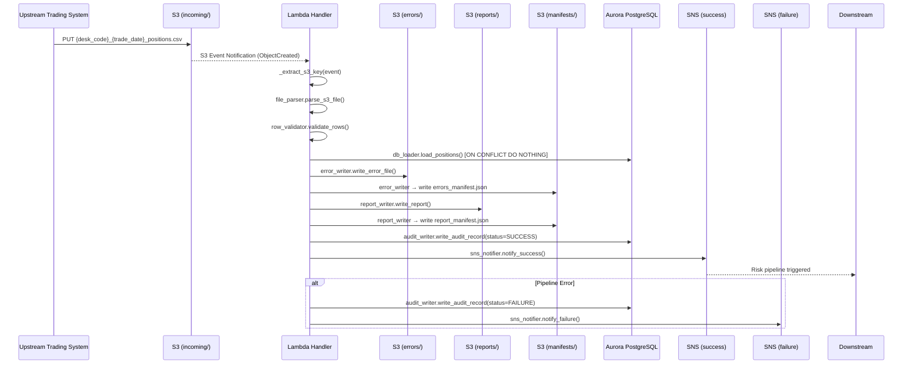
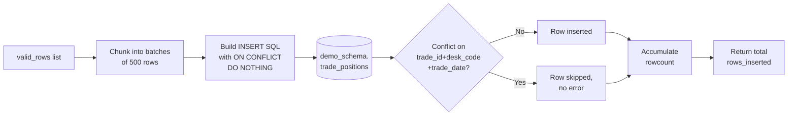
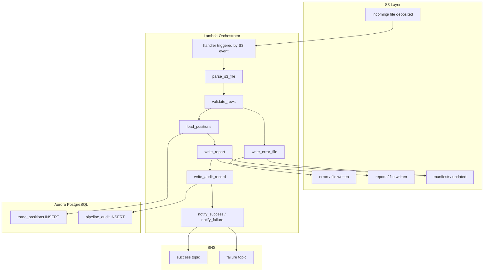

# Technical Design Document

## Daily Trade Position Ingestion Pipeline

**Project:** agentic-poc-sandbox
**Repo:** nartcr/agentic-poc-sandbox
**Team:** Sample Trade Operations
**Date:** June 2026
**Status:** Draft

---

## COMPONENTS

### `pipeline_handler.py` — Lambda Entry Point and Orchestrator

**What it does:**
Serves as the AWS Lambda handler. Receives an S3 event notification (or direct invocation payload), extracts the S3 key of the incoming file, and orchestrates the full pipeline in sequence: file parsing → validation → DB loading → report generation → audit write → SNS notification. Catches all unhandled exceptions and routes them to the failure SNS topic with structured error details.

**Signature:**
```
def handler(event: dict, context: object) -> dict
def _extract_s3_key(event: dict) -> str
def _run_pipeline(s3_key: str) -> dict
```

**What it reads:**
- S3 event: `event["Records"][0]["s3"]["bucket"]["name"]`, `event["Records"][0]["s3"]["object"]["key"]`
- Environment variables: `S3_BUCKET`, `DB_SECRET_ID`, `SNS_SUCCESS_ARN`, `SNS_FAILURE_ARN`, `DB_SCHEMA`

**What it writes:**
- Returns `{"statusCode": 200, "body": <summary_dict>}` on success
- Returns `{"statusCode": 500, "body": <error_dict>}` on failure
- Delegates all downstream writes to other modules

**Satisfies:** BAC-1, BAC-5, BAC-6

---

### `file_parser.py` — S3 File Reader and CSV Parser

**What it does:**
Downloads the CSV file from S3 using the key passed by the orchestrator. Reads the file using the `csv` module (not pandas, for memory efficiency on 100K rows). Returns a list of raw row dicts keyed by column header. Validates that the filename matches the expected pattern `{desk_code}_{trade_date}_positions.csv` and extracts `desk_code` and `trade_date` from the filename. Raises `ValueError` with a descriptive message if the filename does not match.

**Signature:**
```
def parse_s3_file(s3_client, bucket: str, key: str) -> tuple[list[dict], str, str]
    # Returns: (rows, desk_code, trade_date_str)
def _parse_filename(key: str) -> tuple[str, str]
    # Returns: (desk_code, trade_date_str) — raises ValueError if non-conformant
```

**What it reads:**
- S3 object at `s3://{S3_BUCKET}/{key}` (UTF-8 encoded CSV with header row)
- Expected CSV columns: `trade_id`, `desk_code`, `trade_date`, `instrument_type`, `notional_amount`, `currency`, `counterparty_id`

**What it writes:**
- Returns `list[dict]` where each dict has keys matching the CSV header row
- Returns `desk_code: str`, `trade_date_str: str` (YYYY-MM-DD) parsed from filename

**Satisfies:** BAC-1, BAC-2, BAC-6

---

### `row_validator.py` — Per-Row Data Quality Validator

**What it does:**
Accepts the list of raw row dicts from `file_parser.py`. Iterates every row and applies the following validation rules in order. Returns two lists: `valid_rows` (list of dicts ready for DB insert) and `rejected_rows` (list of dicts with an added `rejection_reason` field).

**Validation rules applied in sequence (first failing rule wins):**
1. **MISSING_FIELD**: Any of `trade_id`, `desk_code`, `trade_date`, `instrument_type`, `notional_amount`, `currency`, `counterparty_id` is absent or empty string after `.strip()`.
2. **INVALID_TRADE_DATE**: `trade_date` field cannot be parsed as `YYYY-MM-DD`.
3. **INVALID_NOTIONAL**: `notional_amount` cannot be parsed as a positive finite decimal (via `decimal.Decimal`; zero and negative values rejected).
4. **INVALID_CURRENCY**: `currency` is not exactly 3 alphabetic characters (matches `^[A-Za-z]{3}$`).
5. **DESK_CODE_MISMATCH**: `desk_code` in the row does not match the `desk_code` parsed from the filename.

**Signature:**
```
def validate_rows(rows: list[dict], filename_desk_code: str, filename_trade_date: str) -> tuple[list[dict], list[dict]]
    # Returns: (valid_rows, rejected_rows)
def _validate_row(row: dict, row_number: int, filename_desk_code: str, filename_trade_date: str) -> tuple[bool, str]
    # Returns: (is_valid, rejection_reason)
```

**What it reads:**
- `rows: list[dict]` — raw CSV rows
- `filename_desk_code: str` — from filename parse
- `filename_trade_date: str` — from filename parse (YYYY-MM-DD)

**What it writes:**
- `valid_rows: list[dict]` — each dict contains exactly: `trade_id`, `desk_code`, `trade_date` (as `datetime.date`), `instrument_type`, `notional_amount` (as `decimal.Decimal`), `currency`, `counterparty_id`
- `rejected_rows: list[dict]` — same fields as input row plus `row_number: int`, `rejection_reason: str`

**Satisfies:** BAC-2, BAC-4

---

### `db_loader.py` — Idempotent Database Loader

**What it does:**
Receives the list of validated row dicts. Opens a connection to Aurora PostgreSQL using credentials fetched from Secrets Manager by `secrets_client.py`. Executes batch `INSERT INTO demo_schema.trade_positions (...) VALUES ... ON CONFLICT (trade_id, desk_code, trade_date) DO NOTHING` in batches of 500 rows. Returns the count of rows actually inserted (via `cursor.rowcount` accumulated across batches). Does not raise on conflict — silently skips duplicates.

**Signature:**
```
def load_positions(valid_rows: list[dict], db_conn) -> int
    # Returns: rows_inserted count
def _build_insert_batch(batch: list[dict]) -> tuple[str, list[tuple]]
    # Returns: (sql_string, values_list)
```

**What it reads:**
- `valid_rows: list[dict]` — each with keys: `trade_id`, `desk_code`, `trade_date`, `instrument_type`, `notional_amount`, `currency`, `counterparty_id`
- `db_conn` — a live `psycopg2` connection object

**What it writes:**
- Inserts into `demo_schema.trade_positions`:
  - `trade_id`, `desk_code`, `trade_date`, `instrument_type`, `notional_amount`, `currency`, `counterparty_id`
  - `loaded_at` is populated by the DB default `now()`
- Returns `int` — count of net-new rows inserted (conflicts excluded)

**SQL pattern:**
```sql
INSERT INTO demo_schema.trade_positions
  (trade_id, desk_code, trade_date, instrument_type, notional_amount, currency, counterparty_id)
VALUES %s
ON CONFLICT (trade_id, desk_code, trade_date) DO NOTHING
```

**Satisfies:** BAC-1, BAC-3

---

### `error_writer.py` — Rejected Row Error File Writer

**What it does:**
Receives the list of rejected rows (with `rejection_reason` field). Writes them as a CSV file to S3 at the error prefix. The error file key is `errors/{desk_code}_{trade_date}_errors_{processing_timestamp_et_yyyymmddhhmmss}.csv`. Writes a companion manifest JSON at `manifests/{desk_code}_{trade_date}_errors_manifest.json` mapping logical name `"error_file"` to the actual S3 key. If `rejected_rows` is empty, writes a zero-row CSV (header only) and updates the manifest.

**Signature:**
```
def write_error_file(s3_client, bucket: str, rejected_rows: list[dict], desk_code: str, trade_date_str: str, processing_ts_et: datetime) -> str
    # Returns: S3 key of the written error file
```

**Error CSV columns (in order):**
`row_number`, `trade_id`, `desk_code`, `trade_date`, `instrument_type`, `notional_amount`, `currency`, `counterparty_id`, `rejection_reason`

**What it reads:**
- `rejected_rows: list[dict]` — from `row_validator.py`

**What it writes:**
- S3 key: `errors/{desk_code}_{trade_date}_errors_{YYYYMMDDHHmmSS}.csv`
- S3 manifest key: `manifests/{desk_code}_{trade_date}_errors_manifest.json`
  ```json
  {"error_file": "errors/{desk_code}_{trade_date}_errors_{YYYYMMDDHHmmSS}.csv"}
  ```

**Satisfies:** BAC-2

---

### `report_writer.py` — Post-Load Summary Report Generator

**What it does:**
Receives pipeline summary statistics and writes a JSON summary report to S3 at the report prefix. The report key is `reports/{desk_code}_{trade_date}_report_{processing_ts_yyyymmddhhmmss}.csv`. Also writes a manifest at `manifests/{desk_code}_{trade_date}_report_manifest.json`. Computes per-column null rates, min/max notional, and grouped counts from the valid and rejected row lists.

**Signature:**
```
def write_report(s3_client, bucket: str, valid_rows: list[dict], rejected_rows: list[dict], desk_code: str, trade_date_str: str, rows_inserted: int, processing_ts_et: datetime) -> tuple[str, dict]
    # Returns: (s3_key, report_dict)
def _compute_null_rates(all_rows: list[dict]) -> dict[str, float]
def _compute_notional_stats(valid_rows: list[dict]) -> tuple[Decimal, Decimal]
    # Returns: (min_notional, max_notional)
```

**Report JSON structure:**
```json
{
  "desk_code": "EQTY",
  "trade_date": "2026-06-01",
  "processing_timestamp_et": "2026-06-01T19:30:00-04:00",
  "total_rows_received": 1000,
  "rows_loaded": 950,
  "rows_rejected": 50,
  "rows_skipped_duplicate": 10,
  "grouped_by_desk_code": {"EQTY": 950},
  "min_notional_amount": "100.0000",
  "max_notional_amount": "9500000.0000",
  "null_rates": {
    "trade_id": 0.0,
    "desk_code": 0.0,
    "trade_date": 0.0,
    "instrument_type": 0.02,
    "notional_amount": 0.0,
    "currency": 0.0,
    "counterparty_id": 0.01
  },
  "error_file_key": "errors/EQTY_2026-06-01_errors_20260601193000.csv"
}
```

**What it writes:**
- S3 key: `reports/{desk_code}_{trade_date}_report_{YYYYMMDDHHmmSS}.json`
- S3 manifest key: `manifests/{desk_code}_{trade_date}_report_manifest.json`
  ```json
  {"report_file": "reports/{desk_code}_{trade_date}_report_{YYYYMMDDHHmmSS}.json"}
  ```

**Satisfies:** BAC-4, BAC-7

---

### `audit_writer.py` — Pipeline Audit Trail Writer

**What it does:**
Inserts one row into `demo_schema.pipeline_audit` after each file is processed (whether success or failure). Called by the orchestrator at the end of `_run_pipeline`, including in the except block. `processing_timestamp_et` is set to the current time in `America/Toronto`. All integer counts default to 0 if not available (e.g., on early failure).

**Signature:**
```
def write_audit_record(db_conn, filename: str, desk_code: str | None, trade_date: date | None, status: str, total_rows: int, rows_inserted: int, rows_rejected: int, error_message: str | None, processing_ts_et: datetime) -> None
```

**Status values:** `"SUCCESS"`, `"FAILURE"`, `"PARTIAL"`

**What it reads:**
- All parameters passed from the orchestrator

**What it writes:**
- INSERT into `demo_schema.pipeline_audit`:
  - `filename`, `desk_code`, `trade_date`, `status`, `total_rows`, `rows_inserted`, `rows_rejected`, `error_message`, `processing_timestamp_et`
  - `audit_id` is BIGSERIAL (auto-generated)
  - `created_at` defaults to `now()`

**Satisfies:** BAC-7 (audit trail, ET timestamps)

---

### `sns_notifier.py` — SNS Notification Publisher

**What it does:**
Publishes structured JSON messages to the appropriate SNS topic. `notify_success` publishes to `SNS_SUCCESS_ARN`; `notify_failure` publishes to `SNS_FAILURE_ARN`. Both functions serialize the message dict to JSON string and call `sns_client.publish(TopicArn=..., Message=..., Subject=...)`.

**Signature:**
```
def notify_success(sns_client, topic_arn: str, summary: dict) -> None
def notify_failure(sns_client, topic_arn: str, filename: str, error: str, desk_code: str | None, trade_date_str: str | None) -> None
```

**Success message schema:**
```json
{
  "event_type": "TRADE_POSITIONS_LOADED",
  "filename": "EQTY_2026-06-01_positions.csv",
  "desk_code": "EQTY",
  "trade_date": "2026-06-01",
  "rows_loaded": 950,
  "rows_rejected": 50,
  "report_s3_key": "reports/EQTY_2026-06-01_report_20260601193000.json",
  "processing_timestamp_et": "2026-06-01T19:30:00-04:00"
}
```

**Failure message schema:**
```json
{
  "event_type": "TRADE_POSITIONS_FAILED",
  "filename": "EQTY_2026-06-01_positions.csv",
  "desk_code": "EQTY",
  "trade_date": "2026-06-01",
  "error": "Filename does not match expected pattern",
  "processing_timestamp_et": "2026-06-01T19:30:00-04:00"
}
```

**Satisfies:** BAC-5

---

### `secrets_client.py` — Secrets Manager Credential Fetcher

**What it does:**
Fetches the database credentials JSON from AWS Secrets Manager using the secret ID specified in `os.environ["DB_SECRET_ID"]`. Parses and returns a dict with keys `host`, `port`, `dbname`, `username`, `password`. Caches the result in module-level state for the Lambda container lifetime to avoid redundant API calls on warm invocations. Raises `RuntimeError` if the secret cannot be fetched or is missing required keys.

**Signature:**
```
def get_db_credentials(sm_client) -> dict
    # Returns: {"host": str, "port": int, "dbname": str, "username": str, "password": str}
```

**What it reads:**
- `os.environ["DB_SECRET_ID"]` — Secrets Manager secret ID
- Secrets Manager JSON payload keys: `host`, `port`, `dbname`, `username`, `password`

**What it writes:**
- Module-level cache dict (in-memory only, never persisted)

**Satisfies:** BAC-8

---

### `db_connection.py` — Database Connection Factory

**What it does:**
Creates and returns a `psycopg2` connection to Aurora PostgreSQL using credentials from `secrets_client.get_db_credentials()`. Sets `autocommit=False`. The orchestrator calls this once per invocation, passes the connection to `db_loader.py` and `audit_writer.py`, and closes it in a `finally` block.

**Signature:**
```
def get_connection(sm_client) -> psycopg2.extensions.connection
```

**What it reads:**
- Credentials from `secrets_client.get_db_credentials(sm_client)`

**What it writes:**
- Returns a live `psycopg2` connection with `connect_timeout=10`

**Satisfies:** BAC-8

---

## AWS SERVICES

| Service | Role |
|---|---|
| **AWS Lambda** | Compute host for the pipeline. Function name: `agentic-poc-sandbox-qa`. Triggered by S3 event notification on `incoming/` prefix. |
| **Amazon S3** | Storage for incoming position files (`incoming/`), error files (`errors/`), summary reports (`reports/`), and manifests (`manifests/`). Bucket: `agentic-poc-533266968934` (via env var). |
| **Amazon Aurora PostgreSQL** | Reporting database. Hosts `demo_schema.trade_positions` and `demo_schema.pipeline_audit`. Accessed via `psycopg2`. |
| **AWS Secrets Manager** | Stores database credentials under secret ID `agentic-poc-aurora`. Retrieved at runtime by `secrets_client.py`. |
| **Amazon SNS** | Two topics: success (`agentic-poc-success`) and failure (`agentic-poc-failure`). Used to notify downstream risk pipeline. |

---

## DATA CONTRACTS

### Database Tables

#### `demo_schema.trade_positions`

| Column | Type | Nullable | Default | Notes |
|---|---|---|---|---|
| `trade_id` | `VARCHAR(100)` | NOT NULL | — | Part of PK |
| `desk_code` | `VARCHAR(50)` | NOT NULL | — | Part of PK |
| `trade_date` | `DATE` | NOT NULL | — | Part of PK |
| `instrument_type` | `VARCHAR(100)` | NOT NULL | — | |
| `notional_amount` | `NUMERIC(20,4)` | NOT NULL | — | |
| `currency` | `CHAR(3)` | NOT NULL | — | |
| `counterparty_id` | `VARCHAR(100)` | NOT NULL | — | |
| `loaded_at` | `TIMESTAMPTZ` | NOT NULL | `now()` | Set by DB |

**Primary Key:** `(trade_id, desk_code, trade_date)`
**Unique Constraint / Dedup Key:** `(trade_id, desk_code, trade_date)` — used in `ON CONFLICT` clause
**Indexes:** Primary key index on `(trade_id, desk_code, trade_date)`

---

#### `demo_schema.pipeline_audit`

| Column | Type | Nullable | Default | Notes |
|---|---|---|---|---|
| `audit_id` | `BIGSERIAL` | NOT NULL | auto-increment | PK |
| `filename` | `VARCHAR(255)` | NOT NULL | — | |
| `desk_code` | `VARCHAR(50)` | NULL | — | Null on early parse failure |
| `trade_date` | `DATE` | NULL | — | Null on early parse failure |
| `status` | `VARCHAR(20)` | NOT NULL | — | `SUCCESS`, `FAILURE`, `PARTIAL` |
| `total_rows` | `INTEGER` | NOT NULL | `0` | |
| `rows_inserted` | `INTEGER` | NOT NULL | `0` | |
| `rows_rejected` | `INTEGER` | NOT NULL | `0` | |
| `error_message` | `TEXT` | NULL | — | Populated on FAILURE |
| `processing_timestamp_et` | `TIMESTAMPTZ` | NOT NULL | — | Set in ET (America/Toronto) |
| `created_at` | `TIMESTAMPTZ` | NOT NULL | `now()` | Set by DB |

**Primary Key:** `(audit_id)`

---

### S3 Paths

```
s3://agentic-poc-533266968934/
├── incoming/
│   └── {desk_code}_{trade_date}_positions.csv          ← Input files (upstream deposits)
│       e.g. EQTY_2026-06-01_positions.csv
│
├── errors/
│   └── {desk_code}_{trade_date}_errors_{YYYYMMDDHHmmSS}.csv  ← Rejected rows
│       e.g. EQTY_2026-06-01_errors_20260601193000.csv
│
├── reports/
│   └── {desk_code}_{trade_date}_report_{YYYYMMDDHHmmSS}.json  ← Summary reports
│       e.g. EQTY_2026-06-01_report_20260601193000.json
│
└── manifests/
    ├── {desk_code}_{trade_date}_errors_manifest.json    ← Points to error file key
    └── {desk_code}_{trade_date}_report_manifest.json    ← Points to report file key
```

**Input CSV format:**
- Encoding: UTF-8
- Delimiter: comma (`,`)
- Header row required: `trade_id,desk_code,trade_date,instrument_type,notional_amount,currency,counterparty_id`
- `trade_date` format: `YYYY-MM-DD`
- `notional_amount`: numeric string, positive decimal

**Error CSV format:**
- Columns: `row_number,trade_id,desk_code,trade_date,instrument_type,notional_amount,currency,counterparty_id,rejection_reason`

**Report JSON format:** See `report_writer.py` component above.

**Manifest JSON format:**
```json
// errors manifest
{"error_file": "errors/{desk_code}_{trade_date}_errors_{YYYYMMDDHHmmSS}.csv"}

// report manifest
{"report_file": "reports/{desk_code}_{trade_date}_report_{YYYYMMDDHHmmSS}.json"}
```

---

### Secrets Manager

**Env var:** `DB_SECRET_ID` = `"agentic-poc-aurora"`

**Expected JSON keys inside the secret:**
```json
{
  "host": "<aurora-cluster-endpoint>",
  "port": 5432,
  "dbname": "app",
  "username": "<db-user>",
  "password": "<db-password>"
}
```

---

### SNS Topics

| Env Var | Value (via env) | Usage |
|---|---|---|
| `SNS_SUCCESS_ARN` | `arn:aws:sns:us-east-1:533266968934:agentic-poc-success` | Published on successful file completion |
| `SNS_FAILURE_ARN` | `arn:aws:sns:us-east-1:533266968934:agentic-poc-failure` | Published on pipeline error |

**Success message** — see `sns_notifier.py` above.
**Failure message** — see `sns_notifier.py` above.

---

### Environment Variables Reference

| Variable | Value | Consumer |
|---|---|---|
| `S3_BUCKET` | `agentic-poc-533266968934` | `file_parser.py`, `error_writer.py`, `report_writer.py` |
| `DB_SECRET_ID` | `agentic-poc-aurora` | `secrets_client.py` |
| `DB_SCHEMA` | `demo_schema` | `db_loader.py`, `audit_writer.py` |
| `SNS_SUCCESS_ARN` | `arn:aws:sns:us-east-1:533266968934:agentic-poc-success` | `sns_notifier.py` |
| `SNS_FAILURE_ARN` | `arn:aws:sns:us-east-1:533266968934:agentic-poc-failure` | `sns_notifier.py` |

---

## DATA FLOW

### End-to-End Pipeline Flow



---

### Validation Decision Logic

```mermaid
flowchart TD
    A[Raw CSV Row] --> B{trade_id present\nand non-empty?}
    B -- No --> R1[REJECT: MISSING_FIELD]
    B -- Yes --> C{desk_code present\nand non-empty?}
    C -- No --> R2[REJECT: MISSING_FIELD]
    C -- Yes --> D{trade_date present\nand parseable\nYYYY-MM-DD?}
    D -- No --> R3[REJECT: MISSING_FIELD or\nINVALID_TRADE_DATE]
    D -- Yes --> E{instrument_type,\ncurrency,\ncounterparty_id\npresent and non-empty?}
    E -- No --> R4[REJECT: MISSING_FIELD]
    E -- Yes --> F{notional_amount\nparseable as positive\ndecimal.Decimal?}
    F -- No --> R5[REJECT: INVALID_NOTIONAL]
    F -- Yes --> G{currency matches\n^[A-Za-z]{3}$?}
    G -- No --> R6[REJECT: INVALID_CURRENCY]
    G -- Yes --> H{desk_code matches\nfilename desk_code?}
    H -- No --> R7[REJECT: DESK_CODE_MISMATCH]
    H -- Yes --> V[VALID ROW]

    R1 & R2 & R3 & R4 & R5 & R6 & R7 --> RLIST[Add to rejected_rows\nwith rejection_reason]
    V --> VLIST[Add to valid_rows]
```

---

### Idempotent Load Logic



---

### Pipeline Orchestration Swimlanes



---

### Batch Insert Pseudocode

```
FUNCTION load_positions(valid_rows, db_conn):
    CONST BATCH_SIZE = 500
    total_inserted = 0
    batches = chunk(valid_rows, BATCH_SIZE)

    FOR batch IN batches:
        values = [(r.trade_id, r.desk_code, r.trade_date, r.instrument_type,
                   r.notional_amount, r.currency, r.counterparty_id) FOR r IN batch]
        sql = """
            INSERT INTO demo_schema.trade_positions
              (trade_id, desk_code, trade_date, instrument_type,
               notional_amount, currency, counterparty_id)
            VALUES %s
            ON CONFLICT (trade_id, desk_code, trade_date) DO NOTHING
        """
        execute_values(cursor, sql, values)
        total_inserted += cursor.rowcount

    db_conn.commit()
    RETURN total_inserted
```

---

## TECHNICAL ACCEPTANCE CRITERIA

**TAC-1 (from BAC-1): All valid positions available before next morning's risk run**
- `db_loader.load_positions()` executes and commits within the Lambda invocation.
- Acceptance test: After pipeline execution, `SELECT COUNT(*) FROM demo_schema.trade_positions WHERE trade_date = :trade_date AND desk_code = :desk_code` must equal `rows_inserted` returned by `load_positions()`.
- Lambda timeout must be set to ≥ 120 seconds; test verifies 10,000-row file completes in < 60 seconds wall time.

**TAC-2 (from BAC-2): Invalid records flagged with clear rejection reasons**
- `row_validator._validate_row()` returns one of exactly five rejection reason codes: `MISSING_FIELD`, `INVALID_TRADE_DATE`, `INVALID_NOTIONAL`, `INVALID_CURRENCY`, `DESK_CODE_MISMATCH`.
- `error_writer.write_error_file()` writes a CSV to `errors/{desk_code}_{trade_date}_errors_{ts}.csv` containing every rejected row with its `rejection_reason` populated.
- Acceptance test: For a file with 5 deliberately invalid rows (one per rule), the error CSV must contain exactly 5 rows, each with the correct `rejection_reason` matching the injected defect.

**TAC-3 (from BAC-3): Resubmitting file does not double-count positions**
- `db_loader.load_positions()` uses `INSERT INTO demo_schema.trade_positions (...) VALUES %s ON CONFLICT (trade_id, desk_code, trade_date) DO NOTHING`.
- Acceptance test: Run the pipeline twice with the identical input file. After the second run, `SELECT COUNT(*) FROM demo_schema.trade_positions WHERE trade_date = :date AND desk_code = :desk` must return the same count as after the first run. The second run's `rows_inserted` must be `0`.

**TAC-4 (from BAC-4): Summary report accurately reflects received/accepted/rejected counts**
- `report_writer.write_report()` computes: `total_rows_received = len(valid_rows) + len(rejected_rows)`, `rows_loaded = rows_inserted` (from DB), `rows_rejected = len(rejected_rows)`, `rows_skipped_duplicate = len(valid_rows) - rows_inserted`.
- Acceptance test: For a test file with known composition (e.g., 100 total, 90 valid, 10 invalid, 5 duplicates pre-loaded), verify the report JSON contains `total_rows_received=100`, `rows_loaded=85`, `rows_rejected=10`, `rows_skipped_duplicate=5`.
- `null_rates` for each column is computed as `null_count / total_rows_received` over all rows (valid + rejected).

**TAC-5 (from BAC-5): Risk pipeline automatically notified — no manual trigger**
- `sns_notifier.notify_success()` is called unconditionally at the end of `_run_pipeline()` on success path.
- `sns_notifier.notify_failure()` is called in the `except` block of `handler()`.
- Acceptance test: Mock SNS client; verify `publish()` is called exactly once per pipeline run with `TopicArn` matching `SNS_SUCCESS_ARN` (success case) or `SNS_FAILURE_ARN` (failure case). Message JSON must include `event_type`, `filename`, `rows_loaded`, `processing_timestamp_et`.

**TAC-6 (from BAC-6): Processing completes within operations window**
- Performance test: A 10,000-row file must complete end-to-end (parse + validate + load + report + audit + notify) in < 60 seconds.
- Implementation: `db_loader` uses `psycopg2.extras.execute_values()` with batch size 500 (not row-by-row inserts). `file_parser` uses `csv.DictReader` streaming (not reading entire file into a pandas DataFrame).
- Acceptance test: Timed integration test with synthetic 10,000-row file asserts `elapsed_seconds < 60`.

**TAC-7 (from BAC-7): All timestamps in Eastern Time for regulatory audit**
- `audit_writer.write_audit_record()`: `processing_timestamp_et` is set as `datetime.now(pytz.timezone("America/Toronto"))`.
- `report_writer.write_report()`: `processing_timestamp_et` field in report JSON is ISO 8601 with ET offset (e.g., `-04:00` or `-05:00`).
- `sns_notifier`: `processing_timestamp_et` in both success and failure messages is ET-aware ISO 8601 string.
- Acceptance test: Assert all timestamp strings in report JSON and audit DB record have timezone offset `-04:00` or `-05:00` (never `+00:00`). Assert `pytz.timezone("America/Toronto")` is used in all three modules.

**TAC-8 (from BAC-8): No credentials stored in code or config**
- `secrets_client.get_db_credentials()` retrieves all credentials exclusively from `boto3` Secrets Manager call using `os.environ["DB_SECRET_ID"]`.
- Acceptance test: Static scan of all `.py` files asserts no string matching password/host/credential patterns is hardcoded. Unit test for `secrets_client` mocks `boto3` and verifies DB connection parameters come entirely from the mock secret payload.

---

## OPEN QUESTIONS

None. All infrastructure configuration is resolved via the provided YAML. No genuine business logic ambiguities remain.

---

## ASSUMPTIONS

1. **Lambda trigger:** The Lambda function `agentic-poc-sandbox-qa` is configured with an S3 event notification trigger on the `agentic-poc-533266968934` bucket for `s3:ObjectCreated:*` events on the `incoming/` prefix. This configuration is assumed to already exist or will be configured as deployment-time infrastructure setup outside of this code change.

2. **One file per Lambda invocation:** Each S3 PUT event delivers a single `Records` entry corresponding to one position file. The handler processes exactly one file per invocation.

3. **Input file encoding:** Incoming CSV files are UTF-8 encoded with a comma delimiter and a header row. No BOM prefix.

4. **Trade date in filename is authoritative:** The `trade_date` in the filename (e.g., `EQTY_2026-06-01_positions.csv`) is the authoritative trade date. Row-level `trade_date` values are validated for parseability but are expected to match the filename trade date. The validator enforces this via `DESK_CODE_MISMATCH` logic for desk_code; **trade_date mismatch between filename and row is treated as valid** as long as the row-level value is parseable — the row's own `trade_date` is used for the DB insert. If the business requires enforcing filename trade_date on every row, this rule should be added.

3. **Partial success status:** If some rows are valid and some are rejected, `pipeline_audit.status` is set to `"SUCCESS"` (not `"PARTIAL"`) as long as at least one row was inserted and no system-level errors occurred. `"PARTIAL"` is reserved for future use or can be used when `rows_rejected > 0` — this should be confirmed by the business.

4. **Database schema pre-exists:** Tables `demo_schema.trade_positions` and `demo_schema.pipeline_audit` already exist in the Aurora database as defined in the infrastructure YAML. This pipeline does not run DDL.

5. **`psycopg2` available in Lambda:** The Lambda deployment package includes `psycopg2-binary` (or a Lambda layer provides it).

6. **Report format is JSON:** Despite the `_report_{ts}.csv` extension mentioned in the initial design pass, the report is stored as `.json` (consistent with the report structure). The S3 key uses `.json` extension.

7. **Null rate computation includes all rows:** Per-column null rates are computed over all rows received (valid + rejected combined) to give the operations team a complete picture of data quality in the source file.

8. **SNS message size:** Summary reports embedded in SNS messages will not exceed the 256 KB SNS message size limit. For files up to 100K rows with a single desk code, this is a safe assumption. If multiple desk codes could produce very large `grouped_by_desk_code` payloads, the message body may need to reference the S3 report key instead of embedding full stats.

9. **Aurora connectivity from Lambda:** The Lambda function runs inside the same VPC as the Aurora cluster (or has network access via VPC peering/endpoints). VPC configuration is assumed to be in place.

10. **`loaded_at` column:** The `loaded_at` timestamp on `demo_schema.trade_positions` is set by the database server default `now()` and is NOT passed by the application code — this ensures consistent server-side timestamps and avoids clock skew.