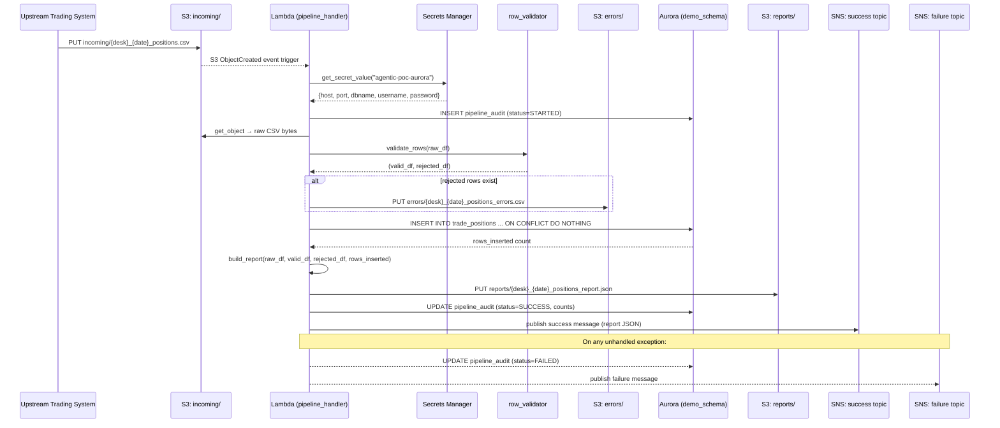
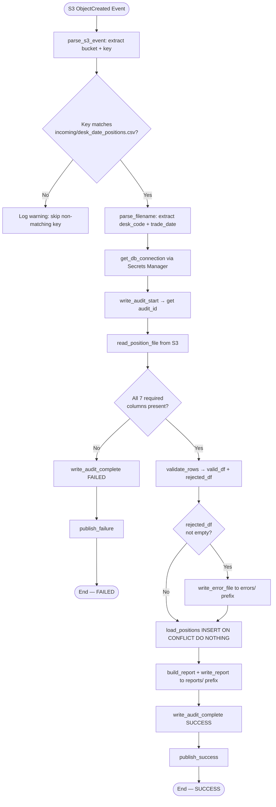
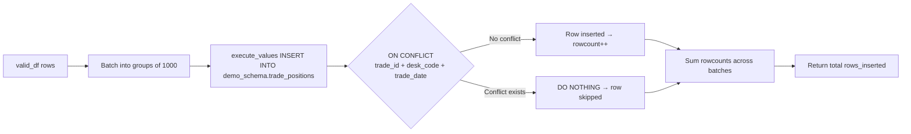

# Technical Design Document

## Daily Trade Position Ingestion Pipeline
**Project:** agentic-poc-sandbox | **Change Type:** New Feature | **Date:** June 2026

---

## COMPONENTS

### `pipeline_handler.py`
**Role:** Lambda entry point. Receives the S3 event trigger, extracts the bucket name and object key, validates the filename matches the expected convention `{desk_code}_{trade_date}_positions.csv`, and orchestrates the full pipeline by calling the file reader, validator, loader, reporter, and notifier in sequence. Writes a `pipeline_audit` record at start and end of each run.

- **Inputs:** S3 event JSON (`Records[*].s3.bucket.name`, `Records[*].s3.object.key`)
- **Exact function signatures:**
  - `def handler(event: dict, context: object) -> dict` — AWS Lambda entry point
  - `def parse_s3_event(event: dict) -> tuple[str, str]` — returns `(bucket, key)`
  - `def parse_filename(key: str) -> tuple[str, str]` — extracts `(desk_code, trade_date)` from filename using regex `^([A-Za-z0-9]+)_(\d{4}-\d{2}-\d{2})_positions\.csv$`; raises `ValueError` if pattern does not match
  - `def run_pipeline(bucket: str, key: str) -> dict` — top-level orchestrator; calls all sub-modules in order; returns summary dict; catches all unhandled exceptions and publishes failure notification before re-raising
- **Writes:** Returns HTTP-style dict `{"statusCode": 200, "body": "..."}` to Lambda runtime; writes audit record via `audit_logger.py`
- **Satisfies:** BAC-1, BAC-5, BAC-6, BAC-7, BAC-8

---

### `secret_loader.py`
**Role:** Retrieves database credentials from AWS Secrets Manager at runtime. Caches the result within a single Lambda invocation (module-level variable). Never stores credentials in code or config.

- **Exact function signatures:**
  - `def get_db_credentials(secret_id: str) -> dict` — calls `boto3.client("secretsmanager").get_secret_value(SecretId=secret_id)`; parses JSON; returns dict with keys `host`, `port`, `dbname`, `username`, `password`
  - `def get_db_connection() -> psycopg2.connection` — calls `get_db_credentials(os.environ["DB_SECRET_ID"])`; returns a `psycopg2` connection to `dbname=app`
- **Reads:** `os.environ["DB_SECRET_ID"]` → Secrets Manager secret `agentic-poc-aurora`
- **Writes:** Nothing persisted; returns in-memory connection object
- **Satisfies:** BAC-8

---

### `file_reader.py`
**Role:** Downloads and parses the CSV file from S3 into a pandas DataFrame. Enforces expected column presence. Does not perform field-level validation — that is the validator's responsibility.

- **Exact function signatures:**
  - `def read_position_file(bucket: str, key: str) -> pd.DataFrame` — uses `boto3.client("s3").get_object(Bucket=bucket, Key=key)`; reads CSV via `pd.read_csv()`; ensures all column headers are stripped of whitespace; returns raw DataFrame
  - Expected columns present after read: `trade_id`, `desk_code`, `trade_date`, `instrument_type`, `notional_amount`, `currency`, `counterparty_id` — if any are absent, raises `ValueError("Missing required columns: {missing}")`
- **Reads:** S3 object at `s3://{os.environ["S3_BUCKET"]}/{key}` where key matches `incoming/{desk_code}_{trade_date}_positions.csv`
- **Writes:** Returns `pd.DataFrame`; no side effects
- **Satisfies:** BAC-1, BAC-2

---

### `row_validator.py`
**Role:** Applies field-level validation rules to every row of the input DataFrame. Splits rows into valid and rejected sets. Returns both as separate DataFrames. Rejected rows include a `rejection_reason` column.

- **Exact function signatures:**
  - `def validate_rows(df: pd.DataFrame, expected_desk_code: str, expected_trade_date: str) -> tuple[pd.DataFrame, pd.DataFrame]` — returns `(valid_df, rejected_df)` where `rejected_df` has all original columns plus `rejection_reason: str`
  - `def _check_mandatory_fields(row: pd.Series) -> str | None` — returns rejection reason string or `None` if row passes; checks each mandatory field; accumulates all failures into a single pipe-separated string e.g. `"notional_amount: missing|currency: missing"`
  - `def _check_notional_amount(value) -> str | None` — returns rejection string if value is not numeric or is negative; returns `None` if valid
  - `def _check_trade_date_format(value: str) -> str | None` — returns rejection string if value does not match `YYYY-MM-DD`; returns `None` if valid
  - `def _check_desk_code_match(value: str, expected: str) -> str | None` — returns rejection string if row's `desk_code` does not match desk_code parsed from filename
- **Validation rules applied per row:**
  1. `trade_id`: not null, not empty string
  2. `desk_code`: not null, matches `expected_desk_code`
  3. `trade_date`: not null, matches `YYYY-MM-DD`, matches `expected_trade_date`
  4. `instrument_type`: not null, not empty string
  5. `notional_amount`: not null, castable to float, ≥ 0
  6. `currency`: not null, matches 3-character uppercase alpha `[A-Z]{3}`
  7. `counterparty_id`: not null, not empty string
- **Writes:** Returns two DataFrames; no side effects
- **Satisfies:** BAC-2

---

### `error_writer.py`
**Role:** Writes the rejected rows DataFrame to S3 as a CSV error file. The error file contains all original columns plus the `rejection_reason` column. File is written to the errors prefix.

- **Exact function signatures:**
  - `def write_error_file(rejected_df: pd.DataFrame, desk_code: str, trade_date: str, bucket: str) -> str` — serializes `rejected_df` to CSV in memory using `io.StringIO`; uploads to S3 using `boto3.client("s3").put_object()`; returns the full S3 key written
  - S3 key pattern: `errors/{desk_code}_{trade_date}_positions_errors.csv`
  - If `rejected_df` is empty, writes nothing and returns `None`
- **Reads:** `rejected_df: pd.DataFrame` (columns: all input columns + `rejection_reason`), `os.environ["S3_BUCKET"]`
- **Writes:** S3 object at `s3://{os.environ["S3_BUCKET"]}/errors/{desk_code}_{trade_date}_positions_errors.csv`; CSV format with header row, UTF-8 encoded
- **Satisfies:** BAC-2

---

### `position_loader.py`
**Role:** Loads validated rows into `demo_schema.trade_positions` using an idempotent INSERT. Uses `ON CONFLICT (trade_id, desk_code, trade_date) DO NOTHING` to skip duplicates without error. Returns the count of rows actually inserted (vs. skipped).

- **Exact function signatures:**
  - `def load_positions(valid_df: pd.DataFrame, conn: psycopg2.connection) -> int` — iterates rows in batches of 1,000; executes `INSERT INTO demo_schema.trade_positions (trade_id, desk_code, trade_date, instrument_type, notional_amount, currency, counterparty_id, loaded_at) VALUES %s ON CONFLICT (trade_id, desk_code, trade_date) DO NOTHING` using `psycopg2.extras.execute_values`; commits after all batches; returns total rows inserted by summing `cursor.rowcount` across all batches
  - `loaded_at` is set to `datetime.now(pytz.timezone("America/Toronto"))` at the time of the INSERT call
- **Reads:** `valid_df: pd.DataFrame`, `conn: psycopg2.connection`
- **Writes:** Rows to `demo_schema.trade_positions`; columns: `trade_id`, `desk_code`, `trade_date`, `instrument_type`, `notional_amount`, `currency`, `counterparty_id`, `loaded_at`
- **Satisfies:** BAC-1, BAC-3

---

### `report_builder.py`
**Role:** Constructs the processing summary report as a JSON document from the raw DataFrame, rejected DataFrame, and insert count. Computes all required statistics. Writes the report JSON to S3.

- **Exact function signatures:**
  - `def build_report(raw_df: pd.DataFrame, valid_df: pd.DataFrame, rejected_df: pd.DataFrame, rows_inserted: int, desk_code: str, trade_date: str) -> dict` — constructs and returns the full report dict (schema below)
  - `def write_report(report: dict, desk_code: str, trade_date: str, bucket: str) -> str` — serializes `report` to JSON; uploads to S3 using `boto3.client("s3").put_object()`; returns full S3 key written
  - S3 key pattern: `reports/{desk_code}_{trade_date}_positions_report.json`
  - `processing_timestamp` is set to `datetime.now(pytz.timezone("America/Toronto")).isoformat()`
- **Report JSON schema:**
  ```
  {
    "desk_code": str,
    "trade_date": str,
    "processing_timestamp": str (ISO8601, ET),
    "total_rows_received": int,
    "rows_loaded": int,
    "rows_rejected": int,
    "rows_skipped_duplicate": int,
    "record_counts_by_desk": { desk_code: int, ... },
    "min_notional_amount": float | null,
    "max_notional_amount": float | null,
    "null_rates": {
      "trade_id": float,
      "desk_code": float,
      "trade_date": float,
      "instrument_type": float,
      "notional_amount": float,
      "currency": float,
      "counterparty_id": float
    }
  }
  ```
  - `rows_skipped_duplicate` = `len(valid_df) - rows_inserted`
  - `null_rates` computed on `raw_df` (before validation split), as `column_null_count / len(raw_df)` per column; value is `0.0` if `len(raw_df) == 0`
  - `min_notional_amount` / `max_notional_amount` computed on `valid_df["notional_amount"]`; `null` if `valid_df` is empty
- **Reads:** DataFrames, `os.environ["S3_BUCKET"]`
- **Writes:** S3 object at `s3://{os.environ["S3_BUCKET"]}/reports/{desk_code}_{trade_date}_positions_report.json`
- **Satisfies:** BAC-4, BAC-7

---

### `sns_notifier.py`
**Role:** Publishes SNS notifications to the success or failure topic. Formats the message payload as JSON. Uses topic ARNs from environment variables only.

- **Exact function signatures:**
  - `def publish_success(report: dict) -> None` — publishes to `os.environ["SNS_SUCCESS_TOPIC_ARN"]`; message body is `report` dict serialized to JSON; `Subject` is `"TradePositionIngestion:SUCCESS:{desk_code}:{trade_date}"`
  - `def publish_failure(desk_code: str, trade_date: str, error_message: str, s3_key: str | None) -> None` — publishes to `os.environ["SNS_FAILURE_TOPIC_ARN"]`; message body is JSON dict (schema below); `Subject` is `"TradePositionIngestion:FAILURE:{desk_code}:{trade_date}"`
  - Failure message JSON schema:
    ```
    {
      "event_type": "TradePositionIngestion:FAILURE",
      "desk_code": str,
      "trade_date": str,
      "error_message": str,
      "s3_key": str | null,
      "timestamp": str (ISO8601, ET)
    }
    ```
- **Reads:** `os.environ["SNS_SUCCESS_TOPIC_ARN"]`, `os.environ["SNS_FAILURE_TOPIC_ARN"]`
- **Writes:** SNS messages
- **Satisfies:** BAC-5

---

### `audit_logger.py`
**Role:** Writes audit records to `demo_schema.pipeline_audit` at the start and end of each pipeline run. Provides a complete audit trail for regulatory examination.

- **Exact function signatures:**
  - `def write_audit_start(conn: psycopg2.connection, s3_key: str, desk_code: str, trade_date: str) -> int` — INSERTs a new audit row with `status='STARTED'`; returns `audit_id` (serial PK)
  - `def write_audit_complete(conn: psycopg2.connection, audit_id: int, rows_received: int, rows_loaded: int, rows_rejected: int, rows_skipped: int, status: str, error_message: str | None) -> None` — UPDATEs the audit row for `audit_id`; sets `status` to `'SUCCESS'` or `'FAILED'`; sets `completed_at`, row counts, and `error_message`
  - `status` values: `'STARTED'`, `'SUCCESS'`, `'FAILED'`
- **Writes:** Rows to `demo_schema.pipeline_audit`
- **Satisfies:** BAC-7, BAC-8 (audit trail for regulatory compliance)

---

## AWS SERVICES

| Service | Role |
|---|---|
| **AWS Lambda** | Compute platform. Function `agentic-poc-sandbox-qa` is triggered by S3 `ObjectCreated` events on the `incoming/` prefix. Runs the full pipeline per file. |
| **Amazon S3** | Stores input files (`incoming/` prefix), error files (`errors/` prefix), and JSON summary reports (`reports/` prefix). Bucket: `agentic-poc-533266968934` (referenced via `os.environ["S3_BUCKET"]`). |
| **Amazon Aurora (PostgreSQL-compatible)** | Reporting database. Hosts `demo_schema.trade_positions` and `demo_schema.pipeline_audit`. Secret retrieved from Secrets Manager. |
| **AWS Secrets Manager** | Stores database credentials under secret ID `agentic-poc-aurora` (referenced via `os.environ["DB_SECRET_ID"]`). No credentials in code. |
| **Amazon SNS** | Two topics: success (`agentic-poc-success`) and failure (`agentic-poc-failure`). Downstream risk pipeline subscribes to success topic. Referenced via `os.environ["SNS_SUCCESS_TOPIC_ARN"]` and `os.environ["SNS_FAILURE_TOPIC_ARN"]`. |

---

## DATA CONTRACTS

### Database Tables

#### `demo_schema.trade_positions`

```
Table: demo_schema.trade_positions

Column              | Type                         | Constraints
--------------------|------------------------------|------------------------------------------
trade_id            | VARCHAR(100)                 | NOT NULL
desk_code           | VARCHAR(50)                  | NOT NULL
trade_date          | DATE                         | NOT NULL
instrument_type     | VARCHAR(100)                 | NOT NULL
notional_amount     | NUMERIC(20, 4)               | NOT NULL
currency            | CHAR(3)                      | NOT NULL
counterparty_id     | VARCHAR(100)                 | NOT NULL
loaded_at           | TIMESTAMPTZ                  | NOT NULL

PRIMARY KEY: (trade_id, desk_code, trade_date)
UNIQUE CONSTRAINT: unique_trade_position ON (trade_id, desk_code, trade_date)
INDEX: idx_trade_positions_desk_date ON demo_schema.trade_positions (desk_code, trade_date)
```

#### `demo_schema.pipeline_audit`

```
Table: demo_schema.pipeline_audit

Column              | Type                         | Constraints
--------------------|------------------------------|------------------------------------------
audit_id            | SERIAL                       | PRIMARY KEY
s3_key              | VARCHAR(500)                 | NOT NULL
desk_code           | VARCHAR(50)                  | NOT NULL
trade_date          | DATE                         | NOT NULL
status              | VARCHAR(20)                  | NOT NULL  (values: 'STARTED','SUCCESS','FAILED')
rows_received       | INTEGER                      | NULL (populated on complete)
rows_loaded         | INTEGER                      | NULL (populated on complete)
rows_rejected       | INTEGER                      | NULL (populated on complete)
rows_skipped        | INTEGER                      | NULL (populated on complete)
error_message       | TEXT                         | NULL
started_at          | TIMESTAMPTZ                  | NOT NULL DEFAULT NOW()
completed_at        | TIMESTAMPTZ                  | NULL (populated on complete)

INDEX: idx_pipeline_audit_desk_date ON demo_schema.pipeline_audit (desk_code, trade_date)
```

### S3 Paths

```
Bucket env var: os.environ["S3_BUCKET"]  →  agentic-poc-533266968934

Input files (trigger):
  Key pattern:  incoming/{desk_code}_{trade_date}_positions.csv
  Example:      incoming/EQDESK_2026-06-15_positions.csv
  Format:       CSV with header row; delimiter: comma; encoding: UTF-8
  Columns:      trade_id, desk_code, trade_date, instrument_type,
                notional_amount, currency, counterparty_id

Error files (written on any rejected rows):
  Key pattern:  errors/{desk_code}_{trade_date}_positions_errors.csv
  Example:      errors/EQDESK_2026-06-15_positions_errors.csv
  Format:       CSV with header row; UTF-8
  Columns:      trade_id, desk_code, trade_date, instrument_type,
                notional_amount, currency, counterparty_id, rejection_reason

Report files (written after every run):
  Key pattern:  reports/{desk_code}_{trade_date}_positions_report.json
  Example:      reports/EQDESK_2026-06-15_positions_report.json
  Format:       JSON (single object, schema defined in report_builder.py section above)
```

### Secrets Manager

```
Env var:    DB_SECRET_ID = os.environ["DB_SECRET_ID"]
Secret ID:  agentic-poc-aurora

Expected JSON keys inside the secret:
  {
    "host":     str,   -- Aurora cluster endpoint hostname
    "port":     int,   -- PostgreSQL port (typically 5432)
    "dbname":   str,   -- "app"
    "username": str,   -- database username
    "password": str    -- database password
  }
```

### SNS Topics

```
Success topic:
  Env var:  SNS_SUCCESS_TOPIC_ARN = os.environ["SNS_SUCCESS_TOPIC_ARN"]
  ARN:      arn:aws:sns:us-east-1:533266968934:agentic-poc-success
  Subject:  "TradePositionIngestion:SUCCESS:{desk_code}:{trade_date}"
  Message (JSON):
    {
      "desk_code":               str,
      "trade_date":              str,
      "processing_timestamp":    str (ISO8601, ET),
      "total_rows_received":     int,
      "rows_loaded":             int,
      "rows_rejected":           int,
      "rows_skipped_duplicate":  int,
      "record_counts_by_desk":   { str: int },
      "min_notional_amount":     float | null,
      "max_notional_amount":     float | null,
      "null_rates":              { str: float }
    }

Failure topic:
  Env var:  SNS_FAILURE_TOPIC_ARN = os.environ["SNS_FAILURE_TOPIC_ARN"]
  ARN:      arn:aws:sns:us-east-1:533266968934:agentic-poc-failure
  Subject:  "TradePositionIngestion:FAILURE:{desk_code}:{trade_date}"
  Message (JSON):
    {
      "event_type":    "TradePositionIngestion:FAILURE",
      "desk_code":     str,
      "error_message": str,
      "s3_key":        str | null,
      "timestamp":     str (ISO8601, ET)
    }
```

### Environment Variables Summary

```
DB_SECRET_ID           = "agentic-poc-aurora"
S3_BUCKET              = "agentic-poc-533266968934"
SNS_SUCCESS_TOPIC_ARN  = "arn:aws:sns:us-east-1:533266968934:agentic-poc-success"
SNS_FAILURE_TOPIC_ARN  = "arn:aws:sns:us-east-1:533266968934:agentic-poc-failure"
```

---

## DATA FLOW

### End-to-End Pipeline Flow



---

### Pipeline Orchestration Logic (Flowchart)



---

### Validation Logic (Per-Row Algorithm)

```
ALGORITHM: validate_rows(df, expected_desk_code, expected_trade_date)

valid_rows    ← []
rejected_rows ← []

FOR each row IN df:
    reasons ← []

    IF row.trade_id IS NULL OR row.trade_id == "":
        reasons.append("trade_id: missing")

    IF row.desk_code IS NULL:
        reasons.append("desk_code: missing")
    ELSE IF row.desk_code != expected_desk_code:
        reasons.append(f"desk_code: value '{row.desk_code}' does not match filename desk '{expected_desk_code}'")

    IF row.trade_date IS NULL:
        reasons.append("trade_date: missing")
    ELSE IF row.trade_date does NOT match YYYY-MM-DD:
        reasons.append("trade_date: invalid format, expected YYYY-MM-DD")
    ELSE IF row.trade_date != expected_trade_date:
        reasons.append(f"trade_date: value '{row.trade_date}' does not match filename date '{expected_trade_date}'")

    IF row.instrument_type IS NULL OR row.instrument_type == "":
        reasons.append("instrument_type: missing")

    IF row.notional_amount IS NULL:
        reasons.append("notional_amount: missing")
    ELSE IF NOT castable to float:
        reasons.append("notional_amount: not numeric")
    ELSE IF float(row.notional_amount) < 0:
        reasons.append("notional_amount: negative value not allowed")

    IF row.currency IS NULL:
        reasons.append("currency: missing")
    ELSE IF NOT matches [A-Z]{3}:
        reasons.append("currency: must be 3 uppercase alpha characters")

    IF row.counterparty_id IS NULL OR row.counterparty_id == "":
        reasons.append("counterparty_id: missing")

    IF len(reasons) == 0:
        valid_rows.append(row)
    ELSE:
        row["rejection_reason"] = "|".join(reasons)
        rejected_rows.append(row)

RETURN DataFrame(valid_rows), DataFrame(rejected_rows)
```

---

### Deduplication Logic (INSERT Strategy)



---

## TECHNICAL ACCEPTANCE CRITERIA

### TAC-1 — Valid positions available before morning risk run
**BAC-1 translated:** `load_positions()` must successfully execute `INSERT INTO demo_schema.trade_positions ... ON CONFLICT (trade_id, desk_code, trade_date) DO NOTHING` for all rows in `valid_df`. Acceptance test: after pipeline completes for a file with N valid rows, a `SELECT COUNT(*) FROM demo_schema.trade_positions WHERE desk_code='{desk_code}' AND trade_date='{trade_date}'` returns exactly N (assuming no prior data for that key combination). The `write_audit_complete()` call with `status='SUCCESS'` must have been recorded in `demo_schema.pipeline_audit` for that `s3_key`.

---

### TAC-2 — Invalid records rejected with clear reasons
**BAC-2 translated:** `validate_rows()` must return a `rejected_df` containing every row that fails any validation rule. Each rejected row must have a non-empty `rejection_reason` string that names the specific field(s) and the specific failure (e.g. `"notional_amount: not numeric|currency: missing"`). `write_error_file()` must upload a CSV to `s3://{S3_BUCKET}/errors/{desk_code}_{trade_date}_positions_errors.csv` containing all 7 original columns plus `rejection_reason`. Acceptance test: inject a file with 3 intentionally malformed rows; assert the error CSV exists in S3 with exactly 3 rows and each `rejection_reason` is non-empty and correctly describes the defect.

---

### TAC-3 — Reprocessing same file does not double-count
**BAC-3 translated:** The `INSERT INTO demo_schema.trade_positions` statement must include `ON CONFLICT (trade_id, desk_code, trade_date) DO NOTHING`. The unique constraint `unique_trade_position` on `(trade_id, desk_code, trade_date)` must exist in the database schema. Acceptance test: run the full pipeline twice against the identical S3 file; assert `SELECT COUNT(*) FROM demo_schema.trade_positions WHERE desk_code='{desk_code}' AND trade_date='{trade_date}'` returns the same value after both runs. Assert `rows_skipped_duplicate` in the second run's report equals the number of rows that were loaded in the first run.

---

### TAC-4 — Processing summary accurately reflects received/accepted/rejected counts
**BAC-4 translated:** `build_report()` must set:
- `total_rows_received` = `len(raw_df)` (total rows read from CSV before any filtering)
- `rows_loaded` = value returned by `load_positions()` (`cursor.rowcount` sum)
- `rows_rejected` = `len(rejected_df)`
- `rows_skipped_duplicate` = `len(valid_df) - rows_inserted`
- These four values must satisfy: `total_rows_received == rows_loaded + rows_rejected + rows_skipped_duplicate` (accounting for all rows)

Acceptance test: process a file with 10 rows (7 valid, 3 invalid); assert report JSON fields match exactly; assert report JSON is present in S3 at `reports/{desk_code}_{trade_date}_positions_report.json`.

---

### TAC-5 — Risk pipeline automatically notified; no manual trigger
**BAC-5 translated:** `publish_success(report)` must call `boto3.client("sns").publish()` targeting `os.environ["SNS_SUCCESS_TOPIC_ARN"]` with the full report dict serialized as JSON in the `Message` field. This call must happen within `run_pipeline()` after `write_report()` succeeds. On exception, `publish_failure()` must call `boto3.client("sns").publish()` targeting `os.environ["SNS_FAILURE_TOPIC_ARN"]`. Acceptance test: mock SNS client; run pipeline end-to-end; assert `publish()` was called exactly once on the success topic with a message body parseable as JSON containing `"rows_loaded"` key.

---

### TAC-6 — Processing completes within operations window
**BAC-6 translated:** For a file of 10,000 rows, the total wall-clock time from `run_pipeline()` entry to `publish_success()` return must be ≤ 60 seconds. `load_positions()` must use `psycopg2.extras.execute_values` with batch size of 1,000 rows (not row-by-row inserts). Acceptance test: generate a synthetic 10,000-row file; run pipeline in integration environment; assert elapsed time < 60 seconds. System must not raise OOM or timeout error on a 100,000-row file.

---

### TAC-7 — All timestamps in Eastern Time for regulatory audit
**BAC-7 translated:** Every timestamp produced by the system must use `datetime.now(pytz.timezone("America/Toronto"))`:
- `loaded_at` column in `demo_schema.trade_positions`
- `started_at` and `completed_at` columns in `demo_schema.pipeline_audit`
- `processing_timestamp` in the report JSON (ISO8601 string with timezone offset)
- `timestamp` in the failure SNS message

Acceptance test: assert that `processing_timestamp` in the report JSON ends with `-04:00` or `-05:00` (ET offset depending on DST); assert `loaded_at` values in `trade_positions` are timezone-aware and in America/Toronto zone.

---

### TAC-8 — No secrets in code or configuration files
**BAC-8 translated:** `secret_loader.get_db_credentials()` must be the sole source of database credentials; it must call `boto3.client("secretsmanager").get_secret_value(SecretId=os.environ["DB_SECRET_ID"])`. No string literals resembling passwords, connection strings, or tokens may appear anywhere in the source files. SNS topic ARNs and S3 bucket names must be read from environment variables, not hardcoded. Acceptance test: static scan of all `.py` files must find zero occurrences of patterns matching `password\s*=\s*["'][^"']+["']`, `host\s*=\s*["'][^"']+["']` (hardcoded), or any 40+ character alphanumeric string resembling a secret.

---

## OPEN QUESTIONS

**None.**

All business logic is fully specified in the BRD. Infrastructure identifiers are provided in the Infrastructure Config YAML. All ambiguous design points (batch size, null rate denominator, duplicate skip behavior, timestamp zone) have been resolved with explicit assumptions documented below.

---

## ASSUMPTIONS

| # | Assumption | Impact if wrong |
|---|---|---|
| A1 | The Lambda function `agentic-poc-sandbox-qa` is configured with an S3 trigger for `ObjectCreated` events on prefix `incoming/` in bucket `agentic-poc-533266968934`. No polling mechanism is built — the pipeline is purely event-driven. | If no S3 trigger is configured, the Lambda will never fire; trigger must be added by infrastructure team. |
| A2 | The Aurora cluster is accessible from the Lambda function's network context (i.e., both are in the same VPC or Lambda has a VPC config with the appropriate security group rules). | If Lambda cannot reach Aurora, all DB calls will time out. Network config is outside this code's scope. |
| A3 | The Secrets Manager secret `agentic-poc-aurora` contains the JSON keys `host`, `port`, `dbname`, `username`, `password` exactly as specified. | If key names differ, `secret_loader.py` will raise `KeyError`; secret must match the contract. |
| A4 | The tables `demo_schema.trade_positions` and `demo_schema.pipeline_audit` do not yet exist and must be created by a DDL migration script (not included in this pipeline's Lambda code). The Coding Agent should produce a standalone `db_migrations.sql` file. | If tables don't exist at runtime, all INSERT calls will fail. |
| A5 | Input CSV files use comma as the delimiter and UTF-8 encoding. The header row is always the first row. | If a file uses a different delimiter or encoding, `file_reader.py` will raise a parse error. |
| A6 | `notional_amount` values of exactly `0.0` are valid and must be accepted. Only negative values are rejected. | If business rules prohibit zero notional, the validator must be updated. |
| A7 | When a file is re-deposited (resubmit scenario), it replaces (or co-exists with) the previous S3 object under the same key. The pipeline does not need to detect or clean up the prior S3 object — idempotency is handled entirely at the database layer via `ON CONFLICT DO NOTHING`. | No change needed if re-deposit uses same key. If a new key is used, both will trigger independent pipeline runs. |
| A8 | The `record_counts_by_desk` field in the report is computed from `raw_df["desk_code"].value_counts().to_dict()` — it counts all received rows (including rejected) grouped by the `desk_code` column value in each row. | If business wants count of only loaded rows by desk, `report_builder.py` must be adjusted. |
| A9 | `null_rates` in the report are computed on `raw_df` (all received rows, before validation split), not just valid rows. This gives the operations team visibility into data quality at source. | If business wants null rates on valid rows only, `report_builder.py` must be adjusted. |
| A10 | The pipeline processes one S3 file per Lambda invocation. Concurrent invocations for different desk files on the same trade date are handled safely by the database-level unique constraint. | Concurrent invocations for the exact same file are safe (ON CONFLICT DO NOTHING) but will each write an audit record — this is acceptable. |
| A11 | `psycopg2` (or `psycopg2-binary`) and `pandas` and `pytz` are available in the Lambda deployment package (as Lambda layer or bundled dependencies). | If missing, Lambda will raise `ImportError` on cold start. |
| A12 | The `trade_date` field in the CSV is a string in `YYYY-MM-DD` format and must match the date component of the filename. Rows with a `trade_date` that does not match the filename date are rejected. | If mixed trade dates in a single file are intentional (e.g., amendments), this validation rule must be relaxed. |