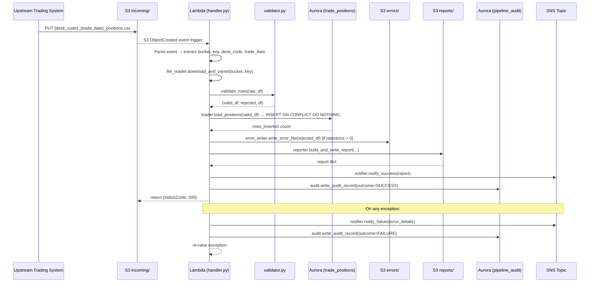
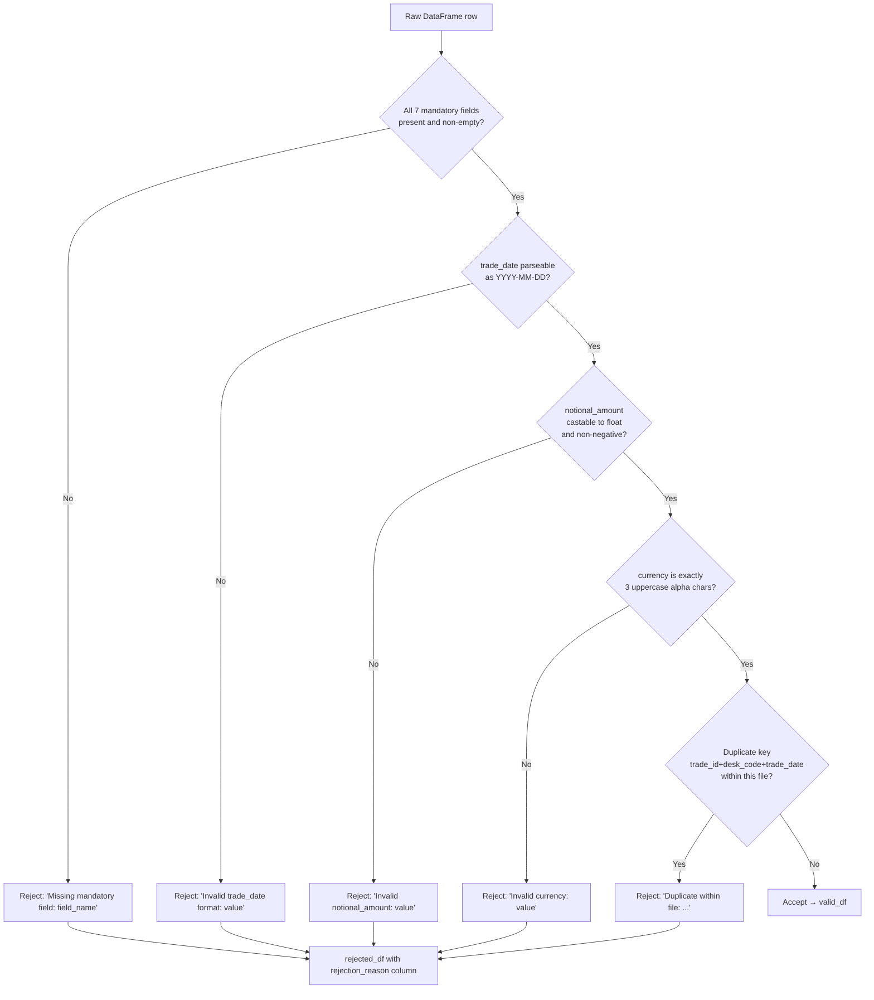
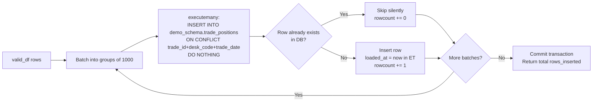
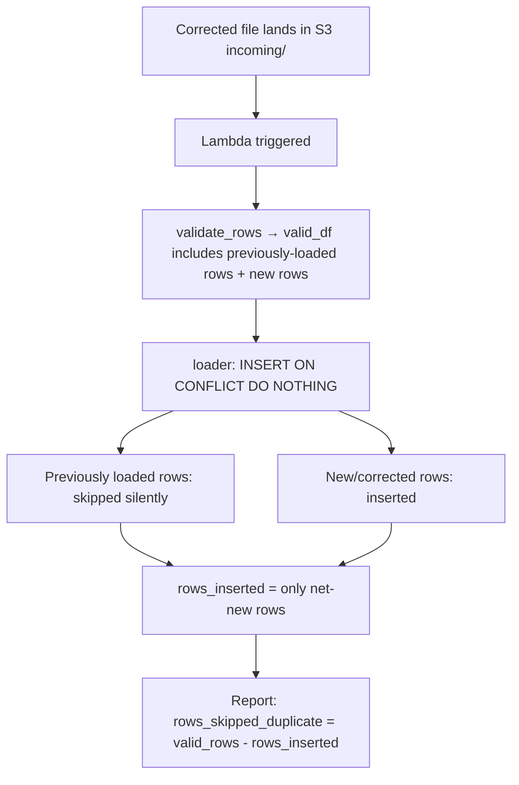

# Technical Design Document

## Daily Trade Position Ingestion Pipeline
**Project:** agentic-poc-sandbox
**Repo:** nartcr/agentic-poc-sandbox
**Change Type:** New Feature
**Date:** June 2026
**Status:** Draft

---

## COMPONENTS

### `config.py`
**Purpose:** Centralizes all environment variable reads and runtime configuration. Every other module imports from this file — no module reads `os.environ` directly except this one.

**What it reads:**
- `os.environ["DB_SECRET_ID"]` — Secrets Manager secret ID for Aurora credentials
- `os.environ["S3_BUCKET"]` — S3 bucket name
- `os.environ["S3_INPUT_PREFIX"]` — prefix for incoming files (e.g. `incoming/`)
- `os.environ["S3_ERROR_PREFIX"]` — prefix for error files (e.g. `errors/`)
- `os.environ["S3_REPORT_PREFIX"]` — prefix for report files (e.g. `reports/`)
- `os.environ["SNS_TOPIC_ARN"]` — ARN of SNS topic for downstream notifications
- `os.environ["AWS_REGION"]` — AWS region

**What it writes:** Exports a single `Config` dataclass instance with all the above fields as typed attributes.

**Satisfies:** BAC-7 (ET timestamps enforced globally), BAC-8 (no secrets in code).

---

### `secrets.py`
**Purpose:** Retrieves Aurora database credentials from AWS Secrets Manager at runtime. Returns a typed `DBCredentials` dataclass. Never caches credentials to disk.

**Signature:**
```
get_db_credentials(secret_id: str) -> DBCredentials
```
`DBCredentials` fields: `host: str`, `port: int`, `username: str`, `password: str`, `dbname: str`

**What it reads:** Secrets Manager secret at `secret_id`. Expected JSON keys in secret: `host`, `port`, `username`, `password`, `dbname`.

**What it writes:** Returns `DBCredentials` in memory only. No disk writes.

**Satisfies:** BAC-8 (credentials retrieved at runtime from Secrets Manager, never stored in code or config).

---

### `file_reader.py`
**Purpose:** Downloads a CSV file from S3 and parses it into a raw pandas DataFrame. Handles encoding, delimiter detection (comma-delimited), and returns the raw frame with all columns as strings for downstream validation.

**Signatures:**
```
download_and_parse(bucket: str, key: str) -> pd.DataFrame
```
- Downloads the object at `s3://bucket/key`.
- Reads as CSV with `dtype=str` (all columns as strings, no type coercion at read time).
- Returns raw DataFrame with original column headers stripped of whitespace.
- Raises `FileReadError` (custom exception) if the object does not exist or is not parseable as CSV.

**What it reads:** S3 object — CSV file with columns: `trade_id`, `desk_code`, `trade_date`, `instrument_type`, `notional_amount`, `currency`, `counterparty_id` (plus any extra columns, which are ignored).

**What it writes:** Returns `pd.DataFrame` in memory.

**Satisfies:** BAC-1 (data is read from the designated input location), BAC-6 (fast I/O path).

---

### `validator.py`
**Purpose:** Validates each row of the raw DataFrame against business rules. Splits the input into a validated DataFrame and a rejected DataFrame with per-row rejection reasons.

**Signature:**
```
validate_rows(raw_df: pd.DataFrame) -> tuple[pd.DataFrame, pd.DataFrame]
```
Returns `(valid_df, rejected_df)`.

**Validation rules applied in order per row:**
1. **Mandatory field presence:** Fields `trade_id`, `desk_code`, `trade_date`, `instrument_type`, `notional_amount`, `currency`, `counterparty_id` must be non-null and non-empty string. Rejection reason: `"Missing mandatory field: {field_name}"`.
2. **`trade_date` format:** Must parse as `YYYY-MM-DD`. Rejection reason: `"Invalid trade_date format: {value}"`.
3. **`notional_amount` numeric:** Must be castable to `float` and non-negative. Rejection reason: `"Invalid notional_amount: {value}"`.
4. **`currency` format:** Must be exactly 3 uppercase alphabetic characters (ISO 4217 pattern). Rejection reason: `"Invalid currency: {value}"`.
5. **`trade_id` uniqueness within file:** If the same `(trade_id, desk_code, trade_date)` triple appears more than once in the file, only the first occurrence is kept; subsequent duplicates are rejected. Rejection reason: `"Duplicate within file: trade_id={trade_id}, desk_code={desk_code}, trade_date={trade_date}"`.

**`valid_df` columns:** `trade_id (str)`, `desk_code (str)`, `trade_date (str, YYYY-MM-DD)`, `instrument_type (str)`, `notional_amount (float)`, `currency (str)`, `counterparty_id (str)`.

**`rejected_df` columns:** all original raw columns + `rejection_reason (str)`.

**What it reads:** Raw `pd.DataFrame` from `file_reader.py`.

**What it writes:** Two DataFrames returned in memory.

**Satisfies:** BAC-2 (rejected rows have explicit, human-readable reasons).

---

### `loader.py`
**Purpose:** Loads the validated DataFrame into `demo_schema.trade_positions` using an idempotent upsert. Connects to Aurora PostgreSQL using credentials from `secrets.py`. Returns the count of newly inserted rows (rows that did not already exist).

**Signature:**
```
load_positions(valid_df: pd.DataFrame, credentials: DBCredentials) -> int
```

**Behavior:**
- Opens a `psycopg2` connection using `DBCredentials`.
- For each row in `valid_df`, executes:
  ```sql
  INSERT INTO demo_schema.trade_positions
    (trade_id, desk_code, trade_date, instrument_type, notional_amount, currency, counterparty_id, loaded_at)
  VALUES (%s, %s, %s, %s, %s, %s, %s, %s)
  ON CONFLICT (trade_id, desk_code, trade_date) DO NOTHING
  ```
  where `loaded_at` is `datetime.now(pytz.timezone("America/Toronto"))`.
- Uses `executemany` with a batch size of 1,000 rows to satisfy performance requirements.
- Returns total count of rows inserted (uses `cursor.rowcount` summed across batches).
- Commits once after all batches succeed. Rolls back and raises `LoadError` on any exception.

**What it reads:** `valid_df` DataFrame; `DBCredentials` from `secrets.py`.

**What it writes:** Rows into `demo_schema.trade_positions`.

**Satisfies:** BAC-1 (valid rows loaded), BAC-3 (ON CONFLICT DO NOTHING prevents duplicates), BAC-6 (batch loading for performance).

---

### `error_writer.py`
**Purpose:** Writes the rejected rows DataFrame as a CSV error file to S3 under the `errors/` prefix. The error file is named `{desk_code}_{trade_date}_positions_errors.csv` and placed at `s3://{bucket}/errors/{desk_code}_{trade_date}_positions_errors.csv`.

**Signature:**
```
write_error_file(rejected_df: pd.DataFrame, bucket: str, desk_code: str, trade_date: str) -> str
```
Returns the full S3 key of the written error file (e.g. `errors/DESKX_2026-06-01_positions_errors.csv`).

If `rejected_df` is empty, no file is written and the function returns an empty string.

**Output CSV columns (in order):** `trade_id`, `desk_code`, `trade_date`, `instrument_type`, `notional_amount`, `currency`, `counterparty_id`, `rejection_reason`.

**What it reads:** `rejected_df` DataFrame.

**What it writes:** CSV to `s3://{bucket}/errors/{desk_code}_{trade_date}_positions_errors.csv`.

**Satisfies:** BAC-2 (operations team can retrieve error file, review reasons, correct and resubmit).

---

### `reporter.py`
**Purpose:** Computes the post-load summary report and writes it as a JSON file to S3 under the `reports/` prefix. Also returns the summary dict for use in SNS notification.

**Signature:**
```
build_and_write_report(
    raw_df: pd.DataFrame,
    valid_df: pd.DataFrame,
    rejected_df: pd.DataFrame,
    rows_inserted: int,
    bucket: str,
    desk_code: str,
    trade_date: str,
    source_key: str
) -> dict
```

**Report contents (JSON):**
```json
{
  "desk_code": "string",
  "trade_date": "YYYY-MM-DD",
  "source_file": "string (S3 key of input file)",
  "processing_timestamp_et": "YYYY-MM-DDTHH:MM:SS-05:00",
  "total_rows_received": "integer",
  "rows_validated": "integer",
  "rows_inserted": "integer",
  "rows_skipped_duplicate": "integer (valid rows - inserted rows)",
  "rows_rejected": "integer",
  "row_counts_by_desk_code": {"desk_code": count, ...},
  "notional_amount_min": "float or null",
  "notional_amount_max": "float or null",
  "null_rates_per_column": {
    "trade_id": 0.0,
    "desk_code": 0.0,
    "trade_date": 0.0,
    "instrument_type": 0.0,
    "notional_amount": 0.0,
    "currency": 0.0,
    "counterparty_id": 0.0
  }
}
```

- `processing_timestamp_et` is `datetime.now(pytz.timezone("America/Toronto")).isoformat()`.
- `null_rates_per_column` is computed on the **raw** DataFrame (before validation) to reflect true data quality.
- `row_counts_by_desk_code` is computed from `valid_df`.
- S3 key: `reports/{desk_code}_{trade_date}_positions_report.json`.

**What it reads:** Three DataFrames, `rows_inserted` count, metadata strings.

**What it writes:** JSON to `s3://{bucket}/reports/{desk_code}_{trade_date}_positions_report.json`.

**Returns:** The report dict (for SNS payload construction).

**Satisfies:** BAC-4 (accurate summary of received/accepted/rejected), BAC-7 (ET timestamps).

---

### `notifier.py`
**Purpose:** Publishes SNS messages on processing success or failure. Uses `boto3` SNS client.

**Signatures:**
```
notify_success(topic_arn: str, report: dict) -> None
notify_failure(topic_arn: str, error_details: dict) -> None
```

**Success message JSON structure:**
```json
{
  "event_type": "TRADE_POSITION_LOAD_SUCCESS",
  "desk_code": "string",
  "trade_date": "YYYY-MM-DD",
  "source_file": "string",
  "rows_inserted": "integer",
  "rows_rejected": "integer",
  "report_s3_key": "string",
  "processing_timestamp_et": "string"
}
```

**Failure message JSON structure:**
```json
{
  "event_type": "TRADE_POSITION_LOAD_FAILURE",
  "source_file": "string",
  "error_type": "string (exception class name)",
  "error_message": "string",
  "processing_timestamp_et": "string (ET ISO format)"
}
```

**What it reads:** Report dict or error details dict; `topic_arn` from config.

**What it writes:** SNS message to `os.environ["SNS_TOPIC_ARN"]`.

**Satisfies:** BAC-5 (automatic downstream notification, no manual trigger).

---

### `audit.py`
**Purpose:** Writes one audit record per file-processing attempt to `demo_schema.pipeline_audit`. Called at the end of every processing run (success or failure). Provides the regulatory audit trail.

**Signature:**
```
write_audit_record(
    credentials: DBCredentials,
    source_file: str,
    desk_code: str,
    trade_date: str,
    outcome: str,           # "SUCCESS" or "FAILURE"
    total_rows: int,
    rows_inserted: int,
    rows_rejected: int,
    error_message: str | None,
    processing_timestamp_et: datetime
) -> None
```

**SQL:**
```sql
INSERT INTO demo_schema.pipeline_audit
  (source_file, desk_code, trade_date, outcome, total_rows, rows_inserted,
   rows_rejected, error_message, processing_timestamp_et, service_identity)
VALUES (%s, %s, %s, %s, %s, %s, %s, %s, %s, %s)
```
`service_identity` is read from `os.environ["SERVICE_IDENTITY"]` (e.g. Lambda function name or ECS task ARN). This value is never hardcoded.

**What it reads:** All parameters above.

**What it writes:** One row to `demo_schema.pipeline_audit`.

**Satisfies:** BAC-7 (ET timestamp on every record), BAC-8 (credentials from Secrets Manager via `DBCredentials`), regulatory audit trail requirement (NFR 3.3).

---

### `handler.py` (Lambda entry point)
**Purpose:** AWS Lambda handler. Receives an S3 event trigger when a new file lands in `s3://{bucket}/incoming/`. Orchestrates the full pipeline: read → validate → load → write errors → write report → notify → audit.

**Signature:**
```
lambda_handler(event: dict, context: object) -> dict
```

**Orchestration flow:**
1. Parse S3 event to extract `bucket` and `key` from `event["Records"][0]["s3"]`.
2. Validate that key matches pattern `incoming/{desk_code}_{trade_date}_positions.csv` — extract `desk_code` and `trade_date`. Raise `ValueError` if pattern doesn't match.
3. Load config and retrieve DB credentials.
4. Call `file_reader.download_and_parse(bucket, key)` → `raw_df`.
5. Call `validator.validate_rows(raw_df)` → `(valid_df, rejected_df)`.
6. Call `loader.load_positions(valid_df, credentials)` → `rows_inserted`.
7. Call `error_writer.write_error_file(rejected_df, ...)` if `len(rejected_df) > 0`.
8. Call `reporter.build_and_write_report(...)` → `report`.
9. Call `notifier.notify_success(topic_arn, report)`.
10. Call `audit.write_audit_record(...)` with outcome `"SUCCESS"`.
11. Return `{"statusCode": 200, "body": json.dumps(report)}`.

On any unhandled exception:
- Call `notifier.notify_failure(topic_arn, error_details)`.
- Call `audit.write_audit_record(...)` with outcome `"FAILURE"` and the exception message.
- Re-raise the exception (so Lambda marks the invocation as failed and retries per configuration).

**What it reads:** S3 event dict; all downstream modules.

**What it writes:** Orchestrates all writes via the modules above.

**Satisfies:** BAC-1 through BAC-8 (integration point for all criteria).

---

### `exceptions.py`
**Purpose:** Defines custom exception classes used across all modules: `FileReadError`, `LoadError`, `ValidationError`, `AuditWriteError`. Each inherits from `Exception`. No logic — declarations only.

---

### `requirements.txt`
Lists: `boto3`, `psycopg2-binary`, `pandas`, `pytz`.

---

## AWS SERVICES

| Service | Role |
|---|---|
| **AWS Lambda** | Compute platform. Function `agentic-poc-sandbox-qa` is triggered by S3 object creation events on the `incoming/` prefix. Executes the full pipeline per file. |
| **Amazon S3** | Storage for input files (`incoming/`), error files (`errors/`), and reports (`reports/`). Bucket: `agentic-poc-data-533266968934` (referenced via `os.environ["S3_BUCKET"]`). S3 event notifications trigger Lambda. |
| **Amazon Aurora PostgreSQL** | Reporting database. Schema `demo_schema`, tables `trade_positions` and `pipeline_audit`. Credentials managed via Secrets Manager. |
| **AWS Secrets Manager** | Stores Aurora database credentials. Secret ID `agentic-poc-aurora` (referenced via `os.environ["DB_SECRET_ID"]`). |
| **Amazon SNS** | Publishes success and failure notifications to downstream consumers (risk calculation pipeline). ARN referenced via `os.environ["SNS_TOPIC_ARN"]`. |

---

## DATA CONTRACTS

### Database Tables

#### `demo_schema.trade_positions`

| Column | Data Type | Constraints |
|---|---|---|
| `id` | `BIGSERIAL` | PRIMARY KEY |
| `trade_id` | `VARCHAR(100)` | NOT NULL |
| `desk_code` | `VARCHAR(50)` | NOT NULL |
| `trade_date` | `DATE` | NOT NULL |
| `instrument_type` | `VARCHAR(100)` | NOT NULL |
| `notional_amount` | `NUMERIC(20, 4)` | NOT NULL |
| `currency` | `CHAR(3)` | NOT NULL |
| `counterparty_id` | `VARCHAR(100)` | NOT NULL |
| `loaded_at` | `TIMESTAMPTZ` | NOT NULL |

**Unique constraint:** `UNIQUE (trade_id, desk_code, trade_date)` — this is the deduplication key used in `ON CONFLICT DO NOTHING`.

**Index:** Index on `(desk_code, trade_date)` for reporting queries.

---

#### `demo_schema.pipeline_audit`

| Column | Data Type | Constraints |
|---|---|---|
| `id` | `BIGSERIAL` | PRIMARY KEY |
| `source_file` | `VARCHAR(500)` | NOT NULL |
| `desk_code` | `VARCHAR(50)` | NOT NULL |
| `trade_date` | `DATE` | NOT NULL |
| `outcome` | `VARCHAR(20)` | NOT NULL — values: `'SUCCESS'` or `'FAILURE'` |
| `total_rows` | `INTEGER` | NOT NULL |
| `rows_inserted` | `INTEGER` | NOT NULL |
| `rows_rejected` | `INTEGER` | NOT NULL |
| `error_message` | `TEXT` | NULLABLE |
| `processing_timestamp_et` | `TIMESTAMPTZ` | NOT NULL |
| `service_identity` | `VARCHAR(500)` | NOT NULL |

**Index:** Index on `(source_file)` for audit lookup by file.

---

### S3 Paths

| Purpose | Key Pattern | Format |
|---|---|---|
| Input files | `incoming/{desk_code}_{trade_date}_positions.csv` | CSV, comma-delimited, header row, UTF-8 |
| Error files | `errors/{desk_code}_{trade_date}_positions_errors.csv` | CSV, comma-delimited, header row, UTF-8 |
| Report files | `reports/{desk_code}_{trade_date}_positions_report.json` | JSON, UTF-8 |

**Input CSV expected columns (header row must match exactly):**
`trade_id, desk_code, trade_date, instrument_type, notional_amount, currency, counterparty_id`

**Error CSV columns:**
`trade_id, desk_code, trade_date, instrument_type, notional_amount, currency, counterparty_id, rejection_reason`

**`trade_date` in filenames and CSV:** `YYYY-MM-DD` format (e.g. `2026-06-01`).

---

### Secrets Manager

**Environment variable:** `os.environ["DB_SECRET_ID"]` = `"agentic-poc-aurora"`

**Expected JSON keys in the secret:**
```json
{
  "host": "string (Aurora cluster endpoint)",
  "port": 5432,
  "username": "string",
  "password": "string",
  "dbname": "app"
}
```

---

### SNS

**Environment variable:** `os.environ["SNS_TOPIC_ARN"]`

**Success message (published to SNS as `Message` field, JSON string):**
```json
{
  "event_type": "TRADE_POSITION_LOAD_SUCCESS",
  "desk_code": "string",
  "trade_date": "YYYY-MM-DD",
  "source_file": "string (full S3 key)",
  "rows_inserted": 0,
  "rows_rejected": 0,
  "report_s3_key": "reports/{desk_code}_{trade_date}_positions_report.json",
  "processing_timestamp_et": "YYYY-MM-DDTHH:MM:SS±HH:MM"
}
```

**Failure message:**
```json
{
  "event_type": "TRADE_POSITION_LOAD_FAILURE",
  "source_file": "string (full S3 key, or 'unknown' if parsing failed)",
  "error_type": "string (Python exception class name)",
  "error_message": "string",
  "processing_timestamp_et": "YYYY-MM-DDTHH:MM:SS±HH:MM"
}
```

**SNS `Subject` field:** `"TRADE_POSITION_LOAD_SUCCESS"` or `"TRADE_POSITION_LOAD_FAILURE"` respectively (allows SNS filter policies to route messages).

---

## DATA FLOW

### End-to-End Pipeline Flow



---

### Validation Decision Logic



---

### Idempotent Load Logic



---

### File Resubmission (BAC-3) Flow



---

## TECHNICAL ACCEPTANCE CRITERIA

### TAC-1: Valid positions available before morning risk run
**Mechanism:** `loader.load_positions()` uses `executemany` with batch size 1,000 and a single commit after all batches. All valid rows from the file are committed to `demo_schema.trade_positions` within the same Lambda invocation that processes the file. The Lambda is triggered synchronously by S3 ObjectCreated event during the 6–10 PM ET window.
**Acceptance test:** After pipeline runs on a test file with N valid rows, `SELECT COUNT(*) FROM demo_schema.trade_positions WHERE desk_code=X AND trade_date=Y` equals N (net new rows in a clean environment).

---

### TAC-2: Invalid records flagged with clear reasons
**Mechanism:** `validator.validate_rows()` populates a `rejection_reason` column in `rejected_df` with one of five specific messages (see validator rules). `error_writer.write_error_file()` writes `rejected_df` as CSV to `s3://{bucket}/errors/{desk_code}_{trade_date}_positions_errors.csv` with columns `trade_id, desk_code, trade_date, instrument_type, notional_amount, currency, counterparty_id, rejection_reason`.
**Acceptance test:** Submit a file with one row missing `counterparty_id` and one row with `notional_amount="abc"`. Error CSV must contain exactly 2 rows. First row `rejection_reason` must equal `"Missing mandatory field: counterparty_id"`. Second row must equal `"Invalid notional_amount: abc"`.

---

### TAC-3: Resubmitting a file does not double-count positions
**Mechanism:** `loader.load_positions()` executes `INSERT INTO demo_schema.trade_positions (...) ON CONFLICT (trade_id, desk_code, trade_date) DO NOTHING`. The unique constraint on `(trade_id, desk_code, trade_date)` is enforced at the database level.
**Acceptance test:** Load file A (10 rows). Verify `COUNT(*)=10`. Load identical file A again. Verify `COUNT(*)=10` (unchanged). `rows_inserted` on second run must be `0`. The unique constraint DDL must be present on `demo_schema.trade_positions`.

---

### TAC-4: Summary report accurately reflects received/accepted/rejected
**Mechanism:** `reporter.build_and_write_report()` computes: `total_rows_received = len(raw_df)`, `rows_validated = len(valid_df)`, `rows_inserted` from `loader.load_positions()` return value, `rows_skipped_duplicate = len(valid_df) - rows_inserted`, `rows_rejected = len(rejected_df)`, `notional_amount_min/max` from `valid_df["notional_amount"].min()/max()`, `null_rates_per_column` computed on `raw_df`. Invariant: `total_rows_received == rows_validated + rows_rejected`.
**Acceptance test:** Submit file with 100 rows: 80 valid (of which 5 are duplicates already in DB), 20 rejected. Report JSON must have `total_rows_received=100`, `rows_validated=80`, `rows_inserted=75`, `rows_skipped_duplicate=5`, `rows_rejected=20`. Verify `rows_validated + rows_rejected == total_rows_received`.

---

### TAC-5: Risk pipeline automatically notified — no manual trigger
**Mechanism:** `notifier.notify_success()` calls `boto3` SNS `publish()` within `handler.py` before the Lambda returns. `notifier.notify_failure()` is called in the exception handler before re-raise. SNS message includes `event_type`, `desk_code`, `trade_date`, `rows_inserted`, `rows_rejected`, `report_s3_key`, `processing_timestamp_et`. SNS `Subject` is set to `"TRADE_POSITION_LOAD_SUCCESS"` or `"TRADE_POSITION_LOAD_FAILURE"` to support filter policies.
**Acceptance test:** Run pipeline with a valid file. Confirm SNS `publish()` called exactly once with `event_type="TRADE_POSITION_LOAD_SUCCESS"` and correct `desk_code`/`trade_date`. Run pipeline with a file that causes a `LoadError`. Confirm SNS `publish()` called with `event_type="TRADE_POSITION_LOAD_FAILURE"`.

---

### TAC-6: Processing completes within 60 seconds for 10,000 rows
**Mechanism:** `loader.load_positions()` uses `executemany` with batch size 1,000 (10 batches for 10,000 rows). A single DB connection is opened and reused across all batches. File download uses streaming S3 `get_object()`. No row-by-row Python loops for DB insertion.
**Acceptance test:** Generate a synthetic file with exactly 10,000 valid rows. Measure wall-clock time from Lambda start to `audit.write_audit_record()` call. Assert elapsed time < 60 seconds. Separately, generate 100,000 rows and assert no unhandled exception (no OOM or timeout at Lambda's configured limit).

---

### TAC-7: All timestamps in Eastern Time (America/Toronto)
**Mechanism:** Every timestamp in the system uses `datetime.now(pytz.timezone("America/Toronto"))`. Specifically: `loaded_at` in `demo_schema.trade_positions`, `processing_timestamp_et` in `demo_schema.pipeline_audit`, `processing_timestamp_et` in the report JSON, and `processing_timestamp_et` in SNS messages. No UTC timestamps appear in any output.
**Acceptance test:** Insert a test row and read back `loaded_at` from `demo_schema.trade_positions`. Assert timezone offset is `-05:00` or `-04:00` (ET, accounting for DST). Assert `processing_timestamp_et` field in the report JSON is ISO 8601 format with ET offset. Assert no field in any output contains `+00:00` or `Z` suffix.

---

### TAC-8: No secrets in code or config files — annual security audit pass
**Mechanism:** `secrets.py` calls `boto3` Secrets Manager `get_secret_value(SecretId=os.environ["DB_SECRET_ID"])` at runtime. No connection string, password, username, or token appears as a literal in any `.py` file or `requirements.txt`. `config.py` reads all infrastructure identifiers from `os.environ`. The `DB_SECRET_ID` env var is set to `"agentic-poc-aurora"` in Lambda configuration — not in code.
**Acceptance test:** Static scan of all `.py` files in the repo using `grep` for patterns: `password=`, `host=<literal>`, `token=`, `secret=<literal>`. Assert zero matches. Assert `secrets.py` is the only file that calls `boto3.client("secretsmanager")`. Assert `config.py` is the only file that reads `os.environ`.

---

## OPEN QUESTIONS

**OQ-1: File arrival for multiple desks on the same trading day**
If upstream trading systems deposit multiple files for different desk codes on the same day, the pipeline will process each file independently (one Lambda invocation per file). This is assumed to be correct behavior. However: if two files for the *same* desk code and same trade date are deposited (e.g., a replacement file before the original is processed), should the second file's valid rows overwrite the first file's rows, or be skipped? The current design uses `ON CONFLICT DO NOTHING`, meaning the second file's rows are silently skipped for any records already loaded. **If the business requirement is "latest file wins" (UPDATE semantics), the deduplication behavior must change to `ON CONFLICT ... DO UPDATE SET ...`.** This must be confirmed before coding begins.

**OQ-2: Handling of files that fail the filename pattern check**
If a file lands in `incoming/` that does not match `{desk_code}_{trade_date}_positions.csv` (e.g. a non-position file deposited by mistake), the current design raises a `ValueError`, triggers the failure notification, and writes a failure audit record. The `desk_code` and `trade_date` for the audit record would be set to `"UNKNOWN"`. Confirm this is acceptable, or specify whether such files should be silently ignored.

---

## ASSUMPTIONS

| # | Assumption | Impact if Wrong |
|---|---|---|
| A-1 | The Lambda function `agentic-poc-sandbox-qa` is the compute target for this pipeline. The S3 bucket `agentic-poc-data-533266968934` already has an S3 event notification configured to trigger this Lambda on `s3:ObjectCreated:*` events with prefix filter `incoming/`. | Lambda will not be triggered automatically; handler.py entry point is correct but the trigger mechanism would need to be set up. |
| A-2 | `SNS_TOPIC_ARN` is provisioned and accessible to the Lambda execution role. An SNS topic exists for downstream notifications. | `notifier.py` calls will fail; BAC-5 cannot be satisfied. |
| A-3 | The Aurora cluster is accessible from the Lambda execution environment (VPC configuration, security groups) without additional networking setup required by this code change. | DB connections will time out; all DB writes will fail. |
| A-4 | The Lambda execution role has IAM permissions for: `s3:GetObject` and `s3:PutObject` on `agentic-poc-data-533266968934`, `secretsmanager:GetSecretValue` on `agentic-poc-aurora`, `sns:Publish` on the SNS topic, and `rds-db:connect` (or equivalent). | Individual service calls will return authorization errors. |
| A-5 | The tables `demo_schema.trade_positions` and `demo_schema.pipeline_audit` do not yet exist in the Aurora `app` database. DDL migration scripts (CREATE TABLE statements) will be provided as part of this delivery for the ops team to execute before the Lambda is deployed. | If tables already exist with a different schema, the DDL migration will need to be adapted. |
| A-6 | Input CSV files use comma as delimiter, UTF-8 encoding, and include a header row matching exactly: `trade_id,desk_code,trade_date,instrument_type,notional_amount,currency,counterparty_id`. | `file_reader.py` will produce incorrect column mapping; validation will fail for all rows. |
| A-7 | `trade_date` in filenames uses format `YYYY-MM-DD` with hyphens (e.g. `DESKX_2026-06-01_positions.csv`). Regex for parsing: `^incoming/([A-Z0-9]+)_(\d{4}-\d{2}-\d{2})_positions\.csv$`. | Filename parsing in `handler.py` will not extract `desk_code` and `trade_date` correctly. |
| A-8 | Lambda memory is configured at ≥ 512 MB and timeout is ≥ 120 seconds to accommodate pandas operations on up to 100,000 rows. | Performance TAC-6 may not be met for large files. |
| A-9 | `SERVICE_IDENTITY` environment variable is set in the Lambda configuration to the Lambda function name or ARN. This is used as `service_identity` in the audit table. | Audit records will fail to insert (missing env var) or contain empty identity. |
| A-10 | The `ON CONFLICT DO NOTHING` behavior (not `DO UPDATE`) is correct for reprocessing — i.e., once a position is loaded, it is considered immutable. If a corrected file is submitted for the same `(trade_id, desk_code, trade_date)`, the already-loaded row is NOT updated, only net-new rows are inserted. This is consistent with BAC-3 ("does not double-count") but means corrections to individual trade fields require a separate out-of-band process. | See OQ-1 above — if update semantics are required, the INSERT clause and unique constraint behavior must change. |
| A-11 | `null_rates_per_column` in the report is computed on the **raw DataFrame** (pre-validation), treating empty strings as non-null. This reflects the quality of the source file as received. | If the business wants null rates only on validated rows, `reporter.py` logic must change. |
| A-12 | The `desk_code` used in filenames is uppercase alphanumeric (e.g. `DESKX`, `FX01`). The regex `[A-Z0-9]+` is sufficient to capture it. | Filename parsing will fail for desk codes containing lowercase or special characters. |