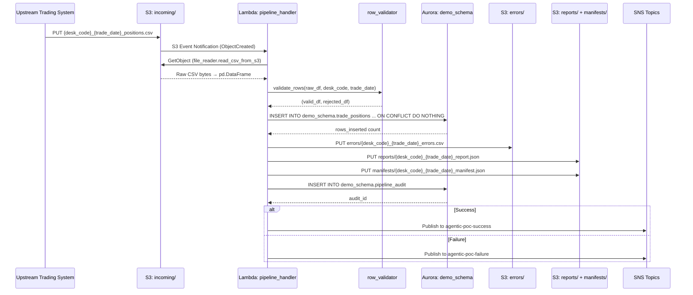
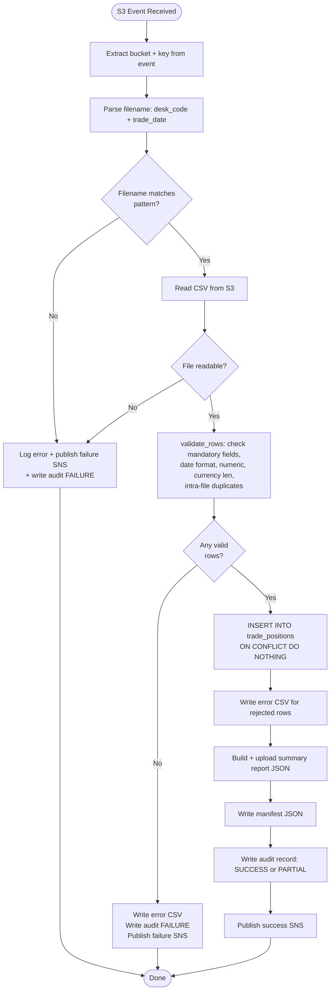
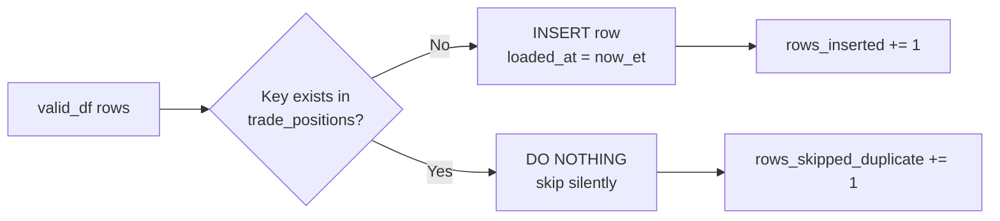

# Technical Design Document

## Daily Trade Position Ingestion Pipeline

**Project:** agentic-poc-sandbox
**Repo:** nartcr/agentic-poc-sandbox
**Team:** Sample Trade Operations
**Date:** June 2026
**Status:** Draft

---

## COMPONENTS

### `pipeline_handler.py` — Lambda Entry Point & Orchestrator

**What it does:**
Serves as the AWS Lambda handler. Receives an S3 event notification (triggered when a new file lands under `incoming/`), extracts the S3 key and bucket from the event, and orchestrates the full pipeline: file reading → validation → DB loading → report generation → audit logging → SNS notification. Catches all unhandled exceptions and routes them to the failure SNS topic.

**Function signatures:**
```
def handler(event: dict, context: object) -> dict
def _extract_s3_key(event: dict) -> tuple[str, str]  # returns (bucket, key)
def _parse_filename(key: str) -> tuple[str, str]      # returns (desk_code, trade_date_str)
```

**What it reads:**
- S3 event payload: `event["Records"][0]["s3"]["bucket"]["name"]`, `event["Records"][0]["s3"]["object"]["key"]`
- Filename pattern: `{desk_code}_{trade_date}_positions.csv` extracted from the S3 key

**What it writes:**
- Returns `{"statusCode": 200, "body": "OK"}` on success
- Returns `{"statusCode": 500, "body": "<error message>"}` on failure

**Satisfies:** BAC-1, BAC-5, BAC-6, BAC-7, BAC-8

---

### `file_reader.py` — S3 File Ingestion Module

**What it does:**
Reads a CSV file from S3 into a pandas DataFrame. Uses `boto3` S3 client (credentials from Lambda execution role — no hardcoded secrets). Reads the object bytes, decodes as UTF-8, and parses with `pandas.read_csv`. Returns the raw DataFrame with all columns as strings (dtype=str) to allow downstream validation to detect malformed values.

**Function signatures:**
```
def read_csv_from_s3(bucket: str, key: str) -> pd.DataFrame
```

**What it reads:**
- S3 object at `s3://{bucket}/{key}`
- Expected CSV columns (not enforced here): `trade_id`, `desk_code`, `trade_date`, `instrument_type`, `notional_amount`, `currency`, `counterparty_id`

**What it writes:**
- Returns `pd.DataFrame` with all columns as `str` dtype; may include extra columns (ignored by downstream)

**Satisfies:** BAC-1, BAC-6

---

### `row_validator.py` — Data Quality Validation Module

**What it does:**
Accepts the raw DataFrame from `file_reader.py` and validates each row against mandatory field rules. Returns two DataFrames: `valid_df` (rows passing all checks) and `rejected_df` (rows failing at least one check, with an appended `rejection_reason` column).

**Validation rules applied per row (in order):**
1. **Missing/null check:** All of `trade_id`, `desk_code`, `trade_date`, `instrument_type`, `notional_amount`, `currency`, `counterparty_id` must be non-null and non-empty string.
2. **trade_date format:** Must parse as `YYYY-MM-DD` using `datetime.strptime`. Reject if unparseable.
3. **notional_amount numeric:** Must be castable to `Decimal`. Reject if not numeric.
4. **currency length:** Must be exactly 3 characters (matching `CHAR(3)` column).
5. **trade_id uniqueness per (desk_code, trade_date):** Duplicate `(trade_id, desk_code, trade_date)` within the same file are flagged with reason `"duplicate_within_file"`.

For rows failing multiple checks, `rejection_reason` contains the first failing check's label (pipe-delimited if multiple, e.g. `"missing_field:trade_id|invalid_date"`).

**Function signatures:**
```
def validate_rows(df: pd.DataFrame, desk_code: str, trade_date_str: str) -> tuple[pd.DataFrame, pd.DataFrame]
# Returns (valid_df, rejected_df)
# rejected_df has all original columns plus: rejection_reason: str
```

**What it reads:**
- Raw `pd.DataFrame` from `file_reader.py`
- `desk_code: str` — from filename (used for cross-validation against `desk_code` column)
- `trade_date_str: str` — from filename (used for cross-validation against `trade_date` column)

**What it writes:**
- `valid_df`: DataFrame with columns `trade_id`, `desk_code`, `trade_date`, `instrument_type`, `notional_amount`, `currency`, `counterparty_id` (types coerced: `trade_date` as `date`, `notional_amount` as `Decimal`)
- `rejected_df`: All original columns + `rejection_reason: str`

**Satisfies:** BAC-2, BAC-4

---

### `db_loader.py` — Database Insert Module

**What it does:**
Receives `valid_df` (validated DataFrame), connects to Aurora PostgreSQL using credentials from Secrets Manager (via `secret_client.py`), and inserts rows into `demo_schema.trade_positions` using `INSERT ... ON CONFLICT (trade_id, desk_code, trade_date) DO NOTHING`. Returns the count of rows actually inserted (not skipped).

**Function signatures:**
```
def load_positions(valid_df: pd.DataFrame) -> int
# Returns count of rows inserted (skipped rows not counted)
```

**Insertion SQL (exact):**
```sql
INSERT INTO demo_schema.trade_positions
    (trade_id, desk_code, trade_date, instrument_type, notional_amount, currency, counterparty_id, loaded_at)
VALUES
    (%s, %s, %s, %s, %s, %s, %s, %s)
ON CONFLICT (trade_id, desk_code, trade_date) DO NOTHING
```
`loaded_at` is set to `now()` at insert time in ET (passed as a timezone-aware `datetime` in `America/Toronto`).

Uses `psycopg2` with `executemany`. Wraps the entire batch in a single transaction; rolls back on any error.

**What it reads:**
- `valid_df` columns: `trade_id`, `desk_code`, `trade_date`, `instrument_type`, `notional_amount`, `currency`, `counterparty_id`
- DB connection details: from `secret_client.get_db_credentials()` (see `secret_client.py`)

**What it writes:**
- Rows into `demo_schema.trade_positions`
- Returns `int` (count of inserted rows)

**Satisfies:** BAC-1, BAC-3, BAC-8

---

### `secret_client.py` — Secrets Manager Retrieval Module

**What it does:**
Retrieves database credentials from AWS Secrets Manager at runtime. Parses the JSON secret and returns a connection parameter dict. Uses `boto3.client("secretsmanager")`. Secret ID is read from `os.environ["DB_SECRET_ID"]`.

**Function signatures:**
```
def get_db_credentials() -> dict
# Returns: {"host": str, "port": int, "dbname": str, "username": str, "password": str}
```

**What it reads:**
- `os.environ["DB_SECRET_ID"]` — Secrets Manager secret ID
- Secret JSON keys: `host`, `port`, `dbname`, `username`, `password`

**What it writes:**
- Returns `dict` with DB connection parameters (never logs the password)

**Satisfies:** BAC-8

---

### `report_writer.py` — Summary Report Generation & S3 Upload Module

**What it does:**
Computes the post-load summary report from `valid_df`, `rejected_df`, and insert counts. Serializes the report as JSON and uploads to S3 at `reports/{desk_code}_{trade_date}_report.json`. Also writes a manifest file at `manifests/{desk_code}_{trade_date}_manifest.json` mapping the logical report name to the actual S3 key.

**Report JSON structure (exact fields):**

```json
{
  "filename": "<original S3 key>",
  "desk_code": "<desk_code>",
  "trade_date": "<YYYY-MM-DD>",
  "processing_timestamp_et": "<ISO-8601 timestamp in America/Toronto>",
  "total_rows_received": <int>,
  "rows_successfully_loaded": <int>,
  "rows_rejected": <int>,
  "rows_skipped_duplicate": <int>,
  "by_desk_code": {"<desk_code>": <int>, ...},
  "min_notional_amount": <float or null>,
  "max_notional_amount": <float or null>,
  "null_rates": {
    "trade_id": <float>,
    "desk_code": <float>,
    "trade_date": <float>,
    "instrument_type": <float>,
    "notional_amount": <float>,
    "currency": <float>,
    "counterparty_id": <float>
  }
}
```

**Null rates** are computed on the raw DataFrame (before split into valid/rejected) as: `null_count / total_rows` per column, as a float between 0.0 and 1.0.

`rows_skipped_duplicate` = `len(valid_df) - rows_inserted` (rows that passed validation but were skipped by `ON CONFLICT DO NOTHING`).

**Function signatures:**
```
def build_report(
    filename: str,
    desk_code: str,
    trade_date_str: str,
    raw_df: pd.DataFrame,
    valid_df: pd.DataFrame,
    rejected_df: pd.DataFrame,
    rows_inserted: int,
    processing_ts_et: datetime
) -> dict

def upload_report(report: dict, bucket: str, desk_code: str, trade_date_str: str) -> str
# Returns the S3 key of the uploaded report

def write_manifest(bucket: str, desk_code: str, trade_date_str: str, report_key: str) -> str
# Returns the S3 key of the manifest file
```

**What it reads:**
- `raw_df`, `valid_df`, `rejected_df` DataFrames
- `rows_inserted: int`
- `processing_ts_et: datetime` (timezone-aware, `America/Toronto`)
- `os.environ["S3_BUCKET"]`

**What it writes:**
- `s3://{S3_BUCKET}/reports/{desk_code}_{trade_date}_report.json` — JSON report
- `s3://{S3_BUCKET}/manifests/{desk_code}_{trade_date}_manifest.json` — manifest JSON

**Manifest JSON structure:**
```json
{
  "desk_code": "<desk_code>",
  "trade_date": "<YYYY-MM-DD>",
  "generated_at_et": "<ISO-8601 timestamp>",
  "files": {
    "report": "reports/{desk_code}_{trade_date}_report.json",
    "error_file": "errors/{desk_code}_{trade_date}_errors.csv"
  }
}
```

**Satisfies:** BAC-4, BAC-7

---

### `error_writer.py` — Rejected Row Error File Upload Module

**What it does:**
Serializes `rejected_df` as a CSV and uploads it to S3 at `errors/{desk_code}_{trade_date}_errors.csv`. If `rejected_df` is empty, still writes a zero-row CSV with headers (so downstream consumers can always expect the file).

**Function signatures:**
```
def write_error_file(rejected_df: pd.DataFrame, bucket: str, desk_code: str, trade_date_str: str) -> str
# Returns the S3 key of the uploaded error file
```

**What it reads:**
- `rejected_df`: all original columns + `rejection_reason`
- `os.environ["S3_BUCKET"]`

**What it writes:**
- `s3://{S3_BUCKET}/errors/{desk_code}_{trade_date}_errors.csv` — CSV with header row, all original columns plus `rejection_reason`

**CSV column order:** `trade_id, desk_code, trade_date, instrument_type, notional_amount, currency, counterparty_id, rejection_reason`

**Satisfies:** BAC-2

---

### `audit_logger.py` — Pipeline Audit Trail Module

**What it does:**
Inserts one row per file-processing attempt into `demo_schema.pipeline_audit`. Called both on success and on failure. On failure, `error_message` contains the exception type and message (truncated to 5000 chars). `processing_timestamp_et` is stored as a timezone-aware timestamp in `America/Toronto`.

**Function signatures:**
```
def write_audit_record(
    filename: str,
    desk_code: str | None,
    trade_date: date | None,
    status: str,              # "SUCCESS" | "FAILURE" | "PARTIAL"
    total_rows: int,
    rows_inserted: int,
    rows_rejected: int,
    error_message: str | None,
    processing_timestamp_et: datetime
) -> int  # returns audit_id
```

**SQL (exact):**
```sql
INSERT INTO demo_schema.pipeline_audit
    (filename, desk_code, trade_date, status, total_rows, rows_inserted,
     rows_rejected, error_message, processing_timestamp_et, created_at)
VALUES
    (%s, %s, %s, %s, %s, %s, %s, %s, %s, %s)
RETURNING audit_id
```

`created_at` is set to `now()` (server-side default); `processing_timestamp_et` is passed explicitly as a timezone-aware datetime.

**What it reads:**
- DB connection from `secret_client.get_db_credentials()`

**What it writes:**
- One row in `demo_schema.pipeline_audit`
- Returns `audit_id: int`

**Satisfies:** BAC-7, BAC-8 (audit trail for regulatory compliance)

---

### `sns_notifier.py` — SNS Notification Module

**What it does:**
Publishes SNS messages on success and failure. Uses `boto3.client("sns")`. Topic ARNs are read from environment variables `SNS_SUCCESS_TOPIC_ARN` and `SNS_FAILURE_TOPIC_ARN`.

**Function signatures:**
```
def notify_success(report: dict) -> None
def notify_failure(filename: str, error: str, processing_ts_et: datetime) -> None
```

**Success message JSON structure:**
```json
{
  "event": "TRADE_POSITIONS_LOADED",
  "filename": "<original S3 key>",
  "desk_code": "<desk_code>",
  "trade_date": "<YYYY-MM-DD>",
  "processing_timestamp_et": "<ISO-8601>",
  "total_rows_received": <int>,
  "rows_successfully_loaded": <int>,
  "rows_rejected": <int>,
  "rows_skipped_duplicate": <int>
}
```

**Failure message JSON structure:**
```json
{
  "event": "TRADE_POSITIONS_FAILED",
  "filename": "<original S3 key>",
  "processing_timestamp_et": "<ISO-8601>",
  "error": "<exception type: message>"
}
```

**What it reads:**
- `os.environ["SNS_SUCCESS_TOPIC_ARN"]`
- `os.environ["SNS_FAILURE_TOPIC_ARN"]`

**What it writes:**
- SNS `publish()` call; no local state written

**Satisfies:** BAC-5

---

## AWS SERVICES

| Service | Role |
|---|---|
| **AWS Lambda** | Compute runtime. Function `agentic-poc-sandbox-qa` is triggered by S3 event notifications when files land in `incoming/`. Executes the full pipeline per file. |
| **Amazon S3** | Durable object storage. Bucket `agentic-poc-533266968934`. Three logical areas: `incoming/` (raw input files), `errors/` (rejected row CSVs), `reports/` (summary JSON reports), `manifests/` (manifest files). |
| **Amazon Aurora PostgreSQL** | Reporting database. Schema `demo_schema`, database `app`. Holds `trade_positions` (loaded records) and `pipeline_audit` (processing audit trail). |
| **AWS Secrets Manager** | Stores Aurora DB credentials under secret ID `agentic-poc-aurora`. Retrieved at Lambda cold-start via `boto3`. |
| **Amazon SNS** | Event notification bus. Two topics: `agentic-poc-success` (notifies downstream risk pipeline on load completion) and `agentic-poc-failure` (notifies operations team on pipeline failure). |

---

## DATA CONTRACTS

### Database: `demo_schema.trade_positions`

| Column | Type | Nullable | Default | Notes |
|---|---|---|---|---|
| `trade_id` | `VARCHAR(100)` | NOT NULL | — | Part of composite PK |
| `desk_code` | `VARCHAR(50)` | NOT NULL | — | Part of composite PK |
| `trade_date` | `DATE` | NOT NULL | — | Part of composite PK |
| `instrument_type` | `VARCHAR(100)` | NOT NULL | — | |
| `notional_amount` | `NUMERIC(20,4)` | NOT NULL | — | |
| `currency` | `CHAR(3)` | NOT NULL | — | Exactly 3 chars |
| `counterparty_id` | `VARCHAR(100)` | NOT NULL | — | |
| `loaded_at` | `TIMESTAMPTZ` | NOT NULL | `now()` | Set at insert time |

**Primary Key:** `(trade_id, desk_code, trade_date)`
**Unique Constraint:** Same as PK — used by `ON CONFLICT` clause for idempotent insert.
**Index:** Primary key index is automatically created. No additional indexes specified.

---

### Database: `demo_schema.pipeline_audit`

| Column | Type | Nullable | Default | Notes |
|---|---|---|---|---|
| `audit_id` | `BIGSERIAL` | NOT NULL | auto-increment | PK |
| `filename` | `VARCHAR(255)` | NOT NULL | — | Full S3 key of processed file |
| `desk_code` | `VARCHAR(50)` | NULL | — | Null if filename unparseable |
| `trade_date` | `DATE` | NULL | — | Null if filename unparseable |
| `status` | `VARCHAR(20)` | NOT NULL | — | `"SUCCESS"`, `"FAILURE"`, or `"PARTIAL"` |
| `total_rows` | `INTEGER` | NOT NULL | `0` | |
| `rows_inserted` | `INTEGER` | NOT NULL | `0` | |
| `rows_rejected` | `INTEGER` | NOT NULL | `0` | |
| `error_message` | `TEXT` | NULL | — | Set on failure |
| `processing_timestamp_et` | `TIMESTAMPTZ` | NOT NULL | — | Explicitly passed, in ET |
| `created_at` | `TIMESTAMPTZ` | NOT NULL | `now()` | Server-side default |

**Primary Key:** `(audit_id)`

---

### S3 Paths

| Logical Role | S3 Key Pattern | Format | Content |
|---|---|---|---|
| Input file | `incoming/{desk_code}_{trade_date}_positions.csv` | CSV | Header row + data rows with fields: `trade_id, desk_code, trade_date, instrument_type, notional_amount, currency, counterparty_id` |
| Error file | `errors/{desk_code}_{trade_date}_errors.csv` | CSV | Header row + rejected rows with fields: `trade_id, desk_code, trade_date, instrument_type, notional_amount, currency, counterparty_id, rejection_reason` |
| Summary report | `reports/{desk_code}_{trade_date}_report.json` | JSON | Full report structure (see `report_writer.py`) |
| Manifest | `manifests/{desk_code}_{trade_date}_manifest.json` | JSON | Maps logical file names to actual S3 keys (see `report_writer.py`) |

**Bucket env var:** `os.environ["S3_BUCKET"]` → `agentic-poc-533266968934`

---

### Secrets Manager

**Env var:** `os.environ["DB_SECRET_ID"]` → `agentic-poc-aurora`

**Secret JSON structure:**
```json
{
  "host": "<aurora-cluster-endpoint>",
  "port": 5432,
  "dbname": "app",
  "username": "<db-username>",
  "password": "<db-password>"
}
```

---

### SNS Topics

| Topic | Env Var | Purpose |
|---|---|---|
| Success | `os.environ["SNS_SUCCESS_TOPIC_ARN"]` → `arn:aws:sns:us-east-1:533266968934:agentic-poc-success` | Notifies risk pipeline on successful load |
| Failure | `os.environ["SNS_FAILURE_TOPIC_ARN"]` → `arn:aws:sns:us-east-1:533266968934:agentic-poc-failure` | Notifies operations team on pipeline error |

**Success message format:**
```json
{
  "event": "TRADE_POSITIONS_LOADED",
  "filename": "incoming/DESK01_2026-06-15_positions.csv",
  "desk_code": "DESK01",
  "trade_date": "2026-06-15",
  "processing_timestamp_et": "2026-06-15T19:45:00-04:00",
  "total_rows_received": 5000,
  "rows_successfully_loaded": 4980,
  "rows_rejected": 20,
  "rows_skipped_duplicate": 0
}
```

**Failure message format:**
```json
{
  "event": "TRADE_POSITIONS_FAILED",
  "filename": "incoming/DESK01_2026-06-15_positions.csv",
  "processing_timestamp_et": "2026-06-15T19:45:00-04:00",
  "error": "ValueError: File contains no parseable rows"
}
```

---

### Environment Variables Summary

| Variable | Value Source | Used By |
|---|---|---|
| `DB_SECRET_ID` | `agentic-poc-aurora` | `secret_client.py` |
| `S3_BUCKET` | `agentic-poc-533266968934` | `file_reader.py`, `report_writer.py`, `error_writer.py` |
| `SNS_SUCCESS_TOPIC_ARN` | `arn:aws:sns:us-east-1:533266968934:agentic-poc-success` | `sns_notifier.py` |
| `SNS_FAILURE_TOPIC_ARN` | `arn:aws:sns:us-east-1:533266968934:agentic-poc-failure` | `sns_notifier.py` |

---

## DATA FLOW

### End-to-End Pipeline Flow



---

### Pipeline Orchestration Decision Logic



---

### Validation Algorithm

```
Algorithm: validate_rows(df, desk_code_from_filename, trade_date_str_from_filename)

MANDATORY_COLS = [trade_id, desk_code, trade_date, instrument_type,
                  notional_amount, currency, counterparty_id]

valid_rows = []
rejected_rows = []

FOR each row in df:
    reasons = []

    FOR each col in MANDATORY_COLS:
        IF row[col] is null OR strip(row[col]) == "":
            reasons.append("missing_field:" + col)

    IF reasons is empty:  # only proceed to format checks if no missing fields
        TRY parse row[trade_date] as YYYY-MM-DD
        CATCH: reasons.append("invalid_date")

        TRY cast row[notional_amount] to Decimal
        CATCH: reasons.append("invalid_notional_amount")

        IF len(strip(row[currency])) != 3:
            reasons.append("invalid_currency_length")

    IF reasons is empty:
        valid_rows.append(row)
    ELSE:
        row[rejection_reason] = "|".join(reasons)
        rejected_rows.append(row)

# Intra-file duplicate detection on valid_rows
seen_keys = set()
final_valid = []
for row in valid_rows:
    key = (row[trade_id], row[desk_code], row[trade_date])
    IF key in seen_keys:
        row[rejection_reason] = "duplicate_within_file"
        rejected_rows.append(row)
    ELSE:
        seen_keys.add(key)
        final_valid.append(row)

RETURN (DataFrame(final_valid), DataFrame(rejected_rows))
```

---

### Idempotent Load Detail



---

## TECHNICAL ACCEPTANCE CRITERIA

**TAC-1 (from BAC-1): Valid positions available before morning risk run**
- `db_loader.load_positions()` completes within the Lambda 60-second constraint for files up to 10,000 rows (verified by load test).
- After `handler()` returns `200`, a `SELECT COUNT(*) FROM demo_schema.trade_positions WHERE desk_code = %s AND trade_date = %s` returns a count equal to `rows_inserted` reported in the audit record.
- Acceptance test: ingest a 10,000-row file and assert all valid rows are queryable from `demo_schema.trade_positions` within 60 seconds of invocation.

**TAC-2 (from BAC-2): Invalid records flagged with clear reasons**
- `row_validator.validate_rows()` appends a `rejection_reason` string to every rejected row using the format `"<check_label>:<field_name>"` (e.g. `"missing_field:trade_id"`, `"invalid_date"`, `"invalid_notional_amount"`, `"invalid_currency_length"`, `"duplicate_within_file"`).
- `error_writer.write_error_file()` uploads a CSV to `errors/{desk_code}_{trade_date}_errors.csv` containing every rejected row with its `rejection_reason`.
- Acceptance test: inject a file with one row missing `notional_amount`, one with an unparseable date, and one with a 2-char currency. Assert error CSV contains exactly 3 rows with the correct `rejection_reason` values.

**TAC-3 (from BAC-3): Resubmitting does not double-count positions**
- `db_loader.load_positions()` uses `INSERT INTO demo_schema.trade_positions (...) ON CONFLICT (trade_id, desk_code, trade_date) DO NOTHING`.
- Acceptance test: call `load_positions()` twice with identical input DataFrames. Assert `COUNT(*)` in `demo_schema.trade_positions` is identical after the second call. Assert second call returns `rows_inserted = 0`.

**TAC-4 (from BAC-4): Summary accurately reflects received/accepted/rejected**
- `report_writer.build_report()` computes:
  - `total_rows_received = len(raw_df)`
  - `rows_successfully_loaded = rows_inserted` (integer from `db_loader`)
  - `rows_rejected = len(rejected_df)`
  - `rows_skipped_duplicate = len(valid_df) - rows_inserted`
  - `by_desk_code`: `valid_df.groupby("desk_code").size().to_dict()`
  - `min_notional_amount`: `valid_df["notional_amount"].min()` (None if valid_df is empty)
  - `max_notional_amount`: `valid_df["notional_amount"].max()` (None if valid_df is empty)
  - `null_rates`: per-column `(raw_df[col].isna() | (raw_df[col].str.strip() == "")).sum() / len(raw_df)`
- Acceptance test: inject a file with 100 rows (80 valid, 20 invalid). Assert report JSON values match expected counts exactly.
- Invariant assertion: `total_rows_received == rows_successfully_loaded + rows_rejected + rows_skipped_duplicate`

**TAC-5 (from BAC-5): Risk pipeline automatically notified — no manual trigger**
- `sns_notifier.notify_success()` is called unconditionally at the end of a successful `handler()` execution, publishing to `os.environ["SNS_SUCCESS_TOPIC_ARN"]`.
- `sns_notifier.notify_failure()` is called from the `except` block in `handler()`, publishing to `os.environ["SNS_FAILURE_TOPIC_ARN"]`.
- Acceptance test: mock `boto3.client("sns").publish` and assert it is called exactly once per Lambda invocation (success path calls success topic; exception path calls failure topic).

**TAC-6 (from BAC-6): Processing completes within operations window**
- Performance test: Lambda invocation with a 10,000-row file must complete (handler returns) within 60 seconds wall-clock time.
- Performance test: Lambda invocation with a 100,000-row file must not raise an OOM or timeout error (may take longer than 60 seconds but must not crash).
- Lambda timeout must be configured to at least 5 minutes to accommodate 100,000-row files.

**TAC-7 (from BAC-7): All timestamps in Eastern Time**
- `audit_logger.write_audit_record()` receives `processing_timestamp_et` as a `datetime` object with `tzinfo = pytz.timezone("America/Toronto")`. This is verified by asserting `processing_timestamp_et.tzinfo is not None` before insert.
- `report_writer.build_report()` sets `processing_timestamp_et` using `datetime.now(pytz.timezone("America/Toronto"))` and serializes it as ISO-8601 including UTC offset (e.g. `-04:00` or `-05:00`).
- Acceptance test: assert that `pipeline_audit.processing_timestamp_et` stored value, when rendered as a string, contains `-04:00` or `-05:00` (ET offset), not `+00:00`.

**TAC-8 (from BAC-8): No credentials in code or config**
- `secret_client.get_db_credentials()` reads secret ID exclusively from `os.environ["DB_SECRET_ID"]` and retrieves the credential JSON from Secrets Manager via `boto3.client("secretsmanager").get_secret_value()`.
- Static analysis check: `grep` over all `.py` files must return zero matches for any of the patterns: `password`, `passwd`, `secret=`, `token=` appearing as string literals (i.e., not as dictionary key lookups).
- Acceptance test: assert that `secret_client.py` contains no string literals matching the actual secret value. Assert that `os.environ["DB_SECRET_ID"]` is set and `get_db_credentials()` raises `KeyError` if the env var is absent.

---

## OPEN QUESTIONS

**OQ-1: Partial success status definition**
The BRD defines two notification outcomes (success and failure) but does not specify how to handle a file where some rows are valid (loaded successfully) and some rows are rejected. Specifically:
- Should a file with 1,000 valid rows and 5 rejected rows be treated as `SUCCESS` (partial load accepted) or `PARTIAL` (a distinct status)?
- The `pipeline_audit.status` column supports `VARCHAR(20)` which can accommodate `"PARTIAL"`.
- Decision required: What is the SNS notification behavior when rows are partially loaded — success topic, failure topic, or both?

---

## ASSUMPTIONS

| # | Assumption | Impact if Wrong |
|---|---|---|
| A-1 | The Lambda function `agentic-poc-sandbox-qa` is already configured with an S3 trigger on `s3://agentic-poc-533266968934` for `ObjectCreated` events under the `incoming/` prefix. No trigger provisioning is required. | Pipeline will not fire automatically; manual invocation would be needed. |
| A-2 | The Lambda execution role has IAM permissions to: `s3:GetObject` on `incoming/*`, `s3:PutObject` on `errors/*`, `reports/*`, `manifests/*`; `secretsmanager:GetSecretValue` on `agentic-poc-aurora`; `sns:Publish` on both SNS topic ARNs; `rds-db:connect` or network access to Aurora. | Specific operations will fail with `AccessDeniedException`. |
| A-3 | Aurora PostgreSQL is network-accessible from Lambda (same VPC, or public endpoint with security group rule). | `db_loader.py` will fail to connect. |
| A-4 | The tables `demo_schema.trade_positions` and `demo_schema.pipeline_audit` already exist in the `app` database with the schemas defined in the infrastructure config. DDL creation is out of scope. | Insert operations will fail with `UndefinedTable` error. |
| A-5 | Input CSV files always contain a header row matching the expected field names (`trade_id`, `desk_code`, `trade_date`, `instrument_type`, `notional_amount`, `currency`, `counterparty_id`). Files without a header row are treated as malformed and result in a pipeline FAILURE with SNS notification. | Rows would be misread and all would be rejected. |
| A-6 | Files deposited under `incoming/` that do not match the naming convention `{desk_code}_{trade_date}_positions.csv` are logged and trigger a failure SNS notification but do not cause an unhandled exception. No partial processing is attempted. | Unexpected files could silently fail or cause crashes. |
| A-7 | `pytz`, `pandas`, `psycopg2-binary`, and `boto3` are available in the Lambda runtime (either via Lambda layers or included in the deployment package). | `ImportError` at runtime. |
| A-8 | For OQ-1, until resolved by the business, the system will use status `"SUCCESS"` when at least one row is inserted and all rejections are within the same file, and `"FAILURE"` when zero rows are inserted. The success SNS topic is published in both cases (any rows loaded = success notification). | Downstream risk pipeline may be incorrectly triggered or not triggered when partial data is available. |
| A-9 | `trade_date` values in the CSV are formatted as `YYYY-MM-DD`. No other date formats are supported. | Rows with alternate date formats (e.g. `MM/DD/YYYY`) will be rejected with `"invalid_date"`. |
| A-10 | Re-uploaded files (idempotent reprocessing) replace the S3 object at the same key. The pipeline does not distinguish between first-time processing and reprocessing — idempotency is enforced entirely by the database `ON CONFLICT` clause. | If re-uploaded files have a different key, a new audit record is created and processed independently. |
| A-11 | The `loaded_at` column is set by the application layer (passed as `datetime.now(pytz.timezone("America/Toronto"))`) rather than relying solely on the `now()` database default, to ensure ET semantics are explicit and auditable. The database default `now()` serves as a fallback. | Timestamps could reflect the database server's clock timezone rather than ET. |