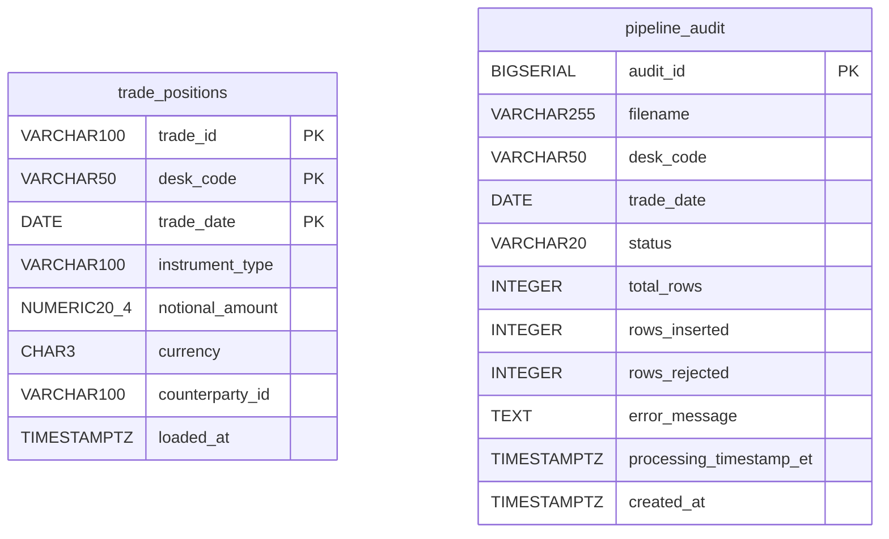
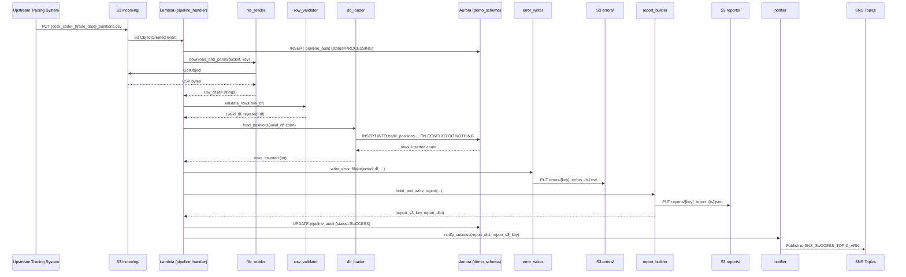
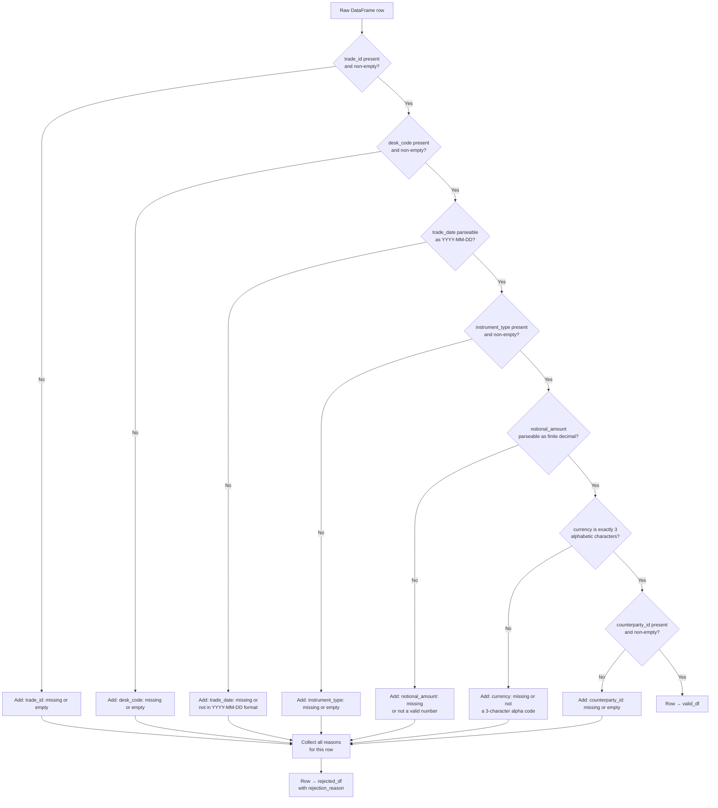
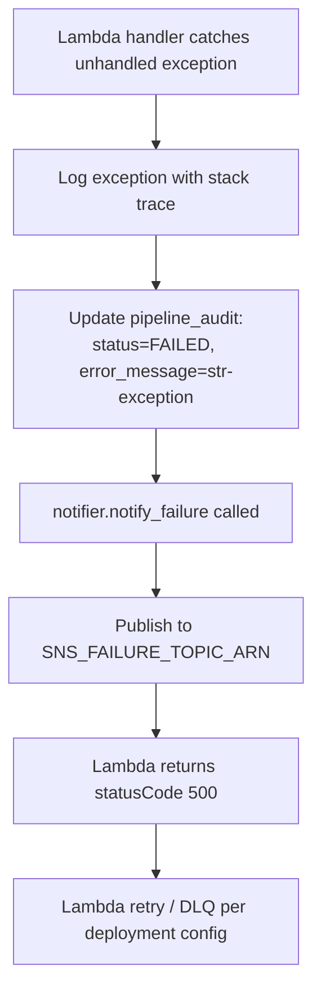

# Technical Design Document

## Daily Trade Position Ingestion Pipeline

**Project:** agentic-poc-sandbox
**Repo:** nartcr/agentic-poc-sandbox
**Team:** Sample Trade Operations
**Date:** June 2026
**Status:** Draft

---

## COMPONENTS

### `pipeline_handler.py` — Lambda Entry Point & Orchestrator

**What it does:**
Main Lambda handler. Receives an S3 event notification when a new file lands under `incoming/`. Parses the S3 event to extract the bucket name and object key. Validates the filename matches `{desk_code}_{trade_date}_positions.csv`. Orchestrates the full pipeline: download → validate → load → report → notify. Writes one row to `demo_schema.pipeline_audit` at the start (status=`PROCESSING`) and updates it at completion (status=`SUCCESS` or `FAILED`). Catches all unhandled exceptions and triggers failure notification before re-raising.

**Function signatures:**
```
def handler(event: dict, context: object) -> dict
def parse_s3_event(event: dict) -> tuple[str, str]           # returns (bucket, key)
def parse_filename(key: str) -> tuple[str, str]              # returns (desk_code, trade_date_str) or raises ValueError
```

**Reads:** S3 event payload (Records[0].s3.bucket.name, Records[0].s3.object.key)
**Writes:** Returns `{"statusCode": 200, "body": "OK"}` on success; logs error and returns `{"statusCode": 500, "body": str(e)}` on failure.
**Satisfies:** BAC-1, BAC-5, BAC-6, BAC-7, BAC-8

---

### `file_reader.py` — S3 File Downloader & CSV Parser

**What it does:**
Downloads the CSV file from S3 into memory (no `/tmp/`). Uses `boto3` S3 client via `os.environ["S3_BUCKET"]`. Reads the byte stream directly into a `pandas.DataFrame`. Returns the raw DataFrame with all columns as strings (dtype=`str`) to preserve exact input values for validation. Raises `FileReadError` (custom exception) if the file cannot be read or is empty.

**Function signatures:**
```
def download_and_parse(bucket: str, key: str) -> pd.DataFrame
```

**Reads:** S3 object at `s3://{bucket}/{key}` (CSV with header row; delimiter: `,`)
**Expected CSV columns (as received):** `trade_id`, `desk_code`, `trade_date`, `instrument_type`, `notional_amount`, `currency`, `counterparty_id` (plus any extra columns, which are ignored)
**Writes:** Returns `pd.DataFrame` with columns as strings; row index is the original 1-based line number in the file (for error reporting).
**Satisfies:** BAC-1, BAC-2, BAC-6

---

### `row_validator.py` — Row-Level Data Quality Validator

**What it does:**
Validates every row of the raw DataFrame against mandatory-field and format rules. Returns two DataFrames: `valid_df` and `rejected_df`. The `rejected_df` contains all original columns plus an additional `rejection_reason` column (string) listing all failure reasons for that row (comma-separated if multiple). Never modifies the `valid_df` rows — only casts types after validation passes.

**Validation rules applied in order per row:**

| Field | Rule | Rejection Reason String |
|---|---|---|
| `trade_id` | Non-null, non-empty string | `"trade_id: missing or empty"` |
| `desk_code` | Non-null, non-empty string | `"desk_code: missing or empty"` |
| `trade_date` | Non-null; parseable as `YYYY-MM-DD` | `"trade_date: missing or not in YYYY-MM-DD format"` |
| `instrument_type` | Non-null, non-empty string | `"instrument_type: missing or empty"` |
| `notional_amount` | Non-null; parseable as a finite decimal | `"notional_amount: missing or not a valid number"` |
| `currency` | Non-null; exactly 3 alphabetic characters | `"currency: missing or not a 3-character alpha code"` |
| `counterparty_id` | Non-null, non-empty string | `"counterparty_id: missing or empty"` |

After validation, `valid_df` has columns cast: `trade_date` → `datetime.date`, `notional_amount` → `Decimal`.

**Function signatures:**
```
def validate_rows(df: pd.DataFrame) -> tuple[pd.DataFrame, pd.DataFrame]
    # returns (valid_df, rejected_df)
```

**Reads:** Raw `pd.DataFrame` from `file_reader.py`
**Writes:**
- `valid_df`: same columns as input with type-cast values, no `rejection_reason` column
- `rejected_df`: all original columns + `rejection_reason: str`
**Satisfies:** BAC-2, BAC-4

---

### `db_loader.py` — Idempotent Database Loader

**What it does:**
Receives the validated `valid_df` and inserts rows into `demo_schema.trade_positions` using a batch `INSERT ... ON CONFLICT (trade_id, desk_code, trade_date) DO NOTHING`. Retrieves DB credentials from Secrets Manager via `secret_client.get_secret()` (from `secret_client.py`). Uses `psycopg2` for database connectivity. Executes the insert in a single transaction; rolls back on any exception. Returns `rows_inserted` (integer count of rows actually inserted, obtained via `cursor.rowcount` accumulated across batches or via a pre/post count delta).

Also provides `write_audit_record()` and `update_audit_record()` for the `demo_schema.pipeline_audit` table.

**Function signatures:**
```
def load_positions(valid_df: pd.DataFrame, conn: psycopg2.connection) -> int
    # returns count of rows inserted (excluding skipped duplicates)

def write_audit_record(conn: psycopg2.connection, filename: str, desk_code: str,
                       trade_date: str, status: str, total_rows: int,
                       rows_inserted: int, rows_rejected: int,
                       error_message: str | None,
                       processing_timestamp_et: datetime) -> int
    # returns audit_id (BIGSERIAL)

def update_audit_record(conn: psycopg2.connection, audit_id: int,
                        status: str, rows_inserted: int, rows_rejected: int,
                        error_message: str | None) -> None

def get_db_connection() -> psycopg2.connection
    # reads secret, builds connection string, returns open connection
```

**INSERT statement (exact):**
```sql
INSERT INTO demo_schema.trade_positions
    (trade_id, desk_code, trade_date, instrument_type,
     notional_amount, currency, counterparty_id)
VALUES %s
ON CONFLICT (trade_id, desk_code, trade_date) DO NOTHING
```
Using `psycopg2.extras.execute_values()` in batches of 1,000 rows.

**Reads:**
- `valid_df` columns: `trade_id`, `desk_code`, `trade_date`, `instrument_type`, `notional_amount`, `currency`, `counterparty_id`
- Secrets Manager secret referenced by `os.environ["DB_SECRET_ID"]` (default value: `agentic-poc-aurora`)

**Writes:**
- `demo_schema.trade_positions` (rows inserted)
- `demo_schema.pipeline_audit` (audit rows created/updated)

**Satisfies:** BAC-1, BAC-3, BAC-7, BAC-8

---

### `error_writer.py` — Rejected Row Error File Writer

**What it does:**
Takes the `rejected_df` (from `row_validator.py`) and writes it as a CSV to S3 under the `errors/` prefix. File key pattern: `errors/{desk_code}_{trade_date}_positions_errors_{timestamp_et}.csv`. Timestamp format: `%Y%m%dT%H%M%S` in Eastern Time. If `rejected_df` is empty, no file is written and the function returns `None`. Returns the S3 key of the written error file, or `None` if no rejections.

**Function signatures:**
```
def write_error_file(rejected_df: pd.DataFrame, bucket: str,
                     desk_code: str, trade_date_str: str,
                     timestamp_et: datetime) -> str | None
    # returns S3 key or None
```

**Reads:** `rejected_df` (columns: `trade_id`, `desk_code`, `trade_date`, `instrument_type`, `notional_amount`, `currency`, `counterparty_id`, `rejection_reason`)
**Writes:** S3 object at `s3://{bucket}/errors/{desk_code}_{trade_date}_positions_errors_{timestamp_et}.csv`
  - Format: CSV with header row
  - Columns: all input columns + `rejection_reason`
  - Encoding: UTF-8
**Satisfies:** BAC-2, BAC-4

---

### `report_builder.py` — Post-Load Summary Report Generator

**What it does:**
Constructs the summary report dict and writes it as a JSON file to S3 under the `reports/` prefix. Computes all statistics from the raw DataFrame, `valid_df`, and `rejected_df` passed in. Never re-queries the database. Report key pattern: `reports/{desk_code}_{trade_date}_positions_report_{timestamp_et}.json`. Timestamp format: `%Y%m%dT%H%M%S` in Eastern Time. Returns the S3 key of the written report.

**Report JSON structure** (exact field names):
```json
{
  "filename": "string",
  "desk_code": "string",
  "trade_date": "string (YYYY-MM-DD)",
  "processing_timestamp_et": "string (ISO-8601, ET)",
  "total_rows_received": integer,
  "rows_successfully_loaded": integer,
  "rows_rejected": integer,
  "rows_by_desk_code": {"<desk_code>": integer, ...},
  "notional_amount_min": "string (decimal)",
  "notional_amount_max": "string (decimal)",
  "null_rates_per_column": {
    "trade_id": float,
    "desk_code": float,
    "trade_date": float,
    "instrument_type": float,
    "notional_amount": float,
    "currency": float,
    "counterparty_id": float
  },
  "error_file_s3_key": "string or null"
}
```

`null_rates_per_column` is computed from the **raw** DataFrame (before validation) as `count(null_or_empty) / total_rows` per column, giving true incoming null rates.

`rows_by_desk_code` is computed from `valid_df` only (successfully loaded rows grouped by `desk_code`).

`rows_successfully_loaded` is the count returned by `db_loader.load_positions()` (actual DB inserts, not valid_df length, to account for duplicates).

**Function signatures:**
```
def build_and_write_report(raw_df: pd.DataFrame, valid_df: pd.DataFrame,
                           rejected_df: pd.DataFrame, rows_inserted: int,
                           filename: str, desk_code: str, trade_date_str: str,
                           timestamp_et: datetime, bucket: str,
                           error_file_key: str | None) -> tuple[str, dict]
    # returns (s3_key, report_dict)
```

**Reads:** `raw_df`, `valid_df`, `rejected_df`, `rows_inserted` (int)
**Writes:** S3 object at `s3://{bucket}/reports/{desk_code}_{trade_date}_positions_report_{timestamp_et}.json`
  - Format: JSON, UTF-8
**Satisfies:** BAC-4, BAC-7

---

### `notifier.py` — SNS Notification Publisher

**What it does:**
Publishes success or failure notifications to the appropriate SNS topic. On success, publishes to `os.environ["SNS_SUCCESS_TOPIC_ARN"]`. On failure, publishes to `os.environ["SNS_FAILURE_TOPIC_ARN"]`. Message body is a JSON-serialized dict. Uses `boto3` SNS client.

**Function signatures:**
```
def notify_success(report_dict: dict, report_s3_key: str) -> None

def notify_failure(filename: str, desk_code: str | None, trade_date_str: str | None,
                   error_message: str, processing_timestamp_et: datetime) -> None
```

**Success message JSON structure:**
```json
{
  "event": "TRADE_POSITIONS_LOADED",
  "filename": "string",
  "desk_code": "string",
  "trade_date": "string (YYYY-MM-DD)",
  "processing_timestamp_et": "string (ISO-8601, ET)",
  "total_rows_received": integer,
  "rows_successfully_loaded": integer,
  "rows_rejected": integer,
  "report_s3_key": "string"
}
```

**Failure message JSON structure:**
```json
{
  "event": "TRADE_POSITIONS_FAILED",
  "filename": "string",
  "desk_code": "string or null",
  "trade_date": "string or null",
  "processing_timestamp_et": "string (ISO-8601, ET)",
  "error_message": "string"
}
```

**Reads:** `report_dict` from `report_builder.py`, or error details directly.
**Writes:** SNS publish call (no return value; raises exception on publish failure)
**Satisfies:** BAC-5

---

### `secret_client.py` — Secrets Manager Credential Fetcher

**What it does:**
Fetches and caches the database secret from AWS Secrets Manager. Reads `os.environ["DB_SECRET_ID"]` to determine which secret to retrieve. Parses the secret JSON and returns a dict. Caches the result in a module-level variable so repeated calls within one Lambda invocation do not re-call Secrets Manager. Raises `SecretFetchError` (custom exception) on failure.

**Function signatures:**
```
def get_secret() -> dict
    # returns parsed JSON dict with keys: host, port, dbname, username, password
```

**Reads:** Secrets Manager secret at `os.environ["DB_SECRET_ID"]`
**Expected secret JSON keys:** `host`, `port`, `dbname`, `username`, `password`
**Writes:** Nothing (pure read; caches in module-level `_secret_cache`)
**Satisfies:** BAC-8

---

### `pipeline_exceptions.py` — Custom Exception Definitions

**What it does:**
Defines all custom exception classes used across the pipeline. No logic — only class definitions with descriptive docstrings.

**Exceptions defined:**
```
class FileReadError(Exception): ...
class FilenameParseError(ValueError): ...
class ValidationError(Exception): ...
class SecretFetchError(Exception): ...
class DatabaseLoadError(Exception): ...
```

**Reads:** Nothing
**Writes:** Nothing
**Satisfies:** Supports BAC-2, BAC-5 (structured error propagation)

---

### `time_utils.py` — Eastern Time Utilities

**What it does:**
Provides a single utility function to get the current timestamp in Eastern Time (`America/Toronto`) using `pytz`. Used throughout the pipeline wherever a timestamp is needed to ensure all timestamps are ET, never UTC.

**Function signatures:**
```
def now_et() -> datetime
    # returns datetime.now(pytz.timezone("America/Toronto"))
```

**Reads:** System clock
**Writes:** Nothing
**Satisfies:** BAC-7

---

## AWS SERVICES

| Service | Role |
|---|---|
| **Amazon S3** | Stores incoming trade position CSV files (under `incoming/`), error files (under `errors/`), and JSON summary reports (under `reports/`). Triggers the Lambda on object creation under `incoming/`. |
| **AWS Lambda** | Executes the pipeline on S3 event trigger. Function name: `agentic-poc-sandbox-qa`. Runs all processing in-memory; no `/tmp/` usage. |
| **Amazon Aurora (PostgreSQL-compatible)** | Reporting database. Stores validated trade positions in `demo_schema.trade_positions` and audit records in `demo_schema.pipeline_audit`. |
| **AWS Secrets Manager** | Stores database credentials. Secret ID: `agentic-poc-aurora`. Retrieved at runtime; never in code. |
| **Amazon SNS** | Publishes success and failure notifications to downstream risk pipeline subscribers. Two topics: success (`agentic-poc-success`) and failure (`agentic-poc-failure`). |
| **Amazon CloudWatch Logs** | Receives all `logging` module output from the Lambda function for observability and audit trail. |

---

## DATA CONTRACTS

### Database: `demo_schema.trade_positions`

| Column | Type | Nullable | Constraints |
|---|---|---|---|
| `trade_id` | `VARCHAR(100)` | NOT NULL | Part of PK |
| `desk_code` | `VARCHAR(50)` | NOT NULL | Part of PK |
| `trade_date` | `DATE` | NOT NULL | Part of PK |
| `instrument_type` | `VARCHAR(100)` | NOT NULL | |
| `notional_amount` | `NUMERIC(20,4)` | NOT NULL | |
| `currency` | `CHAR(3)` | NOT NULL | |
| `counterparty_id` | `VARCHAR(100)` | NOT NULL | |
| `loaded_at` | `TIMESTAMPTZ` | NOT NULL | Default: `now()` |

**Primary Key:** `(trade_id, desk_code, trade_date)`
**Unique Constraint / Deduplication Key:** `(trade_id, desk_code, trade_date)` — enforced by the PK itself; `ON CONFLICT DO NOTHING` uses this.



---

### Database: `demo_schema.pipeline_audit`

| Column | Type | Nullable | Constraints |
|---|---|---|---|
| `audit_id` | `BIGSERIAL` | NOT NULL | Primary Key |
| `filename` | `VARCHAR(255)` | NOT NULL | |
| `desk_code` | `VARCHAR(50)` | NULL | |
| `trade_date` | `DATE` | NULL | |
| `status` | `VARCHAR(20)` | NOT NULL | Values: `PROCESSING`, `SUCCESS`, `FAILED` |
| `total_rows` | `INTEGER` | NOT NULL | Default: `0` |
| `rows_inserted` | `INTEGER` | NOT NULL | Default: `0` |
| `rows_rejected` | `INTEGER` | NOT NULL | Default: `0` |
| `error_message` | `TEXT` | NULL | |
| `processing_timestamp_et` | `TIMESTAMPTZ` | NOT NULL | |
| `created_at` | `TIMESTAMPTZ` | NOT NULL | Default: `now()` |

**Primary Key:** `(audit_id)`

---

### S3 Paths

| Purpose | Bucket Env Var | Key Pattern | Format | Content |
|---|---|---|---|---|
| Incoming files | `os.environ["S3_BUCKET"]` | `incoming/{desk_code}_{trade_date}_positions.csv` | CSV, UTF-8, comma-delimited, with header | Fields: `trade_id`, `desk_code`, `trade_date`, `instrument_type`, `notional_amount`, `currency`, `counterparty_id` |
| Error files | `os.environ["S3_BUCKET"]` | `errors/{desk_code}_{trade_date}_positions_errors_{YYYYMMDDTHHmmSS}.csv` | CSV, UTF-8, with header | All input columns + `rejection_reason` |
| Report files | `os.environ["S3_BUCKET"]` | `reports/{desk_code}_{trade_date}_positions_report_{YYYYMMDDTHHmmSS}.json` | JSON, UTF-8 | See report JSON structure in `report_builder.py` |

**S3 Bucket:** referenced via `os.environ["S3_BUCKET"]` (value: `agentic-poc-533266968934`)

---

### Secrets Manager

**Secret ID env var:** `os.environ["DB_SECRET_ID"]` (value: `agentic-poc-aurora`)

**Expected JSON keys inside the secret:**

| Key | Type | Description |
|---|---|---|
| `host` | string | Aurora cluster endpoint hostname |
| `port` | integer or string | Database port (typically `5432`) |
| `dbname` | string | Database name (`app`) |
| `username` | string | Database user |
| `password` | string | Database password |

---

### SNS Topics

| Topic | Env Var | Value |
|---|---|---|
| Success | `os.environ["SNS_SUCCESS_TOPIC_ARN"]` | `arn:aws:sns:us-east-1:533266968934:agentic-poc-success` |
| Failure | `os.environ["SNS_FAILURE_TOPIC_ARN"]` | `arn:aws:sns:us-east-1:533266968934:agentic-poc-failure` |

**Success message schema:** see `notifier.py` above.
**Failure message schema:** see `notifier.py` above.

---

### Environment Variables Summary

| Env Var | Value (from infrastructure config) | Used By |
|---|---|---|
| `S3_BUCKET` | `agentic-poc-533266968934` | `file_reader.py`, `error_writer.py`, `report_builder.py` |
| `DB_SECRET_ID` | `agentic-poc-aurora` | `secret_client.py` |
| `SNS_SUCCESS_TOPIC_ARN` | `arn:aws:sns:us-east-1:533266968934:agentic-poc-success` | `notifier.py` |
| `SNS_FAILURE_TOPIC_ARN` | `arn:aws:sns:us-east-1:533266968934:agentic-poc-failure` | `notifier.py` |

---

## DATA FLOW

### End-to-End Pipeline Flow



---

### Validation Decision Logic



---

### Error Path (Pipeline Failure)



---

### Idempotent Load Algorithm

```
Algorithm: Idempotent Batch Insert
Input: valid_df (validated rows), conn (DB connection)

1. Begin transaction
2. Split valid_df into batches of 1,000 rows
3. For each batch:
   a. Build list of tuples: (trade_id, desk_code, trade_date,
                              instrument_type, notional_amount,
                              currency, counterparty_id)
   b. Execute:
        INSERT INTO demo_schema.trade_positions
          (trade_id, desk_code, trade_date, instrument_type,
           notional_amount, currency, counterparty_id)
        VALUES %s
        ON CONFLICT (trade_id, desk_code, trade_date) DO NOTHING
   c. Add cursor.rowcount to running total inserted
4. Commit transaction
5. Return total inserted count

Note: ON CONFLICT targets the PRIMARY KEY (trade_id, desk_code, trade_date).
      Duplicate rows are silently skipped — no error is raised.
      loaded_at is populated by the DB default (now()) on insert.
```

---

## TECHNICAL ACCEPTANCE CRITERIA

**TAC-1: Valid positions loaded before next morning's risk run**
- `db_loader.load_positions()` must complete without error when given a 10,000-row valid DataFrame.
- Acceptance test: time the full pipeline (download → validate → load → report → notify) against a 10,000-row file; assert wall-clock time ≤ 60 seconds.
- After the Lambda returns `statusCode 200`, a `SELECT COUNT(*) FROM demo_schema.trade_positions WHERE desk_code = :desk_code AND trade_date = :trade_date` must return a count equal to `rows_inserted` from the audit record.
- `demo_schema.pipeline_audit.status` must be `SUCCESS` for the processed filename.

**TAC-2: Rejected rows flagged with clear reasons**
- `row_validator.validate_rows()` must return a `rejected_df` with a `rejection_reason` column populated for every rejected row.
- Each rejection reason must use the exact strings defined in the validation rules table (e.g., `"trade_id: missing or empty"`).
- `error_writer.write_error_file()` must write the `rejected_df` (with `rejection_reason`) as a CSV to `s3://{S3_BUCKET}/errors/{desk_code}_{trade_date}_positions_errors_{timestamp_et}.csv`.
- Acceptance test: inject a row with `trade_id` empty and `notional_amount` = `"abc"`; assert `rejection_reason` contains both `"trade_id: missing or empty"` and `"notional_amount: missing or not a valid number"`.

**TAC-3: Resubmitting does not double-count positions**
- `db_loader.load_positions()` executes `INSERT INTO demo_schema.trade_positions ... ON CONFLICT (trade_id, desk_code, trade_date) DO NOTHING`.
- Acceptance test: run the pipeline twice with the identical input file; assert that `SELECT COUNT(*) FROM demo_schema.trade_positions WHERE desk_code = :desk_code AND trade_date = :trade_date` returns the same count after the second run as after the first run. Also assert that `rows_inserted` from the second audit record is `0`.

**TAC-4: Summary report accurately reflects received, accepted, and rejected counts**
- `report_builder.build_and_write_report()` must write a JSON report to S3 where:
  - `total_rows_received` == `len(raw_df)`
  - `rows_successfully_loaded` == return value of `db_loader.load_positions()` (not `len(valid_df)`)
  - `rows_rejected` == `len(rejected_df)`
  - `total_rows_received == rows_successfully_loaded + rows_rejected + (len(valid_df) - rows_inserted)` (the last term accounts for valid-but-duplicate rows)
  - `null_rates_per_column` computed from `raw_df` over the 7 mandatory fields
  - `rows_by_desk_code` computed from `valid_df` grouped by `desk_code` with `ORDER BY desk_code`
- Acceptance test: parse the written JSON and assert all numeric fields match independently computed values from the same input.

**TAC-5: Risk pipeline automatically notified with no manual trigger**
- `notifier.notify_success()` must be called by `pipeline_handler.handler()` on every successful pipeline completion.
- The SNS message must be published to `os.environ["SNS_SUCCESS_TOPIC_ARN"]` and include `event`, `filename`, `desk_code`, `trade_date`, `processing_timestamp_et`, `total_rows_received`, `rows_successfully_loaded`, `rows_rejected`, and `report_s3_key`.
- `notifier.notify_failure()` must publish to `os.environ["SNS_FAILURE_TOPIC_ARN"]` when any unhandled exception propagates to `pipeline_handler.handler()`.
- Acceptance test: mock SNS client; assert exactly one `publish` call to the success topic ARN after a clean run; assert exactly one `publish` call to the failure topic ARN after an injected failure.

**TAC-6: Processing completes within 60 seconds for 10,000 rows**
- `db_loader.load_positions()` uses `psycopg2.extras.execute_values()` in batches of 1,000 rows (not row-by-row inserts).
- Acceptance test: measure end-to-end Lambda execution time for a synthetic 10,000-row file and assert ≤ 60 seconds.
- Lambda timeout must be set to at least 120 seconds in deployment config to allow for worst-case 100,000-row files.

**TAC-7: All timestamps in Eastern Time for regulatory audit**
- `time_utils.now_et()` returns `datetime.now(pytz.timezone("America/Toronto"))` — all calls to generate timestamps use this function.
- `demo_schema.pipeline_audit.processing_timestamp_et` stores a `TIMESTAMPTZ` value generated by `time_utils.now_et()`.
- JSON report field `processing_timestamp_et` is formatted as ISO-8601 with timezone offset (e.g., `2026-06-15T19:32:00-04:00`).
- SNS message field `processing_timestamp_et` uses the same ISO-8601+offset format.
- Acceptance test: assert that the `tzinfo` of any `datetime` returned by `time_utils.now_et()` is `America/Toronto` and not UTC. Assert that the UTC offset in stored/published timestamp strings matches the current ET offset (`-05:00` or `-04:00` depending on DST).

**TAC-8: No credentials in code or configuration files**
- `secret_client.get_secret()` is the sole source of database credentials; it reads from Secrets Manager using `os.environ["DB_SECRET_ID"]`.
- `db_loader.get_db_connection()` calls `secret_client.get_secret()` to retrieve credentials.
- No password, username, connection string, ARN value, or bucket name appears as a literal in any Python source file (all are read from `os.environ` or Secrets Manager).
- Acceptance test: grep all `.py` files in the repo for the patterns `password`, `secret`, `token`, `key` appearing as string literals (not as dict key names); assert zero matches.

---

## OPEN QUESTIONS

None. All business logic questions are resolvable from the BRD, and infrastructure config is provided in the YAML.

---

## ASSUMPTIONS

1. **Lambda trigger:** The Lambda function `agentic-poc-sandbox-qa` is already configured with an S3 event notification trigger on the `agentic-poc-533266968934` bucket for `s3:ObjectCreated:*` events filtered to the `incoming/` prefix. This is an existing deployment-time configuration — the code only needs to handle the event payload.

2. **One file = one desk per invocation:** Each S3 event triggers exactly one Lambda invocation per file. The pipeline processes exactly one file per invocation. Concurrent files from different desks may result in concurrent Lambda invocations, which is acceptable since the deduplication key prevents conflicts.

3. **CSV file encoding:** All incoming CSV files are UTF-8 encoded with standard comma delimiter and a header row matching the exact field names: `trade_id`, `desk_code`, `trade_date`, `instrument_type`, `notional_amount`, `currency`, `counterparty_id`. Additional columns in the CSV are silently ignored.

4. **`trade_date` in filename vs. content:** The `trade_date` in the filename (`{desk_code}_{trade_date}_positions.csv`) is used for parsing and audit purposes. The authoritative `trade_date` for each row is the value inside the CSV, not the filename. If they differ, the row-level value is used for the DB insert; the filename date is used only in audit/reporting metadata.

5. **DB connection per invocation:** A new database connection is opened per Lambda invocation (not a connection pool), since Lambda cold starts are infrequent enough and Aurora is accessed over the VPC. The connection is closed after all DB operations complete.

6. **`rows_inserted` vs. `len(valid_df)`:** On reprocessing, `valid_df` may have rows that pass validation but are duplicates already in the DB. `rows_successfully_loaded` in the report and audit reflects actual DB inserts (`cursor.rowcount`), not the length of `valid_df`.

7. **Batch size of 1,000 rows:** `psycopg2.extras.execute_values()` batch size is 1,000 rows, balancing memory usage and network round trips for files up to 100,000 rows.

8. **Error file is written even on full-success runs with zero rejections:** If `rejected_df` is empty, `error_writer.write_error_file()` returns `None` and no S3 object is written. The report JSON will contain `"error_file_s3_key": null`.

9. **`loaded_at` column:** This is populated by the Aurora default `now()` and is never explicitly set by the application.

10. **Aurora is in the same VPC as the Lambda:** Network connectivity from Lambda to Aurora is assumed to be already configured (VPC, security groups, subnets). This is an existing infrastructure concern.

11. **`pipeline_audit` update on failure:** Even if the pipeline fails before completing, the handler's `try/except` block will attempt to `UPDATE pipeline_audit SET status='FAILED'`. If the DB itself is unavailable, this update may also fail; in that case the failure notification is still sent to SNS and the exception is logged.

12. **No schema migration:** The tables `demo_schema.trade_positions` and `demo_schema.pipeline_audit` already exist in the Aurora database as specified in the infrastructure YAML. The application does not run DDL.

13. **`desk_code` in filename:** The filename's `desk_code` segment is extracted by splitting on `_` and taking the first token (before the first `_`). The BRD filename convention `{desk_code}_{trade_date}_positions.csv` is treated as `{desk_code}` = everything before the first `_`, `{trade_date}` = the token between the first and second `_` (format `YYYY-MM-DD`). This means desk codes must not themselves contain underscores.