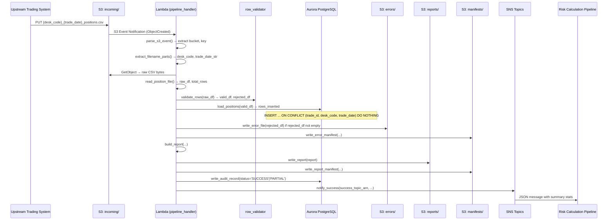
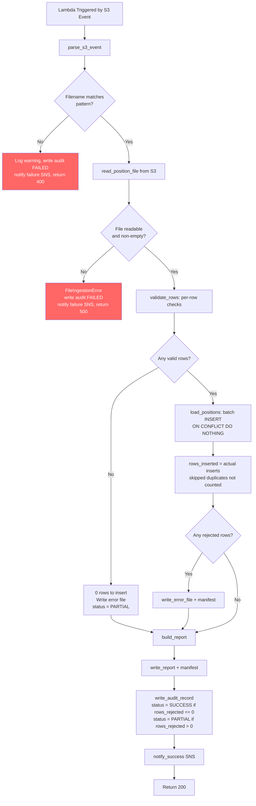
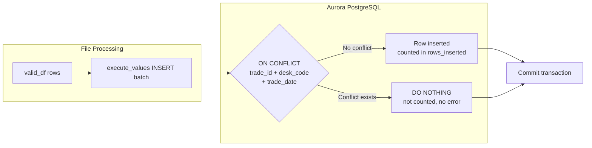

# Technical Design Document

## Daily Trade Position Ingestion Pipeline

**Project:** agentic-poc-sandbox
**Repo:** nartcr/agentic-poc-sandbox
**Team:** Sample Trade Operations
**Date:** June 2026
**Status:** Draft

---

## COMPONENTS

### `pipeline_handler.py` — Lambda Entry Point and Orchestrator

**What it does:**
Serves as the AWS Lambda handler. Receives S3 event notifications when a new file lands in `incoming/`. Parses the S3 event to extract the bucket name and object key. Validates the filename matches the pattern `{desk_code}_{trade_date}_positions.csv`. Orchestrates the full pipeline: invoke file ingestion → validation → loading → reporting → notification. Catches all unhandled exceptions and routes to the failure notification path, writing an audit record with `status='FAILED'` and `error_message` populated.

**Signature:**
```
def handler(event: dict, context: object) -> dict
def parse_s3_event(event: dict) -> tuple[str, str]  # returns (bucket, key)
def extract_filename_parts(key: str) -> tuple[str, str]  # returns (desk_code, trade_date_str); raises ValueError if pattern mismatch
```

**Reads:**
- S3 event payload (JSON): `Records[*].s3.bucket.name`, `Records[*].s3.object.key`
- Environment variables: `S3_BUCKET`, `DB_SECRET_ID`, `SNS_SUCCESS_ARN`, `SNS_FAILURE_ARN`, `DB_SCHEMA`

**Writes:**
- Returns HTTP-style dict `{"statusCode": 200, "body": "..."}` on success
- Returns `{"statusCode": 500, "body": "..."}` on failure

**Satisfies:** BAC-1, BAC-5, BAC-6, BAC-8

---

### `file_ingestor.py` — S3 File Reader

**What it does:**
Downloads the CSV file from S3 into a `pandas.DataFrame`. Reads the file using `pandas.read_csv` with `dtype=str` (all columns read as strings to avoid silent type coercion before validation). Returns the raw DataFrame and the row count. Raises `FileIngestionError` if the S3 `get_object` call fails or the file is empty.

**Signatures:**
```
def read_position_file(bucket: str, key: str, s3_client) -> tuple[pd.DataFrame, int]
# Returns (raw_df, total_row_count)
# Raises FileIngestionError on S3 or parse error
```

**Reads:**
- S3 object at `s3://{bucket}/{key}` — CSV with header row; expected columns: `trade_id`, `desk_code`, `trade_date`, `instrument_type`, `notional_amount`, `currency`, `counterparty_id`

**Writes:**
- Returns `pd.DataFrame` with all columns as `str` dtype, preserving original row order
- Returns `int` total row count (excludes header)

**Satisfies:** BAC-1, BAC-4, BAC-6

---

### `row_validator.py` — Data Quality Validation

**What it does:**
Accepts the raw string DataFrame from `file_ingestor.py`. Applies the following validation rules to each row, in order, collecting all failures per row:

1. **Presence check:** `trade_id`, `desk_code`, `trade_date`, `instrument_type`, `notional_amount`, `currency`, `counterparty_id` must be non-null, non-empty strings after `.strip()`.
2. **trade_date format:** Must parse as `YYYY-MM-DD` using `datetime.strptime`. Any other format → rejection reason: `"trade_date format invalid: expected YYYY-MM-DD"`.
3. **notional_amount numeric:** Must be castable to `Decimal` with no exception. If not → rejection reason: `"notional_amount is not numeric"`.
4. **currency length:** Must be exactly 3 alphabetic characters (ISO 4217 format). If not → rejection reason: `"currency must be 3 alphabetic characters"`.
5. **trade_id uniqueness within file:** After all per-row checks, any `trade_id` appearing more than once for the same `desk_code` + `trade_date` combination is rejected with reason: `"duplicate trade_id within file for same desk_code and trade_date"`.

Rows passing all checks are returned as the valid DataFrame (with `notional_amount` cast to `Decimal`, `trade_date` cast to `datetime.date`). Rows failing any check are returned as the rejected DataFrame with an additional `rejection_reason` column.

**Signatures:**
```
def validate_rows(df: pd.DataFrame) -> tuple[pd.DataFrame, pd.DataFrame]
# Returns (valid_df, rejected_df)
# valid_df columns: trade_id (str), desk_code (str), trade_date (date), instrument_type (str),
#                   notional_amount (Decimal), currency (str), counterparty_id (str)
# rejected_df columns: all original columns + rejection_reason (str)

def _check_mandatory_fields(row: pd.Series) -> list[str]
def _check_trade_date_format(value: str) -> list[str]
def _check_notional_amount(value: str) -> list[str]
def _check_currency_format(value: str) -> list[str]
def _check_intrafile_duplicates(df: pd.DataFrame) -> pd.DataFrame
# Returns df with rejection_reason appended for duplicate rows
```

**Reads:** `pd.DataFrame` with string columns (from `file_ingestor.py`)

**Writes:**
- `valid_df`: typed DataFrame ready for DB insert
- `rejected_df`: original columns + `rejection_reason` (str), preserving original row number for traceability

**Satisfies:** BAC-2, BAC-4

---

### `db_loader.py` — Idempotent Database Writer

**What it does:**
Receives the validated DataFrame. Opens a psycopg2 connection using credentials from Secrets Manager (via `secret_manager.py`). Executes a batch `INSERT INTO demo_schema.trade_positions (trade_id, desk_code, trade_date, instrument_type, notional_amount, currency, counterparty_id, loaded_at) VALUES %s ON CONFLICT (trade_id, desk_code, trade_date) DO NOTHING` using `psycopg2.extras.execute_values`. Captures the actual number of rows inserted by comparing pre- and post-insert counts via `cursor.rowcount`. Returns the count of rows inserted (skipped duplicates are not counted).

Also writes one row to `demo_schema.pipeline_audit` per file processed (called by `pipeline_handler.py` after all steps complete, or on failure):
```
INSERT INTO demo_schema.pipeline_audit
  (filename, desk_code, trade_date, status, total_rows, rows_inserted, rows_rejected, error_message, processing_timestamp_et)
VALUES (%s, %s, %s, %s, %s, %s, %s, %s, %s)
```

**Signatures:**
```
def load_positions(valid_df: pd.DataFrame, conn) -> int
# Returns rows_inserted count
# Uses execute_values with ON CONFLICT (trade_id, desk_code, trade_date) DO NOTHING

def write_audit_record(
    conn,
    filename: str,
    desk_code: str | None,
    trade_date: date | None,
    status: str,           # 'SUCCESS' | 'FAILED' | 'PARTIAL'
    total_rows: int,
    rows_inserted: int,
    rows_rejected: int,
    error_message: str | None,
    processing_timestamp_et: datetime
) -> None
```

**Reads:**
- `valid_df`: columns `trade_id`, `desk_code`, `trade_date`, `instrument_type`, `notional_amount`, `currency`, `counterparty_id`
- DB connection from `secret_manager.py`

**Writes:**
- `demo_schema.trade_positions` (upsert-safe insert)
- `demo_schema.pipeline_audit` (one row per file)

**Satisfies:** BAC-1, BAC-3, BAC-4, BAC-7, BAC-8

---

### `error_writer.py` — Rejected Row Error File Writer

**What it does:**
Accepts the rejected DataFrame (with `rejection_reason` column). Serializes it to CSV. Writes it to S3 at key `errors/{desk_code}_{trade_date}_positions_errors_{timestamp_et}.csv` where `timestamp_et` is `YYYYMMDD_HHMMSS` in ET. Also writes a manifest JSON to `manifests/{desk_code}_{trade_date}_errors_manifest.json` containing `{"error_file_key": "<actual S3 key>", "generated_at_et": "<ISO timestamp ET>", "row_count": <int>}` so consumers can find the error file without guessing the timestamp.

**Signatures:**
```
def write_error_file(
    rejected_df: pd.DataFrame,
    bucket: str,
    desk_code: str,
    trade_date_str: str,
    s3_client,
    now_et: datetime
) -> str
# Returns the S3 key of the written error file

def write_error_manifest(
    bucket: str,
    desk_code: str,
    trade_date_str: str,
    error_key: str,
    row_count: int,
    s3_client,
    now_et: datetime
) -> None
```

**Reads:** `rejected_df` with columns: all original input columns + `rejection_reason`

**Writes:**
- `s3://{bucket}/errors/{desk_code}_{trade_date}_positions_errors_{YYYYMMDD_HHMMSS}.csv` — CSV with header
- `s3://{bucket}/manifests/{desk_code}_{trade_date}_errors_manifest.json` — JSON manifest

**Satisfies:** BAC-2, BAC-4

---

### `report_writer.py` — Post-Load Summary Report Writer

**What it does:**
Accepts processing statistics and the valid/rejected DataFrames. Computes and serializes a JSON summary report. Writes to S3 at `reports/{desk_code}_{trade_date}_positions_report_{YYYYMMDD_HHMMSS}.csv` (actually JSON). Also writes a manifest at `manifests/{desk_code}_{trade_date}_report_manifest.json`.

**Report JSON structure:**
```json
{
  "filename": "<original filename>",
  "desk_code": "<desk_code>",
  "trade_date": "<YYYY-MM-DD>",
  "processing_timestamp_et": "<ISO 8601 with timezone offset>",
  "total_rows_received": <int>,
  "rows_loaded": <int>,
  "rows_rejected": <int>,
  "rows_by_desk_code": {"<desk_code>": <int>, ...},
  "notional_amount_min": <float>,
  "notional_amount_max": <float>,
  "null_rates": {
    "trade_id": <float>,
    "desk_code": <float>,
    "trade_date": <float>,
    "instrument_type": <float>,
    "notional_amount": <float>,
    "currency": <float>,
    "counterparty_id": <float>
  }
}
```

Null rates are computed against the raw DataFrame (all rows including rejected) as `count(null or empty) / total_rows`. `rows_by_desk_code` is computed from valid rows only (grouped by `desk_code`). `notional_amount_min` and `notional_amount_max` are computed from valid rows only.

**Signatures:**
```
def build_report(
    filename: str,
    desk_code: str,
    trade_date_str: str,
    raw_df: pd.DataFrame,
    valid_df: pd.DataFrame,
    rejected_df: pd.DataFrame,
    rows_inserted: int,
    now_et: datetime
) -> dict

def write_report(
    report: dict,
    bucket: str,
    desk_code: str,
    trade_date_str: str,
    s3_client,
    now_et: datetime
) -> str
# Returns the S3 key of the written report file

def write_report_manifest(
    bucket: str,
    desk_code: str,
    trade_date_str: str,
    report_key: str,
    s3_client,
    now_et: datetime
) -> None
```

**Writes:**
- `s3://{bucket}/reports/{desk_code}_{trade_date}_positions_report_{YYYYMMDD_HHMMSS}.json` — JSON report
- `s3://{bucket}/manifests/{desk_code}_{trade_date}_report_manifest.json` — JSON manifest with `{"report_file_key": "<key>", "generated_at_et": "<ISO ET>"}` 

**Satisfies:** BAC-4, BAC-7

---

### `sns_notifier.py` — SNS Notification Publisher

**What it does:**
Publishes to SNS success or failure topic. Success message includes the summary statistics. Failure message includes filename, error details, and timestamp. Uses `boto3` SNS client. Does not swallow exceptions — failures in notification propagate back to `pipeline_handler.py` and are logged.

**Signatures:**
```
def notify_success(
    sns_client,
    topic_arn: str,
    filename: str,
    desk_code: str,
    trade_date_str: str,
    total_rows: int,
    rows_inserted: int,
    rows_rejected: int,
    report_key: str,
    processing_timestamp_et: datetime
) -> None

def notify_failure(
    sns_client,
    topic_arn: str,
    filename: str,
    error_message: str,
    processing_timestamp_et: datetime
) -> None
```

**Success SNS message JSON:**
```json
{
  "event": "TRADE_POSITIONS_LOADED",
  "filename": "<str>",
  "desk_code": "<str>",
  "trade_date": "<YYYY-MM-DD>",
  "total_rows": <int>,
  "rows_inserted": <int>,
  "rows_rejected": <int>,
  "report_s3_key": "<str>",
  "processing_timestamp_et": "<ISO 8601>"
}
```

**Failure SNS message JSON:**
```json
{
  "event": "TRADE_POSITIONS_FAILED",
  "filename": "<str>",
  "error_message": "<str>",
  "processing_timestamp_et": "<ISO 8601>"
}
```

**Reads:** `SNS_SUCCESS_ARN`, `SNS_FAILURE_ARN` (environment variables)

**Satisfies:** BAC-5

---

### `secret_manager.py` — Secrets Manager Client and DB Connection Factory

**What it does:**
Retrieves database credentials from AWS Secrets Manager at runtime using the secret ID from `os.environ["DB_SECRET_ID"]`. Parses the JSON secret. Returns a `psycopg2` connection object. Caches the connection within a Lambda execution context (module-level singleton) to avoid per-invocation reconnects. Raises `SecretRetrievalError` if Secrets Manager call fails.

**Signatures:**
```
def get_db_connection() -> psycopg2.extensions.connection
# Reads DB_SECRET_ID env var, calls secretsmanager:GetSecretValue,
# parses JSON, builds psycopg2 connection to host/port/dbname/user/password

def _parse_secret(secret_string: str) -> dict
# Returns dict with keys: host, port, dbname, username, password
```

**Expected secret JSON keys:** `host`, `port`, `dbname`, `username`, `password`

**Environment variables read:** `DB_SECRET_ID`

**Satisfies:** BAC-8

---

### `time_utils.py` — Eastern Time Utilities

**What it does:**
Provides a single source of truth for all timestamp operations in the pipeline. Returns `datetime` objects localized to `America/Toronto`. Used by all modules that record timestamps.

**Signatures:**
```
def now_et() -> datetime
# Returns datetime.now(pytz.timezone("America/Toronto"))

def to_et_string(dt: datetime) -> str
# Returns ISO 8601 string with ET offset, e.g. "2026-06-15T19:32:11-04:00"

def et_timestamp_for_key(dt: datetime) -> str
# Returns "YYYYMMDD_HHMMSS" string in ET for use in S3 keys
```

**Reads:** system clock
**Writes:** nothing

**Satisfies:** BAC-7

---

## AWS SERVICES

| Service | Role |
|---|---|
| **AWS Lambda** | Runtime host for the ingestion pipeline. Function name: `agentic-poc-sandbox-qa`. Triggered by S3 event notifications on the `incoming/` prefix. |
| **Amazon S3** | Storage for input position files (`incoming/`), error files (`errors/`), summary reports (`reports/`), and manifests (`manifests/`). Bucket: `agentic-poc-533266968934` (via `os.environ["S3_BUCKET"]`). |
| **AWS Secrets Manager** | Stores Aurora database credentials. Secret ID: `agentic-poc-aurora` (via `os.environ["DB_SECRET_ID"]`). |
| **Amazon Aurora (PostgreSQL-compatible)** | Reporting database. Schema: `demo_schema`. Tables: `trade_positions`, `pipeline_audit`. Database name: `app`. |
| **Amazon SNS** | Publishes success and failure notifications to downstream consumers. Two topics: success (`os.environ["SNS_SUCCESS_ARN"]`) and failure (`os.environ["SNS_FAILURE_ARN"]`). |
| **Amazon CloudWatch Logs** | Receives all structured log output from Lambda (via Python `logging` module). Supports operational monitoring and audit trail. |

---

## DATA CONTRACTS

### Database Tables

#### `demo_schema.trade_positions`

| Column | Type | Nullable | Constraints |
|---|---|---|---|
| `trade_id` | `VARCHAR(100)` | NOT NULL | PK component |
| `desk_code` | `VARCHAR(50)` | NOT NULL | PK component |
| `trade_date` | `DATE` | NOT NULL | PK component |
| `instrument_type` | `VARCHAR(100)` | NOT NULL | |
| `notional_amount` | `NUMERIC(20,4)` | NOT NULL | |
| `currency` | `CHAR(3)` | NOT NULL | |
| `counterparty_id` | `VARCHAR(100)` | NOT NULL | |
| `loaded_at` | `TIMESTAMPTZ` | NOT NULL | DEFAULT `now()` |

**Primary Key:** `(trade_id, desk_code, trade_date)`
**Deduplication:** `ON CONFLICT (trade_id, desk_code, trade_date) DO NOTHING`

---

#### `demo_schema.pipeline_audit`

| Column | Type | Nullable | Constraints |
|---|---|---|---|
| `audit_id` | `BIGSERIAL` | NOT NULL | PK |
| `filename` | `VARCHAR(255)` | NOT NULL | |
| `desk_code` | `VARCHAR(50)` | NULL | |
| `trade_date` | `DATE` | NULL | |
| `status` | `VARCHAR(20)` | NOT NULL | Values: `'SUCCESS'`, `'FAILED'`, `'PARTIAL'` |
| `total_rows` | `INTEGER` | NOT NULL | DEFAULT `0` |
| `rows_inserted` | `INTEGER` | NOT NULL | DEFAULT `0` |
| `rows_rejected` | `INTEGER` | NOT NULL | DEFAULT `0` |
| `error_message` | `TEXT` | NULL | |
| `processing_timestamp_et` | `TIMESTAMPTZ` | NOT NULL | |
| `created_at` | `TIMESTAMPTZ` | NOT NULL | DEFAULT `now()` |

**Primary Key:** `(audit_id)`

---

### S3 Paths

| Logical Purpose | Key Pattern | Format | Content |
|---|---|---|---|
| Input position file | `incoming/{desk_code}_{trade_date}_positions.csv` | CSV, UTF-8, with header | Columns: `trade_id`, `desk_code`, `trade_date`, `instrument_type`, `notional_amount`, `currency`, `counterparty_id` |
| Error file | `errors/{desk_code}_{trade_date}_positions_errors_{YYYYMMDD_HHMMSS}.csv` | CSV, UTF-8, with header | All original columns + `rejection_reason` |
| Error manifest | `manifests/{desk_code}_{trade_date}_errors_manifest.json` | JSON | `{"error_file_key": str, "generated_at_et": str, "row_count": int}` |
| Summary report | `reports/{desk_code}_{trade_date}_positions_report_{YYYYMMDD_HHMMSS}.json` | JSON | Full summary report (see `report_writer.py` structure above) |
| Report manifest | `manifests/{desk_code}_{trade_date}_report_manifest.json` | JSON | `{"report_file_key": str, "generated_at_et": str}` |

All environment variable: `S3_BUCKET = os.environ["S3_BUCKET"]`

---

### Secrets Manager

**Environment variable:** `DB_SECRET_ID = os.environ["DB_SECRET_ID"]`
**Secret ID (from infra config):** `agentic-poc-aurora`

**Expected JSON keys inside secret:**

| Key | Type | Description |
|---|---|---|
| `host` | string | Aurora cluster endpoint |
| `port` | integer | PostgreSQL port (typically `5432`) |
| `dbname` | string | Database name (`app`) |
| `username` | string | DB user |
| `password` | string | DB password |

---

### SNS Topics

| Topic | Env Var | Message Format |
|---|---|---|
| Success | `SNS_SUCCESS_ARN = os.environ["SNS_SUCCESS_ARN"]` | See `sns_notifier.py` success JSON above |
| Failure | `SNS_FAILURE_ARN = os.environ["SNS_FAILURE_ARN"]` | See `sns_notifier.py` failure JSON above |

---

### Environment Variables Summary

| Variable | Value (from infra config) | Used By |
|---|---|---|
| `S3_BUCKET` | `agentic-poc-533266968934` | All S3 operations |
| `DB_SECRET_ID` | `agentic-poc-aurora` | `secret_manager.py` |
| `SNS_SUCCESS_ARN` | `arn:aws:sns:us-east-1:533266968934:agentic-poc-success` | `sns_notifier.py` |
| `SNS_FAILURE_ARN` | `arn:aws:sns:us-east-1:533266968934:agentic-poc-failure` | `sns_notifier.py` |
| `DB_SCHEMA` | `demo_schema` | `db_loader.py` |

---

## DATA FLOW

### End-to-End Pipeline Flow



---

### Decision Logic — Validation and Status Assignment



---

### Validation Algorithm Detail

```
ALGORITHM: validate_rows(df)

INPUT: raw_df (all columns as str dtype)
OUTPUT: (valid_df, rejected_df)

mandatory_fields = [trade_id, desk_code, trade_date, instrument_type, 
                    notional_amount, currency, counterparty_id]

FOR each row in df:
    reasons = []
    
    FOR each field in mandatory_fields:
        IF row[field] is null OR row[field].strip() == "":
            reasons.append(f"{field} is missing or empty")
    
    IF trade_date present AND not empty:
        TRY parse row[trade_date] as YYYY-MM-DD
        IF fails: reasons.append("trade_date format invalid: expected YYYY-MM-DD")
    
    IF notional_amount present AND not empty:
        TRY cast row[notional_amount] to Decimal
        IF fails: reasons.append("notional_amount is not numeric")
    
    IF currency present AND not empty:
        IF NOT (len(currency.strip()) == 3 AND currency.strip().isalpha()):
            reasons.append("currency must be 3 alphabetic characters")
    
    IF reasons is empty:
        add row to candidate_valid_rows (with typed casts applied)
    ELSE:
        add row to rejected_rows with rejection_reason = "; ".join(reasons)

# Intrafile duplicate check on candidate_valid_rows
group_key = (trade_id, desk_code, trade_date)
FOR each group_key appearing more than once:
    keep FIRST occurrence (by row order in file)
    FOR remaining occurrences:
        move to rejected_rows with rejection_reason = 
        "duplicate trade_id within file for same desk_code and trade_date"

RETURN (valid_df, rejected_df)
```

---

### Deduplication Flow (Cross-File Idempotency)



---

## TECHNICAL ACCEPTANCE CRITERIA

**TAC-1 (from BAC-1): Valid positions available before morning risk run**
- `db_loader.load_positions()` must commit all rows in `valid_df` to `demo_schema.trade_positions` within a single transaction.
- Acceptance test: After `load_positions()` returns, a `SELECT COUNT(*) FROM demo_schema.trade_positions WHERE desk_code = %s AND trade_date = %s` must equal `rows_inserted` (for first-time loads with no prior data).
- Lambda must complete processing of a 10,000-row file within 60 seconds (measurable via CloudWatch `Duration` metric).

**TAC-2 (from BAC-2): Invalid records flagged with clear reasons**
- `row_validator.validate_rows()` must populate the `rejection_reason` column for every rejected row with a human-readable string identifying the specific field(s) that failed and why (e.g. `"trade_date format invalid: expected YYYY-MM-DD; notional_amount is not numeric"`).
- `error_writer.write_error_file()` must write a CSV at `errors/{desk_code}_{trade_date}_positions_errors_{YYYYMMDD_HHMMSS}.csv` that contains all rejected rows plus the `rejection_reason` column.
- Acceptance test: Inject a file with 3 rows each failing a different validation rule. Assert `rejected_df` has exactly 3 rows, each with a non-empty `rejection_reason` matching the injected fault. Assert the error CSV exists in S3.

**TAC-3 (from BAC-3): Resubmission does not double-count positions**
- `db_loader.load_positions()` uses `INSERT INTO demo_schema.trade_positions (...) VALUES %s ON CONFLICT (trade_id, desk_code, trade_date) DO NOTHING`.
- Acceptance test: Load a file with 5 rows. Record `COUNT(*)` from `demo_schema.trade_positions`. Load the identical file again. Assert `COUNT(*)` is unchanged. Assert `rows_inserted` from the second call is `0`.

**TAC-4 (from BAC-4): Summary accurately reflects received, accepted, rejected counts**
- `report_writer.build_report()` must compute:
  - `total_rows_received` = `len(raw_df)` (rows read from file, excluding header)
  - `rows_loaded` = value returned by `db_loader.load_positions()` (actual DB inserts, not file valid count)
  - `rows_rejected` = `len(rejected_df)`
  - `rows_by_desk_code` = `valid_df.groupby("desk_code").size().to_dict()`
  - `notional_amount_min` = `float(valid_df["notional_amount"].min())`
  - `notional_amount_max` = `float(valid_df["notional_amount"].max())`
  - `null_rates` = per-column: `raw_df[col].apply(lambda x: x is None or str(x).strip() == "").sum() / len(raw_df)` for each of the 7 mandatory fields
- Acceptance test: Feed a known file (4 valid rows, 1 rejected row). Assert each report field equals the expected computed value.

**TAC-5 (from BAC-5): Downstream pipeline auto-notified via SNS**
- `sns_notifier.notify_success()` must publish to `os.environ["SNS_SUCCESS_ARN"]` with message containing `"event": "TRADE_POSITIONS_LOADED"` and all required fields defined in the success SNS JSON schema.
- `sns_notifier.notify_failure()` must publish to `os.environ["SNS_FAILURE_ARN"]` with `"event": "TRADE_POSITIONS_FAILED"`.
- `pipeline_handler.handler()` must call `notify_success` or `notify_failure` on every code path (success or exception).
- Acceptance test: Mock SNS client and assert `publish()` is called exactly once per invocation with the correct `TopicArn` and a parseable JSON `Message` field containing all required keys.

**TAC-6 (from BAC-6): Processing completes within operations window**
- Lambda invocation for a 10,000-row file must complete in ≤ 60 seconds (measured from handler entry to return).
- Batch insert uses `psycopg2.extras.execute_values` (single round-trip for all rows), not row-by-row inserts.
- Acceptance test: Time the full pipeline call with a 10,000-row synthetic file; assert wall-clock duration ≤ 60 seconds.

**TAC-7 (from BAC-7): All timestamps in Eastern Time**
- `time_utils.now_et()` must return `datetime.now(pytz.timezone("America/Toronto"))`.
- `pipeline_audit.processing_timestamp_et` values must have UTC offset `-05:00` (EST) or `-04:00` (EDT) depending on DST.
- All S3 key timestamps (error files, reports) use `time_utils.et_timestamp_for_key()`.
- `report_writer.build_report()` sets `processing_timestamp_et` from `time_utils.to_et_string()`.
- Acceptance test: Assert `now_et()` tzinfo zone is `America/Toronto`. Assert all generated S3 keys and report timestamps are ET-offset strings, not UTC (`+00:00`).

**TAC-8 (from BAC-8): No secrets in code or config files**
- `secret_manager.get_db_connection()` must call `boto3.client("secretsmanager").get_secret_value(SecretId=os.environ["DB_SECRET_ID"])` — no hardcoded host, user, or password anywhere in source.
- Acceptance test (static analysis): `grep -r "password\|secret\|host" *.py` must return zero matches for string literals. CI pipeline runs this check. Unit tests mock `secretsmanager` using `moto` and assert connection parameters are read from the mock secret, not hardcoded values.

---

## OPEN QUESTIONS

None.

All infrastructure identifiers are provided in the YAML config. SNS topics are defined. Business logic is sufficiently specified in the BRD for deterministic implementation.

---

## ASSUMPTIONS

1. **Trigger mechanism:** The Lambda function `agentic-poc-sandbox-qa` is configured with an S3 event trigger on the `agentic-poc-533266968934` bucket for `ObjectCreated` events on the `incoming/` prefix. This trigger configuration is assumed to be pre-existing or provisioned outside this codebase.

2. **One file per invocation:** Each S3 `ObjectCreated` event delivers exactly one file. The Lambda handler processes exactly one file per invocation (no batch aggregation across files).

3. **Aurora network access:** The Lambda function has VPC configuration and security group rules that allow it to reach the Aurora cluster. This is assumed to be pre-existing infrastructure.

4. **`loaded_at` column:** The `loaded_at` column in `demo_schema.trade_positions` uses the database server default (`now()`). The application does not explicitly set this value during insert.

5. **`rows_inserted` accounting:** Because `ON CONFLICT DO NOTHING` silently skips conflicting rows, the actual inserted count is derived from `cursor.rowcount` after `execute_values`, which reflects only inserted (not skipped) rows in psycopg2.

6. **Intrafile duplicate handling:** When a file contains duplicate `(trade_id, desk_code, trade_date)` combinations, the first occurrence (by row order) is kept for loading; subsequent duplicates are moved to the rejected DataFrame with a clear reason. This is deterministic and independent of DB state.

7. **`status` values:** `'SUCCESS'` = all rows valid and loaded; `'PARTIAL'` = at least one row was rejected but at least one was loaded; `'FAILED'` = unhandled exception or file-level failure before any rows were loaded.

8. **Null rates against raw DataFrame:** Per-column null rates in the summary report are computed against the full raw DataFrame (all rows, including rejected), not just valid rows. This gives the operations team a true data quality signal on the incoming file.

9. **Error file is only written when there are rejected rows.** If all rows are valid, no error file or error manifest is written.

10. **Python runtime:** Lambda uses Python 3.11. Dependencies: `psycopg2-binary`, `pandas`, `pytz`, `boto3` (provided by Lambda runtime).

11. **File encoding:** Input CSVs are UTF-8 encoded. Files with a BOM (`utf-8-sig`) are also handled by `pandas.read_csv` without special configuration.

12. **`rows_by_desk_code` in report:** Computed from `valid_df` only (rows that passed validation), not from rejected rows. This reflects what was actually loaded, which may differ from the file-level desk code in the filename.

13. **Manifest overwrites:** If the same file is reprocessed (e.g., a corrected resubmission), the report and error manifests at `manifests/{desk_code}_{trade_date}_*_manifest.json` are overwritten with the latest run's metadata. Historical runs remain auditable via `pipeline_audit` table entries.

14. **`DB_SCHEMA` environment variable:** Set to `demo_schema`. All SQL uses this prefix rather than hardcoding the schema name in SQL strings.