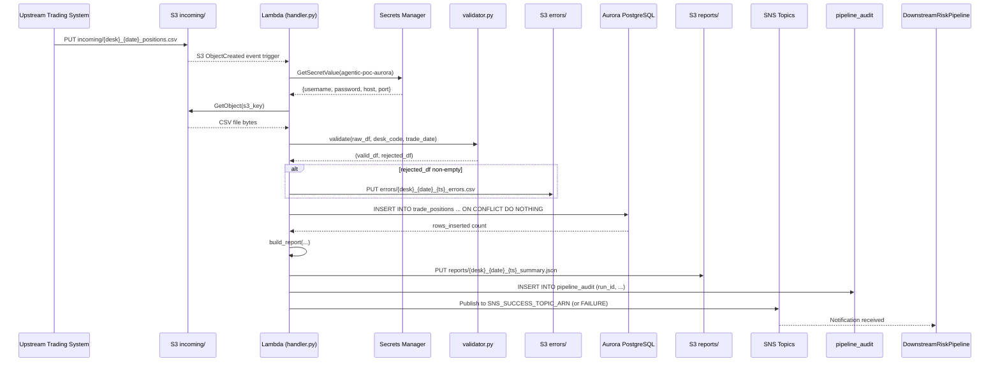
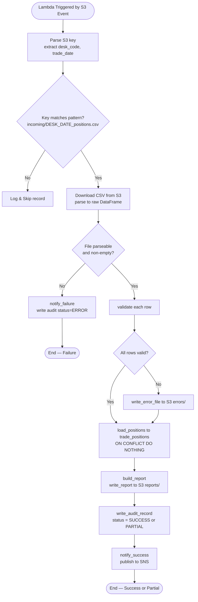
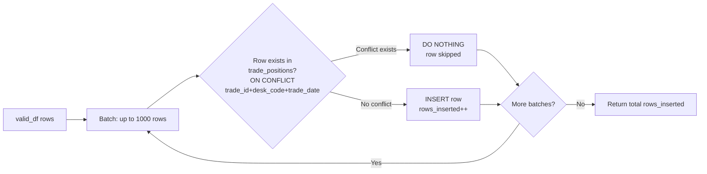

# Technical Design Document

## Daily Trade Position Ingestion Pipeline
**Project:** agentic-poc-sandbox
**Repo:** nartcr/agentic-poc-sandbox
**Change Type:** New Feature
**Date:** June 2026
**Status:** Draft

---

## COMPONENTS

---

### `src/config.py`
**Purpose:** Centralises all environment variable reads and static configuration constants. Every other module imports from here — no `os.environ` calls elsewhere.

**What it does:**
- Reads the following environment variables at import time, raising `KeyError` with a descriptive message if any are missing:
  - `DB_SECRET_ID` (default fallback: `"agentic-poc-aurora"` — still read from env; env var must be set)
  - `S3_BUCKET`
  - `SNS_SUCCESS_TOPIC_ARN`
  - `SNS_FAILURE_TOPIC_ARN`
  - `AWS_REGION`
- Exposes typed constants: `S3_INPUT_PREFIX = "incoming/"`, `S3_ERROR_PREFIX = "errors/"`, `S3_REPORT_PREFIX = "reports/"`, `DB_NAME = "app"`, `DB_SCHEMA = "demo_schema"`, `TIMEZONE = "America/Toronto"`
- Exposes the deduplication key tuple: `DEDUP_COLUMNS = ("trade_id", "desk_code", "trade_date")`
- Exposes mandatory field list: `MANDATORY_FIELDS = ["trade_id", "desk_code", "trade_date", "instrument_type", "notional_amount", "currency", "counterparty_id"]`

**Reads:** Environment variables only.
**Writes:** Nothing.
**Satisfies:** BAC-8 (no secrets in code).

---

### `src/secrets.py`
**Purpose:** Retrieves database credentials from AWS Secrets Manager at runtime and returns a connection string.

**What it does:**
- `get_db_credentials(secret_id: str) -> dict` — calls `boto3.client("secretsmanager").get_secret_value(SecretId=secret_id)`, parses the JSON string, and returns a dict with keys: `username`, `password`, `host`, `port`. Raises `RuntimeError` if the secret cannot be retrieved or parsed.
- `get_db_connection_string(secret_id: str, dbname: str) -> str` — calls `get_db_credentials`, assembles and returns a `postgresql+psycopg2://` SQLAlchemy connection string. Password is URL-encoded. Connection string is never logged.

**Reads:** AWS Secrets Manager secret identified by `secret_id`. Expected JSON keys: `username` (str), `password` (str), `host` (str), `port` (int or str).
**Writes:** Nothing persisted; returns connection string in memory only.
**Satisfies:** BAC-8.

---

### `src/file_reader.py`
**Purpose:** Downloads a single CSV file from S3 and parses it into a raw DataFrame, preserving all columns and original string types for downstream validation.

**What it does:**
- `download_and_parse(s3_client, bucket: str, s3_key: str) -> tuple[pd.DataFrame, int]`
  - Downloads the object at `s3_key` from `bucket` using the provided boto3 S3 client.
  - Parses the CSV using `pandas.read_csv` with `dtype=str` (all columns as strings, no type coercion) and `keep_default_na=False`.
  - Returns `(dataframe, total_row_count)` where `total_row_count = len(dataframe)`.
  - Raises `ValueError` if the file is empty (zero data rows after header).
  - Raises `ValueError` if the CSV cannot be parsed (malformed file).
- `extract_metadata_from_key(s3_key: str) -> tuple[str, str]`
  - Parses `s3_key` to extract `desk_code` and `trade_date` from the filename pattern `incoming/{desk_code}_{trade_date}_positions.csv`.
  - Returns `(desk_code, trade_date)` as strings.
  - Raises `ValueError` if the key does not match the expected pattern `^incoming/([A-Za-z0-9]+)_(\d{4}-\d{2}-\d{2})_positions\.csv$`.

**Reads:** S3 object at `os.environ["S3_BUCKET"]` / `incoming/{desk_code}_{trade_date}_positions.csv`. CSV columns (raw strings): `trade_id`, `desk_code`, `trade_date`, `instrument_type`, `notional_amount`, `currency`, `counterparty_id`, plus any additional columns present in the file.
**Writes:** Nothing to storage. Returns DataFrame in memory.
**Satisfies:** BAC-1, BAC-6.

---

### `src/validator.py`
**Purpose:** Validates each row of the raw DataFrame against field-level rules and splits records into valid and rejected sets.

**What it does:**
- `validate(df: pd.DataFrame, desk_code: str, trade_date: str) -> tuple[pd.DataFrame, pd.DataFrame]`
  - Applies the following checks **in order** for each row (first failing check determines `rejection_reason`):
    1. **Missing mandatory fields:** Any of `trade_id`, `desk_code`, `trade_date`, `instrument_type`, `notional_amount`, `currency`, `counterparty_id` is null, empty string, or whitespace-only → `rejection_reason = "MISSING_FIELD:{field_name}"` (first failing field).
    2. **Trade date format:** `trade_date` column value does not match `YYYY-MM-DD` → `rejection_reason = "INVALID_DATE_FORMAT:trade_date"`.
    3. **Notional amount numeric:** `notional_amount` cannot be cast to `float` after stripping whitespace → `rejection_reason = "INVALID_NUMERIC:notional_amount"`.
    4. **Desk code consistency:** Row's `desk_code` does not match the `desk_code` extracted from the filename → `rejection_reason = "DESK_CODE_MISMATCH"`.
  - Returns `(valid_df, rejected_df)`.
  - `valid_df` has all original columns plus types coerced: `notional_amount` cast to `float`, `trade_date` cast to `datetime.date`.
  - `rejected_df` has all original columns plus a `rejection_reason` (str) column.
  - Both DataFrames have a `row_number` (int) column reflecting the 1-based source row index (row 1 = first data row after header).

**Reads:** Raw DataFrame from `file_reader.py`.
**Writes:** Nothing to storage. Returns two DataFrames in memory.
**Satisfies:** BAC-2.

---

### `src/error_writer.py`
**Purpose:** Writes the rejected-rows DataFrame to S3 as a CSV error file.

**What it does:**
- `write_error_file(s3_client, bucket: str, rejected_df: pd.DataFrame, desk_code: str, trade_date: str, processing_ts: datetime) -> str`
  - If `rejected_df` is empty, does nothing and returns `None`.
  - Serialises `rejected_df` to CSV (including header, including `row_number` and `rejection_reason` columns).
  - Uploads to S3 key: `errors/{desk_code}_{trade_date}_{processing_ts_et_yyyymmddHHMMSS}_errors.csv`
    - Example: `errors/DESKX_2026-06-15_20260615183045_errors.csv`
  - Returns the S3 key string of the written error file.

**Reads:** Rejected DataFrame (columns: all original source columns + `row_number: int` + `rejection_reason: str`).
**Writes:**
```
S3: errors/{desk_code}_{trade_date}_{yyyymmddHHMMSS}_errors.csv
Format: CSV with header
Columns: row_number, trade_id, desk_code, trade_date, instrument_type,
         notional_amount, currency, counterparty_id, rejection_reason
         (plus any additional columns present in source file)
```
**Satisfies:** BAC-2.

---

### `src/loader.py`
**Purpose:** Loads validated trade position rows into `demo_schema.trade_positions` using idempotent upsert logic.

**What it does:**
- `load_positions(engine, valid_df: pd.DataFrame, processing_ts: datetime) -> int`
  - Adds `loaded_at` column to `valid_df` set to `processing_ts` (ET-aware datetime).
  - Executes the following for each batch of up to 1,000 rows (to manage memory for large files):
    ```sql
    INSERT INTO demo_schema.trade_positions
      (trade_id, desk_code, trade_date, instrument_type,
       notional_amount, currency, counterparty_id, loaded_at)
    VALUES (...)
    ON CONFLICT (trade_id, desk_code, trade_date) DO NOTHING
    ```
  - Returns the total count of rows **actually inserted** (i.e., excludes skipped duplicates). This is computed as the sum of `rowcount` from each batch execution.
  - Uses a single database transaction for the full load; rolls back on any exception and re-raises.

**Reads:** `valid_df` columns: `trade_id` (str), `desk_code` (str), `trade_date` (date), `instrument_type` (str), `notional_amount` (float), `currency` (str), `counterparty_id` (str).
**Writes:** Rows into `demo_schema.trade_positions`. See Data Contracts for full schema.
**Satisfies:** BAC-1, BAC-3, BAC-6.

---

### `src/reporter.py`
**Purpose:** Computes the post-load summary statistics and writes a JSON report to S3.

**What it does:**
- `build_report(raw_df: pd.DataFrame, valid_df: pd.DataFrame, rejected_df: pd.DataFrame, rows_inserted: int, desk_code: str, trade_date: str, processing_ts: datetime, error_s3_key: str | None) -> dict`
  - Computes and returns a report dict with the following keys:
    - `desk_code` (str)
    - `trade_date` (str, YYYY-MM-DD)
    - `processing_timestamp` (str, ISO 8601 with ET offset, e.g. `"2026-06-15T18:30:45-04:00"`)
    - `total_rows_received` (int): `len(raw_df)`
    - `rows_validated` (int): `len(valid_df)`
    - `rows_inserted` (int): actual DB insert count (from `loader.py`)
    - `rows_skipped_duplicate` (int): `len(valid_df) - rows_inserted`
    - `rows_rejected` (int): `len(rejected_df)`
    - `by_desk_code` (dict): count of valid rows grouped by `desk_code` value
    - `notional_min` (float | None): `valid_df["notional_amount"].min()` or `None` if empty
    - `notional_max` (float | None): `valid_df["notional_amount"].max()` or `None` if empty
    - `null_rates` (dict): per-column null/empty rate across `raw_df` — `{column_name: float}` where float is fraction 0.0–1.0 (empty string and whitespace-only treated as null)
    - `error_file_s3_key` (str | None): S3 key of error file, or `None`
    - `status` (str): `"SUCCESS"` if `rows_rejected == 0` else `"PARTIAL"` (see Open Questions — assumed PARTIAL if any rejections)

- `write_report(s3_client, bucket: str, report: dict, desk_code: str, trade_date: str, processing_ts: datetime) -> str`
  - Serialises `report` as JSON (indent=2) and uploads to:
    `reports/{desk_code}_{trade_date}_{yyyymmddHHMMSS}_summary.json`
  - Returns the S3 key string.

**Reads:** DataFrames from validator, rows_inserted from loader, metadata from file_reader.
**Writes:**
```
S3: reports/{desk_code}_{trade_date}_{yyyymmddHHMMSS}_summary.json
Format: JSON, indent=2
```
**Satisfies:** BAC-4, BAC-7.

---

### `src/notifier.py`
**Purpose:** Publishes SNS notifications to downstream systems on success or failure.

**What it does:**
- `notify_success(sns_client, topic_arn: str, report: dict) -> None`
  - Publishes to `topic_arn` with:
    - `Subject`: `"TRADE_POSITIONS_LOADED: {desk_code} {trade_date}"`
    - `Message`: JSON-serialised payload (see SNS schema in Data Contracts)
  - Logs the SNS message ID at INFO level.

- `notify_failure(sns_client, topic_arn: str, desk_code: str, trade_date: str, error_message: str, processing_ts: datetime) -> None`
  - Publishes to `topic_arn` with:
    - `Subject`: `"TRADE_POSITIONS_FAILED: {desk_code} {trade_date}"`
    - `Message`: JSON-serialised failure payload (see SNS schema in Data Contracts)
  - Logs the SNS message ID at INFO level.

**Reads:** Report dict from `reporter.py`.
**Writes:** SNS messages to `os.environ["SNS_SUCCESS_TOPIC_ARN"]` or `os.environ["SNS_FAILURE_TOPIC_ARN"]`.
**Satisfies:** BAC-5.

---

### `src/audit.py`
**Purpose:** Writes a row to `demo_schema.pipeline_audit` capturing the full processing outcome of each file run, supporting regulatory audit trail requirements.

**What it does:**
- `write_audit_record(engine, audit_row: dict) -> None`
  - Executes:
    ```sql
    INSERT INTO demo_schema.pipeline_audit
      (run_id, s3_key, desk_code, trade_date, processing_timestamp,
       status, total_rows, rows_inserted, rows_rejected, rows_skipped_duplicate,
       report_s3_key, error_s3_key, service_identity)
    VALUES (...)
    ```
  - `run_id` is a UUID4 generated at pipeline start (passed in `audit_row`).
  - `service_identity` is read from `os.environ["SERVICE_IDENTITY"]` (e.g., Lambda function name or ECS task ID).
  - Does **not** use ON CONFLICT — each processing run produces exactly one audit row, even for reprocessed files.
  - Commits immediately (not part of the loader transaction).

**Reads:** `audit_row` dict with keys: `run_id`, `s3_key`, `desk_code`, `trade_date`, `processing_timestamp`, `status`, `total_rows`, `rows_inserted`, `rows_rejected`, `rows_skipped_duplicate`, `report_s3_key`, `error_s3_key`, `service_identity`.
**Writes:** One row into `demo_schema.pipeline_audit`. See Data Contracts for full schema.
**Satisfies:** BAC-7 (regulatory audit trail).

---

### `src/pipeline.py`
**Purpose:** Orchestrates the end-to-end pipeline for a single file. This is the main entry point called by the Lambda handler.

**What it does:**
- `run_pipeline(s3_key: str) -> dict`
  1. Records `processing_ts` = current time in `America/Toronto` timezone.
  2. Generates `run_id` = `uuid.uuid4()`.
  3. Initialises boto3 clients: `s3_client`, `sns_client`.
  4. Retrieves DB connection string via `secrets.get_db_connection_string(DB_SECRET_ID, DB_NAME)` and creates a SQLAlchemy engine.
  5. Calls `file_reader.extract_metadata_from_key(s3_key)` → `(desk_code, trade_date)`.
  6. Calls `file_reader.download_and_parse(s3_client, S3_BUCKET, s3_key)` → `(raw_df, total_rows)`.
  7. Calls `validator.validate(raw_df, desk_code, trade_date)` → `(valid_df, rejected_df)`.
  8. Calls `error_writer.write_error_file(...)` → `error_s3_key` (or `None`).
  9. Calls `loader.load_positions(engine, valid_df, processing_ts)` → `rows_inserted`.
  10. Calls `reporter.build_report(...)` → `report`.
  11. Calls `reporter.write_report(...)` → `report_s3_key`.
  12. Calls `audit.write_audit_record(engine, audit_row)`.
  13. Calls `notifier.notify_success(sns_client, SNS_SUCCESS_TOPIC_ARN, report)`.
  14. Returns `report`.
  - On **any unhandled exception** at steps 5–13: catches the exception, calls `notifier.notify_failure(sns_client, SNS_FAILURE_TOPIC_ARN, desk_code, trade_date, str(exception), processing_ts)`, writes an audit record with `status="ERROR"`, logs the exception with traceback, and re-raises.
  - All logging uses the `logging` module at appropriate levels (INFO for progress, WARNING for rejected rows, ERROR for exceptions). No `print()` calls.

**Reads:** `s3_key` string (passed from Lambda event).
**Writes:** Delegates to all other modules; returns final report dict.
**Satisfies:** BAC-1 through BAC-8 (orchestration).

---

### `src/handler.py`
**Purpose:** AWS Lambda entry point. Parses the S3 event trigger and invokes `pipeline.run_pipeline` for each file in the event.

**What it does:**
- `lambda_handler(event: dict, context) -> dict`
  - Parses the incoming S3 event: iterates over `event["Records"]`, extracts `s3.bucket.name` and `s3.object.key` (URL-decoded) from each record.
  - Validates that `s3.object.key` starts with `incoming/` and ends with `_positions.csv`. Logs and skips records that do not match.
  - For each valid record, calls `pipeline.run_pipeline(s3_key)`.
  - Returns `{"statusCode": 200, "processed": [list of s3_keys processed]}` on full success.
  - If any pipeline run raises an exception, logs the error and continues processing remaining records (partial success). Returns `{"statusCode": 207, "processed": [...], "failed": [...]}`.

**Reads:** S3 event payload from Lambda invocation.
**Writes:** Nothing directly; delegates to `pipeline.py`.
**Satisfies:** BAC-5 (automated trigger), BAC-6.

---

### `src/db_init.py`
**Purpose:** One-time DDL script (not part of the runtime pipeline) that creates the required database tables if they do not exist.

**What it does:**
- `create_tables(engine) -> None`
  - Executes `CREATE TABLE IF NOT EXISTS demo_schema.trade_positions (...)` with full schema per Data Contracts.
  - Executes `CREATE TABLE IF NOT EXISTS demo_schema.pipeline_audit (...)` with full schema per Data Contracts.
  - Idempotent — safe to re-run.
- `main()` — reads DB credentials via `secrets.get_db_connection_string`, creates engine, calls `create_tables`.

**Reads:** DB credentials from Secrets Manager.
**Writes:** DDL to database (table creation only).
**Satisfies:** Prerequisite for all BACs.

---

### `tests/test_validator.py`, `tests/test_loader.py`, `tests/test_reporter.py`, `tests/test_pipeline.py`
**Purpose:** Unit and integration tests verifying each TAC. See Technical Acceptance Criteria for specific assertions each test must cover.

---

## AWS SERVICES

| Service | Role |
|---|---|
| **Amazon S3** | Stores incoming position files (`incoming/` prefix), error files (`errors/` prefix), and summary reports (`reports/` prefix). Lambda is triggered by S3 `ObjectCreated` events on the `incoming/` prefix. |
| **AWS Lambda** | Compute platform. The function `agentic-poc-sandbox-qa` is the entry point triggered by S3 events. Executes the full pipeline per file within the invocation. |
| **Amazon RDS Aurora (PostgreSQL)** | Target reporting database (`app` / `demo_schema`). Hosts `trade_positions` and `pipeline_audit` tables. Credentials stored in Secrets Manager. |
| **AWS Secrets Manager** | Stores database credentials under secret ID `agentic-poc-aurora`. Retrieved at runtime; never in code. |
| **Amazon SNS** | Delivers success and failure notifications to downstream subscribers (risk calculation pipeline). Two topics: success and failure, referenced via environment variables. |
| **AWS IAM** | Lambda execution role grants least-privilege permissions: S3 read/write on `agentic-poc-data-533266968934`, Secrets Manager `GetSecretValue` on `agentic-poc-aurora`, SNS `Publish` on both notification topics, RDS connectivity. |

---

## DATA CONTRACTS

### Database Tables

#### `demo_schema.trade_positions`

```
Table: demo_schema.trade_positions

Column              Data Type                   Constraints
──────────────────────────────────────────────────────────────────────
trade_id            VARCHAR(100)                NOT NULL
desk_code           VARCHAR(50)                 NOT NULL
trade_date          DATE                        NOT NULL
instrument_type     VARCHAR(100)                NOT NULL
notional_amount     NUMERIC(28, 8)              NOT NULL
currency            VARCHAR(10)                 NOT NULL
counterparty_id     VARCHAR(100)                NOT NULL
loaded_at           TIMESTAMP WITH TIME ZONE    NOT NULL

Primary Key:        (trade_id, desk_code, trade_date)   -- enforces dedup
Unique Constraint:  (trade_id, desk_code, trade_date)   -- same as PK; explicit for ON CONFLICT target
Index:              idx_trade_positions_desk_date ON (desk_code, trade_date)
```

#### `demo_schema.pipeline_audit`

```
Table: demo_schema.pipeline_audit

Column                  Data Type                   Constraints
──────────────────────────────────────────────────────────────────────
run_id                  UUID                        NOT NULL, PRIMARY KEY
s3_key                  VARCHAR(500)                NOT NULL
desk_code               VARCHAR(50)                 NOT NULL
trade_date              DATE                        NOT NULL
processing_timestamp    TIMESTAMP WITH TIME ZONE    NOT NULL
status                  VARCHAR(20)                 NOT NULL  -- 'SUCCESS', 'PARTIAL', 'ERROR'
total_rows              INTEGER                     NOT NULL
rows_inserted           INTEGER                     NOT NULL
rows_rejected           INTEGER                     NOT NULL
rows_skipped_duplicate  INTEGER                     NOT NULL
report_s3_key           VARCHAR(500)                NULL
error_s3_key            VARCHAR(500)                NULL
service_identity        VARCHAR(200)                NOT NULL

Primary Key:    run_id
Index:          idx_pipeline_audit_desk_date ON (desk_code, trade_date)
Index:          idx_pipeline_audit_ts ON (processing_timestamp)
```

---

### S3 Paths

```
Bucket (env var): os.environ["S3_BUCKET"]
Actual bucket:    agentic-poc-data-533266968934

┌──────────────────────────────────────────────────────────────────────────────────────────┐
│ PREFIX         │ KEY PATTERN                                             │ FORMAT         │
├────────────────┼─────────────────────────────────────────────────────────┼────────────────┤
│ incoming/      │ incoming/{desk_code}_{trade_date}_positions.csv         │ CSV with header│
│                │   e.g. incoming/DESKX_2026-06-15_positions.csv          │                │
│                │   trade_date format: YYYY-MM-DD                         │                │
│                │   desk_code: alphanumeric, no underscores               │                │
├────────────────┼─────────────────────────────────────────────────────────┼────────────────┤
│ errors/        │ errors/{desk_code}_{trade_date}_{yyyymmddHHMMSS}        │ CSV with header│
│                │   _errors.csv                                            │                │
│                │   e.g. errors/DESKX_2026-06-15_20260615183045_errors.csv│                │
│                │   Columns: row_number, trade_id, desk_code, trade_date, │                │
│                │   instrument_type, notional_amount, currency,           │                │
│                │   counterparty_id, rejection_reason                     │                │
├────────────────┼─────────────────────────────────────────────────────────┼────────────────┤
│ reports/       │ reports/{desk_code}_{trade_date}_{yyyymmddHHMMSS}       │ JSON (indent=2)│
│                │   _summary.json                                          │                │
│                │   e.g. reports/DESKX_2026-06-15_20260615183045          │                │
│                │   _summary.json                                          │                │
└──────────────────────────────────────────────────────────────────────────────────────────┘

Input CSV expected columns (header row required):
  trade_id, desk_code, trade_date, instrument_type,
  notional_amount, currency, counterparty_id
  (additional columns permitted; preserved in error file)
```

---

### Secrets Manager

```
Env var:    os.environ["DB_SECRET_ID"]
Secret ID:  agentic-poc-aurora

Expected JSON structure:
{
  "username": "<db_username>",
  "password": "<db_password>",
  "host":     "<aurora_cluster_endpoint>",
  "port":     5432
}
```

---

### SNS Messages

```
Success Topic:  os.environ["SNS_SUCCESS_TOPIC_ARN"]
Failure Topic:  os.environ["SNS_FAILURE_TOPIC_ARN"]

─── Success Message Payload (JSON) ───────────────────────────────────────
{
  "event_type":             "TRADE_POSITIONS_LOADED",
  "desk_code":              "<str>",
  "trade_date":             "<YYYY-MM-DD>",
  "processing_timestamp":   "<ISO8601 with ET offset>",
  "total_rows_received":    <int>,
  "rows_inserted":          <int>,
  "rows_skipped_duplicate": <int>,
  "rows_rejected":          <int>,
  "status":                 "SUCCESS" | "PARTIAL",
  "report_s3_key":          "<str>"
}

─── Failure Message Payload (JSON) ────────────────────────────────────────
{
  "event_type":             "TRADE_POSITIONS_FAILED",
  "desk_code":              "<str> or UNKNOWN",
  "trade_date":             "<YYYY-MM-DD> or UNKNOWN",
  "processing_timestamp":   "<ISO8601 with ET offset>",
  "error_message":          "<str>",
  "s3_key":                 "<str>"
}
```

---

### Environment Variables (Complete List)

| Variable | Source | Description |
|---|---|---|
| `DB_SECRET_ID` | Deployment config | Secrets Manager secret ID (`agentic-poc-aurora`) |
| `S3_BUCKET` | Deployment config | S3 bucket name (`agentic-poc-data-533266968934`) |
| `SNS_SUCCESS_TOPIC_ARN` | Deployment config | ARN of SNS topic for success notifications |
| `SNS_FAILURE_TOPIC_ARN` | Deployment config | ARN of SNS topic for failure notifications |
| `AWS_REGION` | Lambda runtime / deployment | AWS region for boto3 clients |
| `SERVICE_IDENTITY` | Deployment config | Identity string for audit trail (e.g. Lambda function name) |

---

## DATA FLOW

### End-to-End Pipeline Flow



---

### Pipeline Decision Logic (Flowchart)



---

### Validation Logic (Per-Row Algorithm)

```
Algorithm: validate_row(row, desk_code_from_filename)

FOR each field IN [trade_id, desk_code, trade_date, instrument_type,
                   notional_amount, currency, counterparty_id]:
    IF row[field] is NULL OR strip(row[field]) == "":
        RETURN rejection_reason = "MISSING_FIELD:{field}"

IF row["trade_date"] does NOT match regex ^\d{4}-\d{2}-\d{2}$:
    RETURN rejection_reason = "INVALID_DATE_FORMAT:trade_date"

TRY float(strip(row["notional_amount"]))
    IF raises ValueError:
        RETURN rejection_reason = "INVALID_NUMERIC:notional_amount"

IF strip(row["desk_code"]) != desk_code_from_filename:
    RETURN rejection_reason = "DESK_CODE_MISMATCH"

RETURN valid  (coerce notional_amount to float, trade_date to date)
```

---

### Idempotent Load (Deduplication)



---

## TECHNICAL ACCEPTANCE CRITERIA

**TAC-1: Valid positions loaded before next morning's risk run**
- Mechanism: `loader.load_positions` executes within the Lambda invocation triggered by the S3 event. The Lambda timeout must be set to ≥ 60 seconds (per BAC-6). Acceptance test: insert a 10,000-row file, assert that `demo_schema.trade_positions` contains all valid rows and `pipeline_audit.status` is `SUCCESS` or `PARTIAL` within 60 seconds of file upload.
- Verified by: querying `SELECT COUNT(*) FROM demo_schema.trade_positions WHERE desk_code = :desk AND trade_date = :date` equals `rows_inserted` from the audit record.

**TAC-2: Invalid records flagged with specific rejection reasons**
- Mechanism: `validator.validate()` produces `rejected_df` with `rejection_reason` column populated with one of: `MISSING_FIELD:{field_name}`, `INVALID_DATE_FORMAT:trade_date`, `INVALID_NUMERIC:notional_amount`, `DESK_CODE_MISMATCH`. `error_writer.write_error_file()` uploads this to `errors/{desk}_{date}_{ts}_errors.csv`.
- Verified by: unit test that feeds rows with known defects (each defect type) and asserts the exact `rejection_reason` string; integration test that confirms the error CSV is present in S3 at the expected key and contains the correct `row_number` and `rejection_reason` for each rejected row.

**TAC-3: Reprocessing the same file does not create duplicate records**
- Mechanism: `INSERT INTO demo_schema.trade_positions ... ON CONFLICT (trade_id, desk_code, trade_date) DO NOTHING`. The unique constraint is defined at the database level (not only in application code).
- Verified by: integration test that calls `run_pipeline(s3_key)` twice with identical input; asserts `SELECT COUNT(*) FROM demo_schema.trade_positions WHERE desk_code=:d AND trade_date=:t` returns the same value both times; asserts `rows_skipped_duplicate > 0` on the second run's audit record.

**TAC-4: Summary report accurately reflects received, accepted, and rejected counts**
- Mechanism: `reporter.build_report()` computes `total_rows_received = len(raw_df)`, `rows_validated = len(valid_df)`, `rows_rejected = len(rejected_df)`. These three must satisfy `total_rows_received == rows_validated + rows_rejected`. Report is written to `reports/` prefix as JSON.
- Verified by: unit test asserting the arithmetic invariant `total == valid + rejected` across multiple test cases; integration test confirming the JSON file exists in S3 and all count fields match database state.

**TAC-5: Downstream pipeline notified automatically — no manual trigger**
- Mechanism: `notifier.notify_success()` is called unconditionally at the end of every successful `run_pipeline()` invocation. `notifier.notify_failure()` is called in the exception handler. Both publish to SNS topics referenced via `SNS_SUCCESS_TOPIC_ARN` / `SNS_FAILURE_TOPIC_ARN`.
- Verified by: unit test using a mocked SNS client asserting `publish()` is called exactly once with the correct `TopicArn` and a JSON `Message` body containing `event_type = "TRADE_POSITIONS_LOADED"` (or `"TRADE_POSITIONS_FAILED"`); integration test confirming message is delivered to the subscribed endpoint.

**TAC-6: Processing completes within 60 seconds for 10,000-row file**
- Mechanism: `run_pipeline()` is called with a 10,000-row input. Timer starts before the call and stops after return.
- Verified by: performance test asserting elapsed wall-clock time ≤ 60 seconds; also verified by Lambda timeout configuration ≥ 60 seconds and monitoring of Lambda duration metric. Load batching (1,000 rows per batch) ensures no single DB call exceeds parameterisation limits.

**TAC-7: All timestamps in Eastern Time (America/Toronto)**
- Mechanism: `processing_ts = datetime.now(pytz.timezone("America/Toronto"))` set at the start of `run_pipeline()`. This value is propagated to: `loaded_at` column in `trade_positions`, `processing_timestamp` in `pipeline_audit` (stored as `TIMESTAMP WITH TIME ZONE`), `processing_timestamp` field in the JSON report, `processing_timestamp` in SNS message payload. No UTC timestamps appear in any output.
- Verified by: unit test asserting `processing_ts.tzinfo` resolves to `America/Toronto`; integration test asserting the `loaded_at` and `processing_timestamp` columns in the database contain timezone-aware values and the UTC offset matches Eastern Time (−05:00 or −04:00 depending on DST).

**TAC-8: No secrets in code or configuration files**
- Mechanism: `secrets.get_db_credentials()` calls `boto3.client("secretsmanager").get_secret_value()` using `DB_SECRET_ID` from environment variable. No passwords, tokens, or connection strings appear anywhere in source code or committed config files.
- Verified by: static analysis (grep/regex scan of the entire codebase for patterns matching passwords, connection strings, or AWS credentials); unit test confirming `get_db_connection_string()` raises `RuntimeError` when the Secrets Manager call is mocked to fail; security audit assertion that all secrets are retrieved exclusively through `secrets.py`.

---

## OPEN QUESTIONS

**OQ-1: Report `status` field when some rows are rejected but others load successfully**
The BRD does not define whether a file with mixed valid/rejected rows should produce a status of `"PARTIAL"` or whether the SNS notification should still go to the success topic or the failure topic. This design assumes `"PARTIAL"` status and routes to the **success** SNS topic (since the load did complete — just not for all rows). **The operations team must confirm:** should a file with any rejections route to the failure topic instead? This affects downstream pipeline triggering behaviour.

**OQ-2: desk_code constraint — underscores permitted?**
The filename pattern is `{desk_code}_{trade_date}_positions.csv`. The regex in `file_reader.extract_metadata_from_key` uses `[A-Za-z0-9]+` (no underscores) for `desk_code` to unambiguously split on the first underscore before the date. If desk codes can contain underscores (e.g., `DESK_A`), the parsing logic must be redesigned. **Confirm whether desk codes are guaranteed to contain no underscores.**

---

## ASSUMPTIONS

| # | Assumption | Impact if Wrong |
|---|---|---|
| A-1 | The Lambda function `agentic-poc-sandbox-qa` is configured with an S3 trigger on the bucket `agentic-poc-data-533266968934` for the `incoming/` prefix with event type `s3:ObjectCreated:*`. | Pipeline will not trigger automatically; manual invocation required. |
| A-2 | Two SNS topics exist and their ARNs are injected as environment variables `SNS_SUCCESS_TOPIC_ARN` and `SNS_FAILURE_TOPIC_ARN` into the Lambda function. | `notifier.py` will fail at runtime; BAC-5 cannot be satisfied. |
| A-3 | The Aurora cluster is network-accessible from the Lambda execution environment (same VPC, or VPC peering, with appropriate security group rules). | DB connections will fail; no data will be written. |
| A-4 | The Secrets Manager secret `agentic-poc-aurora` contains exactly the keys `username`, `password`, `host`, `port`. | `secrets.py` will raise `KeyError` at runtime. |
| A-5 | `desk_code` values in filenames are alphanumeric only (no underscores, no hyphens). This is required for deterministic filename parsing. | `extract_metadata_from_key` will misparse the desk code; validation will reject all rows due to `DESK_CODE_MISMATCH`. |
| A-6 | Files deposited in `incoming/` will always have a UTF-8 encoded CSV with a header row. Non-UTF-8 files are not expected. | `file_reader.download_and_parse` may raise a `UnicodeDecodeError`; caught by the exception handler and routed to failure notification. |
| A-7 | The `demo_schema` schema already exists in the `app` database. `db_init.py` creates tables within it but does not create the schema itself. | `CREATE TABLE IF NOT EXISTS demo_schema.trade_positions` will fail with a schema-not-found error. |
| A-8 | Files in `incoming/` represent one trading desk per file, and the `desk_code` in every data row must match the `desk_code` in the filename. Rows with a different `desk_code` in the data are treated as validation errors (`DESK_CODE_MISMATCH`). | If cross-desk files are intentionally mixed, all rows for the "other" desk will be rejected. |
| A-9 | A file with zero valid rows (all rejected) still completes the pipeline successfully from an operational standpoint — an error file is written, audit is recorded with `status="PARTIAL"`, and the success SNS topic is notified (with `rows_inserted=0`). The failure topic is reserved for unhandled exceptions only. | If the business expects zero-valid-row files to trigger the failure topic, notification routing must change. |
| A-10 | Lambda memory and timeout are pre-configured at deployment. The design assumes at minimum 512 MB memory and 120-second timeout to meet the 60-second BAC-6 requirement with margin. | Performance test (TAC-6) may fail if Lambda timeout is set lower than 60 seconds. |
| A-11 | `SERVICE_IDENTITY` environment variable is set on the Lambda function to a meaningful identifier (e.g., the Lambda function name) for regulatory audit purposes. | `audit.py` will raise `KeyError` at startup; audit records will not be written. |
| A-12 | The database column type `NUMERIC(28, 8)` is sufficient for all expected notional amounts. | Overflow or precision errors on very large notional values at DB insert time. |
| A-13 | Re-processing a file (same `desk_code` + `trade_date`) is a supported and expected scenario (corrected file resubmission). Each reprocessing run produces a new `pipeline_audit` row with a new `run_id`. The `trade_positions` table deduplicates at the row level via the composite key. | If the business expects old records to be deleted and replaced on resubmission (full replace vs. skip), the loader logic must be changed to `ON CONFLICT ... DO UPDATE`. |