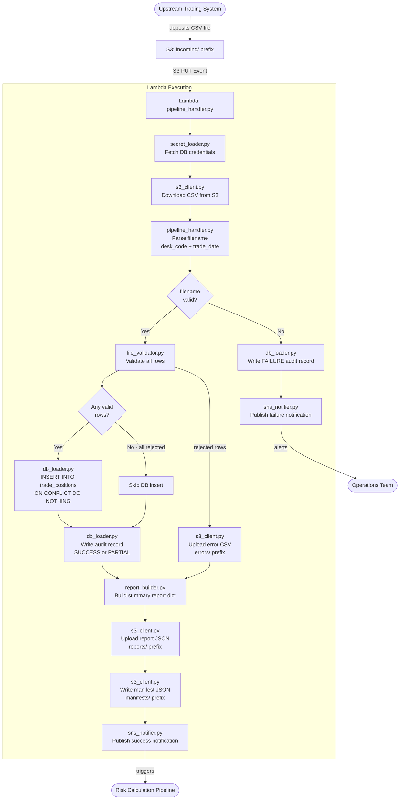
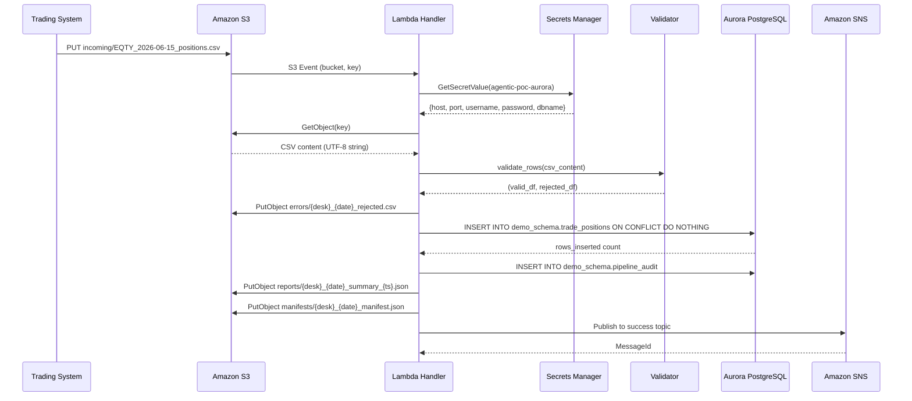
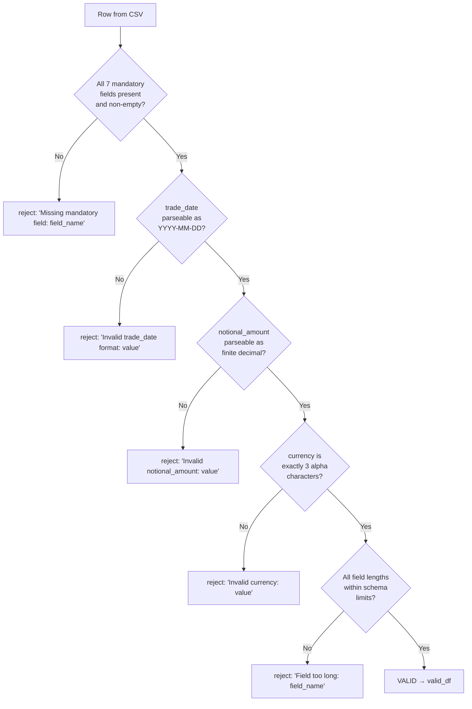

# Technical Design Document

## Daily Trade Position Ingestion Pipeline

**Project:** agentic-poc-sandbox
**Repo:** nartcr/agentic-poc-sandbox
**Team:** Sample Trade Operations
**Date:** June 2026
**Status:** Draft

---

## COMPONENTS

### `pipeline_handler.py` — Lambda Entry Point and Orchestrator

**What it does:**
Main Lambda handler function. Receives an S3 event trigger (PUT to `incoming/` prefix), extracts the S3 key and bucket from the event, and orchestrates the full pipeline: file download → validation → DB load → report generation → S3 report upload → SNS notification. Catches all unhandled exceptions and dispatches a failure SNS notification with error details. Writes one row to `demo_schema.pipeline_audit` at the end of each pipeline execution regardless of outcome.

**Signature:**
```
def handler(event: dict, context: object) -> dict
def _extract_s3_event(event: dict) -> tuple[str, str]  # returns (bucket, key)
def _parse_filename(key: str) -> tuple[str, str]  # returns (desk_code, trade_date_str); raises ValueError if pattern mismatch
```

**What it reads:**
- S3 event payload: `event["Records"][0]["s3"]["bucket"]["name"]`, `event["Records"][0]["s3"]["object"]["key"]`
- Filename pattern: `{desk_code}_{trade_date}_positions.csv` (e.g. `EQTY_2026-06-15_positions.csv`)

**What it writes:**
- Delegates writes to `db_loader.py`, `report_builder.py`, `s3_client.py`, `sns_notifier.py`
- Returns `{"statusCode": 200, "body": "OK"}` on success; `{"statusCode": 500, "body": "<error>"}` on failure

**Satisfies:** BAC-1, BAC-4, BAC-5, BAC-6, BAC-7

---

### `secret_loader.py` — Secrets Manager Client

**What it does:**
Retrieves the database credentials JSON from AWS Secrets Manager using the secret ID `agentic-poc-aurora`. Caches the result in-process to avoid repeated API calls within a single Lambda invocation. Returns a `dict` with keys `host`, `port`, `username`, `password`, `dbname`.

**Signatures:**
```
def get_db_secret() -> dict  # reads os.environ["DB_SECRET_ID"], returns parsed JSON dict
```

**What it reads:**
- `os.environ["DB_SECRET_ID"]` → secret ID `"agentic-poc-aurora"`
- Secrets Manager JSON keys: `host`, `port`, `username`, `password`, `dbname`

**What it writes:** Nothing (read-only, in-memory cache)

**Satisfies:** BAC-8

---

### `file_validator.py` — Row-Level Validation Engine

**What it does:**
Reads a CSV file content (as a string or `io.StringIO`) and validates every row against the mandatory field rules. Returns two `pandas.DataFrame` objects: one for valid rows, one for rejected rows. The rejected DataFrame includes an additional column `rejection_reason` describing the first failing rule for that row.

**Validation rules applied in order:**
1. All seven mandatory fields present and non-empty: `trade_id`, `desk_code`, `trade_date`, `instrument_type`, `notional_amount`, `currency`, `counterparty_id`
2. `trade_date` parseable as `YYYY-MM-DD`
3. `notional_amount` parseable as a finite decimal number (not NaN, not infinite)
4. `currency` is exactly 3 characters (alpha)
5. `trade_id` length ≤ 100, `desk_code` length ≤ 50, `instrument_type` length ≤ 100, `counterparty_id` length ≤ 100

**Signatures:**
```
def validate_rows(csv_content: str, expected_desk_code: str, expected_trade_date: str) -> tuple[pd.DataFrame, pd.DataFrame]
# Returns (valid_df, rejected_df)
# valid_df columns: trade_id, desk_code, trade_date, instrument_type, notional_amount, currency, counterparty_id
# rejected_df columns: all input columns + rejection_reason
```

**What it reads:** Raw CSV string (from S3 object body)

**What it writes:** Two DataFrames (in memory); rejected DataFrame written to S3 via `s3_client.py`

**Satisfies:** BAC-2

---

### `db_loader.py` — Database Insertion Module

**What it does:**
Receives a validated `pandas.DataFrame`, connects to Aurora PostgreSQL using credentials from `secret_loader.get_db_secret()`, and executes a bulk `INSERT INTO demo_schema.trade_positions (...) VALUES ... ON CONFLICT (trade_id, desk_code, trade_date) DO NOTHING`. Returns the count of rows actually inserted (via `cursor.rowcount` after `executemany` or via a `RETURNING` count). Uses `psycopg2` with a single transaction per file.

**Signatures:**
```
def load_positions(valid_df: pd.DataFrame) -> int
# Returns count of rows inserted (excludes skipped duplicates)

def write_audit_record(
    filename: str,
    desk_code: str | None,
    trade_date: str | None,
    status: str,          # "SUCCESS" | "FAILURE" | "PARTIAL"
    total_rows: int,
    rows_inserted: int,
    rows_rejected: int,
    error_message: str | None,
    processing_timestamp_et: datetime
) -> None
```

**What it reads:**
- `valid_df` with columns: `trade_id`, `desk_code`, `trade_date`, `instrument_type`, `notional_amount`, `currency`, `counterparty_id`
- DB credentials from `secret_loader.get_db_secret()`

**What it writes:**
- `demo_schema.trade_positions`: inserts rows, skips duplicates on `(trade_id, desk_code, trade_date)` conflict
- `demo_schema.pipeline_audit`: one row per pipeline execution

**SQL (exact INSERT pattern):**
```sql
INSERT INTO demo_schema.trade_positions
  (trade_id, desk_code, trade_date, instrument_type, notional_amount, currency, counterparty_id)
VALUES %s
ON CONFLICT (trade_id, desk_code, trade_date) DO NOTHING
```

**Satisfies:** BAC-1, BAC-3, BAC-7

---

### `report_builder.py` — Summary Report Generator

**What it does:**
Receives the valid DataFrame, rejected DataFrame, filename, desk_code, trade_date, processing timestamp (ET), and rows_inserted count. Computes the full summary report as a Python `dict` and serializes it to a formatted JSON string. The report dict structure is defined in DATA CONTRACTS.

**Signatures:**
```
def build_report(
    filename: str,
    desk_code: str,
    trade_date: str,
    valid_df: pd.DataFrame,
    rejected_df: pd.DataFrame,
    rows_inserted: int,
    processing_timestamp_et: datetime
) -> dict
# Returns the report as a Python dict (caller serializes to JSON)
```

**What it reads:**
- `valid_df` and `rejected_df` DataFrames
- `processing_timestamp_et` as `datetime` object with `America/Toronto` tzinfo

**What it writes:**
- Returns `dict` with keys defined in DATA CONTRACTS → SNS / S3 Report schema

**Metrics computed:**
- `total_rows_received`: `len(valid_df) + len(rejected_df)`
- `rows_successfully_loaded`: `rows_inserted` (actual DB inserts, not just valid)
- `rows_rejected`: `len(rejected_df)`
- `rows_skipped_duplicate`: `len(valid_df) - rows_inserted`
- `processing_timestamp_et`: ISO-8601 string in ET
- `desk_breakdown`: `{desk_code: count}` grouped from valid_df
- `notional_min`: `float(valid_df["notional_amount"].min())` if valid rows exist, else `null`
- `notional_max`: `float(valid_df["notional_amount"].max())` if valid rows exist, else `null`
- `null_rates`: per-column null rate across all rows (valid + rejected combined, before splitting), as `{column_name: float_0_to_1}`

**Satisfies:** BAC-4, BAC-7

---

### `s3_client.py` — S3 Read/Write Module

**What it does:**
Provides functions to (1) download a file from S3 as a string, (2) upload a string/bytes to S3 at a given key, and (3) write a manifest JSON to `manifests/` prefix. All S3 operations use `os.environ["S3_BUCKET"]` as the bucket name. Uses `boto3.client("s3")`.

**Signatures:**
```
def download_file(bucket: str, key: str) -> str
# Returns decoded UTF-8 string of S3 object body

def upload_file(bucket: str, key: str, content: str, content_type: str = "text/csv") -> None
# Uploads string content to S3 at given key

def write_manifest(bucket: str, manifest_key: str, manifest: dict) -> None
# Serializes manifest dict to JSON and uploads to manifests/ prefix
```

**What it reads:** S3 object at `incoming/{desk_code}_{trade_date}_positions.csv`

**What it writes:**
- Error file: `errors/{desk_code}_{trade_date}_rejected.csv`
- Report file: `reports/{desk_code}_{trade_date}_summary_{timestamp_et}.json` where `timestamp_et` is `YYYYMMDDTHHMMSS` in ET
- Manifest: `manifests/{desk_code}_{trade_date}_manifest.json`

**Satisfies:** BAC-2, BAC-4

---

### `sns_notifier.py` — SNS Notification Publisher

**What it does:**
Publishes success or failure notifications to the appropriate SNS topic. Uses `boto3.client("sns")`. Reads topic ARNs from environment variables `SNS_SUCCESS_TOPIC_ARN` and `SNS_FAILURE_TOPIC_ARN`.

**Signatures:**
```
def notify_success(report: dict) -> None
# Publishes report dict as JSON to os.environ["SNS_SUCCESS_TOPIC_ARN"]

def notify_failure(filename: str, error_message: str, processing_timestamp_et: datetime) -> None
# Publishes failure payload as JSON to os.environ["SNS_FAILURE_TOPIC_ARN"]
```

**What it reads:**
- `os.environ["SNS_SUCCESS_TOPIC_ARN"]`
- `os.environ["SNS_FAILURE_TOPIC_ARN"]`

**What it writes:**
- SNS message to success topic (success path)
- SNS message to failure topic (failure path)

**Satisfies:** BAC-5

---

### `timestamp_helper.py` — Eastern Time Utilities

**What it does:**
Provides a single function that returns the current datetime localized to `America/Toronto`. Used by all modules that record timestamps. Ensures all timestamps in the system are in ET regardless of Lambda execution timezone.

**Signatures:**
```
def now_et() -> datetime
# Returns datetime.now(pytz.timezone("America/Toronto"))

def to_et_string(dt: datetime) -> str
# Returns ISO-8601 formatted string of a datetime localized to ET
# e.g. "2026-06-15T19:34:22-04:00"
```

**Satisfies:** BAC-7

---

## AWS SERVICES

| Service | Role |
|---|---|
| **AWS Lambda** | Compute host for the pipeline. Function `agentic-poc-sandbox-qa` is triggered by S3 PUT events on the `incoming/` prefix. |
| **Amazon S3** | Durable storage for: input position files (`incoming/`), rejected row error files (`errors/`), summary report JSON files (`reports/`), manifest JSON files (`manifests/`). Bucket: `agentic-poc-533266968934`. |
| **Amazon Aurora PostgreSQL** | Reporting database. Hosts `demo_schema.trade_positions` (position records) and `demo_schema.pipeline_audit` (audit trail). Secret ID: `agentic-poc-aurora`. |
| **AWS Secrets Manager** | Stores database credentials at secret ID `agentic-poc-aurora`. Retrieved at runtime by `secret_loader.py`. |
| **Amazon SNS** | Event bus for downstream notifications. Two topics: success (`agentic-poc-success`) and failure (`agentic-poc-failure`). Risk calculation pipeline subscribes to success topic. |

---

## DATA CONTRACTS

### Database Tables

#### `demo_schema.trade_positions`

| Column | Type | Nullable | Default | Notes |
|---|---|---|---|---|
| `trade_id` | VARCHAR(100) | NOT NULL | — | Part of PK |
| `desk_code` | VARCHAR(50) | NOT NULL | — | Part of PK |
| `trade_date` | DATE | NOT NULL | — | Part of PK |
| `instrument_type` | VARCHAR(100) | NOT NULL | — | |
| `notional_amount` | NUMERIC(20,4) | NOT NULL | — | |
| `currency` | CHAR(3) | NOT NULL | — | |
| `counterparty_id` | VARCHAR(100) | NOT NULL | — | |
| `loaded_at` | TIMESTAMPTZ | NOT NULL | `now()` | DB-generated |

**Primary Key:** `(trade_id, desk_code, trade_date)`
**Unique Constraint:** same as PK — used as the `ON CONFLICT` target for deduplication

#### `demo_schema.pipeline_audit`

| Column | Type | Nullable | Default | Notes |
|---|---|---|---|---|
| `audit_id` | BIGSERIAL | NOT NULL | auto | PK, auto-increment |
| `filename` | VARCHAR(255) | NOT NULL | — | S3 key of processed file |
| `desk_code` | VARCHAR(50) | NULL | — | Parsed from filename; null if parse fails |
| `trade_date` | DATE | NULL | — | Parsed from filename; null if parse fails |
| `status` | VARCHAR(20) | NOT NULL | — | `"SUCCESS"`, `"PARTIAL"`, `"FAILURE"` |
| `total_rows` | INTEGER | NOT NULL | 0 | Total rows in input file |
| `rows_inserted` | INTEGER | NOT NULL | 0 | Rows actually inserted (dedup-aware) |
| `rows_rejected` | INTEGER | NOT NULL | 0 | Rows that failed validation |
| `error_message` | TEXT | NULL | — | Exception detail on FAILURE |
| `processing_timestamp_et` | TIMESTAMPTZ | NOT NULL | — | Pipeline start time in ET |
| `created_at` | TIMESTAMPTZ | NOT NULL | `now()` | DB-generated |

**Primary Key:** `(audit_id)`

---

### S3 Paths

| Logical Role | Key Pattern | Format | Content |
|---|---|---|---|
| **Input file** | `incoming/{desk_code}_{trade_date}_positions.csv` | CSV, UTF-8 | Header row + data rows with fields: `trade_id,desk_code,trade_date,instrument_type,notional_amount,currency,counterparty_id` |
| **Error file** | `errors/{desk_code}_{trade_date}_rejected.csv` | CSV, UTF-8 | All columns from input + `rejection_reason` column |
| **Summary report** | `reports/{desk_code}_{trade_date}_summary_{YYYYMMDDTHHMMSS_ET}.json` | JSON | Structure defined below |
| **Manifest** | `manifests/{desk_code}_{trade_date}_manifest.json` | JSON | Maps logical names to actual S3 keys |

**Example input key:** `incoming/EQTY_2026-06-15_positions.csv`
**Example error key:** `errors/EQTY_2026-06-15_rejected.csv`
**Example report key:** `reports/EQTY_2026-06-15_summary_20260615T193422.json`
**Example manifest key:** `manifests/EQTY_2026-06-15_manifest.json`

---

### Manifest JSON Schema

```
manifests/{desk_code}_{trade_date}_manifest.json
```
```json
{
  "desk_code": "EQTY",
  "trade_date": "2026-06-15",
  "input_key": "incoming/EQTY_2026-06-15_positions.csv",
  "error_key": "errors/EQTY_2026-06-15_rejected.csv",
  "report_key": "reports/EQTY_2026-06-15_summary_20260615T193422.json",
  "generated_at_et": "2026-06-15T19:34:22-04:00"
}
```

---

### Summary Report JSON Schema

(`reports/{desk_code}_{trade_date}_summary_{timestamp}.json`)
```json
{
  "filename": "incoming/EQTY_2026-06-15_positions.csv",
  "desk_code": "EQTY",
  "trade_date": "2026-06-15",
  "processing_timestamp_et": "2026-06-15T19:34:22-04:00",
  "total_rows_received": 1500,
  "rows_successfully_loaded": 1480,
  "rows_rejected": 15,
  "rows_skipped_duplicate": 5,
  "desk_breakdown": {"EQTY": 1480},
  "notional_min": 1000.00,
  "notional_max": 50000000.00,
  "null_rates": {
    "trade_id": 0.0,
    "desk_code": 0.0,
    "trade_date": 0.0,
    "instrument_type": 0.01,
    "notional_amount": 0.0,
    "currency": 0.0,
    "counterparty_id": 0.02
  }
}
```

---

### Secrets Manager

**Environment variable:** `DB_SECRET_ID = os.environ["DB_SECRET_ID"]`
**Secret ID value (from infra config):** `agentic-poc-aurora`

**Expected JSON keys inside the secret:**

| Key | Type | Description |
|---|---|---|
| `host` | string | Aurora cluster endpoint |
| `port` | integer | PostgreSQL port (typically 5432) |
| `username` | string | Database user |
| `password` | string | Database password |
| `dbname` | string | Database name (`app`) |

---

### SNS Topics

**Success topic env var:** `SNS_SUCCESS_TOPIC_ARN = os.environ["SNS_SUCCESS_TOPIC_ARN"]`
**Failure topic env var:** `SNS_FAILURE_TOPIC_ARN = os.environ["SNS_FAILURE_TOPIC_ARN"]`

**Success message payload (published to `agentic-poc-success`):**
```json
{
  "event_type": "TRADE_POSITIONS_LOADED",
  "filename": "incoming/EQTY_2026-06-15_positions.csv",
  "desk_code": "EQTY",
  "trade_date": "2026-06-15",
  "processing_timestamp_et": "2026-06-15T19:34:22-04:00",
  "total_rows_received": 1500,
  "rows_successfully_loaded": 1480,
  "rows_rejected": 15,
  "rows_skipped_duplicate": 5,
  "report_s3_key": "reports/EQTY_2026-06-15_summary_20260615T193422.json",
  "manifest_s3_key": "manifests/EQTY_2026-06-15_manifest.json"
}
```

**Failure message payload (published to `agentic-poc-failure`):**
```json
{
  "event_type": "TRADE_POSITIONS_FAILED",
  "filename": "incoming/EQTY_2026-06-15_positions.csv",
  "processing_timestamp_et": "2026-06-15T19:34:22-04:00",
  "error_message": "<exception detail string>"
}
```

---

### Environment Variables Summary

| Variable Name | Value Source | Description |
|---|---|---|
| `DB_SECRET_ID` | Infra config | `"agentic-poc-aurora"` |
| `S3_BUCKET` | Infra config | `"agentic-poc-533266968934"` |
| `SNS_SUCCESS_TOPIC_ARN` | Infra config | ARN for success topic |
| `SNS_FAILURE_TOPIC_ARN` | Infra config | ARN for failure topic |
| `DB_SCHEMA` | Infra config | `"demo_schema"` |

---

## DATA FLOW

### High-Level Pipeline Flow



---

### Service Interaction Sequence



---

### Validation Decision Logic



---

### Idempotent Load Algorithm

```
ALGORITHM: idempotent_load

INPUT: valid_df (DataFrame of validated rows)
OUTPUT: rows_inserted (integer)

BEGIN
  Connect to Aurora using credentials from secret_loader.get_db_secret()
  Open transaction

  Prepare list of tuples from valid_df columns:
    [(trade_id, desk_code, trade_date, instrument_type,
      notional_amount, currency, counterparty_id), ...]

  Execute:
    INSERT INTO demo_schema.trade_positions
      (trade_id, desk_code, trade_date, instrument_type,
       notional_amount, currency, counterparty_id)
    VALUES %s
    ON CONFLICT (trade_id, desk_code, trade_date) DO NOTHING

  rows_inserted = cursor.rowcount  -- reflects only newly inserted rows
  Commit transaction
  Return rows_inserted
END
```

---

## TECHNICAL ACCEPTANCE CRITERIA

**TAC-1** *(from BAC-1 — valid positions available before next morning's risk run)*
`db_loader.load_positions()` must complete the `INSERT ... ON CONFLICT DO NOTHING` within a single committed transaction before `pipeline_handler.handler()` returns `{"statusCode": 200}`. Acceptance test: after `handler()` returns 200, a `SELECT COUNT(*) FROM demo_schema.trade_positions WHERE desk_code = ? AND trade_date = ?` must return a count equal to `rows_inserted` reported in the summary.

**TAC-2** *(from BAC-2 — invalid records flagged with clear reasons)*
`file_validator.validate_rows()` must return a `rejected_df` with a `rejection_reason` column. Each rejection reason must be a human-readable string identifying the field name and the failing value (e.g. `"Missing mandatory field: counterparty_id"`, `"Invalid notional_amount: abc"`). The rejected DataFrame must be uploaded to `errors/{desk_code}_{trade_date}_rejected.csv` via `s3_client.upload_file()`. Acceptance test: inject a row with a blank `counterparty_id`; verify the error CSV exists in S3 and its `rejection_reason` column contains `"Missing mandatory field: counterparty_id"`.

**TAC-3** *(from BAC-3 — resubmission does not double-count)*
`db_loader.load_positions()` uses `INSERT INTO demo_schema.trade_positions (...) VALUES %s ON CONFLICT (trade_id, desk_code, trade_date) DO NOTHING`. Acceptance test: run `handler()` twice with the identical input file. After both runs, `SELECT COUNT(*) FROM demo_schema.trade_positions WHERE desk_code = ? AND trade_date = ?` must return the same count as after the first run. The second run's `rows_inserted` must be 0.

**TAC-4** *(from BAC-4 — summary accurately reflects receive/accept/reject counts)*
`report_builder.build_report()` must compute and include: `total_rows_received = len(valid_df) + len(rejected_df)`, `rows_successfully_loaded = rows_inserted` (actual DB count from `cursor.rowcount`), `rows_rejected = len(rejected_df)`, `rows_skipped_duplicate = len(valid_df) - rows_inserted`, `desk_breakdown`, `notional_min`, `notional_max`, `null_rates` for all 7 input columns. Acceptance test: process a file with 10 valid rows + 2 invalid rows; verify the report JSON contains `total_rows_received=12`, `rows_rejected=2`.

**TAC-5** *(from BAC-5 — automatic downstream notification, no manual trigger)*
On successful pipeline completion, `sns_notifier.notify_success(report)` must publish to `os.environ["SNS_SUCCESS_TOPIC_ARN"]` with `event_type = "TRADE_POSITIONS_LOADED"` and `rows_successfully_loaded` in the payload. On any unhandled exception, `sns_notifier.notify_failure()` must publish to `os.environ["SNS_FAILURE_TOPIC_ARN"]` with `event_type = "TRADE_POSITIONS_FAILED"`. Acceptance test: mock SNS client and verify `publish()` is called exactly once on the correct topic ARN for both success and failure paths.

**TAC-6** *(from BAC-6 — processing completes within operations window)*
The full pipeline (download → validate → insert → report → notify) for a 10,000-row file must complete in ≤ 60 seconds wall-clock time. Acceptance test: time the `handler()` execution against a 10,000-row test file; assert elapsed time < 60 seconds. Bulk insert must use `psycopg2.extras.execute_values()` (not row-by-row insert) to meet the performance requirement.

**TAC-7** *(from BAC-7 — all timestamps in ET for regulatory audit)*
Every timestamp written by the system must use `timestamp_helper.now_et()` which calls `datetime.now(pytz.timezone("America/Toronto"))`. Specifically: `pipeline_audit.processing_timestamp_et` must store an ET-offset timestamp, the report JSON `processing_timestamp_et` field must be an ISO-8601 string with ET offset (e.g. `-04:00` or `-05:00`), and all SNS message timestamps must use ET. Acceptance test: parse `processing_timestamp_et` from the report JSON; assert `tzinfo` offset is either `-04:00` (EDT) or `-05:00` (EST), not `+00:00`.

**TAC-8** *(from BAC-8 — no secrets in code or config)*
`secret_loader.get_db_secret()` reads the secret ID exclusively from `os.environ["DB_SECRET_ID"]` and retrieves credentials exclusively from AWS Secrets Manager at runtime. No hardcoded host, password, username, or connection string may appear anywhere in the codebase. Acceptance test: static grep of the repository for hardcoded credential patterns (`password`, `host=`, Aurora endpoint substrings) in `.py` files must return zero matches outside of `secret_loader.py`'s call to Secrets Manager.

---

## OPEN QUESTIONS

None. All business logic is fully specified in the BRD and infrastructure config. Infrastructure identifiers are sourced from the provided YAML and referenced via environment variables.

---

## ASSUMPTIONS

1. **Lambda trigger:** The Lambda function `agentic-poc-sandbox-qa` is already configured with an S3 event notification trigger on bucket `agentic-poc-533266968934`, prefix `incoming/`, event type `s3:ObjectCreated:*`. This is pre-existing infrastructure; the code does not configure it.

2. **One file per Lambda invocation:** Each S3 PUT event triggers exactly one Lambda invocation for exactly one file. Batch S3 event records with multiple objects are not expected; if multiple records arrive, only `event["Records"][0]` is processed and a warning is logged.

3. **CSV encoding:** Input files are UTF-8 encoded with a header row containing exactly the column names: `trade_id`, `desk_code`, `trade_date`, `instrument_type`, `notional_amount`, `currency`, `counterparty_id`. No BOM prefix.

4. **CSV delimiter:** Comma-delimited (`,`). No tab or pipe variants.

5. **`desk_code` in filename vs. file rows:** The `desk_code` in the filename (`{desk_code}_{trade_date}_positions.csv`) is treated as metadata only for audit/routing. Row-level `desk_code` values in the CSV are what get stored in the database. No cross-validation between filename desk_code and row desk_code values is enforced (the BRD does not require it).

6. **Error file overwrite on re-processing:** If the same file is reprocessed, the error file at `errors/{desk_code}_{trade_date}_rejected.csv` is overwritten (not appended). The report JSON at `reports/` gets a new timestamp suffix so prior reports are preserved. The manifest is overwritten to point to the latest report.

7. **Status definitions:** `"SUCCESS"` = 0 rejected rows; `"PARTIAL"` = some valid + some rejected rows; `"FAILURE"` = unhandled exception or 0 total rows (empty file or entirely unparseable).

8. **`loaded_at` is DB-generated:** The `loaded_at` column in `demo_schema.trade_positions` uses the PostgreSQL default `now()`. The application code does not supply this value in the INSERT statement.

9. **`psycopg2` as DB driver:** `psycopg2-binary` is used for Aurora PostgreSQL connectivity. Connection pooling is not required for Lambda (single-use connections per invocation).

10. **Aurora network access:** The Lambda function has VPC configuration and security group rules already in place to reach the Aurora cluster. This is existing infrastructure.

11. **Secrets Manager JSON structure:** The secret `agentic-poc-aurora` contains keys `host`, `port`, `username`, `password`, `dbname` as per the infra config's `database.dbname = "app"`.

12. **Re-processing trigger:** When the operations team needs to resubmit a corrected file, they re-upload it to `incoming/{desk_code}_{trade_date}_positions.csv`. This triggers the Lambda automatically — no separate re-trigger mechanism is needed.

13. **`null_rates` computed on full input:** The `null_rates` in the report are computed across all rows in the original CSV (before split into valid/rejected), so they reflect the true data quality profile of the incoming file.

14. **Pipeline audit for early failures:** If `_parse_filename()` fails (malformed filename), `write_audit_record()` is still called with `desk_code=None`, `trade_date=None`, `status="FAILURE"`, `total_rows=0`.