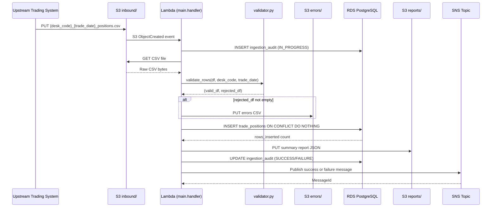
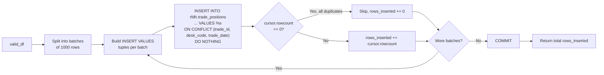
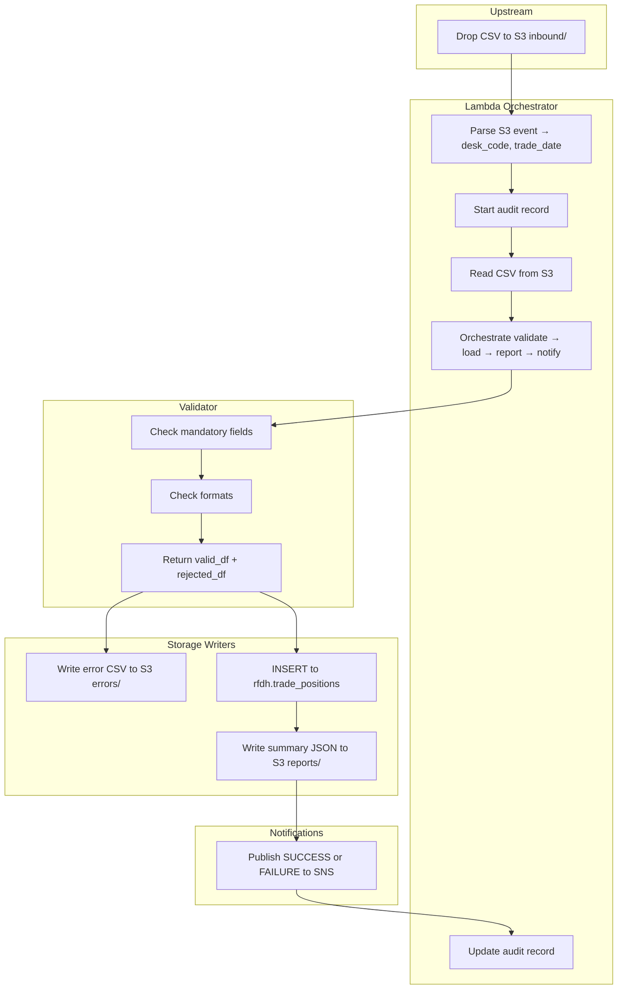

# Technical Design Document
## Daily Trade Position Ingestion — RFDH

**Repo:** nartcr/agentic-poc-sandbox
**Change Type:** New Feature
**Document Date:** June 2026
**Status:** Draft

---

## COMPONENTS

### `src/ingestion/main.py`
**Role:** Orchestration entry point. Invoked by the Lambda handler (or CLI trigger). Coordinates the full pipeline: reads the S3 event to determine the file to process, calls each stage in sequence, and handles top-level error routing.

**Exact behavior:**
- `def handler(event: dict, context: object) -> dict` — Lambda entry point. Extracts `s3_bucket` and `s3_key` from the S3 event notification payload (`event["Records"][0]["s3"]["bucket"]["name"]` and `event["Records"][0]["s3"]["object"]["key"]`).
- Derives `desk_code` and `trade_date` from the S3 key by parsing the filename against pattern `{desk_code}_{trade_date}_positions.csv`.
- Calls `audit.start_audit_record(s3_key, desk_code, trade_date)` → returns `audit_id`.
- Calls `file_reader.read_csv_from_s3(s3_bucket, s3_key)` → returns raw DataFrame.
- Calls `validator.validate_rows(df, desk_code, trade_date)` → returns `(valid_df, rejected_df)`.
- If `len(rejected_df) > 0`, calls `error_writer.write_error_file(s3_bucket, s3_key, rejected_df)`.
- Calls `loader.load_positions(valid_df)` → returns `rows_inserted`.
- Calls `reporter.build_and_store_report(s3_bucket, s3_key, desk_code, trade_date, raw_df, valid_df, rejected_df, rows_inserted)` → returns `report_dict`.
- Calls `audit.complete_audit_record(audit_id, rows_inserted, len(rejected_df), outcome="SUCCESS")`.
- Calls `notifier.send_success(report_dict)`.
- On any unhandled exception: calls `audit.complete_audit_record(audit_id, ..., outcome="FAILURE")` and `notifier.send_failure(error_details)`, then re-raises.

**Reads:** S3 event notification JSON.
**Writes:** Orchestrates all downstream writes; returns status dict to Lambda runtime.
**Satisfies:** BAC-1, BAC-2, BAC-3, BAC-4, BAC-5, BAC-7, BAC-8.

---

### `src/ingestion/file_reader.py`
**Role:** Reads the raw CSV from S3 into a pandas DataFrame. Preserves all raw column values as strings for downstream validation.

**Exact behavior:**
- `def read_csv_from_s3(s3_bucket: str, s3_key: str) -> pd.DataFrame`
  - Uses `boto3.client("s3")` (no credentials in code; relies on IAM role).
  - Calls `s3_client.get_object(Bucket=s3_bucket, Key=s3_key)` and reads the response body.
  - Parses with `pd.read_csv(..., dtype=str, keep_default_na=False)`. All columns remain strings; no type coercion at this stage.
  - Strips leading/trailing whitespace from all string values.
  - Returns DataFrame with original columns as present in the file header.
  - Raises `FileReadError` (custom exception) if the S3 object cannot be retrieved.

**Reads:** S3 object at `s3_bucket / s3_key`.
**Writes:** Nothing. Returns in-memory DataFrame.
**Satisfies:** BAC-1, BAC-6.

---

### `src/ingestion/validator.py`
**Role:** Validates each row against mandatory field rules and format rules. Splits rows into valid and rejected sets.

**Exact behavior:**
- `def validate_rows(df: pd.DataFrame, desk_code: str, trade_date: str) -> tuple[pd.DataFrame, pd.DataFrame]`
  - Mandatory fields checked for presence and non-empty string: `trade_id`, `desk_code`, `trade_date`, `instrument_type`, `notional_amount`, `currency`, `counterparty_id`.
  - Additional format validations:
    - `trade_date` must match `YYYY-MM-DD` format (validated with `datetime.strptime`).
    - `notional_amount` must be castable to `float` and must be a finite number (not NaN, not inf).
    - `currency` must be exactly 3 uppercase alpha characters (ISO 4217 pattern: `^[A-Z]{3}$`).
    - `desk_code` in each row must match the `desk_code` derived from the filename (cross-field consistency check).
  - For each failing row, records all failing reasons as a pipe-delimited string (e.g., `"notional_amount: not a valid number | currency: must be 3 uppercase letters"`).
  - Returns `(valid_df, rejected_df)` where `rejected_df` has all original columns plus an additional column `rejection_reason: str`.
  - `valid_df` has `notional_amount` cast to `float64`.

**Reads:** Raw DataFrame from `file_reader`, `desk_code` (str), `trade_date` (str).
**Writes:** Nothing. Returns two DataFrames.
**Satisfies:** BAC-1, BAC-2, BAC-4.

---

### `src/ingestion/loader.py`
**Role:** Loads validated rows into the reporting database using an idempotent `INSERT ... ON CONFLICT DO NOTHING` pattern.

**Exact behavior:**
- `def load_positions(valid_df: pd.DataFrame) -> int`
  - Retrieves DB credentials via `secrets.get_db_credentials()`.
  - Opens a `psycopg2` connection to the PostgreSQL database.
  - For each batch of rows (batch size: 1000), executes:
    ```
    INSERT INTO rfdh.trade_positions
      (trade_id, desk_code, trade_date, instrument_type, notional_amount, currency, counterparty_id, loaded_at)
    VALUES %s
    ON CONFLICT (trade_id, desk_code, trade_date) DO NOTHING
    ```
    using `psycopg2.extras.execute_values`.
  - `loaded_at` is set to `datetime.now(pytz.timezone("America/Toronto"))` at the time of the INSERT call (not per-row; one timestamp per batch call).
  - Counts rows actually inserted by checking `cursor.rowcount` after each batch; sums across batches.
  - Commits after all batches succeed; rolls back on any exception.
  - Returns total `rows_inserted: int`.

**Reads:** `valid_df` (pandas DataFrame with columns: `trade_id`, `desk_code`, `trade_date`, `instrument_type`, `notional_amount`, `currency`, `counterparty_id`).
**Writes:** Rows to `rfdh.trade_positions`.
**Satisfies:** BAC-1, BAC-3, BAC-7.

---

### `src/ingestion/error_writer.py`
**Role:** Writes the rejected rows with rejection reasons to S3 as a CSV error file.

**Exact behavior:**
- `def write_error_file(s3_bucket: str, source_s3_key: str, rejected_df: pd.DataFrame) -> str`
  - Derives the error file S3 key from the source key:
    - Source key pattern: `inbound/{desk_code}_{trade_date}_positions.csv`
    - Error key pattern: `errors/{desk_code}_{trade_date}_positions_errors.csv`
  - Serializes `rejected_df` (columns: all original input columns + `rejection_reason`) to CSV bytes using `df.to_csv(index=False)`.
  - Uploads via `s3_client.put_object(Bucket=s3_bucket, Key=error_key, Body=csv_bytes)`.
  - Returns the full S3 key of the written error file.

**Reads:** `rejected_df` (pandas DataFrame with all original columns + `rejection_reason`).
**Writes:** CSV to S3 at `s3://os.environ["S3_BUCKET"]/errors/{desk_code}_{trade_date}_positions_errors.csv`.
**Satisfies:** BAC-2.

---

### `src/ingestion/reporter.py`
**Role:** Builds the summary report dict and writes it as a JSON file to S3.

**Exact behavior:**
- `def build_and_store_report(s3_bucket: str, source_s3_key: str, desk_code: str, trade_date: str, raw_df: pd.DataFrame, valid_df: pd.DataFrame, rejected_df: pd.DataFrame, rows_inserted: int) -> dict`
  - Computes:
    - `total_rows`: `len(raw_df)`
    - `rows_loaded`: `rows_inserted`
    - `rows_rejected`: `len(rejected_df)`
    - `processing_timestamp`: `datetime.now(pytz.timezone("America/Toronto")).isoformat()` — format `2026-06-15T19:32:00.123456-04:00`
    - `desk_code_counts`: `dict` of `{desk_code: int}` — count of valid rows grouped by `desk_code` from `valid_df`
    - `min_notional`: `float(valid_df["notional_amount"].min())` — 0.0 if `valid_df` is empty
    - `max_notional`: `float(valid_df["notional_amount"].max())` — 0.0 if `valid_df` is empty
    - `null_rates`: for each of the 7 mandatory columns in `raw_df`, compute `round(raw_df[col].apply(lambda x: x.strip() == "").sum() / len(raw_df), 6)` → `dict[str, float]`
    - `source_file`: `source_s3_key`
    - `desk_code`: `desk_code`
    - `trade_date`: `trade_date`
  - Serializes to JSON and writes to S3 at `reports/{desk_code}_{trade_date}_summary.json`.
  - Returns the report dict (used by `notifier`).

**Reads:** DataFrames from prior stages, scalar counts.
**Writes:** JSON report to `s3://os.environ["S3_BUCKET"]/reports/{desk_code}_{trade_date}_summary.json`.
**Satisfies:** BAC-4, BAC-5, BAC-7.

---

### `src/ingestion/notifier.py`
**Role:** Sends SNS notifications on success and failure.

**Exact behavior:**
- `def send_success(report_dict: dict) -> None`
  - Publishes to SNS topic ARN at `os.environ["SNS_TOPIC_ARN"]`.
  - Message is JSON-serialized with the exact keys defined in DATA CONTRACTS → SNS.
  - Subject: `"RFDH Position Ingestion SUCCESS — {desk_code} {trade_date}"`.

- `def send_failure(error_details: dict) -> None`
  - Publishes to SNS topic ARN at `os.environ["SNS_TOPIC_ARN"]`.
  - Message is JSON-serialized with failure keys defined in DATA CONTRACTS → SNS.
  - Subject: `"RFDH Position Ingestion FAILURE — {desk_code} {trade_date}"`.

**Reads:** `report_dict` or `error_details` dict.
**Writes:** SNS message to `os.environ["SNS_TOPIC_ARN"]`.
**Satisfies:** BAC-5.

---

### `src/ingestion/secrets.py`
**Role:** Retrieves all runtime secrets from AWS Secrets Manager. No credentials anywhere else in the codebase.

**Exact behavior:**
- `def get_db_credentials() -> dict`
  - Calls `boto3.client("secretsmanager").get_secret_value(SecretId=os.environ["DB_SECRET_ID"])`.
  - Parses the `SecretString` as JSON.
  - Returns dict with keys: `host`, `port`, `dbname`, `username`, `password`.
  - Caches result in module-level variable after first call (within Lambda execution context).

**Reads:** Secrets Manager secret at `os.environ["DB_SECRET_ID"]`.
**Writes:** Nothing. Returns credentials dict.
**Satisfies:** BAC-8.

---

### `src/ingestion/audit.py`
**Role:** Writes audit trail records to the `rfdh.ingestion_audit` table for every file processed.

**Exact behavior:**
- `def start_audit_record(s3_key: str, desk_code: str, trade_date: str) -> int`
  - Inserts a row into `rfdh.ingestion_audit` with `outcome = "IN_PROGRESS"`, `started_at = datetime.now(tz)` (ET), `service_identity = os.environ["SERVICE_IDENTITY"]`.
  - Returns the generated `audit_id` (serial primary key).

- `def complete_audit_record(audit_id: int, rows_loaded: int, rows_rejected: int, outcome: str) -> None`
  - Updates the row where `audit_id = %s`: sets `rows_loaded`, `rows_rejected`, `outcome`, `completed_at = datetime.now(tz)` (ET).
  - `outcome` is one of: `"SUCCESS"`, `"FAILURE"`.

**Reads:** DB credentials via `secrets.get_db_credentials()`.
**Writes:** `rfdh.ingestion_audit` table rows.
**Satisfies:** BAC-7 (ET timestamps), regulatory non-functional requirement (audit trail).

---

### `src/ingestion/exceptions.py`
**Role:** Defines all custom exception types used across the pipeline.

**Exact behavior:**
- Defines:
  - `FileReadError(Exception)` — raised when S3 object cannot be retrieved.
  - `ValidationError(Exception)` — raised for structural failures (e.g., missing header columns), not per-row rejections.
  - `LoadError(Exception)` — raised on unrecoverable DB write failures.
  - `ReportWriteError(Exception)` — raised if S3 report write fails.

**Reads/Writes:** Nothing.
**Satisfies:** Supports graceful error handling across all BACs.

---

### `src/db/migrations/001_create_schema.sql`
**Role:** DDL script to create all database objects. Applied once during deployment.

**Creates:**
- Schema `rfdh`
- Table `rfdh.trade_positions` (full schema in DATA CONTRACTS)
- Table `rfdh.ingestion_audit` (full schema in DATA CONTRACTS)

**Satisfies:** BAC-1, BAC-3, BAC-7.

---

### `tests/test_validator.py`
**Role:** Unit tests for `validator.validate_rows`.
- Test: all valid rows → `rejected_df` is empty.
- Test: row with empty `trade_id` → appears in `rejected_df` with reason containing `"trade_id"`.
- Test: row with non-numeric `notional_amount` → rejection reason contains `"notional_amount"`.
- Test: row with invalid `currency` (`"USD1"`) → rejection reason contains `"currency"`.
- Test: row with `desk_code` mismatch → rejection reason contains `"desk_code"`.
- Test: row with multiple failures → `rejection_reason` contains all failing field names.
**Satisfies:** BAC-2.

### `tests/test_loader.py`
**Role:** Integration tests for `loader.load_positions` against a test database.
- Test: load 10 rows → `rows_inserted == 10`.
- Test: load same 10 rows again → `rows_inserted == 0`, total DB count still 10.
**Satisfies:** BAC-3.

### `tests/test_reporter.py`
**Role:** Unit tests for `reporter.build_and_store_report`.
- Test: `processing_timestamp` is parseable and timezone offset is `"-04:00"` or `"-05:00"` (ET).
- Test: `min_notional` and `max_notional` match expected values from input.
- Test: `null_rates` are correctly computed.
**Satisfies:** BAC-4, BAC-7.

---

## AWS SERVICES

| Service | Role |
|---|---|
| **Amazon S3** | Stores inbound position CSV files (`inbound/` prefix), error files (`errors/` prefix), and JSON summary reports (`reports/` prefix). Lambda is triggered by S3 `ObjectCreated` events on the `inbound/` prefix. |
| **AWS Lambda** | Executes the ingestion pipeline. `main.handler` is the Lambda handler. Triggered by S3 event notifications. |
| **Amazon RDS (PostgreSQL)** | Hosts the `rfdh` schema with `trade_positions` and `ingestion_audit` tables. All DB writes use credentials from Secrets Manager. |
| **AWS Secrets Manager** | Stores database credentials JSON. Referenced at runtime via `os.environ["DB_SECRET_ID"]`. No credentials in code. |
| **Amazon SNS** | Receives success and failure notifications. Downstream risk calculation pipeline subscribes to this topic. Referenced via `os.environ["SNS_TOPIC_ARN"]`. |
| **AWS IAM** | Lambda execution role grants: S3 `GetObject`/`PutObject` on the designated bucket, Secrets Manager `GetSecretValue`, SNS `Publish`, and RDS network access (via VPC). No over-privileged permissions. |
| **Amazon VPC** | Lambda and RDS are deployed in the same VPC. Lambda uses VPC configuration to reach RDS without public internet exposure. |

---

## DATA CONTRACTS

### Database Tables

#### `rfdh.trade_positions`

| Column | Data Type | Nullable | Notes |
|---|---|---|---|
| `id` | `BIGSERIAL` | NOT NULL | Surrogate primary key |
| `trade_id` | `VARCHAR(100)` | NOT NULL | From file |
| `desk_code` | `VARCHAR(50)` | NOT NULL | From file; also validated against filename |
| `trade_date` | `DATE` | NOT NULL | From file; format `YYYY-MM-DD` |
| `instrument_type` | `VARCHAR(100)` | NOT NULL | From file |
| `notional_amount` | `NUMERIC(20,6)` | NOT NULL | From file; validated as finite float |
| `currency` | `CHAR(3)` | NOT NULL | From file; validated as `^[A-Z]{3}$` |
| `counterparty_id` | `VARCHAR(100)` | NOT NULL | From file |
| `loaded_at` | `TIMESTAMPTZ` | NOT NULL | Set at load time, ET-aware |

**Primary Key:** `id`
**Unique Constraint:** `UNIQUE (trade_id, desk_code, trade_date)` — this is the deduplication key for `ON CONFLICT DO NOTHING`.
**Index:** `CREATE INDEX idx_trade_positions_desk_date ON rfdh.trade_positions (desk_code, trade_date);`

---

#### `rfdh.ingestion_audit`

| Column | Data Type | Nullable | Notes |
|---|---|---|---|
| `audit_id` | `SERIAL` | NOT NULL | Primary key |
| `s3_key` | `VARCHAR(500)` | NOT NULL | Full S3 key of processed file |
| `desk_code` | `VARCHAR(50)` | NOT NULL | Derived from filename |
| `trade_date` | `DATE` | NOT NULL | Derived from filename |
| `outcome` | `VARCHAR(20)` | NOT NULL | `"IN_PROGRESS"`, `"SUCCESS"`, or `"FAILURE"` |
| `rows_loaded` | `INTEGER` | NULL | Populated on completion |
| `rows_rejected` | `INTEGER` | NULL | Populated on completion |
| `started_at` | `TIMESTAMPTZ` | NOT NULL | ET-aware timestamp at pipeline start |
| `completed_at` | `TIMESTAMPTZ` | NULL | ET-aware timestamp at pipeline end |
| `service_identity` | `VARCHAR(200)` | NOT NULL | Value of `os.environ["SERVICE_IDENTITY"]` |
| `error_message` | `TEXT` | NULL | Populated on `FAILURE`; first 2000 chars of exception message |

**Primary Key:** `audit_id`
**Index:** `CREATE INDEX idx_ingestion_audit_s3_key ON rfdh.ingestion_audit (s3_key);`

---

### S3 Paths

All paths are within `os.environ["S3_BUCKET"]`.

| Path Pattern | Format | Description |
|---|---|---|
| `inbound/{desk_code}_{trade_date}_positions.csv` | CSV, comma-delimited, UTF-8, with header row | Input files deposited by upstream trading systems. Lambda trigger is on `s3:ObjectCreated:*` for prefix `inbound/`. |
| `errors/{desk_code}_{trade_date}_positions_errors.csv` | CSV, comma-delimited, UTF-8, with header row | Rejected rows. Columns: all 7 mandatory input columns + `rejection_reason`. |
| `reports/{desk_code}_{trade_date}_summary.json` | JSON, UTF-8 | Summary report. Schema defined below. |

#### Input CSV — Expected Column Headers (in any order)
```
trade_id, desk_code, trade_date, instrument_type, notional_amount, currency, counterparty_id
```
Additional columns beyond these 7 are permitted and passed through to the error file but not loaded to the DB.

#### Summary Report JSON — Full Schema
```json
{
  "source_file": "inbound/EQTY_2026-06-15_positions.csv",
  "desk_code": "EQTY",
  "trade_date": "2026-06-15",
  "processing_timestamp": "2026-06-15T19:32:00.123456-04:00",
  "total_rows": 1000,
  "rows_loaded": 995,
  "rows_rejected": 5,
  "desk_code_counts": {
    "EQTY": 995
  },
  "min_notional": 100.0,
  "max_notional": 9500000.0,
  "null_rates": {
    "trade_id": 0.0,
    "desk_code": 0.0,
    "trade_date": 0.002,
    "instrument_type": 0.0,
    "notional_amount": 0.003,
    "currency": 0.0,
    "counterparty_id": 0.0
  }
}
```

---

### Secrets Manager

**Environment Variable:** `DB_SECRET_ID = os.environ["DB_SECRET_ID"]`

Expected JSON structure inside the secret:
```json
{
  "host": "<rds-endpoint>",
  "port": 5432,
  "dbname": "<database-name>",
  "username": "<db-user>",
  "password": "<db-password>"
}
```

---

### SNS Messages

**Environment Variable:** `SNS_TOPIC_ARN = os.environ["SNS_TOPIC_ARN"]`

#### Success Message Payload
```json
{
  "event_type": "POSITION_INGESTION_SUCCESS",
  "desk_code": "EQTY",
  "trade_date": "2026-06-15",
  "source_file": "inbound/EQTY_2026-06-15_positions.csv",
  "processing_timestamp": "2026-06-15T19:32:00.123456-04:00",
  "total_rows": 1000,
  "rows_loaded": 995,
  "rows_rejected": 5,
  "min_notional": 100.0,
  "max_notional": 9500000.0
}
```

#### Failure Message Payload
```json
{
  "event_type": "POSITION_INGESTION_FAILURE",
  "desk_code": "EQTY",
  "trade_date": "2026-06-15",
  "source_file": "inbound/EQTY_2026-06-15_positions.csv",
  "processing_timestamp": "2026-06-15T19:32:00.123456-04:00",
  "error_type": "LoadError",
  "error_message": "Connection refused to database host"
}
```

---

### Environment Variables Summary

| Variable Name | Purpose |
|---|---|
| `S3_BUCKET` | S3 bucket name for all inbound, error, and report files |
| `DB_SECRET_ID` | Secrets Manager secret ID for DB credentials |
| `SNS_TOPIC_ARN` | SNS topic ARN for success/failure notifications |
| `SERVICE_IDENTITY` | Identifier for the processing service (e.g., Lambda function name); written to audit table |

---

## DATA FLOW

### End-to-End Pipeline Flow



---

### Validation Decision Logic

```mermaid
flowchart TD
    A[Start: Raw DataFrame Row] --> B{All 7 mandatory\nfields present\nand non-empty?}
    B -- No --> REJ1[Reject: list missing fields\nin rejection_reason]
    B -- Yes --> C{trade_date matches\nYYYY-MM-DD?}
    C -- No --> REJ2[Reject: trade_date invalid format]
    C -- Yes --> D{notional_amount\ncastable to float\nand finite?}
    D -- No --> REJ3[Reject: notional_amount not valid number]
    D -- Yes --> E{currency matches\n^[A-Z]{3}$?}
    E -- No --> REJ4[Reject: currency must be 3 uppercase letters]
    E -- Yes --> F{desk_code matches\nfilename desk_code?}
    F -- No --> REJ5[Reject: desk_code mismatch with filename]
    F -- Yes --> G[Accept: Add to valid_df]

    REJ1 & REJ2 & REJ3 & REJ4 & REJ5 --> COMB{Multiple failures\non same row?}
    COMB -- Yes --> PIPE[Combine all reasons\npipe-delimited]
    COMB -- No --> ADDREJ[Add to rejected_df]
    PIPE --> ADDREJ
```

---

### Idempotent Load Logic



---

### Swimlane: Multi-Actor Responsibilities



---

## TECHNICAL ACCEPTANCE CRITERIA

**TAC-1: Valid 1,000-row file is fully loaded with zero errors**
- `validator.validate_rows` applied to a conformant 1,000-row DataFrame returns `len(rejected_df) == 0`.
- `loader.load_positions` returns `rows_inserted == 1000`.
- Acceptance test: execute `SELECT COUNT(*) FROM rfdh.trade_positions WHERE desk_code = %s AND trade_date = %s` after load; assert `count == 1000`.
- No error file is written to `s3://S3_BUCKET/errors/` for this run.

**TAC-2: File with 5 invalid rows produces an error file with all 5 rejections**
- `validator.validate_rows` applied to a DataFrame containing exactly 5 rows with one or more failing validation checks returns `len(rejected_df) == 5` and `len(valid_df) == total_rows - 5`.
- `error_writer.write_error_file` writes a CSV to `s3://S3_BUCKET/errors/{desk_code}_{trade_date}_positions_errors.csv` containing exactly 5 data rows (plus header).
- Each row in the error CSV has a non-empty `rejection_reason` column containing the name of the specific failing field(s) (e.g., `"notional_amount: not a valid number"`).
- Acceptance test: read back the error CSV from S3 and assert `len(df) == 5` and all `rejection_reason` values are non-empty strings.

**TAC-3: Reprocessing the same file produces zero additional DB rows**
- `loader.load_positions` uses `INSERT INTO rfdh.trade_positions (...) VALUES %s ON CONFLICT (trade_id, desk_code, trade_date) DO NOTHING`.
- First call with 1,000 valid rows: `rows_inserted == 1000`.
- Second call with identical 1,000 rows: `rows_inserted == 0`.
- Acceptance test: `SELECT COUNT(*) FROM rfdh.trade_positions WHERE desk_code = %s AND trade_date = %s` returns `1000` after both runs.
- The unique constraint `UNIQUE (trade_id, desk_code, trade_date)` on `rfdh.trade_positions` is the enforcement mechanism.

**TAC-4: Summary report contains correct counts, min/max notional, and null rates**
- `reporter.build_and_store_report` produces a JSON dict where:
  - `total_rows` == `len(raw_df)`
  - `rows_loaded` == value returned by `loader.load_positions`
  - `rows_rejected` == `len(rejected_df)`
  - `min_notional` == `float(valid_df["notional_amount"].min())` — verified against independently calculated minimum.
  - `max_notional` == `float(valid_df["notional_amount"].max())` — verified against independently calculated maximum.
  - `null_rates[col]` == `(count of empty-string values in raw_df[col]) / len(raw_df)`, rounded to 6 decimal places, for all 7 mandatory columns.
- Acceptance test: load a controlled 100-row DataFrame with known nulls and known min/max; assert each field in report dict matches expected value.

**TAC-5: Downstream SNS notification contains correct summary statistics**
- `notifier.send_success` calls `sns_client.publish(TopicArn=os.environ["SNS_TOPIC_ARN"], Message=json.dumps(payload), Subject=...)`.
- The JSON payload includes fields: `event_type`, `desk_code`, `trade_date`, `source_file`, `processing_timestamp`, `total_rows`, `rows_loaded`, `rows_rejected`, `min_notional`, `max_notional`.
- Acceptance test (integration): intercept the SNS publish call (via mock or real topic with SQS subscriber); parse the message body and assert each field matches the values from the summary report dict.
- `event_type` must equal `"POSITION_INGESTION_SUCCESS"` on success and `"POSITION_INGESTION_FAILURE"` on failure.

**TAC-6: Processing completes within 60 seconds for a 10,000-row file**
- Performance acceptance test: construct a 10,000-row conformant DataFrame, execute the full `handler` pipeline end-to-end, measure wall-clock time.
- Assert `elapsed_seconds < 60`.
- Batch INSERT is used (batch size 1,000 rows = 10 batches) to stay within time budget.
- Lambda memory must be configured at minimum 512 MB; timeout at minimum 120 seconds.

**TAC-7: All timestamps are in Eastern Time**
- Every timestamp-valued column written to the DB (`loaded_at` in `rfdh.trade_positions`, `started_at` and `completed_at` in `rfdh.ingestion_audit`) is generated using `datetime.now(pytz.timezone("America/Toronto"))`.
- `processing_timestamp` in the summary report JSON and SNS message is generated using `datetime.now(pytz.timezone("America/Toronto")).isoformat()` and includes a UTC offset of `-04:00` or `-05:00` (depending on DST).
- Acceptance test: read a just-inserted `loaded_at` value from `rfdh.trade_positions`; parse as `datetime`; assert `tzinfo` is not UTC (offset != `+00:00`) and the offset matches Eastern Time for the current date.
- Acceptance test: parse `processing_timestamp` from report JSON; assert the UTC offset string is either `"-04:00"` or `"-05:00"`.
- The string `"UTC"` or offset `"+00:00"` must not appear in any timestamp field in any output.

**TAC-8: No credentials in the codebase**
- Static analysis: grep the entire `src/` and `tests/` directory tree for patterns matching known secret key names (`password`, `passwd`, `secret`, `token`, `key`) assigned to string literals.
- `secrets.get_db_credentials` is the sole location where credentials are retrieved, and it calls `boto3.client("secretsmanager").get_secret_value(SecretId=os.environ["DB_SECRET_ID"])` with no fallback literals.
- Acceptance test: no string literal matching `r"(?i)(password|passwd|secret|token)\s*=\s*['\"][^'\"]{4,}"` appears anywhere in committed source files.
- `DB_SECRET_ID`, `SNS_TOPIC_ARN`, `S3_BUCKET`, `SERVICE_IDENTITY` are read exclusively from `os.environ` — never assigned inline.

---

## OPEN QUESTIONS

None. All business logic requirements are sufficiently specified in the BRD. Infrastructure configuration is handled via environment variables per design rules.

---

## ASSUMPTIONS

1. **Trigger Mechanism:** The Lambda function is triggered by S3 `ObjectCreated` events on the `inbound/` prefix. This is assumed to already be configured in the deployment environment. The code reads the triggering S3 key from the Lambda event payload.

2. **One File = One Lambda Invocation:** Each S3 event maps to exactly one file. Concurrent files (one per desk) will result in concurrent Lambda invocations, each independently processing one file. No coordination between invocations is required.

3. **Database Platform:** The target reporting database is PostgreSQL (Amazon RDS). `psycopg2` is used as the driver. The `ON CONFLICT DO NOTHING` syntax requires PostgreSQL 9.5+.

4. **File Encoding:** All input CSV files are UTF-8 encoded with a comma delimiter and a header row. No BOM, no alternative delimiters.

5. **File Naming Strict Match:** The filename pattern `{desk_code}_{trade_date}_positions.csv` is strictly enforced. Files not matching this pattern will cause a `ValidationError` and trigger a failure notification. `trade_date` in the filename is in `YYYY-MM-DD` format.

6. **S3 Bucket is Single-Bucket:** Inbound files, error files, and report files all reside in the same S3 bucket (`os.environ["S3_BUCKET"]`), differentiated by prefix (`inbound/`, `errors/`, `reports/`).

7. **Report Overwrites on Reprocess:** If a summary report JSON already exists at `reports/{desk_code}_{trade_date}_summary.json`, the `put_object` call will overwrite it. This is intentional for re-processing support.

8. **Error File Overwrites on Reprocess:** Similarly, re-processing overwrites the existing error file at `errors/{desk_code}_{trade_date}_positions_errors.csv`. Only the most recent rejection list is retained.

9. **Single SNS Topic for Success and Failure:** Both success and failure notifications are sent to the same SNS topic (`os.environ["SNS_TOPIC_ARN"]`). Downstream consumers differentiate using the `event_type` field in the message payload.

10. **Lambda VPC Configuration:** The Lambda function is deployed within a VPC with network access to the RDS instance. This VPC configuration is pre-existing in the deployment environment.

11. **`psycopg2` Layer:** A Lambda layer providing `psycopg2-binary` is assumed to be pre-provisioned and attached to the Lambda function. The code uses `import psycopg2` with no installation steps.

12. **`SERVICE_IDENTITY` Value:** `os.environ["SERVICE_IDENTITY"]` is populated by the Lambda execution environment (e.g., set to the Lambda function name or a logical service identifier). It is not a secret but an operational identifier.

13. **Partial-Load Counts:** `rows_inserted` returned by `loader.load_positions` reflects only the rows actually written (skipping conflicts), which may differ from `len(valid_df)` during reprocessing. The summary report reflects `rows_inserted`, not `len(valid_df)`, as the loaded count. This aligns with BAC-4's requirement for accurate counts.

14. **No Partial-File Failure Tolerance:** If the database INSERT fails mid-file (e.g., connection drop), the entire transaction is rolled back and a failure notification is sent. There is no partial-commit logic. The file must be re-submitted for a clean retry.

15. **`notional_amount` Precision:** Stored as `NUMERIC(20,6)` — supports values up to 14 digits before the decimal and 6 after. Assumed sufficient for all expected trade notional sizes.