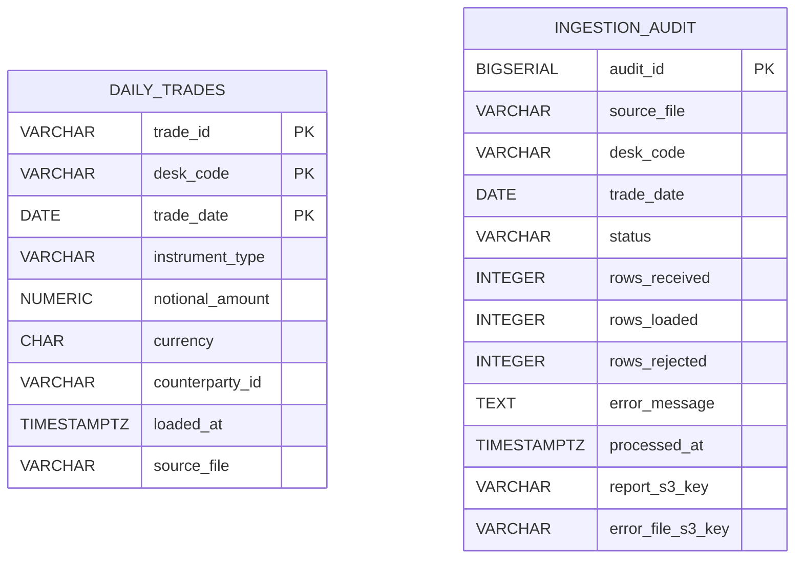
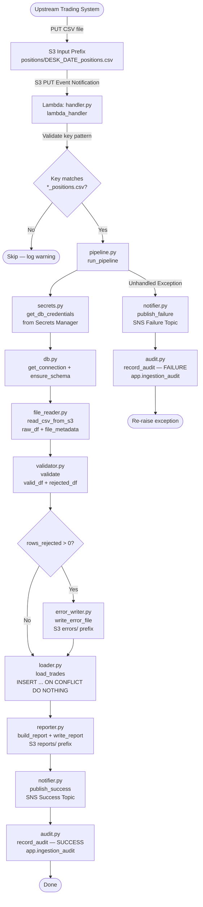
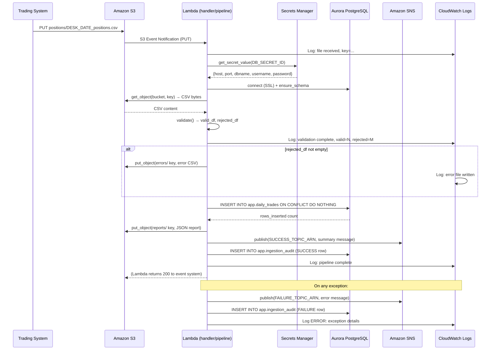
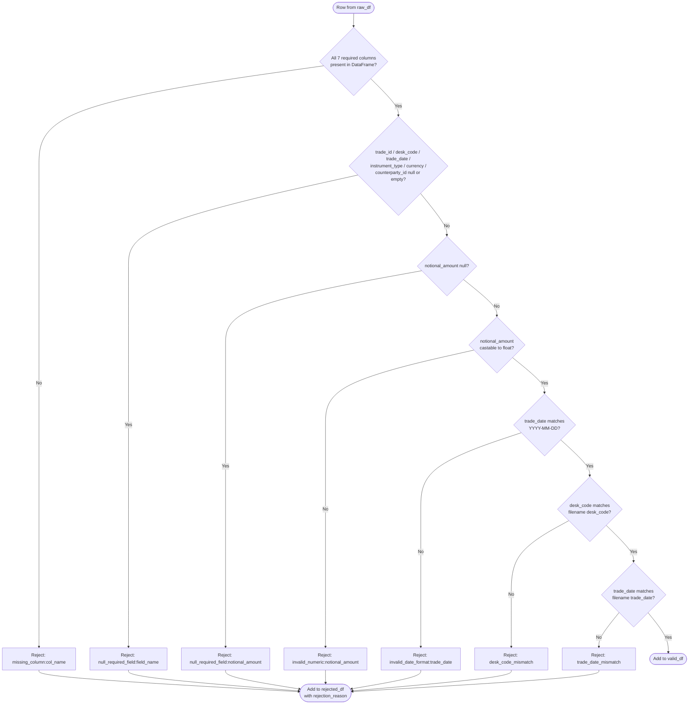

# Technical Design Document
## Daily Trade Position Ingestion
### RFDH — Risk Finance Data Hub
**Repo:** sdlc-agent-sandbox | **Change Type:** New Feature | **Date:** June 2026 | **Status:** Draft

---

## COMPONENTS

### `config.py`
**What it does:** Centralizes all environment variable reads and runtime constants. Provides a single `Config` dataclass populated at startup from `os.environ`. Any module needing an infrastructure handle (bucket name, secret ID, SNS ARN, etc.) imports from here. Raises `EnvironmentError` with a descriptive message listing any missing required variables on import failure.

**What it reads:**
- `os.environ["S3_BUCKET"]` — S3 bucket for input files and reports
- `os.environ["S3_INPUT_PREFIX"]` — prefix where trading desk files land (e.g. `positions/`)
- `os.environ["S3_REPORTS_PREFIX"]` — prefix for JSON summary reports (e.g. `reports/`)
- `os.environ["S3_ERRORS_PREFIX"]` — prefix for CSV error files (e.g. `errors/`)
- `os.environ["DB_SECRET_ID"]` — Secrets Manager secret ID for Aurora credentials
- `os.environ["SNS_SUCCESS_TOPIC_ARN"]` — SNS ARN for success notifications
- `os.environ["SNS_FAILURE_TOPIC_ARN"]` — SNS ARN for failure notifications
- `os.environ["AWS_REGION"]` — AWS region for all boto3 clients

**What it writes:** Nothing. Pure read/validation.

**Satisfies:** BAC-8 (all config via env vars, no hardcoded values)

---

### `secrets.py`
**What it does:** Retrieves database credentials from AWS Secrets Manager at runtime. Exposes `get_db_credentials() -> dict` which calls `boto3.client("secretsmanager").get_secret_value(SecretId=Config.DB_SECRET_ID)`, parses the JSON secret string, and returns a dict with keys `host`, `port`, `dbname`, `username`, `password`. Credentials are fetched on each pipeline invocation (not cached at module level) to support rotation.

**What it reads:**
- `Config.DB_SECRET_ID` from `config.py`
- Secrets Manager secret JSON with keys: `host` (str), `port` (int), `dbname` (str), `username` (str), `password` (str)

**What it writes:** Nothing. Returns credentials dict to caller.

**Satisfies:** BAC-8 (no hardcoded credentials; secrets read from Secrets Manager at runtime)

---

### `db.py`
**What it does:** Manages Aurora PostgreSQL connectivity. Exposes `get_connection(credentials: dict) -> psycopg2.connection` which opens a connection using the credentials dict from `secrets.py`. Also exposes `ensure_schema(conn)` which executes `CREATE TABLE IF NOT EXISTS` and `CREATE UNIQUE INDEX IF NOT EXISTS` DDL for `app.daily_trades` and `app.ingestion_audit` (idempotent schema setup). Connection uses SSL (`sslmode=require`).

**What it reads:** Credentials dict: `{host, port, dbname, username, password}`

**What it writes:** Nothing at connection time. `ensure_schema` creates tables/indexes if absent.

**Satisfies:** BAC-3 (unique constraint foundation), BAC-8 (credentials passed in, never hardcoded)

---

### `file_reader.py`
**What it does:** Downloads the CSV file from S3 and returns a raw `pandas.DataFrame` plus file metadata. Exposes `read_csv_from_s3(bucket: str, key: str) -> tuple[pd.DataFrame, dict]`. Uses `boto3.client("s3").get_object(Bucket=bucket, Key=key)` and reads the body into a DataFrame via `pd.read_csv`. Returns the DataFrame with all columns as `object` dtype (no type coercion at read time) and a metadata dict: `{source_file: str, row_count_raw: int, desk_code_from_filename: str, trade_date_from_filename: str}`. Parses `desk_code` and `trade_date` from the filename using the pattern `{desk_code}_{trade_date}_positions.csv`.

**What it reads:**
- S3 object at `bucket/key`
- CSV columns (raw, unvalidated): any present in the file

**What it writes:** Nothing to persistent storage. Returns `(DataFrame, metadata_dict)` in memory.

**Satisfies:** BAC-1, BAC-2 (provides raw data for validation pipeline)

---

### `validator.py`
**What it does:** Validates each row of the raw DataFrame against business rules. Exposes `validate(df: pd.DataFrame, desk_code_from_filename: str, trade_date_from_filename: str) -> tuple[pd.DataFrame, pd.DataFrame]` which returns `(valid_df, rejected_df)`.

**Validation rules applied in order:**

1. **Missing required columns check:** If any of `[trade_id, desk_code, trade_date, instrument_type, notional_amount, currency, counterparty_id]` are absent from the DataFrame entirely, all rows are rejected with reason `"missing_column:{column_name}"`.
2. **Null/empty field check:** Any row where `trade_id`, `desk_code`, `trade_date`, `instrument_type`, `currency`, or `counterparty_id` is null or empty string → rejected with reason `"null_required_field:{field_name}"`.
3. **Null notional check:** Any row where `notional_amount` is null → rejected with reason `"null_required_field:notional_amount"`.
4. **notional_amount numeric check:** Any row where `notional_amount` cannot be cast to `float` → rejected with reason `"invalid_numeric:notional_amount"`.
5. **trade_date format check:** Any row where `trade_date` does not match `YYYY-MM-DD` → rejected with reason `"invalid_date_format:trade_date"`.
6. **desk_code consistency check:** Any row where `desk_code` in the CSV does not match `desk_code_from_filename` → rejected with reason `"desk_code_mismatch"`.
7. **trade_date consistency check:** Any row where `trade_date` in the CSV does not match `trade_date_from_filename` → rejected with reason `"trade_date_mismatch"`.

The `rejected_df` contains all original columns plus a `rejection_reason` column (string). A row that fails multiple checks carries the reason for the **first** failing check (fail-fast per row). Valid rows are cast: `notional_amount` → `float64`, `trade_date` → `datetime.date`.

**What it reads:** Raw `pd.DataFrame` with columns: `trade_id`, `desk_code`, `trade_date`, `instrument_type`, `notional_amount`, `currency`, `counterparty_id` (plus any extra columns, which are passed through to valid_df but ignored in loading).

**What it writes:** Nothing to persistent storage. Returns two DataFrames in memory.

**Satisfies:** BAC-2 (5 invalid rows → 5 rejection entries with specific reasons)

---

### `loader.py`
**What it does:** Loads valid rows into `app.daily_trades`. Exposes `load_trades(conn: psycopg2.connection, valid_df: pd.DataFrame, source_file: str) -> int`.

Uses `psycopg2.extras.execute_values` to batch-insert rows. SQL:
```
INSERT INTO app.daily_trades
  (trade_id, desk_code, trade_date, instrument_type, notional_amount, currency, counterparty_id, loaded_at, source_file)
VALUES %s
ON CONFLICT (trade_id, desk_code, trade_date) DO NOTHING
```
`loaded_at` is set to `datetime.now(pytz.timezone("America/Toronto"))` for each batch (computed once per `load_trades` call, applied uniformly to all rows in the batch). Returns the count of rows actually inserted (computed as `cursor.rowcount` summed across batches, or via pre/post count query if `rowcount` is unreliable with `execute_values`). Batch size: 1,000 rows.

**What it reads:**
- `valid_df` columns: `trade_id`, `desk_code`, `trade_date`, `instrument_type`, `notional_amount`, `currency`, `counterparty_id`
- `source_file` (str): S3 key of the source file

**What it writes:** Rows to `app.daily_trades`. See DATA CONTRACTS for full schema.

**Satisfies:** BAC-1 (valid rows loaded, count matches), BAC-3 (`ON CONFLICT DO NOTHING` prevents duplicates), BAC-7 (`loaded_at` in ET)

---

### `error_writer.py`
**What it does:** Writes the rejected rows DataFrame to an S3 CSV error file. Exposes `write_error_file(bucket: str, errors_prefix: str, rejected_df: pd.DataFrame, source_file_key: str) -> str`.

Derives the error file key as: `{errors_prefix}{desk_code}_{trade_date}_positions_errors_{run_timestamp}.csv` where `run_timestamp` is `YYYYMMDD_HHMMSS` in ET. Writes `rejected_df` (all original columns + `rejection_reason`) as CSV using `pandas.DataFrame.to_csv`. Uploads to S3 via `boto3.client("s3").put_object`. Returns the full S3 key of the written error file.

If `rejected_df` is empty (zero rejections), **no error file is written** and the function returns `None`.

**What it reads:**
- `rejected_df`: DataFrame with original CSV columns + `rejection_reason` (str)
- `source_file_key`: original S3 key, used to derive desk_code/trade_date for naming

**What it writes:** `s3://{S3_BUCKET}/{errors_prefix}{desk_code}_{trade_date}_positions_errors_{YYYYMMDD_HHMMSS}.csv`

**Satisfies:** BAC-2 (error file with all 5 rejections and specific reasons)

---

### `reporter.py`
**What it does:** Computes and writes the JSON summary report. Exposes `build_report(raw_df: pd.DataFrame, valid_df: pd.DataFrame, rejected_df: pd.DataFrame, rows_inserted: int, source_file: str, load_timestamp_et: datetime) -> dict` and `write_report(bucket: str, reports_prefix: str, report: dict, source_file_key: str) -> str`.

`build_report` computes:
- `source_file`: S3 key of input file
- `total_rows_received`: `len(raw_df)`
- `rows_loaded`: `rows_inserted` (actual DB insert count)
- `rows_rejected`: `len(rejected_df)`
- `load_timestamp`: `load_timestamp_et.isoformat()` (ET, includes timezone offset)
- `record_counts_by_desk_code`: `dict` of `{desk_code: count}` from `valid_df.groupby("desk_code").size()`
- `min_notional_amount`: `float(valid_df["notional_amount"].min())` — `null` if no valid rows
- `max_notional_amount`: `float(valid_df["notional_amount"].max())` — `null` if no valid rows
- `null_rates`: `dict` of `{column_name: null_rate_float}` for all 7 required columns computed against `raw_df` (i.e., `raw_df[col].isnull().mean()`)
- `rejection_reasons_summary`: `dict` of `{reason: count}` from `rejected_df["rejection_reason"].value_counts()`

`write_report` serializes to JSON and uploads to `s3://{bucket}/{reports_prefix}{desk_code}_{trade_date}_positions_report_{YYYYMMDD_HHMMSS}.json` via `boto3.client("s3").put_object`. Returns the full S3 key.

**What it reads:** Raw, valid, and rejected DataFrames; insert count; source file key; ET timestamp.

**What it writes:** JSON object to `s3://{S3_BUCKET}/{S3_REPORTS_PREFIX}{desk_code}_{trade_date}_positions_report_{YYYYMMDD_HHMMSS}.json`

**Satisfies:** BAC-4 (correct counts, min/max notional, null rates), BAC-7 (ET timestamp in report)

---

### `notifier.py`
**What it does:** Publishes SNS notifications. Exposes two functions:
- `publish_success(topic_arn: str, report: dict) -> str` — publishes success message; returns SNS `MessageId`.
- `publish_failure(topic_arn: str, source_file: str, error_type: str, error_detail: str) -> str` — publishes failure message; returns SNS `MessageId`.

Both use `boto3.client("sns").publish(TopicArn=..., Message=json.dumps(...), Subject=...)`. Message format defined in DATA CONTRACTS.

**What it reads:** `report` dict from `reporter.py` for success; error metadata for failure.

**What it writes:** SNS message to `SNS_SUCCESS_TOPIC_ARN` or `SNS_FAILURE_TOPIC_ARN`.

**Satisfies:** BAC-5 (SNS published with correct summary stats)

---

### `audit.py`
**What it does:** Writes one row to `app.ingestion_audit` per file processed. Exposes `record_audit(conn: psycopg2.connection, audit_row: dict) -> None`. Called at end of pipeline (success or failure). `audit_row` fields: `source_file` (str), `desk_code` (str), `trade_date` (date), `status` (str: `"SUCCESS"` or `"FAILURE"`), `rows_received` (int), `rows_loaded` (int), `rows_rejected` (int), `error_message` (str or None), `processed_at` (datetime, ET), `report_s3_key` (str or None), `error_file_s3_key` (str or None).

Uses `INSERT INTO app.ingestion_audit (...) VALUES (...)` — no conflict handling (each run produces a new audit record, supporting reprocessing history).

**What it reads:** `audit_row` dict (fields above).

**What it writes:** One row to `app.ingestion_audit`.

**Satisfies:** BAC-7 (ET timestamp in audit), BAC-8 (uses passed-in connection, no credentials in module), NFR-3.3 (audit trail for OSFI/SOX)

---

### `pipeline.py`
**What it does:** Orchestrates the end-to-end processing of a single file. Exposes `run_pipeline(s3_key: str) -> None`. This is the main entry point called by the handler.

**Execution sequence:**
1. Load `Config`
2. Call `secrets.get_db_credentials()`
3. Call `db.get_connection(credentials)`
4. Call `db.ensure_schema(conn)`
5. Call `file_reader.read_csv_from_s3(bucket, s3_key)` → `(raw_df, file_metadata)`
6. Call `validator.validate(raw_df, desk_code_from_filename, trade_date_from_filename)` → `(valid_df, rejected_df)`
7. Call `loader.load_trades(conn, valid_df, s3_key)` → `rows_inserted`
8. Capture `load_timestamp_et = datetime.now(pytz.timezone("America/Toronto"))`
9. Call `error_writer.write_error_file(...)` → `error_file_key` (or `None`)
10. Call `reporter.build_report(...)` → `report`
11. Call `reporter.write_report(...)` → `report_s3_key`
12. Call `notifier.publish_success(...)`
13. Call `audit.record_audit(conn, audit_row)`
14. Commit transaction and close connection.

On any unhandled exception at steps 5–13:
- Call `notifier.publish_failure(...)` with exception type and message
- Call `audit.record_audit(conn, audit_row with status="FAILURE")` (best-effort; wrapped in try/except)
- Log exception at ERROR level
- Re-raise exception

**What it reads:** `s3_key` (string S3 object key)

**What it writes:** Coordinates all writes via sub-modules. No direct writes.

**Satisfies:** BAC-1 through BAC-8 (orchestrates all)

---

### `handler.py`
**What it does:** Lambda entry point. Exposes `lambda_handler(event: dict, context: object) -> dict`. Parses the S3 event notification to extract the S3 bucket and object key for each record in `event["Records"]`. For each record, calls `pipeline.run_pipeline(s3_key)`. Returns `{"statusCode": 200, "processed": [list of keys]}` on full success. If `run_pipeline` raises, logs the exception and returns `{"statusCode": 500, "error": str(e)}`.

**Event format expected:** S3 Event Notification (PUT trigger) — `event["Records"][i]["s3"]["bucket"]["name"]` and `event["Records"][i]["s3"]["object"]["key"]`.

Validates that the object key matches the pattern `*_positions.csv` before invoking the pipeline; logs a warning and skips keys that do not match (guards against spurious trigger events).

**What it reads:** Lambda event dict (S3 PUT notification)

**What it writes:** Nothing directly. Returns response dict.

**Satisfies:** BAC-1 through BAC-8 (entry point that invokes pipeline)

---

## AWS SERVICES

| Service | Role |
|---|---|
| **Amazon S3** | Source of incoming CSV position files (input prefix); destination for JSON summary reports (reports prefix) and CSV error files (errors prefix). |
| **AWS Lambda** | Compute platform for the ingestion pipeline. Triggered by S3 PUT event notifications on the input prefix. |
| **Amazon Aurora PostgreSQL** | Persistent storage for validated trade positions (`app.daily_trades`) and processing audit log (`app.ingestion_audit`). |
| **AWS Secrets Manager** | Stores Aurora database credentials (host, port, dbname, username, password). Credentials fetched at runtime; never hardcoded. |
| **Amazon SNS** | Publishes success and failure notifications to downstream consumers (e.g. risk calculation pipeline). Two topics: one for success, one for failure. |
| **Amazon CloudWatch Logs** | Receives all structured log output from the Lambda function via the `logging` module. Supports operational monitoring and OSFI audit readiness. |

---

## DATA CONTRACTS

### Database Tables

#### `app.daily_trades`
```
Table: app.daily_trades

Column              Data Type               Constraints
─────────────────────────────────────────────────────────────────────
trade_id            VARCHAR(100)            NOT NULL
desk_code           VARCHAR(50)             NOT NULL
trade_date          DATE                    NOT NULL
instrument_type     VARCHAR(100)            NOT NULL
notional_amount     NUMERIC(24, 6)          NOT NULL
currency            CHAR(3)                 NOT NULL
counterparty_id     VARCHAR(100)            NOT NULL
loaded_at           TIMESTAMPTZ             NOT NULL
source_file         VARCHAR(500)            NOT NULL

Primary Key:        (trade_id, desk_code, trade_date)
Unique Constraint:  UNIQUE (trade_id, desk_code, trade_date)   ← drives ON CONFLICT

Indexes:
  - PK index on (trade_id, desk_code, trade_date)
  - idx_daily_trades_trade_date on (trade_date)
  - idx_daily_trades_desk_code on (desk_code)
```

> **Note:** `loaded_at` stores the ET-aware timestamp. Although PostgreSQL stores `TIMESTAMPTZ` internally as UTC, the application layer sets the value using `datetime.now(pytz.timezone("America/Toronto"))` so the logical time is always ET. All reads must present the value in ET. The `loaded_at` value is set once per `load_trades` call and applied uniformly to the batch.

#### `app.ingestion_audit`
```
Table: app.ingestion_audit

Column              Data Type               Constraints
─────────────────────────────────────────────────────────────────────
audit_id            BIGSERIAL               PRIMARY KEY
source_file         VARCHAR(500)            NOT NULL
desk_code           VARCHAR(50)             NOT NULL
trade_date          DATE                    NOT NULL
status              VARCHAR(20)             NOT NULL   -- 'SUCCESS' | 'FAILURE'
rows_received       INTEGER                 NOT NULL
rows_loaded         INTEGER                 NOT NULL
rows_rejected       INTEGER                 NOT NULL
error_message       TEXT                    NULL
processed_at        TIMESTAMPTZ             NOT NULL
report_s3_key       VARCHAR(500)            NULL
error_file_s3_key   VARCHAR(500)            NULL

Primary Key: audit_id (auto-increment)
Index: idx_ingestion_audit_source_file on (source_file)
Index: idx_ingestion_audit_processed_at on (processed_at)
```

---

### S3 Paths

```
Bucket:   os.environ["S3_BUCKET"]

Input files (written by upstream trading systems):
  Key pattern:  {S3_INPUT_PREFIX}{desk_code}_{trade_date}_positions.csv
  Example:      positions/EQTY_2026-06-15_positions.csv
  Format:       CSV with header row
  Expected columns (header names, exact):
                trade_id, desk_code, trade_date, instrument_type,
                notional_amount, currency, counterparty_id
  Additional columns: permitted, ignored during load

Error files (written by this pipeline):
  Key pattern:  {S3_ERRORS_PREFIX}{desk_code}_{trade_date}_positions_errors_{YYYYMMDD_HHMMSS}.csv
  Example:      errors/EQTY_2026-06-15_positions_errors_20260615_183042.csv
  Format:       CSV with header row
  Columns:      trade_id, desk_code, trade_date, instrument_type,
                notional_amount, currency, counterparty_id,
                [any extra columns from source], rejection_reason

Report files (written by this pipeline):
  Key pattern:  {S3_REPORTS_PREFIX}{desk_code}_{trade_date}_positions_report_{YYYYMMDD_HHMMSS}.json
  Example:      reports/EQTY_2026-06-15_positions_report_20260615_183105.json
  Format:       JSON object (see SNS section for field structure — identical schema)

Timestamp in filenames: ET, format YYYYMMDD_HHMMSS
```

---

### Secrets Manager

```
Environment variable: os.environ["DB_SECRET_ID"]

Secret JSON structure:
{
  "host":     "string  — Aurora cluster endpoint hostname",
  "port":     integer  — typically 5432,
  "dbname":   "string  — database name",
  "username": "string  — DB user",
  "password": "string  — DB password"
}
```

---

### SNS Messages

```
Success topic ARN:  os.environ["SNS_SUCCESS_TOPIC_ARN"]
Failure topic ARN:  os.environ["SNS_FAILURE_TOPIC_ARN"]

Success message (JSON string, Subject: "Trade Position Ingestion: SUCCESS"):
{
  "event_type":               "INGESTION_SUCCESS",
  "source_file":              "string — S3 key of input file",
  "desk_code":                "string",
  "trade_date":               "YYYY-MM-DD",
  "total_rows_received":      integer,
  "rows_loaded":              integer,
  "rows_rejected":            integer,
  "load_timestamp":           "ISO-8601 string with ET offset",
  "report_s3_key":            "string — S3 key of JSON report",
  "error_file_s3_key":        "string or null",
  "min_notional_amount":      float or null,
  "max_notional_amount":      float or null,
  "record_counts_by_desk_code": { "DESK_CODE": integer },
  "null_rates":               { "column_name": float }
}

Failure message (JSON string, Subject: "Trade Position Ingestion: FAILURE"):
{
  "event_type":   "INGESTION_FAILURE",
  "source_file":  "string — S3 key of input file",
  "error_type":   "string — Python exception class name",
  "error_detail": "string — exception message",
  "timestamp":    "ISO-8601 string with ET offset"
}
```

---

### Data Contracts — Visual Overview



---

## DATA FLOW

### End-to-End Pipeline Flow



---

### Service Interaction Sequence



---

### Validation Logic (Row-Level)



---

### Idempotent Load Algorithm

```
ALGORITHM: load_trades(conn, valid_df, source_file)

INPUT:
  conn        — open psycopg2 connection
  valid_df    — DataFrame of validated rows, columns:
                [trade_id, desk_code, trade_date, instrument_type,
                 notional_amount, currency, counterparty_id]
  source_file — S3 key string

COMPUTE:
  loaded_at ← datetime.now(pytz.timezone("America/Toronto"))

SPLIT valid_df into batches of 1,000 rows

FOR EACH batch:
  rows ← list of tuples:
    (trade_id, desk_code, trade_date, instrument_type,
     notional_amount, currency, counterparty_id, loaded_at, source_file)

  EXECUTE:
    INSERT INTO app.daily_trades
      (trade_id, desk_code, trade_date, instrument_type,
       notional_amount, currency, counterparty_id, loaded_at, source_file)
    VALUES %s
    ON CONFLICT (trade_id, desk_code, trade_date) DO NOTHING

  inserted_this_batch ← cursor.rowcount
  total_inserted += inserted_this_batch

conn.commit()
RETURN total_inserted
```

---

## TECHNICAL ACCEPTANCE CRITERIA

### TAC-1 — Valid file loaded with zero errors and matching row count
**From BAC-1**

- `validator.validate()` must return `len(rejected_df) == 0` for a well-formed 1,000-row file.
- `loader.load_trades()` must return `rows_inserted == 1000`.
- `reporter.build_report()` must produce `report["rows_loaded"] == 1000`, `report["rows_rejected"] == 0`, `report["total_rows_received"] == 1000`.
- Acceptance test: Query `SELECT COUNT(*) FROM app.daily_trades WHERE source_file = :key` after load; assert result equals 1000.

---

### TAC-2 — Error file lists all 5 invalid rows with specific reasons
**From BAC-2**

- `validator.validate()` called with a DataFrame containing exactly 5 invalid rows must return `len(rejected_df) == 5`.
- Each row in `rejected_df` must have a non-null, non-empty `rejection_reason` string matching one of the defined codes: `missing_column:{col}`, `null_required_field:{col}`, `invalid_numeric:notional_amount`, `invalid_date_format:trade_date`, `desk_code_mismatch`, `trade_date_mismatch`.
- `error_writer.write_error_file()` must write a CSV to `S3_ERRORS_PREFIX` containing exactly 5 data rows (plus header).
- Acceptance test: Read back the error CSV from S3; assert `len(df) == 5`; assert all values in `df["rejection_reason"]` are non-null and match the defined pattern.

---

### TAC-3 — Reprocessing the same file produces no duplicate rows
**From BAC-3**

- `loader.load_trades()` uses `INSERT INTO app.daily_trades ... ON CONFLICT (trade_id, desk_code, trade_date) DO NOTHING`.
- `app.daily_trades` must have `UNIQUE (trade_id, desk_code, trade_date)` constraint (enforced in `db.ensure_schema`).
- Acceptance test: Call `run_pipeline(same_s3_key)` twice. After first run, record `COUNT(*) = N`. After second run, assert `COUNT(*) = N` unchanged. Second run must return `rows_inserted == 0` from `loader.load_trades()`.

---

### TAC-4 — JSON report contains correct counts, min/max notional, and null rates
**From BAC-4**

- `reporter.build_report()` must produce a dict with all of the following keys present and correctly typed:
  - `total_rows_received` (int): equals `len(raw_df)`
  - `rows_loaded` (int): equals return value of `loader.load_trades()`
  - `rows_rejected` (int): equals `len(rejected_df)`
  - `min_notional_amount` (float or null): equals `valid_df["notional_amount"].min()` when valid rows exist
  - `max_notional_amount` (float or null): equals `valid_df["notional_amount"].max()` when valid rows exist
  - `null_rates` (dict): each key is one of the 7 required column names; value is a float in [0.0, 1.0] computed as `raw_df[col].isnull().mean()`
  - `record_counts_by_desk_code` (dict): `{desk_code_str: integer_count}` summing to `len(valid_df)`
  - `load_timestamp` (str): ISO-8601 format with ET timezone offset (e.g. `-04:00` or `-05:00`)
- Acceptance test: Parse the JSON report from S3 and assert each field value equals the independently-computed expected value from the test fixture.

---

### TAC-5 — SNS notification published with correct summary statistics
**From BAC-5**

- `notifier.publish_success()` must call `sns.publish()` with `TopicArn == os.environ["SNS_SUCCESS_TOPIC_ARN"]`.
- The `Message` argument must be a valid JSON string deserializable to a dict.
- The deserialized dict must contain `event_type == "INGESTION_SUCCESS"` and numeric fields `rows_loaded`, `rows_rejected`, `total_rows_received` matching the report values.
- Acceptance test (unit): Mock `boto3.client("sns").publish`; call `notifier.publish_success(topic_arn, report)`; assert `publish` was called once with `Message` deserializing to a dict where `rows_loaded == report["rows_loaded"]`, etc.
- Acceptance test (integration): Confirm SNS `publish` returns a `MessageId` (non-empty string).

---

### TAC-6 — Processing completes within 60 seconds for 10,000-row file
**From BAC-6**

- `pipeline.run_pipeline(s3_key)` invoked with a 10,000-row valid CSV file must complete (from function entry to return) in ≤ 60 seconds wall-clock time.
- Measured by wrapping `run_pipeline` call with `time.perf_counter()` in the acceptance test.
- The batch insert size of 1,000 rows in `loader.load_trades()` is the primary lever for performance; this must not be reduced below 500 without re-testing against TAC-6.
- Acceptance test: Generate a 10,000-row fixture CSV, upload to S3 test prefix, invoke `pipeline.run_pipeline()`, assert elapsed time `< 60.0` seconds.

---

### TAC-7 — All timestamps in ET, never UTC
**From BAC-7**

- In `loader.load_trades()`: `loaded_at = datetime.now(pytz.timezone("America/Toronto"))` — the resulting `datetime` object must be timezone-aware with `tzinfo` corresponding to `America/Toronto`.
- In `reporter.build_report()`: `load_timestamp` string must end with a UTC offset of `-04:00` or `-05:00` (depending on DST), never `+00:00`.
- In `audit.record_audit()`: `processed_at` value must be a timezone-aware `datetime` with `tzinfo = pytz.timezone("America/Toronto")`.
- In S3 file name timestamps: derived via `datetime.now(pytz.timezone("America/Toronto")).strftime("%Y%m%d_%H%M%S")`.
- In SNS failure message: `timestamp` field must carry the ET offset.
- Acceptance test: Assert `report["load_timestamp"]` does not contain `+00:00`; assert `loaded_at` column value retrieved from DB (cast to `AT TIME ZONE 'America/Toronto'`) matches the ET wall-clock time of the test run within a 5-second tolerance.

---

### TAC-8 — No credentials in codebase; all secrets from Secrets Manager
**From BAC-8**

- Static analysis (automated grep/AST scan): no string literal matching patterns `password`, `passwd`, `secret`, `token`, `key` with an assignment to a non-environment-variable source shall appear in any `.py` file under the repo.
- `secrets.get_db_credentials()` must call `boto3.client("secretsmanager").get_secret_value(SecretId=Config.DB_SECRET_ID)` where `Config.DB_SECRET_ID` is read from `os.environ["DB_SECRET_ID"]`.
- `db.get_connection()` must accept credentials as a parameter dict and must not contain any string literal that looks like a hostname, username, or password.
- Acceptance test (unit): Mock `boto3.client`; assert `secrets.get_db_credentials()` calls `get_secret_value` exactly once with the value of `os.environ["DB_SECRET_ID"]` and does not use any hardcoded credential string.

---

## OPEN QUESTIONS

None. All business logic is sufficiently specified in the BRD. Infrastructure configuration is handled via environment variables.

---

## ASSUMPTIONS

| # | Assumption | Impact if Wrong |
|---|---|---|
| A-1 | The Lambda function is the compute platform (triggered by S3 PUT event notifications). The Lambda function already exists and is configured in the environment; only the application code is being delivered. | If compute platform is ECS/Fargate or EC2, the `handler.py` entry point pattern changes; `run_pipeline` remains reusable. |
| A-2 | S3 event notifications are already configured on the S3 bucket to invoke the Lambda on PUT events at the `S3_INPUT_PREFIX` prefix. | If not configured, the Lambda will never be triggered; ops team must configure. |
| A-3 | The Aurora PostgreSQL cluster is in the same VPC as the Lambda function (or Lambda has VPC access). Network connectivity is assumed operational. | If Lambda cannot reach Aurora, all DB operations fail. VPC config is an ops concern, not a code concern. |
| A-4 | The `app` schema already exists in Aurora. `db.ensure_schema()` creates tables within it but does not create the schema itself. | If `app` schema is absent, `CREATE TABLE IF NOT EXISTS app.daily_trades` fails. A `CREATE SCHEMA IF NOT EXISTS app` DDL step would need to be added. |
| A-5 | S3 input prefix is `positions/`, errors prefix is `errors/`, reports prefix is `reports/`. These are configurable via env vars; these are documentation defaults. | No code impact — env vars override defaults. |
| A-6 | Each S3 event notification triggers the Lambda with exactly one record per invocation (standard S3 → Lambda behavior). The handler loop over `event["Records"]` handles the edge case of batched events. | If events are truly batched (e.g. via SQS intermediary), the loop handles it correctly. No code change needed. |
| A-7 | `trade_id` values within a single desk/date file are expected to be unique in the source data. The `ON CONFLICT DO NOTHING` dedup behavior is intentional for reprocessing, not for correcting within-file duplicates. Duplicate `trade_id` within the same desk/date in a single file will result in the second occurrence being silently dropped. | If within-file duplicate `trade_id` should be an error (not silently dropped), a pre-load duplicate check must be added to `validator.py`. |
| A-8 | The `currency` field in the source CSV is always a 3-character ISO 4217 code (e.g. `USD`, `CAD`). `CHAR(3)` is used in the schema. No currency format validation is applied beyond null/empty check. | If multi-character currency codes or currency names are present, `CHAR(3)` truncation or insert errors will occur. |
| A-9 | The `operator identity` referenced in NFR-3.3 (audit trail) is captured implicitly via the `source_file` S3 key and the Lambda execution context (CloudWatch log stream). There is no application-level user authentication or operator ID passed in the file or event. | If explicit operator ID is required in the audit table, a new field and event contract change is needed. |
| A-10 | The `psycopg2-binary` package (or `psycopg2` compiled for Lambda) is available in the Lambda deployment package / Lambda Layer. | If not available, DB connectivity fails at import time. This is a packaging concern. |
| A-11 | File sizes up to 100,000 rows will fit within Lambda memory limits. A 100,000-row DataFrame with 7 string/numeric columns is estimated at ~50–80 MB in memory, well within a 512 MB–1 GB Lambda allocation. | If Lambda memory is insufficient, the function will error on large files. Memory allocation is a deployment-time configuration. |
| A-12 | Rejected rows in the error file include all original CSV columns plus `rejection_reason`. No PII masking or field redaction is applied to the error file. | If regulatory or data governance policy requires field redaction in error outputs, a masking step must be added to `error_writer.py`. |