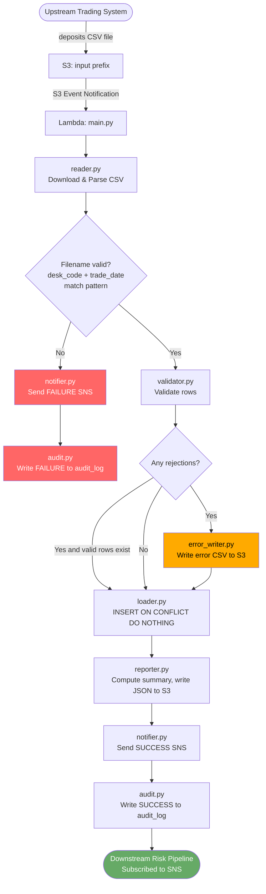
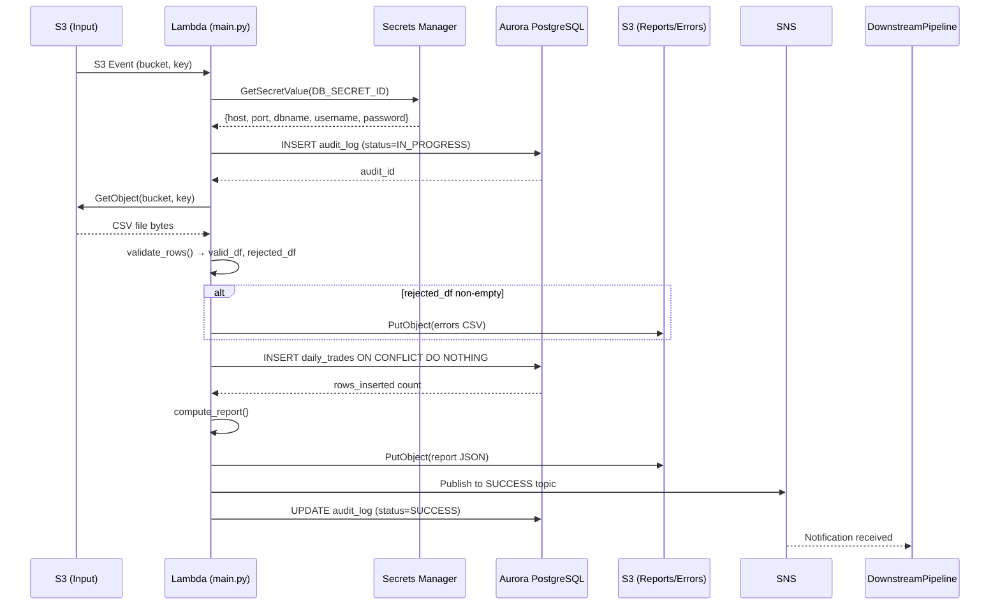
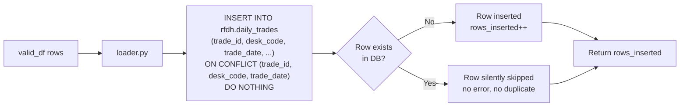

# Technical Design Document
## Daily Trade Position Ingestion
### RFDH — Risk Finance Data Hub
**Version:** 1.0 | **Date:** June 2026 | **Status:** Draft

---

## COMPONENTS

---

### `main.py` — Pipeline Orchestrator

**What it does:**
Entry point invoked by the Lambda handler or direct execution. Reads the S3 event notification to extract the bucket name and object key of the incoming file. Orchestrates the full pipeline in sequence: file download → validation → loading → reporting → notification. Captures a top-level `try/except` to send a failure SNS notification if any unhandled exception occurs. Writes one row to the `rfdh.audit_log` table at start and updates it at completion (success or failure). Returns a structured result dict with `file_name`, `status`, `rows_received`, `rows_loaded`, `rows_rejected`, `processing_timestamp_et`.

**Reads:**
- S3 event payload: `Records[0].s3.bucket.name`, `Records[0].s3.object.key`
- Environment variables: `S3_BUCKET`, `S3_INPUT_PREFIX`, `S3_REPORT_PREFIX`, `S3_ERROR_PREFIX`, `DB_SECRET_ID`, `SNS_TOPIC_ARN_SUCCESS`, `SNS_TOPIC_ARN_FAILURE`

**Writes:**
- Calls `audit.start_audit(file_name, source_file_key)` → returns `audit_id`
- Calls `audit.complete_audit(audit_id, status, rows_received, rows_loaded, rows_rejected)`
- Returns result dict to Lambda runtime

**Satisfies:** BAC-1, BAC-2, BAC-3, BAC-4, BAC-5, BAC-7, BAC-8

---

### `reader.py` — File Reader and Parser

**What it does:**
Downloads the CSV file from S3 using the bucket and key provided by the orchestrator. Reads the file using `pandas.read_csv()` with `dtype=str` to prevent silent type coercion. Returns a raw `DataFrame` with all columns as strings, plus the original row count (before any filtering). Also extracts and validates the filename against the pattern `{desk_code}_{trade_date}_positions.csv` using a regex; raises `ValueError` with a descriptive message if the filename does not match.

**Function signatures:**
- `download_and_parse(bucket: str, key: str) -> tuple[pd.DataFrame, int, str, str]`
  - Returns: `(raw_df, row_count, desk_code_from_filename, trade_date_from_filename)`

**Reads:**
- S3 object at `s3://{bucket}/{key}`
- Expected CSV columns (all as string): `trade_id`, `desk_code`, `trade_date`, `instrument_type`, `notional_amount`, `currency`, `counterparty_id`

**Writes:**
- Returns DataFrame in memory; no writes to disk or S3

**Satisfies:** BAC-1, BAC-2, BAC-6

---

### `validator.py` — Row-Level Data Validator

**What it does:**
Accepts the raw `DataFrame` from `reader.py`. Applies validation rules row-by-row for each mandatory field. Returns two DataFrames: `valid_df` (rows passing all checks) and `rejected_df` (rows failing at least one check). `rejected_df` includes all original columns plus a `rejection_reason` column containing a human-readable, pipe-delimited concatenation of all failure reasons for that row (e.g. `"notional_amount is not a valid decimal | currency is missing"`).

**Validation rules applied (in order, all failures accumulated per row):**
1. `trade_id`: not null, not empty string
2. `desk_code`: not null, not empty string
3. `trade_date`: not null, not empty string, matches format `YYYY-MM-DD`, parseable as a valid calendar date
4. `instrument_type`: not null, not empty string
5. `notional_amount`: not null, not empty string, castable to `Decimal` (no non-numeric characters)
6. `currency`: not null, not empty string, exactly 3 alphabetic characters (ISO 4217 format)
7. `counterparty_id`: not null, not empty string

**Function signatures:**
- `validate(df: pd.DataFrame) -> tuple[pd.DataFrame, pd.DataFrame]`
  - Returns: `(valid_df, rejected_df)` where `rejected_df` has column `rejection_reason` appended

**Reads:**
- `pd.DataFrame` with columns: `trade_id`, `desk_code`, `trade_date`, `instrument_type`, `notional_amount`, `currency`, `counterparty_id`

**Writes:**
- Returns two DataFrames in memory

**Satisfies:** BAC-2, BAC-4

---

### `loader.py` — Database Loader

**What it does:**
Accepts the validated `DataFrame` from `validator.py`. Connects to Aurora PostgreSQL using credentials from `secrets.py`. Casts `notional_amount` from string to `Decimal` and `trade_date` from string to `datetime.date`. Executes a bulk `INSERT INTO rfdh.daily_trades (...) ON CONFLICT (trade_id, desk_code, trade_date) DO NOTHING` using `psycopg2` `execute_values`. Returns the count of rows actually inserted (i.e. rows affected by the INSERT, not the total rows submitted), which may differ from the input count if duplicates were silently skipped. Uses a single database transaction; rolls back on any error and re-raises.

**Function signatures:**
- `load_records(valid_df: pd.DataFrame, source_file: str, secrets: dict) -> int`
  - Returns: `rows_inserted` (int — actual rows written, not input count)

**Reads:**
- `valid_df` columns: `trade_id`, `desk_code`, `trade_date`, `instrument_type`, `notional_amount`, `currency`, `counterparty_id`
- `source_file`: original S3 key, written to `source_file` column
- `secrets`: dict containing `host`, `port`, `dbname`, `username`, `password`

**Writes:**
- `INSERT INTO rfdh.daily_trades` — see DATA CONTRACTS for full schema

**Satisfies:** BAC-1, BAC-3, BAC-6

---

### `reporter.py` — Summary Report Generator

**What it does:**
Accepts `valid_df`, `rejected_df`, `rows_received` (int), `source_file` (str), and `trade_date` (str). Computes the full summary report as a Python dict, serializes it to JSON, and writes it to S3 at `s3://{S3_REPORT_BUCKET}/{S3_REPORT_PREFIX}{desk_code}_{trade_date}_report.json`. 

**Computed fields:**
- `total_rows_received`: `rows_received` (raw count from file before validation)
- `rows_loaded`: count of rows inserted (passed from `loader.py`)
- `rows_rejected`: `len(rejected_df)`
- `processing_timestamp_et`: `datetime.now(pytz.timezone("America/Toronto")).isoformat()`
- `desk_code_counts`: `valid_df.groupby("desk_code").size().to_dict()`
- `min_notional_amount`: `valid_df["notional_amount"].astype(float).min()`
- `max_notional_amount`: `valid_df["notional_amount"].astype(float).max()`
- `null_rates`: for each of the 7 mandatory columns, `(count of null/empty values in full raw_df / rows_received)` as a float between 0.0 and 1.0
- `source_file`: original S3 key

**Function signatures:**
- `generate_report(valid_df: pd.DataFrame, rejected_df: pd.DataFrame, raw_df: pd.DataFrame, rows_received: int, rows_loaded: int, source_file: str, desk_code: str, trade_date: str, s3_client) -> dict`
  - Returns: the report dict (also written to S3)

**Writes:**
- S3 key: `{S3_REPORT_PREFIX}{desk_code}_{trade_date}_report.json` in bucket `os.environ["S3_BUCKET"]`
- JSON file conforming to the report schema in DATA CONTRACTS

**Satisfies:** BAC-4, BAC-7

---

### `error_writer.py` — Rejection Error File Writer

**What it does:**
Accepts `rejected_df` (the DataFrame of rejected rows with `rejection_reason` column) and metadata (desk_code, trade_date). If `rejected_df` is non-empty, writes it as a CSV to S3 at `{S3_ERROR_PREFIX}{desk_code}_{trade_date}_errors.csv`. Includes all original columns plus `rejection_reason` as the final column. If `rejected_df` is empty, no file is written (idempotent).

**Function signatures:**
- `write_error_file(rejected_df: pd.DataFrame, desk_code: str, trade_date: str, s3_client) -> str | None`
  - Returns: S3 key of the error file if written, else `None`

**Reads:**
- `rejected_df` columns: `trade_id`, `desk_code`, `trade_date`, `instrument_type`, `notional_amount`, `currency`, `counterparty_id`, `rejection_reason`

**Writes:**
- S3 key: `{S3_ERROR_PREFIX}{desk_code}_{trade_date}_errors.csv` in bucket `os.environ["S3_BUCKET"]`
- CSV with header row, UTF-8 encoded

**Satisfies:** BAC-2

---

### `notifier.py` — SNS Notification Publisher

**What it does:**
Publishes SNS messages for success and failure events. On success, publishes to `SNS_TOPIC_ARN_SUCCESS` with the full summary report dict as the message body. On failure, publishes to `SNS_TOPIC_ARN_FAILURE` with the error details dict. Both messages are JSON-serialized. Subject line for success: `"Trade Position Load Complete: {desk_code} {trade_date}"`. Subject line for failure: `"Trade Position Load FAILED: {file_name}"`.

**Function signatures:**
- `notify_success(report: dict, sns_client) -> None`
- `notify_failure(file_name: str, error_message: str, error_type: str, processing_timestamp_et: str, sns_client) -> None`

**Reads:**
- `SNS_TOPIC_ARN_SUCCESS` from `os.environ`
- `SNS_TOPIC_ARN_FAILURE` from `os.environ`
- `report` dict for success; error metadata for failure

**Writes:**
- SNS message to success topic (see DATA CONTRACTS for message schema)
- SNS message to failure topic (see DATA CONTRACTS for message schema)

**Satisfies:** BAC-5

---

### `secrets.py` — Secrets Manager Client

**What it does:**
Retrieves database credentials from AWS Secrets Manager at runtime. Caches the result in a module-level variable to avoid redundant API calls within the same Lambda invocation. Returns a dict with keys `host`, `port`, `dbname`, `username`, `password`. Raises `RuntimeError` if the secret cannot be retrieved or does not contain all required keys.

**Function signatures:**
- `get_db_credentials(secret_id: str) -> dict`
  - Reads: `DB_SECRET_ID` from `os.environ` (passed by caller)
  - Returns: `{"host": str, "port": int, "dbname": str, "username": str, "password": str}`

**Satisfies:** BAC-8

---

### `audit.py` — Audit Trail Manager

**What it does:**
Writes and updates rows in `rfdh.audit_log` to maintain a complete audit trail for every file processed. `start_audit` inserts a new row at pipeline start with status `IN_PROGRESS`. `complete_audit` updates that row with the final status, row counts, and completion timestamp. Both operations use the same database connection credentials from `secrets.py`.

**Function signatures:**
- `start_audit(file_name: str, source_file_key: str, secrets: dict) -> int`
  - Inserts row into `rfdh.audit_log`; returns `audit_id` (serial PK)
- `complete_audit(audit_id: int, status: str, rows_received: int, rows_loaded: int, rows_rejected: int, error_message: str | None, secrets: dict) -> None`
  - Updates `rfdh.audit_log` row where `audit_id = audit_id`

**Writes:**
- `INSERT INTO rfdh.audit_log` at start
- `UPDATE rfdh.audit_log SET ... WHERE audit_id = ?` at completion

**Satisfies:** BAC-7 (ET timestamps in audit), BAC-8

---

### `db_schema.sql` — Database DDL

**What it does:**
Contains `CREATE TABLE IF NOT EXISTS` statements for `rfdh.daily_trades` and `rfdh.audit_log`. Creates the `rfdh` schema if it does not exist. Includes all indexes and unique constraints. Run once at deployment. Not executed at runtime by the pipeline.

**Satisfies:** BAC-1, BAC-3, BAC-7

---

## AWS SERVICES

| Service | Role |
|---|---|
| **AWS Lambda** | Compute platform. Hosts the pipeline orchestrator. Triggered by S3 event notifications when a new file lands in the input prefix. |
| **Amazon S3** | File storage. Three logical prefixes within one bucket: (1) input files from upstream trading systems, (2) error/rejection files, (3) summary report files. |
| **Amazon Aurora PostgreSQL** | Reporting database. Stores validated trade position records (`rfdh.daily_trades`) and audit trail (`rfdh.audit_log`). |
| **AWS Secrets Manager** | Credential store. Holds Aurora connection credentials. Retrieved at runtime; never stored in code or config. |
| **Amazon SNS** | Notification bus. Two topics: one for success notifications (consumed by downstream risk calculation pipeline), one for failure alerts (consumed by ops/monitoring). |
| **Amazon CloudWatch Logs** | Log storage. All `logging` module output from Lambda is captured automatically. Supports audit readiness and incident investigation. |

---

## DATA CONTRACTS

### Database Tables

#### `rfdh.daily_trades`

```
Table: rfdh.daily_trades

Column              | Type                        | Constraints
--------------------|-----------------------------|-----------------------------------------
trade_id            | VARCHAR(100)                | NOT NULL
desk_code           | VARCHAR(50)                 | NOT NULL
trade_date          | DATE                        | NOT NULL
instrument_type     | VARCHAR(100)                | NOT NULL
notional_amount     | NUMERIC(24, 6)              | NOT NULL
currency            | CHAR(3)                     | NOT NULL
counterparty_id     | VARCHAR(100)                | NOT NULL
loaded_at           | TIMESTAMPTZ                 | NOT NULL DEFAULT now()
source_file         | VARCHAR(500)                | NOT NULL

Primary Key:        (trade_id, desk_code, trade_date)   -- composite unique constraint, enforces idempotency
Index:              idx_daily_trades_trade_date ON rfdh.daily_trades(trade_date)
Index:              idx_daily_trades_desk_code  ON rfdh.daily_trades(desk_code)
```

> Note: `loaded_at` stores the DB server timestamp. The application-layer ET timestamp is stored separately in the report and audit log. The `source_file` column records the originating S3 key for traceability.

---

#### `rfdh.audit_log`

```
Table: rfdh.audit_log

Column              | Type                        | Constraints
--------------------|-----------------------------|------------------------------
audit_id            | SERIAL                      | PRIMARY KEY
file_name           | VARCHAR(500)                | NOT NULL
source_file_key     | VARCHAR(500)                | NOT NULL
status              | VARCHAR(20)                 | NOT NULL  -- 'IN_PROGRESS', 'SUCCESS', 'FAILURE'
rows_received       | INTEGER                     | NULLABLE (unknown at start)
rows_loaded         | INTEGER                     | NULLABLE (unknown at start)
rows_rejected       | INTEGER                     | NULLABLE (unknown at start)
error_message       | TEXT                        | NULLABLE
started_at_et       | VARCHAR(50)                 | NOT NULL  -- ISO 8601 in ET, e.g. "2026-06-15T19:05:32.123456-04:00"
completed_at_et     | VARCHAR(50)                 | NULLABLE  -- populated on complete_audit()
service_identity    | VARCHAR(200)                | NOT NULL  -- Lambda function name from os.environ["AWS_LAMBDA_FUNCTION_NAME"]

Index:              idx_audit_log_file_name ON rfdh.audit_log(file_name)
Index:              idx_audit_log_status    ON rfdh.audit_log(status)
```

---

### S3 Paths

All paths are within the bucket referenced by `os.environ["S3_BUCKET"]`.

```
Prefix env var          | Pattern                                            | Format  | Description
------------------------|----------------------------------------------------|---------|--------------------------
S3_INPUT_PREFIX         | {S3_INPUT_PREFIX}{desk_code}_{trade_date}_positions.csv  | CSV     | Raw input from trading systems
S3_REPORT_PREFIX        | {S3_REPORT_PREFIX}{desk_code}_{trade_date}_report.json   | JSON    | Summary report per file
S3_ERROR_PREFIX         | {S3_ERROR_PREFIX}{desk_code}_{trade_date}_errors.csv     | CSV     | Rejected rows with reasons
```

**Input CSV structure** (all fields are strings in the raw file):
```
trade_id, desk_code, trade_date, instrument_type, notional_amount, currency, counterparty_id
```

**Report JSON structure** (written by `reporter.py`):
```json
{
  "source_file": "string (S3 key)",
  "desk_code": "string",
  "trade_date": "string (YYYY-MM-DD)",
  "total_rows_received": "integer",
  "rows_loaded": "integer",
  "rows_rejected": "integer",
  "processing_timestamp_et": "string (ISO 8601, ET timezone)",
  "desk_code_counts": { "<desk_code>": "integer" },
  "min_notional_amount": "float",
  "max_notional_amount": "float",
  "null_rates": {
    "trade_id": "float",
    "desk_code": "float",
    "trade_date": "float",
    "instrument_type": "float",
    "notional_amount": "float",
    "currency": "float",
    "counterparty_id": "float"
  }
}
```

**Error CSV structure** (written by `error_writer.py`):
```
trade_id, desk_code, trade_date, instrument_type, notional_amount, currency, counterparty_id, rejection_reason
```

---

### Secrets Manager

**Environment variable referencing the secret ID:** `os.environ["DB_SECRET_ID"]`

**Expected JSON keys within the secret:**
```json
{
  "host": "string (Aurora cluster endpoint)",
  "port": "integer (default 5432)",
  "dbname": "string (database name)",
  "username": "string",
  "password": "string"
}
```

---

### SNS Message Schemas

**Success Topic ARN:** `os.environ["SNS_TOPIC_ARN_SUCCESS"]`

**Success message body (JSON):**
```json
{
  "event_type": "TRADE_POSITION_LOAD_COMPLETE",
  "source_file": "string",
  "desk_code": "string",
  "trade_date": "string (YYYY-MM-DD)",
  "total_rows_received": "integer",
  "rows_loaded": "integer",
  "rows_rejected": "integer",
  "processing_timestamp_et": "string (ISO 8601, ET)",
  "min_notional_amount": "float",
  "max_notional_amount": "float",
  "null_rates": { "<column_name>": "float" },
  "desk_code_counts": { "<desk_code>": "integer" }
}
```

**Failure Topic ARN:** `os.environ["SNS_TOPIC_ARN_FAILURE"]`

**Failure message body (JSON):**
```json
{
  "event_type": "TRADE_POSITION_LOAD_FAILED",
  "file_name": "string",
  "error_type": "string (exception class name)",
  "error_message": "string",
  "processing_timestamp_et": "string (ISO 8601, ET)"
}
```

---

### Environment Variables Summary

```
Variable Name              | Description
---------------------------|-------------------------------------------------------
S3_BUCKET                  | S3 bucket for all file I/O (input, reports, errors)
S3_INPUT_PREFIX            | S3 prefix for incoming trade position CSV files
S3_REPORT_PREFIX           | S3 prefix for summary report JSON files
S3_ERROR_PREFIX            | S3 prefix for rejection error CSV files
DB_SECRET_ID               | Secrets Manager secret ID for Aurora credentials
SNS_TOPIC_ARN_SUCCESS      | SNS topic ARN for success notifications
SNS_TOPIC_ARN_FAILURE      | SNS topic ARN for failure notifications
AWS_LAMBDA_FUNCTION_NAME   | Auto-injected by Lambda runtime; used for service_identity in audit log
```

---

## DATA FLOW

### High-Level Pipeline Flow



---

### Sequence Diagram — Service Interactions



---

### Validation Logic — Decision Pseudocode

```
ALGORITHM: validate(df)
  INPUT: df — raw DataFrame, all columns as string dtype

  rejected_rows = []
  valid_rows = []

  FOR each row IN df:
    reasons = []

    IF row.trade_id IS NULL OR STRIP(row.trade_id) == "":
      reasons.append("trade_id is missing")

    IF row.desk_code IS NULL OR STRIP(row.desk_code) == "":
      reasons.append("desk_code is missing")

    IF row.trade_date IS NULL OR STRIP(row.trade_date) == "":
      reasons.append("trade_date is missing")
    ELSE IF row.trade_date does NOT match regex ^\d{4}-\d{2}-\d{2}$:
      reasons.append("trade_date format is not YYYY-MM-DD")
    ELSE IF row.trade_date is not a valid calendar date:
      reasons.append("trade_date is not a valid calendar date")

    IF row.instrument_type IS NULL OR STRIP(row.instrument_type) == "":
      reasons.append("instrument_type is missing")

    IF row.notional_amount IS NULL OR STRIP(row.notional_amount) == "":
      reasons.append("notional_amount is missing")
    ELSE IF row.notional_amount cannot be cast to Decimal:
      reasons.append("notional_amount is not a valid decimal")

    IF row.currency IS NULL OR STRIP(row.currency) == "":
      reasons.append("currency is missing")
    ELSE IF row.currency does NOT match regex ^[A-Za-z]{3}$:
      reasons.append("currency must be exactly 3 alphabetic characters")

    IF row.counterparty_id IS NULL OR STRIP(row.counterparty_id) == "":
      reasons.append("counterparty_id is missing")

    IF len(reasons) > 0:
      row["rejection_reason"] = " | ".join(reasons)
      rejected_rows.append(row)
    ELSE:
      valid_rows.append(row)

  RETURN DataFrame(valid_rows), DataFrame(rejected_rows)
```

---

### Idempotency Logic



---

## TECHNICAL ACCEPTANCE CRITERIA

### TAC-1: Valid file fully loaded with zero errors

- **Mechanism:** `validator.py.validate()` applied to a 1,000-row well-formed DataFrame must return `len(rejected_df) == 0` and `len(valid_df) == 1000`.
- `loader.py.load_records()` executes `INSERT INTO rfdh.daily_trades ... ON CONFLICT (trade_id, desk_code, trade_date) DO NOTHING` and returns `rows_inserted == 1000`.
- Acceptance test: after pipeline run, `SELECT COUNT(*) FROM rfdh.daily_trades WHERE source_file = '{key}'` must equal `1000`.
- **Satisfies:** BAC-1

---

### TAC-2: Invalid rows produce error file with specific reasons

- **Mechanism:** `validator.py.validate()` must accumulate all failure reasons for each invalid row into `rejection_reason` (pipe-delimited string). For a file with 5 pre-crafted invalid rows (one per distinct failure type), `len(rejected_df) == 5`.
- `error_writer.py.write_error_file()` must write a CSV to `{S3_ERROR_PREFIX}{desk_code}_{trade_date}_errors.csv` containing exactly 5 data rows plus a header.
- Acceptance test: download the error CSV from S3, assert row count == 5, assert each row's `rejection_reason` column is non-empty and contains the expected reason string.
- **Satisfies:** BAC-2

---

### TAC-3: Reprocessing produces no duplicates

- **Mechanism:** `loader.py.load_records()` uses `INSERT INTO rfdh.daily_trades (...) ON CONFLICT (trade_id, desk_code, trade_date) DO NOTHING`. The unique constraint is enforced by the composite primary key `(trade_id, desk_code, trade_date)` defined in `db_schema.sql`.
- Acceptance test: run the pipeline twice with the identical file. After first run: `SELECT COUNT(*) FROM rfdh.daily_trades WHERE source_file = '{key}'` returns N. After second run: same query returns N (unchanged). Second run's `rows_inserted` return value == 0.
- **Satisfies:** BAC-3

---

### TAC-4: Summary report contains correct statistics

- **Mechanism:** `reporter.py.generate_report()` computes:
  - `total_rows_received` == raw row count from `reader.py` before validation
  - `rows_loaded` == `rows_inserted` value returned by `loader.py`
  - `rows_rejected` == `len(rejected_df)` from `validator.py`
  - `min_notional_amount` == `valid_df["notional_amount"].astype(float).min()`
  - `max_notional_amount` == `valid_df["notional_amount"].astype(float).max()`
  - `null_rates[col]` == `(number of null or empty-string values in raw_df[col] / rows_received)` as float
- Acceptance test: for a crafted 100-row file with known values (10 rejections, known min/max notional, 2 nulls in one column), assert each field in the downloaded report JSON matches the expected value exactly.
- **Satisfies:** BAC-4

---

### TAC-5: Downstream SNS notification contains correct summary

- **Mechanism:** `notifier.py.notify_success()` publishes a JSON message to `os.environ["SNS_TOPIC_ARN_SUCCESS"]`. The message body includes all fields from the report dict plus `event_type = "TRADE_POSITION_LOAD_COMPLETE"`.
- Acceptance test: use an SQS queue subscribed to the success SNS topic in test environment. After pipeline run, receive the message from SQS and assert `json.loads(message)["rows_loaded"]`, `json.loads(message)["rows_rejected"]`, `json.loads(message)["total_rows_received"]` match the expected counts for the test file.
- **Satisfies:** BAC-5

---

### TAC-6: 10,000-row file completes within 60 seconds

- **Mechanism:** `main.py` records `start_time = time.monotonic()` before `reader.py` call and `elapsed = time.monotonic() - start_time` after `notifier.py` call. Logs elapsed time at INFO level.
- Acceptance test: generate a synthetic 10,000-row valid CSV. Invoke Lambda and assert elapsed time logged is < 60 seconds. Lambda timeout must be set to 120 seconds to allow measurement.
- Bulk insert uses `psycopg2.extras.execute_values` with `page_size=1000` to batch rows efficiently.
- **Satisfies:** BAC-6

---

### TAC-7: All timestamps in Eastern Time, no UTC in outputs

- **Mechanism:**
  - `audit.py`: `started_at_et` and `completed_at_et` are produced by `datetime.now(pytz.timezone("America/Toronto")).isoformat()`. Both stored as `VARCHAR(50)` in `rfdh.audit_log`.
  - `reporter.py`: `processing_timestamp_et` is produced by `datetime.now(pytz.timezone("America/Toronto")).isoformat()`.
  - `notifier.py`: `processing_timestamp_et` in SNS messages uses the same ET timestamp from the report.
- Acceptance test: after a pipeline run, assert that `audit_log.started_at_et` and `audit_log.completed_at_et` end with `-04:00` or `-05:00` (ET offset, not `+00:00`). Assert `report_json["processing_timestamp_et"]` ends with `-04:00` or `-05:00`. Assert no field in the report JSON or audit row ends with `+00:00` or `Z`.
- **Satisfies:** BAC-7

---

### TAC-8: No credentials in codebase

- **Mechanism:** `secrets.py.get_db_credentials()` calls `boto3.client("secretsmanager").get_secret_value(SecretId=os.environ["DB_SECRET_ID"])`. No connection strings, passwords, or tokens exist in any `.py`, `.json`, `.yaml`, `.env`, or `.cfg` file.
- Acceptance test (static analysis): `grep -rn "password\|secret\|token\|credential" src/` must return zero matches on string literals (as opposed to variable names referencing secret values). Also assert that `os.environ["DB_SECRET_ID"]` is the only path to credentials; no hardcoded fallback values exist in `secrets.py`.
- **Satisfies:** BAC-8

---

## OPEN QUESTIONS

**None.**

All functional behavior, validation rules, report fields, deduplication strategy, error handling paths, and notification content are fully specified by the BRD. Infrastructure configuration uses environment variables as documented above.

---

## ASSUMPTIONS

| # | Assumption | Impact if Wrong |
|---|---|---|
| A-1 | The pipeline is deployed as an **AWS Lambda function** triggered by S3 `ObjectCreated` event notifications on the input prefix. | If a different compute platform (ECS, EC2, Batch) is required, `main.py` entry point and event parsing logic must change. |
| A-2 | All input files, error files, and report files reside in **one S3 bucket**, separated by prefix. `S3_BUCKET` is a single env var. | If separate buckets per file type are required, three separate bucket env vars are needed. |
| A-3 | The Aurora PostgreSQL database, VPC networking, Lambda VPC attachment, and S3/Secrets Manager VPC endpoints are **already provisioned**. The pipeline code only performs DDL from `db_schema.sql` (run once manually at deploy) and DML at runtime. | If the schema does not exist, DDL must be run as a migration step before first invocation. |
| A-4 | `psycopg2-binary` (or a Lambda layer containing `psycopg2`) is available in the Lambda execution environment. | If not, dependency packaging must include a compiled `psycopg2` for the Lambda runtime architecture. |
| A-5 | The input CSV files always include a **header row** with the exact column names listed in the data contract. Files without a header, or with different column names, are treated as malformed and result in a pipeline failure (FAILURE audit record, failure SNS). | If files lack headers or use different column names, the parser must be modified to support positional column mapping. |
| A-6 | Each S3 event delivers **exactly one file** per Lambda invocation (standard S3 trigger behavior). Batch S3 events (multiple records per invocation) are not expected but `main.py` will process only `Records[0]` and log a warning if `len(Records) > 1`. | If batch events occur regularly, the orchestrator must iterate over all records. |
| A-7 | `notional_amount` may be **negative** (e.g. short positions). No range check is applied beyond confirming it is a valid decimal. | If business rules impose a non-negative constraint, a validation rule must be added to `validator.py`. |
| A-8 | The `desk_code` extracted from the **filename** is used as metadata only (for report naming and audit). The authoritative `desk_code` for deduplication and reporting is the value in the **CSV row itself**. A mismatch between filename desk_code and row desk_code is not treated as a validation error unless the row-level field is missing/malformed. | If filename-vs-row desk_code mismatch should be a rejection criterion, a cross-field validation rule must be added. |
| A-9 | The `null_rates` in the report are computed against the **raw DataFrame** (before validation), so that the null rate reflects the true quality of the incoming file including rejected rows. | If null rates should be computed only on loaded rows, `reporter.py` must change its denominator. |
| A-10 | `trade_id` uniqueness is scoped to `(trade_id, desk_code, trade_date)` — the same `trade_id` string can legitimately appear for different desks or different dates without being a duplicate. | If `trade_id` must be globally unique across all desks and dates, the unique constraint must be changed to `(trade_id)` only. |
| A-11 | The Lambda function has IAM permissions for: `s3:GetObject` and `s3:PutObject` on `S3_BUCKET`, `secretsmanager:GetSecretValue` on `DB_SECRET_ID`, `sns:Publish` on both SNS topic ARNs, and `logs:CreateLogGroup` / `logs:PutLogEvents` for CloudWatch. | If permissions are more restrictive, API calls will fail with `AccessDeniedException`. |
| A-12 | **Re-processing** a file for BAC-3 means invoking the pipeline with the exact same S3 key and identical file content. Partial re-processing (subset of rows) is not a stated requirement and is not designed for. | If partial file re-processing is required, a more complex state-tracking mechanism is needed. |