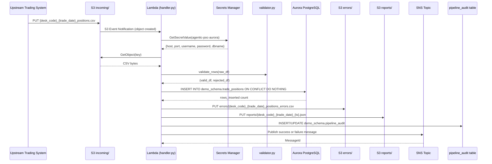
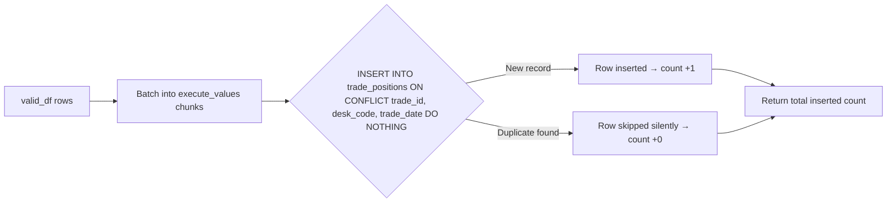
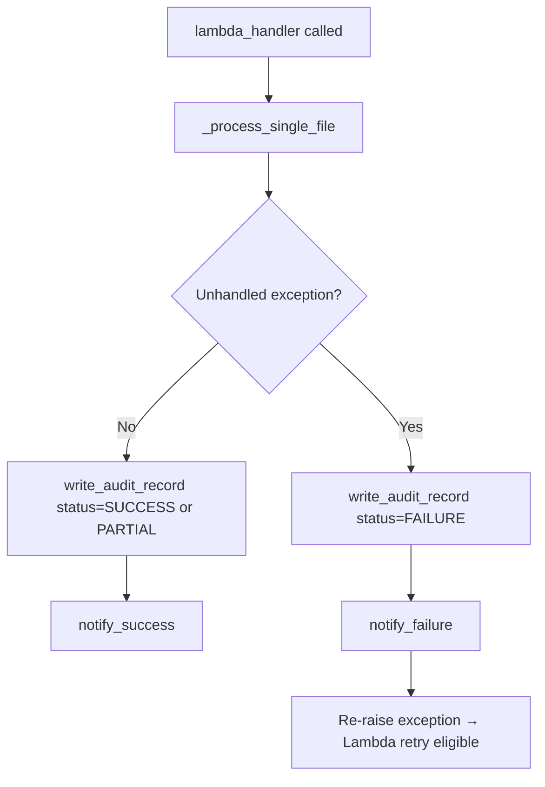

# Technical Design Document

**Daily Trade Position Ingestion**
**Enterprise Risk Data Platform**
**Repo:** nartcr/agentic-poc-sandbox
**Change Type:** New Feature
**Date:** June 2026

---

## COMPONENTS

### `src/ingestion/secrets.py`

**What it does:** Retrieves database credentials from AWS Secrets Manager at runtime. Exposes a single function that returns a parsed credentials dictionary. Never caches secrets to disk or logs them.

**Inputs:** `os.environ["DB_SECRET_ID"]` (maps to `agentic-poc-aurora`)

**Function signature:**
```
get_db_credentials() -> dict
  Returns: {"host": str, "port": int, "username": str, "password": str, "dbname": str}
```

**Reads:** Secrets Manager secret identified by `os.environ["DB_SECRET_ID"]`

**Writes:** Nothing persisted. Returns dict in memory only.

**Satisfies:** BAC-8 (no secrets in code or config)

---

### `src/ingestion/db.py`

**What it does:** Manages PostgreSQL database connections using credentials from `secrets.py`. Exposes a context manager `get_connection()` that yields a `psycopg2` connection. All connections use SSL. Connection parameters sourced exclusively from the secrets dict.

**Function signatures:**
```
get_connection() -> ContextManager[psycopg2.connection]
  Uses: secrets.get_db_credentials()
  SSL: sslmode="require"
```

**Reads:** Credentials dict from `secrets.get_db_credentials()`

**Writes:** Nothing. Connection management only.

**Satisfies:** BAC-8 (credential hygiene)

---

### `src/ingestion/validator.py`

**What it does:** Validates each row of an incoming trade position DataFrame. Applies field-presence checks and type/format checks for all mandatory fields. Returns two DataFrames: validated rows and rejected rows with rejection reasons appended.

**Mandatory fields validated:**
- `trade_id`: non-null, non-empty string
- `desk_code`: non-null, non-empty string; must match pattern `^[A-Z0-9_]+$`
- `trade_date`: non-null, parseable as `YYYY-MM-DD` date
- `instrument_type`: non-null, non-empty string
- `notional_amount`: non-null, parseable as a positive numeric value (float > 0)
- `currency`: non-null, exactly 3 uppercase alpha characters (ISO 4217 pattern)
- `counterparty_id`: non-null, non-empty string

**Function signatures:**
```
validate_rows(df: pd.DataFrame) -> tuple[pd.DataFrame, pd.DataFrame]
  Returns: (valid_df, rejected_df)
  rejected_df has all original columns plus: rejection_reason (str)

_check_missing(row: pd.Series, field: str) -> str | None
_check_trade_date_format(value: str) -> str | None
_check_notional_amount(value: str) -> str | None
_check_currency_format(value: str) -> str | None
_check_desk_code_format(value: str) -> str | None
```

**Reads:** `pd.DataFrame` with columns: `trade_id`, `desk_code`, `trade_date`, `instrument_type`, `notional_amount`, `currency`, `counterparty_id` (plus any extra columns in the file, which are passed through but not validated)

**Writes:**
- `valid_df`: same schema as input, rows that passed all checks
- `rejected_df`: same schema as input + column `rejection_reason: str` describing the first failing rule for that row

**Satisfies:** BAC-2 (rejected rows carry clear reasons), BAC-4 (rejection count feeds summary)

---

### `src/ingestion/loader.py`

**What it does:** Loads a validated DataFrame into `demo_schema.trade_positions` using an idempotent `INSERT ... ON CONFLICT (trade_id, desk_code, trade_date) DO NOTHING`. Returns the count of rows actually inserted (i.e., not skipped as duplicates). Uses `psycopg2.extras.execute_values` for batch efficiency.

**Function signatures:**
```
load_positions(valid_df: pd.DataFrame, conn: psycopg2.connection) -> int
  Returns: count of rows inserted (excludes skipped duplicates)

  SQL executed:
    INSERT INTO demo_schema.trade_positions
      (trade_id, desk_code, trade_date, instrument_type,
       notional_amount, currency, counterparty_id, loaded_at)
    VALUES %s
    ON CONFLICT (trade_id, desk_code, trade_date) DO NOTHING
```

**Reads:** `valid_df` with columns matching `demo_schema.trade_positions` schema; `conn` from `db.get_connection()`

**Writes:** Rows into `demo_schema.trade_positions`. `loaded_at` is set to `datetime.now(pytz.timezone("America/Toronto"))` for each batch.

**Returns:** `int` — number of rows inserted (computed as `cursor.rowcount` summed across batches)

**Satisfies:** BAC-1 (positions loaded), BAC-3 (ON CONFLICT dedup prevents double-count), BAC-6 (batch insert for performance)

---

### `src/ingestion/reporter.py`

**What it does:** Produces the post-load JSON summary report and writes it to S3 under `reports/`. Computes all required statistics from the raw input DataFrame, the valid DataFrame, and the rejected DataFrame.

**Function signatures:**
```
build_summary(
    source_key: str,
    raw_df: pd.DataFrame,
    valid_df: pd.DataFrame,
    rejected_df: pd.DataFrame,
    rows_inserted: int,
    processed_at: datetime  # ET-aware datetime
) -> dict

write_report(summary: dict, s3_client, bucket: str, report_key: str) -> None
  Serializes summary dict as JSON and writes to s3://bucket/report_key

_compute_null_rates(df: pd.DataFrame) -> dict[str, float]
  Returns: {column_name: null_fraction} for all columns in df

_compute_desk_counts(df: pd.DataFrame) -> dict[str, int]
  Returns: {desk_code: row_count}
```

**Summary dict schema (written to S3):**
```json
{
  "source_file": "<S3 key of input file>",
  "processed_at": "<ISO8601 datetime in ET>",
  "total_rows_received": <int>,
  "rows_loaded": <int>,
  "rows_rejected": <int>,
  "rows_skipped_duplicate": <int>,
  "desk_counts": {"<desk_code>": <int>, ...},
  "min_notional": <float>,
  "max_notional": <float>,
  "null_rates": {"<column>": <float>, ...}
}
```

**Reads:**
- `raw_df`: full parsed file DataFrame (all rows)
- `valid_df`: validated rows
- `rejected_df`: rejected rows with `rejection_reason`
- `rows_inserted`: int returned by `loader.load_positions()`
- `processed_at`: `datetime` in `America/Toronto` timezone

**Writes:** JSON object to `s3://os.environ["S3_BUCKET"]/reports/{desk_code}_{trade_date}_{processed_at_ts}.json`

**Satisfies:** BAC-4 (accurate summary), BAC-7 (ET timestamps)

---

### `src/ingestion/error_writer.py`

**What it does:** Writes the rejected rows DataFrame to S3 as a CSV under `errors/`. The output file includes all original columns plus `rejection_reason`. Uses the source filename to derive the error file name.

**Function signatures:**
```
write_error_file(
    rejected_df: pd.DataFrame,
    s3_client,
    bucket: str,
    source_key: str
) -> str
  Returns: S3 key of the written error file
  Output key: errors/{desk_code}_{trade_date}_positions_errors.csv
  (derived by replacing "incoming/" prefix with "errors/" and inserting "_errors" before ".csv")
```

**Reads:** `rejected_df` with all original columns + `rejection_reason`

**Writes:** CSV to `s3://os.environ["S3_BUCKET"]/errors/{desk_code}_{trade_date}_positions_errors.csv`

**Satisfies:** BAC-2 (error file with rejection reasons accessible to operations team)

---

### `src/ingestion/notifier.py`

**What it does:** Publishes SNS notifications on processing success or failure. Success message includes summary statistics. Failure message includes error details and source file key. All messages are JSON-serialized.

**Function signatures:**
```
notify_success(summary: dict, sns_client, topic_arn: str) -> None
  Publishes summary dict as JSON to SNS topic
  Subject: "Trade Position Ingestion Succeeded: {source_file}"

notify_failure(
    source_key: str,
    error_message: str,
    sns_client,
    topic_arn: str
) -> None
  Publishes failure JSON to SNS topic
  Subject: "Trade Position Ingestion Failed: {source_key}"
```

**SNS Message formats:** See DATA CONTRACTS section.

**Reads:** `os.environ["SNS_TOPIC_ARN"]`

**Writes:** SNS message to topic

**Satisfies:** BAC-5 (automatic downstream notification, no manual trigger)

---

### `src/ingestion/audit.py`

**What it does:** Writes one row to `demo_schema.pipeline_audit` for each file processed, capturing the full processing outcome. Called after all processing completes (success or failure). Uses `INSERT ... ON CONFLICT (source_file) DO UPDATE` to allow re-runs to update the audit record.

**Function signatures:**
```
write_audit_record(
    conn: psycopg2.connection,
    source_file: str,
    status: str,           # "SUCCESS" | "FAILURE" | "PARTIAL"
    total_rows: int,
    rows_loaded: int,
    rows_rejected: int,
    rows_skipped: int,
    error_message: str | None,
    processed_at: datetime  # ET-aware
) -> None

  SQL executed:
    INSERT INTO demo_schema.pipeline_audit
      (source_file, status, total_rows, rows_loaded,
       rows_rejected, rows_skipped, error_message, processed_at)
    VALUES (%(source_file)s, %(status)s, ...)
    ON CONFLICT (source_file) DO UPDATE SET
      status = EXCLUDED.status,
      total_rows = EXCLUDED.total_rows,
      rows_loaded = EXCLUDED.rows_loaded,
      rows_rejected = EXCLUDED.rows_rejected,
      rows_skipped = EXCLUDED.rows_skipped,
      error_message = EXCLUDED.error_message,
      processed_at = EXCLUDED.processed_at
```

**Reads:** Arguments as listed above.

**Writes:** One row to `demo_schema.pipeline_audit`.

**Satisfies:** BAC-7 (ET timestamps in audit), regulatory audit trail (NFR 3.3)

---

### `src/ingestion/file_reader.py`

**What it does:** Downloads a CSV file from S3, parses it into a pandas DataFrame, and validates that the filename matches the expected naming convention `{desk_code}_{trade_date}_positions.csv`. Extracts `desk_code` and `trade_date` from the filename and returns them alongside the DataFrame.

**Function signatures:**
```
read_position_file(
    s3_client,
    bucket: str,
    key: str
) -> tuple[pd.DataFrame, str, str]
  Returns: (raw_df, desk_code, trade_date)
  Raises: ValueError if filename does not match expected pattern
  Raises: ValueError if file is empty (zero data rows)

_parse_filename(key: str) -> tuple[str, str]
  Extracts (desk_code, trade_date) from key using regex:
  Pattern: r"incoming/([A-Z0-9_]+)_(\d{4}-\d{2}-\d{2})_positions\.csv$"
  Raises: ValueError with message "Filename does not match expected pattern: {key}"
```

**Reads:** S3 object at `s3://bucket/key`, expected CSV with header row containing at minimum the 7 mandatory columns.

**Writes:** Nothing to persistent storage.

**Satisfies:** BAC-1, BAC-6

---

### `src/ingestion/handler.py`

**What it does:** AWS Lambda entry point. Receives an S3 event trigger, orchestrates the full pipeline (read → validate → load → report → audit → notify), and returns a structured response. Handles all unhandled exceptions by invoking `notify_failure` and writing a FAILURE audit record before re-raising.

**Function signature:**
```
lambda_handler(event: dict, context: object) -> dict
  Input: S3 event notification (Records[].s3.bucket.name, Records[].s3.object.key)
  Returns: {"statusCode": 200, "body": <summary_json_string>} on success
           {"statusCode": 500, "body": <error_json_string>} on failure

_process_single_file(s3_key: str, s3_client, sns_client, conn) -> dict
  Orchestrates: file_reader → validator → loader → error_writer → reporter → audit → notifier
  Returns: summary dict
```

**Reads:**
- S3 event payload (`event["Records"][0]["s3"]["object"]["key"]`, `event["Records"][0]["s3"]["bucket"]["name"]`)
- `os.environ["S3_BUCKET"]`
- `os.environ["DB_SECRET_ID"]`
- `os.environ["SNS_TOPIC_ARN"]`

**Writes:** Delegates to all other modules. Returns HTTP-style response dict.

**Satisfies:** BAC-1 through BAC-8 (orchestration of all components)

---

### `src/ingestion/schema.sql`

**What it does:** DDL script to create `demo_schema.trade_positions` and `demo_schema.pipeline_audit` tables if they do not exist. Run once during deployment. Not executed by the Lambda function.

**Satisfies:** Data contract definition for all BACs.

---

### `tests/test_validator.py`

Unit tests for `validator.validate_rows()` covering: all 7 mandatory fields missing, malformed `trade_date`, negative `notional_amount`, invalid `currency` format, valid row passes all checks, mixed valid/invalid rows produce correct split counts.

### `tests/test_loader.py`

Unit tests for `loader.load_positions()` using a test database connection: insert new rows returns correct count, re-insert same rows returns 0 (ON CONFLICT), mixed new+duplicate returns count of only new rows.

### `tests/test_reporter.py`

Unit tests for `reporter.build_summary()`: verifies all required keys present in output dict, `processed_at` is ET timezone-aware, `desk_counts` sums correctly, `null_rates` computed correctly for columns with known nulls.

### `tests/test_handler.py`

Integration-style tests for `handler.lambda_handler()` using mocked S3, SNS, and database: success path produces 200, failure path produces 500 and triggers `notify_failure`, re-processing same file produces 0 new rows loaded.

---

## AWS SERVICES

| Service | Role |
|---|---|
| **AWS Lambda** | Compute host for the ingestion pipeline. Triggered by S3 event notifications when a file lands in `incoming/`. Function name: `agentic-poc-sandbox-qa` |
| **Amazon S3** | Storage for input files (`incoming/`), error files (`errors/`), and summary reports (`reports/`). Bucket: `os.environ["S3_BUCKET"]` |
| **Amazon RDS Aurora (PostgreSQL)** | Target reporting database. Hosts `demo_schema.trade_positions` and `demo_schema.pipeline_audit`. Credentials stored in Secrets Manager. |
| **AWS Secrets Manager** | Secure store for database credentials. Secret ID: `os.environ["DB_SECRET_ID"]` (maps to `agentic-poc-aurora`). No credentials in code or config. |
| **Amazon SNS** | Publishes success and failure notifications to downstream subscribers (risk calculation pipeline). Topic ARN: `os.environ["SNS_TOPIC_ARN"]` |

---

## DATA CONTRACTS

### Database Tables

#### `demo_schema.trade_positions`

```
Table: demo_schema.trade_positions

Column             | Type                         | Nullable | Notes
-------------------|------------------------------|----------|----------------------------------
trade_id           | VARCHAR(100)                 | NOT NULL |
desk_code          | VARCHAR(50)                  | NOT NULL |
trade_date         | DATE                         | NOT NULL |
instrument_type    | VARCHAR(100)                 | NOT NULL |
notional_amount    | NUMERIC(24, 6)               | NOT NULL |
currency           | CHAR(3)                      | NOT NULL |
counterparty_id    | VARCHAR(100)                 | NOT NULL |
loaded_at          | TIMESTAMP WITH TIME ZONE     | NOT NULL | Set at insert time (ET)

PRIMARY KEY: (trade_id, desk_code, trade_date)
UNIQUE CONSTRAINT: uc_trade_positions_dedup ON (trade_id, desk_code, trade_date)
INDEX: idx_trade_positions_desk_date ON (desk_code, trade_date)
INDEX: idx_trade_positions_trade_date ON (trade_date)
```

#### `demo_schema.pipeline_audit`

```
Table: demo_schema.pipeline_audit

Column         | Type                         | Nullable | Notes
---------------|------------------------------|----------|----------------------------------
audit_id       | SERIAL                       | NOT NULL | Auto-increment
source_file    | VARCHAR(500)                 | NOT NULL | S3 key of processed file
status         | VARCHAR(20)                  | NOT NULL | "SUCCESS" | "FAILURE" | "PARTIAL"
total_rows     | INTEGER                      | NOT NULL |
rows_loaded    | INTEGER                      | NOT NULL |
rows_rejected  | INTEGER                      | NOT NULL |
rows_skipped   | INTEGER                      | NOT NULL | Duplicate rows skipped
error_message  | TEXT                         | NULL     | Populated on FAILURE
processed_at   | TIMESTAMP WITH TIME ZONE     | NOT NULL | ET timezone

PRIMARY KEY: (audit_id)
UNIQUE CONSTRAINT: uc_pipeline_audit_source_file ON (source_file)
INDEX: idx_pipeline_audit_processed_at ON (processed_at)
```

---

### S3 Paths

| Path Pattern | Format | Description |
|---|---|---|
| `s3://os.environ["S3_BUCKET"]/incoming/{desk_code}_{trade_date}_positions.csv` | CSV, UTF-8, header row required | Input file deposited by upstream trading system. `trade_date` format: `YYYY-MM-DD`. |
| `s3://os.environ["S3_BUCKET"]/errors/{desk_code}_{trade_date}_positions_errors.csv` | CSV, UTF-8, header row | Rejected rows with appended `rejection_reason` column. Written by `error_writer.py`. |
| `s3://os.environ["S3_BUCKET"]/reports/{desk_code}_{trade_date}_{processed_at_ts}.json` | JSON | Post-load summary report. `processed_at_ts` formatted as `YYYYMMDDTHHMMSS` in ET. |

**Input CSV expected columns (header row, order not enforced):**
`trade_id`, `desk_code`, `trade_date`, `instrument_type`, `notional_amount`, `currency`, `counterparty_id`

Additional columns in the file are read and passed through to the error file but are not loaded into the database.

---

### Secrets Manager

**Env var:** `os.environ["DB_SECRET_ID"]` = `agentic-poc-aurora`

**Expected JSON structure inside the secret:**
```json
{
  "host": "<aurora-cluster-endpoint>",
  "port": 5432,
  "username": "<db-username>",
  "password": "<db-password>",
  "dbname": "app"
}
```

---

### SNS Message Formats

**Env var:** `os.environ["SNS_TOPIC_ARN"]`

**Success message (published by `notifier.notify_success`):**
```json
{
  "event_type": "TRADE_INGESTION_SUCCESS",
  "source_file": "incoming/DESK01_2026-06-15_positions.csv",
  "processed_at": "2026-06-15T19:45:00-04:00",
  "total_rows_received": 5000,
  "rows_loaded": 4990,
  "rows_rejected": 10,
  "rows_skipped_duplicate": 0,
  "desk_counts": {"DESK01": 4990},
  "min_notional": 1000.00,
  "max_notional": 50000000.00,
  "report_s3_key": "reports/DESK01_2026-06-15_20260615T194500.json"
}
```

**Failure message (published by `notifier.notify_failure`):**
```json
{
  "event_type": "TRADE_INGESTION_FAILURE",
  "source_file": "incoming/DESK01_2026-06-15_positions.csv",
  "failed_at": "2026-06-15T19:45:00-04:00",
  "error_message": "<exception class and message>"
}
```

---

### Environment Variables Summary

| Variable | Description |
|---|---|
| `S3_BUCKET` | S3 bucket name (`agentic-poc-data-533266968934`) |
| `DB_SECRET_ID` | Secrets Manager secret ID (`agentic-poc-aurora`) |
| `SNS_TOPIC_ARN` | ARN of the SNS topic for downstream notifications |

---

## DATA FLOW

### End-to-End Pipeline Flow



---

### Validation Decision Logic

```mermaid
flowchart TD
    A[Read CSV row] --> B{trade_id non-null & non-empty?}
    B -- No --> R[Reject: missing trade_id]
    B -- Yes --> C{desk_code non-null & matches ^[A-Z0-9_]+$?}
    C -- No --> R2[Reject: missing/malformed desk_code]
    C -- Yes --> D{trade_date non-null & YYYY-MM-DD?}
    D -- No --> R3[Reject: missing/malformed trade_date]
    D -- Yes --> E{instrument_type non-null & non-empty?}
    E -- No --> R4[Reject: missing instrument_type]
    E -- Yes --> F{notional_amount non-null & numeric & > 0?}
    F -- No --> R5[Reject: missing/malformed notional_amount]
    F -- Yes --> G{currency non-null & 3 uppercase alpha?}
    G -- No --> R6[Reject: missing/malformed currency]
    G -- Yes --> H{counterparty_id non-null & non-empty?}
    H -- No --> R7[Reject: missing counterparty_id]
    H -- Yes --> V[Accept: add to valid_df]
    R & R2 & R3 & R4 & R5 & R6 & R7 --> REJ[Add to rejected_df with rejection_reason]
```

---

### Idempotent Load Logic



---

### Error Handling & Audit Trail



---

## TECHNICAL ACCEPTANCE CRITERIA

### TAC-1: All valid positions loaded before next morning's risk run

**Mechanism:** `loader.load_positions()` executes a batched `INSERT INTO demo_schema.trade_positions ... ON CONFLICT (trade_id, desk_code, trade_date) DO NOTHING` via `psycopg2.extras.execute_values`. The Lambda function is triggered synchronously by the S3 event at file drop time (6–8 PM ET). The `pipeline_audit` row with `status = "SUCCESS"` is the queryable evidence that the load completed.

**Test assertion:** After `lambda_handler` returns `{"statusCode": 200, ...}`, a `SELECT COUNT(*)` from `demo_schema.trade_positions WHERE desk_code = :desk AND trade_date = :date` returns a count equal to the number of valid rows in the input file.

---

### TAC-2: Rejected rows flagged with clear reasons

**Mechanism:** `validator.validate_rows()` appends a `rejection_reason` string column to the rejected DataFrame. `error_writer.write_error_file()` writes this DataFrame as CSV to `s3://S3_BUCKET/errors/{desk_code}_{trade_date}_positions_errors.csv`. The rejection reason is set on the first failing field check per row using a message of the form `"missing/malformed {field_name}: {value}"`.

**Test assertion:** For a test input containing rows with known defects (e.g., null `trade_id`, non-numeric `notional_amount`), the output error CSV contains exactly those rows, and the `rejection_reason` column value for each contains the name of the failing field.

---

### TAC-3: Resubmission does not double-count positions

**Mechanism:** `INSERT INTO demo_schema.trade_positions (trade_id, desk_code, trade_date, ...) VALUES %s ON CONFLICT (trade_id, desk_code, trade_date) DO NOTHING`. The unique constraint `uc_trade_positions_dedup` on `(trade_id, desk_code, trade_date)` enforces deduplication at the database level.

**Test assertion:** Run `lambda_handler` twice with the identical input file. After the first run, record `COUNT(*)` from `demo_schema.trade_positions WHERE trade_date = :date AND desk_code = :desk`. After the second run, assert the count is identical. Assert `rows_loaded` in the second run's audit record equals 0.

---

### TAC-4: Summary accurately reflects received, accepted, and rejected counts

**Mechanism:** `reporter.build_summary()` computes:
- `total_rows_received = len(raw_df)`
- `rows_loaded = rows_inserted` (from `loader.load_positions()` return value)
- `rows_rejected = len(rejected_df)`
- `rows_skipped_duplicate = len(valid_df) - rows_inserted`
- `desk_counts`: `valid_df.groupby("desk_code").size().to_dict()`
- `min_notional` / `max_notional`: `valid_df["notional_amount"].astype(float).min()/.max()`
- `null_rates`: per-column fraction of nulls across `raw_df`

**Test assertion:** Given a known input of 100 rows (80 valid, 20 invalid, 5 valid duplicates already in DB), the summary JSON must have `total_rows_received=100`, `rows_rejected=20`, `rows_loaded=75`, `rows_skipped_duplicate=5`. The report JSON stored in S3 must be fetchable and deserializable with those exact values.

---

### TAC-5: Risk pipeline notified automatically on completion

**Mechanism:** `notifier.notify_success()` calls `sns_client.publish(TopicArn=os.environ["SNS_TOPIC_ARN"], Message=json.dumps(summary), Subject=...)` unconditionally after a successful `_process_single_file()`. `notifier.notify_failure()` is called in the exception handler. Both are called from `handler.lambda_handler` with no conditional logic that could suppress them.

**Test assertion:** Using a mocked SNS client, assert that after `lambda_handler` processes a valid file, `sns_client.publish` is called exactly once with `Message` containing `"event_type": "TRADE_INGESTION_SUCCESS"` and `TopicArn` equal to the mocked `SNS_TOPIC_ARN`. For a file that raises an exception, assert `sns_client.publish` is called with `"event_type": "TRADE_INGESTION_FAILURE"`.

---

### TAC-6: Processing completes within 60 seconds for 10,000-row file

**Mechanism:** `loader.load_positions()` uses `psycopg2.extras.execute_values` with a batch size of 1,000 rows per statement (10 batches for 10,000 rows). Validation uses vectorized pandas operations (no Python-level row loops where avoidable).

**Test assertion:** A performance test with a synthetic 10,000-row CSV file must complete `lambda_handler` end-to-end (excluding cold start) in under 60 seconds as measured by wall clock time. The test environment must use a real database connection (not mocked) to capture actual insert latency. A 100,000-row file must complete without `MemoryError` or unhandled exception.

---

### TAC-7: All timestamps in Eastern Time (America/Toronto)

**Mechanism:**
- `loader.load_positions()` sets `loaded_at = datetime.now(pytz.timezone("America/Toronto"))`
- `reporter.build_summary()` sets `processed_at` using `datetime.now(pytz.timezone("America/Toronto")).isoformat()`
- `audit.write_audit_record()` sets `processed_at` using `datetime.now(pytz.timezone("America/Toronto"))`
- All SNS messages use the same ET-aware datetime

**Test assertion:** After processing, fetch the `processed_at` column from `demo_schema.pipeline_audit` for the processed file. Assert the `utcoffset()` of the stored timestamp is either `-04:00` (EDT) or `-05:00` (EST). Assert the `processed_at` field in the S3 report JSON is a valid ISO8601 string with a UTC offset (not `Z` / UTC). Assert `loaded_at` in `demo_schema.trade_positions` for inserted rows is timezone-aware and has an Eastern offset.

---

### TAC-8: No secrets in code or config files

**Mechanism:** `secrets.get_db_credentials()` calls `boto3.client("secretsmanager").get_secret_value(SecretId=os.environ["DB_SECRET_ID"])` at runtime. No connection strings, passwords, or tokens appear anywhere in source files. `db.get_connection()` receives the credentials dict from `secrets.get_db_credentials()` and never constructs a DSN from hardcoded values.

**Test assertion:** A static analysis scan (e.g., `grep` or `truffleHog` equivalent) of the entire repository must return zero matches for patterns resembling passwords, connection strings, or secret values. The `DB_SECRET_ID`, `S3_BUCKET`, and `SNS_TOPIC_ARN` values must only appear as `os.environ[...]` references in source code, not as string literals.

---

## OPEN QUESTIONS

**OQ-1: Partial-success status definition**

If a file contains both valid and invalid rows (the common case), should the `pipeline_audit.status` be recorded as `"SUCCESS"` (load completed, some rows rejected is expected) or `"PARTIAL"` (to indicate not all rows were accepted)?

The `"PARTIAL"` status is included in the design, but the business rule for when to apply it is ambiguous: is any rejection count > 0 a partial success, or is there a threshold (e.g., rejection rate > 10%)? This affects what triggers `notify_failure` vs `notify_success`.

**OQ-2: Error file behavior on resubmission**

When a corrected file is resubmitted (same `{desk_code}_{trade_date}` key), should the error file in `errors/` be overwritten with the new run's rejections, or appended to, or written with a timestamped key? The current design overwrites (same key derived from filename). Confirm this is acceptable.

**OQ-3: Notional amount sign convention**

The validator rejects `notional_amount <= 0`. Some trading systems represent short positions as negative notional. Confirm that negative notional values should be rejected (not loaded) rather than accepted as valid short position notionals.

---

## ASSUMPTIONS

| # | Assumption | Impact if Wrong |
|---|---|---|
| A-1 | The Lambda function `agentic-poc-sandbox-qa` is configured with an S3 trigger on the `incoming/` prefix of bucket `agentic-poc-data-533266968934`. The Coding Agent does not configure this trigger. | Handler will never execute if trigger is not configured. |
| A-2 | The Aurora PostgreSQL cluster is accessible from the Lambda function's VPC/network configuration. No additional networking changes are needed. | All database operations will fail with a connection timeout. |
| A-3 | The `demo_schema` schema and the two tables (`trade_positions`, `pipeline_audit`) do not yet exist and will be created by running `schema.sql` as a one-time deployment step before the Lambda is invoked. | If tables already exist with a different schema, DDL may need to be adapted. |
| A-4 | The SNS topic referenced by `os.environ["SNS_TOPIC_ARN"]` already exists and the Lambda's IAM execution role has `sns:Publish` permission on it. | `notify_success` and `notify_failure` will throw `AccessDeniedException`. |
| A-5 | One S3 event = one file = one Lambda invocation. Files are never split across multiple S3 objects. | `handler.py` processes only `Records[0]`; batched events with multiple records would require iteration. |
| A-6 | The `desk_code` embedded in the filename is authoritative. If a row's `desk_code` column value differs from the filename, the row-level `desk_code` field is used for validation and loading (the filename-derived value is used only for file routing and audit). | Could cause desk_count groupings to include codes not matching the expected desk. |
| A-7 | Input CSV files are UTF-8 encoded with a standard comma delimiter and a single header row as the first line. No quoted multi-line fields. | Parser will produce incorrect columns or fail on encoding errors. |
| A-8 | `notional_amount <= 0` is invalid (short positions are out of scope). This is captured in OQ-3 above as a question, but the implementation defaults to rejecting non-positive values until confirmed otherwise. | Valid short positions will be rejected and require resubmission after design clarification. |
| A-9 | The Lambda runtime is Python 3.11. Dependencies (`pandas`, `psycopg2-binary`, `pytz`) are packaged in a Lambda Layer or included in the deployment package. | Import errors at cold start if dependencies are absent. |
| A-10 | `pipeline_audit` status is `"SUCCESS"` when all rows processed without an unhandled exception, even if some rows were rejected (rejections are expected operational behavior). `"PARTIAL"` is used when an unhandled exception occurs mid-processing (some rows may have been loaded before the failure). `"FAILURE"` is used when the pipeline fails before any rows are loaded. This interpretation is subject to OQ-1. | Audit status values will not match business expectations for monitoring/alerting. |
| A-11 | The database `dbname` is `app` as specified in the infrastructure config. The schema is `demo_schema`. All SQL references tables as `demo_schema.table_name`. | Queries will fail with "relation not found" if schema or dbname differs. |
| A-12 | Files deposited outside the `incoming/` prefix (e.g., directly in the bucket root) will not trigger the Lambda and are not in scope. | Out-of-convention files will be silently ignored. |