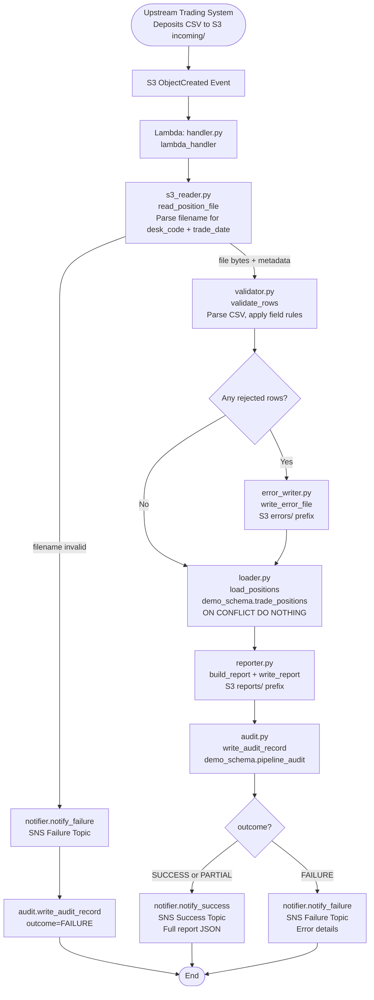
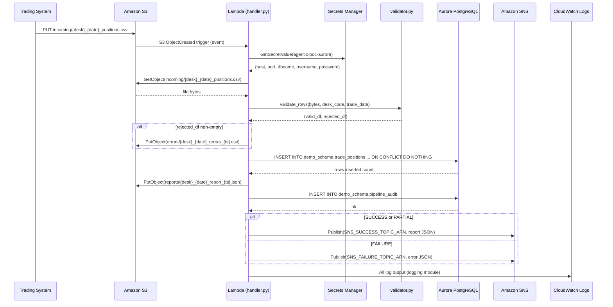
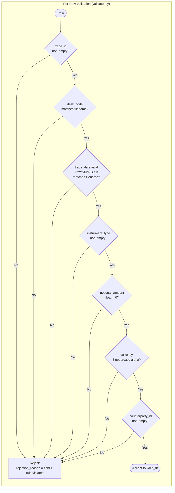

# Technical Design Document

**Daily Trade Position Ingestion**
**Enterprise Risk Data Platform**
**Repo:** `nartcr/agentic-poc-sandbox`
**Change Type:** New Feature
**TDD Version:** 1.0 — June 2026

---

## COMPONENTS

---

### `config.py`

**What it does:** Centralizes all environment variable reads and runtime configuration. Raises `EnvironmentError` at startup if any required environment variable is missing. Does not read secrets — that is delegated to `secrets_manager.py`.

**What it reads:**
- `os.environ["S3_BUCKET"]` → S3 bucket name
- `os.environ["S3_INPUT_PREFIX"]` → input prefix (default: `incoming/`)
- `os.environ["S3_ERROR_PREFIX"]` → error prefix (default: `errors/`)
- `os.environ["S3_REPORT_PREFIX"]` → report prefix (default: `reports/`)
- `os.environ["DB_SECRET_ID"]` → Secrets Manager secret ID for Aurora credentials
- `os.environ["SNS_SUCCESS_TOPIC_ARN"]` → SNS topic ARN for success notifications
- `os.environ["SNS_FAILURE_TOPIC_ARN"]` → SNS topic ARN for failure notifications
- `os.environ["PIPELINE_SERVICE_IDENTITY"]` → string identifier for audit trail (e.g. `"agentic-poc-sandbox"`)

**What it writes:** A `Config` dataclass instance with typed fields corresponding to each env var above.

**Satisfies:** BAC-7 (ET timestamp enforcement), BAC-8 (no hardcoded credentials).

---

### `secrets_manager.py`

**What it does:** Retrieves and parses the Aurora database credential JSON from AWS Secrets Manager at runtime. Caches the result for the lifetime of the Lambda invocation. Never logs credential values.

**Exact function signatures:**
```
def get_db_credentials(secret_id: str) -> dict:
    """
    Calls secretsmanager:GetSecretValue for secret_id.
    Returns parsed JSON dict with keys: host, port, dbname, username, password.
    Raises RuntimeError if secret is missing or malformed.
    """
```

**What it reads:** AWS Secrets Manager secret identified by `os.environ["DB_SECRET_ID"]` (`agentic-poc-aurora`).

**Expected secret JSON keys:** `host`, `port`, `dbname`, `username`, `password`.

**What it writes:** Returns `dict` to caller. No side effects.

**Satisfies:** BAC-8 (credentials retrieved at runtime from secure store, never stored in code).

---

### `s3_reader.py`

**What it does:** Reads a CSV trade position file from S3 and returns its raw content. Validates that the S3 object exists and is non-empty before returning. Returns the raw file bytes and derived metadata (desk_code, trade_date) parsed from the filename using the pattern `{desk_code}_{trade_date}_positions.csv`.

**Exact function signatures:**
```
def read_position_file(bucket: str, key: str) -> tuple[bytes, dict]:
    """
    Downloads object at s3://{bucket}/{key}.
    Parses filename to extract desk_code and trade_date from key
    using regex: r'^incoming/([A-Z0-9]+)_(\d{4}-\d{2}-\d{2})_positions\.csv$'
    Returns (file_bytes, {"desk_code": str, "trade_date": str, "s3_key": str}).
    Raises ValueError if filename does not match expected pattern.
    Raises FileNotFoundError if object does not exist.
    """

def list_unprocessed_files(bucket: str, input_prefix: str) -> list[str]:
    """
    Lists all S3 keys under {bucket}/{input_prefix} matching
    pattern *_positions.csv.
    Returns list of full S3 keys.
    """
```

**What it reads:** S3 bucket `os.environ["S3_BUCKET"]`, prefix `os.environ["S3_INPUT_PREFIX"]` (`incoming/`).

**What it writes:** Returns raw bytes and metadata dict. No S3 writes.

**Satisfies:** BAC-1 (file ingestion from designated location), BAC-6 (automated pipeline).

---

### `validator.py`

**What it does:** Parses CSV bytes into a pandas DataFrame and applies row-level validation rules. Returns two DataFrames: `valid_df` (rows passing all checks) and `rejected_df` (rows failing at least one check, with an added `rejection_reason` column describing the first failure found per row).

**Mandatory fields and validation rules:**

| Field | Type Check | Rule |
|---|---|---|
| `trade_id` | string, non-null, non-empty | Must be non-empty string |
| `desk_code` | string, non-null, non-empty | Must match filename-derived desk_code |
| `trade_date` | string, non-null | Must parse as `YYYY-MM-DD`, must match filename-derived trade_date |
| `instrument_type` | string, non-null, non-empty | Must be non-empty string |
| `notional_amount` | numeric, non-null | Must be parseable as float; must be > 0 |
| `currency` | string, non-null | Must be exactly 3 uppercase alphabetic characters (ISO 4217 format) |
| `counterparty_id` | string, non-null, non-empty | Must be non-empty string |

**Exact function signatures:**
```
def validate_rows(
    raw_bytes: bytes,
    desk_code: str,
    trade_date: str
) -> tuple[pd.DataFrame, pd.DataFrame]:
    """
    Parses raw_bytes as UTF-8 CSV.
    Applies field-level validation to each row.
    Returns (valid_df, rejected_df).
    valid_df columns: trade_id, desk_code, trade_date, instrument_type,
                      notional_amount (float), currency, counterparty_id
    rejected_df columns: all input columns + rejection_reason (str)
    """
```

**What it reads:** Raw CSV bytes from `s3_reader.py`, filename-derived `desk_code` and `trade_date`.

**What it writes:** Two DataFrames returned to caller. No I/O.

**Satisfies:** BAC-2 (invalid records flagged with clear reasons), BAC-4 (accurate row counts).

---

### `error_writer.py`

**What it does:** Writes the rejected rows DataFrame to S3 as a CSV error file. The error file includes all original columns plus a `rejection_reason` column. One error file is written per processed input file.

**S3 key pattern:** `errors/{desk_code}_{trade_date}_positions_errors_{processing_timestamp_et}.csv`
Where `processing_timestamp_et` is formatted as `YYYYMMDDTHHMMSS` in ET.

**Exact function signatures:**
```
def write_error_file(
    bucket: str,
    error_prefix: str,
    rejected_df: pd.DataFrame,
    desk_code: str,
    trade_date: str,
    processing_timestamp: datetime
) -> str:
    """
    Serializes rejected_df to CSV (UTF-8 with BOM for Excel compatibility).
    Uploads to s3://{bucket}/{error_prefix}{desk_code}_{trade_date}_positions_errors_{ts}.csv
    Returns the full S3 key of the written error file.
    Does nothing (returns empty string) if rejected_df is empty.
    """
```

**What it reads:** `rejected_df` from `validator.py`.

**What it writes:** S3 object at `errors/` prefix.

**Satisfies:** BAC-2 (error file accessible to operations team for correction and resubmission).

---

### `loader.py`

**What it does:** Inserts validated rows into `demo_schema.trade_positions` using a batch INSERT with `ON CONFLICT (trade_id, desk_code, trade_date) DO NOTHING`. Connects to Aurora PostgreSQL using credentials from `secrets_manager.py`. Returns the count of net-new rows inserted (i.e., rows that were not skipped due to conflict).

**Exact function signatures:**
```
def load_positions(
    valid_df: pd.DataFrame,
    db_credentials: dict
) -> int:
    """
    Opens a psycopg2 connection to Aurora using db_credentials.
    Executes batched INSERT INTO demo_schema.trade_positions
      (trade_id, desk_code, trade_date, instrument_type,
       notional_amount, currency, counterparty_id)
    VALUES (%s, %s, %s, %s, %s, %s, %s)
    ON CONFLICT (trade_id, desk_code, trade_date) DO NOTHING;
    Uses execute_values for batch performance.
    Commits transaction on success; rolls back on any exception.
    Returns count of rows actually inserted (not skipped).
    Raises RuntimeError wrapping original DB exception on failure.
    """
```

**Row count of actually inserted rows** is computed as:
```
pre_count = SELECT COUNT(*) FROM demo_schema.trade_positions
            WHERE desk_code = %s AND trade_date = %s;
# (run before insert)
post_count = SELECT COUNT(*) FROM demo_schema.trade_positions
             WHERE desk_code = %s AND trade_date = %s;
rows_inserted = post_count - pre_count
```

**What it reads:** `valid_df` from `validator.py`; `db_credentials` from `secrets_manager.py`.

**What it writes:** Rows into `demo_schema.trade_positions`.

**Satisfies:** BAC-1 (positions loaded to DB), BAC-3 (idempotent — no duplicates on resubmission).

---

### `reporter.py`

**What it does:** Computes the post-load summary statistics and writes a JSON report to S3. The report is self-contained and machine-readable for downstream consumption.

**Summary report fields:**

```
{
  "file_name": str,                      // original S3 key
  "desk_code": str,
  "trade_date": str,
  "processing_timestamp_et": str,        // ISO 8601 in ET, e.g. "2026-06-15T20:45:00-04:00"
  "total_rows_received": int,
  "rows_loaded": int,
  "rows_rejected": int,
  "rows_skipped_duplicate": int,         // valid rows not inserted due to conflict
  "counts_by_desk_code": {str: int},     // grouped counts of valid_df by desk_code
  "min_notional_amount": float,
  "max_notional_amount": float,
  "null_rates": {                        // per-column null rate as fraction 0.0–1.0
    "trade_id": float,
    "desk_code": float,
    "trade_date": float,
    "instrument_type": float,
    "notional_amount": float,
    "currency": float,
    "counterparty_id": float
  },
  "error_file_s3_key": str | null        // key of error file, or null if none
}
```

**S3 key pattern:** `reports/{desk_code}_{trade_date}_positions_report_{processing_timestamp_et}.json`
Where timestamp is formatted `YYYYMMDDTHHMMSS` in ET.

**Exact function signatures:**
```
def build_report(
    s3_key: str,
    desk_code: str,
    trade_date: str,
    raw_df: pd.DataFrame,
    valid_df: pd.DataFrame,
    rejected_df: pd.DataFrame,
    rows_loaded: int,
    processing_timestamp: datetime,
    error_file_s3_key: str | None
) -> dict:
    """
    Computes all summary statistics from input DataFrames.
    null_rates computed against raw_df (all received rows, before validation).
    min/max notional computed against valid_df only.
    Returns report dict.
    """

def write_report(
    bucket: str,
    report_prefix: str,
    report: dict,
    desk_code: str,
    trade_date: str,
    processing_timestamp: datetime
) -> str:
    """
    Serializes report dict to JSON (indent=2).
    Uploads to s3://{bucket}/{report_prefix}{desk_code}_{trade_date}_positions_report_{ts}.json
    Returns the full S3 key of the written report.
    """
```

**Satisfies:** BAC-4 (accurate summary of received/accepted/rejected), BAC-7 (ET timestamps).

---

### `audit.py`

**What it does:** Writes one row to `demo_schema.pipeline_audit` for every file processed, capturing the full processing outcome. This satisfies the regulatory audit trail requirement. Uses INSERT with no ON CONFLICT — every processing attempt gets its own audit row (idempotency is not required here; re-runs intentionally produce additional audit rows).

**Exact function signatures:**
```
def write_audit_record(
    db_credentials: dict,
    s3_key: str,
    desk_code: str,
    trade_date: str,
    processing_timestamp: datetime,
    outcome: str,                    // "SUCCESS" | "PARTIAL" | "FAILURE"
    total_rows: int,
    rows_loaded: int,
    rows_rejected: int,
    rows_skipped: int,
    error_message: str | None,
    report_s3_key: str | None,
    error_file_s3_key: str | None,
    service_identity: str
) -> None:
    """
    Inserts one row into demo_schema.pipeline_audit.
    processing_timestamp stored as TIMESTAMPTZ (converted to UTC for storage;
    displayed in ET via application layer — see BAC-7 note).
    Does not raise on failure — logs error and continues.
    """
```

**Outcome logic:**
- `"SUCCESS"` → rows_rejected == 0 and rows_loaded > 0
- `"PARTIAL"` → rows_rejected > 0 and rows_loaded > 0
- `"FAILURE"` → exception raised during processing OR rows_loaded == 0 and total_rows > 0

**Satisfies:** BAC-7 (audit trail in ET-aligned records), NFR 3.3 (complete audit trail for regulatory examination).

---

### `notifier.py`

**What it does:** Publishes SNS messages to the appropriate topic on success or failure. Message body is a JSON-serialized dict. Uses `boto3` SNS client.

**Exact function signatures:**
```
def notify_success(
    topic_arn: str,
    report: dict
) -> None:
    """
    Publishes to SNS topic identified by topic_arn.
    Message subject: "Trade Position Ingestion SUCCESS: {desk_code} {trade_date}"
    Message body: JSON-serialized report dict (same structure as reporter.py output).
    """

def notify_failure(
    topic_arn: str,
    s3_key: str,
    error_message: str,
    processing_timestamp: datetime
) -> None:
    """
    Publishes to SNS topic identified by topic_arn.
    Message subject: "Trade Position Ingestion FAILURE: {s3_key}"
    Message body: JSON with keys:
      file_name, error_message, processing_timestamp_et (ISO 8601 ET)
    """
```

**Satisfies:** BAC-5 (automatic notification to downstream risk pipeline, no manual trigger).

---

### `handler.py`

**What it does:** AWS Lambda entry point. Receives an S3 event trigger (ObjectCreated) from the `incoming/` prefix. Orchestrates the full pipeline for each file in the event: read → validate → load → report → audit → notify. Handles top-level exceptions to ensure failure notifications and audit records are always written.

**Exact function signatures:**
```
def lambda_handler(event: dict, context: object) -> dict:
    """
    Entry point for Lambda invocation triggered by S3 ObjectCreated event.
    Iterates over event["Records"], extracting bucket and key for each record.
    For each record:
      1. Calls s3_reader.read_position_file(bucket, key)
      2. Calls validator.validate_rows(raw_bytes, desk_code, trade_date)
      3. Calls error_writer.write_error_file(...) if rejected_df non-empty
      4. Calls loader.load_positions(valid_df, db_credentials)
      5. Calls reporter.build_report(...) and reporter.write_report(...)
      6. Calls audit.write_audit_record(...)
      7. Calls notifier.notify_success(...) or notifier.notify_failure(...)
    Returns {"statusCode": 200, "processed": [list of processed s3 keys]}
    on full completion, even if some files were PARTIAL outcome.
    Returns {"statusCode": 500, "error": error_message} only if an
    unrecoverable top-level exception prevents all processing.
    """
```

**Processing timestamp:** Set once per file at the start of that file's processing using `datetime.now(pytz.timezone("America/Toronto"))`.

**Satisfies:** BAC-1, BAC-2, BAC-3, BAC-4, BAC-5, BAC-6, BAC-7, BAC-8 (orchestration layer).

---

### `requirements.txt`

Lists Python dependencies:
- `boto3` — AWS SDK (S3, Secrets Manager, SNS)
- `psycopg2-binary` — PostgreSQL driver
- `pandas` — DataFrame processing and validation
- `pytz` — Eastern Time timezone handling

---

## AWS SERVICES

| Service | Role |
|---|---|
| **AWS Lambda** | Compute platform. Function `agentic-poc-sandbox-qa` executes the full pipeline per S3 event trigger. |
| **Amazon S3** | Persistent file storage. Bucket `agentic-poc-data-533266968934` holds input files (`incoming/`), error files (`errors/`), and summary reports (`reports/`). S3 ObjectCreated events trigger the Lambda. |
| **Amazon Aurora PostgreSQL** | Reporting database. Stores validated trade positions in `demo_schema.trade_positions` and audit records in `demo_schema.pipeline_audit`. Database name: `app`. |
| **AWS Secrets Manager** | Secure credential store. Secret `agentic-poc-aurora` stores Aurora connection credentials. Retrieved at runtime; never stored in code. |
| **Amazon SNS** | Notification bus. Two topics: one for success notifications to downstream risk pipeline, one for failure alerts to operations team. |
| **Amazon CloudWatch Logs** | Log destination for all Lambda `logging` output. Provides operational visibility and debugging capability. |

---

## DATA CONTRACTS

### Database Tables

#### `demo_schema.trade_positions`

```
Table: demo_schema.trade_positions

Column              Data Type           Nullable    Notes
------------------  ------------------  ----------  ----------------------------
id                  BIGSERIAL           NOT NULL    Internal surrogate PK
trade_id            VARCHAR(100)        NOT NULL    Business identifier
desk_code           VARCHAR(50)         NOT NULL    Trading desk code
trade_date          DATE                NOT NULL    Trading day (YYYY-MM-DD)
instrument_type     VARCHAR(100)        NOT NULL
notional_amount     NUMERIC(20, 4)      NOT NULL    Must be > 0
currency            CHAR(3)             NOT NULL    ISO 4217
counterparty_id     VARCHAR(100)        NOT NULL
loaded_at           TIMESTAMPTZ         NOT NULL    DEFAULT NOW() — insert time

PRIMARY KEY: id
UNIQUE CONSTRAINT: uq_trade_positions_dedup (trade_id, desk_code, trade_date)
INDEX: idx_trade_positions_desk_date ON (desk_code, trade_date)
```

#### `demo_schema.pipeline_audit`

```
Table: demo_schema.pipeline_audit

Column                  Data Type           Nullable    Notes
----------------------  ------------------  ----------  ----------------------------
id                      BIGSERIAL           NOT NULL    Internal surrogate PK
s3_key                  VARCHAR(500)        NOT NULL    Full S3 key of processed file
desk_code               VARCHAR(50)         NOT NULL
trade_date              DATE                NOT NULL
processing_timestamp    TIMESTAMPTZ         NOT NULL    Stored as UTC; displayed in ET
outcome                 VARCHAR(10)         NOT NULL    'SUCCESS' | 'PARTIAL' | 'FAILURE'
total_rows              INTEGER             NOT NULL
rows_loaded             INTEGER             NOT NULL
rows_rejected           INTEGER             NOT NULL
rows_skipped_duplicate  INTEGER             NOT NULL
error_message           TEXT                NULL        Populated on FAILURE
report_s3_key           VARCHAR(500)        NULL        S3 key of the written report
error_file_s3_key       VARCHAR(500)        NULL        S3 key of the error file
service_identity        VARCHAR(200)        NOT NULL    From PIPELINE_SERVICE_IDENTITY env var
created_at              TIMESTAMPTZ         NOT NULL    DEFAULT NOW()

PRIMARY KEY: id
INDEX: idx_pipeline_audit_desk_date ON (desk_code, trade_date)
INDEX: idx_pipeline_audit_outcome ON (outcome)
```

---

### S3 Paths

```
Bucket: os.environ["S3_BUCKET"]   (value: agentic-poc-data-533266968934)

Input files (trigger):
  Key pattern:  incoming/{desk_code}_{trade_date}_positions.csv
  Example:      incoming/EQDESK_2026-06-15_positions.csv
  Format:       UTF-8 CSV with header row
  Required columns: trade_id, desk_code, trade_date, instrument_type,
                    notional_amount, currency, counterparty_id
  Additional columns: permitted and passed through to error file; ignored for loading

Error files (written by pipeline):
  Key pattern:  errors/{desk_code}_{trade_date}_positions_errors_{YYYYMMDDTHHMMSS}.csv
  Example:      errors/EQDESK_2026-06-15_positions_errors_20260615T204512.csv
  Format:       UTF-8 CSV with BOM; all original columns + rejection_reason column

Report files (written by pipeline):
  Key pattern:  reports/{desk_code}_{trade_date}_positions_report_{YYYYMMDDTHHMMSS}.json
  Example:      reports/EQDESK_2026-06-15_positions_report_20260615T204513.json
  Format:       UTF-8 JSON, indent=2
```

---

### Secrets Manager

```
Secret ID:   agentic-poc-aurora
Env var:     os.environ["DB_SECRET_ID"]

Expected JSON keys inside secret:
{
  "host":     "string",   // Aurora cluster endpoint
  "port":     "integer",  // typically 5432
  "dbname":   "string",   // "app"
  "username": "string",
  "password": "string"
}
```

---

### SNS Topics

```
Success Topic:
  Env var:        os.environ["SNS_SUCCESS_TOPIC_ARN"]
  Subject:        "Trade Position Ingestion SUCCESS: {desk_code} {trade_date}"
  Message body:   JSON — full report dict (see reporter.py output schema above)

Failure Topic:
  Env var:        os.environ["SNS_FAILURE_TOPIC_ARN"]
  Subject:        "Trade Position Ingestion FAILURE: {s3_key}"
  Message body:   JSON:
  {
    "file_name":                 "string",   // S3 key
    "error_message":             "string",
    "processing_timestamp_et":   "string"    // ISO 8601 with ET offset
  }
```

---

### Environment Variables Summary

```
Variable Name                  Description
-----------------------------  ---------------------------------------------------
S3_BUCKET                      S3 bucket name
S3_INPUT_PREFIX                Input prefix (incoming/)
S3_ERROR_PREFIX                Error file prefix (errors/)
S3_REPORT_PREFIX               Report file prefix (reports/)
DB_SECRET_ID                   Secrets Manager secret ID for Aurora credentials
SNS_SUCCESS_TOPIC_ARN          SNS ARN for success notifications
SNS_FAILURE_TOPIC_ARN          SNS ARN for failure notifications
PIPELINE_SERVICE_IDENTITY      String identifier written to audit table
```

---

## DATA FLOW

### End-to-End Pipeline Flow



---

### Service Interaction Sequence



---

### Validation Decision Logic



---

### Deduplication Logic (Pseudocode)

```
Algorithm: Idempotent Load

INPUT: valid_df  (columns: trade_id, desk_code, trade_date, instrument_type,
                            notional_amount, currency, counterparty_id)

1. CONNECT to Aurora using credentials from Secrets Manager

2. BEGIN TRANSACTION

3. SELECT COUNT(*) AS pre_count
   FROM demo_schema.trade_positions
   WHERE desk_code = <desk_code> AND trade_date = <trade_date>

4. EXECUTE batch INSERT using psycopg2.extras.execute_values:
     INSERT INTO demo_schema.trade_positions
       (trade_id, desk_code, trade_date, instrument_type,
        notional_amount, currency, counterparty_id)
     VALUES %s
     ON CONFLICT (trade_id, desk_code, trade_date) DO NOTHING

5. SELECT COUNT(*) AS post_count
   FROM demo_schema.trade_positions
   WHERE desk_code = <desk_code> AND trade_date = <trade_date>

6. rows_inserted = post_count - pre_count
   rows_skipped  = len(valid_df) - rows_inserted

7. COMMIT

8. RETURN rows_inserted, rows_skipped

ON EXCEPTION:
   ROLLBACK
   RAISE RuntimeError(original exception)
```

---

## TECHNICAL ACCEPTANCE CRITERIA

**TAC-1: All valid positions loaded before morning risk run**
- `loader.load_positions()` executes `INSERT INTO demo_schema.trade_positions (trade_id, desk_code, trade_date, instrument_type, notional_amount, currency, counterparty_id) VALUES ... ON CONFLICT (trade_id, desk_code, trade_date) DO NOTHING` and commits within the same Lambda invocation.
- Acceptance test: after invoking `lambda_handler` with a 10-row test file, a `SELECT COUNT(*) FROM demo_schema.trade_positions WHERE desk_code = 'TESTDESK' AND trade_date = '2026-06-15'` returns exactly the count of valid rows in the input file.

**TAC-2: Invalid records flagged with clear rejection reasons**
- `validator.validate_rows()` returns a `rejected_df` with a `rejection_reason` column populated for every rejected row. Reason strings must identify the failing field and rule (e.g., `"notional_amount: not a positive number"`, `"currency: must be 3 uppercase alpha characters"`).
- `error_writer.write_error_file()` writes this DataFrame to `s3://os.environ["S3_BUCKET"]/errors/{desk_code}_{trade_date}_positions_errors_{ts}.csv` whenever `len(rejected_df) > 0`.
- Acceptance test: submit a file with 3 intentionally malformed rows (missing `trade_id`, non-numeric `notional_amount`, invalid `currency`). The error CSV in S3 must contain exactly 3 rows, each with a non-empty `rejection_reason` describing the specific field violation.

**TAC-3: Resubmission does not double-count positions**
- `INSERT INTO demo_schema.trade_positions ... ON CONFLICT (trade_id, desk_code, trade_date) DO NOTHING` — the UNIQUE CONSTRAINT `uq_trade_positions_dedup` on `(trade_id, desk_code, trade_date)` enforces deduplication at the database level.
- Acceptance test: call `loader.load_positions()` twice with identical `valid_df`. After the second call, `SELECT COUNT(*) FROM demo_schema.trade_positions WHERE desk_code = X AND trade_date = Y` returns the same count as after the first call. The second call returns `rows_inserted = 0`.

**TAC-4: Summary report accurately reflects received/accepted/rejected counts**
- `reporter.build_report()` computes: `total_rows_received = len(raw_df)`, `rows_loaded = rows_inserted` (from `loader.load_positions()`), `rows_rejected = len(rejected_df)`, `rows_skipped_duplicate = len(valid_df) - rows_inserted`.
- Invariant assertion: `total_rows_received == rows_loaded + rows_rejected + rows_skipped_duplicate` must always hold. If violated, raise `AssertionError` before writing the report.
- `null_rates` computed as `raw_df[col].isnull().mean()` for each of the 7 mandatory columns.
- `min_notional_amount` and `max_notional_amount` computed as `valid_df["notional_amount"].min()` and `.max()` respectively.
- Acceptance test: submit a known file with 10 rows (7 valid, 3 rejected). Report must show `total_rows_received=10`, `rows_loaded=7`, `rows_rejected=3`, `rows_skipped_duplicate=0`. Re-submit same file. Report must show `total_rows_received=10`, `rows_loaded=0`, `rows_skipped_duplicate=7`, `rows_rejected=3`.

**TAC-5: Downstream pipeline automatically notified — no manual trigger**
- `notifier.notify_success()` calls `boto3` SNS `publish()` with `TopicArn = os.environ["SNS_SUCCESS_TOPIC_ARN"]` and the full JSON report as the message body, within the same Lambda invocation, after `loader.load_positions()` and `reporter.write_report()` complete.
- `notifier.notify_failure()` calls SNS `publish()` with `TopicArn = os.environ["SNS_FAILURE_TOPIC_ARN"]` for any unrecoverable exception or `outcome == "FAILURE"`.
- Acceptance test: mock SNS client and assert `publish()` is called exactly once per file processed, with the correct `TopicArn` and a JSON-parseable message body containing `desk_code` and `trade_date`.

**TAC-6: Processing completes within operations window**
- `lambda_handler` must complete processing of a 10,000-row file end-to-end (read + validate + load + report + audit + notify) in under 60 seconds as measured by the Lambda duration metric in CloudWatch.
- Acceptance test: load test with a synthetic 10,000-row CSV. Assert Lambda duration < 60,000 ms. Assert no `TimeoutError` or Lambda timeout for files up to 100,000 rows.

**TAC-7: All timestamps in Eastern Time for regulatory audit**
- Every processing timestamp is created as `datetime.now(pytz.timezone("America/Toronto"))` in `handler.py` and passed through to `reporter.build_report()`, `error_writer.write_error_file()`, `reporter.write_report()`, and `audit.write_audit_record()`.
- `processing_timestamp_et` in the JSON report is serialized as ISO 8601 with the ET UTC offset (e.g., `"2026-06-15T20:45:00-04:00"`).
- `demo_schema.pipeline_audit.processing_timestamp` stores the timestamp as `TIMESTAMPTZ`.
- Acceptance test: assert that `report["processing_timestamp_et"]` ends with `-04:00` or `-05:00` (depending on DST) and is parseable by `datetime.fromisoformat()`. Assert that `pipeline_audit.processing_timestamp` round-trips correctly when read back.

**TAC-8: No credentials in code or configuration files**
- All database credentials are read exclusively from Secrets Manager via `secrets_manager.get_db_credentials(os.environ["DB_SECRET_ID"])`. No passwords, tokens, or connection strings appear anywhere in the codebase.
- Acceptance test (static analysis): `grep -r "password\|passwd\|secret\|token\|credential" --include="*.py" .` on the repository must return zero matches outside of `secrets_manager.py` (where only the key name string `"password"` appears as a dict key reference). CI enforces this check.

---

## OPEN QUESTIONS

**OQ-1: Outcome classification for zero-row valid files**
When a file is received and every single row is rejected (i.e., `rows_loaded == 0` and `rows_rejected == total_rows > 0`), should the pipeline outcome be `"FAILURE"` or `"PARTIAL"`? The current design classifies this as `"FAILURE"` (see `audit.py` outcome logic). If the business considers a fully-rejected file a valid data quality outcome (rather than a system failure), it should be reclassified as `"PARTIAL"`.

*Requires human decision: affects SNS routing (success vs. failure topic) and downstream pipeline trigger behavior.*

**OQ-2: Resubmission file naming — same key or new key?**
The BRD states resubmitted corrected files must not double-count existing records. The deduplication logic handles this at the record level (via `ON CONFLICT DO NOTHING`). However, if a corrected file is deposited at the *same S3 key* (overwriting the original), S3 will emit a new `ObjectCreated` event and the pipeline will re-process normally. If it is deposited at a *new key* (e.g., `EQDESK_2026-06-15_positions_v2.csv`), the filename pattern `{desk_code}_{trade_date}_positions.csv` will not match and the file will be ignored or error. **Must the filename convention strictly enforce `{desk_code}_{trade_date}_positions.csv` with no version suffix, or is a versioned suffix permitted?**

*Requires human decision: affects `s3_reader.list_unprocessed_files()` regex pattern and `s3_reader.read_position_file()` filename parser.*

---

## ASSUMPTIONS

**A-1:** The Lambda function `agentic-poc-sandbox-qa` is configured with an S3 trigger on the `agentic-poc-data-533266968934` bucket for `ObjectCreated` events filtered to the `incoming/` prefix. This trigger configuration is assumed to exist as deployment-time infrastructure.

**A-2:** Two SNS topics already exist in the AWS account — one for success notifications and one for failure notifications. Their ARNs are provided to the Lambda via `SNS_SUCCESS_TOPIC_ARN` and `SNS_FAILURE_TOPIC_ARN` environment variables.

**A-3:** The `demo_schema.trade_positions` and `demo_schema.pipeline_audit` tables do not exist yet and must be created as part of this feature delivery (DDL migration). The pipeline code assumes they exist at runtime.

**A-4:** The Aurora cluster is accessible from the Lambda's VPC/subnet configuration. Network connectivity (VPC, security groups, subnet routing) is already configured as part of the existing infrastructure.

**A-5:** The Lambda execution role has IAM permissions for: `s3:GetObject` and `s3:ListBucket` on `agentic-poc-data-533266968934/incoming/*`, `s3:PutObject` on `agentic-poc-data-533266968934/errors/*` and `agentic-poc-data-533266968934/reports/*`, `secretsmanager:GetSecretValue` on `agentic-poc-aurora`, and `sns:Publish` on both SNS topic ARNs.

**A-6:** Input CSV files are UTF-8 encoded with a header row as the first line. Column names in the header match exactly the field names specified: `trade_id`, `desk_code`, `trade_date`, `instrument_type`, `notional_amount`, `currency`, `counterparty_id`. Additional columns are permitted and will be carried through to the error file but ignored for database loading.

**A-7:** `desk_code` in the filename and `desk_code` values in the CSV rows should match. Rows where the `desk_code` field does not match the filename-derived `desk_code` are rejected with reason `"desk_code: does not match filename"`.

**A-8:** `notional_amount` must be strictly positive (> 0). Zero and negative notional amounts are treated as invalid and rejected. This interpretation is consistent with the regulatory context.

**A-9:** The `currency` field must conform to ISO 4217 format (exactly 3 uppercase alphabetic characters). The system validates format only, not that the value is a recognized ISO 4217 code (e.g., `"XYZ"` passes format validation). Full code list validation is not required based on the BRD.

**A-10:** The Lambda timeout is configured to at least 120 seconds to accommodate the 100,000-row maximum file size requirement with headroom. The BAC-6 performance requirement (60 seconds for 10,000 rows) is a processing SLA, not a Lambda timeout setting.

**A-11:** The `PIPELINE_SERVICE_IDENTITY` environment variable is set to `"agentic-poc-sandbox"` (matching the project name) in the Lambda configuration. This value is written to `demo_schema.pipeline_audit.service_identity`.

**A-12:** `null_rates` in the summary report are computed against `raw_df` (all rows received before validation), not just `valid_df`. This gives the operations team visibility into data quality across the full received dataset.

**A-13:** The pipeline processes one file per Lambda invocation event record. If the S3 event contains multiple records (batch), the Lambda processes each file sequentially and returns a combined status response. A failure on one file does not abort processing of subsequent files in the same invocation.

**A-14:** There is no file archival or deletion of the source file in `incoming/` after processing. The source file remains in place. Re-processing is triggered by upstream re-depositing the file (same key), which generates a new `ObjectCreated` event.