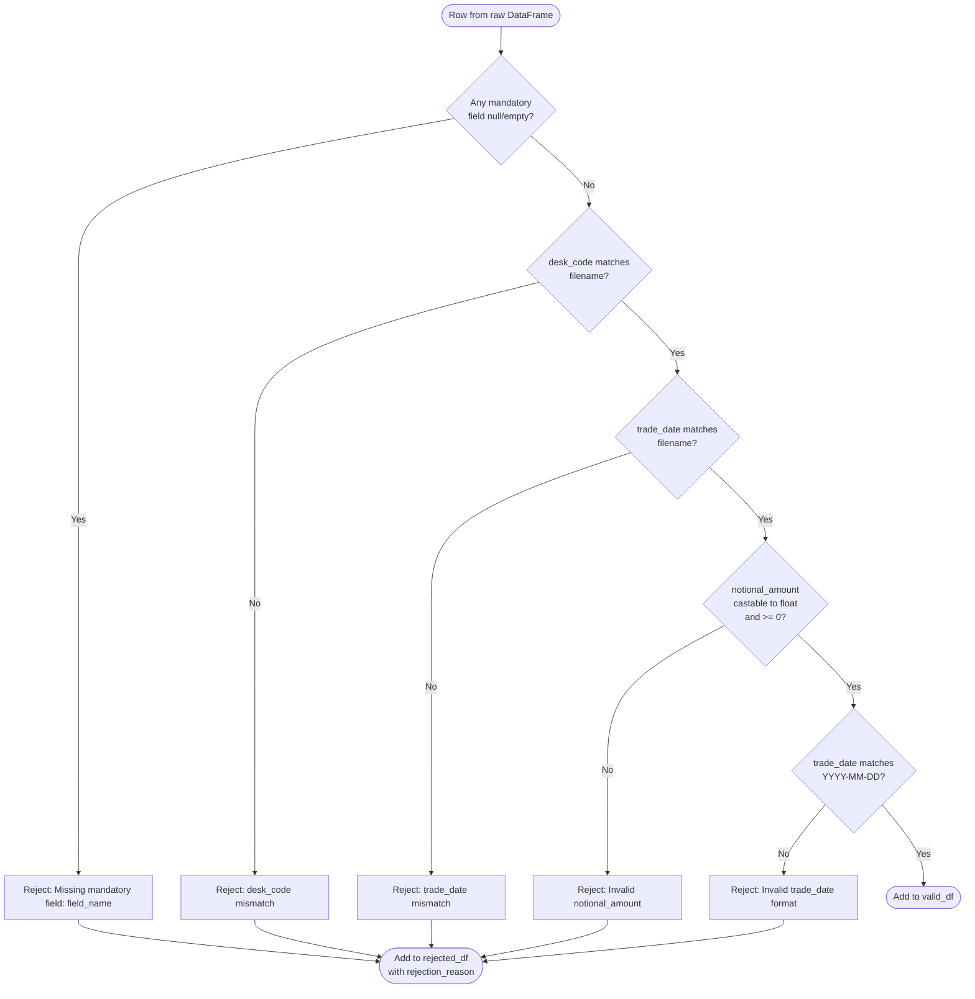
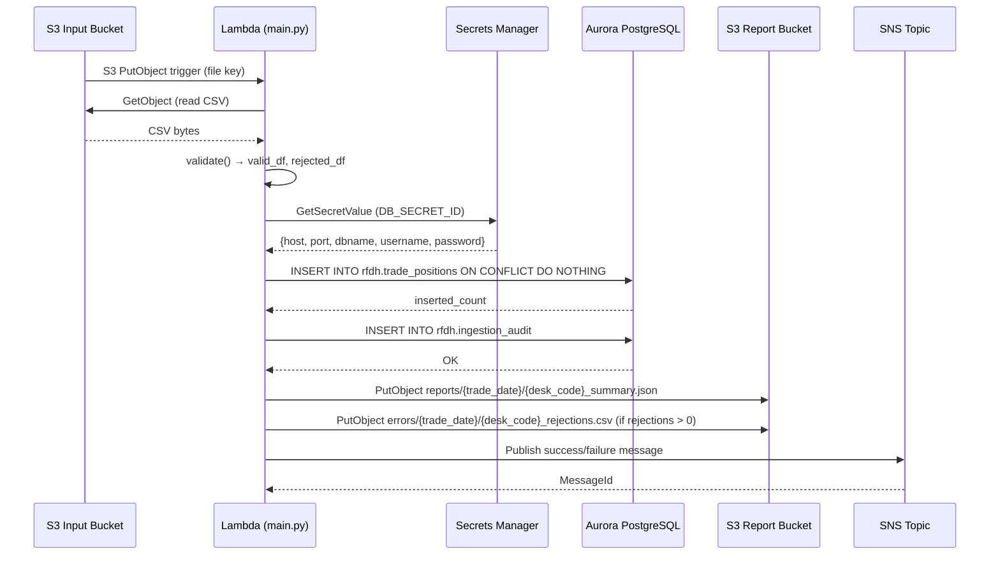

# Technical Design Document
## Daily Trade Position Ingestion
### RFDH — Risk Finance Data Hub | June 2026

---

## COMPONENTS

---

### `main.py`

**Role:** Orchestration entry point. Invoked by the AWS Lambda handler or scheduled trigger. Coordinates the full pipeline for a single S3 file event.

**Exact behavior:**
- Receives an S3 event payload containing bucket name and object key.
- Extracts `desk_code` and `trade_date` from the object key using the pattern `{desk_code}_{trade_date}_positions.csv`.
- Calls `file_reader.read_csv_from_s3(bucket, key)` → raw DataFrame.
- Calls `validator.validate(df, desk_code, trade_date)` → `(valid_df, rejected_df)`.
- Calls `loader.load_positions(valid_df, source_file=key)` → `inserted_count`.
- Calls `reporter.build_report(raw_df, valid_df, rejected_df, inserted_count, desk_code, trade_date, source_file=key)` → `report_dict`.
- Calls `reporter.write_report(report_dict, desk_code, trade_date)`.
- If `len(rejected_df) > 0`, calls `reporter.write_error_file(rejected_df, desk_code, trade_date)`.
- Calls `notifier.notify_success(report_dict)` on clean completion.
- On any unhandled exception: calls `notifier.notify_failure(source_file=key, error=str(e))` and re-raises.
- Calls `audit.record(source_file, outcome, row_counts, processing_timestamp_et)`.

**Reads:** S3 event JSON (`Records[0].s3.bucket.name`, `Records[0].s3.object.key`)
**Writes:** Nothing directly; delegates to sub-modules.
**Satisfies:** BAC-1 through BAC-8 (orchestration path)

---

### `file_reader.py`

**Role:** Downloads and parses the position CSV file from S3 into a raw pandas DataFrame.

**Exact behavior:**
- `read_csv_from_s3(bucket: str, key: str) -> pd.DataFrame`
  - Uses `boto3.client("s3")` to call `get_object(Bucket=bucket, Key=key)`.
  - Reads response body via `pd.read_csv()` with `dtype=str` (all columns as strings, no type coercion at read time — coercion happens in validator).
  - Returns raw DataFrame with all columns as strings and preserves original row order.
  - Raises `FileReadError` (custom exception) if S3 `get_object` fails.

**Reads:** S3 object at `os.environ["S3_INPUT_BUCKET"]` / `{desk_code}_{trade_date}_positions.csv`
**Writes:** In-memory DataFrame (not persisted)
**Satisfies:** BAC-1, BAC-6

---

### `validator.py`

**Role:** Validates each row of the raw DataFrame against mandatory field and format rules. Splits input into valid and rejected sets.

**Exact behavior:**
- `validate(df: pd.DataFrame, desk_code: str, trade_date: str) -> tuple[pd.DataFrame, pd.DataFrame]`
  - Adds a `_row_number` column (1-based, matching original file line number excluding header).
  - Applies the following checks **in order** per row; first failing check determines rejection reason:
    1. **Missing mandatory fields:** Any of `[trade_id, desk_code, instrument_type, notional_amount, currency, counterparty_id, trade_date]` is null/empty → reason: `"Missing mandatory field: {field_name}"`.
    2. **desk_code mismatch:** Value in `desk_code` column does not match `desk_code` extracted from filename → reason: `"desk_code mismatch: file declares {file_desk_code}, row contains {row_desk_code}"`.
    3. **trade_date mismatch:** Value in `trade_date` column does not match `trade_date` extracted from filename → reason: `"trade_date mismatch: file declares {file_trade_date}, row contains {row_trade_date}"`.
    4. **notional_amount format:** Cannot be cast to `float` or is negative → reason: `"Invalid notional_amount: {value}"`.
    5. **trade_date format:** Does not match `YYYY-MM-DD` → reason: `"Invalid trade_date format: {value}"`.
  - Returns `(valid_df, rejected_df)`:
    - `valid_df`: rows passing all checks, with `notional_amount` cast to `float64`, `trade_date` cast to `datetime.date`.
    - `rejected_df`: rows failing any check, with columns `[_row_number, trade_id, desk_code, trade_date, instrument_type, notional_amount, currency, counterparty_id, rejection_reason]`.

**Reads:** Raw DataFrame from `file_reader.py`
**Writes:** Two in-memory DataFrames
**Satisfies:** BAC-2, BAC-4

---

### `loader.py`

**Role:** Loads validated trade positions into the `rfdh.trade_positions` table using idempotent INSERT.

**Exact behavior:**
- `load_positions(valid_df: pd.DataFrame, source_file: str) -> int`
  - Retrieves DB credentials via `secrets.get_db_credentials()`.
  - Connects to Aurora PostgreSQL using `psycopg2` with credentials from secrets.
  - Adds `loaded_at` column = current timestamp in ET (`pytz.timezone("America/Toronto")`).
  - Adds `source_file` column = the S3 key of the source file.
  - Executes batch INSERT using `psycopg2.extras.execute_values`:
    ```
    INSERT INTO rfdh.trade_positions
      (trade_id, desk_code, trade_date, instrument_type, notional_amount,
       currency, counterparty_id, loaded_at, source_file)
    VALUES %s
    ON CONFLICT (trade_id, desk_code, trade_date) DO NOTHING
    ```
  - Returns the count of rows actually inserted (using cursor's `rowcount` or pre/post count delta).
  - Commits transaction; rolls back on any exception and raises `LoadError`.

**Reads:** `valid_df` with columns `[trade_id, desk_code, trade_date, instrument_type, notional_amount, currency, counterparty_id]`; `source_file` string
**Writes:** `rfdh.trade_positions` table rows
**Satisfies:** BAC-1, BAC-3, BAC-6, BAC-8

---

### `reporter.py`

**Role:** Builds the post-load summary report dict, writes it to S3 as JSON, and writes the rejection error file to S3 as CSV.

**Exact behavior:**

- `build_report(raw_df, valid_df, rejected_df, inserted_count, desk_code, trade_date, source_file) -> dict`
  - Computes:
    - `total_rows`: `len(raw_df)`
    - `rows_loaded`: `inserted_count`
    - `rows_rejected`: `len(rejected_df)`
    - `processing_timestamp`: current time in ET as ISO-8601 string with timezone offset (e.g. `"2026-06-15T19:32:10-04:00"`)
    - `desk_code`: from parameter
    - `trade_date`: from parameter
    - `source_file`: from parameter
    - `counts_by_desk`: `raw_df.groupby("desk_code").size().to_dict()` (covers multi-desk files; typically one entry)
    - `min_notional`: `float(valid_df["notional_amount"].min())` (None if valid_df empty)
    - `max_notional`: `float(valid_df["notional_amount"].max())` (None if valid_df empty)
    - `null_rates`: for each mandatory column in `raw_df`, `{col: round(raw_df[col].isna().mean(), 6)}`
  - Returns the above as a single `dict`.

- `write_report(report_dict: dict, desk_code: str, trade_date: str) -> None`
  - Serializes `report_dict` to JSON.
  - Writes to S3 at `os.environ["S3_REPORT_BUCKET"]` with key: `reports/{trade_date}/{desk_code}_summary.json`.

- `write_error_file(rejected_df: pd.DataFrame, desk_code: str, trade_date: str) -> None`
  - Writes `rejected_df` as CSV (UTF-8, with header) to S3 at `os.environ["S3_REPORT_BUCKET"]` with key: `errors/{trade_date}/{desk_code}_rejections.csv`.
  - Columns: `[_row_number, trade_id, desk_code, trade_date, instrument_type, notional_amount, currency, counterparty_id, rejection_reason]`.

**Reads:** DataFrames from validator, `inserted_count` from loader
**Writes:**
- `s3://${S3_REPORT_BUCKET}/reports/{trade_date}/{desk_code}_summary.json`
- `s3://${S3_REPORT_BUCKET}/errors/{trade_date}/{desk_code}_rejections.csv`
**Satisfies:** BAC-2, BAC-4, BAC-5, BAC-7

---

### `notifier.py`

**Role:** Publishes SNS notifications for success and failure outcomes.

**Exact behavior:**

- `notify_success(report_dict: dict) -> None`
  - Publishes to SNS topic ARN at `os.environ["SNS_TOPIC_ARN"]`.
  - Message subject: `"RFDH Position Ingestion SUCCESS: {desk_code} {trade_date}"`.
  - Message body: JSON-serialized dict with fields:
    ```
    {
      "event": "position_ingestion_success",
      "desk_code": str,
      "trade_date": str,
      "source_file": str,
      "total_rows": int,
      "rows_loaded": int,
      "rows_rejected": int,
      "processing_timestamp": str (ET ISO-8601),
      "min_notional": float | null,
      "max_notional": float | null,
      "null_rates": {col: float}
    }
    ```
  - Uses `MessageStructure="string"` (plain JSON, not platform-specific).

- `notify_failure(source_file: str, error: str) -> None`
  - Publishes to the same SNS topic.
  - Message subject: `"RFDH Position Ingestion FAILURE: {source_file}"`.
  - Message body:
    ```
    {
      "event": "position_ingestion_failure",
      "source_file": str,
      "error": str,
      "processing_timestamp": str (ET ISO-8601)
    }
    ```

**Reads:** `report_dict` or error string
**Writes:** SNS message to `os.environ["SNS_TOPIC_ARN"]`
**Satisfies:** BAC-5, BAC-7

---

### `audit.py`

**Role:** Writes a single audit record to the `rfdh.ingestion_audit` table for every file processed (success or failure).

**Exact behavior:**

- `record(source_file: str, outcome: str, total_rows: int, rows_loaded: int, rows_rejected: int, processing_timestamp: datetime) -> None`
  - `outcome` must be one of: `"SUCCESS"`, `"PARTIAL"` (loaded > 0 but rejected > 0), `"FAILURE"`.
  - Retrieves DB credentials via `secrets.get_db_credentials()`.
  - Executes:
    ```
    INSERT INTO rfdh.ingestion_audit
      (source_file, outcome, total_rows, rows_loaded, rows_rejected,
       processing_timestamp, service_identity)
    VALUES (%s, %s, %s, %s, %s, %s, %s)
    ```
  - `service_identity` = `os.environ["SERVICE_IDENTITY"]` (e.g. Lambda function ARN or task name — injected at deploy time).
  - `processing_timestamp` stored as TIMESTAMPTZ in ET.
  - This insert is **not** idempotent by design — each processing run (including retries) produces its own audit row.

**Reads:** Runtime parameters from `main.py`
**Writes:** `rfdh.ingestion_audit` table row
**Satisfies:** BAC-7, BAC-8 (audit trail, no hardcoded credentials)

---

### `secrets.py`

**Role:** Retrieves all runtime secrets from AWS Secrets Manager. Single source of truth for credentials.

**Exact behavior:**

- `get_db_credentials() -> dict`
  - Calls `boto3.client("secretsmanager").get_secret_value(SecretId=os.environ["DB_SECRET_ID"])`.
  - Parses and returns JSON with keys: `host`, `port`, `dbname`, `username`, `password`.
  - Raises `SecretsError` on failure.

- No caching between Lambda invocations (each invocation fetches fresh). Caching within a single invocation is acceptable (module-level variable after first fetch).

**Reads:** `os.environ["DB_SECRET_ID"]`, AWS Secrets Manager
**Writes:** Nothing
**Satisfies:** BAC-8

---

### `exceptions.py`

**Role:** Defines custom exception classes used across modules.

**Classes:**
- `FileReadError(Exception)` — raised when S3 object cannot be retrieved or parsed.
- `ValidationError(Exception)` — raised on unexpected validator failure (not row-level rejections).
- `LoadError(Exception)` — raised when DB insert transaction fails.
- `SecretsError(Exception)` — raised when Secrets Manager call fails.
- `NotificationError(Exception)` — raised when SNS publish fails (non-fatal; logged and swallowed in main).

**Satisfies:** Error handling for BAC-2, BAC-5

---

### `schema.sql`

**Role:** DDL file defining all database objects. Not executed at runtime — applied to the existing Aurora database during deployment.

**Contents:** (See DATA CONTRACTS section for full schema)

**Satisfies:** BAC-1, BAC-3, BAC-7 (schema enforces constraints)

---

## AWS SERVICES

| Service | Role |
|---|---|
| **AWS Lambda** | Compute platform. Each S3 file event triggers one Lambda invocation. Processes one file per invocation. |
| **Amazon S3** | Two buckets: (1) input bucket — receives `{desk_code}_{trade_date}_positions.csv` files from upstream trading systems; (2) report bucket — stores JSON summary reports and CSV error files. |
| **Amazon Aurora PostgreSQL** | Reporting database. Stores validated `trade_positions` records and `ingestion_audit` rows. Existing service — not provisioned by this pipeline. |
| **AWS Secrets Manager** | Stores Aurora DB credentials (host, port, dbname, username, password). Read at Lambda runtime. No credentials in code. |
| **Amazon SNS** | Publishes success and failure notifications to downstream subscribers. The risk calculation pipeline subscribes to this topic. |
| **Amazon CloudWatch Logs** | Receives all structured log output from Lambda (via Python `logging` module). Supports operational monitoring and audit. |
| **AWS IAM** | Lambda execution role grants: `s3:GetObject` on input bucket, `s3:PutObject` on report bucket, `secretsmanager:GetSecretValue` for the DB secret, `sns:Publish` on the notification topic, `logs:CreateLogStream` / `logs:PutLogEvents`. No broader permissions. |

---

## DATA CONTRACTS

### Database Tables

#### `rfdh.trade_positions`

| Column | Data Type | Constraints | Notes |
|---|---|---|---|
| `trade_id` | `VARCHAR(100)` | NOT NULL | Unique per desk per day (part of PK) |
| `desk_code` | `VARCHAR(50)` | NOT NULL | Trading desk identifier |
| `trade_date` | `DATE` | NOT NULL | Position date (part of PK) |
| `instrument_type` | `VARCHAR(100)` | NOT NULL | |
| `notional_amount` | `NUMERIC(22, 6)` | NOT NULL | |
| `currency` | `CHAR(3)` | NOT NULL | ISO 4217 3-letter code |
| `counterparty_id` | `VARCHAR(100)` | NOT NULL | |
| `loaded_at` | `TIMESTAMPTZ` | NOT NULL | Set at insert time, ET |
| `source_file` | `VARCHAR(500)` | NOT NULL | S3 object key of originating file |

**Primary Key:** `(trade_id, desk_code, trade_date)` — enforces idempotent deduplication via `ON CONFLICT DO NOTHING`.

**Indexes:**
- PK index on `(trade_id, desk_code, trade_date)` (implicit from PK constraint)
- `idx_trade_positions_desk_date` on `(desk_code, trade_date)` — supports desk/date reporting queries

---

#### `rfdh.ingestion_audit`

| Column | Data Type | Constraints | Notes |
|---|---|---|---|
| `audit_id` | `BIGSERIAL` | PRIMARY KEY | Auto-increment |
| `source_file` | `VARCHAR(500)` | NOT NULL | S3 object key |
| `outcome` | `VARCHAR(20)` | NOT NULL | One of: `SUCCESS`, `PARTIAL`, `FAILURE` |
| `total_rows` | `INTEGER` | NOT NULL | Rows in input file |
| `rows_loaded` | `INTEGER` | NOT NULL | Rows inserted into DB |
| `rows_rejected` | `INTEGER` | NOT NULL | Rows rejected by validation |
| `processing_timestamp` | `TIMESTAMPTZ` | NOT NULL | ET timestamp of processing |
| `service_identity` | `VARCHAR(500)` | NOT NULL | Lambda ARN or task name from env |

**Primary Key:** `audit_id` (surrogate — intentionally non-idempotent per run)

**Indexes:**
- `idx_ingestion_audit_source_file` on `(source_file)` — supports lookup by filename
- `idx_ingestion_audit_processing_timestamp` on `(processing_timestamp)` — supports time-range queries

---

### S3 Paths

#### Input Bucket (`os.environ["S3_INPUT_BUCKET"]`)

| Pattern | Format | Description |
|---|---|---|
| `{desk_code}_{trade_date}_positions.csv` | CSV, UTF-8, with header row | One file per trading desk per day. `trade_date` format: `YYYY-MM-DD`. Example: `EQTY_2026-06-15_positions.csv`. |

**Expected CSV columns (header row, order not enforced):**
`trade_id, desk_code, trade_date, instrument_type, notional_amount, currency, counterparty_id`

---

#### Report Bucket (`os.environ["S3_REPORT_BUCKET"]`)

| Pattern | Format | Description |
|---|---|---|
| `reports/{trade_date}/{desk_code}_summary.json` | JSON, UTF-8 | One summary report per file processed |
| `errors/{trade_date}/{desk_code}_rejections.csv` | CSV, UTF-8, with header | One error file per file with rejections. Absent if zero rejections. |

**Summary JSON structure:**
```
{
  "event": "position_ingestion_success",
  "desk_code": "EQTY",
  "trade_date": "2026-06-15",
  "source_file": "EQTY_2026-06-15_positions.csv",
  "total_rows": 1000,
  "rows_loaded": 995,
  "rows_rejected": 5,
  "processing_timestamp": "2026-06-15T19:32:10-04:00",
  "counts_by_desk": {"EQTY": 1000},
  "min_notional": 1500.00,
  "max_notional": 9800000.00,
  "null_rates": {
    "trade_id": 0.0,
    "desk_code": 0.0,
    "trade_date": 0.0,
    "instrument_type": 0.002,
    "notional_amount": 0.0,
    "currency": 0.0,
    "counterparty_id": 0.005
  }
}
```

**Rejection CSV columns:**
`_row_number, trade_id, desk_code, trade_date, instrument_type, notional_amount, currency, counterparty_id, rejection_reason`

---

### Secrets Manager

**Env var:** `os.environ["DB_SECRET_ID"]`

Expected JSON payload in secret:
```
{
  "host": "<aurora-cluster-endpoint>",
  "port": 5432,
  "dbname": "<database-name>",
  "username": "<db-username>",
  "password": "<db-password>"
}
```

---

### SNS

**Env var:** `os.environ["SNS_TOPIC_ARN"]`

**Success message body (JSON string):**
```
{
  "event": "position_ingestion_success",
  "desk_code": str,
  "trade_date": str,               // YYYY-MM-DD
  "source_file": str,              // S3 key
  "total_rows": int,
  "rows_loaded": int,
  "rows_rejected": int,
  "processing_timestamp": str,     // ET ISO-8601, e.g. "2026-06-15T19:32:10-04:00"
  "min_notional": float | null,
  "max_notional": float | null,
  "null_rates": { col: float }
}
```

**Failure message body (JSON string):**
```
{
  "event": "position_ingestion_failure",
  "source_file": str,
  "error": str,
  "processing_timestamp": str      // ET ISO-8601
}
```

---

### Environment Variables Reference

| Variable | Used By | Description |
|---|---|---|
| `S3_INPUT_BUCKET` | `file_reader.py`, `main.py` | Bucket where position files are deposited |
| `S3_REPORT_BUCKET` | `reporter.py` | Bucket where reports and error files are written |
| `DB_SECRET_ID` | `secrets.py` | Secrets Manager secret ID for Aurora credentials |
| `SNS_TOPIC_ARN` | `notifier.py` | ARN of SNS topic for downstream notifications |
| `SERVICE_IDENTITY` | `audit.py` | Lambda function ARN or service name for audit trail |

---

## DATA FLOW

### End-to-End Pipeline Flow

```mermaid
flowchart TD
    A([Upstream Trading System]) -->|Deposits CSV file| B[S3 Input Bucket\n{desk_code}_{trade_date}_positions.csv]
    B -->|S3 PutObject event| C[AWS Lambda\nmain.py]

    subgraph Lambda Execution
        C --> D[file_reader.py\nread_csv_from_s3]
        D -->|raw DataFrame| E[validator.py\nvalidate]
        E -->|valid_df| F[loader.py\nload_positions]
        E -->|rejected_df| G[reporter.py\nwrite_error_file]
        F -->|inserted_count| H[reporter.py\nbuild_report + write_report]
        H -->|report_dict| I[notifier.py\nnotify_success]
        H --> J[audit.py\nrecord]
    end

    F -->|INSERT ON CONFLICT DO NOTHING| K[(Aurora PostgreSQL\nrfdh.trade_positions)]
    J -->|INSERT audit row| L[(Aurora PostgreSQL\nrfdh.ingestion_audit)]
    G -->|errors/{trade_date}/{desk_code}_rejections.csv| M[S3 Report Bucket]
    H -->|reports/{trade_date}/{desk_code}_summary.json| M
    I -->|JSON message| N[SNS Topic]
    N -->|Triggers| O([Downstream Risk\nCalculation Pipeline])

    C -->|On exception| P[notifier.py\nnotify_failure]
    P --> N
    C -->|All output| Q[CloudWatch Logs]
```

---

### Validation Decision Logic



---

### Service Interaction Sequence



---

### Idempotency / Deduplication Algorithm

```
ALGORITHM: load_positions(valid_df, source_file)

INPUT:  valid_df — DataFrame of validated rows
        source_file — S3 key string

1. Add column loaded_at = NOW() in America/Toronto timezone
2. Add column source_file = source_file parameter
3. Build list of value tuples from valid_df rows:
     (trade_id, desk_code, trade_date, instrument_type,
      notional_amount, currency, counterparty_id, loaded_at, source_file)
4. Execute batch INSERT:
     INSERT INTO rfdh.trade_positions (...columns...) VALUES (...)
     ON CONFLICT (trade_id, desk_code, trade_date) DO NOTHING
5. COMMIT
6. RETURN count of rows actually inserted
     (total attempted - rows skipped due to conflict)

DEDUP KEY: (trade_id, desk_code, trade_date)
CONFLICT ACTION: DO NOTHING (no update, no error)
IDEMPOTENCY GUARANTEE: re-processing same file → same DB state
```

---

## TECHNICAL ACCEPTANCE CRITERIA

**TAC-1:** `load_positions()` inserts all validated rows into `rfdh.trade_positions`. Acceptance test: generate a CSV of 1,000 rows with no invalid fields; call `validate()` → assert `len(rejected_df) == 0`; call `load_positions()` → assert return value equals 1,000; execute `SELECT COUNT(*) FROM rfdh.trade_positions WHERE desk_code = :desk AND trade_date = :date` → assert result equals 1,000.

**TAC-2:** `validate()` correctly identifies and describes all rejection reasons. Acceptance test: generate a file with exactly 5 rows containing distinct validation failures (one each of: missing field, desk_code mismatch, trade_date mismatch, invalid notional_amount, invalid trade_date format); assert `len(rejected_df) == 5`; assert each row in `rejected_df` has a non-empty `rejection_reason` string matching the expected human-readable template for that failure type; assert `write_error_file()` produces a CSV at `errors/{trade_date}/{desk_code}_rejections.csv` with exactly 5 data rows and a `rejection_reason` column.

**TAC-3:** The `INSERT INTO rfdh.trade_positions ... ON CONFLICT (trade_id, desk_code, trade_date) DO NOTHING` clause prevents duplicate records. Acceptance test: call `load_positions(valid_df, source_file)` twice with identical input; after first call assert `SELECT COUNT(*)` = N; after second call assert `SELECT COUNT(*)` still = N (unchanged). The `inserted_count` returned by the second call must equal 0.

**TAC-4:** `build_report()` computes correct statistics. Acceptance test with known data: assert `report_dict["total_rows"] == len(raw_df)`; assert `report_dict["rows_loaded"] == inserted_count`; assert `report_dict["rows_rejected"] == len(rejected_df)`; assert `report_dict["min_notional"] == float(valid_df["notional_amount"].min())`; assert `report_dict["max_notional"] == float(valid_df["notional_amount"].max())`; for each mandatory column `c`, assert `abs(report_dict["null_rates"][c] - raw_df[c].isna().mean()) < 1e-9`.

**TAC-5:** `notify_success()` publishes to `SNS_TOPIC_ARN` with a JSON message body containing all required fields. Acceptance test (using `unittest.mock.patch` on `boto3.client("sns").publish`): call `notify_success(report_dict)` → assert `publish` was called once; deserialize the `Message` argument as JSON → assert presence and correct values of `event`, `desk_code`, `trade_date`, `total_rows`, `rows_loaded`, `rows_rejected`, `processing_timestamp`, `min_notional`, `max_notional`, `null_rates`.

**TAC-6:** Full pipeline (file read → validate → load → report → notify) for a 10,000-row file completes in under 60 seconds. Acceptance test: generate 10,000-row CSV; record wall-clock time from start of `main.handler()` to return; assert elapsed < 60 seconds. Measured in an environment matching Lambda memory/CPU configuration.

**TAC-7:** All `processing_timestamp` values in summary JSON (`report_dict["processing_timestamp"]`), `loaded_at` column in `rfdh.trade_positions`, and `processing_timestamp` in `rfdh.ingestion_audit` are in Eastern Time. Acceptance tests:
- Assert `report_dict["processing_timestamp"]` parses to a `datetime` with UTC offset `-05:00` or `-04:00` (depending on DST) and never `+00:00`.
- Assert `loaded_at` values retrieved from Aurora via `AT TIME ZONE 'America/Toronto'` match ET wall-clock time within 5 seconds of insert.
- Assert no field in any output contains the string `"+00:00"` or `"UTC"`.

**TAC-8:** No secrets appear in source code or config files. Acceptance test: automated scan of all `.py` and config files in the repo using `git grep` patterns for `password`, `host`, `secret`, alphanumeric strings > 20 chars in assignments → assert zero matches outside `secrets.py` (which contains only the lookup call). Runtime: assert `secrets.get_db_credentials()` invokes `boto3.client("secretsmanager").get_secret_value(SecretId=os.environ["DB_SECRET_ID"])` and that `DB_SECRET_ID` is not a hardcoded string literal.

---

## OPEN QUESTIONS

**OQ-1: Behavior when all rows in a file are rejected.** If `len(valid_df) == 0` (every row rejected), should the pipeline record `outcome = "FAILURE"` or `outcome = "PARTIAL"` in the audit table? The loader would insert zero rows, but the file was processed successfully — the rejection is a data quality outcome, not a system failure. This distinction affects downstream monitoring and alerting thresholds.

**OQ-2: Duplicate file delivery handling.** The BRD specifies idempotency at the row level (dedup by `trade_id, desk_code, trade_date`). If the same file key is re-deposited to S3 (triggering a second Lambda invocation), the row-level dedup handles the data correctly. However, should the audit trail explicitly flag this as a "re-run" vs. a "first-run"? This affects how operations teams interpret the audit log when investigating submissions.

**OQ-3: Partial load threshold.** If a file has a mix of valid and invalid rows (e.g., 950 valid, 50 rejected), the pipeline currently loads valid rows and rejects the rest. Is there a business-defined rejection threshold (e.g., >5% rejected rows = abort the entire file) that should cause the pipeline to reject the whole file rather than partially load it?

---

## ASSUMPTIONS

**A-1: Compute platform.** Lambda is assumed as the compute platform based on the event-driven, file-per-invocation processing model described in the BRD. One S3 PutObject event → one Lambda invocation → one file processed.

**A-2: S3 event trigger.** The Lambda is triggered by an S3 PutObject event notification on the input bucket. No separate file-polling mechanism is required.

**A-3: Two S3 buckets.** A separate report bucket (`S3_REPORT_BUCKET`) is used for output (summary reports, error files) rather than writing back to the input bucket. This enforces least-privilege separation.

**A-4: Aurora PostgreSQL.** The "reporting database" is an existing Aurora PostgreSQL cluster. The `rfdh` schema already exists or will be created during deployment. The Lambda VPC configuration to reach Aurora is handled at deploy time.

**A-5: Single file per invocation.** Each file represents one trading desk's positions for one trading day. The pipeline processes one file at a time. Concurrency (multiple files arriving simultaneously) is handled by Lambda's natural per-event concurrency — no cross-invocation coordination is required.

**A-6: File naming is authoritative.** The `desk_code` and `trade_date` extracted from the filename are the authoritative values. Rows whose embedded `desk_code` or `trade_date` column values differ from the filename are rejected (not corrected).

**A-7: CSV column order is not guaranteed.** The validator uses column names (not positional index) to access fields. The file must have a header row matching the expected column names exactly.

**A-8: `currency` field is stored as-is.** No ISO 4217 validation is applied to the `currency` field beyond the mandatory-field presence check. Downstream systems are responsible for currency validation.

**A-9: `notional_amount` must be non-negative.** Negative notional amounts are treated as malformed and rejected. This is a data quality assumption — if the business permits negative notionals (e.g., short positions), validation rule 4 in `validator.py` must be adjusted.

**A-10: Rejection CSV is written only when rejections exist.** If `len(rejected_df) == 0`, no error file is written to S3 (no empty file). The summary JSON is always written.

**A-11: Lambda memory and timeout.** Lambda is configured with sufficient memory (≥ 512 MB) and timeout (≥ 90 seconds) to handle 100,000-row files. The 60-second BAC-6 threshold applies to processing time, not Lambda configured timeout.

**A-12: `psycopg2-binary`** is used as the PostgreSQL driver and is included in the Lambda deployment package or Lambda layer.

**A-13: Outcome classification for audit.** `"SUCCESS"` = rows_rejected == 0; `"PARTIAL"` = rows_loaded > 0 AND rows_rejected > 0; `"FAILURE"` = unhandled exception or rows_loaded == 0 AND rows_rejected > 0. (Pending confirmation via OQ-1.)

**A-14: SNS message format.** The SNS message uses `MessageStructure="string"` (a single JSON string delivered to all subscribers). No per-protocol message customization (e.g., separate SQS vs. email formats) is applied.

**A-15: No file archival.** Input files are not moved or deleted from the input bucket after processing. Archival or lifecycle policies are handled at the infrastructure level, outside this pipeline's scope.