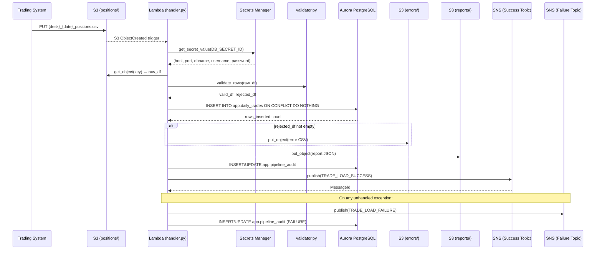
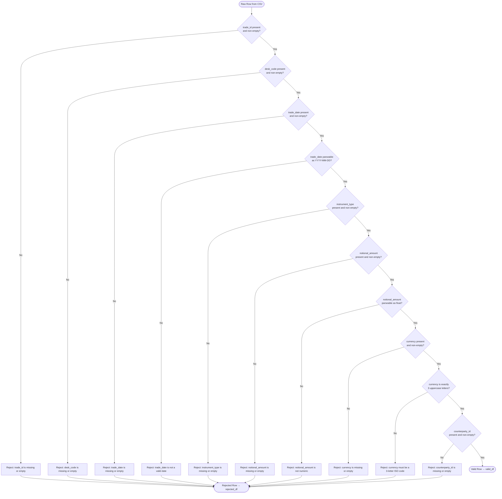
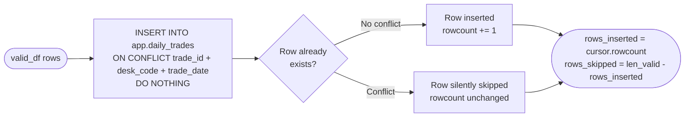
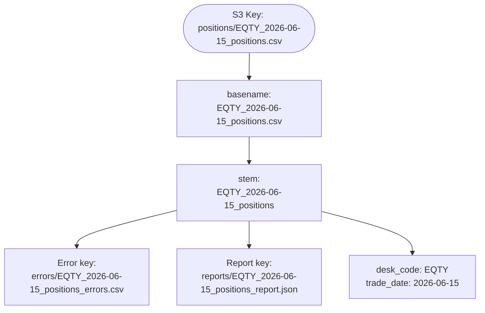

# Technical Design Document
## Daily Trade Position Ingestion
### RFDH — Risk Finance Data Hub
**Repo:** sdlc-agent-sandbox | **Change Type:** New Feature | **Date:** June 2026 | **Status:** Draft

---

## COMPONENTS

### `config.py`
**Purpose:** Centralizes all environment variable reads and runtime configuration. Exposes typed constants used by all other modules. Does not perform any I/O.

**Reads:**
- `os.environ["S3_BUCKET"]` — source/report bucket name
- `os.environ["S3_INPUT_PREFIX"]` — prefix where input CSV files land (e.g. `positions/`)
- `os.environ["S3_REPORTS_PREFIX"]` — prefix for report output (must be `reports/`)
- `os.environ["S3_ERRORS_PREFIX"]` — prefix for error files (e.g. `errors/`)
- `os.environ["DB_SECRET_ID"]` — Secrets Manager secret ID for Aurora credentials
- `os.environ["SNS_SUCCESS_TOPIC_ARN"]` — SNS ARN for success notifications
- `os.environ["SNS_FAILURE_TOPIC_ARN"]` — SNS ARN for failure notifications
- `os.environ["AUDIT_TABLE"]` — fully qualified audit table name (default `app.pipeline_audit`)
- `os.environ["TZ"]` — expected value `America/Toronto`

**Writes:** Nothing. Exports a `Config` dataclass with all values.

**Satisfies:** BAC-7, BAC-8 (no hardcoded values anywhere in the codebase)

---

### `secrets.py`
**Purpose:** Reads Aurora PostgreSQL credentials from AWS Secrets Manager at runtime. Returns a typed `DBCredentials` dataclass. Caches the result in-process to avoid redundant API calls within a single invocation.

**Function signature:**
```
get_db_credentials(secret_id: str) -> DBCredentials
```
- Calls `boto3.client("secretsmanager").get_secret_value(SecretId=secret_id)`
- Parses JSON payload expecting keys: `host`, `port`, `dbname`, `username`, `password`
- Returns `DBCredentials(host, port, dbname, username, password)`
- Raises `RuntimeError` if any key is missing from the secret payload

**Writes:** Nothing.

**Satisfies:** BAC-8 (credentials read from Secrets Manager, never from code or env vars)

---

### `file_reader.py`
**Purpose:** Downloads a CSV file from S3 by key and parses it into a raw pandas DataFrame. Performs no validation — returns exactly what is in the file. Captures the original row index for error tracing.

**Function signature:**
```
read_csv_from_s3(bucket: str, key: str) -> tuple[pd.DataFrame, str]
```
- Uses `boto3.client("s3").get_object(Bucket=bucket, Key=key)`
- Reads response body via `pd.read_csv()` with `dtype=str` (all columns as string to preserve originals for validation)
- Adds internal column `_source_row` (1-based integer row number in the original file)
- Returns `(dataframe, source_file_name)` where `source_file_name` is the S3 key basename

**Reads:** S3 object at `s3://{S3_BUCKET}/{key}`

**Writes:** Nothing.

**Satisfies:** BAC-1, BAC-2 (foundation for all downstream processing)

---

### `validator.py`
**Purpose:** Applies row-level validation rules to the raw DataFrame. Splits rows into `valid_df` and `rejected_df`. Every rejected row carries a human-readable `rejection_reason` column.

**Function signature:**
```
validate_rows(df: pd.DataFrame) -> tuple[pd.DataFrame, pd.DataFrame]
```
Returns `(valid_df, rejected_df)`.

**Validation rules applied in order (first failing rule wins for each row):**

| Rule | Field(s) | Rejection Reason String |
|---|---|---|
| Required field present and non-empty | `trade_id` | `"trade_id is missing or empty"` |
| Required field present and non-empty | `desk_code` | `"desk_code is missing or empty"` |
| Required field present and non-empty | `trade_date` | `"trade_date is missing or empty"` |
| `trade_date` parseable as `YYYY-MM-DD` | `trade_date` | `"trade_date is not a valid date (expected YYYY-MM-DD)"` |
| Required field present and non-empty | `instrument_type` | `"instrument_type is missing or empty"` |
| Required field present and non-empty | `notional_amount` | `"notional_amount is missing or empty"` |
| `notional_amount` parseable as numeric (float) | `notional_amount` | `"notional_amount is not numeric"` |
| Required field present and non-empty | `currency` | `"currency is missing or empty"` |
| `currency` is exactly 3 uppercase letters | `currency` | `"currency must be a 3-letter ISO code"` |
| Required field present and non-empty | `counterparty_id` | `"counterparty_id is missing or empty"` |

- `valid_df` retains all original columns plus `_source_row`; `notional_amount` is cast to `float64`; `trade_date` is cast to `datetime.date`
- `rejected_df` retains all original string columns plus `_source_row` and `rejection_reason`

**Satisfies:** BAC-1, BAC-2

---

### `loader.py`
**Purpose:** Loads the validated DataFrame into `app.daily_trades` using a PostgreSQL `INSERT ... ON CONFLICT DO NOTHING` to guarantee idempotency. Returns the count of rows actually inserted (conflicts excluded).

**Function signature:**
```
load_trades(valid_df: pd.DataFrame, credentials: DBCredentials, source_file: str) -> int
```
- Connects to Aurora via `psycopg2.connect(host, port, dbname, user, password, sslmode="require")`
- Adds `loaded_at` column to each row: `datetime.now(pytz.timezone("America/Toronto"))` at the moment of load
- Adds `source_file` column to each row: the S3 key basename passed in
- Executes batch insert using `psycopg2.extras.execute_values`:
  ```
  INSERT INTO app.daily_trades
    (trade_id, desk_code, trade_date, instrument_type, notional_amount,
     currency, counterparty_id, loaded_at, source_file)
  VALUES %s
  ON CONFLICT (trade_id, desk_code, trade_date) DO NOTHING
  ```
- Uses `cursor.rowcount` after `execute_values` to determine inserted row count (rows where conflict was not triggered)
- Commits the transaction; rolls back on any exception and re-raises
- Returns `int` count of rows inserted

**Reads:** `valid_df` with columns: `trade_id`, `desk_code`, `trade_date`, `instrument_type`, `notional_amount`, `currency`, `counterparty_id`

**Writes:** Rows into `app.daily_trades`

**Satisfies:** BAC-1, BAC-3

---

### `error_writer.py`
**Purpose:** Writes rejected rows to an S3 error file in CSV format. Error file is placed under the `errors/` prefix with a deterministic key derived from the source file name.

**Function signature:**
```
write_error_file(rejected_df: pd.DataFrame, bucket: str, source_key: str, errors_prefix: str) -> str
```
- Derives error key as: `{errors_prefix}{basename_without_extension}_errors.csv`
  - Example: source key `positions/EQTY_2026-06-15_positions.csv` → error key `errors/EQTY_2026-06-15_positions_errors.csv`
- Serializes `rejected_df` (columns: `_source_row`, `trade_id`, `desk_code`, `trade_date`, `instrument_type`, `notional_amount`, `currency`, `counterparty_id`, `rejection_reason`) to CSV (UTF-8, with header)
- Uploads via `boto3.client("s3").put_object(Bucket=bucket, Key=error_key, Body=csv_bytes, ContentType="text/csv")`
- Returns the full S3 error key written

**Satisfies:** BAC-2

---

### `reporter.py`
**Purpose:** Computes the JSON summary report from processing results and writes it to the S3 `reports/` prefix. All timestamps in ET.

**Function signature:**
```
build_report(
    source_file: str,
    raw_df: pd.DataFrame,
    valid_df: pd.DataFrame,
    rejected_df: pd.DataFrame,
    rows_inserted: int,
    load_timestamp: datetime,
    error_file_key: str | None
) -> dict
```

Computes and returns a dict with this exact structure:
```
{
  "source_file": str,
  "trade_date": str (YYYY-MM-DD, extracted from filename),
  "desk_code": str (extracted from filename),
  "load_timestamp": str (ISO-8601 with timezone, ET),
  "total_rows_received": int,
  "rows_loaded": int,
  "rows_rejected": int,
  "rows_skipped_duplicate": int,   // len(valid_df) - rows_inserted
  "desk_code_counts": dict[str, int],  // value_counts on valid_df["desk_code"]
  "notional_amount_min": float | null,
  "notional_amount_max": float | null,
  "null_rates": {                  // per-column fraction of nulls in raw_df
    "trade_id": float,
    "desk_code": float,
    "trade_date": float,
    "instrument_type": float,
    "notional_amount": float,
    "currency": float,
    "counterparty_id": float
  },
  "error_file_key": str | null
}
```

**Function signature for S3 write:**
```
write_report(report: dict, bucket: str, source_key: str, reports_prefix: str) -> str
```
- Derives report key: `{reports_prefix}{basename_without_extension}_report.json`
  - Example: `reports/EQTY_2026-06-15_positions_report.json`
- Serializes to JSON (UTF-8, `indent=2`)
- Uploads via `put_object`
- Returns the full S3 report key written

**Satisfies:** BAC-4, BAC-7

---

### `notifier.py`
**Purpose:** Publishes SNS messages for both success and failure outcomes. Message body is JSON.

**Function signatures:**
```
publish_success(report: dict, topic_arn: str) -> None
publish_failure(source_file: str, error_message: str, topic_arn: str) -> None
```

**Success message JSON structure:**
```json
{
  "event": "TRADE_LOAD_SUCCESS",
  "source_file": str,
  "trade_date": str,
  "desk_code": str,
  "load_timestamp": str,
  "total_rows_received": int,
  "rows_loaded": int,
  "rows_rejected": int,
  "rows_skipped_duplicate": int
}
```

**Failure message JSON structure:**
```json
{
  "event": "TRADE_LOAD_FAILURE",
  "source_file": str,
  "error_message": str,
  "failure_timestamp": str  // datetime.now(ET).isoformat()
}
```

- Uses `boto3.client("sns").publish(TopicArn=topic_arn, Message=json.dumps(payload), Subject=event_type)`
- Raises `RuntimeError` on SNS publish failure (caller handles retry logic)

**Satisfies:** BAC-5

---

### `auditor.py`
**Purpose:** Writes one row to `app.pipeline_audit` for every file processed. Captures outcome, operator identity, and all processing metrics. Supports SOX/OSFI audit trail requirement.

**Function signature:**
```
write_audit_record(
    source_file: str,
    trade_date: str,
    desk_code: str,
    outcome: str,           // "SUCCESS" | "PARTIAL" | "FAILURE"
    total_rows: int,
    rows_loaded: int,
    rows_rejected: int,
    error_message: str | None,
    report_key: str | None,
    error_file_key: str | None,
    processed_at: datetime,
    operator_identity: str,
    credentials: DBCredentials
) -> None
```
- `operator_identity` is read from `os.environ.get("OPERATOR_IDENTITY", "lambda")` — Lambda execution role ARN in production
- Inserts one row into `app.pipeline_audit` (schema below); uses `ON CONFLICT (source_file) DO UPDATE SET ...` to allow re-processing audit updates
- Commits immediately (audit write is independent of trade data transaction)

**Satisfies:** NFR-3.3 (audit trail), BAC-7

---

### `handler.py`
**Purpose:** Lambda entry point. Orchestrates the full pipeline for a single S3 file event. Calls all other modules in sequence. Handles top-level exceptions and guarantees a failure SNS notification is published even when unrecoverable errors occur.

**Function signature:**
```
lambda_handler(event: dict, context: object) -> dict
```

**Orchestration sequence:**
1. Parse S3 key from `event["Records"][0]["s3"]["object"]["key"]` and bucket from `event["Records"][0]["s3"]["bucket"]["name"]`
2. Load `Config` from `config.py`
3. Fetch `DBCredentials` via `secrets.get_db_credentials(config.DB_SECRET_ID)`
4. Call `file_reader.read_csv_from_s3(bucket, key)` → `(raw_df, source_file)`
5. Call `validator.validate_rows(raw_df)` → `(valid_df, rejected_df)`
6. Call `loader.load_trades(valid_df, credentials, source_file)` → `rows_inserted`
7. Call `error_writer.write_error_file(rejected_df, bucket, key, config.S3_ERRORS_PREFIX)` if `len(rejected_df) > 0` → `error_file_key`
8. Capture `load_timestamp = datetime.now(pytz.timezone("America/Toronto"))`
9. Call `reporter.build_report(...)` and `reporter.write_report(...)` → `report_key`
10. Call `notifier.publish_success(report, config.SNS_SUCCESS_TOPIC_ARN)`
11. Call `auditor.write_audit_record(outcome="SUCCESS", ...)` if zero rejections; `"PARTIAL"` if some rejections; `"FAILURE"` on exception
12. On any uncaught exception: call `notifier.publish_failure(...)` to `SNS_FAILURE_TOPIC_ARN`, call `auditor.write_audit_record(outcome="FAILURE", ...)`, then re-raise to signal Lambda failure
13. Returns `{"statusCode": 200, "body": json.dumps(report)}`

**Satisfies:** BAC-1 through BAC-8 (integration point)

---

### `db_init.sql`
**Purpose:** DDL script to create all required tables. Run once against the Aurora instance during deployment. Not executed by the Python application.

Contains `CREATE TABLE IF NOT EXISTS` for both `app.daily_trades` and `app.pipeline_audit` (full schemas in DATA CONTRACTS section).

**Satisfies:** BAC-1, BAC-3 (unique constraint prerequisite)

---

## AWS SERVICES

| Service | Role |
|---|---|
| **Amazon S3** | Source for incoming CSV position files (input prefix); destination for error CSV files (`errors/` prefix) and JSON summary reports (`reports/` prefix) |
| **AWS Lambda** | Compute platform; `handler.py` is the Lambda function handler; triggered by S3 `ObjectCreated` event on the input prefix |
| **Amazon Aurora PostgreSQL** | Persistent storage for validated trade rows (`app.daily_trades`) and audit records (`app.pipeline_audit`) |
| **AWS Secrets Manager** | Stores Aurora database credentials (host, port, dbname, username, password); read at Lambda runtime |
| **Amazon SNS** | Two topics: one for success notifications (consumed by downstream risk pipeline), one for failure alerts (consumed by ops team) |
| **AWS IAM** | Lambda execution role with scoped permissions: S3 read/write on specific bucket, Secrets Manager read on specific secret, SNS publish on both topics, Aurora VPC connectivity |

---

## DATA CONTRACTS

### Database Tables

#### `app.daily_trades`

```
Table: app.daily_trades

Column            | Type                         | Constraints
------------------|------------------------------|-------------------------------
trade_id          | VARCHAR(100)                 | NOT NULL
desk_code         | VARCHAR(50)                  | NOT NULL
trade_date        | DATE                         | NOT NULL
instrument_type   | VARCHAR(100)                 | NOT NULL
notional_amount   | NUMERIC(20, 4)               | NOT NULL
currency          | CHAR(3)                      | NOT NULL
counterparty_id   | VARCHAR(100)                 | NOT NULL
loaded_at         | TIMESTAMPTZ                  | NOT NULL
source_file       | VARCHAR(500)                 | NOT NULL

Primary Key:   (trade_id, desk_code, trade_date)
Unique Index:  ON (trade_id, desk_code, trade_date)   -- enforces ON CONFLICT target
Index:         ON (desk_code, trade_date)              -- supports reporting queries
Index:         ON (trade_date)                         -- supports date-range queries
```

> Note: `loaded_at` stores the ET-offset timestamp from `datetime.now(pytz.timezone("America/Toronto"))`. The TIMESTAMPTZ type in PostgreSQL preserves the offset; application always supplies ET timestamps.

#### `app.pipeline_audit`

```
Table: app.pipeline_audit

Column            | Type                         | Constraints
------------------|------------------------------|-------------------------------
audit_id          | SERIAL                       | PRIMARY KEY
source_file       | VARCHAR(500)                 | NOT NULL UNIQUE
trade_date        | DATE                         | NOT NULL
desk_code         | VARCHAR(50)                  | NOT NULL
outcome           | VARCHAR(20)                  | NOT NULL  -- 'SUCCESS','PARTIAL','FAILURE'
total_rows        | INTEGER                      | NOT NULL
rows_loaded       | INTEGER                      | NOT NULL
rows_rejected     | INTEGER                      | NOT NULL
error_message     | TEXT                         | NULLABLE
report_key        | VARCHAR(500)                 | NULLABLE
error_file_key    | VARCHAR(500)                 | NULLABLE
processed_at      | TIMESTAMPTZ                  | NOT NULL
operator_identity | VARCHAR(500)                 | NOT NULL
```

> `ON CONFLICT (source_file) DO UPDATE SET ...` allows the pipeline to update the audit record on reprocessing.

---

### S3 Paths

```
Bucket:  os.environ["S3_BUCKET"]

Input files:
  Key pattern:   {S3_INPUT_PREFIX}{desk_code}_{trade_date}_positions.csv
  Example:       positions/EQTY_2026-06-15_positions.csv
  Format:        UTF-8 CSV with header row
  Columns:       trade_id, desk_code, trade_date, instrument_type,
                 notional_amount, currency, counterparty_id
                 (additional columns are ignored but not rejected)

Error files:
  Key pattern:   {S3_ERRORS_PREFIX}{desk_code}_{trade_date}_positions_errors.csv
  Example:       errors/EQTY_2026-06-15_positions_errors.csv
  Format:        UTF-8 CSV with header row
  Columns:       _source_row, trade_id, desk_code, trade_date,
                 instrument_type, notional_amount, currency,
                 counterparty_id, rejection_reason

Report files:
  Key pattern:   {S3_REPORTS_PREFIX}{desk_code}_{trade_date}_positions_report.json
  Example:       reports/EQTY_2026-06-15_positions_report.json
  Format:        UTF-8 JSON, indented
  Content:       See reporter.py report dict structure above
```

---

### Secrets Manager

```
Secret ID:    os.environ["DB_SECRET_ID"]

Expected JSON keys inside the secret:
{
  "host":     string  -- Aurora cluster endpoint
  "port":     string  -- database port (typically "5432")
  "dbname":   string  -- database name
  "username": string  -- database user
  "password": string  -- database password
}
```

---

### SNS Message Formats

```
Success Topic ARN:  os.environ["SNS_SUCCESS_TOPIC_ARN"]
Subject:            "TRADE_LOAD_SUCCESS"
Message (JSON):
{
  "event":                  "TRADE_LOAD_SUCCESS",
  "source_file":            string,
  "trade_date":             string (YYYY-MM-DD),
  "desk_code":              string,
  "load_timestamp":         string (ISO-8601, ET),
  "total_rows_received":    integer,
  "rows_loaded":            integer,
  "rows_rejected":          integer,
  "rows_skipped_duplicate": integer
}

Failure Topic ARN:  os.environ["SNS_FAILURE_TOPIC_ARN"]
Subject:            "TRADE_LOAD_FAILURE"
Message (JSON):
{
  "event":             "TRADE_LOAD_FAILURE",
  "source_file":       string,
  "error_message":     string,
  "failure_timestamp": string (ISO-8601, ET)
}
```

---

## DATA FLOW

### End-to-End Pipeline Flow



---

### Validation Decision Logic



---

### Idempotency / Deduplication Logic



---

### File Key Derivation



---

### Processing Algorithm (Pseudocode)

```
PROCEDURE process_file(s3_event):

  key    ← s3_event.Records[0].s3.object.key
  bucket ← s3_event.Records[0].s3.bucket.name

  TRY:
    config  ← load_config_from_env()
    creds   ← get_db_credentials(config.DB_SECRET_ID)
    raw_df, source_file ← read_csv_from_s3(bucket, key)

    valid_df, rejected_df ← validate_rows(raw_df)

    rows_inserted ← load_trades(valid_df, creds, source_file)

    IF len(rejected_df) > 0:
      error_key ← write_error_file(rejected_df, bucket, key, config.S3_ERRORS_PREFIX)
    ELSE:
      error_key ← None

    load_ts   ← now(ET)
    report    ← build_report(source_file, raw_df, valid_df, rejected_df,
                              rows_inserted, load_ts, error_key)
    report_key ← write_report(report, bucket, key, config.S3_REPORTS_PREFIX)

    outcome ← "SUCCESS" IF len(rejected_df) == 0 ELSE "PARTIAL"
    write_audit_record(outcome, ..., creds)
    publish_success(report, config.SNS_SUCCESS_TOPIC_ARN)

    RETURN {statusCode: 200, body: report}

  EXCEPT Exception AS e:
    failure_ts ← now(ET)
    publish_failure(source_file, str(e), config.SNS_FAILURE_TOPIC_ARN)
    write_audit_record("FAILURE", error_message=str(e), ..., creds)
    RAISE e
```

---

## TECHNICAL ACCEPTANCE CRITERIA

### TAC-1 — Full valid file loaded with zero errors
**BAC-1:** A valid 1,000-row CSV file is fully loaded with zero errors and row count matches.

- `validator.validate_rows()` returns `len(rejected_df) == 0` for a file with all required fields present and well-formed.
- `loader.load_trades()` returns `rows_inserted == 1000`.
- A `SELECT COUNT(*) FROM app.daily_trades WHERE source_file = '{filename}'` after load returns exactly `1000`.
- The report dict has `total_rows_received == 1000`, `rows_loaded == 1000`, `rows_rejected == 0`.
- Unit test: construct a 1,000-row well-formed DataFrame, assert `load_trades()` returns `1000`, assert DB count matches.

---

### TAC-2 — Rejected rows produce complete error file
**BAC-2:** A CSV with 5 invalid rows produces an error file listing all 5 with specific reasons.

- `validator.validate_rows()` returns `len(rejected_df) == 5` for a file with exactly 5 rows violating any validation rule.
- `rejected_df` contains columns `_source_row` (original 1-based row number) and `rejection_reason` (non-empty string matching one of the 10 defined rejection reason strings exactly).
- `error_writer.write_error_file()` writes a CSV with exactly 5 data rows (plus header) to `errors/{stem}_errors.csv`.
- Unit test: inject 5 rows with distinct violation types (one per: missing trade_id, bad trade_date format, non-numeric notional, invalid currency, missing counterparty_id); assert `rejected_df` has 5 rows; assert each row's `rejection_reason` matches the expected string exactly; assert error CSV uploaded to correct S3 key.

---

### TAC-3 — Reprocessing does not produce duplicate rows
**BAC-3:** Reprocessing the same CSV file does not create duplicate `trade_id` records.

- `loader.load_trades()` executes `INSERT INTO app.daily_trades (...) VALUES %s ON CONFLICT (trade_id, desk_code, trade_date) DO NOTHING`.
- The unique constraint `UNIQUE (trade_id, desk_code, trade_date)` is defined on `app.daily_trades` (enforced at the DB level).
- Second call to `load_trades()` with identical data returns `rows_inserted == 0`.
- `SELECT COUNT(*) FROM app.daily_trades WHERE desk_code = '{desk}' AND trade_date = '{date}'` returns the same count before and after reprocessing.
- Unit test: call `load_trades()` twice with same DataFrame; assert total row count in DB is unchanged after second call; assert second call returns `0`.

---

### TAC-4 — JSON report contains correct counts, min/max notional, and null rates
**BAC-4:** The JSON summary report contains correct counts, min/max notional, and null rates.

- `reporter.build_report()` produces a dict where:
  - `total_rows_received == len(raw_df)`
  - `rows_loaded == rows_inserted` (value returned by `load_trades()`)
  - `rows_rejected == len(rejected_df)`
  - `rows_skipped_duplicate == len(valid_df) - rows_inserted`
  - `notional_amount_min == valid_df["notional_amount"].min()` (float, or `null` if `valid_df` is empty)
  - `notional_amount_max == valid_df["notional_amount"].max()` (float, or `null` if `valid_df` is empty)
  - `null_rates` dict contains exactly the 7 required column keys; each value is `raw_df[col].isna().mean()` rounded to 6 decimal places
  - `desk_code_counts` is `valid_df["desk_code"].value_counts().to_dict()`
- `reporter.write_report()` uploads JSON to `reports/{stem}_report.json`; content round-trips cleanly via `json.loads()`
- Unit test: construct known DataFrames with known values; assert every field in the output dict matches the expected value exactly.

---

### TAC-5 — SNS success notification published with correct fields
**BAC-5:** SNS notification published after each file with correct summary statistics.

- `notifier.publish_success()` calls `boto3.client("sns").publish()` with `TopicArn == config.SNS_SUCCESS_TOPIC_ARN`.
- The `Message` body is valid JSON containing: `event`, `source_file`, `trade_date`, `desk_code`, `load_timestamp`, `total_rows_received`, `rows_loaded`, `rows_rejected`, `rows_skipped_duplicate`.
- All integer fields in the SNS message match the corresponding fields in the report dict.
- On exception path, `notifier.publish_failure()` calls `publish()` with `TopicArn == config.SNS_FAILURE_TOPIC_ARN` and message containing `event == "TRADE_LOAD_FAILURE"`, `source_file`, `error_message`, and `failure_timestamp`.
- Unit test: mock `boto3.client("sns").publish`; assert it is called exactly once with correct `TopicArn` and a `Message` that deserializes to a dict matching all required fields.

---

### TAC-6 — 10,000-row file completes in under 60 seconds
**BAC-6:** Processing completes in under 60 seconds for a 10,000-row file.

- `handler.lambda_handler()` end-to-end wall-clock time for a 10,000-row file (validation + DB insert + error write + report write + SNS publish) must be `≤ 60` seconds.
- Loader uses `psycopg2.extras.execute_values()` with `page_size=1000` for bulk insert (not row-by-row).
- Performance test: generate a 10,000-row valid CSV; invoke `lambda_handler()` against the real or local Aurora instance; assert `time.time()` delta `< 60`.
- Lambda memory configuration must be set to at least `512 MB` to support in-memory pandas processing of 100,000-row files.

---

### TAC-7 — All timestamps are Eastern Time, never UTC
**BAC-7:** All timestamps in the report and database are in ET, never UTC.

- `loader.py` computes `loaded_at = datetime.now(pytz.timezone("America/Toronto"))` — this datetime object has a UTC offset of `-05:00` or `-04:00` (standard/daylight) and is inserted as a `TIMESTAMPTZ`.
- `reporter.build_report()` computes `load_timestamp` as `datetime.now(pytz.timezone("America/Toronto")).isoformat()` — the string contains a timezone offset, not `Z` or `+00:00`.
- `notifier.publish_failure()` computes `failure_timestamp` with `datetime.now(pytz.timezone("America/Toronto"))`.
- Unit test: assert `load_timestamp` string in report does not end with `Z` and does not contain `+00:00`; assert it contains either `-04:00` or `-05:00`.
- DB assertion: `SELECT loaded_at AT TIME ZONE 'America/Toronto' FROM app.daily_trades LIMIT 1` returns the correct local time.

---

### TAC-8 — No credentials in codebase
**BAC-8:** No credentials appear in code. All secrets read from Secrets Manager at runtime.

- `grep` across the entire repository for patterns `password=`, `passwd=`, `host="`, `AWS_SECRET`, `aurora`, and known secret values must return zero matches outside of test fixture mocks.
- `secrets.get_db_credentials()` is the only function that accesses database connection parameters; it reads exclusively from `boto3.client("secretsmanager").get_secret_value()`.
- All `boto3` clients in the codebase use the Lambda execution role (no `aws_access_key_id` or `aws_secret_access_key` arguments).
- CI/CD check: a static analysis step (e.g. `detect-secrets` or equivalent) must pass with zero findings on committed code.

---

## OPEN QUESTIONS

**None.**

All business logic is fully specified in the BRD. Infrastructure configuration uses environment variables and is documented in ASSUMPTIONS below.

---

## ASSUMPTIONS

| # | Assumption | Impact if Wrong |
|---|---|---|
| A-1 | Lambda is the compute platform. The S3 `ObjectCreated` event on the input prefix triggers `handler.lambda_handler` directly. No SQS queue between S3 and Lambda. | If SQS is required, the event parsing in `handler.py` changes from S3 event format to SQS message format. |
| A-2 | All input files land in a single S3 bucket. The same bucket is used for input CSV files, error output files, and report output files, distinguished by prefix. | If separate buckets are required, `config.py` needs distinct bucket env vars for input, errors, and reports. |
| A-3 | The input prefix is `positions/` and the Lambda S3 trigger is configured to filter on this prefix, preventing recursive triggering on `errors/` and `reports/` writes to the same bucket. | If trigger filtering is not configured, the pipeline will self-trigger on error and report writes. |
| A-4 | The Aurora PostgreSQL instance is reachable from the Lambda function. The Lambda is deployed in the same VPC as Aurora, or a VPC peering/endpoint is configured. This is a deployment concern and not handled in code. | If networking is not configured, all DB connections will fail at runtime. |
| A-5 | The `app` schema already exists in Aurora. `db_init.sql` only creates tables, not the schema itself (i.e., `CREATE SCHEMA IF NOT EXISTS app` is either pre-existing or needs to be added to the DDL). | If the schema does not exist, `CREATE TABLE app.daily_trades` will fail. |
| A-6 | The CSV header row always uses the exact column names: `trade_id`, `desk_code`, `trade_date`, `instrument_type`, `notional_amount`, `currency`, `counterparty_id`. Extra columns beyond these are silently ignored. | If upstream systems use different column names or casing, `file_reader.py` must add a column name normalization step. |
| A-7 | Files are one trading desk per file. The filename strictly follows `{desk_code}_{trade_date}_positions.csv`. The `desk_code` and `trade_date` can be parsed from the filename. If the file does not match this pattern, the pipeline raises an error and sends a failure SNS notification. | If filenames do not follow this convention, parsing logic in `reporter.py` and `auditor.py` will fail. |
| A-8 | `trade_date` values within the file body are consistent with the `trade_date` in the filename. The pipeline does not cross-validate filename date vs. row-level date — row-level `trade_date` is the authoritative value for the database. | If dates in the file body differ from the filename, the audit record (which parses from filename) may not match DB rows. |
| A-9 | Two SNS topics exist: one for success notifications (subscribed to by the downstream risk pipeline) and one for failure alerts (subscribed to by the operations team). | If a single topic is used for both, the message structure and filtering need to change. |
| A-10 | The Lambda function has sufficient memory (512 MB minimum) and timeout (120 seconds minimum) configured at deployment time to handle files up to 100,000 rows. | If memory or timeout is insufficient, large file processing will fail with OOM or timeout errors. |
| A-11 | `psycopg2-binary` (or a Lambda layer providing `psycopg2`) is available in the Lambda deployment package. `pandas`, `pytz`, and `boto3` are also available (boto3 is built into Lambda; pandas and pytz are in the deployment package or Lambda layer). | If dependencies are not packaged, all Lambda invocations will fail with import errors. |
| A-12 | The audit `ON CONFLICT (source_file) DO UPDATE` is the correct reprocessing behavior: the audit record reflects the most recent processing outcome, not a historical log of all attempts. | If a full reprocessing history is required, the `app.pipeline_audit` schema needs `source_file` to be non-unique and an `attempt_number` column added. |
| A-13 | `null_rates` in the report are computed against the raw DataFrame (before validation), to reflect the true quality of the incoming data including both valid and rejected rows. | If null rates should only reflect valid rows, the computation in `reporter.py` changes to use `valid_df`. |
| A-14 | The `rows_skipped_duplicate` field in the report reflects rows that passed validation but were not inserted due to the `ON CONFLICT DO NOTHING` clause (i.e., true duplicates from prior loads). This is non-zero only on reprocessing runs. | Accepted as stated. |