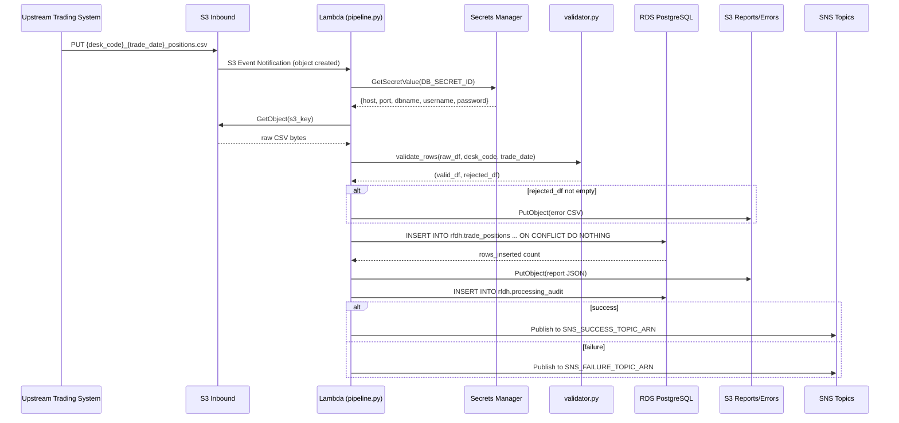
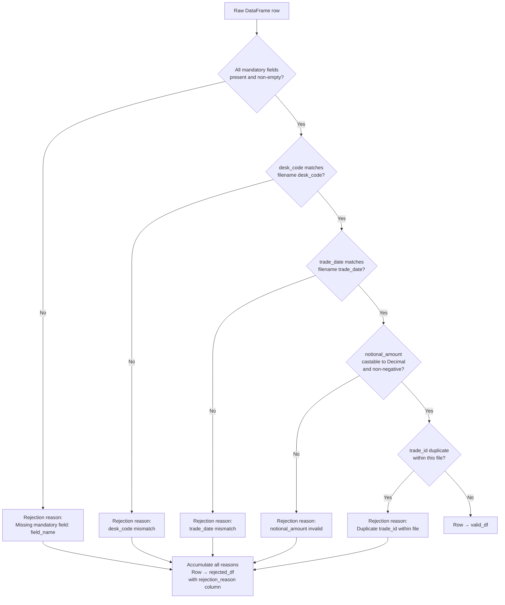
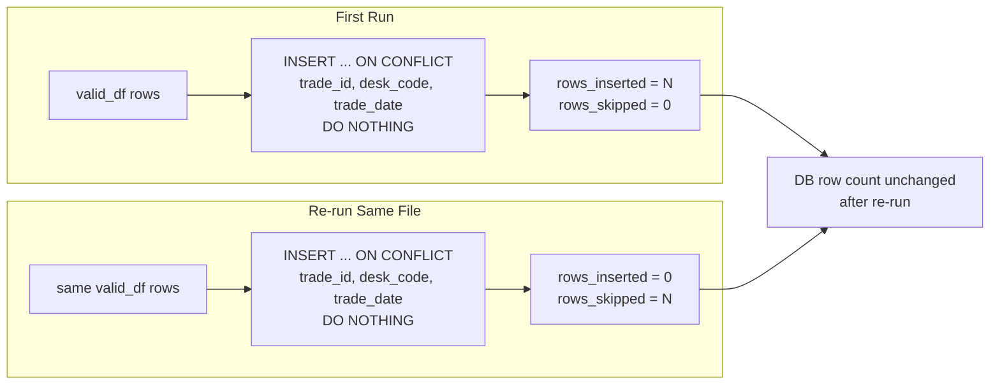
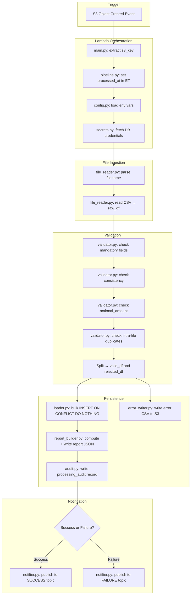

# Technical Design Document
## Daily Trade Position Ingestion
**RFDH — Risk Finance Data Hub**
**Version:** 1.0 | **Date:** June 2026 | **Status:** Draft

---

## COMPONENTS

### `config.py`
**Purpose:** Centralises all environment variable reads and runtime constants. All other modules import from this file — no module reads `os.environ` directly except `config.py`.

**Reads:**
- `os.environ["S3_BUCKET"]` — S3 bucket name for inbound files and report output
- `os.environ["S3_INBOUND_PREFIX"]` — S3 prefix for incoming position files (e.g. `inbound/positions/`)
- `os.environ["S3_REPORT_PREFIX"]` — S3 prefix for summary reports (e.g. `reports/positions/`)
- `os.environ["S3_ERROR_PREFIX"]` — S3 prefix for error files (e.g. `errors/positions/`)
- `os.environ["DB_SECRET_ID"]` — Secrets Manager secret ID containing database credentials
- `os.environ["APP_SECRET_ID"]` — Secrets Manager secret ID containing application-level config (e.g. SNS ARN)
- `os.environ["SNS_SUCCESS_TOPIC_ARN"]` — ARN of SNS topic for success notifications
- `os.environ["SNS_FAILURE_TOPIC_ARN"]` — ARN of SNS topic for failure notifications
- `os.environ["PROCESSING_SERVICE_ID"]` — logical identifier of this service instance (for audit trail)

**Writes:** Nothing. Exposes a `Config` dataclass with typed fields populated from env vars at import time.

**Satisfies:** BAC-7 (ET timezone constant defined here), BAC-8 (no hardcoded credentials)

---

### `secrets.py`
**Purpose:** Retrieves and caches credentials from AWS Secrets Manager at runtime. Provides a typed interface so callers never handle raw secret JSON.

**Exact function signatures:**
```
get_db_credentials(secret_id: str) -> DbCredentials
get_app_config(secret_id: str) -> AppConfig
```

`DbCredentials` fields: `host: str`, `port: int`, `dbname: str`, `username: str`, `password: str`
`AppConfig` fields: (any application-level non-credential config stored in secrets)

**Reads:** AWS Secrets Manager via `boto3.client("secretsmanager")`. Secret JSON keys documented in DATA CONTRACTS.

**Writes:** Nothing. Returns typed dataclasses.

**Satisfies:** BAC-8 (all secrets retrieved at runtime from Secrets Manager, never from code or config files)

---

### `file_reader.py`
**Purpose:** Reads a CSV file from S3 into a raw pandas DataFrame without any type coercion or validation. Parses the filename to extract `desk_code` and `trade_date` per the naming convention `{desk_code}_{trade_date}_positions.csv`.

**Exact function signatures:**
```
read_position_file(s3_client, bucket: str, s3_key: str) -> tuple[pd.DataFrame, str, str]
parse_filename(s3_key: str) -> tuple[str, str]
```

`read_position_file` returns `(raw_df, desk_code, trade_date)` where all columns in `raw_df` are read as `str` (dtype=object) to preserve raw values for validation.

`parse_filename` extracts `desk_code` and `trade_date` from the S3 key basename. Raises `ValueError` if the filename does not match the pattern `^[A-Z0-9]+_\d{8}_positions\.csv$` (trade_date as `YYYYMMDD`).

**Reads:** S3 object at `{S3_INBOUND_PREFIX}{filename}`. CSV with header row. Expected columns: `trade_id`, `desk_code`, `trade_date`, `instrument_type`, `notional_amount`, `currency`, `counterparty_id`.

**Writes:** Nothing to storage. Returns raw DataFrame.

**Satisfies:** BAC-1, BAC-2 (foundation for subsequent validation)

---

### `validator.py`
**Purpose:** Validates each row of the raw DataFrame against mandatory-field and type rules. Produces two DataFrames: one containing valid rows ready for loading, one containing rejected rows with rejection reasons.

**Exact function signatures:**
```
validate_rows(df: pd.DataFrame, desk_code: str, trade_date: str) -> tuple[pd.DataFrame, pd.DataFrame]
_check_mandatory_fields(row: pd.Series) -> list[str]
_check_trade_date_consistency(row: pd.Series, expected_trade_date: str) -> list[str]
_check_notional_amount(row: pd.Series) -> list[str]
```

**Validation rules applied per row (in order):**
1. **Mandatory field presence:** `trade_id`, `desk_code`, `trade_date`, `instrument_type`, `notional_amount`, `currency`, `counterparty_id` must all be non-null and non-empty-string. Rejection reason: `"Missing mandatory field: {field_name}"`.
2. **Desk code consistency:** `desk_code` column value must match `desk_code` parsed from filename. Rejection reason: `"desk_code mismatch: file states {filename_desk_code}, row contains {row_desk_code}"`.
3. **Trade date consistency:** `trade_date` column value must match `trade_date` parsed from filename. Rejection reason: `"trade_date mismatch: file states {filename_trade_date}, row contains {row_trade_date}"`.
4. **Notional amount format:** `notional_amount` must be castable to `Decimal` and be non-negative. Rejection reason: `"notional_amount is not a valid non-negative number: {raw_value}"`.
5. **trade_id uniqueness within the file:** Duplicate `trade_id` within the same file (same desk/date) is rejected. Rejection reason: `"Duplicate trade_id within file: {trade_id}"`.

`validate_rows` returns `(valid_df, rejected_df)`. `rejected_df` contains all original columns plus a `rejection_reason: str` column containing a semicolon-delimited list of all failure reasons for that row.

**Writes:** Nothing to storage.

**Satisfies:** BAC-2 (5 invalid rows → error file with specific reasons), BAC-4 (rejected count accurate)

---

### `loader.py`
**Purpose:** Loads validated rows into `rfdh.trade_positions` using a bulk upsert pattern. Connects to the reporting database using credentials from `secrets.py`. Uses `INSERT ... ON CONFLICT (trade_id, desk_code, trade_date) DO NOTHING` to enforce idempotency. Returns the count of rows actually inserted (not skipped).

**Exact function signatures:**
```
load_positions(valid_df: pd.DataFrame, db_credentials: DbCredentials, processed_at: datetime) -> int
_build_connection(db_credentials: DbCredentials) -> psycopg2.connection
```

**Behaviour:**
- Converts `notional_amount` to `Decimal` before insert.
- Sets `processed_at` column to the `processed_at` datetime passed in (ET-localised).
- Uses `psycopg2.extras.execute_values` for batch insert of all valid rows in a single statement.
- The conflict target is the unique constraint `uq_trade_positions_key` on `(trade_id, desk_code, trade_date)`.
- Returns the `rowcount` from the cursor after execution (rows inserted, not skipped by conflict).
- Commits on success; rolls back and re-raises on any exception.

**SQL template:**
```sql
INSERT INTO rfdh.trade_positions
  (trade_id, desk_code, trade_date, instrument_type, notional_amount, currency, counterparty_id, processed_at)
VALUES %s
ON CONFLICT (trade_id, desk_code, trade_date) DO NOTHING
```

**Satisfies:** BAC-1 (all valid rows loaded), BAC-3 (idempotent — duplicates silently skipped), BAC-7 (processed_at in ET)

---

### `error_writer.py`
**Purpose:** Writes the rejected rows DataFrame to S3 as a CSV error file. If there are zero rejected rows, no file is written.

**Exact function signatures:**
```
write_error_file(s3_client, rejected_df: pd.DataFrame, bucket: str, error_prefix: str, desk_code: str, trade_date: str, processed_at: datetime) -> str | None
```

**Output S3 key pattern:**
`{error_prefix}{desk_code}_{trade_date}_errors_{processed_at_yyyymmddhhmmss}.csv`

where `processed_at_yyyymmddhhmmss` is the ET timestamp formatted as `%Y%m%d%H%M%S`.

**Output CSV columns (in order):** `trade_id`, `desk_code`, `trade_date`, `instrument_type`, `notional_amount`, `currency`, `counterparty_id`, `rejection_reason`

Returns the S3 key of the written file, or `None` if no rejections.

**Satisfies:** BAC-2 (error file lists all rejected rows with reasons)

---

### `report_builder.py`
**Purpose:** Computes the summary report from the raw DataFrame, valid DataFrame, and rejected DataFrame. Stores the report as a JSON file in S3.

**Exact function signatures:**
```
build_report(
    raw_df: pd.DataFrame,
    valid_df: pd.DataFrame,
    rejected_df: pd.DataFrame,
    rows_inserted: int,
    desk_code: str,
    trade_date: str,
    processed_at: datetime,
    s3_key_source: str
) -> dict
write_report(s3_client, report: dict, bucket: str, report_prefix: str, desk_code: str, trade_date: str, processed_at: datetime) -> str
```

**Report dict structure (exact keys):**
```json
{
  "desk_code": "string",
  "trade_date": "string (YYYYMMDD)",
  "source_s3_key": "string",
  "processed_at": "string (ISO-8601 ET, e.g. 2026-06-01T19:45:00-04:00)",
  "total_rows_received": "integer",
  "rows_loaded": "integer",
  "rows_rejected": "integer",
  "rows_skipped_duplicate_db": "integer",
  "counts_by_desk_code": {"desk_code_value": "integer"},
  "notional_amount_min": "string (decimal, 2dp)",
  "notional_amount_max": "string (decimal, 2dp)",
  "null_rates_per_column": {
    "trade_id": "float (0.0–1.0)",
    "desk_code": "float",
    "trade_date": "float",
    "instrument_type": "float",
    "notional_amount": "float",
    "currency": "float",
    "counterparty_id": "float"
  }
}
```

**Computation rules:**
- `total_rows_received` = `len(raw_df)`
- `rows_loaded` = `rows_inserted` (actual DB inserts, not valid rows passed to loader)
- `rows_rejected` = `len(rejected_df)`
- `rows_skipped_duplicate_db` = `len(valid_df) - rows_inserted`
- `counts_by_desk_code` = `raw_df.groupby("desk_code").size().to_dict()` (using raw values before validation)
- `notional_amount_min` / `_max` computed from `valid_df["notional_amount"]` cast to `Decimal`
- `null_rates_per_column` = proportion of null/empty-string values per column across `raw_df`

**Output S3 key pattern:**
`{report_prefix}{desk_code}_{trade_date}_report_{processed_at_yyyymmddhhmmss}.json`

**Satisfies:** BAC-4 (correct counts, min/max notional, null rates), BAC-7 (processed_at in ET)

---

### `notifier.py`
**Purpose:** Publishes SNS notifications for success and failure events. Formats the SNS message payload as JSON.

**Exact function signatures:**
```
notify_success(sns_client, topic_arn: str, report: dict) -> None
notify_failure(sns_client, topic_arn: str, desk_code: str, trade_date: str, s3_key: str, error_message: str, processed_at: datetime) -> None
```

**Success message JSON structure:** identical to the report dict from `report_builder.py` with an additional top-level field `"event_type": "POSITION_LOAD_SUCCESS"`.

**Failure message JSON structure:**
```json
{
  "event_type": "POSITION_LOAD_FAILURE",
  "desk_code": "string",
  "trade_date": "string",
  "source_s3_key": "string",
  "error_message": "string",
  "processed_at": "string (ISO-8601 ET)"
}
```

**Satisfies:** BAC-5 (downstream notified with correct statistics)

---

### `audit.py`
**Purpose:** Writes one audit record per file processing attempt to `rfdh.processing_audit`. Called at the end of processing (success or failure). Ensures a complete, immutable audit trail for OSFI/SOX compliance.

**Exact function signatures:**
```
write_audit_record(
    conn: psycopg2.connection,
    desk_code: str,
    trade_date: str,
    s3_key: str,
    processing_service_id: str,
    status: str,  # "SUCCESS" | "FAILURE"
    total_rows: int,
    rows_loaded: int,
    rows_rejected: int,
    error_message: str | None,
    processed_at: datetime
) -> None
```

Executes `INSERT INTO rfdh.processing_audit (...) VALUES (...)` — no upsert, every attempt creates a new record (non-idempotent by design to preserve full history).

**Satisfies:** BAC-7 (processed_at in ET), NFR 3.3 (complete audit trail)

---

### `pipeline.py`
**Purpose:** Orchestrates the end-to-end pipeline for a single file. Invoked by the entry point with the S3 key of the file to process. Coordinates all modules in sequence. Handles top-level exception catching and failure notification.

**Exact function signatures:**
```
run_pipeline(s3_key: str) -> None
```

**Execution sequence:**
1. Resolve ET timestamp for `processed_at` using `pytz.timezone("America/Toronto")`.
2. Load `Config` from `config.py`.
3. Retrieve `DbCredentials` via `secrets.py`.
4. Call `file_reader.read_position_file` → `(raw_df, desk_code, trade_date)`.
5. Call `validator.validate_rows` → `(valid_df, rejected_df)`.
6. Call `error_writer.write_error_file` (if any rejections).
7. Open DB connection via `loader._build_connection`.
8. Call `loader.load_positions` → `rows_inserted`.
9. Call `report_builder.build_report` → `report`.
10. Call `report_builder.write_report` → writes JSON to S3.
11. Call `notifier.notify_success`.
12. Call `audit.write_audit_record` with `status="SUCCESS"`.
13. On any unhandled exception: call `notifier.notify_failure`, call `audit.write_audit_record` with `status="FAILURE"`, re-raise.

**Satisfies:** BAC-1 through BAC-8 (orchestrates all components)

---

### `main.py`
**Purpose:** Entry point. Determines trigger mechanism (S3 event via Lambda or direct invocation), extracts the S3 key of the file to process, and calls `pipeline.run_pipeline(s3_key)`.

**Exact function signatures:**
```
lambda_handler(event: dict, context) -> dict
```

Extracts `s3_key` from `event["Records"][0]["s3"]["object"]["key"]` (S3-triggered Lambda event structure). Calls `pipeline.run_pipeline(s3_key)`. Returns `{"statusCode": 200, "body": "OK"}` on success or `{"statusCode": 500, "body": str(e)}` on failure.

**Satisfies:** Trigger integration for BAC-1 through BAC-6

---

## AWS SERVICES

| Service | Role |
|---|---|
| **Amazon S3** | Stores inbound position CSV files, output error files, and JSON summary reports. Triggers Lambda on file arrival via S3 event notification. |
| **AWS Lambda** | Executes the ingestion pipeline per file. Invoked by S3 event notification on object creation in the inbound prefix. |
| **Amazon RDS (PostgreSQL)** | Hosts the `rfdh` schema containing `trade_positions` and `processing_audit` tables. |
| **AWS Secrets Manager** | Stores database credentials and application config. Retrieved at Lambda cold start via `boto3`. |
| **Amazon SNS** | Publishes success and failure notifications to downstream subscribers (risk calculation pipeline). Two topics: one for success events, one for failure events. |
| **Amazon CloudWatch** | Receives structured log output from Lambda via the `logging` module. Supports operational monitoring and alerting. |

---

## DATA CONTRACTS

### Database Tables

#### `rfdh.trade_positions`

| Column | Data Type | Constraints | Notes |
|---|---|---|---|
| `id` | `BIGSERIAL` | PRIMARY KEY | Surrogate key, auto-generated |
| `trade_id` | `VARCHAR(100)` | NOT NULL | From file |
| `desk_code` | `VARCHAR(50)` | NOT NULL | From file and filename |
| `trade_date` | `DATE` | NOT NULL | Parsed from `YYYYMMDD` string |
| `instrument_type` | `VARCHAR(100)` | NOT NULL | From file |
| `notional_amount` | `NUMERIC(28, 10)` | NOT NULL | Validated as non-negative decimal |
| `currency` | `CHAR(3)` | NOT NULL | ISO 4217 currency code |
| `counterparty_id` | `VARCHAR(100)` | NOT NULL | From file |
| `processed_at` | `TIMESTAMPTZ` | NOT NULL | ET-localised datetime of processing run |

**Unique Constraint:** `uq_trade_positions_key UNIQUE (trade_id, desk_code, trade_date)` — this is the conflict target for `ON CONFLICT DO NOTHING`.

**Index:** `idx_trade_positions_desk_date ON rfdh.trade_positions (desk_code, trade_date)` — supports downstream risk queries by desk and date.

---

#### `rfdh.processing_audit`

| Column | Data Type | Constraints | Notes |
|---|---|---|---|
| `id` | `BIGSERIAL` | PRIMARY KEY | Surrogate key, auto-generated |
| `desk_code` | `VARCHAR(50)` | NOT NULL | From filename |
| `trade_date` | `DATE` | NOT NULL | From filename |
| `s3_key` | `TEXT` | NOT NULL | Full S3 key of the processed file |
| `processing_service_id` | `VARCHAR(200)` | NOT NULL | From `os.environ["PROCESSING_SERVICE_ID"]` |
| `status` | `VARCHAR(10)` | NOT NULL | `'SUCCESS'` or `'FAILURE'` |
| `total_rows` | `INTEGER` | NOT NULL | Total rows received in file |
| `rows_loaded` | `INTEGER` | NOT NULL | Rows actually inserted into DB |
| `rows_rejected` | `INTEGER` | NOT NULL | Rows failed validation |
| `error_message` | `TEXT` | NULL allowed | Populated on `FAILURE` status |
| `processed_at` | `TIMESTAMPTZ` | NOT NULL | ET-localised datetime of processing run |

**Index:** `idx_processing_audit_desk_date ON rfdh.processing_audit (desk_code, trade_date)` — supports audit queries by desk and date.

---

### S3 Paths

| Path Pattern | Format | Description |
|---|---|---|
| `{S3_INBOUND_PREFIX}{desk_code}_{trade_date}_positions.csv` | CSV, UTF-8, comma-delimited, with header row | Inbound position files deposited by upstream systems. `trade_date` as `YYYYMMDD`. |
| `{S3_ERROR_PREFIX}{desk_code}_{trade_date}_errors_{YYYYMMDDHHMMSS}.csv` | CSV, UTF-8, comma-delimited, with header row | Rejected rows with `rejection_reason` appended as final column. Only written when `len(rejected_df) > 0`. |
| `{S3_REPORT_PREFIX}{desk_code}_{trade_date}_report_{YYYYMMDDHHMMSS}.json` | JSON, UTF-8 | Summary report for downstream consumption. One file per processing run. |

All timestamps in S3 filenames are ET (`America/Toronto`), formatted `%Y%m%d%H%M%S`.

---

### Secrets Manager

#### Database credentials secret (`os.environ["DB_SECRET_ID"]`)
```json
{
  "host": "string — RDS hostname",
  "port": "integer — RDS port (e.g. 5432)",
  "dbname": "string — database name",
  "username": "string — DB user",
  "password": "string — DB password"
}
```

#### Application config secret (`os.environ["APP_SECRET_ID"]`)
No additional secrets required beyond env vars for this design; `APP_SECRET_ID` is reserved for future use. If SNS ARNs are considered sensitive, they move here; otherwise they remain as env vars.

---

### SNS Topics

#### Success Topic (`os.environ["SNS_SUCCESS_TOPIC_ARN"]`)

**Message JSON:**
```json
{
  "event_type": "POSITION_LOAD_SUCCESS",
  "desk_code": "string",
  "trade_date": "string (YYYYMMDD)",
  "source_s3_key": "string",
  "processed_at": "string (ISO-8601 with ET offset, e.g. 2026-06-01T19:45:00-04:00)",
  "total_rows_received": 1000,
  "rows_loaded": 995,
  "rows_rejected": 5,
  "rows_skipped_duplicate_db": 0,
  "counts_by_desk_code": {"EQTY": 1000},
  "notional_amount_min": "10000.00",
  "notional_amount_max": "9500000.00",
  "null_rates_per_column": {
    "trade_id": 0.0,
    "desk_code": 0.0,
    "trade_date": 0.0,
    "instrument_type": 0.002,
    "notional_amount": 0.0,
    "currency": 0.0,
    "counterparty_id": 0.003
  }
}
```

#### Failure Topic (`os.environ["SNS_FAILURE_TOPIC_ARN"]`)

**Message JSON:**
```json
{
  "event_type": "POSITION_LOAD_FAILURE",
  "desk_code": "string",
  "trade_date": "string (YYYYMMDD)",
  "source_s3_key": "string",
  "error_message": "string — exception type and message",
  "processed_at": "string (ISO-8601 with ET offset)"
}
```

---

### Environment Variables Reference

| Variable | Purpose |
|---|---|
| `S3_BUCKET` | S3 bucket for all file I/O |
| `S3_INBOUND_PREFIX` | S3 prefix for inbound position CSVs |
| `S3_REPORT_PREFIX` | S3 prefix for summary report JSONs |
| `S3_ERROR_PREFIX` | S3 prefix for error CSVs |
| `DB_SECRET_ID` | Secrets Manager ID for DB credentials |
| `APP_SECRET_ID` | Secrets Manager ID for app config (reserved) |
| `SNS_SUCCESS_TOPIC_ARN` | ARN of success SNS topic |
| `SNS_FAILURE_TOPIC_ARN` | ARN of failure SNS topic |
| `PROCESSING_SERVICE_ID` | Logical service name for audit trail |

---

## DATA FLOW

### End-to-End Pipeline Flow



---

### Validation Decision Logic



---

### Idempotency and Deduplication Logic



---

### Processing Pipeline with Swimlanes



---

## TECHNICAL ACCEPTANCE CRITERIA

### TAC-1 — Valid file fully loaded with zero errors
**BAC-1:** A valid 1,000-row file is fully loaded with zero errors; DB row count matches file.

**Mechanism:**
- `validator.validate_rows` returns `rejected_df` with `len(rejected_df) == 0` for a clean file.
- `loader.load_positions` executes `INSERT INTO rfdh.trade_positions (...) VALUES %s ON CONFLICT (trade_id, desk_code, trade_date) DO NOTHING` via `execute_values`.
- Test asserts: `rows_inserted == 1000`, `SELECT COUNT(*) FROM rfdh.trade_positions WHERE desk_code = '{desk_code}' AND trade_date = '{trade_date}'` returns `1000`.
- `report["rows_rejected"] == 0`, `report["rows_loaded"] == 1000`.

---

### TAC-2 — Invalid rows produce error file with specific reasons
**BAC-2:** A file with 5 invalid rows produces an error file listing all 5 rejections with specific, human-readable reasons.

**Mechanism:**
- `validator.validate_rows` appends to `rejected_df` for each row failing any rule. The `rejection_reason` column contains a semicolon-delimited string of all applicable failure reasons for that row (e.g. `"Missing mandatory field: currency; notional_amount is not a valid non-negative number: -50"`).
- `error_writer.write_error_file` writes `rejected_df` to S3 only if `len(rejected_df) > 0`.
- Test asserts: error CSV at the expected S3 key contains exactly 5 data rows (excluding header); each row's `rejection_reason` column is non-empty and contains a string matching one of the defined reason templates.

---

### TAC-3 — Reprocessing does not create duplicate records
**BAC-3:** Reprocessing the same file does not change the DB row count.

**Mechanism:**
- `loader.load_positions` uses `ON CONFLICT (trade_id, desk_code, trade_date) DO NOTHING`, enforced by the unique constraint `uq_trade_positions_key`.
- Test sequence: (1) run pipeline with file A → assert `COUNT(*) == N`. (2) run pipeline with identical file A → assert `COUNT(*) == N` (unchanged). (3) assert `rows_inserted == 0` on the second run, `rows_skipped_duplicate_db == N` in the report.

---

### TAC-4 — Summary report contains correct statistics
**BAC-4:** Report contains correct total/loaded/rejected counts, correct min/max notional, accurate null rates.

**Mechanism:**
- `report_builder.build_report` computes all statistics deterministically from the same DataFrames used for loading.
- Test asserts for a known test fixture file:
  - `report["total_rows_received"] == len(raw_df)`
  - `report["rows_loaded"] == rows_inserted` (actual DB insert count)
  - `report["rows_rejected"] == len(rejected_df)`
  - `report["notional_amount_min"]` and `["notional_amount_max"]` match `min()`/`max()` of `valid_df["notional_amount"]` cast to `Decimal`, formatted to 2 dp.
  - `report["null_rates_per_column"]["trade_id"]` equals `(count of null or empty-string trade_id in raw_df) / len(raw_df)`.
- Report JSON is written to `{S3_REPORT_PREFIX}{desk_code}_{trade_date}_report_{YYYYMMDDHHMMSS}.json` and is parseable as valid JSON.

---

### TAC-5 — Downstream systems notified with correct statistics
**BAC-5:** SNS success notification contains correct summary statistics.

**Mechanism:**
- `notifier.notify_success` publishes to `os.environ["SNS_SUCCESS_TOPIC_ARN"]` via `boto3.client("sns").publish(TopicArn=..., Message=json.dumps(report_with_event_type))`.
- Test asserts: SNS message payload (captured via mock or SQS subscription in integration test) deserialises to a dict where `event_type == "POSITION_LOAD_SUCCESS"`, `rows_loaded`, `rows_rejected`, `total_rows_received`, `notional_amount_min`, `notional_amount_max`, and `null_rates_per_column` are all present and match the values in the written report JSON.
- Failure path: on exception, `notifier.notify_failure` publishes to `os.environ["SNS_FAILURE_TOPIC_ARN"]` with `event_type == "POSITION_LOAD_FAILURE"` and a non-empty `error_message`.

---

### TAC-6 — Processing completes within 60 seconds for 10,000 rows
**BAC-6:** End-to-end pipeline for a 10,000-row file completes in < 60 seconds.

**Mechanism:**
- `loader.load_positions` uses `psycopg2.extras.execute_values` for a single batch insert statement rather than row-by-row inserts.
- `validator.validate_rows` operates via vectorised pandas operations where possible; row-level checks use `df.apply` only where necessary.
- Performance test: time `pipeline.run_pipeline(s3_key)` with a 10,000-row fixture from end to end (S3 read → validation → DB insert → S3 write → SNS publish). Assert elapsed time < 60 seconds. Test run in an environment representative of the Lambda memory/CPU configuration.

---

### TAC-7 — All timestamps in Eastern Time
**BAC-7:** No UTC timestamps appear in any output (reports, database, audit trail).

**Mechanism:**
- `processed_at` is always created as `datetime.now(pytz.timezone("America/Toronto"))` in `pipeline.py` before any processing begins.
- This single `processed_at` value is threaded through all downstream calls: `loader.load_positions`, `report_builder.build_report`, `audit.write_audit_record`, `error_writer.write_error_file`.
- `processed_at` column in `rfdh.trade_positions` and `rfdh.processing_audit` is `TIMESTAMPTZ`; the inserted value carries an ET offset (e.g. `-04:00` or `-05:00`), not `+00:00`.
- JSON report and SNS message serialize `processed_at` using `datetime.isoformat()` which preserves the offset (e.g. `2026-06-01T19:45:00-04:00`).
- Test asserts: (a) `SELECT processed_at AT TIME ZONE 'America/Toronto' FROM rfdh.trade_positions LIMIT 1` returns a timestamp with offset `-04:00` or `-05:00`. (b) `report["processed_at"]` does not contain `+00:00` or end in `Z`. (c) SNS message `processed_at` field does not contain `+00:00` or end in `Z`.

---

### TAC-8 — No credentials in codebase
**BAC-8:** No passwords, tokens, or secret values appear in any committed file.

**Mechanism:**
- `secrets.py` is the only module that calls `boto3.client("secretsmanager").get_secret_value(SecretId=secret_id)`.
- All DB connection parameters (`host`, `port`, `dbname`, `username`, `password`) originate exclusively from the `DbCredentials` dataclass returned by `secrets.get_db_credentials`.
- No module contains string literals matching patterns for passwords, connection strings with embedded credentials, or base64-encoded secrets.
- Test/audit: static analysis scan (e.g. `detect-secrets` or `trufflehog`) on the repository finds zero credential findings. No `.env` files with populated secret values are committed.

---

## OPEN QUESTIONS

None. All business logic is sufficiently specified in the BRD to proceed with implementation. Infrastructure configuration uses environment variables as documented above.

---

## ASSUMPTIONS

| # | Assumption | Impact if Wrong |
|---|---|---|
| A-1 | The reporting database is **PostgreSQL** (RDS). The `ON CONFLICT ... DO NOTHING` syntax and `psycopg2` are used based on this assumption. | If a different DB engine is used, the upsert syntax and driver change. |
| A-2 | The pipeline is deployed as an **AWS Lambda function** triggered by S3 `ObjectCreated` event notifications on the inbound prefix. Lambda is the compute platform. | If ECS, EC2, or Fargate is used instead, `main.py`'s `lambda_handler` entry point changes to a long-running process or different invocation model. |
| A-3 | All inbound files use **comma as the delimiter** and include a **header row** with exactly the column names specified. No quoting edge cases beyond standard CSV RFC 4180. | If delimiter varies or headers are absent, `file_reader.py` requires parameterisation. |
| A-4 | `trade_date` in the filename is formatted as **8-digit `YYYYMMDD`** (e.g. `20260601`). | If the date format differs, the filename parser regex breaks. |
| A-5 | `desk_code` in the filename contains only **uppercase alphanumeric characters** (regex `[A-Z0-9]+`). | If desk codes contain hyphens, underscores, or lowercase, the filename parser regex must be updated. |
| A-6 | `currency` is expected to be a **3-character ISO 4217 code** (e.g. `USD`, `CAD`). Currency value validation (beyond presence/non-empty) is **not** enforced — only mandatory field presence is checked. | If strict ISO 4217 validation is required, a currency whitelist check must be added to `validator.py`. |
| A-7 | **Partial file failures are acceptable**: rows that pass validation are loaded; rows that fail are rejected. The pipeline does not abort the entire file if some rows are invalid. A file with both valid and invalid rows results in a partial load with an error file. | If all-or-nothing transactional loading is required (reject entire file if any row fails), the pipeline logic must change to a pre-validation gate. |
| A-8 | The **`rfdh` schema and both tables** (`trade_positions`, `processing_audit`) are pre-created in the database before the pipeline runs. The pipeline does not execute DDL. | If the tables don't exist, inserts will fail. A migration script (outside this pipeline's scope) must create them. |
| A-9 | The S3 bucket already has **S3 event notifications configured** to trigger the Lambda on `ObjectCreated` events for the inbound prefix. This is pre-existing infrastructure. | If notifications are not configured, files will land in S3 but the Lambda will not be invoked. |
| A-10 | Lambda has **sufficient memory (≥ 512 MB)** and a **timeout of ≥ 90 seconds** configured to comfortably handle 10,000-row files within the 60-second BAC-6 target with headroom. | If memory is too low or timeout too short, large files will fail. |
| A-11 | The Lambda execution role has IAM permissions for: `s3:GetObject` on inbound prefix, `s3:PutObject` on report and error prefixes, `secretsmanager:GetSecretValue` on the relevant secret IDs, `sns:Publish` on both SNS topic ARNs, and network access to RDS (via VPC configuration). | If permissions are missing, the pipeline will fail at the corresponding step. |
| A-12 | **`notional_amount` min/max statistics** in the report are computed from **valid rows only** (rows that passed validation), not all raw rows. | If the business requires min/max across all received rows (including invalid ones), `report_builder.py` must be updated. |
| A-13 | The **`rows_skipped_duplicate_db`** metric is computed as `len(valid_df) - rows_inserted`. This reflects rows that were valid but already existed in the DB from a prior run. | This calculation is correct only if `execute_values` with `ON CONFLICT DO NOTHING` returns the count of rows actually inserted (not the count of rows attempted). This is standard `psycopg2` behaviour. |
| A-14 | **Re-runs of the same file** may produce multiple error files and report files in S3 (one per run, distinguished by the `processed_at` timestamp in the filename). No cleanup of prior run outputs is performed. | If only the latest run's output should be retained, a cleanup or overwrite step must be added. |
| A-15 | The **`processing_service_id`** in the audit table is a static string set via the `PROCESSING_SERVICE_ID` environment variable (e.g. `"rfdh-position-ingestion-lambda"`). It does not capture the specific Lambda invocation ID. | If per-invocation traceability is required, the Lambda `context.aws_request_id` should also be stored in the audit table. |