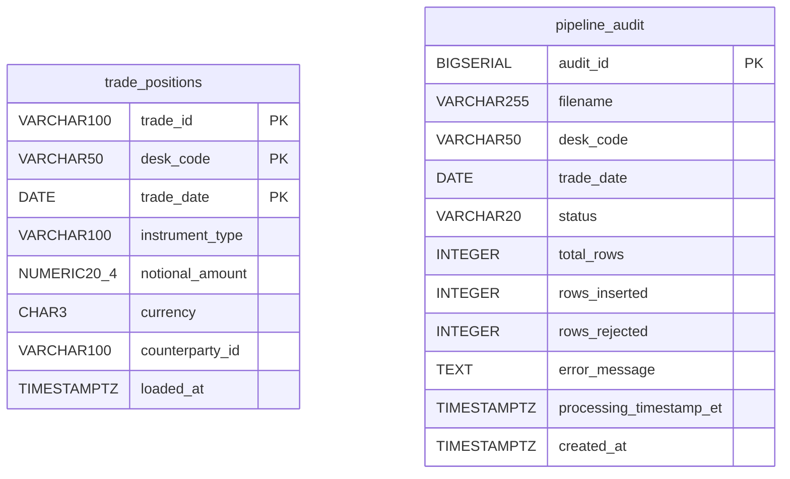
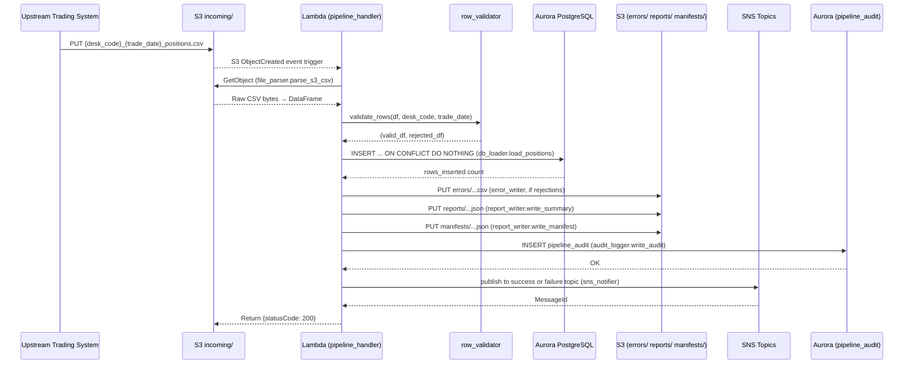
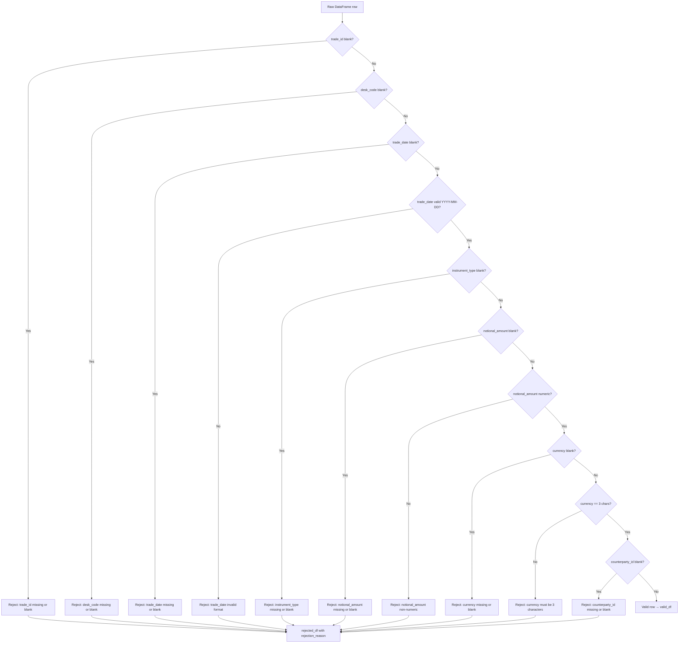
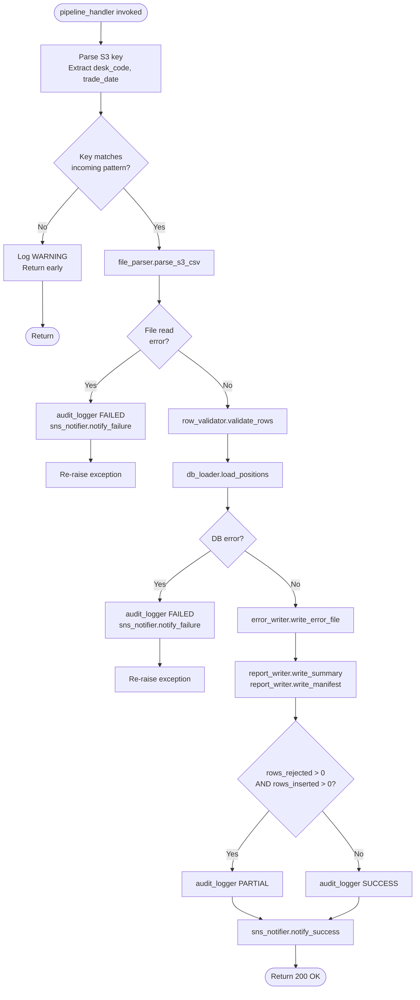

# Technical Design Document (TDD)

## Daily Trade Position Ingestion
**Project:** agentic-poc-sandbox
**Repo:** nartcr/agentic-poc-sandbox
**Team:** Sample Trade Operations
**Date:** June 2026
**Status:** Draft

---

### COMPONENTS

#### `pipeline_handler.py` — Lambda Entry Point & Orchestrator

**What it does:**
Top-level Lambda handler function. Receives an S3 event trigger (or direct invocation), extracts the S3 bucket and key from the event payload, and orchestrates the full pipeline: file parsing → validation → DB loading → report generation → notification dispatch → audit write.

Exports:
```
def handler(event: dict, context: object) -> dict
```

- Parses `event["Records"][0]["s3"]["bucket"]["name"]` and `event["Records"][0]["s3"]["object"]["key"]` to obtain the bucket and input file key.
- Validates the key matches the pattern `incoming/{desk_code}_{trade_date}_positions.csv` using a regex; if not, logs a warning and returns early.
- Calls `file_parser.parse_s3_csv(bucket, key)` → returns raw DataFrame.
- Calls `row_validator.validate_rows(df, desk_code, trade_date)` → returns `(valid_df, rejected_df)`.
- Calls `db_loader.load_positions(valid_df)` → returns `rows_inserted: int`.
- Calls `report_writer.write_summary(bucket, key, valid_df, rejected_df, rows_inserted)` → returns `report_s3_key: str`.
- Calls `report_writer.write_manifest(bucket, desk_code, trade_date, report_s3_key, error_s3_key)` → returns manifest key.
- Calls `error_writer.write_error_file(bucket, key, rejected_df)` → returns `error_s3_key: str` (empty string if no rejections).
- Calls `audit_logger.write_audit(filename, desk_code, trade_date, status, total, inserted, rejected, error_msg)`.
- Calls `sns_notifier.notify_success(summary_dict)` or `sns_notifier.notify_failure(error_dict)`.
- On any unhandled exception, calls `sns_notifier.notify_failure(...)` and `audit_logger.write_audit(... status="FAILED" ...)` before re-raising.
- Returns `{"statusCode": 200, "body": "OK"}` on success.

**Reads:** S3 event payload (dict).
**Writes:** Nothing directly; delegates to submodules.
**Satisfies:** BAC-1, BAC-2, BAC-3, BAC-4, BAC-5, BAC-6, BAC-7, BAC-8

---

#### `file_parser.py` — S3 CSV Reader

**What it does:**
Reads a CSV file from S3 into a `pandas.DataFrame`. Does not perform validation — returns raw content.

Exports:
```
def parse_s3_csv(bucket: str, key: str) -> pd.DataFrame
```

- Uses `boto3.client("s3")` (no credentials in code; relies on Lambda execution role).
- Reads object body with `s3.get_object(Bucket=bucket, Key=key)["Body"]`.
- Parses body with `pd.read_csv(io.BytesIO(body), dtype=str, keep_default_na=False)` — all columns read as strings to preserve raw values for validation.
- Returns the DataFrame with all columns as raw strings; no type coercion at this stage.
- If the file is empty or unreadable, raises `ValueError` with a descriptive message.

**Reads:** S3 object at `s3://{S3_BUCKET}/{key}` where `key` starts with `incoming/`.
**Writes:** Nothing to any store.
**Satisfies:** BAC-1, BAC-6

---

#### `row_validator.py` — Per-Row Data Quality Validator

**What it does:**
Validates every row in the raw DataFrame against mandatory field rules. Returns two DataFrames: `valid_df` (rows that pass all checks) and `rejected_df` (rows that failed, with a `rejection_reason` column appended).

Exports:
```
def validate_rows(df: pd.DataFrame, desk_code: str, trade_date: str) -> tuple[pd.DataFrame, pd.DataFrame]
```

**Validation rules applied in order (first failure wins per row):**

| Check | Rejection Reason String |
|---|---|
| `trade_id` is blank/null/whitespace-only | `"trade_id: missing or blank"` |
| `desk_code` is blank/null/whitespace-only | `"desk_code: missing or blank"` |
| `trade_date` is blank/null/whitespace-only | `"trade_date: missing or blank"` |
| `trade_date` is not parseable as YYYY-MM-DD | `"trade_date: invalid format, expected YYYY-MM-DD"` |
| `instrument_type` is blank/null/whitespace-only | `"instrument_type: missing or blank"` |
| `notional_amount` is blank/null/whitespace-only | `"notional_amount: missing or blank"` |
| `notional_amount` is not parseable as a decimal number | `"notional_amount: non-numeric value"` |
| `currency` is blank/null/whitespace-only | `"currency: missing or blank"` |
| `currency` is not exactly 3 characters | `"currency: must be exactly 3 characters"` |
| `counterparty_id` is blank/null/whitespace-only | `"counterparty_id: missing or blank"` |

- Rows passing all checks go into `valid_df` (with columns: `trade_id`, `desk_code`, `trade_date`, `instrument_type`, `notional_amount`, `currency`, `counterparty_id`; types cast appropriately: `trade_date` → `datetime.date`, `notional_amount` → `Decimal`).
- Rejected rows go into `rejected_df` with all original columns plus `rejection_reason: str`.
- If `df` has no rows at all, returns `(empty_valid_df, empty_rejected_df)`.
- Mandatory columns that are entirely absent from the DataFrame are treated as fully null (all rows rejected for that column).

**Reads:** Raw `pd.DataFrame` from `file_parser`.
**Writes:** Nothing to any store.
**Satisfies:** BAC-2, BAC-4

---

#### `db_loader.py` — Idempotent Database Loader

**What it does:**
Inserts validated rows into `demo_schema.trade_positions` using `ON CONFLICT DO NOTHING` for idempotency. Returns the count of rows actually inserted (not skipped).

Exports:
```
def load_positions(valid_df: pd.DataFrame) -> int
```

- Retrieves DB credentials by calling `secrets_client.get_db_credentials()`.
- Opens a `psycopg2` connection to the Aurora PostgreSQL instance.
- Uses `executemany` with the following SQL (parameterized):
  ```sql
  INSERT INTO demo_schema.trade_positions
    (trade_id, desk_code, trade_date, instrument_type, notional_amount, currency, counterparty_id)
  VALUES (%s, %s, %s, %s, %s, %s, %s)
  ON CONFLICT (trade_id, desk_code, trade_date) DO NOTHING
  ```
- Counts rows actually inserted using `cursor.rowcount` after each `execute` call (iterates row-by-row) or uses `executemany` and reads `cursor.rowcount` — must track inserted vs skipped accurately by comparing before/after count if `executemany` rowcount is unreliable.
  - Implementation note: use `execute` in a loop; accumulate `cursor.rowcount` (1 = inserted, 0 = skipped) per row to get exact inserted count.
- Commits the transaction after all rows are processed.
- Closes the connection in a `finally` block.
- Returns `rows_inserted: int`.
- If `valid_df` is empty, returns 0 immediately without opening a DB connection.

**Reads:** `valid_df` DataFrame with columns: `trade_id`, `desk_code`, `trade_date`, `instrument_type`, `notional_amount`, `currency`, `counterparty_id`.
**Writes:** Rows to `demo_schema.trade_positions`.
**Satisfies:** BAC-1, BAC-3, BAC-8

---

#### `report_writer.py` — Summary Report Generator & S3 Writer

**What it does:**
Produces a JSON summary report and writes it to S3 under `reports/`. Also writes a manifest JSON at a predictable key under `manifests/`.

Exports:
```
def write_summary(
    bucket: str,
    source_key: str,
    valid_df: pd.DataFrame,
    rejected_df: pd.DataFrame,
    rows_inserted: int
) -> str   # returns the S3 key of the written report

def write_manifest(
    bucket: str,
    desk_code: str,
    trade_date: str,
    report_s3_key: str,
    error_s3_key: str
) -> str   # returns the S3 key of the manifest
```

**`write_summary` behavior:**
- Computes `processing_timestamp_et` as current time in `America/Toronto` formatted as ISO 8601: `datetime.now(pytz.timezone("America/Toronto")).isoformat()`.
- Computes `total_rows = len(valid_df) + len(rejected_df)`.
- Computes `rows_loaded = rows_inserted`.
- Computes `rows_rejected = len(rejected_df)`.
- Computes `by_desk_code`: groups `valid_df` by `desk_code`, counts rows — `{"DESK_A": 120, ...}`.
- Computes `notional_min` and `notional_max` from `valid_df["notional_amount"]`; if `valid_df` is empty, both are `null`.
- Computes `null_rates`: for each mandatory column in the combined raw df (all rows), calculates `null_count / total_rows` as a float rounded to 4 decimal places.
- Serializes to JSON and writes to S3 key: `reports/{desk_code}_{trade_date}_{timestamp_et_yyyymmddHHMMSS}_summary.json` using `s3.put_object(Bucket=bucket, Key=key, Body=json_bytes, ContentType="application/json")`.
- Returns the S3 key.

**`write_manifest` behavior:**
- Writes a JSON file to `manifests/{desk_code}_{trade_date}_manifest.json` (predictable, no timestamp).
- JSON content:
  ```json
  {
    "desk_code": "DESK_A",
    "trade_date": "2026-06-01",
    "report_key": "reports/DESK_A_2026-06-01_20260601183000_summary.json",
    "error_key": "errors/DESK_A_2026-06-01_20260601183000_errors.csv",
    "generated_at_et": "2026-06-01T18:30:00.123456-04:00"
  }
  ```
- If `error_s3_key` is empty string (no rejections), `"error_key"` is `null`.
- Overwrites the manifest on every run (idempotent: last run wins for a given desk/date).

**Reads:** `valid_df`, `rejected_df` DataFrames; `source_key` for parsing `desk_code`/`trade_date`.
**Writes:**
- `s3://{S3_BUCKET}/reports/{desk_code}_{trade_date}_{yyyymmddHHMMSS}_summary.json`
- `s3://{S3_BUCKET}/manifests/{desk_code}_{trade_date}_manifest.json`
**Satisfies:** BAC-4, BAC-7

---

#### `error_writer.py` — Rejected Rows Error File Writer

**What it does:**
Writes the rejected rows DataFrame to a CSV file in S3 under `errors/`. Each row includes all original columns plus the `rejection_reason` column.

Exports:
```
def write_error_file(bucket: str, source_key: str, rejected_df: pd.DataFrame) -> str
```

- If `rejected_df` is empty, returns `""` immediately without writing any file.
- Parses `desk_code` and `trade_date` from `source_key` (regex on `incoming/{desk_code}_{trade_date}_positions.csv`).
- Constructs S3 key: `errors/{desk_code}_{trade_date}_{timestamp_et_yyyymmddHHMMSS}_errors.csv`.
- Serializes `rejected_df` to CSV bytes with `rejected_df.to_csv(index=False).encode("utf-8")`.
- Writes to S3 with `s3.put_object(Bucket=bucket, Key=key, Body=csv_bytes, ContentType="text/csv")`.
- Returns the S3 key of the written file.

**Column order in error CSV:** `trade_id`, `desk_code`, `trade_date`, `instrument_type`, `notional_amount`, `currency`, `counterparty_id`, `rejection_reason`. Any additional columns from the source file appear after these.

**Reads:** `rejected_df` DataFrame.
**Writes:** `s3://{S3_BUCKET}/errors/{desk_code}_{trade_date}_{yyyymmddHHMMSS}_errors.csv`
**Satisfies:** BAC-2

---

#### `audit_logger.py` — Pipeline Audit Record Writer

**What it does:**
Inserts one record into `demo_schema.pipeline_audit` per pipeline run. Provides an immutable audit trail for regulatory compliance.

Exports:
```
def write_audit(
    filename: str,
    desk_code: str | None,
    trade_date: str | None,
    status: str,
    total_rows: int,
    rows_inserted: int,
    rows_rejected: int,
    error_message: str | None
) -> None
```

- `status` must be one of: `"SUCCESS"`, `"FAILED"`, `"PARTIAL"` (partial = some rows rejected but some inserted).
- `processing_timestamp_et` is set to `datetime.now(pytz.timezone("America/Toronto"))` at call time.
- Executes:
  ```sql
  INSERT INTO demo_schema.pipeline_audit
    (filename, desk_code, trade_date, status, total_rows, rows_inserted,
     rows_rejected, error_message, processing_timestamp_et)
  VALUES (%s, %s, %s, %s, %s, %s, %s, %s, %s)
  ```
- Does NOT deduplicate — every call inserts a new audit row. `audit_id` is `BIGSERIAL` (auto-increment).
- Commits immediately after insert.
- Retrieves DB credentials via `secrets_client.get_db_credentials()`.
- On failure to write audit, logs the error at `ERROR` level but does not re-raise (audit write failure must not mask the primary pipeline error).

**Reads:** Parameters passed by `pipeline_handler`.
**Writes:** One row to `demo_schema.pipeline_audit`.
**Satisfies:** BAC-7, BAC-8 (regulatory audit trail)

---

#### `sns_notifier.py` — SNS Notification Dispatcher

**What it does:**
Publishes success or failure notifications to the appropriate SNS topic. Reads topic ARNs from environment variables.

Exports:
```
def notify_success(summary: dict) -> None
def notify_failure(error_info: dict) -> None
```

**`notify_success` behavior:**
- Reads `os.environ["SNS_SUCCESS_TOPIC_ARN"]`.
- Publishes JSON message (see Data Contracts → SNS section).
- `boto3.client("sns").publish(TopicArn=arn, Message=json.dumps(payload), Subject="Trade Position Load Success")`.

**`notify_failure` behavior:**
- Reads `os.environ["SNS_FAILURE_TOPIC_ARN"]`.
- Publishes JSON message (see Data Contracts → SNS section).
- `boto3.client("sns").publish(TopicArn=arn, Message=json.dumps(payload), Subject="Trade Position Load Failure")`.

- Both functions use `pytz.timezone("America/Toronto")` for any timestamp fields in the message.
- On SNS publish failure, logs at `ERROR` level and re-raises so the pipeline handler can catch and record it.

**Reads:** Summary dict or error dict from `pipeline_handler`.
**Writes:** SNS message to `SNS_SUCCESS_TOPIC_ARN` or `SNS_FAILURE_TOPIC_ARN`.
**Satisfies:** BAC-5

---

#### `secrets_client.py` — AWS Secrets Manager Credential Retriever

**What it does:**
Retrieves database credentials from AWS Secrets Manager at runtime. Caches the result in-process to avoid redundant API calls within a single Lambda invocation.

Exports:
```
def get_db_credentials() -> dict
```

- Reads `os.environ["DB_SECRET_ID"]` for the secret identifier.
- Calls `boto3.client("secretsmanager").get_secret_value(SecretId=secret_id)`.
- Parses `SecretString` as JSON.
- Returns dict with keys: `host`, `port`, `dbname`, `username`, `password`.
- Caches result in a module-level variable `_cached_credentials: dict | None = None`. Sets cache on first call; returns cache on subsequent calls within the same Lambda execution environment.
- Never logs the credentials or any part of the credential dict.

**Reads:** AWS Secrets Manager secret identified by `os.environ["DB_SECRET_ID"]`.
**Writes:** Nothing.
**Satisfies:** BAC-8

---

### AWS SERVICES

| Service | Role |
|---|---|
| **Amazon S3** | Receives incoming trade position CSV files under `incoming/` prefix. Stores error files under `errors/`, summary reports under `reports/`, and manifest files under `manifests/`. Single bucket: `os.environ["S3_BUCKET"]`. |
| **AWS Lambda** | Executes the full ingestion pipeline per file. Triggered by S3 event notifications on `incoming/*.csv` object creation. Function name: `agentic-poc-sandbox-qa`. |
| **Amazon Aurora PostgreSQL** | Persistent store for validated trade positions (`demo_schema.trade_positions`) and pipeline audit records (`demo_schema.pipeline_audit`). Accessed via `psycopg2`. |
| **AWS Secrets Manager** | Stores Aurora DB credentials (host, port, dbname, username, password) under secret ID `agentic-poc-aurora`. Retrieved at runtime by `secrets_client.py`. |
| **Amazon SNS** | Two topics: success topic (`agentic-poc-success`) and failure topic (`agentic-poc-failure`). Downstream risk pipeline subscribes to receive trigger notifications. |

---

### DATA CONTRACTS

#### Database Tables

##### `demo_schema.trade_positions`

| Column | Type | Nullable | Constraints |
|---|---|---|---|
| `trade_id` | `VARCHAR(100)` | NOT NULL | Part of PK |
| `desk_code` | `VARCHAR(50)` | NOT NULL | Part of PK |
| `trade_date` | `DATE` | NOT NULL | Part of PK |
| `instrument_type` | `VARCHAR(100)` | NOT NULL | |
| `notional_amount` | `NUMERIC(20,4)` | NOT NULL | |
| `currency` | `CHAR(3)` | NOT NULL | |
| `counterparty_id` | `VARCHAR(100)` | NOT NULL | |
| `loaded_at` | `TIMESTAMPTZ` | NOT NULL | Default: `now()` |

**Primary Key:** `(trade_id, desk_code, trade_date)`
**Deduplication key (ON CONFLICT):** `(trade_id, desk_code, trade_date)`



##### `demo_schema.pipeline_audit`

| Column | Type | Nullable | Constraints |
|---|---|---|---|
| `audit_id` | `BIGSERIAL` | NOT NULL | PK, auto-increment |
| `filename` | `VARCHAR(255)` | NOT NULL | |
| `desk_code` | `VARCHAR(50)` | NULL | |
| `trade_date` | `DATE` | NULL | |
| `status` | `VARCHAR(20)` | NOT NULL | Values: `SUCCESS`, `FAILED`, `PARTIAL` |
| `total_rows` | `INTEGER` | NOT NULL | Default: `0` |
| `rows_inserted` | `INTEGER` | NOT NULL | Default: `0` |
| `rows_rejected` | `INTEGER` | NOT NULL | Default: `0` |
| `error_message` | `TEXT` | NULL | |
| `processing_timestamp_et` | `TIMESTAMPTZ` | NOT NULL | ET timezone |
| `created_at` | `TIMESTAMPTZ` | NOT NULL | Default: `now()` |

**Primary Key:** `(audit_id)`

---

#### S3 Paths

| Path Pattern | Format | Description |
|---|---|---|
| `incoming/{desk_code}_{trade_date}_positions.csv` | CSV, UTF-8, header row | Input file deposited by upstream trading systems |
| `errors/{desk_code}_{trade_date}_{yyyymmddHHMMSS}_errors.csv` | CSV, UTF-8, header row | Rejected rows with `rejection_reason` column appended |
| `reports/{desk_code}_{trade_date}_{yyyymmddHHMMSS}_summary.json` | JSON | Processing summary report |
| `manifests/{desk_code}_{trade_date}_manifest.json` | JSON | Predictable key mapping to timestamped report/error keys |

**Input CSV — expected columns (header names must exactly match):**
`trade_id`, `desk_code`, `trade_date`, `instrument_type`, `notional_amount`, `currency`, `counterparty_id`

**Error CSV — columns:**
`trade_id`, `desk_code`, `trade_date`, `instrument_type`, `notional_amount`, `currency`, `counterparty_id`, `rejection_reason`

**Summary Report JSON — full schema:**
```json
{
  "filename": "incoming/DESK_A_2026-06-01_positions.csv",
  "desk_code": "DESK_A",
  "trade_date": "2026-06-01",
  "processing_timestamp_et": "2026-06-01T18:30:00.123456-04:00",
  "total_rows": 500,
  "rows_loaded": 490,
  "rows_rejected": 10,
  "by_desk_code": {
    "DESK_A": 490
  },
  "notional_min": "10000.0000",
  "notional_max": "5000000.0000",
  "null_rates": {
    "trade_id": 0.0000,
    "desk_code": 0.0000,
    "trade_date": 0.0200,
    "instrument_type": 0.0000,
    "notional_amount": 0.0000,
    "currency": 0.0000,
    "counterparty_id": 0.0000
  }
}
```

**Manifest JSON — full schema:**
```json
{
  "desk_code": "DESK_A",
  "trade_date": "2026-06-01",
  "report_key": "reports/DESK_A_2026-06-01_20260601183000_summary.json",
  "error_key": "errors/DESK_A_2026-06-01_20260601183000_errors.csv",
  "generated_at_et": "2026-06-01T18:30:00.123456-04:00"
}
```
*`error_key` is `null` when there are no rejected rows.*

---

#### Secrets Manager

**Environment variable:** `DB_SECRET_ID = os.environ["DB_SECRET_ID"]`
**Secret ID value:** `agentic-poc-aurora`

**Expected JSON keys inside the secret:**
```json
{
  "host": "<aurora-cluster-endpoint>",
  "port": 5432,
  "dbname": "app",
  "username": "<db-username>",
  "password": "<db-password>"
}
```

---

#### SNS Topics

**Environment variables:**
- `SNS_SUCCESS_TOPIC_ARN = os.environ["SNS_SUCCESS_TOPIC_ARN"]`
- `SNS_FAILURE_TOPIC_ARN = os.environ["SNS_FAILURE_TOPIC_ARN"]`

**Success message payload (JSON string published to SNS):**
```json
{
  "event": "TRADE_POSITION_LOAD_SUCCESS",
  "filename": "incoming/DESK_A_2026-06-01_positions.csv",
  "desk_code": "DESK_A",
  "trade_date": "2026-06-01",
  "total_rows": 500,
  "rows_loaded": 490,
  "rows_rejected": 10,
  "report_s3_key": "reports/DESK_A_2026-06-01_20260601183000_summary.json",
  "manifest_s3_key": "manifests/DESK_A_2026-06-01_manifest.json",
  "processing_timestamp_et": "2026-06-01T18:30:00.123456-04:00"
}
```

**Failure message payload (JSON string published to SNS):**
```json
{
  "event": "TRADE_POSITION_LOAD_FAILURE",
  "filename": "incoming/DESK_A_2026-06-01_positions.csv",
  "desk_code": "DESK_A",
  "trade_date": "2026-06-01",
  "error_message": "<exception message or description>",
  "processing_timestamp_et": "2026-06-01T18:30:00.123456-04:00"
}
```

---

### DATA FLOW

#### High-Level Pipeline Flow



---

#### Validation Decision Logic



---

#### Error Handling & Notification Routing



---

#### Deduplication Algorithm

```
ALGORITHM: load_positions(valid_df)
  IF valid_df is empty THEN
    RETURN 0
  END IF

  credentials ← secrets_client.get_db_credentials()
  conn ← psycopg2.connect(host, port, dbname, user, password)
  cursor ← conn.cursor()
  rows_inserted ← 0

  FOR each row IN valid_df:
    cursor.execute(
      "INSERT INTO demo_schema.trade_positions
         (trade_id, desk_code, trade_date, instrument_type,
          notional_amount, currency, counterparty_id)
       VALUES (%s, %s, %s, %s, %s, %s, %s)
       ON CONFLICT (trade_id, desk_code, trade_date) DO NOTHING",
      (row.trade_id, row.desk_code, row.trade_date,
       row.instrument_type, row.notional_amount,
       row.currency, row.counterparty_id)
    )
    rows_inserted += cursor.rowcount   -- 1 if inserted, 0 if conflict skipped

  conn.commit()
  RETURN rows_inserted
```

---

### TECHNICAL ACCEPTANCE CRITERIA

**TAC-1: Valid positions available before morning risk run**
- `db_loader.load_positions` must successfully commit all rows from `valid_df` to `demo_schema.trade_positions` within a single transaction.
- Acceptance test: after calling `load_positions(valid_df)`, a `SELECT COUNT(*) FROM demo_schema.trade_positions WHERE desk_code=%s AND trade_date=%s` must return a count equal to the number of valid rows in the file.
- Lambda execution must complete end-to-end within 60 seconds for a 10,000-row file (BAC-6 overlap); enforced by Lambda timeout configuration of 120 seconds.

**TAC-2: Invalid records flagged with specific reasons**
- `row_validator.validate_rows` must append a `rejection_reason` column to every rejected row.
- `error_writer.write_error_file` must write the rejected rows to `s3://{S3_BUCKET}/errors/{desk_code}_{trade_date}_{yyyymmddHHMMSS}_errors.csv` including the `rejection_reason` column.
- Acceptance test: given an input row with a blank `notional_amount`, the error CSV must contain that row with `rejection_reason` exactly equal to `"notional_amount: missing or blank"`.
- Acceptance test: the error CSV is a valid parseable CSV with a header row and one data row per rejected record.

**TAC-3: Resubmission does not duplicate records**
- `db_loader.load_positions` uses `INSERT INTO demo_schema.trade_positions (...) ON CONFLICT (trade_id, desk_code, trade_date) DO NOTHING`.
- Acceptance test: call `load_positions(df)` twice with identical data. After first call, `SELECT COUNT(*)` returns N. After second call, `SELECT COUNT(*)` still returns N (no increase).
- Acceptance test: `load_positions` returns `rows_inserted = 0` on the second call.

**TAC-4: Summary report accurately reflects received/accepted/rejected counts**
- `report_writer.write_summary` must compute `total_rows = len(valid_df) + len(rejected_df)`, `rows_loaded = rows_inserted` (count of rows actually inserted by DB, not just validated), `rows_rejected = len(rejected_df)`.
- Acceptance test: given a 100-row file with 10 invalid rows where 5 of the 90 valid rows already exist in the DB, the report must show `total_rows=100`, `rows_loaded=85`, `rows_rejected=10`.
- The report JSON must be readable at `s3://{S3_BUCKET}/reports/{desk_code}_{trade_date}_{ts}_summary.json` and at the key stored in `s3://{S3_BUCKET}/manifests/{desk_code}_{trade_date}_manifest.json`.

**TAC-5: Risk pipeline auto-notified via SNS**
- `sns_notifier.notify_success` must call `boto3.client("sns").publish(TopicArn=os.environ["SNS_SUCCESS_TOPIC_ARN"], ...)` with a JSON message body matching the success schema in Data Contracts.
- `sns_notifier.notify_failure` must publish to `os.environ["SNS_FAILURE_TOPIC_ARN"]`.
- Acceptance test: mock SNS client; assert `publish` was called exactly once with `TopicArn = SNS_SUCCESS_TOPIC_ARN` on a successful pipeline run.
- Acceptance test: on unhandled exception, assert `publish` was called exactly once with `TopicArn = SNS_FAILURE_TOPIC_ARN`.
- No manual trigger is required; the Lambda is triggered automatically by S3 `ObjectCreated` event.

**TAC-6: Processing completes within the operations window**
- Acceptance test: a synthetic 10,000-row DataFrame passed through `validate_rows` + `load_positions` + `write_summary` must complete in < 60 seconds (timed in integration test).
- Lambda timeout is set to 120 seconds as a hard ceiling. Files exceeding this ceiling trigger the failure notification path.

**TAC-7: All timestamps in Eastern Time**
- `audit_logger.write_audit` must set `processing_timestamp_et = datetime.now(pytz.timezone("America/Toronto"))` before inserting into `demo_schema.pipeline_audit`.
- `report_writer.write_summary` must set `processing_timestamp_et` using `datetime.now(pytz.timezone("America/Toronto")).isoformat()`.
- `sns_notifier` must set `processing_timestamp_et` using the same mechanism.
- Acceptance test: parse `processing_timestamp_et` from the summary JSON; assert that the UTC offset is `-05:00` (EST) or `-04:00` (EDT) — never `+00:00`.
- Acceptance test: query `demo_schema.pipeline_audit`; assert `processing_timestamp_et AT TIME ZONE 'America/Toronto'` matches the expected local time within 5 seconds of the test run time.

**TAC-8: No credentials in code or config**
- `secrets_client.get_db_credentials` must read `os.environ["DB_SECRET_ID"]` and call AWS Secrets Manager API — no literal credential strings anywhere in the codebase.
- Acceptance test (static analysis): `grep` across all `.py` files for patterns matching hardcoded passwords, connection strings, or AWS credentials must return no matches.
- Acceptance test: setting `DB_SECRET_ID` to a non-existent secret ID must raise a `ClientError` from `boto3` — demonstrating the system relies on Secrets Manager, not fallback values.

---

### OPEN QUESTIONS

None. All business logic requirements are unambiguous. Infrastructure identifiers are provided in the infrastructure config YAML.

---

### ASSUMPTIONS

1. **Lambda trigger:** The Lambda function `agentic-poc-sandbox-qa` is triggered by S3 `s3:ObjectCreated:*` events on the `incoming/` prefix of bucket `agentic-poc-533266968934`. This trigger is pre-configured in AWS infrastructure and does not need to be provisioned by this code.

2. **One file = one desk per run:** Based on the naming convention `{desk_code}_{trade_date}_positions.csv`, each file represents exactly one desk's positions for one trading date. The pipeline processes one file per Lambda invocation.

3. **Audit status logic:** `"SUCCESS"` = rows_rejected == 0; `"PARTIAL"` = rows_rejected > 0 AND rows_inserted > 0; `"FAILED"` = unhandled exception before completion. A file where all rows are rejected and rows_inserted == 0 is treated as `"PARTIAL"` (not `"FAILED"`) since the file was validly received and processed — it just contained no loadable data.

4. **Database connectivity:** The Aurora PostgreSQL instance is accessible from the Lambda execution environment (same VPC or VPC peering). The Lambda execution role has the `secretsmanager:GetSecretValue` permission for `agentic-poc-aurora` and the necessary VPC configuration to reach Aurora.

5. **Pandas dependency:** The Lambda deployment package includes `pandas`, `psycopg2-binary`, `pytz`, and `boto3`. These are available in the Lambda execution environment.

6. **File encoding:** Input CSV files are UTF-8 encoded. Files in non-UTF-8 encodings will raise a `UnicodeDecodeError`, which triggers the failure path.

7. **`notional_amount` in report:** The `notional_min` and `notional_max` values in the summary report are serialized as strings (from `Decimal`) to avoid JSON floating-point precision loss. Format: `"10000.0000"`.

8. **`null_rates` computation:** Null rates are computed against the raw combined DataFrame (valid + rejected rows, before type casting) using the original string values — a cell is "null" if it is blank, whitespace-only, or NaN after `read_csv`.

9. **Idempotency of manifest:** Each re-run of the same `{desk_code}_{trade_date}` file overwrites the manifest at `manifests/{desk_code}_{trade_date}_manifest.json`. This means the manifest always reflects the most recent run's output file keys.

10. **`rows_loaded` in report equals `rows_inserted` from DB:** The summary report's `rows_loaded` field reflects the actual count of rows inserted by `db_loader.load_positions` (accounting for ON CONFLICT skips), not just the count of valid rows passed to the loader.

11. **Lambda function name is the existing compute target:** The infrastructure config specifies `lambda.function_name: agentic-poc-sandbox-qa`. This TDD assumes all pipeline code is deployed as the handler of that existing Lambda function.

12. **All-rejected scenario:** If every row in a file is rejected (`valid_df` is empty), `db_loader.load_positions` returns 0 without touching the DB. The pipeline still writes an error file, writes a summary report, writes a manifest, writes an audit record (status `"PARTIAL"`), and sends a success notification (since the pipeline itself did not fail — the data was bad but the process completed).