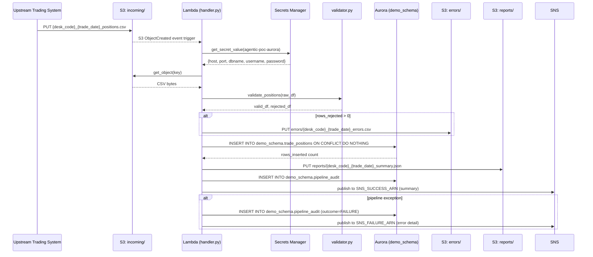
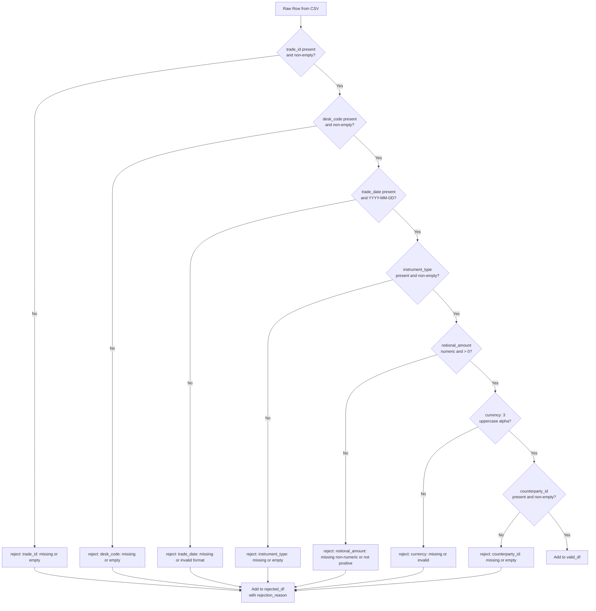
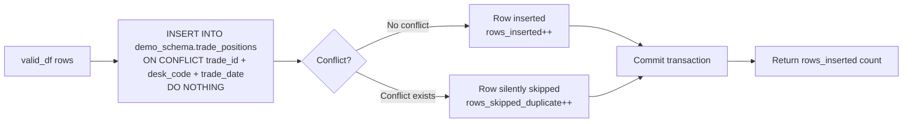
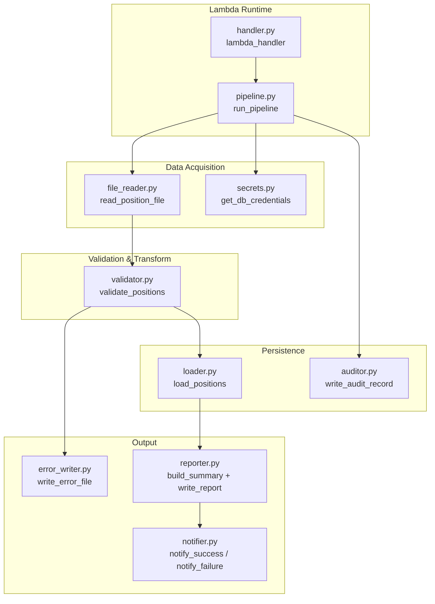

# Technical Design Document

**Daily Trade Position Ingestion**
**Enterprise Risk Data Platform**
**Repository:** nartcr/agentic-poc-sandbox
**Change Type:** New Feature
**Date:** June 2026

---

## COMPONENTS

### `src/config.py`
**What it does:** Centralises all environment-variable reads and provides typed configuration constants used by every other module. Raises `EnvironmentError` at startup if any required variable is absent.

**What it reads:**
- `os.environ["S3_BUCKET"]` → S3 bucket name
- `os.environ["S3_INPUT_PREFIX"]` → e.g. `incoming/`
- `os.environ["S3_ERROR_PREFIX"]` → e.g. `errors/`
- `os.environ["S3_REPORT_PREFIX"]` → e.g. `reports/`
- `os.environ["DB_SECRET_ID"]` → Secrets Manager secret ID for Aurora
- `os.environ["SNS_SUCCESS_ARN"]` → ARN of the success notification topic
- `os.environ["SNS_FAILURE_ARN"]` → ARN of the failure notification topic
- `os.environ["AWS_REGION"]` → AWS region string

**What it writes:** No I/O. Exposes a frozen `Config` dataclass instance imported by other modules.

**Satisfies:** BAC-8 (no hardcoded secrets or config values).

---

### `src/secrets.py`
**What it does:** Retrieves the Aurora database credentials from AWS Secrets Manager at runtime. Parses the JSON secret and returns a `DBCredentials` named tuple containing `host`, `port`, `dbname`, `username`, `password`.

**Function signatures:**
```
get_db_credentials(secret_id: str) -> DBCredentials
```
- Calls `boto3.client("secretsmanager").get_secret_value(SecretId=secret_id)`
- Parses JSON string from `SecretString`
- Returns `DBCredentials(host, port, dbname, username, password)`

**What it reads:** AWS Secrets Manager secret identified by `Config.DB_SECRET_ID`. Expected JSON keys: `host`, `port`, `dbname`, `username`, `password`.

**What it writes:** Nothing.

**Satisfies:** BAC-8.

---

### `src/file_reader.py`
**What it does:** Downloads a CSV file from S3, parses it into a `pandas.DataFrame`, and returns both the DataFrame and raw row count. Enforces that the CSV uses comma as delimiter and UTF-8 encoding. Raises `FileReadError` (custom exception) if the object does not exist or is unparseable.

**Function signatures:**
```
read_position_file(s3_client, bucket: str, s3_key: str) -> tuple[pd.DataFrame, int]
```
- `s3_key` format: `{S3_INPUT_PREFIX}{desk_code}_{trade_date}_positions.csv`
- Downloads via `s3_client.get_object(Bucket=bucket, Key=s3_key)`
- Reads body as UTF-8 CSV into DataFrame; all columns read as `str` initially (type coercion happens in validator)
- Returns `(df, len(df))`

**What it reads:** S3 object at `os.environ["S3_BUCKET"]` / `incoming/{desk_code}_{trade_date}_positions.csv`

**What it writes:** Nothing (in-memory DataFrame only).

**Satisfies:** BAC-1, BAC-6.

---

### `src/validator.py`
**What it does:** Applies field-level validation rules to each row of the raw DataFrame. Returns two DataFrames: `valid_df` (rows that passed all checks) and `rejected_df` (rows that failed, with an added `rejection_reason` column).

**Function signatures:**
```
validate_positions(df: pd.DataFrame) -> tuple[pd.DataFrame, pd.DataFrame]
```

**Validation rules applied in order (first failing rule sets `rejection_reason`):**

| Field | Rule | Rejection reason string |
|---|---|---|
| `trade_id` | Non-null, non-empty string | `"trade_id: missing or empty"` |
| `desk_code` | Non-null, non-empty string | `"desk_code: missing or empty"` |
| `trade_date` | Non-null; parseable as `YYYY-MM-DD` | `"trade_date: missing or invalid format (expected YYYY-MM-DD)"` |
| `instrument_type` | Non-null, non-empty string | `"instrument_type: missing or empty"` |
| `notional_amount` | Non-null; castable to `float`; > 0 | `"notional_amount: missing, non-numeric, or not positive"` |
| `currency` | Non-null; exactly 3 uppercase alpha chars | `"currency: missing or invalid (expected 3-letter ISO code)"` |
| `counterparty_id` | Non-null, non-empty string | `"counterparty_id: missing or empty"` |

- Rows passing all checks: `notional_amount` cast to `float`, `trade_date` cast to `datetime.date`.
- `rejected_df` retains all original columns plus `rejection_reason: str`.

**What it reads:** Raw `pd.DataFrame` from `file_reader.py`.

**What it writes:** Two DataFrames (in-memory).

**Satisfies:** BAC-2, BAC-4.

---

### `src/loader.py`
**What it does:** Inserts validated rows into `demo_schema.trade_positions` using `INSERT ... ON CONFLICT (trade_id, desk_code, trade_date) DO NOTHING`. Returns the count of rows actually inserted (not skipped).

**Function signatures:**
```
load_positions(conn, valid_df: pd.DataFrame) -> int
```
- Opens a single transaction via `conn.cursor()`
- Uses `executemany` with parameterised SQL:
  ```sql
  INSERT INTO demo_schema.trade_positions
      (trade_id, desk_code, trade_date, instrument_type,
       notional_amount, currency, counterparty_id, loaded_at)
  VALUES (%s, %s, %s, %s, %s, %s, %s, %s)
  ON CONFLICT (trade_id, desk_code, trade_date) DO NOTHING
  ```
- `loaded_at` is set to `datetime.now(pytz.timezone("America/Toronto"))` at call time (one timestamp for the whole batch)
- Returns `cursor.rowcount` (total rows inserted; skipped rows excluded via `ON CONFLICT DO NOTHING`)
- Commits on success; rolls back and re-raises on any exception

**What it reads:** `valid_df` with columns `trade_id, desk_code, trade_date, instrument_type, notional_amount, currency, counterparty_id`.

**What it writes:** Rows into `demo_schema.trade_positions`.

**Satisfies:** BAC-1, BAC-3.

---

### `src/error_writer.py`
**What it does:** Serialises the `rejected_df` DataFrame to CSV and uploads it to S3 under the `errors/` prefix. If there are zero rejected rows, no file is written.

**Function signatures:**
```
write_error_file(s3_client, bucket: str, desk_code: str,
                 trade_date: str, rejected_df: pd.DataFrame) -> str | None
```
- S3 key: `errors/{desk_code}_{trade_date}_errors.csv`
- CSV columns: all original input columns + `rejection_reason`
- Returns the S3 key string if written, `None` if `rejected_df` is empty
- Upload via `s3_client.put_object(Bucket=bucket, Key=key, Body=csv_bytes)`

**What it reads:** `rejected_df` from `validator.py`.

**What it writes:** S3 object at `errors/{desk_code}_{trade_date}_errors.csv` (UTF-8 CSV).

**Satisfies:** BAC-2.

---

### `src/reporter.py`
**What it does:** Computes the post-load summary statistics from the raw DataFrame, valid DataFrame, rejected DataFrame, and load count. Serialises the summary to JSON and uploads to S3 under `reports/`. Returns the summary dict.

**Function signatures:**
```
build_summary(
    raw_df: pd.DataFrame,
    valid_df: pd.DataFrame,
    rejected_df: pd.DataFrame,
    rows_inserted: int,
    desk_code: str,
    trade_date: str,
    processing_ts: datetime  # timezone-aware ET
) -> dict

write_report(s3_client, bucket: str, desk_code: str,
             trade_date: str, summary: dict) -> str
```

**Summary dict schema:**
```json
{
  "desk_code": "string",
  "trade_date": "YYYY-MM-DD",
  "processing_timestamp_et": "ISO-8601 datetime with ET offset",
  "total_rows_received": 0,
  "rows_loaded": 0,
  "rows_rejected": 0,
  "rows_skipped_duplicate": 0,
  "record_counts_by_desk_code": {"DESK_A": 0},
  "notional_amount_min": 0.0,
  "notional_amount_max": 0.0,
  "null_rates": {
    "trade_id": 0.0,
    "desk_code": 0.0,
    "trade_date": 0.0,
    "instrument_type": 0.0,
    "notional_amount": 0.0,
    "currency": 0.0,
    "counterparty_id": 0.0
  }
}
```
- `rows_skipped_duplicate` = `len(valid_df) - rows_inserted`
- `notional_amount_min/max` computed from `valid_df` only (non-rejected rows)
- `null_rates` computed from **raw_df** (pre-validation) as `null_count / total_rows` per column, expressed as float 0.0–1.0
- S3 key: `reports/{desk_code}_{trade_date}_summary.json`

**What it reads:** DataFrames from validator, count from loader, config values.

**What it writes:** S3 object at `reports/{desk_code}_{trade_date}_summary.json` (UTF-8 JSON).

**Satisfies:** BAC-4, BAC-7.

---

### `src/notifier.py`
**What it does:** Publishes SNS messages on success and failure. Formats the JSON message payload and calls `sns_client.publish()`.

**Function signatures:**
```
notify_success(sns_client, topic_arn: str, summary: dict) -> None
notify_failure(sns_client, topic_arn: str, desk_code: str,
               trade_date: str, s3_key: str, error_detail: str) -> None
```

**Success message payload:** the full `summary` dict from `reporter.py` with an added top-level `"event": "POSITION_LOAD_SUCCESS"` key.

**Failure message payload:**
```json
{
  "event": "POSITION_LOAD_FAILURE",
  "desk_code": "string",
  "trade_date": "YYYY-MM-DD",
  "s3_key": "string",
  "error_detail": "string",
  "failure_timestamp_et": "ISO-8601 datetime with ET offset"
}
```

**What it reads:** Summary dict or error context.

**What it writes:** SNS message to `os.environ["SNS_SUCCESS_ARN"]` or `os.environ["SNS_FAILURE_ARN"]`.

**Satisfies:** BAC-5.

---

### `src/auditor.py`
**What it does:** Writes one row to `demo_schema.pipeline_audit` at the conclusion of each file's processing run (success or failure). Provides complete audit trail for regulatory examination.

**Function signatures:**
```
write_audit_record(conn, audit_record: AuditRecord) -> None
```
where `AuditRecord` is a dataclass:
```
AuditRecord(
    s3_key: str,
    desk_code: str,
    trade_date: str,
    processing_timestamp_et: datetime,
    outcome: str,            # "SUCCESS" | "FAILURE"
    total_rows_received: int,
    rows_loaded: int,
    rows_rejected: int,
    rows_skipped_duplicate: int,
    error_detail: str | None,
    service_identity: str    # os.environ["AWS_LAMBDA_FUNCTION_NAME"] or "local"
)
```
- Inserts via parameterised SQL into `demo_schema.pipeline_audit`
- Commits independently of the main loader transaction

**What it reads:** Summary statistics and outcome from the pipeline.

**What it writes:** One row into `demo_schema.pipeline_audit`.

**Satisfies:** BAC-7 (regulatory audit trail with ET timestamps).

---

### `src/pipeline.py`
**What it does:** Orchestrates the full processing sequence for a single S3 file. Called by the Lambda handler. Catches exceptions at the top level, routes to `notify_failure` on unhandled error, always writes the audit record regardless of outcome.

**Function signatures:**
```
run_pipeline(s3_key: str, cfg: Config) -> dict
```
- Parses `desk_code` and `trade_date` from `s3_key` filename using regex: `^incoming/([A-Z0-9]+)_(\d{4}-\d{2}-\d{2})_positions\.csv$`
- Instantiates boto3 clients: `s3_client`, `sns_client`
- Calls `secrets.get_db_credentials(cfg.DB_SECRET_ID)` and opens `psycopg2` connection
- Calls in sequence: `file_reader.read_position_file` → `validator.validate_positions` → `loader.load_positions` → `error_writer.write_error_file` → `reporter.build_summary` → `reporter.write_report` → `notifier.notify_success`
- On any exception: calls `notifier.notify_failure`, then re-raises after audit write
- Always calls `auditor.write_audit_record` in a `finally` block
- Returns the `summary` dict

**What it reads:** S3 key string; `Config` object.

**What it writes:** Orchestrates all writes via sub-modules.

**Satisfies:** BAC-1, BAC-3, BAC-4, BAC-5, BAC-6, BAC-7, BAC-8.

---

### `src/handler.py`
**What it does:** AWS Lambda entry point. Receives an S3 event notification (object created), extracts the S3 key from the event payload, and calls `pipeline.run_pipeline`. Handles the case where the event contains multiple records (iterates over all). Returns a response dict with HTTP 200 on success or 500 on failure.

**Function signatures:**
```
lambda_handler(event: dict, context) -> dict
```
- Extracts `s3_key = event["Records"][0]["s3"]["object"]["key"]`
- Iterates over `event["Records"]` if multiple objects in one event
- Catches all exceptions; logs via `logging` module at `ERROR` level; returns `{"statusCode": 500, "body": str(e)}` on failure
- Returns `{"statusCode": 200, "body": "OK"}` on success

**What it reads:** Lambda S3 event payload.

**What it writes:** Nothing directly; delegates to `pipeline.run_pipeline`.

**Satisfies:** BAC-1, BAC-5, BAC-6.

---

### `tests/test_validator.py`
Unit tests for `validator.validate_positions`. Covers: all mandatory field missing cases, `trade_date` wrong format, `notional_amount` non-numeric, `notional_amount` ≤ 0, `currency` wrong length, valid row passes all checks.

### `tests/test_loader.py`
Unit tests for `loader.load_positions`. Uses a test DB connection or mock cursor. Verifies: row count returned equals inserts; second insert of identical keys returns 0 (ON CONFLICT DO NOTHING).

### `tests/test_reporter.py`
Unit tests for `reporter.build_summary`. Verifies all keys present, `rows_skipped_duplicate` computed correctly, `null_rates` between 0 and 1, `processing_timestamp_et` timezone is America/Toronto.

### `tests/test_pipeline.py`
Integration-style tests using mocked boto3 and a real (test schema) or mocked DB. Verifies end-to-end flow: success path, failure path triggers `notify_failure`, audit record written in both cases.

---

## AWS SERVICES

| Service | Role |
|---|---|
| **Amazon S3** | Stores incoming position CSV files (`incoming/`), error files (`errors/`), and summary reports (`reports/`) |
| **AWS Lambda** | Compute runtime for the ingestion pipeline; triggered by S3 `ObjectCreated` events on the `incoming/` prefix |
| **Amazon Aurora (PostgreSQL)** | Reporting database; stores `demo_schema.trade_positions` and `demo_schema.pipeline_audit` |
| **AWS Secrets Manager** | Stores Aurora connection credentials; retrieved at Lambda cold-start via `get_secret_value` |
| **Amazon SNS** | Publishes success and failure notifications to downstream subscribers (risk calculation pipeline) |
| **Amazon CloudWatch Logs** | Receives all `logging` output from Lambda for operational monitoring and debugging |

---

## DATA CONTRACTS

### Database Tables

#### `demo_schema.trade_positions`

```
Table: demo_schema.trade_positions

Column               Type                        Nullable  Notes
-------------------  --------------------------  --------  --------------------------------
trade_id             VARCHAR(100)                NOT NULL
desk_code            VARCHAR(50)                 NOT NULL
trade_date           DATE                        NOT NULL
instrument_type      VARCHAR(100)                NOT NULL
notional_amount      NUMERIC(24, 6)              NOT NULL
currency             CHAR(3)                     NOT NULL
counterparty_id      VARCHAR(100)                NOT NULL
loaded_at            TIMESTAMP WITH TIME ZONE    NOT NULL  Set to current ET time at load

PRIMARY KEY: (trade_id, desk_code, trade_date)
UNIQUE CONSTRAINT: uc_trade_positions_dedup ON (trade_id, desk_code, trade_date)
INDEX: idx_trade_positions_trade_date ON (trade_date)
INDEX: idx_trade_positions_desk_code ON (desk_code)
```

#### `demo_schema.pipeline_audit`

```
Table: demo_schema.pipeline_audit

Column                   Type                        Nullable  Notes
-----------------------  --------------------------  --------  --------------------------------
audit_id                 BIGSERIAL                   NOT NULL  Auto-increment surrogate key
s3_key                   VARCHAR(500)                NOT NULL  Full S3 object key of source file
desk_code                VARCHAR(50)                 NOT NULL
trade_date               DATE                        NOT NULL
processing_timestamp_et  TIMESTAMP WITH TIME ZONE    NOT NULL  Timezone-aware ET timestamp
outcome                  VARCHAR(20)                 NOT NULL  'SUCCESS' or 'FAILURE'
total_rows_received      INTEGER                     NOT NULL
rows_loaded              INTEGER                     NOT NULL
rows_rejected            INTEGER                     NOT NULL
rows_skipped_duplicate   INTEGER                     NOT NULL
error_detail             TEXT                        NULL      NULL on success
service_identity         VARCHAR(200)                NOT NULL  Lambda function name or 'local'

PRIMARY KEY: audit_id
INDEX: idx_pipeline_audit_trade_date ON (trade_date)
INDEX: idx_pipeline_audit_s3_key ON (s3_key)
```

---

### S3 Paths

| Purpose | Key Pattern | Format | Content |
|---|---|---|---|
| Input file | `incoming/{desk_code}_{trade_date}_positions.csv` | UTF-8 CSV, comma-delimited, header row | Columns: `trade_id, desk_code, trade_date, instrument_type, notional_amount, currency, counterparty_id` |
| Error file | `errors/{desk_code}_{trade_date}_errors.csv` | UTF-8 CSV, comma-delimited, header row | All input columns + `rejection_reason` |
| Summary report | `reports/{desk_code}_{trade_date}_summary.json` | UTF-8 JSON | Summary dict schema defined in `reporter.py` section |

**S3 Bucket:** `os.environ["S3_BUCKET"]` (value: `agentic-poc-data-533266968934`)

**Filename regex for key parsing:**
```
^incoming/([A-Z0-9]+)_(\d{4}-\d{2}-\d{2})_positions\.csv$
Group 1 → desk_code
Group 2 → trade_date
```

---

### Secrets Manager

**Secret ID:** `os.environ["DB_SECRET_ID"]` (value: `agentic-poc-aurora`)

**Expected JSON keys inside the secret:**
```json
{
  "host":     "string — Aurora cluster endpoint",
  "port":     "integer — typically 5432",
  "dbname":   "string — value: app",
  "username": "string — database user",
  "password": "string — database password"
}
```

---

### SNS Topics

| Env Var | Purpose | When Published |
|---|---|---|
| `os.environ["SNS_SUCCESS_ARN"]` | Success notification | After successful file load and report write |
| `os.environ["SNS_FAILURE_ARN"]` | Failure notification | On any unhandled exception during pipeline |

**Success message (JSON string in `Message` field):**
```json
{
  "event": "POSITION_LOAD_SUCCESS",
  "desk_code": "string",
  "trade_date": "YYYY-MM-DD",
  "processing_timestamp_et": "ISO-8601 string",
  "total_rows_received": 0,
  "rows_loaded": 0,
  "rows_rejected": 0,
  "rows_skipped_duplicate": 0,
  "record_counts_by_desk_code": {},
  "notional_amount_min": 0.0,
  "notional_amount_max": 0.0,
  "null_rates": {}
}
```

**Failure message (JSON string in `Message` field):**
```json
{
  "event": "POSITION_LOAD_FAILURE",
  "desk_code": "string",
  "trade_date": "YYYY-MM-DD",
  "s3_key": "string",
  "error_detail": "string",
  "failure_timestamp_et": "ISO-8601 string with ET offset"
}
```

---

### Environment Variables Summary

```
S3_BUCKET              S3 bucket name
S3_INPUT_PREFIX        incoming/
S3_ERROR_PREFIX        errors/
S3_REPORT_PREFIX       reports/
DB_SECRET_ID           agentic-poc-aurora
SNS_SUCCESS_ARN        ARN of success SNS topic
SNS_FAILURE_ARN        ARN of failure SNS topic
AWS_REGION             AWS region
```

---

## DATA FLOW

### End-to-End Pipeline Flow



---

### Validation Decision Logic



---

### Idempotent Load Logic



---

### Component Interaction Swimlane



---

### Deduplication Algorithm

```
ALGORITHM: idempotent_load

INPUT:  valid_df  — DataFrame with columns [trade_id, desk_code, trade_date, ...]
OUTPUT: rows_inserted — integer count of net new rows written

BEGIN
  loaded_at ← now(timezone="America/Toronto")
  rows_inserted ← 0
  BEGIN TRANSACTION
    FOR EACH row IN valid_df:
      EXECUTE:
        INSERT INTO demo_schema.trade_positions
          (trade_id, desk_code, trade_date, instrument_type,
           notional_amount, currency, counterparty_id, loaded_at)
        VALUES (row.trade_id, row.desk_code, row.trade_date,
                row.instrument_type, row.notional_amount,
                row.currency, row.counterparty_id, loaded_at)
        ON CONFLICT (trade_id, desk_code, trade_date) DO NOTHING
      IF cursor.rowcount == 1: rows_inserted += 1
  COMMIT
  RETURN rows_inserted
END
```

---

## TECHNICAL ACCEPTANCE CRITERIA

### TAC-1 — Valid positions available before morning risk run
**BAC-1 translated:** `loader.load_positions` must insert all rows in `valid_df` where no conflict exists into `demo_schema.trade_positions` within the processing window. Acceptance test: after `run_pipeline` completes successfully, a `SELECT COUNT(*) FROM demo_schema.trade_positions WHERE desk_code = :desk_code AND trade_date = :trade_date` must return a count ≥ 1 for a test file containing at least one valid row. The full pipeline (file_reader → validator → loader → reporter) for a 10,000-row file must complete in < 60 seconds measured wall-clock time.

---

### TAC-2 — Invalid records flagged with rejection reasons
**BAC-2 translated:** `validator.validate_positions` must set `rejection_reason` on every rejected row. The `rejection_reason` string must be non-empty and match one of the seven defined rejection strings (see validator section). `error_writer.write_error_file` must upload a CSV to `errors/{desk_code}_{trade_date}_errors.csv` containing every rejected row plus the `rejection_reason` column. Acceptance test: inject a file with one row missing `trade_id`; assert S3 error file exists and the `rejection_reason` column value equals `"trade_id: missing or empty"`.

---

### TAC-3 — No duplicate positions on resubmission
**BAC-3 translated:** The `INSERT ... ON CONFLICT (trade_id, desk_code, trade_date) DO NOTHING` clause in `loader.load_positions` must prevent any duplicate row. Acceptance test: run `run_pipeline` twice with the identical input file; after the second run, `SELECT COUNT(*) FROM demo_schema.trade_positions WHERE desk_code = :desk_code AND trade_date = :trade_date` must return the same count as after the first run. The second pipeline call must return `rows_inserted = 0` and `rows_skipped_duplicate = N` (where N is the original inserted count). The `UNIQUE CONSTRAINT uc_trade_positions_dedup` on `(trade_id, desk_code, trade_date)` must be present in the DDL to enforce this at the DB level.

---

### TAC-4 — Summary report accurately reflects processing outcome
**BAC-4 translated:** `reporter.build_summary` must produce a dict where:
- `total_rows_received == len(raw_df)` (total CSV rows, excluding header)
- `rows_loaded + rows_rejected + rows_skipped_duplicate == total_rows_received`
- `rows_loaded == rows_inserted` (value returned by `loader.load_positions`)
- `rows_rejected == len(rejected_df)`
- `rows_skipped_duplicate == len(valid_df) - rows_inserted`
- All seven mandatory fields appear in `null_rates` with float values in [0.0, 1.0]
- `notional_amount_min` and `notional_amount_max` computed only from `valid_df["notional_amount"]`

Acceptance test: process a file with 5 valid rows, 2 rejected rows, and 1 duplicate (already in DB); assert `total_rows_received=8`, `rows_loaded=5`, `rows_rejected=2`, `rows_skipped_duplicate=1`.

---

### TAC-5 — Downstream pipeline notified automatically
**BAC-5 translated:** `notifier.notify_success` must call `sns_client.publish(TopicArn=cfg.SNS_SUCCESS_ARN, Message=json.dumps(payload))` once per successful file. The `payload["event"]` field must equal `"POSITION_LOAD_SUCCESS"`. `notifier.notify_failure` must publish to `cfg.SNS_FAILURE_ARN` with `payload["event"] == "POSITION_LOAD_FAILURE"` on any unhandled exception. Acceptance test: mock `sns_client.publish`; assert it is called exactly once after a successful `run_pipeline`; assert the `TopicArn` matches `SNS_SUCCESS_ARN`.

---

### TAC-6 — Processing completes within operations window
**BAC-6 translated:** A performance test must process a CSV file of exactly 10,000 rows through the full `run_pipeline` call and assert total elapsed time < 60 seconds. A stress test must process a 100,000-row file without raising an exception (no timeout/memory limit assertions required beyond no-failure). `executemany` is used in `loader.py` (not row-by-row execute) to meet throughput requirement.

---

### TAC-7 — All timestamps in Eastern Time for regulatory audit
**BAC-7 translated:**
- `loaded_at` in `demo_schema.trade_positions` must be a timezone-aware timestamp. When inserted, `loaded_at` must satisfy `loaded_at.tzinfo == pytz.timezone("America/Toronto")` before being written.
- `processing_timestamp_et` in `demo_schema.pipeline_audit` must be timezone-aware ET.
- `processing_timestamp_et` in the summary JSON report must be an ISO-8601 string with a non-UTC ET offset (e.g. `-04:00` or `-05:00` depending on DST).
- Acceptance test: assert `datetime.fromisoformat(summary["processing_timestamp_et"]).tzinfo` resolves to an ET offset, not UTC.

---

### TAC-8 — No secrets in code or configuration files
**BAC-8 translated:**
- A static scan of all committed `.py` files must find zero occurrences of the strings `password`, `secret`, `token`, or `credential` as literal values (string assignments). Only `os.environ` reads and `get_secret_value` calls are permitted.
- `secrets.py` must only retrieve credentials at runtime via `boto3.client("secretsmanager").get_secret_value(SecretId=os.environ["DB_SECRET_ID"])`.
- `config.py` must read all configuration from `os.environ` with no default values that contain secrets.
- Acceptance test: call `get_db_credentials` with a mock Secrets Manager client; assert the returned `DBCredentials.password` equals the mock secret value (not any hardcoded string).

---

## OPEN QUESTIONS

**OQ-1 — Error file overwrite behaviour on resubmission**
When a corrected file is resubmitted for the same `desk_code` and `trade_date`, the error file at `errors/{desk_code}_{trade_date}_errors.csv` will be overwritten by the new run's rejected rows. If the previous error file must be retained for audit purposes, a versioning strategy (e.g. timestamped suffix) is needed. This is a business logic decision: should error files be overwritten or versioned?

**OQ-2 — Partial file failure handling**
If `loader.load_positions` raises a database exception mid-batch (e.g. at row 5,000 of 10,000), the current design rolls back the entire batch and triggers `notify_failure`. Business must confirm: is an all-or-nothing load acceptable, or must the system commit the successfully inserted rows before the failure point and report a partial success?

**OQ-3 — desk_code casing in filenames**
The filename regex `^incoming/([A-Z0-9]+)_` assumes `desk_code` is uppercase alphanumeric. If upstream systems may produce lowercase or mixed-case desk codes in filenames, the regex and associated validation rules must be adjusted. Business must confirm the exact character set and casing for `desk_code`.

---

## ASSUMPTIONS

| # | Assumption | Impact if Wrong |
|---|---|---|
| A-1 | The Lambda function `agentic-poc-sandbox-qa` already exists and will be configured with an S3 trigger on the `incoming/` prefix of `agentic-poc-data-533266968934`. No new Lambda resource needs to be created. | Pipeline cannot be triggered automatically; handler.py would need a different entry point. |
| A-2 | Two SNS topics already exist and their ARNs are provided via `SNS_SUCCESS_ARN` and `SNS_FAILURE_ARN` environment variables on the Lambda function. | `notifier.py` calls would fail at runtime; SNS topics would need to be provisioned. |
| A-3 | The Aurora cluster is reachable from within the Lambda execution environment (same VPC or via public endpoint with appropriate security group). | DB connection would fail; VPC/SG configuration would need adjustment by infrastructure team. |
| A-4 | The tables `demo_schema.trade_positions` and `demo_schema.pipeline_audit` do not yet exist and will be created via a DDL migration script included in this deliverable. | If tables already exist with a different schema, the DDL would need to be an ALTER not a CREATE. |
| A-5 | The `psycopg2-binary` package (or `psycopg2`) and `pandas` are available in the Lambda runtime (via a Lambda Layer or deployment package). | Import errors at cold-start; layer must be created. |
| A-6 | Input CSV files always contain a header row as the first line with exactly the column names: `trade_id, desk_code, trade_date, instrument_type, notional_amount, currency, counterparty_id`. | `file_reader.py` would mis-parse files with no header or different column names. |
| A-7 | The `desk_code` embedded in the filename matches the `desk_code` values in the file rows. No cross-validation between filename and row content is performed beyond the filename parse. | Silent data quality issue if a file is mis-named by the upstream system. |
| A-8 | Files are deposited as complete objects (not multi-part / streaming writes that could trigger the S3 event before the file is fully written). S3 multipart uploads complete atomically, so this is safe, but the upstream system is assumed to use standard S3 PUT or multipart upload. | Partial file reads; `file_reader.py` would return an incomplete DataFrame. |
| A-9 | The `null_rates` in the summary are computed from the raw DataFrame (before validation), using `pd.isna()` on original string values. Empty strings `""` are treated as non-null by `pd.isna()` but caught by the validator; the null rate reflects only truly null/NaN cells. | Null rates may appear lower than the operations team expects if they interpret empty strings as null. |
| A-10 | `pytz` is available in the Lambda runtime. All ET timestamps use `pytz.timezone("America/Toronto")`. | Timestamp localisation fails; DST transitions would not be handled correctly. |
| A-11 | The database schema `demo_schema` already exists in the `app` database. Only the two tables need to be created. | DDL migration would fail if `demo_schema` does not exist and the DB user lacks `CREATE SCHEMA` privilege. |
| A-12 | `rows_skipped_duplicate` accounts only for rows in `valid_df` that hit the `ON CONFLICT` clause — not rejected rows. Rejected rows are a separate category from duplicates. | Mismatch in how the operations team interprets the summary report. |