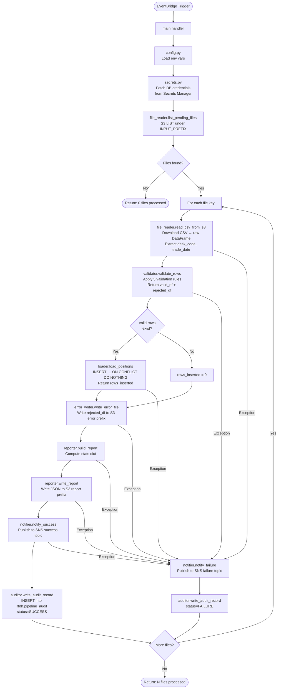
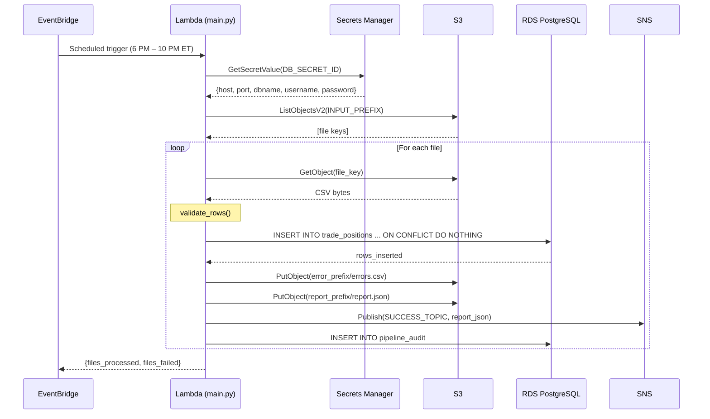
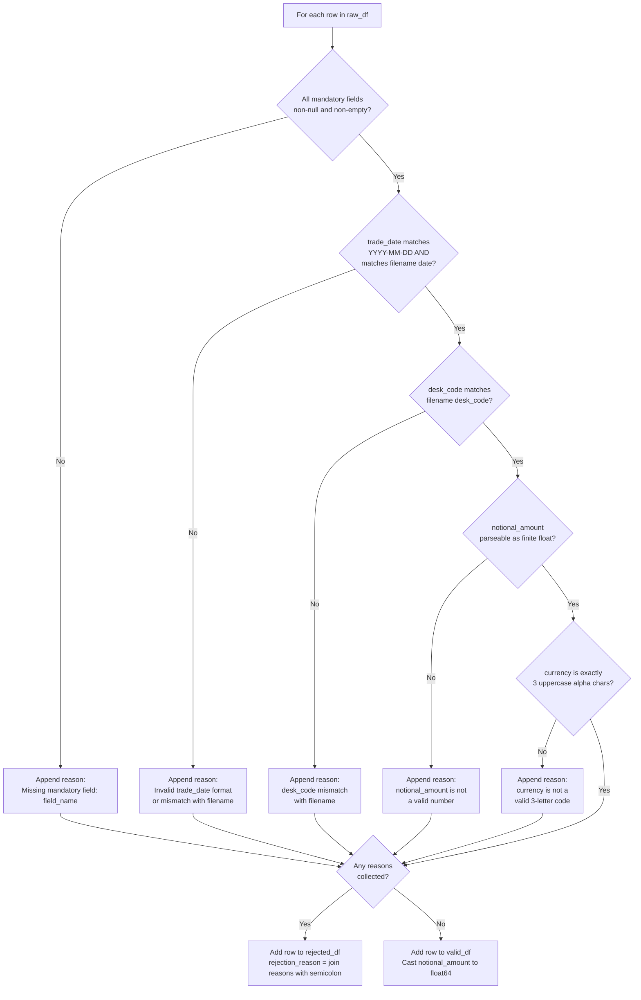

# Technical Design Document
## Daily Trade Position Ingestion
### RFDH — Risk Finance Data Hub | June 2026

---

## COMPONENTS

### `config.py`
**Purpose:** Centralized configuration loader. Reads all environment variables at startup and exposes a typed config object used by all other modules. Does not read secrets — that is the responsibility of `secrets.py`.

**Reads:**
- `os.environ["S3_BUCKET"]` — S3 bucket name for input files and reports
- `os.environ["S3_INPUT_PREFIX"]` — S3 key prefix for incoming position files (e.g. `positions/incoming/`)
- `os.environ["S3_REPORT_PREFIX"]` — S3 key prefix for summary reports (e.g. `positions/reports/`)
- `os.environ["S3_ERROR_PREFIX"]` — S3 key prefix for error files (e.g. `positions/errors/`)
- `os.environ["DB_SECRET_ID"]` — Secrets Manager secret ID for database credentials
- `os.environ["SNS_SUCCESS_TOPIC_ARN"]` — SNS topic ARN for success notifications
- `os.environ["SNS_FAILURE_TOPIC_ARN"]` — SNS topic ARN for failure notifications
- `os.environ["AUDIT_TABLE"]` — fully qualified audit table name (e.g. `rfdh.pipeline_audit`)
- `os.environ["POSITIONS_TABLE"]` — fully qualified positions table name (e.g. `rfdh.trade_positions`)

**Writes:** A `Config` dataclass instance with all the above as typed fields.

**Satisfies:** BAC-8 (no hardcoded credentials or resource names).

---

### `secrets.py`
**Purpose:** Retrieves database credentials from AWS Secrets Manager at runtime. Caches the result in-process for the lifetime of the run (no re-fetching within a single file processing job).

**Function signature:**
```
get_db_credentials(secret_id: str) -> dict
```
Calls `boto3.client("secretsmanager").get_secret_value(SecretId=secret_id)`, parses the returned JSON string, and returns a dict with keys: `host`, `port`, `dbname`, `username`, `password`.

**Reads:** Secrets Manager secret at `secret_id`.

**Writes:** Nothing persisted. Returns a dict.

**Satisfies:** BAC-8 (credentials from secure store, never hardcoded).

---

### `file_reader.py`
**Purpose:** Discovers and reads incoming trade position CSV files from S3. Lists objects under `S3_INPUT_PREFIX` matching the naming pattern `{desk_code}_{trade_date}_positions.csv`. Returns a list of S3 keys to process. For a given S3 key, downloads the CSV content and returns a raw `pandas.DataFrame` with all columns as strings (no type inference at read time).

**Function signatures:**
```
list_pending_files(s3_client, bucket: str, prefix: str) -> list[str]
read_csv_from_s3(s3_client, bucket: str, key: str) -> tuple[pandas.DataFrame, str, str]
```

`list_pending_files`: Uses `s3_client.list_objects_v2` to enumerate objects under `prefix`. Filters keys where the filename (last path component) matches regex `^([A-Z0-9]+)_(\d{4}-\d{2}-\d{2})_positions\.csv$`. Returns list of matching S3 keys.

`read_csv_from_s3`: Downloads the object at `key`, reads it as CSV with `dtype=str`, strips leading/trailing whitespace from all string values. Returns `(DataFrame, desk_code, trade_date)` where `desk_code` and `trade_date` are extracted from the filename via the same regex.

**Reads:** S3 objects at `s3://{bucket}/{prefix}*.csv`

**Writes:** Nothing persisted. Returns DataFrames in-memory.

**Satisfies:** BAC-1, BAC-2 (input to the pipeline).

---

### `validator.py`
**Purpose:** Validates each row in the raw DataFrame against mandatory field rules and type/format rules. Returns two DataFrames: one containing valid rows, one containing rejected rows with rejection reasons.

**Function signature:**
```
validate_rows(df: pandas.DataFrame, desk_code: str, trade_date: str) -> tuple[pandas.DataFrame, pandas.DataFrame]
```

**Validation rules applied in order:**

1. **Mandatory field presence:** Fields `trade_id`, `desk_code`, `instrument_type`, `notional_amount`, `currency`, `counterparty_id`, `trade_date` must be non-null and non-empty string. Rejection reason: `"Missing mandatory field: {field_name}"`.

2. **`trade_date` format:** Must match `YYYY-MM-DD` and must equal the `trade_date` extracted from the filename. Rejection reason: `"Invalid trade_date format or mismatch with filename: {value}"`.

3. **`desk_code` consistency:** Must equal the `desk_code` extracted from the filename. Rejection reason: `"desk_code mismatch with filename: {value}"`.

4. **`notional_amount` numeric:** Must be parseable as a float and must be a finite number (not NaN, not infinite). Rejection reason: `"notional_amount is not a valid number: {value}"`.

5. **`currency` format:** Must be exactly 3 uppercase alphabetic characters (ISO 4217 pattern). Rejection reason: `"currency is not a valid 3-letter code: {value}"`.

For rows with multiple violations, all failing reasons are concatenated with `"; "`.

The `valid_df` returned has `notional_amount` cast to `float64`. All other mandatory fields remain strings. A row-level `source_row_number` column (1-based, matching original file row order) is added to both output DataFrames for traceability.

**Reads:** Raw DataFrame from `file_reader.py`.

**Writes:** `(valid_df, rejected_df)` — both DataFrames in-memory. `rejected_df` contains all original columns plus `rejection_reason: str` and `source_row_number: int`.

**Satisfies:** BAC-1, BAC-2, BAC-4 (provides counts for report).

---

### `loader.py`
**Purpose:** Loads validated rows into the `rfdh.trade_positions` table using idempotent upsert logic. Connects to the PostgreSQL reporting database using credentials from `secrets.py`. Executes batch `INSERT ... ON CONFLICT (trade_id, desk_code, trade_date) DO NOTHING`. Returns the count of rows actually inserted (not skipped).

**Function signature:**
```
load_positions(valid_df: pandas.DataFrame, db_credentials: dict) -> int
```

**Behavior:**
- Opens a single `psycopg2` connection using `db_credentials` fields: `host`, `port`, `dbname`, `username`, `password`.
- Converts `valid_df` to a list of tuples matching the column order of `rfdh.trade_positions`.
- Uses `psycopg2.extras.execute_values` to batch-insert in chunks of 1,000 rows.
- SQL: `INSERT INTO rfdh.trade_positions (trade_id, desk_code, trade_date, instrument_type, notional_amount, currency, counterparty_id, loaded_at) VALUES %s ON CONFLICT (trade_id, desk_code, trade_date) DO NOTHING`
- `loaded_at` is set to `datetime.now(pytz.timezone("America/Toronto"))` at the start of the load call (one value for all rows in the batch).
- After insert, executes `SELECT COUNT(*) FROM rfdh.trade_positions WHERE desk_code = %s AND trade_date = %s` with the file's desk_code and trade_date to return the final count in DB (used for audit). Also uses `cursor.rowcount` accumulation per batch to compute rows_inserted.
- Commits on success. Rolls back and re-raises on any exception.
- Returns `rows_inserted: int` (count of rows where `ON CONFLICT DO NOTHING` did not suppress them).

**Reads:** `valid_df` DataFrame; `db_credentials` dict.

**Writes:** Rows into `rfdh.trade_positions`.

**Satisfies:** BAC-1, BAC-3 (idempotent deduplication), BAC-7 (ET timestamp on `loaded_at`).

---

### `error_writer.py`
**Purpose:** Writes the rejected rows DataFrame as a CSV error file to S3. The error file includes all original columns plus `rejection_reason` and `source_row_number`. Filename pattern: `{desk_code}_{trade_date}_positions_errors.csv`.

**Function signature:**
```
write_error_file(s3_client, rejected_df: pandas.DataFrame, bucket: str, error_prefix: str, desk_code: str, trade_date: str) -> str
```

**Behavior:**
- If `rejected_df` is empty, writes a CSV with only the header row (columns present, zero data rows). Still writes the file so downstream systems have a consistent artifact.
- Serializes `rejected_df` to CSV in-memory using `io.StringIO`.
- Uploads to S3 key: `{error_prefix}{desk_code}_{trade_date}_positions_errors.csv`.
- Returns the full S3 key of the written file.

**Reads:** `rejected_df` from `validator.py`.

**Writes:** S3 object at `{S3_ERROR_PREFIX}{desk_code}_{trade_date}_positions_errors.csv`.

**Satisfies:** BAC-2 (error file with rejection reasons per row).

---

### `reporter.py`
**Purpose:** Computes the summary report dict and writes it as a JSON file to S3. Calculates: total rows received, rows loaded, rows rejected, processing timestamp in ET, per-desk-code row counts, min/max notional amount (from valid rows), and per-column null rates across the full raw DataFrame.

**Function signature:**
```
build_report(raw_df: pandas.DataFrame, valid_df: pandas.DataFrame, rejected_df: pandas.DataFrame, rows_inserted: int, desk_code: str, trade_date: str, processing_ts: datetime) -> dict
write_report(s3_client, report: dict, bucket: str, report_prefix: str, desk_code: str, trade_date: str) -> str
```

**`build_report` logic:**
- `total_rows`: `len(raw_df)`
- `rows_loaded`: `rows_inserted` (from `loader.py`)
- `rows_rejected`: `len(rejected_df)`
- `processing_timestamp`: `processing_ts.strftime("%Y-%m-%dT%H:%M:%S%z")` where `processing_ts` is `datetime.now(pytz.timezone("America/Toronto"))`
- `desk_code_counts`: `valid_df.groupby("desk_code").size().to_dict()`
- `notional_min`: `float(valid_df["notional_amount"].min())` if `valid_df` is non-empty, else `null`
- `notional_max`: `float(valid_df["notional_amount"].max())` if `valid_df` is non-empty, else `null`
- `null_rates`: For each column in `raw_df`, compute `(count of nulls + count of empty strings) / len(raw_df)`, expressed as a float between 0.0 and 1.0. Result: `{"trade_id": 0.02, "desk_code": 0.00, ...}`.

**`write_report`:**
- Serializes `report` dict to JSON.
- Uploads to S3 key: `{report_prefix}{desk_code}_{trade_date}_positions_report.json`.
- Returns the full S3 key.

**Reads:** DataFrames from `validator.py` and `file_reader.py`; `rows_inserted` from `loader.py`.

**Writes:** S3 JSON object at `{S3_REPORT_PREFIX}{desk_code}_{trade_date}_positions_report.json`.

**Satisfies:** BAC-4 (correct counts, min/max notional, null rates), BAC-7 (ET timestamp).

---

### `notifier.py`
**Purpose:** Publishes SNS notifications on success or failure. Uses `boto3.client("sns")`.

**Function signatures:**
```
notify_success(sns_client, topic_arn: str, report: dict) -> None
notify_failure(sns_client, topic_arn: str, desk_code: str, trade_date: str, error_details: str, processing_ts: datetime) -> None
```

**`notify_success`:** Publishes to `SNS_SUCCESS_TOPIC_ARN`. Message body is the `report` dict serialized to JSON (see SNS message schema in DATA CONTRACTS).

**`notify_failure`:** Publishes to `SNS_FAILURE_TOPIC_ARN`. Message body is a JSON object with `status`, `desk_code`, `trade_date`, `error_details`, `processing_timestamp` (ET ISO-8601 string).

**Reads:** `report` dict or error details string.

**Writes:** SNS message to the appropriate topic.

**Satisfies:** BAC-5 (downstream notification with correct stats), BAC-7 (ET timestamp in notification).

---

### `auditor.py`
**Purpose:** Writes one audit record to `rfdh.pipeline_audit` per file processed, capturing the complete processing outcome. Executed after every file regardless of success or failure.

**Function signature:**
```
write_audit_record(db_credentials: dict, audit_row: dict) -> None
```

`audit_row` keys: `file_key`, `desk_code`, `trade_date`, `status`, `total_rows`, `rows_loaded`, `rows_rejected`, `error_summary`, `processed_at`, `service_identity`.

`service_identity` is read from `os.environ["SERVICE_IDENTITY"]` (e.g. a task identifier set at deployment time, never from credentials).

`processed_at` is `datetime.now(pytz.timezone("America/Toronto"))`.

Uses `psycopg2` INSERT. No ON CONFLICT clause — every run produces its own audit row, supporting full history for re-processing.

**Reads:** `db_credentials` dict; `audit_row` dict.

**Writes:** One row into `rfdh.pipeline_audit`.

**Satisfies:** BAC-7 (ET timestamp), BAC-8 (credentials from secrets), and the non-functional audit trail requirement (NFR 3.3).

---

### `main.py`
**Purpose:** Orchestrates the end-to-end pipeline. Entry point invoked by the compute platform (Lambda handler or ECS task). Iterates over all pending files discovered by `file_reader.py` and processes each one sequentially through validation → loading → error writing → reporting → notification → auditing.

**Function signature:**
```
handler(event: dict, context: object) -> dict
```
(Compatible with both AWS Lambda invocation and direct invocation.)

**Orchestration sequence per file:**
1. Call `config.py` to load config.
2. Call `secrets.py` to retrieve DB credentials (once per invocation, reused across files).
3. Call `file_reader.list_pending_files` to discover files.
4. For each file key:
   a. Capture `processing_ts = datetime.now(pytz.timezone("America/Toronto"))`.
   b. Call `file_reader.read_csv_from_s3`.
   c. Call `validator.validate_rows`.
   d. If any valid rows exist, call `loader.load_positions`. If all rows invalid, `rows_inserted = 0`.
   e. Call `error_writer.write_error_file` (always, even if no rejections).
   f. Call `reporter.build_report` then `reporter.write_report`.
   g. Call `notifier.notify_success`.
   h. Call `auditor.write_audit_record` with `status="SUCCESS"`.
   i. On any unhandled exception in steps b–g: call `notifier.notify_failure`, call `auditor.write_audit_record` with `status="FAILURE"`, log the exception, and continue to the next file (do not abort the entire run).
5. Return summary dict: `{"files_processed": N, "files_failed": M}`.

**Reads:** S3 input files, environment variables, Secrets Manager.

**Writes:** Orchestrates all downstream writes.

**Satisfies:** BAC-1 through BAC-8 (integration point for all criteria).

---

## AWS SERVICES

| Service | Role |
|---|---|
| **Amazon S3** | Stores incoming position CSV files (input), error CSV files (output), and JSON summary reports (output). Three logical prefixes within one bucket, all referenced via env vars. |
| **Amazon RDS (PostgreSQL)** | Reporting database hosting `rfdh.trade_positions` (position records) and `rfdh.pipeline_audit` (audit trail). |
| **AWS Secrets Manager** | Stores database credentials (host, port, dbname, username, password). Retrieved at runtime via `secrets.py`. Never stored in code or config files. |
| **Amazon SNS** | Two topics: success notifications (consumed by downstream risk calculation pipeline) and failure notifications (consumed by operations alerting). |
| **AWS Lambda** (assumed) | Compute platform for the pipeline. `main.handler` is the Lambda handler. Triggered on a schedule (EventBridge) during the processing window. See ASSUMPTIONS. |
| **Amazon EventBridge** | Scheduled rule triggers the Lambda during the 6:00 PM – 10:00 PM ET window. |
| **Amazon CloudWatch Logs** | Captures all `logging` module output from the pipeline for observability and audit readiness. |

---

## DATA CONTRACTS

### Database Tables

#### `rfdh.trade_positions`

| Column | Data Type | Constraints | Notes |
|---|---|---|---|
| `trade_id` | `VARCHAR(100)` | NOT NULL | Unique per desk per day |
| `desk_code` | `VARCHAR(50)` | NOT NULL | Extracted from filename |
| `trade_date` | `DATE` | NOT NULL | Trading day |
| `instrument_type` | `VARCHAR(100)` | NOT NULL | |
| `notional_amount` | `NUMERIC(24, 6)` | NOT NULL | |
| `currency` | `CHAR(3)` | NOT NULL | ISO 4217 |
| `counterparty_id` | `VARCHAR(100)` | NOT NULL | |
| `loaded_at` | `TIMESTAMPTZ` | NOT NULL | ET timestamp of load |

**Primary Key:** `(trade_id, desk_code, trade_date)`

**Unique Constraint:** `UNIQUE (trade_id, desk_code, trade_date)` — this is the ON CONFLICT target for idempotent inserts.

**Indexes:**
- `idx_trade_positions_desk_date` on `(desk_code, trade_date)` — supports audit count query and reporting queries.

---

#### `rfdh.pipeline_audit`

| Column | Data Type | Constraints | Notes |
|---|---|---|---|
| `audit_id` | `BIGSERIAL` | PRIMARY KEY | Auto-increment |
| `file_key` | `VARCHAR(500)` | NOT NULL | Full S3 key of processed file |
| `desk_code` | `VARCHAR(50)` | NOT NULL | |
| `trade_date` | `DATE` | NOT NULL | |
| `status` | `VARCHAR(20)` | NOT NULL | `'SUCCESS'` or `'FAILURE'` |
| `total_rows` | `INTEGER` | NOT NULL | |
| `rows_loaded` | `INTEGER` | NOT NULL | |
| `rows_rejected` | `INTEGER` | NOT NULL | |
| `error_summary` | `TEXT` | NULLABLE | Null on success; error message on failure |
| `processed_at` | `TIMESTAMPTZ` | NOT NULL | ET timestamp of processing |
| `service_identity` | `VARCHAR(200)` | NOT NULL | From `os.environ["SERVICE_IDENTITY"]` |

**Indexes:**
- `idx_pipeline_audit_desk_date` on `(desk_code, trade_date)` — supports re-processing lookups.
- `idx_pipeline_audit_processed_at` on `(processed_at)` — supports time-range audit queries.

---

### S3 Paths

| Purpose | Key Pattern | Format | Content |
|---|---|---|---|
| Input position files | `{S3_INPUT_PREFIX}{desk_code}_{trade_date}_positions.csv` | CSV, header row required | Columns: `trade_id`, `desk_code`, `trade_date`, `instrument_type`, `notional_amount`, `currency`, `counterparty_id` (additional columns permitted, ignored) |
| Error files | `{S3_ERROR_PREFIX}{desk_code}_{trade_date}_positions_errors.csv` | CSV, header row required | All original columns + `rejection_reason`, `source_row_number` |
| Summary reports | `{S3_REPORT_PREFIX}{desk_code}_{trade_date}_positions_report.json` | JSON | See report schema below |

**Report JSON schema:**
```
{
  "desk_code": string,
  "trade_date": string (YYYY-MM-DD),
  "processing_timestamp": string (ISO-8601, ET offset),
  "total_rows": integer,
  "rows_loaded": integer,
  "rows_rejected": integer,
  "desk_code_counts": { "<desk_code>": integer },
  "notional_min": float | null,
  "notional_max": float | null,
  "null_rates": {
    "trade_id": float,
    "desk_code": float,
    "trade_date": float,
    "instrument_type": float,
    "notional_amount": float,
    "currency": float,
    "counterparty_id": float
  }
}
```

---

### Secrets Manager

**Env var:** `os.environ["DB_SECRET_ID"]`

Expected JSON structure inside the secret:
```
{
  "host": "<rds-endpoint>",
  "port": "<port-number-as-string>",
  "dbname": "<database-name>",
  "username": "<db-username>",
  "password": "<db-password>"
}
```

---

### SNS Topics

#### Success Topic — `os.environ["SNS_SUCCESS_TOPIC_ARN"]`

Message format (JSON string in SNS `Message` field):
```
{
  "status": "SUCCESS",
  "desk_code": string,
  "trade_date": string (YYYY-MM-DD),
  "processing_timestamp": string (ISO-8601, ET offset),
  "total_rows": integer,
  "rows_loaded": integer,
  "rows_rejected": integer,
  "notional_min": float | null,
  "notional_max": float | null,
  "report_s3_key": string
}
```

#### Failure Topic — `os.environ["SNS_FAILURE_TOPIC_ARN"]`

Message format (JSON string in SNS `Message` field):
```
{
  "status": "FAILURE",
  "desk_code": string,
  "trade_date": string (YYYY-MM-DD),
  "processing_timestamp": string (ISO-8601, ET offset),
  "error_details": string,
  "file_key": string
}
```

---

### Environment Variables Summary

| Variable | Used By | Purpose |
|---|---|---|
| `S3_BUCKET` | `config.py` | S3 bucket for all file I/O |
| `S3_INPUT_PREFIX` | `config.py` | Key prefix for input CSVs |
| `S3_REPORT_PREFIX` | `config.py` | Key prefix for report JSONs |
| `S3_ERROR_PREFIX` | `config.py` | Key prefix for error CSVs |
| `DB_SECRET_ID` | `config.py` | Secrets Manager secret ID for DB creds |
| `SNS_SUCCESS_TOPIC_ARN` | `config.py` | SNS ARN for success notifications |
| `SNS_FAILURE_TOPIC_ARN` | `config.py` | SNS ARN for failure notifications |
| `POSITIONS_TABLE` | `config.py` | Fully qualified positions table name |
| `AUDIT_TABLE` | `config.py` | Fully qualified audit table name |
| `SERVICE_IDENTITY` | `auditor.py` | Identity tag for audit records |

---

## DATA FLOW

### End-to-End Pipeline Flow



---

### Service Interaction Sequence



---

### Validation Decision Logic



---

### Idempotent Load Algorithm

```
Algorithm: load_positions(valid_df, db_credentials)

1. Connect to PostgreSQL using db_credentials
2. loaded_at ← datetime.now(ET)
3. Convert valid_df to list of row tuples:
     (trade_id, desk_code, trade_date, instrument_type,
      notional_amount, currency, counterparty_id, loaded_at)
4. rows_inserted ← 0
5. For each chunk of 1,000 tuples from the list:
     a. Execute:
          INSERT INTO rfdh.trade_positions
            (trade_id, desk_code, trade_date, instrument_type,
             notional_amount, currency, counterparty_id, loaded_at)
          VALUES %s
          ON CONFLICT (trade_id, desk_code, trade_date) DO NOTHING
     b. rows_inserted += cursor.rowcount
6. Commit transaction
7. Return rows_inserted

On any exception:
   Rollback transaction
   Re-raise exception
```

---

## TECHNICAL ACCEPTANCE CRITERIA

### TAC-1 (from BAC-1): Full load of valid file — row count matches

- **Mechanism:** `loader.load_positions` executes `INSERT ... ON CONFLICT (trade_id, desk_code, trade_date) DO NOTHING`. After load, acceptance test queries `SELECT COUNT(*) FROM rfdh.trade_positions WHERE desk_code = '{desk_code}' AND trade_date = '{trade_date}'` and asserts the result equals 1,000.
- **Test input:** A 1,000-row CSV with all mandatory fields valid and no duplicates.
- **Pass condition:** `COUNT(*)` = 1,000; `rows_rejected` in report = 0; `rows_loaded` in report = 1,000.

---

### TAC-2 (from BAC-2): Error file produced with all 5 rejection reasons

- **Mechanism:** `validator.validate_rows` appends human-readable rejection reasons per failing rule. `error_writer.write_error_file` writes `rejected_df` to S3 at `{S3_ERROR_PREFIX}{desk_code}_{trade_date}_positions_errors.csv`.
- **Test input:** A CSV with exactly 5 rows that each fail a distinct validation rule (one per rule type: missing field, bad date, desk_code mismatch, non-numeric notional, invalid currency).
- **Pass condition:** The error CSV at the expected S3 key contains exactly 5 data rows. Each row's `rejection_reason` column is non-empty, non-null, and human-readable (e.g. `"Missing mandatory field: trade_id"`, `"currency is not a valid 3-letter code: US"`). The `source_row_number` column correctly identifies the original row position.

---

### TAC-3 (from BAC-3): Idempotent reprocessing — no duplicate records

- **Mechanism:** `INSERT INTO rfdh.trade_positions ... ON CONFLICT (trade_id, desk_code, trade_date) DO NOTHING`. The UNIQUE constraint on `(trade_id, desk_code, trade_date)` prevents duplicates at the database level.
- **Test procedure:**
  1. Process a 100-row file; record `COUNT(*) WHERE desk_code = X AND trade_date = Y` → `N`.
  2. Process the identical file a second time.
  3. Re-query the same count → assert still equals `N`.
  4. Assert `rows_inserted` returned by the second run = 0.
- **Pass condition:** Row count unchanged; no database error; audit table shows two records for the same file key, second one with `rows_loaded = 0`.

---

### TAC-4 (from BAC-4): Summary report correctness

- **Mechanism:** `reporter.build_report` computes all statistics from DataFrames. `reporter.write_report` writes JSON to S3.
- **Test assertions:**
  - `report["total_rows"]` == `len(raw_df)`.
  - `report["rows_loaded"]` == `rows_inserted` value returned by `loader.load_positions`.
  - `report["rows_rejected"]` == `len(rejected_df)`.
  - `report["rows_loaded"] + report["rows_rejected"]` == `report["total_rows"]`.
  - `report["notional_min"]` == `valid_df["notional_amount"].min()` (float comparison with tolerance 1e-6).
  - `report["notional_max"]` == `valid_df["notional_amount"].max()` (float comparison with tolerance 1e-6).
  - For each column in `raw_df`, `report["null_rates"][col]` == `(null_count + empty_string_count) / len(raw_df)` (computed independently in test).
- **Pass condition:** All assertions pass on the JSON object downloaded from S3.

---

### TAC-5 (from BAC-5): SNS success notification contains correct stats

- **Mechanism:** `notifier.notify_success` publishes to `SNS_SUCCESS_TOPIC_ARN`. The JSON message body is the report dict extended with `status = "SUCCESS"` and `report_s3_key`.
- **Test procedure:** In acceptance test, subscribe a test SQS queue to the success SNS topic. After processing a file, consume the SQS message. Parse the JSON body.
- **Pass condition:** `message["status"]` == `"SUCCESS"`; `message["rows_loaded"]` matches DB count; `message["rows_rejected"]` matches error file row count; `message["notional_min"]` and `message["notional_max"]` match expected values; `message["report_s3_key"]` is a valid, accessible S3 key.

---

### TAC-6 (from BAC-6): Performance under 60 seconds for 10,000 rows

- **Mechanism:** `psycopg2.extras.execute_values` batch insert in chunks of 1,000 rows. Pandas vectorized validation in `validator.py`.
- **Test procedure:** Generate a 10,000-row synthetic CSV with all valid rows. Invoke `main.handler`. Measure wall-clock time from Lambda invocation start to return.
- **Pass condition:** Total elapsed time (as logged by `main.py` via `logging` at start and end) ≤ 60 seconds.

---

### TAC-7 (from BAC-7): All timestamps in Eastern Time, no UTC

- **Mechanism:** Every timestamp-producing call uses `datetime.now(pytz.timezone("America/Toronto"))`. `loaded_at` in `rfdh.trade_positions`, `processed_at` in `rfdh.pipeline_audit`, `processing_timestamp` in the report JSON, and `processing_timestamp` in SNS messages are all produced this way.
- **Test assertions:**
  - `report["processing_timestamp"]` when parsed as `datetime` has UTC offset `-05:00` or `-04:00` (seasonal). Never `+00:00`.
  - `SELECT loaded_at AT TIME ZONE 'America/Toronto' FROM rfdh.trade_positions LIMIT 1` returns a timestamp equal to the report timestamp (within 60 seconds).
  - `SELECT processed_at AT TIME ZONE 'America/Toronto' FROM rfdh.pipeline_audit` returns ET-offset timestamps.
  - SNS message `processing_timestamp` field contains no `+00:00` offset.
- **Pass condition:** All four assertions pass; no UTC offset (`+00:00` or `Z` suffix) appears anywhere in outputs.

---

### TAC-8 (from BAC-8): No credentials in codebase

- **Mechanism:** `secrets.py` calls `boto3.client("secretsmanager").get_secret_value(SecretId=secret_id)` where `secret_id` comes from `os.environ["DB_SECRET_ID"]`. No passwords, tokens, or connection strings appear in any `.py` file, config file, or environment variable value.
- **Test procedure:** Static analysis scan (`grep -rn "password\|host=\|postgresql://" *.py`) must return zero matches for literal credential values. Acceptance test verifies that removing the Secrets Manager permission causes the pipeline to fail with a permissions error (not a missing env var error), confirming the code path is exercised.
- **Pass condition:** Zero literal credential strings in any committed file; pipeline fails gracefully when Secrets Manager access is revoked.

---

## OPEN QUESTIONS

None. All infrastructure configuration is handled via environment variables. All business logic ambiguities that could be resolved by reasonable assumption have been documented in ASSUMPTIONS below.

---

## ASSUMPTIONS

| # | Assumption | Impact if Wrong |
|---|---|---|
| A-1 | The compute platform is **AWS Lambda** with a single handler function (`main.handler`). EventBridge triggers it on a schedule during the processing window. | If ECS/Fargate is required instead, `main.py` needs a `__main__` entry point and the Docker/task scaffolding must be added. Core logic is unchanged. |
| A-2 | The reporting database is **PostgreSQL** (Amazon RDS). The `psycopg2` library is used for database connectivity. | If a different database engine is required (e.g. SQL Server, Redshift), the `loader.py` and `auditor.py` must use a different driver and the `ON CONFLICT` syntax will differ. |
| A-3 | All three S3 prefixes (input, report, error) exist within a **single S3 bucket** referenced by `S3_BUCKET`. | If they span multiple buckets, `config.py` needs three separate bucket env vars and all file I/O modules need adjustment. |
| A-4 | Files deposited in S3 are **not archived or moved** after processing by this pipeline. The pipeline reads files in-place. A separate archiving process (if needed) is out of scope. | If files must be moved to a processed prefix, `main.py` needs a post-processing S3 copy/delete step. |
| A-5 | The pipeline processes **all files currently found** under the input prefix on each invocation. There is no per-file state tracking (e.g. no SQS queue per file). Idempotency at the DB level handles re-processing safely. | If event-driven per-file triggering (S3 event → Lambda per file) is required, `main.py` must be refactored to accept the S3 event payload and process a single file per invocation. |
| A-6 | The `rfdh` PostgreSQL **schema already exists**. The two tables (`trade_positions`, `pipeline_audit`) are created by a separate migration process (not by this pipeline). The pipeline assumes the tables exist and will fail on startup if they do not. | If the pipeline must create tables, DDL migration scripts must be added as a separate component. |
| A-7 | **Additional columns** in the input CSV beyond the 7 mandatory fields are silently ignored during validation and not loaded into the database. | If additional columns must be loaded or cause rejection, the validation rules and table schema must be extended. |
| A-8 | The `currency` field validation accepts exactly **3 uppercase alphabetic characters** (pattern `^[A-Z]{3}$`). Lowercase currency codes are rejected. | If mixed-case codes should be normalized (e.g. `usd` → `USD`), a pre-validation normalization step must be added. |
| A-9 | The **desk_code_counts** section of the summary report reflects counts from `valid_df` only (i.e., only rows that passed validation). Rejected rows are not counted per desk code. | If rejected rows must also be broken down by desk code in the report, the `build_report` logic must include a separate `rejected_desk_code_counts` field. |
| A-10 | **Null rates** in the summary report are computed over the full raw DataFrame (all rows, including rejected ones), treating both Python `None` and empty string `""` as null. | If null rates should be computed only over valid rows, or if empty strings should be treated as valid, `reporter.py` logic must change. |
| A-11 | The Lambda function has sufficient **memory and timeout** configured at deployment (e.g. 512 MB memory, 5-minute timeout) to handle 100,000-row files within operational limits. These are deployment-time settings, not code concerns. | If limits are too low, the pipeline will fail on large files. This is a deployment configuration issue. |
| A-12 | The `trade_date` in the input file rows must exactly match the date extracted from the filename. Rows with a different `trade_date` value are **rejected** (not silently corrected). | If rows should be accepted with differing dates (multi-day files), validation rule 2 must be relaxed and the deduplication key semantics must be revisited. |