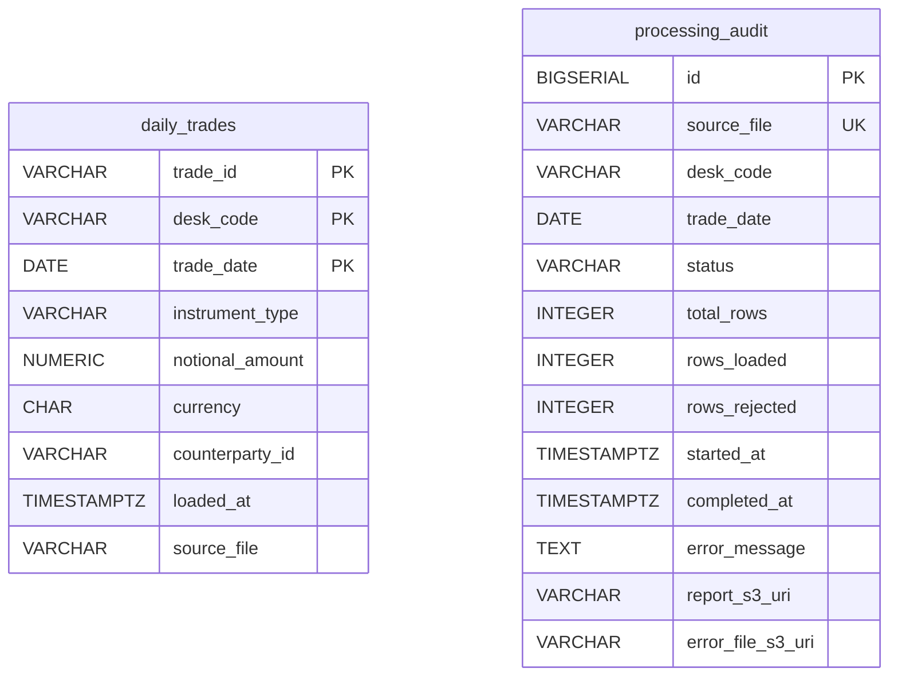
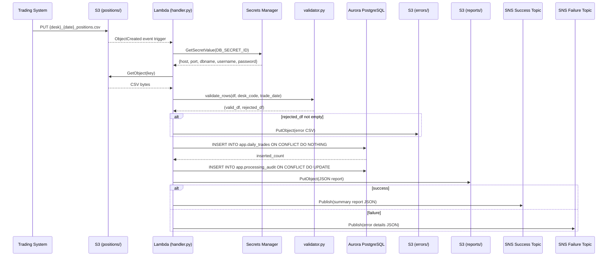
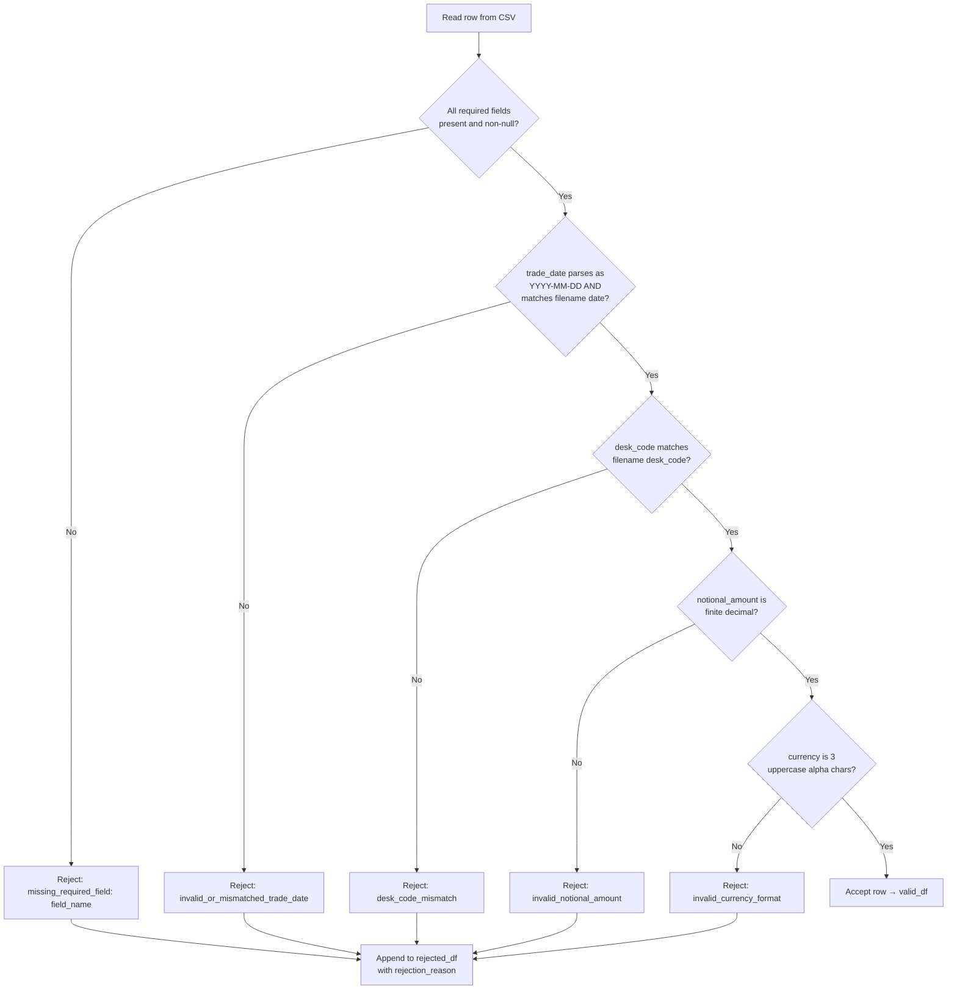
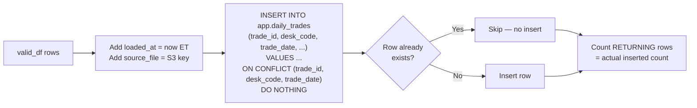
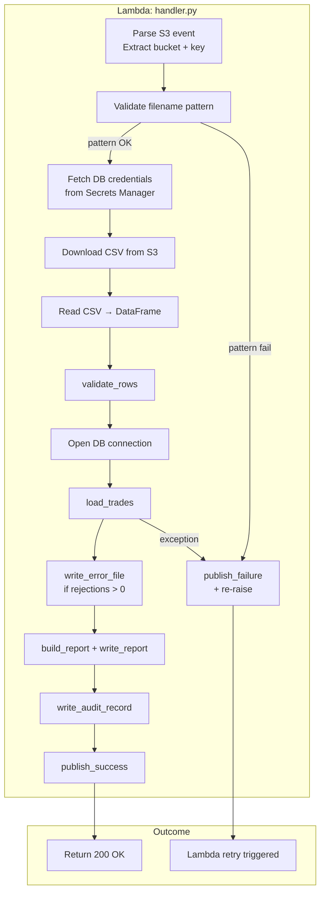

# Technical Design Document
## Daily Trade Position Ingestion
**RFDH — Risk Finance Data Hub**
**TDD Version:** 1.0 | **Date:** June 2026 | **Status:** Draft

---

## COMPONENTS

### `config.py`
**Purpose:** Centralizes all environment variable reads and runtime configuration. Provides a single `Config` dataclass consumed by all other modules. No logic — pure configuration loading.

**Reads:**
- `os.environ["S3_BUCKET"]` — source bucket for CSV files and reports
- `os.environ["DB_SECRET_ID"]` — Secrets Manager secret ID for Aurora credentials
- `os.environ["SNS_SUCCESS_TOPIC_ARN"]` — ARN for success notifications
- `os.environ["SNS_FAILURE_TOPIC_ARN"]` — ARN for failure notifications
- `os.environ["S3_INPUT_PREFIX"]` — prefix where trading systems deposit CSVs (e.g. `positions/`)
- `os.environ["S3_REPORTS_PREFIX"]` — prefix for JSON reports (e.g. `reports/`)
- `os.environ["S3_ERRORS_PREFIX"]` — prefix for rejection error files (e.g. `errors/`)
- `os.environ["AWS_REGION"]` — AWS region

**Writes:** `Config` dataclass instance (in-memory only)

**Satisfies:** BAC-8 (no hardcoded credentials; all config from environment)

---

### `secrets.py`
**Purpose:** Fetches Aurora PostgreSQL credentials from AWS Secrets Manager at runtime. Exposes a single function `get_db_credentials(secret_id: str) -> dict` that calls `boto3.client("secretsmanager").get_secret_value(SecretId=secret_id)`, parses the JSON payload, and returns a dict with keys `host`, `port`, `dbname`, `username`, `password`. Result is not cached — fetched fresh each invocation to support rotation.

**Reads:** Secrets Manager secret identified by `DB_SECRET_ID` env var. Expected JSON keys: `host`, `port`, `dbname`, `username`, `password`.

**Writes:** Returns `dict` in memory. Nothing persisted.

**Satisfies:** BAC-8 (credentials read from Secrets Manager at runtime, never hardcoded)

---

### `validator.py`
**Purpose:** Validates each row of an ingested CSV DataFrame against business rules. Returns two DataFrames: `valid_df` (rows that pass all checks) and `rejected_df` (rows that failed, with a `rejection_reason` column appended).

**Function signatures:**
- `validate_rows(df: pd.DataFrame, desk_code: str, trade_date: str) -> tuple[pd.DataFrame, pd.DataFrame]`
  - Iterates rows and applies the validation rules below. Returns `(valid_df, rejected_df)` where `rejected_df` includes all original columns plus `rejection_reason: str`.

**Validation rules applied in order (first failure wins per row):**
1. All required fields present and non-null/non-empty: `trade_id`, `desk_code`, `instrument_type`, `notional_amount`, `currency`, `counterparty_id`, `trade_date`
2. `trade_date` parses as `YYYY-MM-DD` and matches the date in the filename
3. `desk_code` matches the desk code parsed from the filename
4. `notional_amount` is a valid finite decimal (castable to `float`, not NaN, not infinite)
5. `currency` is a non-empty string of 3 uppercase alphabetic characters (ISO 4217 format)
6. `trade_id` is non-empty string

**Reads:** Raw `pd.DataFrame` from CSV read. Columns: `trade_id`, `desk_code`, `trade_date`, `instrument_type`, `notional_amount`, `currency`, `counterparty_id` (plus any extra columns, which are passed through).

**Writes:**
- `valid_df: pd.DataFrame` — rows passing all checks, same schema as input
- `rejected_df: pd.DataFrame` — failed rows with appended `rejection_reason: str` column

**Satisfies:** BAC-1 (zero errors on valid file), BAC-2 (all 5 rejections with reasons)

---

### `loader.py`
**Purpose:** Loads validated trade rows into `app.daily_trades` using an `INSERT ... ON CONFLICT DO NOTHING` pattern to enforce idempotency. Returns the count of rows actually inserted (not skipped).

**Function signatures:**
- `load_trades(valid_df: pd.DataFrame, source_file: str, conn) -> int`
  - Adds `loaded_at` (current ET timestamp) and `source_file` columns to `valid_df`.
  - Executes a batch `INSERT INTO app.daily_trades (trade_id, desk_code, trade_date, instrument_type, notional_amount, currency, counterparty_id, loaded_at, source_file) VALUES %s ON CONFLICT (trade_id, desk_code, trade_date) DO NOTHING` using `psycopg2.extras.execute_values`.
  - Returns the actual inserted row count by comparing `cursor.rowcount` or using `SELECT changes()` equivalent — specifically, uses the row count from `execute_values` result set tracking via a `RETURNING trade_id` clause counting returned rows.

**Reads:**
- `valid_df`: validated DataFrame with columns matching `app.daily_trades` (excluding `loaded_at`, `source_file`)
- `source_file: str` — S3 key of the source file (for audit trail)
- `conn` — active `psycopg2` connection (provided by caller)

**Writes:**
- Rows inserted into `app.daily_trades` (see Data Contracts for full schema)
- Returns `int` count of rows inserted

**Satisfies:** BAC-1 (row count matches), BAC-3 (idempotent via ON CONFLICT DO NOTHING), BAC-7 (loaded_at in ET)

---

### `error_writer.py`
**Purpose:** Writes the rejection DataFrame to a CSV error file in S3 under the `errors/` prefix. Each rejected row includes all original fields plus the `rejection_reason` column.

**Function signatures:**
- `write_error_file(rejected_df: pd.DataFrame, s3_key: str, s3_client) -> str`
  - Serializes `rejected_df` to CSV (UTF-8, with header).
  - Uploads to `s3_client.put_object(Bucket=os.environ["S3_BUCKET"], Key=s3_key, Body=csv_bytes)`.
  - Returns the full S3 URI of the written file.

**S3 key pattern:** `{S3_ERRORS_PREFIX}{desk_code}_{trade_date}_positions_errors_{timestamp_et}.csv`
where `timestamp_et` is formatted `%Y%m%dT%H%M%S`.

**Writes:** CSV file to S3 `errors/` prefix. Columns: all original CSV columns + `rejection_reason`.

**Satisfies:** BAC-2 (error file listing all rejections with reasons)

---

### `reporter.py`
**Purpose:** Computes the JSON summary report after each file is processed and writes it to S3 under the `reports/` prefix.

**Function signatures:**
- `build_report(raw_df: pd.DataFrame, valid_df: pd.DataFrame, rejected_df: pd.DataFrame, inserted_count: int, source_file: str, load_timestamp_et: datetime) -> dict`
  - Computes all report fields (see Data Contracts — SNS/Report payload).
  - Returns a `dict` (JSON-serializable).
- `write_report(report: dict, s3_key: str, s3_client) -> str`
  - Serializes report to JSON and uploads to S3.
  - Returns full S3 URI.

**Report fields computed:**
- `total_rows_received`: `len(raw_df)`
- `rows_loaded`: `inserted_count` (actual DB inserts, not just valid rows)
- `rows_rejected`: `len(rejected_df)`
- `load_timestamp_et`: ISO 8601 string, ET timezone, from `load_timestamp_et` argument
- `record_counts_by_desk_code`: `dict` — `{desk_code: count}` from `valid_df["desk_code"].value_counts()`
- `min_notional_amount`: `float(valid_df["notional_amount"].min())` — `None` if no valid rows
- `max_notional_amount`: `float(valid_df["notional_amount"].max())` — `None` if no valid rows
- `null_rates_by_column`: `dict` — for each required column in `raw_df`, `{col: null_count / total_rows}` as float rounded to 4 decimal places
- `source_file`: S3 key of the input file
- `error_file_s3_uri`: S3 URI of the error file (or `null` if no rejections)

**S3 key pattern:** `{S3_REPORTS_PREFIX}{desk_code}_{trade_date}_positions_report_{timestamp_et}.json`

**Writes:** JSON file to S3 `reports/` prefix.

**Satisfies:** BAC-4 (correct counts, min/max notional, null rates), BAC-7 (ET timestamp in report)

---

### `notifier.py`
**Purpose:** Publishes SNS notifications on success and failure.

**Function signatures:**
- `publish_success(report: dict, sns_client) -> None`
  - Publishes `report` dict as JSON string to `os.environ["SNS_SUCCESS_TOPIC_ARN"]`.
- `publish_failure(error_details: dict, sns_client) -> None`
  - Publishes `error_details` dict as JSON string to `os.environ["SNS_FAILURE_TOPIC_ARN"]`.
  - `error_details` keys: `source_file`, `error_type`, `error_message`, `timestamp_et`.

**Reads:** Report dict from `reporter.py` or error details dict constructed in `handler.py`.

**Writes:** SNS message (see Data Contracts — SNS section).

**Satisfies:** BAC-5 (SNS notification with correct summary statistics after each file)

---

### `audit.py`
**Purpose:** Writes one audit record per file processed into `app.processing_audit` table. Captures file identity, outcome, row counts, and processing timestamps for OSFI/SOX compliance.

**Function signatures:**
- `write_audit_record(audit_record: dict, conn) -> None`
  - Executes `INSERT INTO app.processing_audit (...) VALUES (...) ON CONFLICT (source_file) DO UPDATE SET ...` so that re-runs update rather than duplicate the audit record.

**`audit_record` keys:** `source_file`, `desk_code`, `trade_date`, `status` (`"SUCCESS"` | `"PARTIAL"` | `"FAILURE"`), `total_rows`, `rows_loaded`, `rows_rejected`, `started_at` (ET), `completed_at` (ET), `error_message` (nullable), `report_s3_uri` (nullable), `error_file_s3_uri` (nullable).

**Writes:** Row in `app.processing_audit`.

**Satisfies:** BRD NFR-3.3 (audit trail for OSFI/SOX compliance)

---

### `handler.py`
**Purpose:** Lambda entry point. Receives the S3 event, orchestrates the full pipeline by calling all other modules in sequence, and handles top-level exceptions with failure notifications.

**Function signatures:**
- `handler(event: dict, context) -> dict`
  - Parses S3 event to extract `bucket` and `key`.
  - Validates filename matches pattern `{desk_code}_{trade_date}_positions.csv` using regex; rejects and notifies if pattern fails.
  - Downloads CSV from S3 using `s3_client.get_object`.
  - Reads CSV into `pd.DataFrame` using `pd.read_csv`.
  - Calls `validator.validate_rows(df, desk_code, trade_date)`.
  - Opens DB connection using credentials from `secrets.get_db_credentials`.
  - Calls `loader.load_trades(valid_df, source_file, conn)`.
  - Calls `error_writer.write_error_file(rejected_df, ...)` if `len(rejected_df) > 0`.
  - Calls `reporter.build_report(...)` and `reporter.write_report(...)`.
  - Calls `audit.write_audit_record(...)`.
  - Calls `notifier.publish_success(report, sns_client)`.
  - On any unhandled exception: calls `notifier.publish_failure(...)` and re-raises to allow Lambda retry.
  - Returns `{"statusCode": 200, "body": "OK"}` on success.

**Reads:** S3 event dict (Lambda trigger), CSV file from S3, DB credentials from Secrets Manager.

**Writes:** Orchestrates writes to Aurora, S3 (reports, errors), SNS, audit table.

**Satisfies:** BAC-1 through BAC-8 (orchestration of all components)

---

### `db.py`
**Purpose:** Manages Aurora PostgreSQL connection lifecycle. Provides a context manager for connections. Does not cache connections across Lambda invocations.

**Function signatures:**
- `get_connection(credentials: dict) -> psycopg2.connection`
  - Opens and returns a `psycopg2` connection using `host`, `port`, `dbname`, `username`, `password` from `credentials`.
  - Sets `connect_timeout=10`, `sslmode="require"`.

**Reads:** `credentials: dict` from `secrets.py`.
**Writes:** Nothing (connection lifecycle management only).

**Satisfies:** BAC-8 (no hardcoded credentials), NFR-3.2 (SSL in transit)

---

### `schema.sql`
**Purpose:** DDL for all tables the system requires. Applied once by the deployment team. Not executed by application code.

**Creates:**
- `app.daily_trades` (see Data Contracts)
- `app.processing_audit` (see Data Contracts)

**Satisfies:** BAC-1, BAC-3, NFR-3.3

---

## AWS SERVICES

| Service | Role |
|---|---|
| **AWS Lambda** | Compute platform. Triggered by S3 `ObjectCreated` event on the input prefix. Runs the full ingestion pipeline per file. |
| **Amazon S3** | Source bucket for incoming CSV files (`positions/` prefix). Destination for JSON reports (`reports/` prefix) and error files (`errors/` prefix). |
| **Amazon Aurora PostgreSQL** | Persistent store for validated trade records (`app.daily_trades`) and processing audit trail (`app.processing_audit`). |
| **AWS Secrets Manager** | Stores Aurora database credentials (host, port, dbname, username, password). Read at runtime by `secrets.py`. |
| **Amazon SNS** | Two topics: one for success notifications (triggers downstream risk pipeline), one for failure alerts. |
| **AWS IAM** | Lambda execution role scoped to: S3 `GetObject`/`PutObject` on the data bucket, Secrets Manager `GetSecretValue` on the DB secret, SNS `Publish` on both topics, VPC/network access to Aurora. |
| **Amazon VPC** | Lambda and Aurora run inside the same VPC. Lambda uses VPC config (subnets, security groups) to reach Aurora on its private endpoint. |

---

## DATA CONTRACTS

### Aurora PostgreSQL Tables

#### `app.daily_trades`
```
Table: app.daily_trades

Column             | Type                         | Constraints
-------------------|------------------------------|-------------------------------
trade_id           | VARCHAR(100)                 | NOT NULL
desk_code          | VARCHAR(50)                  | NOT NULL
trade_date         | DATE                         | NOT NULL
instrument_type    | VARCHAR(100)                 | NOT NULL
notional_amount    | NUMERIC(24, 6)               | NOT NULL
currency           | CHAR(3)                      | NOT NULL
counterparty_id    | VARCHAR(100)                 | NOT NULL
loaded_at          | TIMESTAMPTZ                  | NOT NULL  (stored in ET via app-layer, value is ET-aware)
source_file        | VARCHAR(500)                 | NOT NULL

PRIMARY KEY: (trade_id, desk_code, trade_date)
UNIQUE CONSTRAINT: uc_daily_trades_key ON (trade_id, desk_code, trade_date)
INDEX: idx_daily_trades_desk_date ON (desk_code, trade_date)
INDEX: idx_daily_trades_trade_date ON (trade_date)
```

#### `app.processing_audit`
```
Table: app.processing_audit

Column             | Type                         | Constraints
-------------------|------------------------------|-------------------------------
id                 | BIGSERIAL                    | PRIMARY KEY
source_file        | VARCHAR(500)                 | NOT NULL UNIQUE
desk_code          | VARCHAR(50)                  | NOT NULL
trade_date         | DATE                         | NOT NULL
status             | VARCHAR(20)                  | NOT NULL  CHECK IN ('SUCCESS','PARTIAL','FAILURE')
total_rows         | INTEGER                      | NOT NULL
rows_loaded        | INTEGER                      | NOT NULL
rows_rejected      | INTEGER                      | NOT NULL
started_at         | TIMESTAMPTZ                  | NOT NULL
completed_at       | TIMESTAMPTZ                  |
error_message      | TEXT                         |
report_s3_uri      | VARCHAR(1000)                |
error_file_s3_uri  | VARCHAR(1000)                |

UNIQUE CONSTRAINT: uq_audit_source_file ON (source_file)
INDEX: idx_audit_desk_date ON (desk_code, trade_date)
INDEX: idx_audit_status ON (status)
```

**Schema diagram:**


---

### S3 Paths

| Purpose | Key Pattern | Format | Content |
|---|---|---|---|
| Input CSV | `{S3_INPUT_PREFIX}{desk_code}_{trade_date}_positions.csv` | CSV, UTF-8, with header row | Columns: `trade_id, desk_code, trade_date, instrument_type, notional_amount, currency, counterparty_id` |
| Error file | `{S3_ERRORS_PREFIX}{desk_code}_{trade_date}_positions_errors_{YYYYMMDDTHHMMSS}.csv` | CSV, UTF-8, with header row | All input columns + `rejection_reason` |
| JSON report | `{S3_REPORTS_PREFIX}{desk_code}_{trade_date}_positions_report_{YYYYMMDDTHHMMSS}.json` | JSON | See Report payload below |

**Example input key:** `positions/EQTY_2026-06-15_positions.csv`
**Example error key:** `errors/EQTY_2026-06-15_positions_errors_20260615T203045.csv`
**Example report key:** `reports/EQTY_2026-06-15_positions_report_20260615T203052.json`

---

### Secrets Manager

**Environment variable:** `DB_SECRET_ID = os.environ["DB_SECRET_ID"]`

**Expected JSON payload in secret:**
```json
{
  "host":     "<aurora-cluster-endpoint>",
  "port":     5432,
  "dbname":   "<database-name>",
  "username": "<db-username>",
  "password": "<db-password>"
}
```

---

### SNS Topics

#### Success Topic
**Environment variable:** `SNS_SUCCESS_TOPIC_ARN = os.environ["SNS_SUCCESS_TOPIC_ARN"]`

**Message payload (JSON string):**
```json
{
  "event_type":               "TRADE_INGESTION_SUCCESS",
  "source_file":              "positions/EQTY_2026-06-15_positions.csv",
  "desk_code":                "EQTY",
  "trade_date":               "2026-06-15",
  "total_rows_received":      1000,
  "rows_loaded":              995,
  "rows_rejected":            5,
  "load_timestamp_et":        "2026-06-15T20:30:52-04:00",
  "record_counts_by_desk_code": { "EQTY": 995 },
  "min_notional_amount":      1000.00,
  "max_notional_amount":      50000000.00,
  "null_rates_by_column":     { "counterparty_id": 0.0, "currency": 0.0 },
  "report_s3_uri":            "s3://<bucket>/reports/EQTY_2026-06-15_positions_report_20260615T203052.json",
  "error_file_s3_uri":        "s3://<bucket>/errors/EQTY_2026-06-15_positions_errors_20260615T203045.csv"
}
```

#### Failure Topic
**Environment variable:** `SNS_FAILURE_TOPIC_ARN = os.environ["SNS_FAILURE_TOPIC_ARN"]`

**Message payload (JSON string):**
```json
{
  "event_type":     "TRADE_INGESTION_FAILURE",
  "source_file":    "positions/EQTY_2026-06-15_positions.csv",
  "error_type":     "ValidationError | LoadError | FileParseError | UnknownError",
  "error_message":  "<exception message>",
  "timestamp_et":   "2026-06-15T20:31:00-04:00"
}
```

---

## DATA FLOW

### End-to-End Pipeline Flow



---

### Validation Decision Logic



---

### Idempotency & Dedup Logic



---

### Lambda Orchestration Swimlane



---

### File Naming and Parsing Algorithm

```
ALGORITHM: parse_filename(s3_key)

INPUT: s3_key = "positions/EQTY_2026-06-15_positions.csv"

1. Strip prefix: filename = basename(s3_key)               → "EQTY_2026-06-15_positions.csv"
2. Match regex: ^([A-Z0-9]+)_(\d{4}-\d{2}-\d{2})_positions\.csv$
3. If no match → raise FileNameError("Filename does not match expected pattern")
4. desk_code  = group(1)                                   → "EQTY"
5. trade_date = group(2)                                   → "2026-06-15"
6. Validate trade_date parses as valid calendar date
7. Return (desk_code, trade_date)
```

---

## TECHNICAL ACCEPTANCE CRITERIA

### TAC-1 — Valid file fully loaded, row count matches (BAC-1)
- `handler.py` reads the CSV with `pd.read_csv`, producing a DataFrame of exactly N rows.
- `validator.validate_rows` returns `valid_df` with N rows and `rejected_df` with 0 rows when all rows are well-formed.
- `loader.load_trades` executes `INSERT INTO app.daily_trades ... ON CONFLICT (trade_id, desk_code, trade_date) DO NOTHING RETURNING trade_id` and returns `inserted_count == N`.
- Unit test: feed 1,000-row valid DataFrame → assert `inserted_count == 1000` and `len(rejected_df) == 0`.
- Integration test: query `SELECT COUNT(*) FROM app.daily_trades WHERE desk_code = :desk AND trade_date = :date` after load → assert result equals input row count.

### TAC-2 — Rejection file lists all 5 invalid rows with reasons (BAC-2)
- `validator.validate_rows` appends `rejection_reason` column to each failing row. Rejection reason format: `"{rule_name}: {detail}"` (e.g. `"missing_required_field: counterparty_id"`, `"invalid_notional_amount: 'abc' is not a valid decimal"`).
- `error_writer.write_error_file` writes a CSV to S3 `errors/` prefix containing exactly `len(rejected_df)` rows.
- Unit test: feed a 10-row DataFrame with exactly 5 invalid rows (one per distinct rule) → assert `len(rejected_df) == 5`, assert each row has a non-empty `rejection_reason`, assert error CSV has 5 data rows (excluding header).
- Integration test: assert error file exists in S3 at the expected key and row count in file matches `rows_rejected` in the JSON report.

### TAC-3 — Reprocessing does not create duplicates (BAC-3)
- `loader.load_trades` uses `INSERT INTO app.daily_trades (...) VALUES %s ON CONFLICT (trade_id, desk_code, trade_date) DO NOTHING`.
- The `UNIQUE CONSTRAINT uc_daily_trades_key ON (trade_id, desk_code, trade_date)` enforces uniqueness at the DB layer independently of application logic.
- Unit test: call `load_trades` twice with the same `valid_df` → assert first call returns N, second call returns 0, and `SELECT COUNT(*) FROM app.daily_trades WHERE desk_code = :desk AND trade_date = :date` returns N (not 2N).
- Integration test: invoke `handler` twice with the same S3 key → DB row count unchanged after second invocation.

### TAC-4 — JSON report contains correct counts, min/max notional, null rates (BAC-4)
- `reporter.build_report` computes:
  - `total_rows_received = len(raw_df)` — row count before validation
  - `rows_loaded = inserted_count` — actual DB inserts (not just valid_df length)
  - `rows_rejected = len(rejected_df)`
  - `min_notional_amount = float(valid_df["notional_amount"].min())`
  - `max_notional_amount = float(valid_df["notional_amount"].max())`
  - `null_rates_by_column[col] = round(raw_df[col].isna().sum() / len(raw_df), 4)` for each required column
- Unit test: supply known DataFrames → assert each JSON field equals pre-computed expected value.
- Integration test: download report JSON from S3 after pipeline run → assert all field values against known input file statistics.

### TAC-5 — SNS notification published with correct summary statistics (BAC-5)
- `notifier.publish_success` calls `sns_client.publish(TopicArn=os.environ["SNS_SUCCESS_TOPIC_ARN"], Message=json.dumps(report))`.
- Published `Message` is valid JSON with fields: `event_type`, `source_file`, `desk_code`, `trade_date`, `total_rows_received`, `rows_loaded`, `rows_rejected`, `load_timestamp_et`, `record_counts_by_desk_code`, `min_notional_amount`, `max_notional_amount`, `null_rates_by_column`, `report_s3_uri`, `error_file_s3_uri`.
- Unit test: mock `sns_client.publish`, call `publish_success(report, mock_sns)` → assert `publish` called once, assert `json.loads(call_args["Message"])["rows_loaded"]` equals expected value.
- Integration test: subscribe a test SQS queue to the SNS success topic and assert message received with correct `rows_loaded` after pipeline run.

### TAC-6 — 10,000-row file completes within 60 seconds (BAC-6)
- `handler.py` is instrumented with `time.perf_counter()` at start and end of processing.
- Performance test: generate a synthetic 10,000-row CSV, invoke the Lambda (or run handler locally against Aurora), assert wall-clock elapsed time < 60 seconds.
- `psycopg2.extras.execute_values` is used for batch insert (not row-by-row) to meet the performance target.
- Validator uses vectorised pandas operations (not Python row iteration via `iterrows`) for the core null/type checks; per-row Python logic is limited to cross-field business rules.

### TAC-7 — All timestamps in ET, never UTC (BAC-7)
- `loaded_at` column in `app.daily_trades` is set via `datetime.now(pytz.timezone("America/Toronto"))` before insert.
- `load_timestamp_et` in the JSON report is an ISO 8601 string with ET UTC offset (e.g. `-04:00` or `-05:00` depending on DST).
- `started_at` and `completed_at` in `app.processing_audit` are set via `datetime.now(pytz.timezone("America/Toronto"))`.
- Unit test: assert `loaded_at` value has `tzinfo` matching `America/Toronto`, assert `load_timestamp_et` string ends with `-04:00` or `-05:00` (not `+00:00` or `Z`).
- The `logging` module is configured with a formatter that formats log timestamps in ET using `pytz.timezone("America/Toronto")`.

### TAC-8 — No credentials in codebase; all secrets from Secrets Manager (BAC-8)
- `config.py` reads all secrets references from `os.environ`. No string literals matching DB password patterns exist anywhere in the codebase.
- `secrets.py` calls `boto3.client("secretsmanager").get_secret_value(SecretId=os.environ["DB_SECRET_ID"])` — no inline credential values.
- `db.py` accepts `credentials: dict` from `secrets.py` and passes them to `psycopg2.connect` — never reads them from a local file or environment variable directly.
- Static analysis check (part of CI): `grep -r "password\s*=" src/` must return zero matches (excluding test mocks and comments).
- Unit test: assert `secrets.get_db_credentials` does not accept a fallback default value and raises `KeyError` if `DB_SECRET_ID` env var is missing.

---

## OPEN QUESTIONS

**None.**

All business logic is specified in the BRD with sufficient precision to design against. Infrastructure configuration is handled via environment variables per design convention.

---

## ASSUMPTIONS

| # | Assumption | Impact if Wrong |
|---|---|---|
| A-1 | Lambda is the compute platform (triggered by S3 `ObjectCreated` events on the `S3_INPUT_PREFIX`). | If ECS/EKS/EC2 is required, the handler entry point and trigger mechanism must change. |
| A-2 | One Lambda invocation processes exactly one CSV file (one S3 event record per invocation). SQS-based batching is not used. | If multiple files must be processed per invocation, the handler loop logic must be extended. |
| A-3 | Lambda has network access to Aurora via VPC (private subnets, security groups pre-configured). | If Aurora is publicly accessible (not expected), the SSL requirement still applies. |
| A-4 | The `app` PostgreSQL schema already exists. `schema.sql` will create tables within it; it will not create the schema itself. | If schema does not exist, `schema.sql` must prepend `CREATE SCHEMA IF NOT EXISTS app;`. |
| A-5 | CSV files always include a header row with column names matching the required field names exactly (case-sensitive). | If headers differ in case or naming, the reader must add a column-mapping/normalization step. |
| A-6 | A "partial" load (some rows valid, some rejected) is acceptable — valid rows are loaded and a `PARTIAL` audit status is recorded. The pipeline does not fail-all on any rejections. | If all-or-nothing transactional loading is required, the loader must wrap in a transaction and rollback on any rejection. |
| A-7 | `trade_id` uniqueness is scoped to `(trade_id, desk_code, trade_date)` — the same `trade_id` value may appear across different desks or dates without conflict. | If `trade_id` must be globally unique across all desks and dates, the unique constraint and conflict clause must change to `(trade_id)` alone. |
| A-8 | The S3 bucket, Lambda function, Aurora cluster, SNS topics, and Secrets Manager secret are all provisioned before code deployment. This TDD covers application code only. | No impact on design; deployment runbook must confirm all infrastructure exists before first run. |
| A-9 | `notional_amount` negative values are valid (e.g. short positions). Only non-numeric and infinite values are rejected. | If negative notionals are invalid, an additional validation rule must be added. |
| A-10 | Lambda memory is set to at least 512 MB to comfortably handle DataFrames for 100,000-row files. | If memory is constrained below this, chunked reading must be introduced. |
| A-11 | A file is considered fully re-processable if the same S3 key is re-delivered (e.g. trading system re-sends). The idempotency guarantee covers this scenario via ON CONFLICT DO NOTHING. | No impact — this is the stated requirement. Confirmed by BAC-3. |
| A-12 | The `loaded_at` TIMESTAMPTZ column stores ET-aware datetimes. PostgreSQL will store these as UTC internally but the application layer always constructs values via `pytz.timezone("America/Toronto")` to satisfy BAC-7. | If the DB session timezone must also be set to ET, `SET TIME ZONE 'America/Toronto'` must be issued on connection open in `db.py`. |
| A-13 | Error files are written to S3 only when at least one row is rejected. If all rows are valid, no error file is created and `error_file_s3_uri` is `null` in the report and SNS payload. | If a zero-row error file is always required, `error_writer.write_error_file` must be called unconditionally. |
| A-14 | The downstream risk calculation pipeline is an existing SNS subscriber. RFDH does not build or modify it. | No impact on this TDD. |