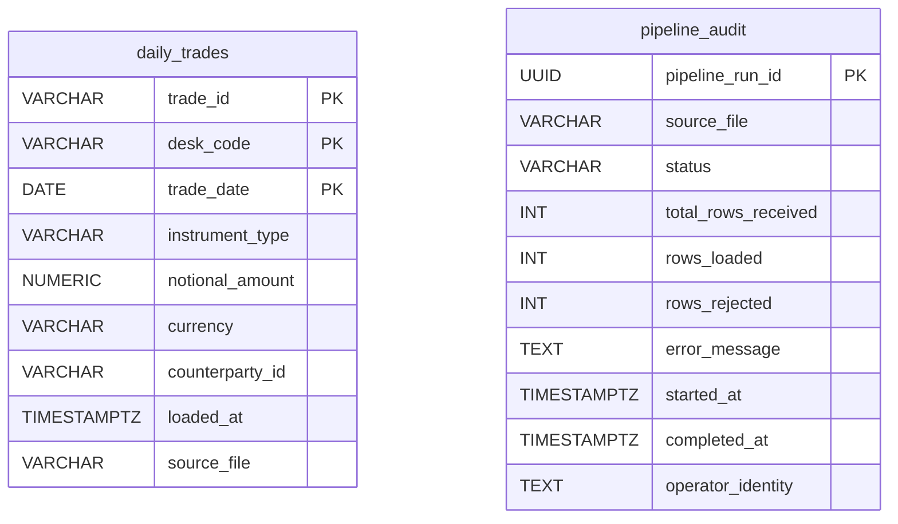
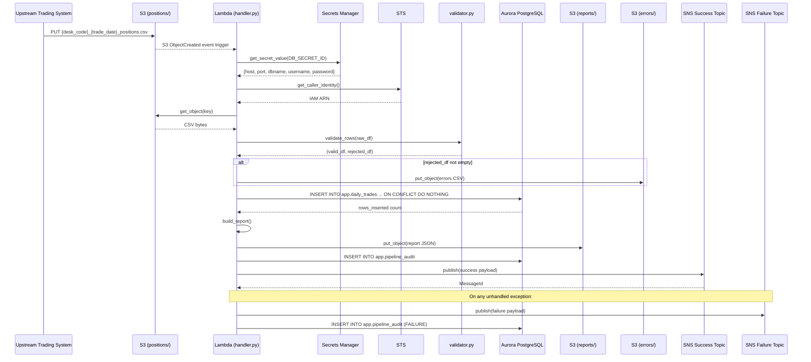
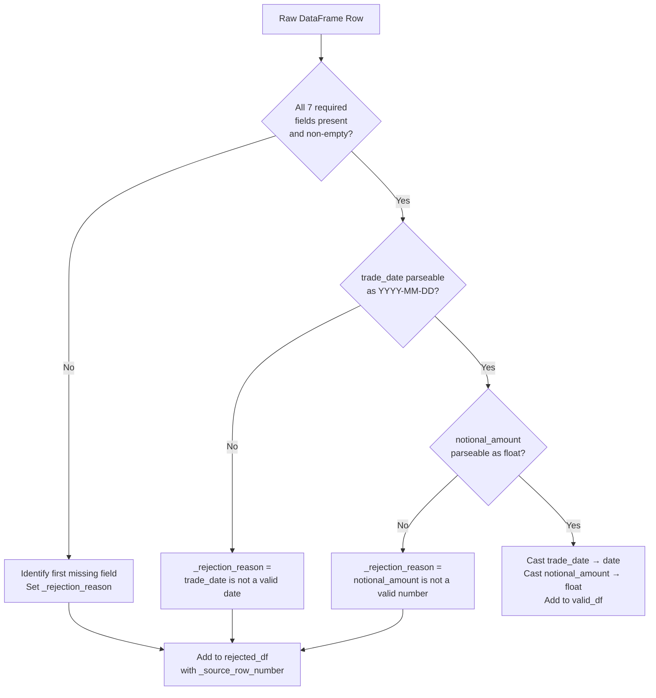
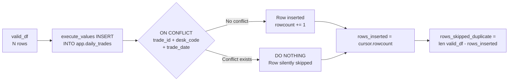
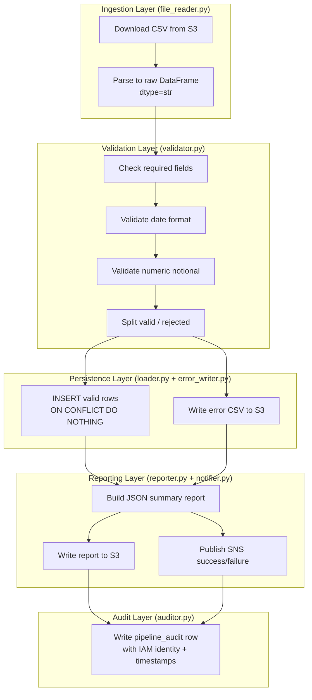

# Technical Design Document
## Daily Trade Position Ingestion
**RFDH — Risk Finance Data Hub**
**TDD Version:** 1.0 | **Status:** Draft | **Date:** June 2026

---

### COMPONENTS

---

#### `src/config.py`
**Purpose:** Centralizes all environment variable reads and runtime configuration. No logic — only configuration binding.

**Reads:**
- `os.environ["S3_BUCKET"]` — S3 bucket name for input files and reports
- `os.environ["S3_INPUT_PREFIX"]` — prefix where trading desks deposit files (e.g. `positions/`)
- `os.environ["S3_REPORTS_PREFIX"]` — prefix for summary report output (e.g. `reports/`)
- `os.environ["S3_ERRORS_PREFIX"]` — prefix for rejection error files (e.g. `errors/`)
- `os.environ["DB_SECRET_ID"]` — Secrets Manager secret ID for Aurora credentials
- `os.environ["SNS_SUCCESS_TOPIC_ARN"]` — SNS topic ARN for success notifications
- `os.environ["SNS_FAILURE_TOPIC_ARN"]` — SNS topic ARN for failure notifications
- `os.environ["AUDIT_TABLE"]` — fully qualified audit table name (default: `app.pipeline_audit`)

**Writes:** Nothing. Exposes a `Config` dataclass with typed fields bound from environment variables.

**Satisfies:** BAC-7 (ET timezone constant defined here), BAC-8 (no credentials in code)

---

#### `src/secrets.py`
**Purpose:** Reads Aurora PostgreSQL credentials from AWS Secrets Manager at runtime. Called once per pipeline invocation; result is passed to downstream components.

**Function signature:**
```
get_db_credentials(secret_id: str) -> dict
```
- Calls `boto3.client("secretsmanager").get_secret_value(SecretId=secret_id)`
- Parses the returned JSON string
- Returns dict with keys: `host`, `port`, `dbname`, `username`, `password`
- Raises `RuntimeError` with descriptive message if secret is missing or malformed

**Reads:** AWS Secrets Manager secret identified by `secret_id` parameter

**Writes:** Nothing (returns in-memory dict, never logged or persisted)

**Satisfies:** BAC-8 (credentials only from Secrets Manager, never hardcoded)

---

#### `src/file_reader.py`
**Purpose:** Downloads a CSV file from S3 and parses it into a raw pandas DataFrame. No validation at this stage — returns every row exactly as received.

**Function signatures:**
```
download_file(s3_client, bucket: str, key: str) -> io.BytesIO
parse_csv(file_bytes: io.BytesIO, source_key: str) -> pd.DataFrame
```

- `download_file`: calls `s3_client.get_object(Bucket=bucket, Key=key)`, streams body to `io.BytesIO`. Raises `FileNotFoundError` if key does not exist; raises `IOError` on read failure.
- `parse_csv`: uses `pd.read_csv()` with `dtype=str` (all columns read as strings to prevent silent type coercion before validation). Adds a `_source_file` column set to `source_key`. Returns a DataFrame with columns as-read from CSV headers plus `_source_file`. Raises `ValueError` if CSV cannot be parsed (empty file, bad encoding, no header row).

**Reads:**
- S3 object: `s3://os.environ["S3_BUCKET"]/{key}` — CSV file with header row

**Writes:** Returns `pd.DataFrame` in memory

**Satisfies:** BAC-1 (ingests valid file), BAC-2 (passes all rows to validator including bad ones)

---

#### `src/validator.py`
**Purpose:** Validates each row of the raw DataFrame. Splits rows into a valid set and a rejected set. Each rejected row records a human-readable rejection reason.

**Function signature:**
```
validate_rows(df: pd.DataFrame) -> tuple[pd.DataFrame, pd.DataFrame]
```
Returns `(valid_df, rejected_df)`.

**Validation rules applied in order (first failure wins for a row):**

| Rule | Field(s) | Rejection Reason String |
|---|---|---|
| Missing required field (null/empty) | `trade_id` | `"trade_id is missing or empty"` |
| Missing required field | `desk_code` | `"desk_code is missing or empty"` |
| Missing required field | `trade_date` | `"trade_date is missing or empty"` |
| Missing required field | `instrument_type` | `"instrument_type is missing or empty"` |
| Missing required field | `notional_amount` | `"notional_amount is missing or empty"` |
| Missing required field | `currency` | `"currency is missing or empty"` |
| Missing required field | `counterparty_id` | `"counterparty_id is missing or empty"` |
| Non-parseable date | `trade_date` | `"trade_date is not a valid date (expected YYYY-MM-DD)"` |
| Non-numeric value | `notional_amount` | `"notional_amount is not a valid number"` |

**`rejected_df` schema:** All original columns from input DataFrame plus:
- `_rejection_reason` (str) — the first failing rule's message
- `_source_row_number` (int) — 1-based row index from the original file (header = row 0, first data row = 1)

**`valid_df` schema:** All original columns, with `trade_date` cast to `datetime.date`, `notional_amount` cast to `float`.

**Satisfies:** BAC-1 (zero rejections on clean file), BAC-2 (all 5 invalid rows captured with specific reasons)

---

#### `src/loader.py`
**Purpose:** Loads validated trade rows into `app.daily_trades` using an upsert pattern that silently ignores duplicates. Returns the count of rows actually inserted (not skipped).

**Function signature:**
```
load_trades(
    valid_df: pd.DataFrame,
    credentials: dict,
    source_file: str,
    loaded_at: datetime.datetime
) -> int
```

**Behavior:**
- Opens a `psycopg2` connection using `credentials` dict (`host`, `port`, `dbname`, `username`, `password`)
- Builds a list of tuples from `valid_df`: `(trade_id, desk_code, trade_date, instrument_type, notional_amount, currency, counterparty_id, loaded_at, source_file)`
- Executes `psycopg2.extras.execute_values()` with the following SQL:
  ```
  INSERT INTO app.daily_trades
    (trade_id, desk_code, trade_date, instrument_type, notional_amount, currency,
     counterparty_id, loaded_at, source_file)
  VALUES %s
  ON CONFLICT (trade_id, desk_code, trade_date) DO NOTHING
  ```
- Reads `cursor.rowcount` after execution to determine rows inserted (rows where the conflict was not triggered)
- Commits transaction; rolls back and re-raises on any exception
- `loaded_at` must be an ET-timezone-aware `datetime.datetime` object (validated by assertion)

**Returns:** `int` — count of rows inserted (0 if all were duplicates)

**Satisfies:** BAC-1 (all valid rows loaded), BAC-3 (ON CONFLICT DO NOTHING prevents duplicates), BAC-7 (loaded_at is ET)

---

#### `src/error_writer.py`
**Purpose:** Writes the rejected rows DataFrame to a CSV error file in S3 under the `errors/` prefix.

**Function signature:**
```
write_error_file(
    s3_client,
    bucket: str,
    errors_prefix: str,
    rejected_df: pd.DataFrame,
    source_key: str
) -> str
```

**Behavior:**
- If `rejected_df` is empty, returns empty string and writes nothing
- Derives error file key: `{errors_prefix}{stem}_errors.csv` where `stem` is the source key filename without extension. Example: input `positions/EQTY_2026-06-01_positions.csv` → error key `errors/EQTY_2026-06-01_positions_errors.csv`
- Serializes `rejected_df` (all original columns + `_rejection_reason` + `_source_row_number`) to CSV bytes via `pd.DataFrame.to_csv(index=False)`
- Calls `s3_client.put_object(Bucket=bucket, Key=error_key, Body=csv_bytes, ContentType="text/csv")`
- Returns the full S3 key of the written error file

**Writes:**
- S3 CSV at `{S3_ERRORS_PREFIX}{desk_code}_{trade_date}_positions_errors.csv`
- Columns: all source CSV columns + `_rejection_reason` (str) + `_source_row_number` (int)

**Satisfies:** BAC-2 (error file lists all rejected rows with reasons)

---

#### `src/reporter.py`
**Purpose:** Computes all summary statistics from the processing run and writes a JSON report to S3 under `reports/`.

**Function signature:**
```
build_report(
    source_key: str,
    raw_df: pd.DataFrame,
    valid_df: pd.DataFrame,
    rejected_df: pd.DataFrame,
    rows_inserted: int,
    load_timestamp: datetime.datetime
) -> dict

write_report(
    s3_client,
    bucket: str,
    reports_prefix: str,
    report: dict,
    source_key: str
) -> str
```

**`build_report` computes:**
- `source_file` (str) — original S3 key
- `total_rows_received` (int) — `len(raw_df)`
- `rows_loaded` (int) — `rows_inserted` (actual DB inserts, not valid row count)
- `rows_rejected` (int) — `len(rejected_df)`
- `rows_skipped_duplicate` (int) — `len(valid_df) - rows_inserted`
- `load_timestamp` (str) — ISO 8601 string of `load_timestamp` in ET, e.g. `"2026-06-01T20:15:33.123456-04:00"`
- `desk_code_counts` (dict[str, int]) — `valid_df.groupby("desk_code").size().to_dict()`
- `notional_min` (float | None) — `valid_df["notional_amount"].min()` or `null` if no valid rows
- `notional_max` (float | None) — `valid_df["notional_amount"].max()` or `null` if no valid rows
- `null_rates` (dict[str, float]) — for each required column in `raw_df`, fraction of rows where the column is null or empty string, rounded to 6 decimal places
- `error_file_key` (str | None) — S3 key of error file if written, else `null`

**`write_report`:**
- Serializes `report` dict to JSON bytes (UTF-8, `indent=2`)
- Report S3 key: `{reports_prefix}{stem}_report.json` where `stem` is derived same as error file. Example: `reports/EQTY_2026-06-01_positions_report.json`
- Calls `s3_client.put_object(Bucket=bucket, Key=report_key, Body=json_bytes, ContentType="application/json")`
- Returns the full S3 key

**Satisfies:** BAC-4 (correct counts, min/max notional, null rates), BAC-7 (load_timestamp in ET)

---

#### `src/notifier.py`
**Purpose:** Publishes SNS notifications on success or failure. Two separate functions for the two event types.

**Function signatures:**
```
publish_success(
    sns_client,
    topic_arn: str,
    report: dict
) -> str

publish_failure(
    sns_client,
    topic_arn: str,
    source_key: str,
    error_message: str,
    failed_at: datetime.datetime
) -> str
```

**`publish_success` message body (JSON string):**
```json
{
  "event": "TRADE_INGESTION_SUCCESS",
  "source_file": "<str>",
  "total_rows_received": "<int>",
  "rows_loaded": "<int>",
  "rows_rejected": "<int>",
  "rows_skipped_duplicate": "<int>",
  "load_timestamp": "<ISO8601 ET string>",
  "report_key": "<str — S3 key of JSON report>"
}
```

**`publish_failure` message body (JSON string):**
```json
{
  "event": "TRADE_INGESTION_FAILURE",
  "source_file": "<str>",
  "error_message": "<str>",
  "failed_at": "<ISO8601 ET string>"
}
```

Both functions call `sns_client.publish(TopicArn=topic_arn, Message=json.dumps(payload), Subject=<event string>)` and return the SNS `MessageId`.

**Satisfies:** BAC-5 (SNS published with correct stats), BAC-7 (all timestamps ET)

---

#### `src/auditor.py`
**Purpose:** Writes one row per file-processing event to the `app.pipeline_audit` table. Supports OSFI/SOX audit trail requirement.

**Function signature:**
```
record_audit(
    credentials: dict,
    audit_record: dict
) -> None
```

**`audit_record` dict keys:**
- `source_file` (str)
- `pipeline_run_id` (str) — UUID4 generated at pipeline start
- `status` (str) — `"SUCCESS"` or `"FAILURE"`
- `total_rows_received` (int)
- `rows_loaded` (int)
- `rows_rejected` (int)
- `error_message` (str | None)
- `started_at` (datetime.datetime, ET-aware)
- `completed_at` (datetime.datetime, ET-aware)
- `operator_identity` (str) — IAM principal ARN from `boto3.client("sts").get_caller_identity()["Arn"]`

**Executes:**
```sql
INSERT INTO app.pipeline_audit
  (source_file, pipeline_run_id, status, total_rows_received,
   rows_loaded, rows_rejected, error_message, started_at,
   completed_at, operator_identity)
VALUES (%(source_file)s, %(pipeline_run_id)s, %(status)s,
        %(total_rows_received)s, %(rows_loaded)s, %(rows_rejected)s,
        %(error_message)s, %(started_at)s, %(completed_at)s,
        %(operator_identity)s)
```

Uses `psycopg2` named parameter syntax. Commits on success; raises on failure (audit failure is logged but does not halt pipeline result delivery).

**Satisfies:** BAC-7 (ET timestamps), NFR 3.3 (audit trail for OSFI/SOX)

---

#### `src/pipeline.py`
**Purpose:** Orchestrates the end-to-end ingestion pipeline. This is the top-level function called by the entry point. Coordinates all components in sequence, handles top-level exception catching, and ensures the failure SNS is always published on unhandled errors.

**Function signature:**
```
run_pipeline(s3_key: str) -> dict
```

**Execution sequence:**
1. Record `started_at = datetime.now(ET)`
2. Generate `pipeline_run_id = str(uuid.uuid4())`
3. Load `Config` from environment
4. Build boto3 clients: `s3_client`, `sns_client`, `sts_client`
5. Call `get_db_credentials(config.db_secret_id)` → `credentials`
6. Call `download_file(s3_client, config.s3_bucket, s3_key)` → `file_bytes`
7. Call `parse_csv(file_bytes, s3_key)` → `raw_df`
8. Call `validate_rows(raw_df)` → `(valid_df, rejected_df)`
9. Call `load_trades(valid_df, credentials, s3_key, loaded_at=datetime.now(ET))` → `rows_inserted`
10. Call `write_error_file(...)` → `error_file_key` (if rejections exist)
11. Call `build_report(...)` → `report`
12. Call `write_report(...)` → `report_key`
13. Call `publish_success(sns_client, config.sns_success_topic_arn, report)`
14. Record `completed_at = datetime.now(ET)`
15. Call `record_audit(credentials, audit_record)`
16. Return `report`

On any unhandled exception at any step:
- Log the error with `logging.exception()`
- Call `publish_failure(sns_client, config.sns_failure_topic_arn, s3_key, str(e), datetime.now(ET))`
- Call `record_audit(...)` with `status="FAILURE"`
- Re-raise

**Satisfies:** BAC-1 through BAC-8 (orchestration layer)

---

#### `src/handler.py`
**Purpose:** AWS Lambda entry point. Parses the triggering S3 event, extracts the S3 key, and invokes `run_pipeline()`. Handles Lambda-specific event structure.

**Function signature:**
```
lambda_handler(event: dict, context) -> dict
```

**Behavior:**
- Extracts S3 key from `event["Records"][0]["s3"]["object"]["key"]` (URL-decodes the key using `urllib.parse.unquote_plus`)
- Validates the key matches the pattern `{desk_code}_{trade_date}_positions.csv` using regex `^[A-Z0-9]+_\d{4}-\d{2}-\d{2}_positions\.csv$`; raises `ValueError` with message `"Unexpected file key format: {key}"` if pattern does not match
- Calls `run_pipeline(s3_key)` → `result`
- Returns `{"statusCode": 200, "body": json.dumps({"pipeline_run": result["source_file"], "rows_loaded": result["rows_loaded"]})}`
- On exception: returns `{"statusCode": 500, "body": json.dumps({"error": str(e)})}`

**Reads:** Lambda S3 event JSON (Records array)

**Satisfies:** BAC-1 through BAC-8 (entry point for Lambda trigger)

---

#### `tests/test_validator.py`
**Purpose:** Unit tests for `validator.py`. Covers clean rows, all missing-field permutations, bad date formats, non-numeric notional, and mixed valid/invalid batches.

**Key test cases:**
- All 7 required fields missing individually → correct `_rejection_reason` string
- Valid row passes through with correct types (`trade_date` as `datetime.date`, `notional_amount` as `float`)
- `trade_date = "not-a-date"` → `"trade_date is not a valid date (expected YYYY-MM-DD)"`
- `notional_amount = "abc"` → `"notional_amount is not a valid number"`
- 1,000-row clean DataFrame → 0 rejections (BAC-1 basis)
- 5-row file with 5 distinct rejection types → 5 rejections each with distinct reasons (BAC-2 basis)

**Satisfies:** BAC-1, BAC-2

---

#### `tests/test_loader.py`
**Purpose:** Integration tests for `loader.py` using a local PostgreSQL test database (via `pytest` fixture that creates and tears down the `app.daily_trades` table).

**Key test cases:**
- Insert 1,000 rows → `rows_inserted == 1000` (BAC-1)
- Insert same 1,000 rows twice → second call returns `rows_inserted == 0`, total DB row count stays 1,000 (BAC-3)
- Insert batch with partial overlap → only non-duplicate rows are inserted
- Verify `loaded_at` column value has timezone `America/Toronto` (BAC-7)

**Satisfies:** BAC-1, BAC-3, BAC-7

---

#### `tests/test_reporter.py`
**Purpose:** Unit tests for `reporter.py` `build_report()` function.

**Key test cases:**
- Report contains all required fields
- `notional_min` / `notional_max` correct for given valid_df
- `null_rates` calculation correct (known DataFrame with known nulls)
- `load_timestamp` string is ET-offset (ends with `-04:00` or `-05:00`), never `+00:00`
- `rows_skipped_duplicate` = `len(valid_df) - rows_inserted` correctly computed

**Satisfies:** BAC-4, BAC-7

---

#### `tests/test_pipeline_integration.py`
**Purpose:** End-to-end integration test using `moto` to mock S3 and SNS, and a local test PostgreSQL instance for Aurora. Validates full pipeline execution.

**Key test cases:**
- Upload 1,000-row clean CSV to mock S3 → run pipeline → verify DB row count = 1,000, report in S3, SNS message published (BAC-1, BAC-5)
- Upload file with 5 bad rows → verify error file written to S3 with 5 rows and correct reasons (BAC-2)
- Run pipeline twice on same file → DB row count unchanged at 1,000 (BAC-3)
- Parse report JSON from mock S3 and assert all fields present and correct (BAC-4)
- Assert SNS payload fields match expected structure (BAC-5)
- Time 10,000-row pipeline run; assert elapsed < 60 seconds (BAC-6)
- Assert all timestamps in report and DB end with ET offset, not `+00:00` (BAC-7)

**Satisfies:** BAC-1 through BAC-7

---

### AWS SERVICES

| Service | Role |
|---|---|
| **Amazon S3** | Input: receives CSV position files from upstream trading systems under the configured input prefix. Output: stores JSON summary reports (`reports/` prefix) and CSV rejection error files (`errors/` prefix). |
| **Amazon Aurora PostgreSQL** | Persistent store for validated trade rows (`app.daily_trades`) and pipeline audit records (`app.pipeline_audit`). Accessed via `psycopg2` using credentials from Secrets Manager. |
| **AWS Secrets Manager** | Stores Aurora database credentials (host, port, dbname, username, password). Read at runtime per invocation. Never cached to disk. |
| **Amazon SNS** | Two topics: one for success notifications (consumed by downstream risk calculation pipeline), one for failure alerts (consumed by ops team). |
| **AWS Lambda** | Compute platform. Triggered by S3 `ObjectCreated` events on the input prefix. Executes the full pipeline per file. |
| **AWS IAM** | Lambda execution role grants: `s3:GetObject` on input prefix, `s3:PutObject` on reports and errors prefixes, `secretsmanager:GetSecretValue` on the DB secret, `sns:Publish` on both topics, `sts:GetCallerIdentity`. |
| **AWS STS** | `get_caller_identity()` call in `auditor.py` to capture the IAM principal ARN for audit records. |

---

### DATA CONTRACTS

#### DB Table: `app.daily_trades`

```
Table: app.daily_trades
Schema: app
```

| Column | Data Type | Nullable | Notes |
|---|---|---|---|
| `trade_id` | `VARCHAR(100)` | NOT NULL | Business key component |
| `desk_code` | `VARCHAR(50)` | NOT NULL | Business key component |
| `trade_date` | `DATE` | NOT NULL | Business key component |
| `instrument_type` | `VARCHAR(100)` | NOT NULL | |
| `notional_amount` | `NUMERIC(28, 10)` | NOT NULL | |
| `currency` | `VARCHAR(10)` | NOT NULL | ISO 4217 |
| `counterparty_id` | `VARCHAR(100)` | NOT NULL | |
| `loaded_at` | `TIMESTAMPTZ` | NOT NULL | ET-aware datetime at insert time |
| `source_file` | `VARCHAR(500)` | NOT NULL | Full S3 key of source CSV |

**Primary Key:** `(trade_id, desk_code, trade_date)`
**Unique Constraint:** `uq_daily_trades_dedup ON (trade_id, desk_code, trade_date)` — this is the conflict target for `ON CONFLICT DO NOTHING`
**Index:** `idx_daily_trades_desk_date ON app.daily_trades (desk_code, trade_date)` — supports per-desk daily queries



---

#### DB Table: `app.pipeline_audit`

```
Table: app.pipeline_audit
Schema: app
```

| Column | Data Type | Nullable | Notes |
|---|---|---|---|
| `pipeline_run_id` | `UUID` | NOT NULL | UUID4 generated per invocation |
| `source_file` | `VARCHAR(500)` | NOT NULL | Full S3 key |
| `status` | `VARCHAR(20)` | NOT NULL | `'SUCCESS'` or `'FAILURE'` |
| `total_rows_received` | `INTEGER` | NULL | Null if file could not be parsed |
| `rows_loaded` | `INTEGER` | NULL | |
| `rows_rejected` | `INTEGER` | NULL | |
| `error_message` | `TEXT` | NULL | Populated on FAILURE |
| `started_at` | `TIMESTAMPTZ` | NOT NULL | ET-aware |
| `completed_at` | `TIMESTAMPTZ` | NOT NULL | ET-aware |
| `operator_identity` | `TEXT` | NOT NULL | IAM ARN from STS |

**Primary Key:** `pipeline_run_id`
**Index:** `idx_pipeline_audit_source_file ON app.pipeline_audit (source_file)` — supports lookup by file

---

#### S3 Paths

| Path Pattern | Format | Description |
|---|---|---|
| `{S3_INPUT_PREFIX}{desk_code}_{trade_date}_positions.csv` | CSV with header row | Input trade position file. Example: `positions/EQTY_2026-06-01_positions.csv` |
| `{S3_ERRORS_PREFIX}{desk_code}_{trade_date}_positions_errors.csv` | CSV with header row | Rejection error file. All original columns + `_rejection_reason` + `_source_row_number`. Example: `errors/EQTY_2026-06-01_positions_errors.csv` |
| `{S3_REPORTS_PREFIX}{desk_code}_{trade_date}_positions_report.json` | JSON | Summary report. Example: `reports/EQTY_2026-06-01_positions_report.json` |

**Input CSV expected columns (header row, order not guaranteed):**
`trade_id, desk_code, trade_date, instrument_type, notional_amount, currency, counterparty_id`

Additional columns in input CSV are permitted and passed through to `raw_df` but not loaded into `app.daily_trades`.

---

#### Secrets Manager Secret

**Environment variable:** `os.environ["DB_SECRET_ID"]`

**Expected JSON structure inside secret:**
```json
{
  "host": "aurora-cluster-endpoint.example.rds.amazonaws.com",
  "port": "5432",
  "dbname": "rfdh",
  "username": "rfdh_app_user",
  "password": "..."
}
```

All values are strings. `port` is cast to `int` by `secrets.py` before use.

---

#### SNS Message Formats

**Success Topic — env var:** `os.environ["SNS_SUCCESS_TOPIC_ARN"]`

```json
{
  "event": "TRADE_INGESTION_SUCCESS",
  "source_file": "positions/EQTY_2026-06-01_positions.csv",
  "total_rows_received": 1000,
  "rows_loaded": 995,
  "rows_rejected": 5,
  "rows_skipped_duplicate": 0,
  "load_timestamp": "2026-06-01T20:15:33.123456-04:00",
  "report_key": "reports/EQTY_2026-06-01_positions_report.json"
}
```

**Failure Topic — env var:** `os.environ["SNS_FAILURE_TOPIC_ARN"]`

```json
{
  "event": "TRADE_INGESTION_FAILURE",
  "source_file": "positions/EQTY_2026-06-01_positions.csv",
  "error_message": "Connection refused to Aurora host",
  "failed_at": "2026-06-01T20:15:11.000000-04:00"
}
```

---

### DATA FLOW

#### End-to-End Pipeline Flow



---

#### Validation Decision Logic



---

#### Idempotency (Dedup) Flow



---

#### Pipeline Swimlane (Component Responsibilities)



---

### TECHNICAL ACCEPTANCE CRITERIA

---

**TAC-1: Valid 1,000-row file fully loaded with zero errors**
- Mechanism: `validate_rows()` returns `len(rejected_df) == 0` for a clean 1,000-row DataFrame. `load_trades()` returns `rows_inserted == 1000`. `build_report()` produces `total_rows_received=1000, rows_loaded=1000, rows_rejected=0`.
- Test: `tests/test_pipeline_integration.py` — upload 1,000 clean rows, run pipeline, `SELECT COUNT(*) FROM app.daily_trades WHERE source_file = :key` returns `1000`.

---

**TAC-2: File with 5 invalid rows produces error file listing all 5 with specific reasons**
- Mechanism: `validate_rows()` returns `rejected_df` with exactly 5 rows. Each row has a non-null `_rejection_reason` string matching one of the defined reason strings in the validation rules table. `write_error_file()` serializes this to S3. Error file has 5 data rows plus 1 header row.
- Test: `tests/test_validator.py` — construct 5-row DataFrame, one row per rejection type; assert `len(rejected_df) == 5` and each `_rejection_reason` matches exactly the expected string. `tests/test_pipeline_integration.py` — read error CSV from mock S3, assert row count == 5, assert each `_rejection_reason` is non-empty and matches expected values.

---

**TAC-3: Reprocessing same file does not create duplicate rows**
- Mechanism: `loader.py` uses `INSERT INTO app.daily_trades ... ON CONFLICT (trade_id, desk_code, trade_date) DO NOTHING`. The unique constraint `uq_daily_trades_dedup` enforces deduplication at the database level.
- Test: `tests/test_loader.py` — insert 1,000 rows, assert `rows_inserted == 1000`. Insert same 1,000 rows again, assert second call returns `rows_inserted == 0`. Execute `SELECT COUNT(*) FROM app.daily_trades` and assert result is still `1000`. `tests/test_pipeline_integration.py` — run `run_pipeline(key)` twice; after second run, DB count unchanged.

---

**TAC-4: JSON summary report contains correct counts, min/max notional, and null rates**
- Mechanism: `build_report()` computes all fields deterministically from the DataFrames passed to it. `notional_min` = `valid_df["notional_amount"].min()`, `notional_max` = `valid_df["notional_amount"].max()`. `null_rates[col]` = `raw_df[col].isna().sum() + (raw_df[col] == "").sum()) / len(raw_df)`, rounded to 6 decimal places.
- Test: `tests/test_reporter.py` — construct a DataFrame with known values, call `build_report()`, assert exact values for `total_rows_received`, `rows_loaded`, `rows_rejected`, `notional_min`, `notional_max`, and each `null_rates` entry. `tests/test_pipeline_integration.py` — parse report JSON from mock S3, assert values match the source data.

---

**TAC-5: SNS notification published with correct summary statistics**
- Mechanism: `notifier.py` `publish_success()` is called with the `report` dict. The SNS message body is a JSON string containing `event`, `source_file`, `total_rows_received`, `rows_loaded`, `rows_rejected`, `rows_skipped_duplicate`, `load_timestamp`, `report_key`. The `report_key` field is the S3 key returned by `write_report()`.
- Test: `tests/test_pipeline_integration.py` — after pipeline run against mock SNS (`moto`), retrieve published messages, parse JSON, assert all 8 fields are present and that `rows_loaded`, `rows_rejected`, `total_rows_received` match the source data.

---

**TAC-6: Processing completes within 60 seconds for a 10,000-row file**
- Mechanism: No architectural constraint — relies on `psycopg2.extras.execute_values()` batched insert (single round-trip for all rows), pandas vectorized validation, and `io.BytesIO` in-memory file handling (no disk I/O).
- Test: `tests/test_pipeline_integration.py` — generate 10,000-row clean DataFrame, serialize to CSV, upload to mock S3, call `run_pipeline()`, assert `time.perf_counter()` elapsed < 60.0 seconds. Note: this test uses a real (local) PostgreSQL instance, not a mock, to get realistic timing.

---

**TAC-7: All timestamps in report and database are in Eastern Time, never UTC**
- Mechanism:
  - `loaded_at` passed to `load_trades()` is `datetime.datetime.now(pytz.timezone("America/Toronto"))` — asserted to be ET-aware inside `load_trades()` before insert.
  - `build_report()` formats `load_timestamp` using `.isoformat()` on an ET-aware datetime; the resulting string contains `-04:00` or `-05:00` (never `+00:00` or `Z`).
  - `pipeline_audit` `started_at` and `completed_at` are ET-aware datetimes.
- Test: `tests/test_reporter.py` — assert `report["load_timestamp"]` does not end with `+00:00` and does not contain `Z`. Assert `report["load_timestamp"]` offset is `-04:00` or `-05:00`. `tests/test_loader.py` — after insert, `SELECT loaded_at AT TIME ZONE 'America/Toronto' FROM app.daily_trades LIMIT 1` and verify the offset from the returned value.

---

**TAC-8: No credentials appear in the codebase**
- Mechanism: `secrets.py` is the sole point of credential retrieval, calling `boto3.client("secretsmanager").get_secret_value()`. No other file contains any credential string, password, connection string with embedded credentials, or environment variable named `DB_PASSWORD` / `DB_USERNAME` / `DB_HOST` set to literal values.
- Test: Static analysis — `grep -r "password" src/` must return zero matches on string literals. `tests/` — `secrets.py` unit test patches `boto3.client` and verifies that calling `get_db_credentials()` with a mock secret returns the expected dict without any hardcoded fallback. CI pipeline includes a `trufflehog` or `detect-secrets` scan as a pre-merge gate.

---

### OPEN QUESTIONS

**None.**

All business logic is sufficiently specified in the BRD. Infrastructure configuration is handled via environment variables per design rules.

---

### ASSUMPTIONS

| # | Assumption | Impact if Wrong |
|---|---|---|
| A-1 | Lambda is the compute platform, triggered by S3 `ObjectCreated` events on the input prefix. | If a different compute platform (ECS, EC2) is used, `handler.py` event parsing must be replaced with a different entry-point pattern. |
| A-2 | One Lambda invocation processes exactly one CSV file. The S3 event delivers one record (`Records[0]`). | If batch S3 events are enabled, `handler.py` must loop over `Records` and invoke `run_pipeline()` per key. |
| A-3 | The `app` schema already exists in the Aurora database. The DDL to create `app.daily_trades` and `app.pipeline_audit` is a prerequisite deployment step, not managed by this pipeline. | If schema/table DDL is expected to be managed by this code (e.g., auto-migration), a migration component must be added. |
| A-4 | Two separate SNS topics exist for success and failure notifications. The downstream risk pipeline and ops alerting subscribe to different topics. | If a single topic with message filtering is preferred, `notifier.py` must be modified to use one topic ARN with a `MessageAttributes` filter. |
| A-5 | The `S3_INPUT_PREFIX` environment variable includes a trailing slash (e.g., `positions/`). Similarly for `S3_REPORTS_PREFIX` and `S3_ERRORS_PREFIX`. | If trailing slashes are absent, key construction in `file_reader.py`, `error_writer.py`, and `reporter.py` will produce malformed paths. |
| A-6 | CSV files are UTF-8 encoded. Non-UTF-8 encoding is treated as a file-level parse error (not a row-level rejection). | If files may arrive in other encodings (e.g., Latin-1), `parse_csv()` must attempt encoding detection or use a configurable encoding parameter. |
| A-7 | The `trade_date` field in the CSV uses `YYYY-MM-DD` format exclusively. | If other date formats are acceptable (e.g., `MM/DD/YYYY`), the validation rule and casting logic in `validator.py` must be updated. |
| A-8 | `notional_amount` can be any valid float (including negative values). No business rule restricts it to positive values. | If negative notionals are invalid for certain instrument types, an additional validation rule must be added to `validator.py`. |
| A-9 | The Lambda execution role has the IAM permissions listed in the AWS SERVICES section already provisioned. This pipeline code does not provision IAM resources. | If permissions are missing, runtime `AccessDeniedException` errors will surface in CloudWatch. |
| A-10 | Files deposited to S3 are complete before the S3 event fires (i.e., no partial-write scenarios). Aurora is accessible from the Lambda VPC subnet during the processing window. | If partial writes occur, `parse_csv()` may fail; a retry mechanism may be needed. If Aurora is in a different VPC, Lambda VPC peering must be configured separately. |
| A-11 | `psycopg2-binary` is available in the Lambda deployment package. If the Lambda runtime does not include it natively, it is bundled as a Lambda layer or included in the deployment ZIP. | If not available, all DB operations will fail with `ModuleNotFoundError`. |
| A-12 | The `desk_code` in the filename is an exact match for the `desk_code` column values within the file. No cross-file validation against the filename is performed at this time. | If filename-to-content consistency must be enforced, `handler.py` and `validator.py` must add a cross-field check comparing `desk_code` from the filename against `desk_code` values in each row. |
| A-13 | `cursor.rowcount` from `psycopg2` after `execute_values()` with `ON CONFLICT DO NOTHING` correctly reflects only the rows actually inserted (not the rows that conflicted). This behavior is standard for PostgreSQL `INSERT ... ON CONFLICT DO NOTHING`. | If the PostgreSQL driver or version returns `-1` for `rowcount` in this context, an alternative count mechanism (e.g., `SELECT COUNT` pre/post insert diff) must be used. |