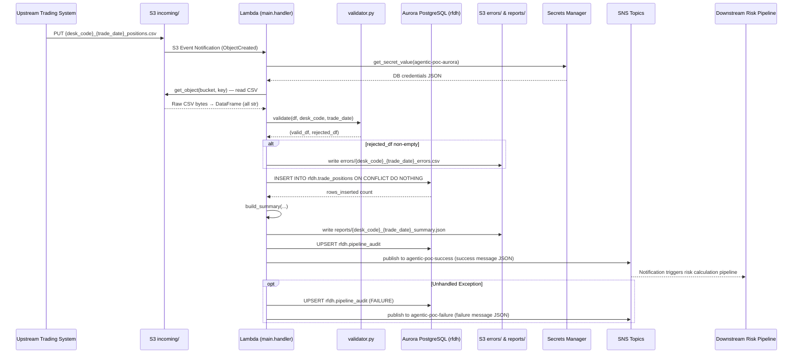
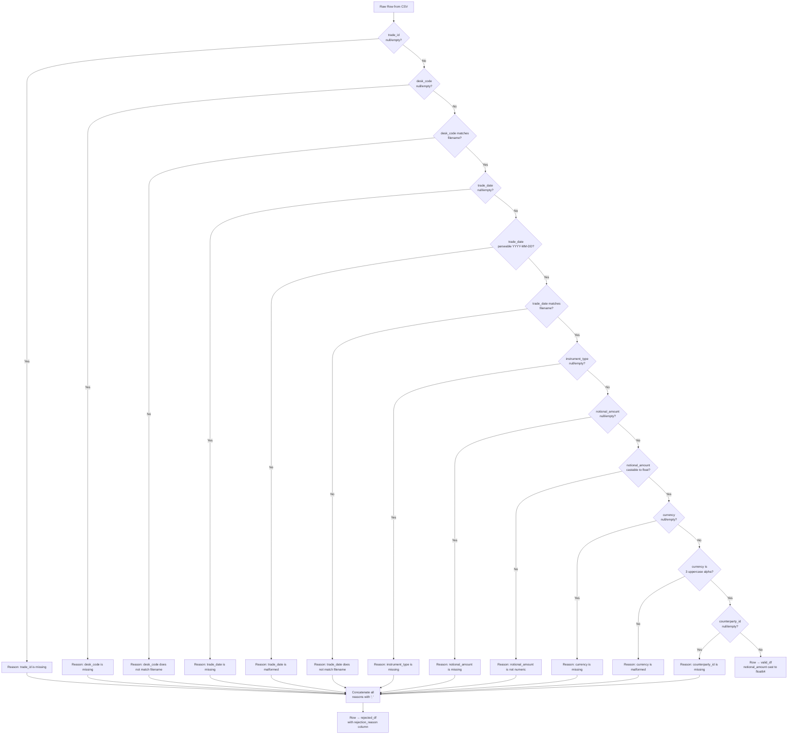
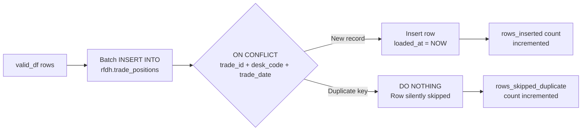
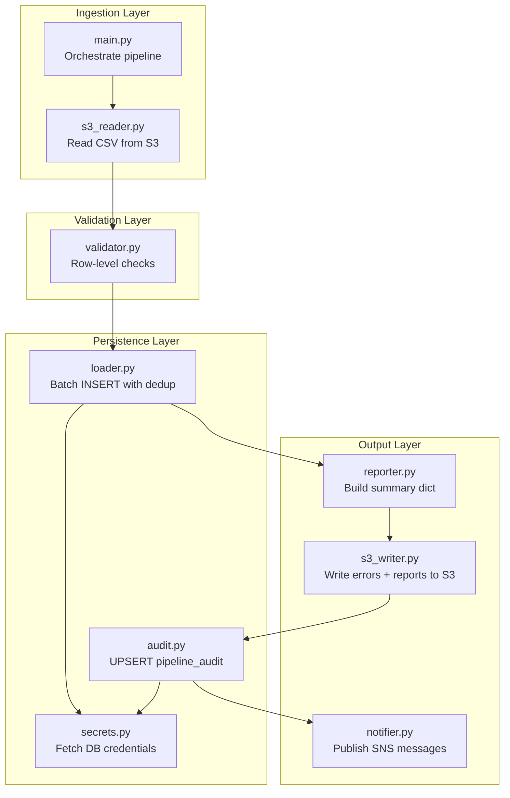

# Technical Design Document
## Daily Trade Position Ingestion
**Project:** agentic-poc-sandbox | **Repo:** nartcr/agentic-poc-sandbox | **Team:** Risk Finance Data Hub | **Date:** June 2026 | **Status:** Draft

---

## COMPONENTS

### `main.py` — Entry Point / Orchestrator
**Function:** `handler(event: dict, context: object) -> dict`

Serves as the Lambda entry point. Receives an S3 event notification, extracts the bucket name and object key from `event["Records"][0]["s3"]`, then orchestrates the full pipeline in sequence:
1. Parse the S3 key to extract `desk_code` and `trade_date` using the filename pattern `{desk_code}_{trade_date}_positions.csv`.
2. Call `s3_reader.read_csv(bucket, key)` → raw DataFrame.
3. Call `validator.validate(df, desk_code, trade_date)` → `(valid_df, rejected_df)`.
4. If `rejected_df` is non-empty, call `s3_writer.write_error_file(rejected_df, desk_code, trade_date)`.
5. Call `loader.load_positions(valid_df)` → `rows_inserted: int`.
6. Call `reporter.build_summary(raw_df, valid_df, rejected_df, rows_inserted, desk_code, trade_date)` → `summary: dict`.
7. Call `s3_writer.write_report(summary, desk_code, trade_date)`.
8. Call `audit.record(desk_code, trade_date, summary, status="SUCCESS")`.
9. Call `notifier.notify_success(summary)`.
10. On any unhandled exception: call `audit.record(..., status="FAILURE")`, call `notifier.notify_failure(error_details)`, re-raise.

Returns `{"statusCode": 200, "body": summary}` on success.

**Reads:** S3 event dict with keys `Records[0].s3.bucket.name`, `Records[0].s3.object.key`.
**Writes:** Nothing directly — delegates to sub-modules.
**Satisfies:** BAC-1, BAC-2, BAC-3, BAC-4, BAC-5, BAC-6, BAC-7, BAC-8.

---

### `s3_reader.py` — S3 File Reader
**Function:** `read_csv(bucket: str, key: str) -> pd.DataFrame`

Uses `boto3.client("s3")` (no credentials in code) to call `get_object(Bucket=bucket, Key=key)`. Reads the response body as a UTF-8 CSV into a pandas DataFrame. All columns are read as `str` (dtype=str) to preserve raw values for validation. Returns the DataFrame with original column names preserved. Raises `ValueError` if the file is empty or has zero rows after header parse.

**Reads:** S3 object at `s3://{bucket}/{key}`. Expected CSV columns (as raw strings): `trade_id`, `desk_code`, `trade_date`, `instrument_type`, `notional_amount`, `currency`, `counterparty_id`.
**Writes:** Nothing to persistent storage.
**Satisfies:** BAC-1, BAC-6.

---

### `validator.py` — Row-Level Validation
**Function:** `validate(df: pd.DataFrame, expected_desk_code: str, expected_trade_date: str) -> tuple[pd.DataFrame, pd.DataFrame]`

Applies validation rules row-by-row. A row is **rejected** if any of the following conditions are true (multiple reasons are concatenated with `"; "`):

| Check | Rejection Reason String |
|---|---|
| `trade_id` is null/empty | `"trade_id is missing"` |
| `desk_code` is null/empty | `"desk_code is missing"` |
| `desk_code` != `expected_desk_code` | `"desk_code does not match filename"` |
| `trade_date` is null/empty | `"trade_date is missing"` |
| `trade_date` not parseable as `YYYY-MM-DD` | `"trade_date is malformed"` |
| `trade_date` != `expected_trade_date` | `"trade_date does not match filename"` |
| `instrument_type` is null/empty | `"instrument_type is missing"` |
| `notional_amount` is null/empty | `"notional_amount is missing"` |
| `notional_amount` not castable to `float` | `"notional_amount is not numeric"` |
| `currency` is null/empty | `"currency is missing"` |
| `currency` not exactly 3 uppercase alphabetic chars | `"currency is malformed"` |
| `counterparty_id` is null/empty | `"counterparty_id is missing"` |

Returns:
- `valid_df`: rows passing all checks, with `notional_amount` cast to `float64`.
- `rejected_df`: rejected rows with all original columns plus a new column `rejection_reason: str`.

**Reads:** Raw DataFrame from `s3_reader`, `expected_desk_code: str`, `expected_trade_date: str`.
**Writes:** Nothing to persistent storage.
**Satisfies:** BAC-2.

---

### `loader.py` — Database Loader
**Function:** `load_positions(df: pd.DataFrame) -> int`

Calls `secrets.get_db_credentials()` to obtain connection parameters. Connects to Aurora PostgreSQL. Executes a batch `INSERT INTO rfdh.trade_positions (...) VALUES %s ON CONFLICT (trade_id, desk_code, trade_date) DO NOTHING` using `psycopg2.extras.execute_values`. Returns the number of rows actually inserted (i.e., `cursor.rowcount` after execute — rows skipped by `DO NOTHING` are not counted).

Input DataFrame columns consumed: `trade_id`, `desk_code`, `trade_date`, `instrument_type`, `notional_amount`, `currency`, `counterparty_id`.
The `loaded_at` column is populated with `NOW()` server-side via a column default.

**Reads:** Validated DataFrame; DB credentials from Secrets Manager via `secrets.py`.
**Writes:** Rows to `rfdh.trade_positions`.
**Satisfies:** BAC-1, BAC-3.

---

### `reporter.py` — Summary Report Builder
**Function:** `build_summary(raw_df: pd.DataFrame, valid_df: pd.DataFrame, rejected_df: pd.DataFrame, rows_inserted: int, desk_code: str, trade_date: str) -> dict`

Computes the following fields (all in a single dict):

| Field | Computation |
|---|---|
| `desk_code` | parameter |
| `trade_date` | parameter |
| `total_rows_received` | `len(raw_df)` |
| `rows_validated` | `len(valid_df)` |
| `rows_inserted` | `rows_inserted` (from loader) |
| `rows_skipped_duplicate` | `len(valid_df) - rows_inserted` |
| `rows_rejected` | `len(rejected_df)` |
| `processing_timestamp_et` | `datetime.now(pytz.timezone("America/Toronto")).isoformat()` |
| `rows_by_desk_code` | `valid_df.groupby("desk_code").size().to_dict()` |
| `notional_min` | `float(valid_df["notional_amount"].min())` if non-empty else `None` |
| `notional_max` | `float(valid_df["notional_amount"].max())` if non-empty else `None` |
| `null_rates` | `{col: float(raw_df[col].isna().mean()) for col in raw_df.columns}` |

Returns the summary dict.

**Reads:** In-memory DataFrames from validator + loader output.
**Writes:** Nothing to persistent storage.
**Satisfies:** BAC-4, BAC-7.

---

### `s3_writer.py` — S3 Output Writer

**Function:** `write_error_file(rejected_df: pd.DataFrame, desk_code: str, trade_date: str) -> str`

Serializes `rejected_df` to CSV (including `rejection_reason` column). Writes to:
`s3://{S3_BUCKET}/errors/{desk_code}_{trade_date}_errors.csv`
Returns the full S3 key written.

**Function:** `write_report(summary: dict, desk_code: str, trade_date: str) -> str`

Serializes `summary` dict to JSON (UTF-8, `indent=2`). Writes to:
`s3://{S3_BUCKET}/reports/{desk_code}_{trade_date}_summary.json`
Returns the full S3 key written.

Both functions use `boto3.client("s3").put_object(...)`. The bucket is read from `os.environ["S3_BUCKET"]`.

**Reads:** In-memory DataFrames / dicts.
**Writes:**
- `s3://{S3_BUCKET}/errors/{desk_code}_{trade_date}_errors.csv`
- `s3://{S3_BUCKET}/reports/{desk_code}_{trade_date}_summary.json`
**Satisfies:** BAC-2, BAC-4.

---

### `notifier.py` — SNS Notification Publisher

**Function:** `notify_success(summary: dict) -> None`

Publishes to the SNS topic ARN from `os.environ["SNS_SUCCESS_TOPIC_ARN"]`. Message is a JSON-serialized dict (see Data Contracts → SNS). Subject: `"Trade Position Ingestion SUCCESS — {desk_code} {trade_date}"`.

**Function:** `notify_failure(error_details: dict) -> None`

Publishes to the SNS topic ARN from `os.environ["SNS_FAILURE_TOPIC_ARN"]`. Message is a JSON-serialized dict (see Data Contracts → SNS). Subject: `"Trade Position Ingestion FAILURE — {desk_code} {trade_date}"`.

Both functions use `boto3.client("sns").publish(...)`. No credentials in code.

**Reads:** Summary dict or error details dict.
**Writes:** SNS message to appropriate topic.
**Satisfies:** BAC-5.

---

### `audit.py` — Pipeline Audit Logger

**Function:** `record(desk_code: str, trade_date: str, summary: dict, status: str, error_message: str = None) -> None`

Connects to Aurora PostgreSQL using `secrets.get_db_credentials()`. Executes:
```sql
INSERT INTO rfdh.pipeline_audit
  (desk_code, trade_date, status, total_rows_received, rows_inserted,
   rows_rejected, rows_skipped_duplicate, processing_timestamp_et,
   s3_input_key, error_message, service_identity)
VALUES (...)
ON CONFLICT (desk_code, trade_date) DO UPDATE SET
  status = EXCLUDED.status,
  total_rows_received = EXCLUDED.total_rows_received,
  rows_inserted = EXCLUDED.rows_inserted,
  rows_rejected = EXCLUDED.rows_rejected,
  rows_skipped_duplicate = EXCLUDED.rows_skipped_duplicate,
  processing_timestamp_et = EXCLUDED.processing_timestamp_et,
  error_message = EXCLUDED.error_message
```
`service_identity` is read from `os.environ["SERVICE_IDENTITY"]`. `processing_timestamp_et` is set to `datetime.now(pytz.timezone("America/Toronto"))`.

**Reads:** Summary dict, status string, optional error message string; DB credentials from `secrets.py`.
**Writes:** One row per `(desk_code, trade_date)` in `rfdh.pipeline_audit`.
**Satisfies:** BAC-7 (regulatory audit trail, ET timestamps).

---

### `secrets.py` — Credentials Provider

**Function:** `get_db_credentials() -> dict`

Calls `boto3.client("secretsmanager").get_secret_value(SecretId=os.environ["DB_SECRET_ID"])`. Parses the returned JSON string and returns a dict with keys: `host`, `port`, `dbname`, `username`, `password`. No caching — each call fetches fresh credentials to support rotation. Returns the dict for callers to construct a `psycopg2.connect(...)` call.

**Reads:** Secrets Manager secret identified by `os.environ["DB_SECRET_ID"]`.
**Writes:** Nothing.
**Satisfies:** BAC-8.

---

## AWS SERVICES

| Service | Role |
|---|---|
| **AWS Lambda** | Compute runtime. Executes `main.handler` triggered by S3 event notifications. Stateless, event-driven, scales to concurrent file arrivals. |
| **Amazon S3** | (1) Input: stores incoming position CSV files under `incoming/` prefix. (2) Output: stores error files under `errors/` and summary reports under `reports/`. Trigger source for Lambda via S3 event notification. |
| **Amazon Aurora PostgreSQL** | Persistent reporting database. Hosts `rfdh.trade_positions` and `rfdh.pipeline_audit` tables. Accessed via `psycopg2` with credentials from Secrets Manager. |
| **AWS Secrets Manager** | Stores Aurora DB credentials (host, port, dbname, username, password) under secret ID `agentic-poc-aurora`. Retrieved at Lambda cold-start via `secrets.py`. |
| **Amazon SNS** | Publishes success and failure notifications to downstream subscribers. Two topics: success and failure. The downstream risk calculation pipeline subscribes to the success topic. |

---

## DATA CONTRACTS

### Database Tables

#### `rfdh.trade_positions`

```
Table: rfdh.trade_positions
Purpose: Stores validated, deduplicated trade position records.
```

| Column | Data Type | Constraints | Notes |
|---|---|---|---|
| `id` | `BIGSERIAL` | PRIMARY KEY | Surrogate key, auto-increment |
| `trade_id` | `VARCHAR(100)` | NOT NULL | From source file |
| `desk_code` | `VARCHAR(50)` | NOT NULL | From source file / filename |
| `trade_date` | `DATE` | NOT NULL | From source file / filename |
| `instrument_type` | `VARCHAR(100)` | NOT NULL | From source file |
| `notional_amount` | `NUMERIC(20, 6)` | NOT NULL | Validated numeric |
| `currency` | `CHAR(3)` | NOT NULL | 3-char ISO currency code |
| `counterparty_id` | `VARCHAR(100)` | NOT NULL | From source file |
| `loaded_at` | `TIMESTAMPTZ` | NOT NULL, DEFAULT NOW() | Server-side insert timestamp |

**Unique Constraint:** `UNIQUE (trade_id, desk_code, trade_date)` — this is the deduplication key used in `ON CONFLICT`.

**Indexes:**
- `idx_trade_positions_desk_date` ON `(desk_code, trade_date)` — supports per-desk daily queries.
- `idx_trade_positions_trade_date` ON `(trade_date)` — supports full-day position queries.

---

#### `rfdh.pipeline_audit`

```
Table: rfdh.pipeline_audit
Purpose: Audit trail of every file processed — supports OSFI examination readiness and SOX compliance.
```

| Column | Data Type | Constraints | Notes |
|---|---|---|---|
| `id` | `BIGSERIAL` | PRIMARY KEY | Surrogate key |
| `desk_code` | `VARCHAR(50)` | NOT NULL | Processing unit identifier |
| `trade_date` | `DATE` | NOT NULL | Date of positions in file |
| `status` | `VARCHAR(20)` | NOT NULL | `'SUCCESS'` or `'FAILURE'` |
| `total_rows_received` | `INTEGER` | | Raw row count from file |
| `rows_inserted` | `INTEGER` | | Rows written to DB |
| `rows_rejected` | `INTEGER` | | Rows failing validation |
| `rows_skipped_duplicate` | `INTEGER` | | Validated rows not inserted (already existed) |
| `processing_timestamp_et` | `TIMESTAMPTZ` | NOT NULL | Processing time in ET |
| `s3_input_key` | `VARCHAR(500)` | | Full S3 key of input file |
| `error_message` | `TEXT` | | Populated on FAILURE |
| `service_identity` | `VARCHAR(200)` | NOT NULL | From `os.environ["SERVICE_IDENTITY"]` |

**Unique Constraint:** `UNIQUE (desk_code, trade_date)` — upserted on re-processing (DO UPDATE SET).

**Index:**
- `idx_pipeline_audit_trade_date` ON `(trade_date)`.

---

### S3 Paths

| Purpose | Key Pattern | Format | Content |
|---|---|---|---|
| Input file | `incoming/{desk_code}_{trade_date}_positions.csv` | CSV, UTF-8, comma-delimited, with header row | Columns: `trade_id`, `desk_code`, `trade_date`, `instrument_type`, `notional_amount`, `currency`, `counterparty_id` |
| Error file | `errors/{desk_code}_{trade_date}_errors.csv` | CSV, UTF-8, with header row | All input columns + `rejection_reason` column |
| Summary report | `reports/{desk_code}_{trade_date}_summary.json` | JSON, UTF-8, `indent=2` | Summary dict (see `reporter.py`) |

**Bucket:** `os.environ["S3_BUCKET"]` → `agentic-poc-data-533266968934`

---

### Secrets

**Environment Variable:** `DB_SECRET_ID` → `agentic-poc-aurora`

Expected JSON structure inside the secret:
```json
{
  "host":     "<aurora-cluster-endpoint>",
  "port":     5432,
  "dbname":   "app",
  "username": "<db-username>",
  "password": "<db-password>"
}
```

---

### SNS Topics

**Success Topic:** `os.environ["SNS_SUCCESS_TOPIC_ARN"]` → `arn:aws:sns:us-east-1:533266968934:agentic-poc-success`

Success message JSON structure:
```json
{
  "event_type": "TRADE_POSITION_INGESTION_SUCCESS",
  "desk_code": "<string>",
  "trade_date": "<YYYY-MM-DD>",
  "total_rows_received": "<integer>",
  "rows_inserted": "<integer>",
  "rows_skipped_duplicate": "<integer>",
  "rows_rejected": "<integer>",
  "processing_timestamp_et": "<ISO-8601 datetime with ET offset>",
  "report_s3_key": "<string>",
  "error_file_s3_key": "<string | null>"
}
```

**Failure Topic:** `os.environ["SNS_FAILURE_TOPIC_ARN"]` → `arn:aws:sns:us-east-1:533266968934:agentic-poc-failure`

Failure message JSON structure:
```json
{
  "event_type": "TRADE_POSITION_INGESTION_FAILURE",
  "desk_code": "<string | null>",
  "trade_date": "<YYYY-MM-DD | null>",
  "s3_input_key": "<string>",
  "error_type": "<exception class name>",
  "error_message": "<string>",
  "processing_timestamp_et": "<ISO-8601 datetime with ET offset>"
}
```

---

### Environment Variables Summary

| Variable Name | Value / Description |
|---|---|
| `S3_BUCKET` | `agentic-poc-data-533266968934` |
| `DB_SECRET_ID` | `agentic-poc-aurora` |
| `SNS_SUCCESS_TOPIC_ARN` | `arn:aws:sns:us-east-1:533266968934:agentic-poc-success` |
| `SNS_FAILURE_TOPIC_ARN` | `arn:aws:sns:us-east-1:533266968934:agentic-poc-failure` |
| `SERVICE_IDENTITY` | Lambda function name / ARN (e.g. set to `os.environ["AWS_LAMBDA_FUNCTION_NAME"]` at deploy time, or a static identifier like `rfdh-trade-position-ingestion`) |

---

## DATA FLOW

### End-to-End Pipeline Flow



---

### Validation Decision Logic



---

### Idempotent Load Logic



---

### Swimlane: Responsibilities by Module



---

## TECHNICAL ACCEPTANCE CRITERIA

### TAC-1: All valid rows are available in the reporting database before the next morning's risk run
- **Mechanism:** `loader.load_positions(valid_df)` executes `INSERT INTO rfdh.trade_positions (...) VALUES %s ON CONFLICT (trade_id, desk_code, trade_date) DO NOTHING` using `psycopg2.extras.execute_values`. The Lambda is triggered by S3 `ObjectCreated` events and completes within the processing window.
- **Test Assertion:** After `loader.load_positions(valid_df)` is called with N non-duplicate rows, `SELECT COUNT(*) FROM rfdh.trade_positions WHERE desk_code = :desk_code AND trade_date = :trade_date` returns a count ≥ N. The summary dict field `rows_inserted` equals the count of net-new rows.

---

### TAC-2: Rejected rows are written to an error file with specific, human-readable rejection reasons
- **Mechanism:** `validator.validate()` appends a `rejection_reason` column (string, semicolon-delimited for multiple failures) to every rejected row. `s3_writer.write_error_file()` writes this DataFrame to `s3://{S3_BUCKET}/errors/{desk_code}_{trade_date}_errors.csv`.
- **Test Assertion:** Given an input row with `notional_amount = "abc"` and empty `currency`, the error CSV row's `rejection_reason` column equals `"notional_amount is not numeric; currency is missing"` (or the applicable messages for those two failures). The error file key exists in S3 after processing.

---

### TAC-3: Re-processing the same file does not create duplicate records
- **Mechanism:** `INSERT INTO rfdh.trade_positions (...) ON CONFLICT (trade_id, desk_code, trade_date) DO NOTHING`. The unique constraint `UNIQUE (trade_id, desk_code, trade_date)` on the table enforces deduplication at the database level.
- **Test Assertion:** Call `loader.load_positions(valid_df)` twice with the same DataFrame. After the first call, `rows_inserted = N`. After the second call, `rows_inserted = 0` and `rows_skipped_duplicate = N`. `SELECT COUNT(*) FROM rfdh.trade_positions WHERE desk_code = :desk_code AND trade_date = :trade_date` returns N (unchanged) after the second call.

---

### TAC-4: The summary report accurately reflects received, accepted, and rejected row counts
- **Mechanism:** `reporter.build_summary()` computes `total_rows_received = len(raw_df)`, `rows_validated = len(valid_df)`, `rows_inserted` from loader return value, `rows_skipped_duplicate = len(valid_df) - rows_inserted`, `rows_rejected = len(rejected_df)`. The invariant `total_rows_received == rows_validated + rows_rejected` must hold. This dict is written to `s3://{S3_BUCKET}/reports/{desk_code}_{trade_date}_summary.json`.
- **Test Assertion:** For an input of 10 rows (7 valid, 3 rejected), `summary["total_rows_received"] == 10`, `summary["rows_validated"] == 7`, `summary["rows_rejected"] == 3`. The JSON file at the expected S3 key is parseable and contains all required fields including `notional_min`, `notional_max`, `null_rates`, `rows_by_desk_code`, and `processing_timestamp_et`.

---

### TAC-5: The downstream risk pipeline is notified automatically via SNS — no manual trigger
- **Mechanism:** `notifier.notify_success(summary)` calls `boto3.client("sns").publish(TopicArn=os.environ["SNS_SUCCESS_TOPIC_ARN"], Message=json.dumps(payload), Subject=...)` where `payload` contains `event_type`, `desk_code`, `trade_date`, `rows_inserted`, `processing_timestamp_et`, `report_s3_key`, and `error_file_s3_key`. On failure, `notifier.notify_failure(error_details)` publishes to `os.environ["SNS_FAILURE_TOPIC_ARN"]`.
- **Test Assertion:** `notifier.notify_success` is called exactly once per successful `handler` invocation. The SNS message body is valid JSON parseable as a dict with `event_type == "TRADE_POSITION_INGESTION_SUCCESS"` and all required fields present. Using a mock SNS client, verify `publish` is called with `TopicArn = os.environ["SNS_SUCCESS_TOPIC_ARN"]`.

---

### TAC-6: Full processing of a 10,000-row file completes within 60 seconds
- **Mechanism:** `psycopg2.extras.execute_values` performs a single batched insert (not row-by-row). Validation uses vectorized pandas operations where possible.
- **Test Assertion:** A synthetic 10,000-row valid CSV processed end-to-end through `handler` (with real DB and S3 connections) completes within 60 seconds wall-clock time as measured by the test harness. Lambda timeout must be set to ≥ 120 seconds to accommodate up to 100,000-row files.

---

### TAC-7: All timestamps in reports and audit records are in Eastern Time (America/Toronto)
- **Mechanism:** Every timestamp is generated using `datetime.now(pytz.timezone("America/Toronto"))`. The `processing_timestamp_et` field in the summary dict, SNS messages, and `rfdh.pipeline_audit` table all use this value. The `TIMESTAMPTZ` column in Aurora stores the value with timezone offset.
- **Test Assertion:** `reporter.build_summary(...)["processing_timestamp_et"]` is a string that, when parsed with `datetime.fromisoformat(...)`, has a UTC offset of either `-05:00` (EST) or `-04:00` (EDT) depending on DST. Same assertion applies to `rfdh.pipeline_audit.processing_timestamp_et` for an inserted audit row.

---

### TAC-8: No credentials appear in code or configuration files; all secrets are fetched at runtime from Secrets Manager
- **Mechanism:** `secrets.get_db_credentials()` calls `boto3.client("secretsmanager").get_secret_value(SecretId=os.environ["DB_SECRET_ID"])` at call time. No connection strings, passwords, or tokens appear anywhere in source files.
- **Test Assertion:** Static analysis scan of all `.py` files in the repo finds zero occurrences of patterns matching passwords, connection strings, or hardcoded ARNs. Unit tests mock `boto3.client("secretsmanager")` and verify `get_secret_value` is called with `SecretId = os.environ["DB_SECRET_ID"]` and that the returned credentials are used to construct the `psycopg2.connect(...)` call.

---

## OPEN QUESTIONS

None. All business logic requirements are unambiguous and infrastructure configuration is supplied.

---

## ASSUMPTIONS

| # | Assumption | Impact if Wrong |
|---|---|---|
| A-1 | The Lambda function is triggered by an S3 `ObjectCreated` event on the `incoming/` prefix. The event passes a single S3 record per invocation (one file per Lambda execution). | If multiple records can arrive in a single event, `main.handler` must iterate over `event["Records"]`. |
| A-2 | The CSV files use a comma (`,`) as the delimiter, UTF-8 encoding, and include a header row with exactly the column names: `trade_id`, `desk_code`, `trade_date`, `instrument_type`, `notional_amount`, `currency`, `counterparty_id`. No BOM. | If delimiter, encoding, or column names differ, `s3_reader.py` must be parameterized accordingly. |
| A-3 | `trade_date` in the filename follows ISO format `YYYY-MM-DD` (e.g. `EQDESK_2026-06-15_positions.csv`). | If the date format in the filename differs, the filename parser in `main.py` must be updated. |
| A-4 | The `rfdh` schema and both tables (`trade_positions`, `pipeline_audit`) are pre-created in the Aurora database before this Lambda is deployed. DDL is not executed by the application code. | If tables do not exist, inserts will fail with a relation-not-found error. A migration script should be included as a separate deliverable. |
| A-5 | The `UNIQUE (trade_id, desk_code, trade_date)` constraint on `rfdh.trade_positions` is created as part of table DDL (pre-existing infrastructure). The application relies on it for `ON CONFLICT`. | If the constraint is missing, `ON CONFLICT` will not function and duplicates may be inserted. |
| A-6 | The Aurora PostgreSQL instance is network-accessible from the Lambda (same VPC, or VPC peering with appropriate security group rules). | If Lambda cannot reach Aurora, all DB operations will fail at the network layer. |
| A-7 | One file corresponds to exactly one `desk_code`. A single file will not contain rows for multiple desk codes other than the one embedded in the filename. | If multi-desk files are possible, the `rows_by_desk_code` grouping in the summary becomes the primary breakdown, and the `desk_code` mismatch validation rule (TAC-2) would need revisiting. |
| A-8 | Files deposited in `incoming/` are complete at the time the S3 event fires (i.e., no partial/streaming writes). No file locking mechanism is required. | If partial files are possible, a file-ready marker pattern or S3 multipart completion check may be needed. |
| A-9 | The Lambda execution role has IAM permissions for: `s3:GetObject` on `incoming/*`, `s3:PutObject` on `errors/*` and `reports/*`, `secretsmanager:GetSecretValue` on `agentic-poc-aurora`, and `sns:Publish` on both SNS topic ARNs. | If any permission is missing, the corresponding operation will fail with an `AccessDeniedException`. |
| A-10 | `psycopg2-binary` (or `psycopg2` with Lambda layer) is available in the Python 3.9 Lambda deployment package. `pandas` and `pytz` are similarly included. | If libraries are absent, the Lambda will fail at import time. Dependencies must be packaged in a Lambda layer or included in the deployment ZIP. |
| A-11 | The `pipeline_audit` table uses `(desk_code, trade_date)` as its upsert key. A re-processed file for the same desk/date overwrites the previous audit record rather than appending a new row. | If a full history of re-processing attempts is required for audit, the unique constraint should be removed and `ON CONFLICT DO UPDATE` replaced with a plain `INSERT`, accepting multiple rows per desk/date. |
| A-12 | Error files and report files written to S3 overwrite previous files for the same `desk_code` and `trade_date` on re-processing (S3 `put_object` is naturally idempotent/last-writer-wins). This is the desired behavior for re-runs. | If version history of error/report files is needed, key patterns should include a timestamp or version suffix. |